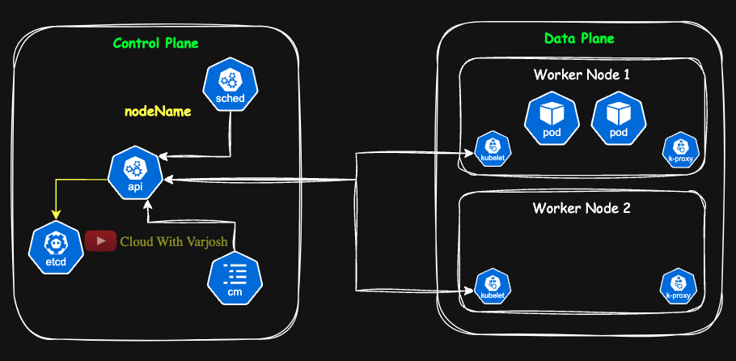

# Day 15: Manual Scheduling & Static Pods | MUST KNOW Concepts | CKA Course 2025

## Video reference for Day 15 is the following:

[](https://www.youtube.com/watch?v=moZNbHD5Lxg&ab_channel=CloudWithVarJosh)

---
## ⭐ Support the Project  
If this **repository** helps you, give it a ⭐ to show your support and help others discover it! 

---


## Table of Contents
- [Prerequisite: Revisiting Kubernetes Deployment Workflow](#prerequisite-revisiting-kubernetes-deployment-workflow)
- [Understanding the Kubernetes Scheduler](#understanding-the-kubernetes-scheduler)
- [Manual Scheduling](#manual-scheduling)
  - [Why is Manual Scheduling Required?](#why-is-manual-scheduling-required)
  - [What is Manual Scheduling?](#what-is-manual-scheduling)
  - [How is Manual Scheduling Useful?](#how-is-manual-scheduling-useful)
  - [Demonstration: Assigning a Pod to a Node](#demonstration-assigning-a-pod-to-a-node)
  - [Running a Pod on the Control Plane](#running-a-pod-on-the-control-plane)
  - [How Can Control Plane Run Workloads?](#how-can-control-plane-run-workloads)
- [Static Pods](#static-pods)
  - [Why Do We Need Static Pods?](#why-do-we-need-static-pods)
  - [What Are Static Pods?](#what-are-static-pods)
  - [How Are Static Pods Useful?](#how-are-static-pods-useful)
  - [Mirror Pods in Kubernetes](#mirror-pods-in-kubernetes)
  - [Demonstration: Creating a Static Pod](#demonstration-creating-a-static-pod)
  - [Why Deleting Static Pods via `kubectl` Doesn't Work](#why-deleting-static-pods-via-kubectl-doesnt-work)
  - [Accessing Static Pods in Production vs. KIND](#accessing-static-pods-in-production-vs-kind)
- [Key Differences Between Manual Scheduling & Static Pods](#key-differences-between-manual-scheduling--static-pods)
- [Summary](#summary)
- [References](#references)


---

## **Prerequisite: Revisiting Kubernetes Deployment Workflow**

Before we dive into **manual scheduling** and **static pods**, it's essential to recall how the **Kubernetes scheduler** works.  

📌 **If you haven’t already, please visit the following resources to refresh your understanding:**  
- **GitHub Repo:** [Kubernetes Deployment Workflow](https://github.com/CloudWithVarJosh/CKA-Certification-Course-2025/tree/main/Day%207#kubernetes-deployment-workflow)  
- **Video Explanation:** [Kubernetes Scheduler & Deployment Workflow](https://www.youtube.com/watch?v=-9Cslu8PTjU&list=PLmPit9IIdzwRjqD-l_sZBDdPlcSfKqpAt&index=7&t=897s&ab_channel=CloudWithVarJosh)  

---

## **Understanding the Kubernetes Scheduler**  



The **Kubernetes Scheduler** is responsible for **automatically placing pods** on available worker nodes based on factors like:  
- **Resource availability** (CPU, memory).  
- **Taints and tolerations** (node restrictions, discussed in Day 16).  
- **Affinity and anti-affinity rules** (Discussed in Day 17).  

However, **can we bypass the scheduler and manually assign pods to nodes?**  
Yes! This is where **manual scheduling** comes in.

---

## **Manual Scheduling**  

### **Why is Manual Scheduling Required?**  
- **Troubleshooting & Debugging:** Helps diagnose scheduling issues by placing a pod on a specific node.  
- **Testing Node-Specific Workloads:** Ensures an application runs on a specific node (e.g., a database pod requiring an SSD).  
- **Kubernetes Scheduler Is Disabled:** If the scheduler is down, you can manually schedule pods as a fallback.  

### **What is Manual Scheduling?**  
Manual scheduling means **explicitly assigning a pod to a node** using the `nodeName` field in the pod’s YAML manifest. This completely **bypasses the Kubernetes scheduler**.

### **How is Manual Scheduling Useful?**  
- Guarantees that a pod runs on a particular node.  
- Useful when a workload requires **special hardware** or **node-specific configurations**.  
- Helps **troubleshoot** why a pod isn't scheduled automatically.

---

### **Demonstration: Assigning a Pod to a Node**  

#### **Step 1: List Available Nodes**  
```sh
kubectl get nodes
```

#### **Step 2: Create a Pod and Assign It to a Specific Node**  

```yaml
apiVersion: v1
kind: Pod
metadata:
  name: nginx-manual
spec:
  nodeName: my-second-cluster-worker2  # Assign pod to a specific worker node
  containers:
    - name: nginx
      image: nginx
```

#### **Step 3: Apply the Manifest**
```sh
kubectl apply -f nginx-manual.yaml
```

#### **Step 4: Verify the Pod's Node Assignment**  
```sh
kubectl get pods -o wide
```

#### **Step 5: What Happens If the Node Does Not Exist?** 

When a Pod specifies a wrong or non-existent `nodeName`, Kubernetes cannot schedule the Pod and it remains in the `Pending` state. Over time, due to resource management and cluster policies, Kubernetes deletes the Pod to avoid resource wastage and maintain cluster efficiency.

**Note:** Kubernetes has a default **garbage collection mechanism** that removes stuck or unschedulable Pods after a certain period.

---

### **Running a Pod on the Control Plane**  

By default, workloads are placed on **worker nodes**. However, you can manually schedule a pod on the **control-plane node**.

Modify the `nodeName` field:
```yaml
spec:
  nodeName: my-second-cluster-control-plane
```

Apply the updated YAML and verify that the **control plane node is running the pod**.

---

### **How Can Control Plane Run Workloads?**  
- We know that the **scheduler is bypassed** when performing manual scheduling. This is why, even though the control-plane node has a **taint** that **prevents** workloads from running unless they have a matching **toleration**, we were still able to manually assign a pod to the control-plane node.
**We will explore this Taints & Tolerations in the next lecture.**
- The **kubelet** is also installed on control plane nodes, enabling them to run both **static pods and manually scheduled pods**. This is why control plane nodes can execute pods even though scheduling is typically reserved for worker nodes. Additionally, the **kube-proxy** is also running on control plane nodes, facilitating network communication and load balancing for the pods, just as it does on worker nodes.

---

## **Static Pods**  

### **Why Do We Need Static Pods?**  
- **Essential for Control Plane Components:** Kubernetes components like `kube-apiserver`, `etcd`, and `kube-scheduler` run as static pods.  
- **Guaranteed Scheduling:** They always run on a specific node, even if the API server is down.  

### **What Are Static Pods?**  
Static pods are **created and managed by the Kubelet** on a node, **not by the Kubernetes API server**.

📌 **Static pods are defined in `/etc/kubernetes/manifests/`**. 

Unlike regular pods, **static pods** are **not managed by the Kubernetes API server**, meaning you **cannot modify them using `kubectl` commands**. Instead, they are directly managed by the **kubelet** on each node, and any changes require **modifying or deleting the static pod manifest file** on the node itself.

Static pods **can be defined on any node**, including both **control plane** and **worker nodes**. However, they are **not scheduled by the Kubernetes Scheduler**—instead, they are directly managed by the **kubelet** running on the node where their manifest exists.  

Static Pods are always bound to **one** Kubelet on a **specific node**.

### **Mirror Pods in Kubernetes**
When a **static pod** is created, the **kubelet automatically generates a corresponding "mirror pod"** on the Kubernetes API server. These **mirror pods** allow static pods to be **visible when running `kubectl get pods`**, but **they cannot be controlled or managed through the API server**.

#### **How Mirror Pods Work**
- The **Kubelet detects static pod manifests** from `/etc/kubernetes/manifests/`.
- It **creates and manages the static pod** independently from the Kubernetes control plane.
- To **ensure visibility** in `kubectl get pods`, **Kubelet creates a "mirror pod" on the API server**.
- **However, this mirror pod is read-only**—it **cannot be modified, deleted, or controlled** using `kubectl`.

#### **Pod Naming Convention for Mirror Pods**
- The **name of the mirror pod** follows this pattern:
  ```plaintext
  <static-pod-name>-<node-hostname>
  ```
- Example:
  ```
  nginx-static-pod-my-second-cluster-worker2
  ```

---

### **Demonstration: Creating a Static Pod**  

📌 **Static pods are defined in `/etc/kubernetes/manifests/`**.  

#### **Step 1: Create a Static Pod YAML File**
```sh
cat <<EOF > /etc/kubernetes/manifests/static-pod.yaml
apiVersion: v1
kind: Pod
metadata:
  name: nginx-static-pod
spec:
  containers:
    - name: nginx-container
      image: nginx
      ports:
        - containerPort: 80
EOF
```

#### **Step 2: Verify That the Pod Is Running**
```sh
kubectl get pods -A
```

---

### **Why Does `kubectl delete` Not Permanently Remove Static Pods?**  

```sh
kubectl delete pods nginx-static-pod-my-second-cluster-control-plane
```  

🚨 **This deletes the pod, but it will be recreated!**  
Since static pods are managed directly by the **kubelet**, it detects their absence and automatically **recreates them** if their YAML files still exist.  

📌 **To permanently remove a static pod, delete its manifest file:**  
```sh
rm /etc/kubernetes/manifests/static-pod.yaml
```  
Once the YAML file is removed, the **kubelet stops recreating the pod**.

---

### **Accessing Static Pods in Production vs. KIND**  

#### **How to Access Static Pod Manifests in Production Clusters**  
In a **production Kubernetes cluster**, nodes are typically **virtual machines (VMs) or physical servers** running on cloud providers (AWS, GCP, Azure) or on-premises infrastructure.  

- Since these are actual machines, **you would SSH into the node** to access the static pod manifests.  
- The static pod manifests are stored in the directory:  
  ```sh
  /etc/kubernetes/manifests/
  ```
- To view or edit a static pod manifest in a production cluster:  
  ```sh
  ssh user@worker-node-ip
  sudo vi /etc/kubernetes/manifests/static-pod.yaml
  ```

---

## **Key Differences Between Manual Scheduling & Static Pods**  

| Feature             | Manual Scheduling | Static Pods |
|---------------------|------------------|-------------|
| Created by         | User (via API Server)   | Kubelet (directly) |
| Requires API Server | Yes              | No |
| Managed by Scheduler | No (assigned manually) | No (Kubelet manages) |
| Use Cases          | Testing, debugging, workload placement | Running control plane components, always-on workloads |
| How to Delete?     | `kubectl delete pod` | Remove manifest file from `/etc/kubernetes/manifests/` |

---

## **Summary**  

- **Manual Scheduling** allows us to assign pods to specific nodes using `nodeName`.  
- **Static Pods** run **without the API server** and are managed directly by the **Kubelet**.  
- Static pods are used for **control plane components** and **essential workloads**.  
- **KIND allows scheduling on the control plane** because it has **no default taints**.  
- To delete a **static pod**, remove its YAML file from `/etc/kubernetes/manifests/`.  

---

## **References**  
- [Kubernetes Scheduler Documentation](https://kubernetes.io/docs/concepts/scheduling-eviction/kube-scheduler/)  
- [Kubernetes Static Pods Guide](https://kubernetes.io/docs/tasks/configure-pod-container/static-pod/)  