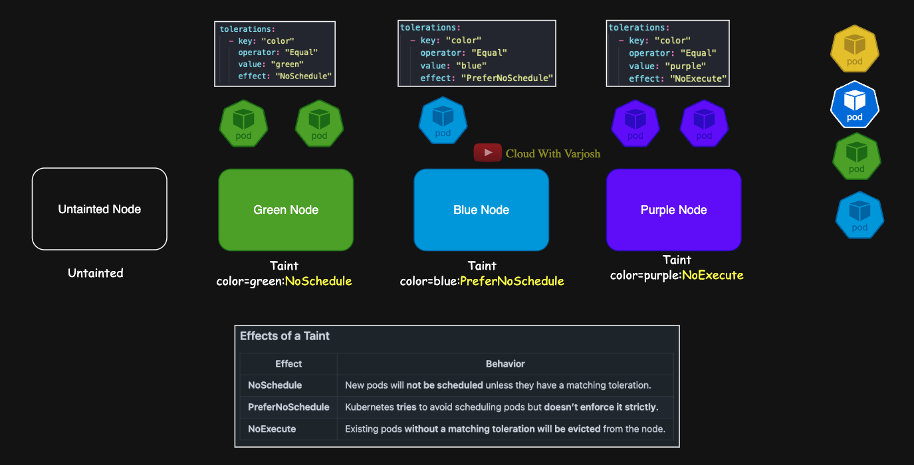

# Day 16: Mastering Kubernetes Taints & Tolerations | Essential Scheduling Control | CKA Course 2025

## Video reference for Day 16 is the following:

[](https://www.youtube.com/watch?v=G_Ro0urceF0&ab_channel=CloudWithVarJosh)  

---
## ⭐ Support the Project  
If this **repository** helps you, give it a ⭐ to show your support and help others discover it! 

---

## Table of Contents

- [Introduction: Why Taints and Tolerations?](#introduction-why-taints-and-tolerations)
- [When Do We Need Taints & Tolerations?](#when-do-we-need-taints--tolerations)
- [Understanding Taints](#understanding-taints)

- [Understanding Tolerations](#understanding-tolerations)
- [How Taints and Tolerations Work Together](#how-taints-and-tolerations-work-together)
- [Demonstration](#demonstration)
- [Deleting Taints](#deleting-taints)
- [Advanced Concepts of Kubernetes Taints & Tolerations](#advanced-concepts-of-kubernetes-taints--tolerations)
- [Key Takeaways](#key-takeaways)
- [Reference](#reference)

---

## Introduction: Why Taints and Tolerations?  

In Kubernetes, **Taints and Tolerations** help **control which pods can be scheduled on which nodes**. They allow cluster administrators to **prevent certain workloads from running on specific nodes** while allowing exceptions when necessary.  

### **When Do We Need Taints & Tolerations?**  
Taints and tolerations are useful in several scenarios:  

| **Use Case** | **Explanation** |
|-------------|----------------|
| **Dedicated Nodes** | Taint nodes with a GPU to restrict them to **GPU-intensive workloads** only. |
| **Isolating Critical Workloads** | Ensure **critical workloads** run separately from **non-critical** ones. |
| **Preventing Scheduling on Control Plane Nodes** | Control plane nodes should only run **Kubernetes system workloads**. |
| **Maintenance Mode** | Taint a node under **maintenance** to stop new pods from being scheduled. |
| **Node Resource Constraints** | Prevent pods from being scheduled on nodes with **low memory or CPU**. |

### **Important:**  
Taints and tolerations **only apply during scheduling**. If a pod is already running on a node, adding a taint **will not remove the existing pod** (unless you use the **NoExecute** effect).  

---

## Understanding Taints  

A **Taint** is applied to a **node** to indicate that it **should not accept certain pods** unless they explicitly tolerate it.  

### **How to Apply a Taint?**  
Taints are applied to nodes using the following command:  
```sh
kubectl taint nodes <node-name> <key>=<value>:<effect>
```
**Example:**  
```sh
kubectl taint nodes my-second-cluster-worker storage=ssd:NoSchedule
kubectl taint nodes my-second-cluster-worker2 storage=hdd:NoSchedule
```
- These commands taint `my-second-cluster-worker` to **only allow pods that tolerate `storage=ssd:NoSchedule`** and `my-second-cluster-worker2` to **only allow pods that tolerate `storage=hdd:NoSchedule`**.  

---

### **Effects of a Taint**  

| **Effect** | **Behavior** |
|------------|-------------|
| **NoSchedule** | New pods will **not be scheduled** unless they have a matching toleration. |
| **PreferNoSchedule** | Kubernetes **tries** to avoid scheduling pods but **doesn’t enforce it strictly**. |
| **NoExecute** | Existing pods **without a matching toleration will be evicted** from the node. |

---

## Understanding Tolerations  

A **Toleration** is applied to a **pod**, allowing it to **bypass a node’s taint** and be scheduled on it.  

### **How to Apply a Toleration?**  
Tolerations are defined in a pod’s YAML under `spec.tolerations`:  

```yaml
tolerations:
  - key: "storage"
    operator: "Equal"
    value: "ssd"
    effect: "NoSchedule"
```
- This **tolerates** nodes that have the taint `storage=ssd:NoSchedule`, allowing the pod to be scheduled on them.  
- The **Effect in the toleration must match the Effect in the taint** for it to take effect.  

---

### **Toleration Operators**  

| **Operator** | **Behavior** |
|-------------|-------------|
| **Equal** (default) | The key and value **must exactly match** the taint. |
| **Exists** | Only the key needs to match, and the value is ignored. |

**Example using Exists:**  
```yaml
tolerations:
  - key: "storage"
    operator: "Exists"
    effect: "NoSchedule"
```
- This toleration allows the pod to be scheduled on **any node that has a `storage` taint**, regardless of its value.  

---

## How Taints and Tolerations Work Together  

| **Node Taint** | **Pod Toleration** | **Effect** |
|---------------|-------------------|-----------|
| `storage=ssd:NoSchedule` | **Toleration exists** | ✅ Pod **can** be scheduled. |
| `storage=ssd:NoSchedule` | ❌ No toleration | ❌ Pod **cannot** be scheduled. |
| `storage=ssd:NoExecute` | **Toleration exists** | ✅ Pod **remains** on the node. |
| `storage=ssd:NoExecute` | ❌ No toleration | ❌ Pod **is evicted** from the node. |

---

## Demonstration  

### **Cluster Setup for Demonstration**  

Before we begin applying taints and tolerations, let's first review our Kubernetes cluster setup. We have a total of **three nodes** in our KIND cluster:  

1. **my-second-cluster-control-plane** → This is the **control-plane node** responsible for managing the cluster.  
2. **my-second-cluster-worker** → This is a **worker node** where application workloads can be scheduled.  
3. **my-second-cluster-worker2** → This is another **worker node** available for scheduling workloads.  


### **Applying Taints**  
```sh
kubectl taint nodes my-second-cluster-worker storage=ssd:NoSchedule
kubectl taint nodes my-second-cluster-worker2 storage=hdd:NoSchedule
```

### **Verifying Taints**  
```sh
kubectl describe node my-second-cluster-worker | grep -i taint
kubectl describe node my-second-cluster-worker2 | grep -i taint
```

### **Checking Pod Behavior Without Tolerations**  
```sh
kubectl run mypod --image=nginx
kubectl get pods
kubectl describe pod mypod
```
- The pod **remains in Pending state** because it does **not tolerate any taint**.

### **Why the Pod Is Not Scheduled on the Control Plane Node?**  

After applying taints to our worker nodes, we will attempt to create a pod **without any tolerations** using:  

```sh
kubectl run mypod --image=nginx
```

Since **both worker nodes are tainted**, the pod will remain in a **Pending** state. However, it **will not be scheduled on the control plane node either**.  

#### **Checking Why the Pod Is Not Scheduled**  

To investigate, we will describe the pod using:  

```sh
kubectl describe pod mypod
```

This will show that **no suitable nodes were found for scheduling** due to the applied taints. Additionally, the **control plane node is already tainted by default**, preventing general workloads from running on it.  

#### **Verifying the Taint on the Control Plane Node**  

We can check the taints applied to the control plane node using:  

```sh
kubectl describe node my-second-cluster-control-plane | grep Taints
```

Expected output:  

```plaintext
Taints: node-role.kubernetes.io/control-plane:NoSchedule
```

This confirms that the **control plane node has a taint that prevents regular workloads from being scheduled on it** unless the pod has a corresponding toleration.  

### **Why Were We Able to Manually Schedule a Pod on the Control Plane in the Previous Lecture?**  

In the **previous lecture**, we manually scheduled a pod on the control plane node by specifying the `nodeName` field in the pod definition. This **bypasses the Kubernetes scheduler entirely**.  

📌 **Key takeaway:**  
- **Taints and tolerations affect scheduling decisions made by the scheduler.**  
- **When using manual scheduling (`nodeName` field), the scheduler is not involved, so taints are ignored.**  

We will now proceed with applying tolerations to allow pods to be scheduled despite the taints.

### **Scheduling Pods with Tolerations**  

```yaml
apiVersion: apps/v1
kind: Deployment
metadata:
  name: app1-deploy
spec:
  replicas: 3
  selector:
    matchLabels:
      app: app1
  template:
    metadata:
      labels:
        app: app1
    spec:
      tolerations:
        - key: "storage"
          operator: "Equal"
          value: "ssd"
          effect: "NoSchedule"
      containers:
        - name: nginx-container
          image: nginx
```
- This deployment **will now schedule pods on `my-second-cluster-worker`**.  

### **Using the Exists Operator**  

```yaml
apiVersion: v1
kind: Pod
metadata:
  name: mypod2
spec:
  containers:
  - name: nginx
    image: nginx
  tolerations:
    - key: "storage"
      operator: "Exists"
      effect: "NoSchedule"
```
- This **pod can be placed on either `my-second-cluster-worker` or `my-second-cluster-worker2`**.  

### **Applying Multiple Taints and Tolerations**  
```sh
kubectl taint nodes my-second-cluster-worker env=prod:NoSchedule
kubectl taint nodes my-second-cluster-worker2 env=dev:NoSchedule
```

```yaml
tolerations:
  - key: "storage"
    operator: "Exists"
    effect: "NoSchedule"
  - key: "env"
    operator: "Equal"
    value: "prod"
    effect: "NoSchedule"
```
- This pod tolerates **any `storage` taint** and **only `env=prod:NoSchedule`**.  

---

### **Deleting Taints**  

Once a taint is applied to a node, it restricts pod scheduling based on the taint effect. If you need to **remove a taint** from a node, you can do so using the following syntax:  

```sh
kubectl taint nodes <node-name> <key>=<value>:<effect>- 
```
Here, the **`-` (hyphen) at the end** tells Kubernetes to **remove** the taint.  

#### **Example: Removing a Single Taint**  
Let's remove the `storage=ssd:NoSchedule` taint from **my-second-cluster-worker**:  
```sh
kubectl taint nodes my-second-cluster-worker storage=ssd:NoSchedule-  
```
Now, the **ssd taint is removed**, and pods that don’t have the matching toleration can be scheduled on this node.  

#### **Example: Removing All Applied Taints**  
We previously applied the following taints:  
```sh
kubectl taint nodes my-second-cluster-worker storage=ssd:NoSchedule
kubectl taint nodes my-second-cluster-worker2 storage=hdd:NoSchedule
kubectl taint nodes my-second-cluster-worker env=prod:NoSchedule
kubectl taint nodes my-second-cluster-worker2 env=dev:NoSchedule
```
To **remove all these taints**, run:  
```sh
kubectl taint nodes my-second-cluster-worker storage=ssd:NoSchedule-
kubectl taint nodes my-second-cluster-worker2 storage=hdd:NoSchedule-
kubectl taint nodes my-second-cluster-worker env=prod:NoSchedule-
kubectl taint nodes my-second-cluster-worker2 env=dev:NoSchedule-
```

#### **Verifying Taint Removal**  
After deleting the taints, verify that they are removed using:  
```sh
kubectl describe node my-second-cluster-worker | grep -i taints
kubectl describe node my-second-cluster-worker2 | grep -i taints
```
If no taints are listed in the output, the nodes are now available to schedule any pod without restrictions.

--- 

# **Advanced Concepts of Kubernetes Taints & Tolerations**  

In Kubernetes, **taints and tolerations** control **where pods can be scheduled**. This analogy will help you **visualize** how these concepts work together with **scheduler preferences**.

---

## **Scenario: A Cluster with Colored Nodes**  

Imagine we have **four nodes** in our Kubernetes cluster, each with different taints and behaviors:  



1. **Green Node** 🟢  
   - **Taint:** `color=green:NoSchedule`  
   - **Effect:** Only pods that have a **matching toleration (`color=green`)** can be scheduled here.  
   - **Current Pods:** **Two green pods** (already running).  

2. **Blue Node** 🔵  
   - **Taint:** `color=blue:PreferNoSchedule`  
   - **Effect:** The **scheduler tries to avoid placing pods** here unless necessary.  
   - **Current Pods:** **One blue pod** (already running).  

3. **Purple Node** 🟣  
   - **Taint:** `color=green:NoExecute`  
   - **Effect:** Any pod **without a matching toleration** will be **immediately evicted** from this node.  
   - **Current Pods:** **Two purple pods** (already running).  

4. **Untainted Node** ⚪  
   - **A new node has been added to the cluster.**  
   - **No taints applied** → Any pod **can be placed here** freely.  

---

## **Effect of Taints on Existing Pods**  

- **Pods in the Green Node (`NoSchedule`) and Blue Node (`PreferNoSchedule`) remain unaffected.**  
- **Pods in the Purple Node (`NoExecute`) will be evicted if they lack a matching toleration.**  
  - If you wish to **delay eviction**, you can use the **`tolerationSeconds`** parameter.  

---

## **Pod Placement Behavior for New Pods**  


Now, let's introduce **four new pods** and observe where they are scheduled **after a new untainted node is added to the cluster**.  

### **1️⃣ Yellow Pod**  
- **Toleration:** `color=yellow`  
- **Placement Possibilities:**  
  - **Untainted Node** (✅ **First Preference**)  
  - **Blue Node** (🔵 **Only if the untainted node is full**)  

📌 **Explanation:**  
Since **no node has a `color=yellow` taint**, this pod is treated like a normal pod.  
- **Untainted node** is the **first preference** because it has no restrictions.  
- **Blue node (`PreferNoSchedule`) is the second choice**—the scheduler **will try to avoid it** unless the untainted node **does not have enough capacity**.  

---

### **2️⃣ Normal Pod (No Toleration)**  
- **Toleration:** None  
- **Placement Possibilities:**  
  - **Untainted Node** (✅ **First Preference**)  
  - **Blue Node** (🔵 **Only if the untainted node is full**)  

📌 **Explanation:**  
- Since this pod **has no toleration**, it **cannot be scheduled on Green or Purple nodes**.  
- **Untainted node is the first choice** since it has **no restrictions**.  
- **Blue node (`PreferNoSchedule`) is the backup option** if there is no space in the untainted node.  

---

### **3️⃣ Green Pod**  
- **Toleration:** `color=green`  
- **Placement Possibilities:**  
  - **Green Node** (🟢 **First Preference**)  
  - **Untainted Node** (⚪ **Second Preference**)  
  - **Blue Node** (🔵 **Only if both green and untainted nodes are full**)  

📌 **Explanation:**  
- **Green node is the first preference** because it **has a matching taint (`color=green:NoSchedule`)**.  
- **If the green node is full**, the scheduler **places pods on the untainted node**.  
- In testing, when **one replica was created**, it was scheduled on the **green node**.  
- When **ten replicas were created**, Kubernetes **distributed them across the green and untainted nodes** based on available **resources**.  
- **Blue node (`PreferNoSchedule`) is only used if both green and untainted nodes are full.**  

---

### **4️⃣ Blue Pod**  
- **Toleration:** `color=blue`  
- **Placement Possibilities:**  
  - **Untainted Node** (⚪ **First Preference**)  
  - **Blue Node** (🔵 **Only if untainted node is full**)  

📌 **Explanation:**  
- Since **PreferNoSchedule is a soft restriction**, the scheduler **tries to avoid the blue node** if there are better options.  
- In testing:  
  - **One replica** → Placed in the **untainted node** (scheduler prefers it over `PreferNoSchedule`).  
  - **Ten replicas** → Pods were **distributed equally** between the untainted and blue nodes.

---

## **Why Should Pods with Tolerations Prefer Tainted Nodes?**  

We would want **pods with tolerations to be scheduled onto nodes with matching taints** rather than being placed on **untainted nodes**.  

Imagine if:  
- The **Green Node** is reserved for **Project A**, and  
- The **Untainted Node** belongs to **Project B**.  

Now, if a **Project A pod** is scheduled on the **Untainted Node (Project B's node)**, it **breaks the intended segregation**.  

### **Real-World Use Cases for This Segregation**  
This type of isolation can be based on:  
- **Projects:** Different teams using dedicated nodes.  
- **Departments:** Keeping workloads from Finance, HR, and IT separate.  
- **Environments:** Ensuring **production** workloads do not mix with **development** ones.  
- **Criticality:** Reserving high-performance nodes for **mission-critical applications**.  

By combining **taints, tolerations, node affinity, and anti-affinity**, we can **enforce stricter placement policies** and **ensure workloads run on appropriate nodes** based on project requirements and business logic.
We will discuss **node affinity and anti-affinity** in the next lecture.


---

## Key Takeaways  

- **Taints are applied to nodes**, **Tolerations are applied to pods**.  
- A **pod can only be scheduled** on a tainted node if it has a **matching toleration**.  
- **Three effects of taints:** `NoSchedule`, `PreferNoSchedule`, and `NoExecute`.  
- **Operator `Equal` (default)** requires an exact match, while **`Exists` ignores values**.  
- **Taints and tolerations work together** to control **pod placement and node access**.

---

## Reference
[Understanding Taints and Tolerations in Kubernetes](https://kubernetes.io/docs/concepts/scheduling-eviction/taint-and-toleration/)
