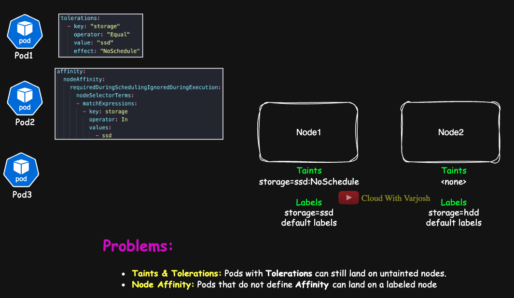

# Day 18: Taints & Tolerations vs. Node Affinity | MASTER Pod Scheduling Control | CKA Course 2025

## Video reference for Day 18 is the following:
[](https://www.youtube.com/watch?v=itEINIqjNfE&ab_channel=CloudWithVarJosh)

---
## ⭐ Support the Project  
If this **repository** helps you, give it a ⭐ to show your support and help others discover it! 

---
## **Introduction: Why Compare Taints & Tolerations with Node Affinity?**

In our previous lectures, we explored **Taints & Tolerations** and **Node Affinity** separately. But the real question is:  

🚀 **Why do we need Node Affinity when we already have Taints & Tolerations?**  

To answer this, let's recall what we observed while working with each approach.

### **What We Observed with Taints & Tolerations**
- Taints **repel** pods from certain nodes unless they have a matching **toleration**.
- Even if a node has a **hard restriction** (NoSchedule or NoExecute), **pods with tolerations could still land on untainted nodes**.
- **Taints & Tolerations do not interact with node labels**.

### **What We Observed with Node Affinity**
- **Node Affinity** ensures pods are scheduled only on nodes with **specific labels**.
- Pods **without affinity** can still land on labeled nodes.
- **Affinity does not prevent other pods from using the same node** unless combined with taints.

### **Why Do We Need Both?**
The **ideal scheduling strategy** requires using **both** Taints & Tolerations **and** Node Affinity.  

- **Taints prevent unwanted pods from landing on a node.**  
- **Node Affinity ensures the right pods land on the right nodes.**  
- **Without both, pods might still land on unintended nodes.**  

### **Key Takeaway**
🚀 **If a pod has both Tolerations and Node Affinity, we can confidently predict where it will land.**  

---

## **Scenario: Taints & Tolerations vs. Node Affinity in Action**

Let’s apply our knowledge to a real-world scenario.  



### **Cluster Setup**
We have **two worker nodes** in our cluster:  

| **Node**  | **Labels**  | **Taints** |
|-----------|------------|------------|
| **Node1** | `storage=ssd` | `storage=ssd:NoSchedule` |
| **Node2** | `storage=hdd` | No taints |

📌 **Important:**  
- **The default node labels** (e.g., `topology.kubernetes.io/region`, `kubernetes.io/hostname`, etc.) **vary based on where your cluster is running** (AWS, Azure, GCP, On-Premises etc..). Some of these labels are **added by the cloud provider**.

### **Pod1: Using Only Tolerations**
```yaml
tolerations:
  - key: "storage"
    operator: "Equal"
    value: "ssd"
    effect: "NoSchedule"
```
✅ **Can be scheduled on Node1 (because it tolerates the taint).**  
✅ **Can also be scheduled on Node2 (because it is untainted).**  

🚨 **Problem:**  
- **The pod should ideally run on an SSD-backed node**, but it **might still land on Node2 (HDD)**.  
- **Tolerations alone do not force pods onto specific nodes.**  

---


### **Pod2: Using Only Node Affinity**

```yaml
affinity:
  nodeAffinity:
    requiredDuringSchedulingIgnoredDuringExecution:
      nodeSelectorTerms:
      - matchExpressions:
        - key: storage
          operator: In
          values:
            - ssd
```

❌ **Cannot be scheduled on Node1** – although Node1 has the required label (`storage=ssd`), it also has a taint (`storage=ssd:NoSchedule`) and the pod lacks a matching toleration.

❌ **Cannot be scheduled on Node2** – it doesn’t have the required label, so it fails the node affinity condition.

---

### ⚠️ **Important Caveat**

* This pod does **not** include a **toleration** for `storage=ssd:NoSchedule`.
* Even though Node1 matches the affinity **label**, the **taint** on Node1 (`storage=ssd:NoSchedule`) will prevent the pod from being scheduled there.
* As a result, **Pod2 will remain in a `Pending` state** unless a matching toleration is added.

---

### Common Misconception

> "Node affinity alone is enough to land a pod on a specific node."

---

### **Pod3: No Tolerations, No Node Affinity**
✅ **Can be scheduled on Node2 (because it has no taints).**  
❌ **Cannot be scheduled on Node1 (because of the `NoSchedule` taint).**  

🚨 **Problem:**  
- **What if this pod actually requires SSD storage?**  
- **It lands on Node2 (HDD), which might not be appropriate for its workload.**  

---

## **Final Solution: Using Both Taints & Tolerations + Node Affinity**
To ensure **Pod1 & Pod2** **only** land on Node1, we combine **Tolerations** and **Node Affinity**:

```yaml
tolerations:
  - key: "storage"
    operator: "Equal"
    value: "ssd"
    effect: "NoSchedule"
affinity:
  nodeAffinity:
    requiredDuringSchedulingIgnoredDuringExecution:
      nodeSelectorTerms:
      - matchExpressions:
        - key: storage
          operator: In
          values:
          - ssd
```
✅ **Now, Pod1 & Pod2 will only be placed on Node1.**  
❌ **They will not land on Node2, even if there is space.**  

---

## **Why Not Use Only Node Affinity?**
You might be thinking:  
💡 *"If my pods have affinity defined, won’t they already land on the right nodes?"*  

From an **administrator's perspective**, you want **complete control** over **which pods can run on which nodes**.  

### **Key Reasons to Use Taints & Tolerations Along with Node Affinity**  
- **Taints prevent unintended workloads** from running on specialized or maintenance nodes.  
- **Without taints, pods without affinity** can still land on specialized nodes, disrupting workload segregation.  
- **Taints ensure only pods with explicit tolerations** are scheduled on critical or reserved nodes.  
- **Without taints, general workloads may consume resources** on nodes meant for high-priority applications.  
- **Taints provide an extra layer of enforcement** beyond node affinity, giving admins greater scheduling control.   

---

## **Key Takeaways**
| **Concept** | **Behavior** |
|-------------|--------------|
| **Taints & Tolerations** | Tolerations allow pods to run on tainted nodes, but do not guarantee placement. |
| **Node Affinity** | Pods with affinity are forced to run on labeled nodes but do not repel other pods. |
| **Pods Without Both** | May end up on inappropriate nodes, leading to suboptimal performance. |
| **Best Practice** | Use **both** to get full control over pod scheduling. |

---

## **Conclusion**
By using **Taints & Tolerations together with Node Affinity**, you can:  
✅ **Prevent unwanted pods from running on specialized nodes.**  
✅ **Ensure the right pods land on the right nodes.**  
✅ **Achieve predictable, controlled workload placement.**  

---

## **References**
- [Kubernetes Documentation: Taints & Tolerations](https://kubernetes.io/docs/concepts/scheduling-eviction/taint-and-toleration/)
- [Kubernetes Documentation: Node Affinity](https://kubernetes.io/docs/concepts/scheduling-eviction/assign-pod-node/)