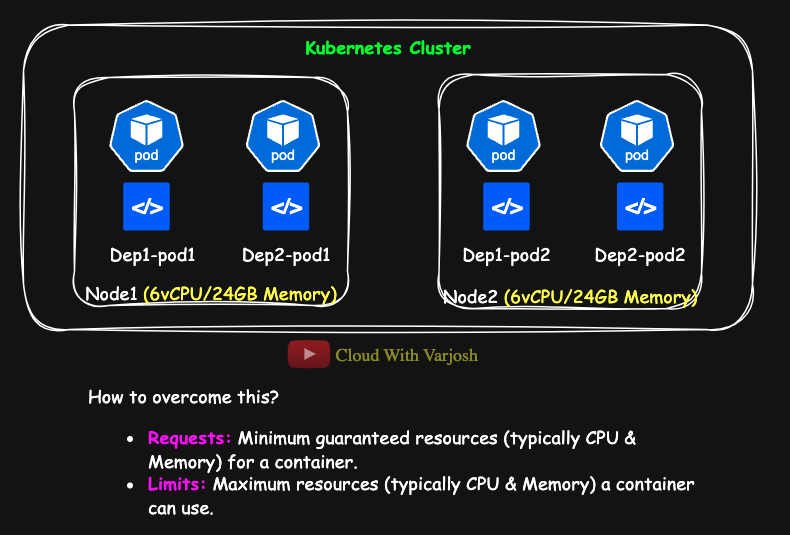
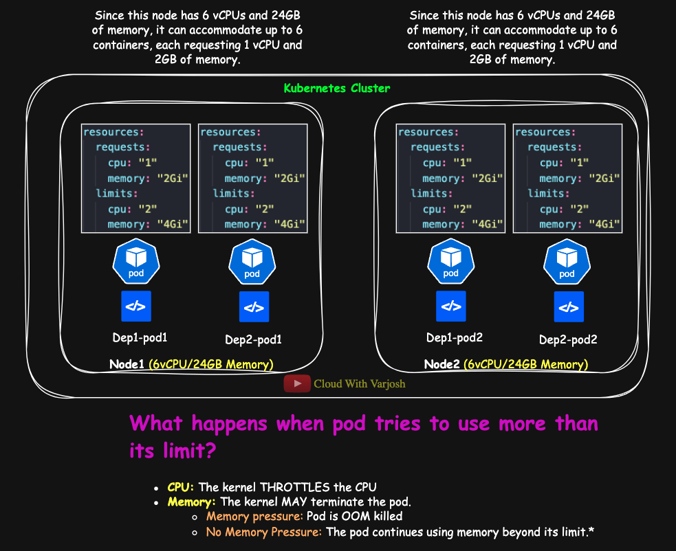
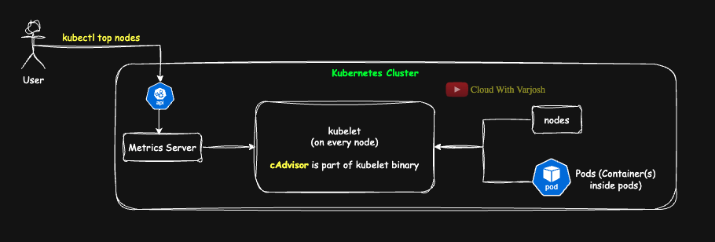
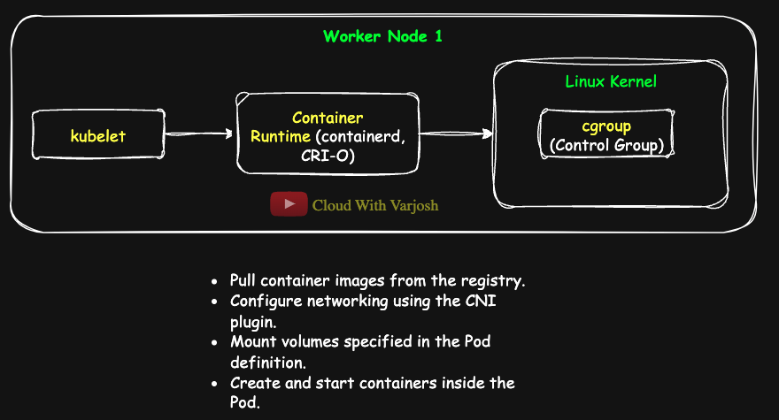

# Day 19: MASTER Kubernetes Requests, Limits & LimitRange | MUST-KNOW Concepts | CKA Course 2025

## Video reference for Day 19 is the following:
[](https://www.youtube.com/watch?v=Bu4RocrMx0g&ab_channel=CloudWithVarJosh)

---
## ⭐ Support the Project  
If this **repository** helps you, give it a ⭐ to show your support and help others discover it! 

---

## Table of Contents

- [Introduction](#introduction)
  - [Why Do We Need Requests and Limits?](#why-do-we-need-requests-and-limits)
- [Benefits of Using Requests and Limits](#benefits-of-using-requests-and-limits)
- [Applying Requests and Limits to Our Example](#applying-requests-and-limits-to-our-example)
- [What are Requests and Limits?](#what-are-requests-and-limits)
- [Resource Types in Kubernetes](#resource-types-in-kubernetes)
- [How Requests and Limits Work](#how-requests-and-limits-work)
  - [How Requests Affect Scheduling](#how-requests-affect-scheduling)
  - [How Limits Affect Running Containers](#how-limits-affect-running-containers)
- [What Happens When a Pod Exceeds Requests?](#what-happens-when-a-pod-exceeds-requests)
- [What Happens When a Pod Exceeds Limits?](#what-happens-when-a-pod-exceeds-limits)
  - [CPU Limits: CPU Throttling](#cpu-limits-cpu-throttling)
  - [Memory Limits: OOM Kills](#memory-limits-oom-kills)
- [Monitoring Resource Utilization in Kubernetes](#monitoring-resource-utilization-in-kubernetes)
- [How Kubernetes Collects Metrics](#how-kubernetes-collects-metrics)
- [Why Does kubectl top nodes Fail Without the Metrics Server?](#why-does-kubectl-top-nodes-fail-without-the-metrics-server)
- [Installing the Metrics Server](#installing-the-metrics-server)


---

## Introduction  

### **Why Do We Need Requests and Limits?**  



Imagine a Kubernetes cluster with the following setup:  
- **Node1** and **Node2**, each with **6 vCPUs and 24GB memory**.  
- **Two deployments**: `deployment-1` and `deployment-2`, each with **two pods**.  
- **Pod distribution**:  
  - `dep1-pod1` runs on **Node1**  
  - `dep1-pod2` runs on **Node2**  
  - `dep2-pod1` runs on **Node1**  
  - `dep2-pod2` runs on **Node2**  

Everything runs smoothly until **deployment-2 starts malfunctioning**. Due to a bug in its code, its pods begin consuming all available node resources, causing **resource starvation** for `deployment-1`. The malfunctioning pods take over CPU and memory, **creating a noisy neighbor problem**—where one workload unfairly affects the performance of others.

🚀 **Solution: Requests and Limits**  
To prevent this, we use **Requests and Limits** to ensure that each pod gets its fair share of resources.  
- **Requests** define the **minimum** resources a container needs.  
- **Limits** define the **maximum** resources a container can consume.  

---

## **Benefits of Using Requests and Limits**
1. **Efficient Resource Allocation** – Ensures resources are **optimally used** across the cluster.  
2. **Avoidance of Resource Starvation** – Prevents one workload from **hogging all resources**.  
3. **Cluster Stability** – Ensures Kubernetes can efficiently **schedule and manage** workloads.  
4. **Mitigation of Noisy Neighbor Problem** – Prevents workloads from **disrupting others**.

---


## **Applying Requests and Limits to Our Example**  



We define **requests and limits** as follows:  
```yaml
resources:
  requests:
    memory: "2Gi"
    cpu: "1"
  limits:
    memory: "4Gi"
    cpu: "2"
```

💡 **Understanding Node Capacity:**  
- Each node has **6 vCPUs and 24GB of memory**.  
- If each container requests **1 vCPU and 2GB of memory**, the node can accommodate up to **6 containers**.  
- Even though memory is still available, **no more workloads can be scheduled because CPU is fully allocated**.

--- 

## What are Requests and Limits?  

Kubernetes allows you to **control resource allocation** for containers using:  

| **Resource Constraint** | **Definition** | **Impact** |
|-----------------|---------------------------|----------------------------|
| **Requests** | The minimum CPU/memory a container needs. | Used by the **scheduler** to decide which node to place the Pod on. |
| **Limits** | The maximum CPU/memory a container can use. | Enforced by the **kernel**, preventing overuse. |


---

## Resource Types in Kubernetes  

The most common **resource types** in Kubernetes are:  

| **Resource**           | **Unit**               | **Example**              |
|------------------------|------------------------|--------------------------|
| **CPU**               | Cores (millicores)      | `500m` (0.5 cores)       |
| **Memory**            | Bytes (MiB/GiB)        | `512Mi`, `1Gi`           |
| **Ephemeral Storage** | Bytes (MiB/GiB)        | `500Mi`, `2Gi`           |
| **GPU**               | Vendor-specific        | `nvidia.com/gpu: 1`      |
| **HugePages**         | Bytes (2Mi, 1Gi)       | `hugepages-2Mi: 512Mi`   |
| **Custom Devices**    | Vendor-specific        | `example.com/fpga: 1`    |


Requests and limits **must be defined per container** inside a Pod.

---

## How Requests and Limits Work  

### 1️⃣ **How Requests Affect Scheduling**  

When scheduling a Pod, **Kubernetes checks requests** to determine where the Pod should run.  

Example:  
- A container requests `500m` CPU and `256Mi` memory.  
- The scheduler places it on a node that has **at least** `500m` CPU and `256Mi` memory available.  

If no such node exists, the pod remains in a **Pending state**.  

---

### 2️⃣ **How Limits Affect Running Containers**  

- **CPU Limits:** Enforced using **CPU throttling** (containers get reduced CPU cycles).  
- **Memory Limits:** Enforced using **OOM (Out of Memory) kills** (containers exceeding memory may get terminated).  

We use **"may"** in this context because **OOM (Out of Memory) kills** are not **immediately** enforced but rather **reactively** applied by the kernel when memory pressure occurs.  If there is **enough free memory**, a container **might exceed its memory limit temporarily** without being killed.

**Example:**  
- If a container has a **CPU limit of 1 core**, the kernel will **throttle CPU usage** once it reaches this limit.  
- If a container **exceeds its memory limit**, the **kernel may kill it** to free up memory.  

---

## What Happens When a Pod Exceeds Requests?  

If a container **exceeds its requested resources**, it **can still use more resources** if available on the node.  

Example:  
- A container requests **256MiB** memory but the node has **8GiB** free.  
- The container can use **more than 256MiB** because there are no strict enforcement rules for requests.  

However, **if other workloads need resources**, Kubernetes ensures at least **256MiB** remains available for this container.

---

## What Happens When a Pod Exceeds Limits?  

| **Resource** | **Behavior When Limit is Exceeded** |
|-------------|--------------------------------------|
| **CPU** | **Throttled** (restricted CPU usage). |
| **Memory** | **Killed** (Out of Memory error if memory pressure exists). |

### CPU Limits: CPU Throttling  

- If a container **exceeds its CPU limit**, the **Linux kernel throttles it**.  
- CPU is a **compressible resource**, so workloads slow down instead of failing.  

### Memory Limits: OOM Kills  

- If a container **exceeds its memory limit**, the **kernel may kill it**.  
- Memory is an **incompressible resource**, so exceeding it **results in termination**.  
- **If there is no memory pressure**, the container **may not be killed immediately**.  

---

## Monitoring Resource Utilization in Kubernetes  

To monitor the CPU and memory utilization of our nodes, we use:  

```sh
kubectl top nodes
```

However, if the **Metrics Server** is not installed, this command will fail with the following error:  

```sh
error: Metrics API not available.
```

We briefly discussed the Metrics Server in **Day 7** when covering **Kubernetes Control Plane and Data Plane Components**.  

📌 **Watch Day 7 for More Context:**  
- **YouTube**: [Day 7 YouTube Video](https://www.youtube.com/watch?v=-9Cslu8PTjU&t=972s&ab_channel=CloudWithVarJosh)  
- **GitHub**: [Day 7 GitHub Notes](https://github.com/CloudWithVarJosh/CKA-Certification-Course-2025/tree/main/Day%207)  

---


## **How Kubernetes Collects Metrics**



To understand how **`kubectl top nodes`** (and **`kubectl top pods`**) retrieves resource metrics, let's break down the process:

1. **cAdvisor Collects Metrics (inside kubelet)**

   * **cAdvisor** is built into the **kubelet** and helps it collect CPU, memory, filesystem, and network usage from nodes and pods.
   * You don’t run cAdvisor separately; kubelet leverages it (and runtime/CRI data) to gather container and node stats.

2. **Kubelet Gathers and Exposes Metrics**

   * Each **kubelet** aggregates these stats and **exposes resource metrics over HTTPS (port 10250)**.
   * It provides multiple endpoints; historically **`/stats/summary`** (Summary API), and in newer setups **`/metrics/resource`** (Prometheus exposition for resource usage).

3. **Metrics Server Scrapes the Kubelet (pull model)**

   * The **Metrics Server** periodically **scrapes** each node’s kubelet; it does **not** receive pushed metrics.
   * **Since metrics-server v0.6.x, it queries the kubelet’s `**/metrics/resource**` endpoint (not `/stats/summary`).**
   * Older metrics-server versions used the **Summary API** (`/stats/summary`).
   * Metrics Server keeps recent metrics in-memory and serves them via the aggregated API.

4. **API Aggregation: `kubectl top` via `metrics.k8s.io`**

   * When you run `kubectl top`, the client calls the **Aggregated API** on the **kube-apiserver** at **`apis/metrics.k8s.io/`**.
   * The **API Aggregation Layer** forwards the request to **Metrics Server**, which returns the latest scraped metrics for nodes/pods.

> 📌 **Version Note:** Beginning with **metrics-server v0.6.x**, resource data is fetched from the kubelet at **`/metrics/resource`**. Earlier releases queried **`/stats/summary`**.
 

---

## **Why Does `kubectl top nodes` Fail Without the Metrics Server?**  

Since the **Metrics Server is not installed by default**, the API Server has no way to retrieve CPU and memory usage metrics.  
To fix this, we **must install the Metrics Server**.

---

## **Installing the Metrics Server**  

The **Metrics Server** is a lightweight component that collects and exposes resource utilization metrics.  

### **Step 1: Download the Metrics Server Manifest**  

Visit the latest **Metrics Server release page**:  
📌 **[https://github.com/kubernetes-sigs/metrics-server/releases/latest](https://github.com/kubernetes-sigs/metrics-server/releases/latest)**  

Alternatively, run a Google search:  

```
Install metrics server on Kubernetes
```

### **Step 2: Modify the Metrics Server Deployment for KIND**  

For Kubernetes running on **KIND**, we need to modify the `Deployment` to include `--kubelet-insecure-tls`.  

```yaml
spec:
  containers:
  - args:
    - --cert-dir=/tmp
    - --secure-port=443
    - --kubelet-preferred-address-types=InternalIP,ExternalIP,Hostname
    - --kubelet-insecure-tls
```

🔹 **Why `--kubelet-insecure-tls`?**  
This flag is necessary because **KIND clusters use self-signed certificates**, which the Metrics Server does not trust by default.  

### **Step 3: Apply the Metrics Server Manifest**  

```sh
kubectl apply -f https://github.com/kubernetes-sigs/metrics-server/releases/download/v0.7.2/components.yaml
```

Alternatively, download the YAML file, edit it to add `--kubelet-insecure-tls`, and then apply:  

```sh
kubectl apply -f components.yaml
```

### **Step 4: Verify Metrics Server Installation**  

After installing the Metrics Server, wait a few moments for it to collect data, then run:  

```sh
kubectl top nodes
```

**NOTE: If you still don’t see data, give it a little time and retry.** 

### **Step 5: Ensure the Metrics Server is Running**  

Check if the Metrics Server pod is running in the `kube-system` namespace:  

```sh
kubectl get pods -n kube-system
```

You should see an output similar to:  

```sh
NAME                               READY   STATUS    RESTARTS   AGE
metrics-server-abcdef1234-xyz      1/1     Running   0          1m
```

---

## Demo: Memory Requests & Limits  

We will create a Pod named **memory-demo** with both memory requests and limits.  

### **Step 1: Define a Pod with Memory Limits**  
```yaml
apiVersion: v1
kind: Pod
metadata:
  name: memory-demo
spec:
  containers:
    - name: memory-demo-ctr
      image: polinux/stress
      resources:
        requests:
          memory: "100Mi"
        limits:
          memory: "200Mi"
      command: ["stress"]
      args: ["--vm", "1", "--vm-bytes", "190M", "--vm-hang", "1"]
```
### **Step 2: Explanation**  
- **requests.memory: "100Mi"** → The container is guaranteed at least **100MiB of memory**.  
- **limits.memory: "200Mi"** → The container cannot exceed **200MiB**.  
- **`--vm-bytes 190M`** → Tries to allocate **190MiB of memory** (within the limit).  
- The container **will run successfully** since it does not exceed the memory limit.  

### **Step 3: Increase Memory Usage Beyond Limit**  
Now, let's modify the pod to **exceed the 200Mi limit**:  
```yaml
args: ["--vm", "1", "--vm-bytes", "250M", "--vm-hang", "1"]
```
- The container will now **be OOM killed** because it **exceeds 200MiB**.  
- Run `kubectl get pods -o wide` and `kubectl top pods` to observe the OOM kill.

#### **Why is the Container Killed Despite No Memory Pressure?**  



A container **may** get terminated when it exceeds its memory limit, but **why does this happen even when the node has enough memory?**  

1. **Memory Limits are Enforced by Cgroups:**  
   - When the kubelet starts a container, it passes resource requests and limits to the **container runtime** (containerd, CRI-O, etc.).  
   - The container runtime **creates a cgroup** (Control Group) for the container, enforcing the memory constraints.  

2. **The Linux Kernel Enforces the Limit:**  
   - If a container exceeds its **memory limit**, the **cgroup OOM killer** triggers, terminating the process.  
   - This happens **independently of overall node memory availability**—the limit is per **container**, not the entire node.  

3. **Why Does the Documentation Say "MAY" Get Killed?**  
   - Some Linux configurations (e.g., overcommit settings) **may** allow memory overuse beyond limits in rare cases.  
   - However, by default, **exceeding memory limits results in an immediate OOM kill**—even if the node has free memory.  

Thus, memory limits are **hard constraints** at the container level, enforced by the **Linux kernel via cgroups**, regardless of node memory availability.

### **Step 4: Checking Assigned Requests and Limits**  

After applying the pod configurations, we can verify the assigned **requests and limits** using the following commands:  

#### **Check Requests and Limits at the Node Level**  
```sh
kubectl describe node <node-name>
```
- This displays resource allocation across all pods running on the node.  
- Look for the **Allocated resources** section to see how CPU and memory are distributed.  

#### **Check Requests and Limits at the Pod Level**  
```sh
kubectl get pod <pod-name> -o yaml
```
- This retrieves the **full manifest** of the running pod, showing assigned resource requests and limits.  

#### **Check Requests and Limits at the Deployment Level**  
```sh
kubectl describe deployment <deployment-name>
```
- This provides an overview of requests and limits set at the deployment level.  

This ensures that the configured **resource constraints are correctly applied** and helps troubleshoot scheduling or performance issues.

---

## Demo: CPU Requests & Limits  

We will create a Pod named **cpu-demo** to observe CPU throttling.  

### **Step 1: Define a Pod with CPU Limits**  
```yaml
apiVersion: v1
kind: Pod
metadata:
  name: cpu-demo
spec:
  containers:
    - name: cpu-container
      image: vish/stress
      resources:
        requests:
          cpu: "500m"
        limits:
          cpu: "900m"
      args:
        - -cpus
        - "1"
```

### **Step 2: Explanation**  
- **1 CPU = 1000m** → So `500m` means **half a CPU** and `900m` means **0.9 CPUs**.  
- The **container is allowed to use up to 900m** of CPU but will be **throttled** if it tries to exceed this.  
- Run `kubectl top pods` to observe **CPU throttling**. 

---

## Default Requests and Limits (`LimitRange`)  

If requests and limits **are not explicitly defined**, Kubernetes allows administrators to set **default values** using `LimitRange`.  

## LimitRange: Setting Default Requests and Limits  

A **LimitRange** object allows administrators to enforce **default requests and limits** for CPU and memory in a Kubernetes namespace. If a container does not specify resource requests or limits, the defaults from the LimitRange will be applied.

### LimitRange YAML Example  

```yaml
apiVersion: v1
kind: LimitRange
metadata:
  name: resource-limits
  namespace: default  # Change this to your target namespace
spec:
  limits:
  - type: Container
    default:
      cpu: "2"        # Default CPU limit
      memory: "4Gi"   # Default memory limit
    defaultRequest:
      cpu: "1"        # Default CPU request
      memory: "2Gi"   # Default memory request
    max:
      cpu: "4"        # Maximum CPU a container can request
      memory: "8Gi"   # Maximum memory a container can request
    min:
      cpu: "500m"     # Minimum CPU a container must request
      memory: "512Mi" # Minimum memory a container must request
```

### Explanation  

| **Field**          | **Description** |
|--------------------|----------------|
| **`default`**      | The default resource limits applied when none are specified in the container spec. Example: A container without limits will be capped at **2 CPUs and 4Gi memory**. |
| **`defaultRequest`** | The default resource requests applied when none are defined. Example: A container will be **guaranteed 1 CPU and 2Gi memory** if no requests are set. |
| **`max`**         | The **maximum** resources a container can request. Example: A container **cannot request more than 4 CPUs or 8Gi memory**. |
| **`min`**         | The **minimum** resources a container must request. Example: A container **must request at least 500m CPU and 512Mi memory** to be scheduled. |
| **`type: Container`** | Specifies that these rules apply to **containers** within the namespace. |

---

### Applying the LimitRange  

Apply the LimitRange to a namespace using:  
```sh
kubectl apply -f limitrange.yaml
```

### Verifying the LimitRange  

To check the applied LimitRange:  
```sh
kubectl describe limitrange resource-limits
```
---

## Best Practices for Requests & Limits  

- **Always define CPU & memory requests/limits** in production workloads.  
- **Ensure memory limits match workload needs** to prevent OOM kills.  
- **Monitor resource usage** using `kubectl top pod`.  
- **Use `LimitRange`** to enforce default requests/limits for namespaces.  

---


## References

- [Kubernetes Official Documentation: Managing Compute Resources for Containers](https://kubernetes.io/docs/concepts/configuration/manage-resources-containers/)
- [Assign Memory Resources to Containers and Pods](https://kubernetes.io/docs/tasks/configure-pod-container/assign-memory-resource/)
- [Assign CPU Resources to Containers and Pods](https://kubernetes.io/docs/tasks/configure-pod-container/assign-cpu-resource/)
- [Managing Default CPU Requests and Limits](https://kubernetes.io/docs/tasks/administer-cluster/manage-resources/cpu-default-namespace/)
- [Kubernetes Official Documentation: Managing Resources with LimitRange](https://kubernetes.io/docs/concepts/policy/limit-range/)
- [Kubernetes Task: Default Memory Requests and Limits for a Namespace](https://kubernetes.io/docs/tasks/administer-cluster/manage-resources/memory-default-namespace/)

---