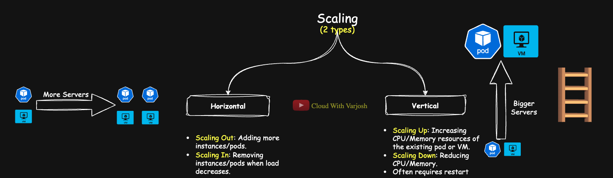
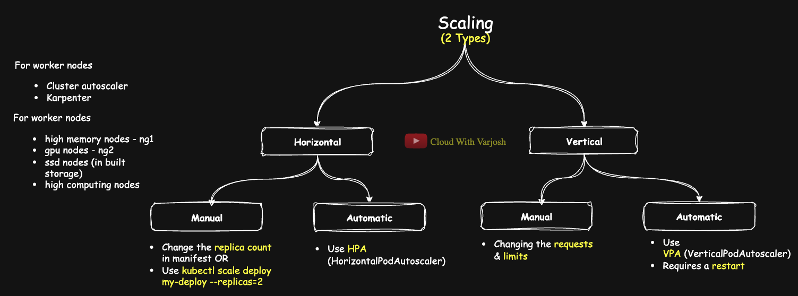
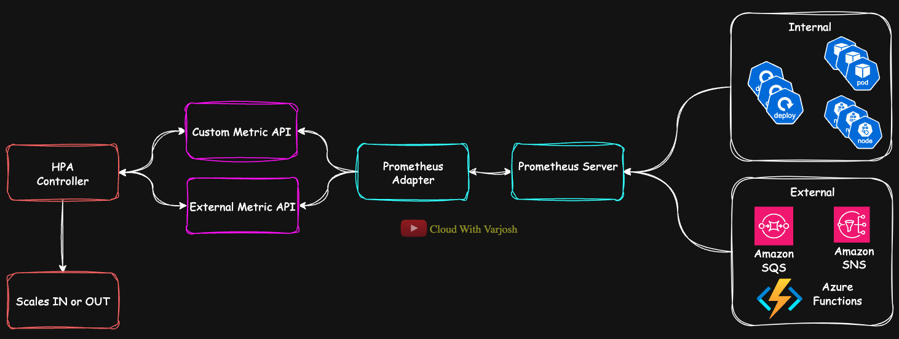

# Day 20: MASTER Kubernetes Autoscaling | HPA & VPA Explained with DEMO | CKA Course 2025

## Video reference for Day 20 is the following:
[](https://www.youtube.com/watch?v=hVLSjcJzE4U&ab_channel=CloudWithVarJosh)

---
## ⭐ Support the Project  
If this **repository** helps you, give it a ⭐ to show your support and help others discover it! 

---

## 📑 Table of Contents

- [What is Scaling?](#what-is-scaling)
  - [Types of Scaling](#types-of-scaling)
    - [Horizontal Scaling (Scale Out/In)](#1-horizontal-scaling-scaling-outin)
    - [Vertical Scaling (Scale Up/Down)](#2-vertical-scaling-scaling-updown)
  - [Scaling Approaches](#scaling-approaches)
  - [Pod vs Worker Node Scaling Approaches](#pod-vs-worker-node-scaling-approaches)
- [Horizontal Pod Autoscaler (HPA)](#horizontal-pod-autoscaler-hpa)
  - [How HPA Works](#how-hpa-works)
  - [Supported Workloads](#supported-workloads)
  - [Why Resource Requests Are Mandatory for HPA](#why-resource-requests-are-mandatory-for-hpa)
  - [Metrics Used by HPA](#metrics-used-by-hpa)
    - [Default Resource Metrics (CPU & Memory)](#1-default-resource-metrics-cpu--memory)
    - [Custom Metrics Support](#2-custom-metrics-support)
  - [Metrics Server Prerequisite](#metrics-server-prerequisite-for-hpa)
  - [Demo: Horizontal Pod Autoscaler (HPA)](#demo-horizontal-pod-autoscaler-hpa)
- [Vertical Pod Autoscaler (VPA)](#vertical-pod-autoscaler-vpa)
  - [Why Use VPA?](#why-use-vpa)
  - [VPA Operating Modes](#vpa-operating-modes)
  - [Components of VPA](#components-of-vpa)
  - [VPA as a Resource Recommendation Tool](#vpa-as-a-resource-recommendation-tool)
  - [HPA vs VPA: Recommendations and Complementary Use](#hpa-vs-vpa-recommendations-and-complementary-use)
  - [Important Distinction between HPA & VPA](#hpa-vs-vpa-important-distinctions)
  - [Demo: Vertical Pod Autoscaler (VPA)](#demo-vertical-pod-autoscaler-vpa)
- [References](#references)


## What is Scaling?



Scaling refers to **adjusting the resources** available to an application based on its **demand/load**. The key objective is to ensure the app has **enough resources** to handle current traffic, **without wasting resources** when demand is low.

- **Elastic Scaling**: We want the ability to **scale up** when load increases and **scale down** when load decreases.


## Types of Scaling

### 1. Horizontal Scaling (Scaling Out/In)

- **Scaling Out**: Adding more instances/pods.
  - In Kubernetes: Increasing the number of pod replicas.
  - Called **Scale-Out**.
  
- **Scaling In**: Removing instances/pods when load decreases.
  - Called **Scale-In**.

💡 Horizontal scaling is **stateless-friendly**, as requests can be distributed across multiple pods.


### 2. Vertical Scaling (Scaling Up/Down)

- **Scaling Up**: Increasing CPU/Memory resources of the existing pod or VM.
- **Scaling Down**: Reducing CPU/Memory.

> ⚠️ **Important Note:**  
> Vertical scaling **often requires a restart** of the resource (pod/VM) because:
> - **VM Example**: The OS needs to recognize new resources.
> - **Pod Example**: Kubernetes needs to recreate the pod with updated resource requests/limits.

---

## Scaling Approaches


**Both Scaling Types Have Two Approaches:**

### **Horizontal Scaling:**

- **Manual:**  
  Increase or decrease replicas manually by:
  - Editing the Deployment YAML (`replicas` field)
  - Using CLI:  
    `kubectl scale deploy my-deploy --replicas=2`

- **Automatic:**  
  Use **HPA (Horizontal Pod Autoscaler)** to automatically adjust replica count based on CPU, memory, or custom metrics.


### **Scaling Worker Nodes (Horizontally):**

Pods scaling is only one side; the **underlying worker nodes must also scale** to accommodate pod demands.

- **Automatic Node Scaling:**  
  Use **Cluster Autoscaler** to dynamically scale node groups (node pools) based on pending pods.

- **Advanced Option (AWS-specific):**  
  In Amazon EKS, **Karpenter** offers advanced, flexible, and faster node provisioning.

- **Production Reality:**  
  **Manual scaling of pods or worker nodes is rare in production.**  
  Typically, clusters use multiple **Node Groups (NGs)** categorized by workload type:
  - High-memory NG
  - High-CPU NG
  - GPU NG, etc.

Each node group scales automatically based on workload demand.


### **Vertical Scaling:**

- **Manual:**  
  Adjust resource **requests and limits** manually in the pod’s YAML.

- **Automatic:**  
  Use **VPA (Vertical Pod Autoscaler)** to auto-adjust CPU and memory requests based on real usage.

**Important:**  
Both approaches require **pod restarts** to apply the new resource settings.

### **Worker Nodes & Vertical Scaling:**

Worker nodes are **not vertically scaled**—neither manually nor automatically—in production.  
Vertical scaling a node means resizing the VM/instance type, which:

- Requires **node restart**
- Forces **eviction of all running pods**

This is **disruptive and impractical** for production environments.  
Instead, clusters rely on **horizontal scaling of nodes** to maintain availability.


## **Pod vs Worker Node Scaling Approaches**

| **Scaling Type**    | **Pods (Workloads)**                                                                                             | **Worker Nodes (Infrastructure)**                                                                                           |
|--------------------|------------------------------------------------------------------------------------------------------------------|------------------------------------------------------------------------------------------------------------------------------|
| **Horizontal Manual**   | Increase/decrease replicas manually via YAML or `kubectl scale`                                                  | Rarely done manually in production. Possible via cloud console/CLI but not recommended.                                       |
| **Horizontal Automatic**| **HPA (Horizontal Pod Autoscaler)** adjusts replicas based on metrics.                                          | **Cluster Autoscaler** or advanced solutions like **Karpenter (EKS)** scale node groups based on pending pod demands.         |
| **Vertical Manual**     | Adjust resource **requests/limits** manually in YAML. Pod restart required.                                      | Not practical. Requires resizing VM instance type → **Node restart & workload eviction.**                                     |
| **Vertical Automatic**  | **VPA (Vertical Pod Autoscaler)** automatically adjusts CPU/memory requests based on usage. Pod restart required.| **Not used.** Vertical scaling of nodes is disruptive and avoided in production environments.                                  |


**Key Takeaway:**

- **Pods:**  
  Both horizontal (HPA) and vertical (VPA) autoscaling are feasible and common.
  
- **Worker Nodes:**  
  **Only horizontal scaling** (Cluster Autoscaler/Karpenter) is used. Vertical scaling is impractical due to node disruption.

---

# Horizontal Pod Autoscaler (HPA)

The **Horizontal Pod Autoscaler (HPA)** is a Kubernetes feature that **automatically scales the number of pods in a deployment or workload based on observed resource usage or custom metrics**.


## How HPA Works:

- HPA continuously monitors the workload’s resource usage.
- It **adjusts (scales up or scales down) the number of pod replicas** based on observed metrics.
- It operates as a **control loop**, checking metrics at a regular interval (by default, **every 15 seconds**).

## Supported Workloads:

HPA supports:

| Kubernetes Object | Supported |
|-------------------|------------|
| **Deployment**    | Yes (most common usage) |
| **StatefulSet**   | Yes |
| **ReplicaSet (RS)** | Yes |
| **ReplicationController (RC)** | Yes |

While HPA works with ReplicaSets and ReplicationControllers, **Deployments and StatefulSets are preferred in modern Kubernetes setups.**

Here’s the improved, complete version incorporating your example and making the explanation even crisper:

## Why Resource `Requests` Are Mandatory for HPA?
HPA calculates utilization as a percentage of the pod’s **requested CPU or memory**. Without resource requests, HPA has no baseline to compute utilization, and scaling decisions won’t work.

**Example:**  
If you configure HPA to scale at **50% CPU utilization**, Kubernetes needs to know **50% of what?**  
That **"what"** is the value defined in the pod’s **CPU requests**.  
For instance, if a pod requests `200m` CPU, HPA will scale when the pod's usage crosses **100m CPU (50% of 200m)**.

Simply put:  
👉 **The metric you want to scale on must be specified in `requests` for HPA to function properly.**


## Metrics Used by HPA:

### 1. **Default Resource Metrics (CPU & Memory)**

- The most common use-case is scaling based on **CPU utilization**.
- **Memory utilization** can also be used, though it's less common because memory usage patterns are harder to predict.

These metrics are provided by the **Metrics Server** (explained below).

#### **Flow with Default Resource Metrics (CPU & Memory)**


1. **Metric Collection**:
   - The **kubelet**, present on every node in the cluster, runs **cAdvisor** internally.
   - **cAdvisor**, integrated into the kubelet, collects container-level metrics like: **CPU usage** & **Memory usage** 
   - These metrics are collected for all pods running on the node, including system pods.

2. **API Exposure**:
   - The **kubelet** exposes cAdvisor metrics via its API (e.g., `/metrics` endpoint).
   - The **Metrics Server** queries this cAdvisor API to retrieve resource usage for CPU and memory.

3. **API Integration**:
   - Metrics Server aggregates data collected from all kubelets in the cluster.
   - It provides this data in a Kubernetes-compatible format that can be queried by objects like **HPA**.

4. **HPA Query and Decision**:
   - The **HPA Controller** periodically queries the Metrics Server for **default metrics** such as CPU and memory utilization.
   - Based on the resource requests defined in the pod spec, HPA calculates the **utilization percentage** and scales the pod replicas accordingly.


### 2. **Custom Metrics Support**

HPA also supports scaling based on **custom metrics**—useful when CPU or memory is **not the right indicator of load** (e.g., request rate, queue length).

#### Why Custom Metrics?

Applications might have **business-specific or app-specific metrics** that reflect actual load better than CPU/memory. For example:

- Number of active HTTP requests
- Queue size in a messaging system
- Database connection count

#### Custom Metrics Categories:

| Type | Description | API Used |
|------|-------------|---------|
| **Internal Custom Metrics** | Metrics tied to Kubernetes objects (like pods or deployments) | **Custom Metrics API** |
| **External Metrics** | Metrics not related to Kubernetes objects (external systems, APIs, etc.) | **External Metrics API** |

To utilize custom metrics:

- You need additional components like **Prometheus + Prometheus Adapter** or other monitoring tools like **Datadog**, **InfluxDB**, etc..
- The adapter exposes these metrics to the HPA via the appropriate API.

#### Flow with Custom Metrics




1. **Metric Collection**:
   - Internal and external systems send metrics to the **Prometheus server** running in the cluster.

2. **Prometheus Adapter**:
   - The **Prometheus Adapter** queries the Prometheus server for relevant metrics.  
   - It translates these metrics into a Kubernetes-compatible format.

3. **API Exposure**:
   - The Prometheus Adapter exposes **internal metrics** via the **Custom Metrics API**.  
   - Similarly, it exposes **external metrics** via the **External Metrics API**.

4. **HPA Query and Decision**:
   - The **HPA Controller** queries the appropriate API (Custom or External) to retrieve the metrics.  
   - Using the retrieved metrics, the HPA Controller makes scaling decisions and adjusts the number of pods accordingly.

---

## Metrics Server: Prerequisite for HPA

To enable HPA to fetch CPU and memory utilization, the **Metrics Server** must be installed and running in the cluster.

Metrics Server collects real-time metrics from the kubelets on each node and exposes them through the **metrics.k8s.io API**, which HPA queries.

📚 **Refer to Day 19 to install Metrics Server:**

- [YouTube Video: Day 19](https://www.youtube.com/watch?v=Bu4RocrMx0g&ab_channel=CloudWithVarJosh)
- [GitHub Repo: Day 19](https://github.com/CloudWithVarJosh/CKA-Certification-Course-2025/tree/main/Day%2019)

---

## Demo: Horizontal Pod Autoscaler (HPA)

### Step 1️⃣: **Create Nginx Deployment**

```yaml
apiVersion: apps/v1
kind: Deployment
metadata:
  name: nginx-deploy
spec:
  replicas: 1
  selector:
    matchLabels:
      app: nginx
  template:
    metadata:
      labels:
        app: nginx
    spec:
      containers:
      - name: nginx
        image: nginx
        resources:
          requests:
            cpu: "100m"
          limits:
            cpu: "200m"
        ports:
        - containerPort: 80
```

**Explanation:**

- **`replicas: 1`** → Starts with **1 pod**.
- **`requests.cpu: "100m"`** → Minimum CPU resources requested (**0.1 core**).
- **`limits.cpu: "200m"`** → Maximum CPU resources allowed (**0.2 core**).
- **`labels: app: nginx`** → Important for **Service selector** to correctly route traffic.


**Apply:**

```bash
kubectl apply -f nginx-deployment.yaml
```

---

### Step 2️⃣: **Create Kubernetes Service to Expose Pods**

```yaml
apiVersion: v1
kind: Service
metadata:
  name: nginx-svc
spec:
  selector:
    app: nginx
  ports:
  - protocol: TCP
    port: 80
    targetPort: 80
  type: ClusterIP
```

**Explanation:**


- **`selector: app: nginx`** → Matches pods with label **`app: nginx`**.
- **`type: ClusterIP`** → Exposes the service **internally within the cluster**.
- **`port: 80`** → Service listens on **port 80**.
- **`targetPort: 80`** → Forwards traffic to the container’s **port 80**.

**Apply:**

```bash
kubectl apply -f nginx-service.yaml
```

---

### Step 3️⃣: **Create HPA Object**

```bash
kubectl autoscale deployment nginx-deploy --cpu-percent=50 --min=1 --max=5
```

**Explanation:**

- **`deployment nginx-deploy`** → Applies to the **nginx deployment**.
- **`--cpu-percent=50`** → Target **50% CPU utilization**.
- **`--min=1`** → Minimum **1 pod**.
- **`--max=5`** → Maximum **5 pods**.

📌 **What happens:**

- Kubernetes will monitor **average CPU usage** of all nginx pods.
- If usage > 50%, HPA **scales out** (adds pods).
- If usage < 50%, HPA **scales in** (removes pods, but maintains minimum 1).

---

### Step 4️⃣: **Check HPA Status**

```bash
kubectl get hpa
```

**Explanation:**

This will show:
- Current CPU utilization.
- Current replicas.
- Scaling status.

For more details:
```bash
kubectl describe hpa <hpa-name>
```

---

### Step 5️⃣: **Generate CPU Load Using BusyBox**

```bash
kubectl run -it --rm load-generator --image=busybox /bin/sh
```

**Explanation:**

| Command | Description |
|------|-------------|
| `kubectl run` | Launches a temporary pod |
| `-it` | Interactive shell |
| `--image=busybox` | Uses lightweight BusyBox image |
| `/bin/sh` | Opens shell |
| `--rm` | Delete pod upon exit |

Once inside:

```bash
while true; do wget -q -O- http://nginx-svc; done
```

**Explanation:**

- **`while true; do ... done`** → Creates an **infinite loop** to continuously send requests.
- **`wget -q`** → Performs a **quiet HTTP GET request** (no verbose output).
- **`-O-`** → Outputs the response to **standard output**, but effectively discarded.
- **`http://nginx-svc`** → Sends requests to **nginx pods via the Service DNS name**.

**Single** command to achieve the above:

`kubectl run -it --rm load-generator --image=busybox -- /bin/sh -c "while true; do wget -q -O- http://nginx-svc; done"`

---

### Step 6️⃣: **Observe Auto-Scaling**

Monitor HPA and pods:

```bash
kubectl get hpa
kubectl get pods -w
```

**Behavior:**
- As load increases, **CPU utilization rises**.
- HPA will scale from 1 pod up to max 5 if needed.
- Once load decreases (stop load-generator), HPA scales back down.

---

## **Did You Know?**

> **Kubernetes defaults to targeting 80% CPU usage when no `--cpu-percent` is set!**  
>  
> It optimizes for high resource efficiency while keeping enough headroom for sudden spikes.  
>  
> You can explicitly set it, but Kubernetes **automatically sets it to 80%**!

---

## Vertical Pod Autoscaler (VPA) 

**Vertical Pod Autoscaler (VPA)** in Kubernetes is used to **automatically adjust the CPU and memory requests and limits of your pods based on their actual usage**.

It helps you ensure:

- Pods **always have enough resources to perform efficiently**.
- **Wasted resources are minimized**, avoiding over-provisioning.

### **Key Behavior:**

1. **VPA focuses on vertical scaling:**
   - It **increases or decreases the CPU & memory reservations of pods**.
   - Unlike HPA, it does **not change the number of replicas**.

2. **Pod Restarts:**
   - In order to apply updated resource requests/limits, **VPA will restart pods.**
   - This is crucial because Kubernetes **cannot update CPU/Memory requests on a running pod** — the pod must be recreated.


## **Why use VPA?**

- **Removes guesswork.** No need to manually tune CPU/memory requests.
- Ideal for **stateful or single-replica apps** where HPA isn’t helpful.
- Useful in **dynamic workloads** where resource demands frequently change.


## **VPA Operating Modes:**

| Mode | Behavior |
|------|--------|
| **Off** | VPA only gives recommendations; it does NOT change pod resources automatically. |
| **Initial** | VPA sets recommended CPU/memory when pod is created. **No changes after creation.** |
| **Auto** | VPA **actively updates pod resources and restarts pods when needed** based on usage patterns. |


**🔔 Important Note:**  
If you have only **1 replica**, **VPA will avoid restarting the pod even in `Auto` mode** to prevent application downtime.  
To safely demonstrate VPA’s behavior and observe `Auto` mode in action, it's recommended to set the deployment to at least **2 replicas**.  
This can be safely left at **1 replica if you’re using HPA alongside VPA**, as HPA handles scaling in that case.

## Components of VPA:

1. ### **Recommender**
   - Continuously **analyzes historical and current resource usage**.
   - Predicts **optimal CPU/memory requests** to avoid under-provisioning or over-provisioning.
   - Uses statistical models (machine learning behind the scenes) to adapt recommendations over time.

2. ### **Updater**
   - **Identifies pods needing resource adjustments.**
   - Evicts & restarts them to apply new CPU/memory settings.
   - Respects **Pod Disruption Budgets (PDBs)** to maintain application availability and prevent too many disruptions at once.
     - Pod Disruption Budgets (PDBs) ensure a minimum number of pods remain available during voluntary disruptions, like upgrades or scaling actions. 

3. ### **Admission Controller**
   - **Intercepts pod creation requests.**
   - Modifies CPU & memory requests at creation time based on the latest VPA recommendations.
   - Ensures pods **start with the right resource allocations immediately.**


### VPA as a Resource Recommendation Tool

Even if you decide **not to use VPA in Auto mode in production**—to avoid pod restarts or potential downtime—**VPA can still be extremely valuable for recommending accurate CPU and memory requests and limits.**  
It is particularly useful when developers are unable to provide precise resource requirements for their applications. By running VPA in **"Off" mode**, you can safely collect real-world usage data and let VPA suggest optimal resource settings without automatically applying them.

### HPA vs VPA: Recommendations and Complementary Use

- **Use HPA** for applications that support **horizontal scaling**, where increasing or decreasing the number of pod replicas is feasible.

- **Use VPA**:
  - To determine the optimal CPU and memory requests for a container.
  - For applications that **cannot scale horizontally**, such as stateful or legacy workloads.

#### **Complementary Use:**

HPA and VPA **can be used together** in specific scenarios:
- **HPA** adjusts the number of pod replicas based on external load or metrics.
- **VPA** fine-tunes CPU and memory requests within each pod to ensure efficient resource usage.

#### **Example Use Case:**

**Batch Processing Applications**  
VPA dynamically adjusts resource requests based on varying job sizes, while HPA scales the number of pods according to the queue length or workload backlog.

### HPA vs VPA: Important Distinctions

**Defining resource requests is mandatory when using HPA, as HPA relies on requests to calculate CPU or memory utilization percentages.**  
For example, if HPA is set to scale at **50% CPU utilization**, Kubernetes calculates 50% relative to the pod’s defined CPU requests. Without requests, HPA cannot determine what 50% refers to, making scaling decisions impossible.

In contrast, **VPA does not require resource requests to be specified upfront**—it observes actual usage and dynamically adjusts the requests over time.  
However, it’s still considered **best practice to define initial requests even when using VPA**, as this allows the scheduler to correctly place the pod on a node that can accommodate its resource needs from the start.

---

# Demo: Vertical Pod Autoscaler (VPA)

## **Step 1️⃣ - Install VPA Components**

To install VPA components, follow the official installation process:

📄 **Reference:**
[VPA Installation Guide](https://github.com/kubernetes/autoscaler/blob/master/vertical-pod-autoscaler/docs/installation.md#install-command)

### Commands:

```bash
git clone https://github.com/kubernetes/autoscaler.git
cd autoscaler/vertical-pod-autoscaler
./hack/vpa-up.sh
```

### Optional Uninstall:

Later, to uninstall VPA:

```bash
./hack/vpa-down.sh
```

---

## **Step 2️⃣ - Create Nginx Deployment & Service**

### **Deployment YAML (`nginx-vpa.yaml`):**

```yaml
apiVersion: apps/v1
kind: Deployment
metadata:
  name: nginx-deploy
spec:
  replicas: 2
  selector:
    matchLabels:
      app: nginx
  template:
    metadata:
      labels:
        app: nginx
    spec:
      containers:
      - name: nginx
        image: nginx
        resources:
          requests:
            cpu: "100m"
          limits:
            cpu: "100m"
        ports:
        - containerPort: 80
---
apiVersion: v1
kind: Service
metadata:
  name: nginx-svc
spec:
  selector:
    app: nginx
  ports:
  - protocol: TCP
    port: 80
    targetPort: 80
  type: ClusterIP
```
---

### **Apply the YAML:**

```bash
kubectl apply -f nginx-vpa.yaml
```

---

## **Step 3️⃣ - Create VPA Object**

**VPA YAML (`vpa.yaml`):**

```yaml
apiVersion: autoscaling.k8s.io/v1
kind: VerticalPodAutoscaler
metadata:
  name: nginx-vpa
spec:
  targetRef:
    apiVersion: "apps/v1"
    kind:       Deployment
    name:       nginx-deploy
  updatePolicy:
    # updateMode options:
    # "Off"     - VPA only recommends resources, does NOT apply them.
    # "Initial" - VPA sets recommended resources at pod creation, no changes after.
    # "Auto"    - VPA automatically updates resources and restarts pods as needed.
    updateMode: "Auto"
```

**Apply:**

```bash
kubectl apply -f nginx-vpa.yaml
```

---

## **Step 4️⃣ - Check VPA Recommendations**

Run:

```bash
kubectl describe vpa nginx-vpa
```

### **Explaining Key Output:**

```bash
Recommendation:
    Container Recommendations:
      Container Name:  nginx
      Lower Bound:
        Cpu:     25m
        Memory:  262144k
      Target:
        Cpu:     25m
        Memory:  262144k
      Uncapped Target:
        Cpu:     25m
        Memory:  262144k
      Upper Bound:
        Cpu:     25m
        Memory:  262144k
```

| Field | Explanation |
|------|-------------|
| **Lower Bound** | Minimum safe CPU/memory requests. Pod should not be sized below this. |
| **Target** | Optimal CPU/memory requests based on observed usage. |
| **Uncapped Target** | Target recommendation without considering any max limits. Often same as Target unless limits exist. |
| **Upper Bound** | Maximum safe CPU/memory requests. Resources above this are unnecessary. |

👉 **Pod CPU/Memory will be adjusted toward the Target values.**

Here’s a **refined, crisp, and precise version** of your explanation, merging both paragraphs for better clarity and flow:


### **Uncapped Target vs Target in VPA**

The **Uncapped Target** in VPA represents the **raw, optimal CPU and memory requests** calculated purely based on observed usage patterns—**without considering any limits, policies, or quotas** set at the cluster or namespace level.

The **Target**, on the other hand, is the **final applied recommendation**, which adjusts the Uncapped Target to comply with any resource constraints like quotas, or administrative policies.

**If no such constraints are in place**, the **Uncapped Target and Target will be identical**, as is the case in our setup.


---
## **Step 5️⃣ - Observe VPA Actions**

### 1️⃣ **Describe VPA to Check Updates:**

```bash
kubectl describe vpa nginx-vpa
```

Check:

- Updated recommendations
- Actions taken (pod evictions)

---

### 2️⃣ **Check Events:**

```bash
kubectl get events
```

**Explanation:**

- VPA-related events (like pod evictions) are logged here.
- Useful to monitor when VPA applies changes.

---

## References:
  - [HPA Documentation](https://kubernetes.io/docs/tasks/run-application/horizontal-pod-autoscale/)
  - [VPA Documentation](https://github.com/kubernetes/autoscaler/tree/master/vertical-pod-autoscaler)
  - [Latest CKA Exam Curriculam](https://training.linuxfoundation.org/certification/certified-kubernetes-administrator-cka/)
  - [VPA Installation Guide](https://github.com/kubernetes/autoscaler/blob/master/vertical-pod-autoscaler/docs/installation.md#install-command)

---
