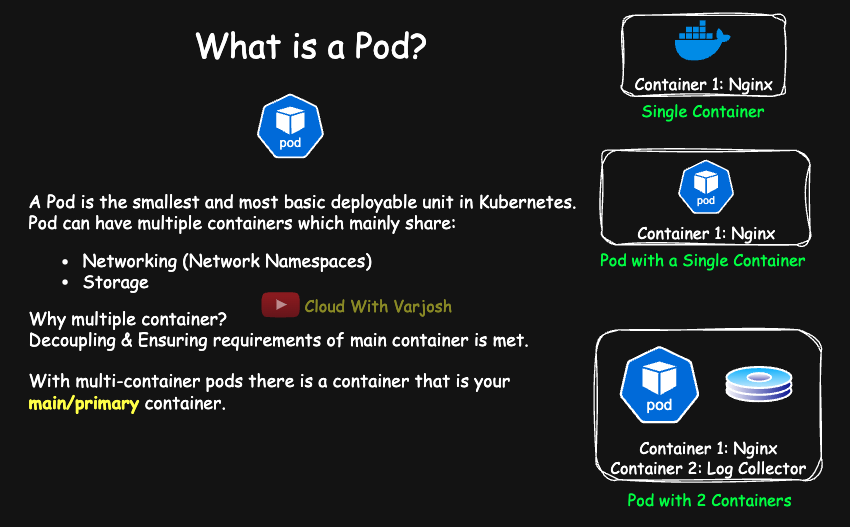
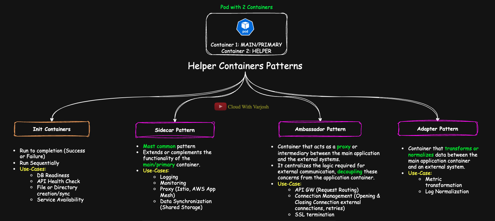
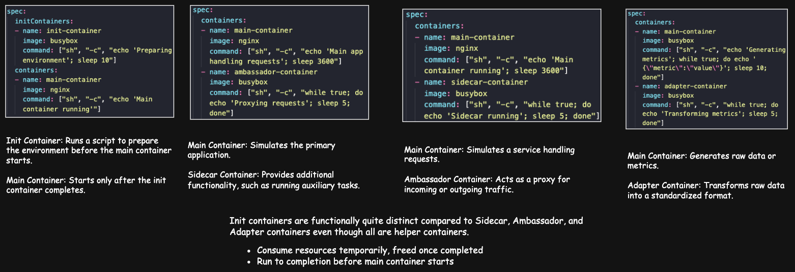

# Day 21: Multi-Container Pods DEEP-DIVE | Init vs Sidecar vs Ambassador vs Adapter | CKA Course 2025

## Video reference for Day 21 is the following:
[](https://www.youtube.com/watch?v=VEwP_wF67Tw&ab_channel=CloudWithVarJosh)

---
## ⭐ Support the Project  
If this **repository** helps you, give it a ⭐ to show your support and help others discover it! 

---

## **Table of Contents**

1. [Introduction](#introduction)
2. [Why Multi-Container Pods?](#why-multi-container-pods)
3. [What Are Multi-Container Pods?](#what-are-multi-container-pods)
4. [Shared Resources in Multi-Container Pods](#shared-resources-in-multi-container-pods)
5. [Multi-Container Pod Patterns](#multi-container-pod-patterns)
    - [1. Init Containers](#1-init-containers)
    - [2. Sidecar Pattern](#2-sidecar-pattern)
    - [3. Ambassador Pattern](#3-ambassador-pattern)
        - [Sidecar vs Ambassador Proxying](#sidecar-vs-ambassador-proxying)
    - [4. Adapter Pattern](#4-adapter-pattern)
6. [Differences: Init Containers vs Sidecar, Ambassador, Adapter Containers](#differences-init-containers-vs-sidecar-ambassador-adapter-containers)
7. [Conclusion](#conclusion)
8. [Demo: Init Container](#demo-init-container)
9. [Extended Demo: Two Init Containers (API + Service Check)](#extended-demo-two-init-containers-api--service-check)
10. [Demo: Sidecar Container for API Health Check and Logging](#demo-sidecar-container-for-api-health-check-and-logging)
11. [References](#references)

---

### **Introduction**
Welcome to Day 21! Today, we explore **multi-container pods**, an essential Kubernetes concept that enables closely integrated containers to collaborate efficiently. While pods can contain just one container, Kubernetes allows **multi-container pods**, which often include a primary container complemented by one or more helper containers. These help extend functionality or enhance the environment for the main application.

---

### **Why Multi-Container Pods?**


**Why not just use separate pods?**  
In Kubernetes, pods provide a **shared execution environment**, making them ideal for situations where containers need to work **tightly together**. For instance:
1. Containers within a pod can **share network and storage resources**, enabling close communication.
2. They can coordinate **startup and shutdown processes** effectively.
3. Multi-container pods reduce **operational complexity** by grouping functionality into one entity (instead of scattered pods).

---

### **What Are Multi-Container Pods?**
A **multi-container pod** is simply a pod containing **more than one container**. These containers:
- Share **network namespaces** (e.g., communicate via `localhost`).
- Can access **shared storage volumes** (if defined in the pod spec).
- Work together to fulfill a specific purpose.

Typically, a **multi-container pod** includes **one primary container** (the main application) and one or more **helper containers** (such as sidecars, ambassadors, or adapters).

---

### **Shared Resources in Multi-Container Pods**

| **Resource**             | **Shared in Pod?**    | **Explanation**                                                                                                                      |
|-------------------------|----------------------|---------------------------------------------------------------------------------------------------------------------------------------|
| **Network Namespace**    | ✅ **Yes**            | - All containers share the **same network namespace**.<br>- Communicate over **localhost** or the pod's IP.<br>- Example: Helper container accesses main container on `localhost:<port>`. |
| **Volumes/Storage**      | ✅ **Yes**            | - Volumes are defined at the **pod level**.<br>- Any container mounting the volume can access the data.<br>- Example: Sidecar reads logs written by main container. |
| **PID Namespace**        | ❌ **No**             | - Each container has its **own process namespace**.<br>- Processes in one container are **isolated** from others unless configured otherwise (e.g., `hostPID`). |
| **Filesystem (Root FS)** | ❌ **No**             | - Every container has its **own root filesystem**.<br>- Shared access only possible via **explicitly mounted volumes**. |
| **Environment Variables**| ❌ **No**             | - Environment variables are scoped to each container.<br>- Can be shared across containers using **ConfigMaps** or **Secrets** if needed. |                         |

---

### **Multi-Container Pod Patterns**




Multi-container pods generally follow four key patterns:

#### **1. Init Containers**

Init containers are **startup containers** designed to run before the main application container. They perform initialization tasks like:
- **Preparing configurations** or environments.
- **Waiting for dependencies** like APIs or databases to be ready.
- **Performing pre-checks** to ensure proper startup conditions.

#### **How Init Containers Work**:
- They always **run to completion** (success or failure).
- Run **sequentially**, one after the other.
- If any init container fails, the main container **never starts**.

#### **Use Cases:**
Common preconditions include:
1. **Database readiness**: Verify connection or schema migration before app startup.
2. **External API health checks**: Ensure critical APIs are reachable.
3. **File or directory initialization**: Create required directories or files for the app.
4. **Fetching secrets/configurations**: Download secrets from external systems.
5. **Cleaning up temporary files**: Ensure temporary files from previous runs are removed.

---

#### **2. Sidecar Pattern**

The **Sidecar Pattern** involves containers that **extend or complement the main container's functionality**. Sidecars run alongside the primary container and operate independently.

#### **Use Cases**:
1. **Logging**: Collect logs and send them to central systems (e.g., Fluentd, Fluent Bit).
2. **Monitoring**: Export metrics for tools like Prometheus.
3. **Proxying**: Handle incoming traffic (e.g., Envoy, Istio, AWS App Mesh).
4. **Data synchronization**: Sync files or configurations to external locations.

#### **Example:**
A sidecar proxy can intercept network traffic flowing into the pod, provide telemetry data, or encrypt the communication.

---

#### **3. Ambassador Pattern**

The **Ambassador Pattern** involves containers that act as **proxies between the pod and external systems**. Unlike the sidecar pattern, the ambassador is focused on handling **external communication**.

#### **Use Cases**:

1. **API Gateways**: Proxy external client requests to internal services, routing traffic based on paths or headers (e.g., `/api/orders` to Order Service).  
2. **Connection Management**: Optimize and pool connections to external resources like databases or APIs, ensuring efficient usage (e.g., managing PostgreSQL connections).  
3. **Security**: Terminate TLS or add authentication layers (e.g., handling OAuth token validation before forwarding requests).  

#### **Examples**:
- An **ambassador container** can proxy requests to databases (e.g., Amazon RDS), external queues (e.g., Amazon SQS), or cloud services like Azure API Gateway.

---

#### **Sidecar vs. Ambassador Proxying**
| **Aspect**         | **Sidecar Pattern**                              | **Ambassador Pattern**                           |
|---------------------|-------------------------------------------------|-------------------------------------------------|
| **Scope**          | Internal cluster communication                  | External system communication                   |
| **Primary Use Case**| Enhance the functionality of the main container | Mediate communication between pod and external systems |
| **Example**         | Envoy managing traffic between microservices    | Ambassador proxying requests to external APIs   |

---

#### **4. Adapter Pattern**

The **Adapter Pattern** involves containers that **transform or normalize data** between the main container and an external system. These are ideal for applications requiring data compatibility adjustments.

#### **Use Cases**:
1. **Metric transformation**: Convert custom application metrics into standard formats like Prometheus.
2. **Log normalization**: Process and format logs for external systems.

#### **Example:**
An adapter container collects JSON-based metrics from the app, converts them to Prometheus format, and makes them available for scraping.

---

## **Differences: Init Containers vs Sidecar, Ambassador, Adapter Containers**

| **Aspect**                     | **Init Containers**                                                                                      | **Sidecar / Ambassador / Adapter Containers**                                                                   |
|--------------------------------|---------------------------------------------------------------------------------------------------------|---------------------------------------------------------------------------------------------------------------|
| **Lifecycle**                  | **Run to completion before main container starts**                                                       | **Run alongside main container**, continue as long as the pod runs                                             |
| **Order of Execution**         | Always run **before** the main container, in sequence if multiple                                         | Start **in parallel** with the main container                                                                  |
| **Dependency on Success**      | **Main container won’t start unless all init containers complete successfully**                           | Main container can run **independently of helper containers (but may rely on their functionality)**            |
| **Restart Behavior**           | **Re-run only if they fail before completion**                                                            | Restart policies apply same as main container (`Always`, `OnFailure`, etc.)                                    |
| **Purpose**                    | **Setup, preparation, environment bootstrapping, preconditions check**                                    | Enhance, complement, or adapt runtime behavior of the main container                                           |
| **Resource Consumption**       | Consume resources **temporarily**, freed once completed                                                   | Consume resources **throughout the pod’s lifetime**                                                            |
| **Common Use-Cases**           | - Database migrations<br>- Configuration fetch<br>- Waiting for dependencies<br>- Permission setup        | - Log collection<br>- Proxying (Service Mesh)<br>- External communication handling (Ambassador)<br>- Metrics/log format adaptation |
| **Visibility to Main Container**| Prepare **shared volumes or environment**, not visible as active containers                              | Main container and helpers can interact **live** via shared network & volumes                                  |
| **Network Behavior**           | Share network namespace, but only active until completion                                                 | Share network namespace, **actively communicate during pod lifetime**                                         |
| **Fail Impact**                | **Pod won’t proceed if init fails**                                                                      | If they fail, **pod continues**, but functionality (e.g., logging, proxying) may degrade                        |

---

### **Conclusion**

**Multi-container pods** offer flexible solutions for scenarios requiring tightly coupled container interactions. Key benefits include shared networking, storage, and coordinated operations. By adopting patterns like **Init Containers**, **Sidecars**, **Ambassadors**, and **Adapters**, Kubernetes enables optimized, scalable, and production-ready architectures.

**NOTE:** Understand that helper containers—such as Init containers, and those following the Sidecar, Ambassador, or Adapter patterns—can all **coexist** within the same pod. You can mix and match these patterns as needed. These **helper containers** handle auxiliary tasks, allowing the main application container to focus entirely on its core logic without additional overhead.

---

### **Demo: Init Container**

#### **Use-Case: Pre-check API Availability**

**Scenario:**  
The application depends on the availability of `https://kubernetes.io`. You want to ensure this API is accessible before launching the main application.

#### **Init Container YAML Example**:

```yaml
apiVersion: v1
kind: Pod
metadata:
  name: init-demo
spec:
  initContainers:
  - name: check-api
    image: curlimages/curl:latest
    command:
      - sh
      - -c
      - |
        echo 'Checking API availability...'
        sleep 25
        until curl -s https://kubernetes.io > /dev/null; do
          echo 'Waiting for API...'
          sleep 5
        done
        echo 'API is accessible, proceeding to main-app container!'
  containers:
  - name: main-app
    image: nginx:latest
```

---

### **Explanation**:
1. **Init Container (`check-api`)**:
   - **Uses the `curlimages/curl` image** to run curl commands.
  
    - **`sh -c` →** Runs the entire script inside a shell, allowing multiple commands and loops.

    - **`|` (Block Scalar) →**  
      - This is a **YAML multi-line block indicator**.
      - It allows you to write multiple lines of commands in a more **readable, clean format**, instead of squeezing everything into a single line.
      - **Everything under `|` is treated as a single string**, preserving line breaks.
      - It improves readability when commands are complex (loops, conditions, multiple steps).

    **Inside the block:**

    - **`echo 'Checking API availability...'` →** Prints an initial message indicating that the init container is starting the API availability check.

    - **`sleep 25` →** Introduces a deliberate **25-second delay**, giving you time to observe the init container behavior before it proceeds.

    - **`until curl -s https://kubernetes.io > /dev/null` →**
      - Sends a silent HTTP request to `https://kubernetes.io`.
      - **`-s` suppresses progress/output.**
      - **`> /dev/null` discards output, keeping logs clean.**
      - Retries **until a successful response is received (exit code 0)**.

    - **`do echo 'Waiting for API...'; sleep 5; done` →**
      - Inside the loop, prints **"Waiting for API..."**, waits **5 seconds**, and retries.
      - **`done` marks the end of the loop body—everything inside `do ... done` repeats until the condition is met.**

    - **`echo 'API is accessible, proceeding to main-app container!'` →**
      - **Placed after `done`**, meaning it only runs **once the loop exits successfully**.
      - Clearly signals in logs that the API is reachable and the init container has completed, allowing the main container to start.

2. **Main Container (`main-app`)**:
   - Starts only after the init container finishes its task.
   - Prints a message confirming the app has started and remains idle for demonstration purposes.

---

### **How to Run This Demo**:
1. Apply the YAML:
   ```bash
   kubectl apply -f api-check-demo.yaml
   ```

2. Check Pod Status:
   ```bash
   kubectl get pods
   ```
   - Observe the pod in the **Init** phase while the init container performs its checks.

3. Inspect Logs of the Init Container:
   ```bash
   kubectl logs api-check-demo -c check-api
   ```
   - View the logs showing messages like:
     - "Checking API availability..."
     - "Waiting for API..."
     - "API is accessible!"

4. Once the Init Container Completes:
   - The main container starts successfully:
     ```bash
     kubectl logs api-check-demo -c main-app
     ```

---

## **Extended Demo: Two Init Containers (API + Service Check)**

#### **Use-Case: Pre-check External API & Internal Service Availability**

**Scenario:**  
In addition to checking the external API (`https://kubernetes.io`), you want to ensure that an internal Kubernetes Service (**main-app-svc**) is available **before the main application starts**.

---

#### **Pod YAML Example:**

```yaml
apiVersion: v1
kind: Pod
metadata:
  name: init-demo-2
  labels:
    app: main-app
spec:
  initContainers:
  - name: check-api
    image: curlimages/curl:latest
    command:
      - sh
      - -c
      - |
        echo 'Checking external API availability...'
        sleep 25
        until curl -s https://kubernetes.io > /dev/null; do
          echo 'Waiting for external API...'
          sleep 5
        done
        echo 'External API is accessible, proceeding to next init container!'

  - name: check-svc
    image: curlimages/curl:latest
    command:
      - sh
      - -c
      - |
        echo 'Checking main-app Service availability...'
        until nslookup main-app-svc.default.svc.cluster.local; do
          echo 'Waiting for Service DNS resolution...'
          sleep 5
        done
        echo 'Service is reachable, proceeding to main-app container!'

  containers:
  - name: main-app
    image: nginx:latest
```

---

#### **Corresponding Service YAML:**

```yaml
apiVersion: v1
kind: Service
metadata:
  name: main-app-svc
spec:
  selector:
    app: main-app
  ports:
  - protocol: TCP
    port: 80
    targetPort: 80
```

---

### **Explanation:**

1. **Init Container 1 (`check-api`)**:
   - Same as the previous demo: checks availability of `https://kubernetes.io` before proceeding.
2. **Init Container 2 (`check-svc`)**:
    - **`sh -c` →**
      - Invokes a shell (`sh`) to run the entire block of commands as a single script.
      
    - **`echo 'Checking main-app Service availability...'` →**
      - Prints a message indicating the start of the Service availability check.

    - **`until nslookup main-app-svc.default.svc.cluster.local > /dev/null; do` →**
      - Uses **`nslookup`** to check if the DNS entry for the Service `main-app-svc.default.svc.cluster.local` is resolvable.
      - **`until` loop** keeps running **until DNS resolution succeeds** (i.e., until `nslookup` returns exit code 0).
      - **`> /dev/null`** discards any output, keeping logs clean.

    - **`echo 'Waiting for Service DNS resolution...'` →**
      - Prints a message while waiting, so you can monitor progress.

    - **`sleep 5` →**
      - Adds a 5-second delay before retrying, to avoid spamming DNS queries.

    - **`done` →**
      - Ends the loop; the script continues once DNS resolution is successful.

    - **`echo 'Service is reachable, proceeding to main-app container!'` →**
      - Once the Service is resolvable, this message is printed, and the init container completes successfully.
    - In-Summary:
      - This **init container** is ensuring that the Kubernetes Service **`main-app-svc`** is **DNS-resolvable and available** **before starting the main container**.
    - It blocks the main container until that condition is met—perfect use of an init container to handle **dependency readiness**.
3. **Main Container (`main-app`)**:
   - Starts **after both init containers** have successfully completed their checks.

---

### **How to Run This Demo:**

1. Apply the **Service YAML**:
   ```bash
   kubectl apply -f main-app-svc.yaml
   ```

2. Apply the **Pod YAML**:
   ```bash
   kubectl apply -f api-check-demo.yaml
   ```

3. Check Pod Status:
   ```bash
   kubectl get pods
   ```

4. Inspect Logs of Both Init Containers:
   ```bash
   kubectl logs api-check-demo -c check-api
   kubectl logs api-check-demo -c check-svc
   ```

5. Check Main Container Logs:
   ```bash
   kubectl logs api-check-demo -c main-app
   ```

---

### **Key Takeaway**:
Init containers ensure **controlled startup** and prepare the pod environment, eliminating issues caused by unfulfilled dependencies or preconditions.

---

### **Summary**

- Multi-container pods allow multiple containers to share networking and storage while collaborating closely.
- Init containers are used for **one-time setup tasks** (e.g., pre-checks, initialization).
- **Init containers must complete successfully** before the main app containers start.
- Common init container use cases include **database readiness checks**, **API validation**, and **dependency setup**.
---

### **Demo: Sidecar Container for API Health Check and Logging**

This example illustrates a **Sidecar Container** that monitors the main application by periodically checking its health endpoint and logging the health status.

#### **Use Case**
Your main application is running, and you want a lightweight container to act as a health-check monitor and log the status of the main app's health.

---

### **Pod YAML Example**

```yaml
apiVersion: v1
kind: Pod
metadata:
  name: sidecar-logging-demo
spec:
  containers:
  # Main application container
  - name: main-app
    image: nginx:latest
    ports:
    - containerPort: 80
  # Sidecar container
  - name: health-logger
    image: curlimages/curl:latest
    command:
    - sh
    - -c
    - |
      while true; do
        curl -s http://localhost:80 > /dev/null && echo 'Main app is healthy' || echo 'Main app is unhealthy'
        sleep 5
      done

```

---

### **Explanation**

1. **Main Application Container (`main-app`)**:
   - Uses the **nginx** image to simulate an application.
   - Listens on port `80`.

2. **Sidecar Container (`health-logger`)**:
   - Uses the **curlimages/curl** image to perform health checks.
Certainly! Here's the improved bullet-style explanation **including the `||` operator explanation clearly**:
    - Uses the `sh` shell with `-c` flag to execute the entire script as a single command.
    - Starts an infinite loop using `while true; do ... done` to continuously check the main app's health.
    - Sends a silent HTTP request to `http://localhost:80` using `curl -s` to check if the main app is reachable.
    - Redirects the output to `/dev/null` to discard response content and keep logs clean.
    - Uses `&& echo 'Main app is healthy'` to print the message **only if the `curl` command succeeds (exit code 0)**.
    - Uses `|| echo 'Main app is unhealthy'` to print the message **only if the `curl` command fails (non-zero exit code)**.
    - `&&` and `||` are logical operators; `&&` executes the next command on success, while `||` executes the next command on failure.
    - Waits for 5 seconds after each check using `sleep 5` before repeating the loop.
    - Continuously monitors the main container’s health over the shared network namespace within the pod.


---

### **How to Run This Demo**

#### 1. Apply the YAML:
```bash
kubectl apply -f sidecar-logging-demo.yaml
```

#### 2. Check Pod Logs:
- View logs from the **sidecar container**:
  ```bash
  kubectl logs sidecar-logging-demo -c health-logger
  ```
  You’ll see output like:
  ```
  Main app is healthy
  Main app is healthy
  ```

#### 3. Simulate Failure (Optional):
- To simulate app unavailability:
  ```bash
  kubectl exec -it sidecar-logging-demo -c main-app -- /bin/sh
  ```
- Once inside the container:
  ```bash
  kill 1
  ```
- Check the sidecar container logs again:
  ```bash
  kubectl logs sidecar-logging-demo -c health-logger
  ```
  You’ll now see:
  ```
  Main app is unhealthy
  Main app is unhealthy
  ```

---

### **References:**

- [Kubernetes Official Docs - Init Containers](https://kubernetes.io/docs/concepts/workloads/pods/init-containers/)
- [Kubernetes Blog - The Distributed System Toolkit: Patterns](https://kubernetes.io/blog/2015/06/the-distributed-system-toolkit-patterns/)
