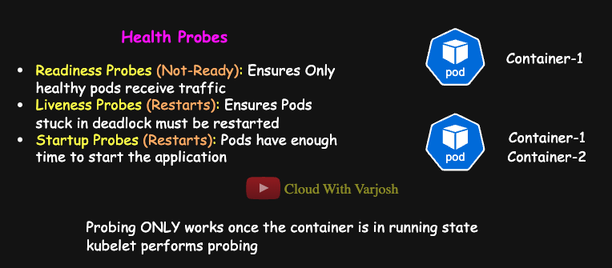
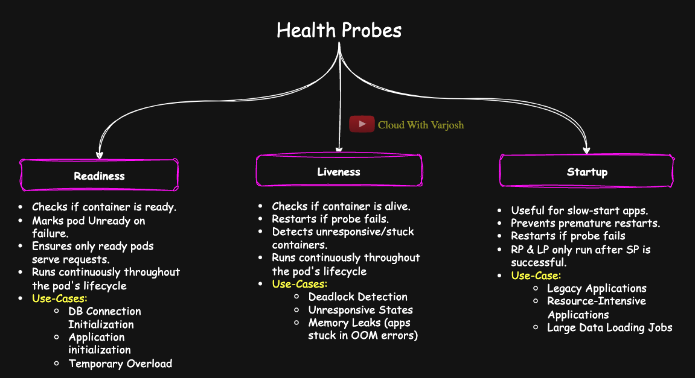
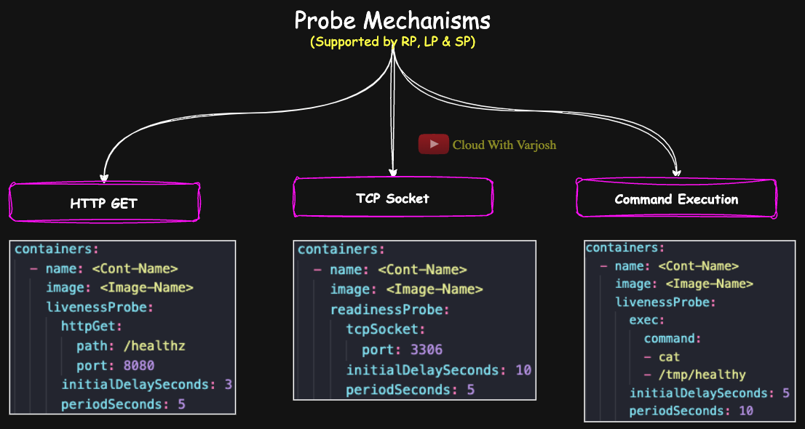

# Day 23: DEEP-DIVE into Kubernetes Health Probes | Readiness vs Liveness vs Startup | CKA Course 2025

## Video reference for Day 23 is the following:
[](https://www.youtube.com/watch?v=ANSBnfil75Y&ab_channel=CloudWithVarJosh)

---
## ⭐ Support the Project  
If this **repository** helps you, give it a ⭐ to show your support and help others discover it! 

---

## **Table of Contents**

1. [Introduction](#introduction)  
2. [Types of Health Probes](#types-of-health-probes)  
3. [Why Configure Both Readiness and Liveness Probes?](#why-configure-both-readiness-and-liveness-probes)  
4. [Probe Timer Configuration Parameters](#probe-timer-configuration-parameters)  
5. [Behavior of RP, LP, and Startup Probes with Multi-Container Pods](#behavior-of-rp-lp-and-startup-probes-with-multi-container-pods)  
6. [Kubernetes Health Probes: Comprehensive Comparison](#kubernetes-health-probes-comprehensive-comparison)  

---

### **Introduction**



In Kubernetes, health probes are used to check the status of applications running inside pods. These probes help Kubernetes ensure that only healthy pods are receiving traffic, and unhealthy pods are either given time to recover or restarted as necessary. The **kubelet** is responsible for performing these probes.

---

### **Types of Health Probes**



1. **Readiness Probes (RP)**
Determines if the application is **ready** to handle traffic. If this probe fails, the Pod is marked as **"Not Ready"** and is removed from Service endpoints, but the container itself is not restarted.
   - **Purpose**: Checks if a container is **ready to start accepting traffic**.
   - **Behavior**:
     - When the readiness probe fails, the pod is removed from the service's load balancer, but **the container is not restarted**.
   - **Key Advantage**: Prevents routing traffic to containers that are temporarily unable to serve requests due to initialization delays or resource constraints.
   - **Example**:
     ```yaml
      readinessProbe:
        httpGet:
          path: /readyz
          port: 8080
        initialDelaySeconds: 5  # Wait 5 seconds after container starts before probing
        periodSeconds: 10       # Probe every 10 seconds
     ```

      - **Explanation:**
        - Checks if the application is ready to serve traffic.
        - HTTP GET request is sent to /readyz on port 8080.
        - Starts after an initial delay of 5 seconds.
        - If probe fails, the pod is temporarily removed from Service endpoints (no restart).
        - Once probe passes, pod starts receiving traffic.
    - **Use Case**:
      - A database connection might temporarily fail. During this time, the readiness probe ensures that traffic is not sent to the affected pod.

---

2. **Liveness Probes (LP)**
The **kubelet** uses liveness probes to know when to restart a container. For example, liveness probes could catch a deadlock, where an application is running, but unable to make progress. Restarting a container in such a state can help to make the application more available despite bugs.

   - **Purpose**: Checks if a container is **alive and functioning correctly**.
   - **Behavior**:
     - When the liveness probe fails, **the pod is restarted**.
   - **Key Advantage**: Helps recover from **irrecoverable failures**, such as deadlocks or unresponsive applications.
   - **Example**:
     ```yaml
      livenessProbe:
        exec:
          command:
          - cat
          - /tmp/healthy
        initialDelaySeconds: 3  # Start checking 3 seconds after the container starts
        periodSeconds: 5        # Check every 5 seconds
     ```

     - **Explanation:**
        - Verifies if the application is still alive.
        - Executes `cat /tmp/healthy` inside the container.
        - If this command fails (e.g., file missing), the liveness probe fails.
        - **Kubelet will restart the container automatically** to recover from the failure.
   - **Use Case**:
     - Detects and restarts applications stuck in an unrecoverable state (e.g., infinite loop or deadlock).
---
3. **Startup Probes**
Ensures that the container has enough time to initialize the application. Until this probe succeeds, **liveness and readiness probes** are not triggered.

   - **Purpose**: Used for **legacy or slow-starting applications** that take variable amounts of time to initialize.
   - **Problem Solved**: The `initialDelaySeconds` parameter cannot always capture the correct startup time for such applications. Setting it too high causes unnecessary delays, and too low leads to premature restarts.
   - **Behavior**:
     - When a startup probe is defined, **liveness and readiness probes do not start** until the startup probe succeeds.
   - **Example**:
     ```yaml
     startupProbe:
      httpGet:
        path: /healthz
        port: 8080
      failureThreshold: 30  # Kubernetes (via Kubelet) will attempt the probe up to 30 times before failing
      periodSeconds: 10     # Probe runs every 10 seconds
     ```
      - **Explanation:**
        - This probe is responsible for determining when the application has successfully started.
        - It sends an HTTP GET request to /healthz on port 8080.
        - It will try every 10 seconds, up to 30 times (total grace period = 300 seconds).
        - If all 30 attempts fail, Kubernetes will mark the pod as failed and stop trying.
      - No restart happens because the app never started properly.
     This configuration ensures the app has **up to 5 minutes** (30 * 10 = 300 seconds) to initialize.

---

### **Why Configure Both Readiness and Liveness Probes?**

While it may seem that configuring only liveness probes is enough, **best practice dictates using both** for the following reasons:
- **Readiness Probes (RP)**:
  - Do not restart a failing pod; they just stop sending traffic to it.
  - This ensures that **transient issues** (e.g., high load or temporary database unavailability) do not unnecessarily trigger a restart.
  - Pods can continue running and recover without interruption.
- **Liveness Probes (LP)**:
  - Designed for **critical, irrecoverable issues** where a restart is the only solution.
  - Ensures that **dead or hung pods are recreated**, preserving application availability.

**Key Insight**:
- Without RP: Traffic may still be sent to pods experiencing temporary failures, degrading user experience.
- Without LP: Pods stuck in fatal states will remain idle and waste resources.

---

### Probe Timer Configuration Parameters

| **Property**          | **Meaning**                                                    | **Default Value** | **Example**                              |
|----------------------|----------------------------------------------------------------|-------------------|------------------------------------------|
| `initialDelaySeconds` | Wait time before first probe starts after container starts     | `0` seconds       | `initialDelaySeconds: 5` → starts after 5 sec |
| `periodSeconds`       | Time interval between probe attempts                           | `10` seconds      | `periodSeconds: 10` → probes every 10 sec   |
| `timeoutSeconds`      | Max wait time for probe response                               | `1` second        | `timeoutSeconds: 2` → fail if no reply in 2 sec |
| `successThreshold`    | No. of consecutive successes needed to mark successful         | `1`               | `successThreshold: 3` → pass after 3 successes |
| `failureThreshold`    | No. of consecutive failures before marking probe as failed     | `3`               | `failureThreshold: 5` → fail after 5 failures  |

---

### **Behavior of RP, LP, and Startup Probes with Multi-Container Pods**

1. **Pod and Container Relationship**:
   - A pod in Kubernetes can host multiple containers.
   - The **pod's status reflects the worst state of any container** within it:
     - Common errors include:
       - **`Error`**: Indicates a general runtime issue (e.g., application crash or misconfiguration).
       - **`ImagePullBackOff`**: Happens when Kubernetes cannot pull the specified container image (e.g., due to incorrect image name or registry authentication issues).
       - **`CrashLoopBackOff`**: Occurs when a container starts, crashes, and continuously restarts in a loop.
       - **`RunContainerError`**: A catch-all for runtime errors (e.g., failure to execute the container command).
     - A pod is marked **"Running"** only when all containers within it are successfully running.

2. **Startup Probe**:
   - Each container's startup probe runs independently.
   - If the startup probe for one container fails, **only that container is affected**, and liveness/readiness probes are not triggered for it. Other containers proceed unaffected.

3. **Readiness Probe**:
   - Readiness probes determine whether the pod is ready to serve traffic.
   - If the readiness probe fails for **one container**, the **entire pod** is marked **"Not Ready"** to ensure no partial or unreliable service is provided.
   - Failed readiness probes only affect traffic routing and do not restart the container.

4. **Liveness Probe**:
   - Liveness probes are container-specific.
   - If the liveness probe fails for one container, **only that container is restarted** by the **Kubelet**, while other containers remain unaffected.

5. **Pod Status Summary**:
   - The **pod's status reflects the most severe state** of any container:
     - **Running**: All containers are running properly.
     - **Error**: At least one container experienced a runtime failure (e.g., application crash).
     - **ImagePullBackOff**: Kubernetes is unable to pull the image for at least one container.
     - **CrashLoopBackOff**: A container repeatedly crashes and restarts.
     - **RunContainerError**: General runtime error for one or more containers.
   - If a **readiness probe fails** for even one container, the pod is marked **"Not Ready"**.

---

### **Kubernetes Health Probes: Comprehensive Comparison**

Here is the revised table with the important words and concepts **bolded** to highlight key details:

| **Aspect**                     | **Startup Probe**                                                                | **Readiness Probe**                                                               | **Liveness Probe**                                                                |
|--------------------------------|----------------------------------------------------------------------------------|----------------------------------------------------------------------------------|----------------------------------------------------------------------------------|
| **Purpose**                    | Ensure **slow-starting apps** are given enough time to start                     | Check if the pod is **ready to receive traffic**                                 | Check if the pod is **alive and functioning properly**                           |
| **When Does It Start?**        | **Immediately** after container starts                                           | Starts **when the pod enters the "Running" state** and **after Startup Probe succeeds (if configured)** | Starts **when the pod enters the "Running" state** and **after Startup Probe succeeds (if configured)** |
| **Failure Behavior**           | Pod is **killed & restarted** after failure threshold is exceeded during startup | Pod is **marked unready** and removed from **Service load balancers**; not restarted | Pod is **killed & restarted** after failure threshold exceeded                   |
| **Effect on Pod Traffic**      | **No direct effect**                                                             | **Stops sending traffic** to the pod                                             | **No direct effect** on traffic                                                  |
| **Common Use Case**            | **Legacy apps**, slow-booting apps with unpredictable startup times              | Apps needing time to **initialize external dependencies or configurations**       | Recover from **stuck apps**, **deadlocks**, or **memory leaks**                  |
| **Recovery Mechanism**         | Pod is **restarted** during initialization                                       | **No restart**; waits for probe to pass                                          | Pod is **restarted**                                                             |
| **Runs Until**                 | Probe **succeeds** → switches control to **RP & LP**                             | Runs **continuously** throughout the pod's lifecycle                             | Runs **continuously** throughout the pod's lifecycle                             |
| **Starts Again After Restart?**| **Yes**                                                                          | **Yes**                                                                          | **Yes**                                                                          |
| **Relation to Service Traffic**| **None**                                                                         | Directly **influences Service endpoints**                                        | **None**                                                                         |
| **Frequency (Default)**        | Configurable (e.g., `periodSeconds`, `failureThreshold`)                          | Configurable (e.g., `initialDelaySeconds`, `periodSeconds`)                      | Configurable (e.g., `initialDelaySeconds`, `periodSeconds`)                      |
| **Mechanisms Supported**       | **HTTP GET**, **TCP Socket**, **Exec Command**                                   | **HTTP GET**, **TCP Socket**, **Exec Command**                                   | **HTTP GET**, **TCP Socket**, **Exec Command**                                   |
| **Best Practices**             | Use for **apps with unpredictable boot times**                                   | **Always** use in production to avoid sending traffic to **unready pods**        | **Always** use to automatically recover from **unrecoverable failures**          |
| **Administrative Benefit**     | Avoid unnecessary **premature restarts** for **slow-start apps**                 | Prevent unnecessary **load and requests** hitting pods that **aren't ready**     | Ensures **automatic recovery** from **failures**                                 |
| **Impact on Resources**        | Uses **CPU/memory** during startup period                                        | Pod consumes resources but doesn't receive traffic if **unready**                | Pod consumes resources until **restarted**                                       |
| **Pod State While Failing**    | Pod **restarts** after failure                                                   | Pod **stays running** but removed from **Service traffic**                       | Pod **restarts** after failure                                                   |
| **Typical Example**            | **Java apps** taking >60s to start, **legacy monoliths**                         | App needs **DB connection** or **configuration loaded** before accepting requests | **Deadlock**, app frozen, **memory leak**, or stuck threads                      |

---

### **Probe Mechanisms**



Kubernetes provides **three mechanisms** for performing health probes:

1. **HTTP GET Requests**:
   - The kubelet sends an HTTP GET request to a specified endpoint.
   - **Success**: Status codes 200–399.
   - **Failure**: Any other status code.
   - **Example**:
     ```yaml
     livenessProbe:
       httpGet:
         path: /healthz
         port: 8080
       initialDelaySeconds: 3
       periodSeconds: 5
     ```
     In this case, the app responds with HTTP `200` to indicate health.

2. **TCP Socket**:
   - The kubelet checks if a TCP connection can be established to a specified port.
   - **Success**: Connection is successful.
   - **Failure**: Connection cannot be established.
   - **Example**:
     ```yaml
     readinessProbe:
       tcpSocket:
         port: 3306
       initialDelaySeconds: 10
       periodSeconds: 5
     ```
     This is useful for services like databases that listen on specific ports.

3. **Command Execution**:
   - The kubelet runs a specified command inside the container.
   - **Success**: Command exits with code `0`.
   - **Failure**: Command exits with a non-zero code.
   - **Example**:
     ```yaml
     livenessProbe:
       exec:
         command:
         - cat
         - /tmp/healthy
       initialDelaySeconds: 5
       periodSeconds: 10
     ```
     In this example, the app creates a `/tmp/healthy` file when healthy. If the file is missing, the probe fails.

---

### **Conclusion**
By combining **Startup**, **Readiness**, and **Liveness Probes**, you can:
- Protect slow-starting apps from premature terminations.
- Ensure only **ready** pods receive traffic, enhancing application stability.
- Recover from fatal application issues by restarting pods with **liveness probes**.

These probes allow Kubernetes to dynamically manage the health of your applications, ensuring availability and a better user experience.

---

## Demo: Readiness Probe with Command Execution
**Objective:** Prevent traffic from being sent to the pod until it is fully ready to serve requests.

```yaml
apiVersion: v1
kind: Pod
metadata:
  name: readiness-probe-demo
spec:
  containers:
  - name: busybox-app
    image: busybox
    command: ["sh", "-c", "touch /tmp/ready; sleep 3600"] # Creates /tmp/ready file and keeps container running for 1 hour
    readinessProbe:
      exec:                       # Runs a command inside the container
        command:
        - cat
        - /tmp/ready               # Command checks if /tmp/ready file exists
      initialDelaySeconds: 5       # Wait 5 seconds before the first probe
      periodSeconds: 5             # Probe runs every 5 seconds
      failureThreshold: 1          # Mark pod as NotReady after 1 failure
```

---

## Explanation:

- `exec`: Executes a command inside the container for readiness check.
- `command`: Runs `cat /tmp/ready`; probe passes if file exists.
- `initialDelaySeconds: 5`: Waits 5 seconds before sending the first probe.
- `periodSeconds: 5`: Probes every 5 seconds to check readiness.
- `failureThreshold: 1`: A single failure marks the pod as **NotReady** immediately.

---

## How to Test:

1. Simulate failure by deleting `/tmp/ready`:

   ```bash
   kubectl exec -it readiness-probe-demo -- rm /tmp/ready
   ```

2. Observe pod readiness status:

   ```bash
   kubectl get pod readiness-probe-demo
   ```

3. Pod will be marked as **NotReady** within ~5 seconds.

---

## How to Recover:

1. Recreate `/tmp/ready`:

   ```bash
   kubectl exec -it readiness-probe-demo -- touch /tmp/ready
   ```

2. Check pod status:

   ```bash
   kubectl get pod readiness-probe-demo
   ```

3. Pod will become **Ready** after the next successful probe (within 5 seconds).

---

## Demo: Liveness Probe with HTTP GET

**Objective:** Restart the pod if it becomes unresponsive or encounters a failure.

```yaml
apiVersion: v1
kind: Pod
metadata:
  name: liveness-probe-demo
  labels:
    test: liveness
spec:
  containers:
  - name: liveness
    image: registry.k8s.io/e2e-test-images/agnhost:2.40
    args:
    - liveness
    livenessProbe:
      httpGet:
        path: /healthz               # Endpoint to check for health status
        port: 8080                  # Port where the application is running
        httpHeaders:
        - name: Custom-Header       # Custom header name
          value: Awesome            # Custom header value
      initialDelaySeconds: 3        # Wait 3 seconds before starting probes
      periodSeconds: 3              # Run the probe every 3 seconds
      timeoutSeconds: 1             # Wait 1 second for a response before timing out
      failureThreshold: 1           # After 1 failure, restart the container
```

**Explanation:**

- **`livenessProbe`**: Defines the probe to check if the container is alive.
- **`httpGet`**: Specifies that the probe will perform an HTTP GET request.
  - **`path: /healthz`**: The HTTP endpoint used to check the application's health.
  - **`port: 8080`**: The port on which the application is listening.
  - **`httpHeaders`**: Custom headers added to the HTTP request.
    - **`name: Custom-Header`**: Name of the custom header.
    - **`value: Awesome`**: Value of the custom header.
- **`initialDelaySeconds: 3`**: Kubernetes waits 3 seconds after the container starts before initiating the first probe.
- **`periodSeconds: 3`**: The probe runs every 3 seconds.
- **`timeoutSeconds: 1`**: The probe times out if no response is received within 1 second.
- **`failureThreshold: 1`**: The container is restarted if the probe fails once.

**How to Test:**

1. **Deploy the Pod:**
   - Save the YAML configuration to a file, e.g., `liveness-probe-demo.yaml`.
   - Apply the configuration to your Kubernetes cluster:
     ```bash
     kubectl apply -f liveness-probe-demo.yaml
     ```

2. **Verify Pod Status:**
   - Check the status of the pod:
     ```bash
     kubectl get pods liveness-probe-demo
     ```
   - Ensure the pod status is `Running`.

3. **Observe Restart Behavior:**
   - Monitor the pod's events to see if Kubernetes restarts the container:
     ```bash
     kubectl describe pod liveness-probe-demo
     ```
   - Look for events indicating that the liveness probe failed and the container was restarted.

**Expected Outcome:**

- For the first 10 seconds after the container starts, the `/healthz` endpoint returns a status of 200, indicating success.
- After 10 seconds, the `/healthz` endpoint returns a status of 500, indicating failure. **This is how the application in the container is configured**
- The liveness probe detects the failure and restarts the container. 
- This cycle repeats, with the container running for 10 seconds before being restarted.

---

## Demo: Startup Probe with TCP Socket
**Objective:** Demonstrate how a **Startup Probe** ensures that a container is given adequate time to start up before Kubernetes begins liveness or readiness checks.


```yaml
apiVersion: v1
kind: Pod
metadata:
  name: startup-probe-demo
spec:
  containers:
  - name: tcp-app
    image: ubuntu:latest
    command:
      - sh
      - -c
      - |
        apt update && \
        apt install -y netcat-openbsd && \
        nc -l -p 9444 && \
        sleep 3600
    startupProbe:
      tcpSocket:
        port: 9444            # Checks TCP server accessibility on port 9444
      failureThreshold: 15    # Allows up to 15 failed attempts
      periodSeconds: 5        # Probe runs every 5 seconds
```

---

### **Explanation:**

- **Container:**
  - **Image:** `ubuntu:latest` → Uses Ubuntu base image.
  - **Command:**
    - `apt update && apt install -y netcat-openbsd` → Updates package index and installs **Netcat**, ensuring dependencies are handled.
    - **`nc -l -p 9444` → Starts a TCP server in listening mode on port 9444.**
      - `nc` = Netcat command-line tool.
      - `-l` = Listen mode (server mode).
      - `-p 9444` = Listens on **port 9444**.
      - Effectively simulates an application **waiting for incoming TCP connections**.
    - `sleep 3600` → Keeps the container running for 1 hour after TCP server starts.

- **Startup Probe:**
  - **tcpSocket.port: 9444** → Kubernetes probes port **9444** to check if TCP server is up.
  - **failureThreshold: 15** → Allows up to **15 failed attempts** before marking container as failed.
  - **periodSeconds: 5** → Probe runs **every 5 seconds**.

---

### **Key Demo Points:**

- Demonstrates **Startup Probe's role in giving time to initialize dependencies & application**.
- Shows that:
  - Probe **waits until TCP server (port 9444) is ready**.
  - Container won’t be restarted unnecessarily.
- Perfect example when **application setup takes time (like dependency installation)**.

---

## References:

- [Kubernetes Concepts: Understanding Liveness, Readiness, and Startup Probes](https://kubernetes.io/docs/concepts/configuration/liveness-readiness-startup-probes/)
  
- [Kubernetes Tasks: Configure Liveness, Readiness, and Startup Probes](https://kubernetes.io/docs/tasks/configure-pod-container/configure-liveness-readiness-startup-probes/)

---