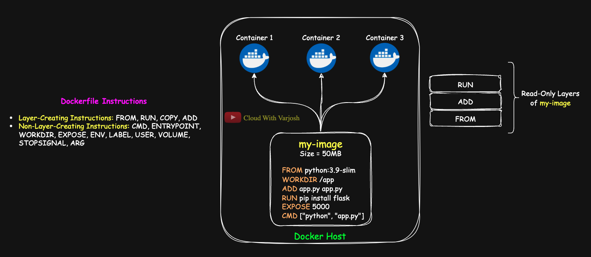
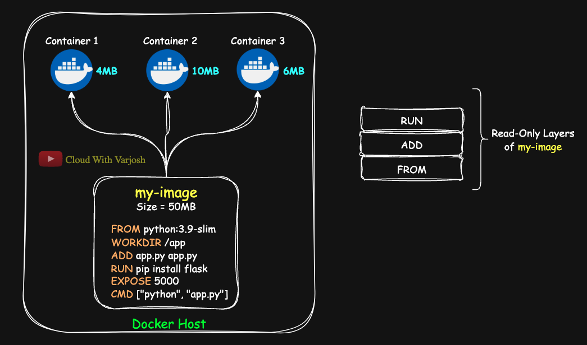
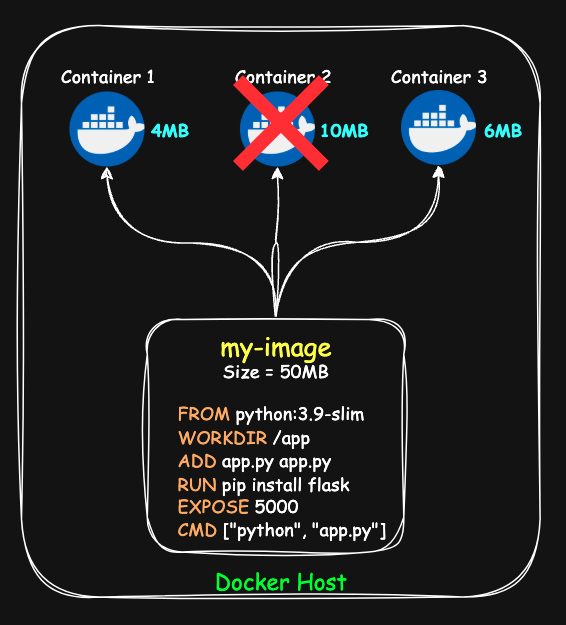
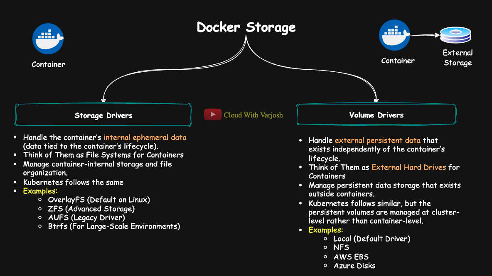
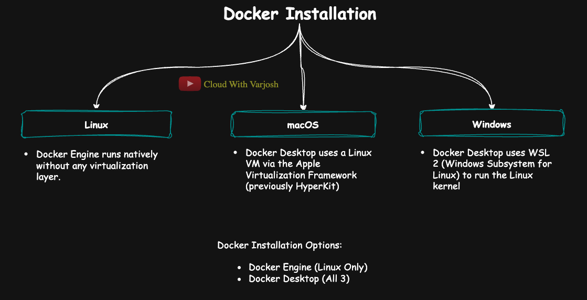

# Day 24: Docker Volumes Explained | Foundation for Kubernetes Persistent Storage | CKA 2025 Course

## Video reference for Day 24 is the following:

[](https://www.youtube.com/watch?v=5t3yHFoqK6g&t=12s&ab_channel=CloudWithVarJosh)

---
## ⭐ Support the Project  
If this **repository** helps you, give it a ⭐ to show your support and help others discover it! 

---

### **Table of Contents**

1. [Introduction](#introduction)  
2. [Understanding Storage in Docker](#understanding-storage-in-docker)   
3. [Storage in Docker: How Does It Work?](#storage-in-docker-how-does-it-work)  
   - [1. Storage Drivers](#1-storage-drivers)  
   - [2. Volume Drivers](#2-volume-drivers)  
4. [How Docker Storage Works on macOS, Windows, and Linux](#how-docker-storage-works-on-macos-windows-and-linux)  
   - [Linux](#linux)  
   - [macOS and Windows](#macos-and-windows)  
6. [Understanding Docker Volumes](#understanding-docker-volumes)  
   - [Benefits of Docker Volumes](#benefits-of-docker-volumes)  
   - [Where Are Docker Volumes Stored?](#where-are-docker-volumes-stored)  
7. [Demo: With Persistent Storage (Docker Volume)](#demo-with-persistent-storage-docker-volume)  
   - [Note for macOS and Windows Users](#note-for-macos-and-windows-users)  
8. [Types of Docker Volumes: Which to Use When?](#types-of-docker-volumes-which-to-use-when)  
9. [Conclusion](#conclusion)  
10. [References](#references)

---

### **Introduction**
Welcome to Day 24, where we dive deep into **Docker volumes**! To set the stage, let's understand how container storage works and why volumes are crucial for persistent data. When you run containers from an image, any new data generated during their execution is known as **delta data**—the changes made on top of the image during runtime.

---

### **Understanding Storage in Docker**



Imagine we have a host system—this could be a VM or your laptop—that has the **Docker Engine** installed. We’re hosting three containers on this host: **Container 1**, **Container 2**, and **Container 3**. All these containers are based on an image created using the following `Dockerfile`:

```dockerfile
FROM python:3.9-slim
WORKDIR /app
ADD app.py app.py
RUN pip install flask
EXPOSE 5000
CMD ["python", "app.py"]
```

We’ve already discussed this `Dockerfile` in **Day-3’s lecture**. You can revisit the lecture for a recap:
- **YouTube link**: [Day-3 Lecture](https://youtu.be/MQ8fYqZwiQs)
- **GitHub link**: [Day-3 Resources](https://github.com/CloudWithVarJosh/CKA-Certification-Course-2025/tree/main/Day%2003)

The image created from this `Dockerfile` is named **`my-image`** and has a size of approximately **50MB** (used here for simplicity; actual size may vary).

---

### **Layers in a Dockerfile**

The instructions in the `Dockerfile` are a mix of **layer-creating instructions** and **non-layer-creating instructions**. These **layers** play a key role in determining the image size. If your `Dockerfile` contains multiple layer-creating instructions, it results in a **larger image size**. This is why **multi-stage builds** are often recommended—they allow the separation of layer-creating instructions into different "stages," producing more optimized and smaller images.


To deepen your understanding of multi-stage Docker builds (Day 5), you can explore the following resources:

- **YouTube Tutorial**: [Multi-Stage Docker Builds Explained](https://www.youtube.com/watch?v=8q3pJfE6Z_E&ab_channel=CloudWithVarJosh)  
- **GitHub Repository**: [Day 05: Multi-Stage Docker Builds](https://github.com/CloudWithVarJosh/CKA-Certification-Course-2025/tree/main/Day%2005)  


| **Layer-Creating Instructions**        | **Non-Layer-Creating Instructions**            |
|----------------------------------------|------------------------------------------------|
| `FROM`, `RUN`, `COPY`, `ADD`           | `CMD`, `ENTRYPOINT`, `WORKDIR`, `EXPOSE`, `ENV`, `LABEL`, `USER`, `VOLUME`, `STOPSIGNAL`, `ARG` |

### **Example: Layers in Our Dockerfile**

Let’s review the `Dockerfile` to identify which instructions create new layers:

- **Layer-Creating Instructions**:
  - `FROM python:3.9-slim`: Defines the base image.
  - `ADD app.py app.py`: Copies the `app.py` file into the image.
  - `RUN pip install flask`: Installs Flask (creates a new layer).
- **Non-Layer-Creating Instructions**:
  - `WORKDIR /app`: Sets the working directory.
  - `CMD ["python", "app.py"]`: Defines the default command.
  - `EXPOSE 5000`: Exposes port 5000.

---

### **How to Inspect Image Layers**

You can inspect the layers of a Docker image using the `docker image history` command. For example:
```bash
docker image history my-image
```
This will display a breakdown of the instructions and how much storage each layer-creating instruction contributes. Here’s an example output:

```plaintext
IMAGE          CREATED        CREATED BY                                      SIZE      COMMENT
dbc9f6d3b551   17 hours ago   CMD ["python" "app.py"]                         0B        buildkit.dockerfile.v0
<missing>      17 hours ago   EXPOSE map[5000/tcp:{}]                         0B        buildkit.dockerfile.v0
<missing>      17 hours ago   RUN /bin/sh -c pip install flask # buildkit     11.5MB    buildkit.dockerfile.v0
<missing>      17 hours ago   ADD app.py app.py # buildkit                    170B      buildkit.dockerfile.v0
<missing>      17 hours ago   WORKDIR /app                                    0B        buildkit.dockerfile.v0
<missing>      3 months ago   FROM python:3.9-slim                            97.1MB    debuerreotype 0.15
```

---

### **How Docker Containers Use Image Layers**

When you create a container from an image:
1. **Read-Only Layers**:  
   The layers in the image are **read-only**. Each container shares the same image layers, meaning if your image is 50MB, all containers will collectively use the same 50MB of storage for those read-only layers.  
2. **Writable Layer (Delta Data)**:  
   Any new changes or files you add to the container are stored in a **writable layer** unique to that container. This is known as **delta data**.

---

### **Storage Calculation Example**



Let’s assume:
- The base image size is **50MB**.
- Three containers are running from the same image:  
  - **Container 1**: Adds 4MB of new data (delta).  
  - **Container 2**: Adds 10MB of new data.  
  - **Container 3**: Adds 6MB of new data.  

**Total Storage Usage**:  
- Shared image layers: **50MB** (used by all containers).  
- Delta data: **4MB + 10MB + 6MB = 20MB**.  
- **Final Total**: **50MB + 20MB = 70MB**.

---

### **Handling Data Loss in Writable Layers**



Since the image layers are **read-only**, any changes made to the container are stored in the **writable layer**. If a container is stopped or fails:
- For instance, if **Container 2** stops, the **10MB of delta data in its writable layer will be lost**.  
- This highlights the need for a mechanism to **persist container data**, ensuring important data survives beyond the container's lifecycle.

---

### **Need for Persistent Storage**
To avoid such data loss, Docker provides **volumes**—a powerful mechanism for storing data **outside the container** in a persistent manner. Volumes allow data to be accessible and survive even when containers are stopped, restarted, or deleted.

---

## **Storage in Docker: How Does It Work?**



When you create a **Docker container**, it needs a way to store data. Docker achieves this with two key components:
- **Storage Drivers** 
- **Volume Drivers**

### **1. Storage Drivers**  

- **Purpose**:  
Storage drivers handle **ephemeral container data**, which exists only during the lifecycle of a container. When a container is removed, any data stored by the storage driver is lost unless persistent storage (e.g., volumes) is explicitly configured.

- **Analogy**:  
  Think of storage drivers as the **file systems for containers**, responsible for managing and organizing how container-internal storage operates.

- **Key Responsibilities**:  
  1. Manage the **container layers**, which include the base image and any subsequent changes made during runtime.
  2. Organize files and ensure efficient storage operations inside the container.

- **Kubernetes Connection**:  
  Kubernetes relies on storage drivers through container runtimes like **containerd** or **CRI-O**. These runtimes use storage drivers (e.g., OverlayFS) to handle ephemeral container data in the same way Docker does.

- **Common Examples of Docker Storage Drivers**:  
  - **OverlayFS**: The default storage driver on most modern Linux distributions. It efficiently handles layered filesystems by creating a "stack" of read-only and writable layers.  
  - **AUFS**: A legacy driver used on older systems. It has been replaced by OverlayFS due to better performance and simplicity.  
  - **ZFS**: An advanced storage driver that supports **snapshots**, **compression**, and scalable storage. Ideal for environments requiring advanced data management.  
  - **Btrfs**: A modern, high-performance storage driver that supports features like **snapshots**, **quotas**, and **subvolumes**, making it suitable for large-scale and complex storage requirements.

- **Why It Matters**:  
  Storage drivers are **crucial for handling ephemeral data** efficiently, but they are not designed to manage persistent storage. That’s why Docker and Kubernetes use **volume drivers** for data that must persist beyond the lifecycle of a container.

**Check your storage driver:**
```bash
docker info
```
Look for: `Storage Driver: overlay2`

Inside the VM, Docker typically uses the **`overlay2`** storage driver. This driver manages image layers and the writable container layer.

---

### **2. Volume Drivers**  

- **Purpose**:  
   Volume drivers manage **persistent data storage** that exists **outside the container’s lifecycle**. They allow data to survive beyond container restarts, failures, or deletions, ensuring long-term accessibility.

- **Analogy**:  
   Think of volume drivers as **external hard drives for containers**, providing a separate, reliable space to store and manage data that needs to persist independently of the containers.

- **Key Responsibilities**:  
   1. Provide a mechanism to store data **outside** the ephemeral writable layer of containers.  
   2. Allow data sharing between multiple containers, enabling collaborative or distributed workflows.  
   3. Integrate with external storage systems for advanced storage solutions (e.g., cloud-based storage or networked file systems).

- **Kubernetes Connection**:  
   - Kubernetes operates similarly but manages **Persistent Volumes (PVs)** at the **cluster level**, instead of at the container level.  
   - Kubernetes uses **Persistent Volume Claims (PVCs)** as an abstraction for applications to request storage, with backend storage provisioned by **CSI drivers**.  
   - Storage in Kubernetes integrates with volume drivers, enabling flexibility across nodes and distributed systems.

- **Common Examples of Volume Drivers**:  
   - **Local (Default Driver)**:  
      - Provides local storage on the host machine.  
      - Simple and reliable for most use cases, but limited to the host.  
   - **NFS (Network File System)**:  
      - Offers shared storage that multiple containers can access across hosts.  
      - Useful in distributed environments requiring shared data.  
   - **AWS EBS (Elastic Block Store)**:  
      - Cloud storage for containers running on AWS infrastructure.  
      - Highly scalable and integrates with other AWS services.  
   - **Azure Disks**:  
      - Microsoft’s cloud-based storage solution.  
      - Ideal for containers running in Azure environments.  

- **Why It Matters**:  
   1. Volumes decouple data from the container lifecycle, ensuring it remains intact regardless of container states.  
   2. They enable seamless integration with external storage systems, making them ideal for production and distributed applications.  
   3. Volume drivers allow data portability, scalability, and reliability, especially for large-scale, multi-container deployments.

 **Check your Volume Drivers**

- Docker uses the **`local` volume driver** by default.
- On macOS and Windows, volumes live inside the VM (not directly visible from the host).
- To share files between host and container, you can bind-mount a host directory:

  - macOS:
    ```bash
    docker run -v /Users/yourname/data:/app/data ...
    ```

  - Windows:
    ```bash
    docker run -v C:\Users\yourname\data:/app/data ...
    ```

**Inspect a volume:**
```bash
docker volume inspect <volume_name>
```

Look for: `"Driver": "local"`

---

**Note: Kubernetes Storage vs Docker Volumes**  
While Docker uses **volumes** to save data and **storage drivers** to handle temporary container files, Kubernetes takes things a step further—especially when you have many machines working together in a cluster.

In Kubernetes:
- It introduces something called **Persistent Volumes (PVs)** – think of these like shared hard drives for your apps.
- And then there are **Persistent Volume Claims (PVCs)** – your app just "asks" for the storage it needs, and Kubernetes takes care of finding it.

Behind the scenes, Kubernetes uses special plugins called **CSI (Container Storage Interface) drivers** to connect to storage from different cloud providers like **AWS EBS, Azure Disks, or NFS**.

For short-term (temporary) data, Kubernetes still uses the same type of **storage drivers** as Docker – like `overlay2`.

We’ll break all this down more clearly in the **next lecture**, where we’ll talk about how Kubernetes makes managing storage across multiple servers much easier. 

---

## **How Docker Storage Works on macOS, Windows, and Linux**



Docker behaves differently depending on the operating system because containers require a Linux kernel. Here's how storage is handled across platforms:

### **Linux**

- On **Linux**, Docker runs **natively** without any virtualization layer.
- Storage and volumes are created directly on the host filesystem.
- You can access Docker volumes at:  
  ```
  /var/lib/docker/volumes
  ```

---

### **macOS and Windows**

Docker does **not** run natively on macOS or Windows. Instead, **Docker Desktop** provides a Linux environment using a lightweight virtual machine.

| OS        | Virtualization Backend                         |
|-----------|------------------------------------------------|
| macOS     | Docker Desktop uses a Linux VM via the **Apple Virtualization Framework** (previously **HyperKit**) |
| Windows   | Docker Desktop uses **WSL 2 (Windows Subsystem for Linux)** to run the Linux kernel |

**Can You Install Docker Engine Directly on macOS or Windows?**

❌ **No, not directly like on Linux.**
- Both **macOS** and **Windows** do **not have a native Linux kernel**, which Docker Engine **requires** to run containers.
- Docker Engine relies heavily on Linux features like **cgroups**, **namespaces**, and **UnionFS (e.g., overlay2)** — which are unavailable on macOS and Windows.

**NOTE**: While you can install **Docker Desktop** on a **Linux system**, it’s generally not recommended because Linux natively supports Docker Engine, which is more lightweight and efficient. When you run Docker Desktop on Linux, it still creates a lightweight virtual machine using the system's virtualization technology, adding an unnecessary layer of overhead compared to using Docker Engine directly on the host.

--- 

### **Understanding Docker Volumes**

Now that we’ve understood Docker image layers and how storage works during image creation, let’s move on to another critical aspect of Docker: **Volumes**.

In Docker, containers are ephemeral by default—this means any data created inside a container is lost when the container is deleted. To persist data beyond the container lifecycle, we use **Docker volumes**.

**Benefits of Docker Volumes**
1. **Data Persistence:**  
   Ensures data is not lost when containers restart or are removed.
   
2. **Sharing Data Between Containers:**  
   Enables multiple containers to access and modify the same data.

3. **Performance Optimization:**  
   Using external storage systems (via volume drivers) can improve performance and scalability.

---

### **Where Are Docker Volumes Stored?**

By default, Docker stores volumes inside the Docker host at:

```
/var/lib/docker/volumes
```

Every time you create a named volume, Docker creates a corresponding directory under the path above. This allows data to survive container restarts, recreation, and even deletions.

---

## **Demo: With Persistent Storage (Docker Volume)**

Now let’s do the same thing, but with a **named volume** mounted to `/app`.

> 🧪 We’ll create another container named `my-cont-2` and mount a volume to persist data.

```bash
docker volume create my-vol
docker run -d --name my-cont-1 -v my-vol:/app my-image
```

Then, exec into the container and create the file again:

```bash
docker exec -it my-cont-1 bash
cd /app
echo "This is my delta data" > file.txt
cat file.txt   # ✅ File exists
```

Now, delete the container:

```bash
docker rm -f my-cont-1
```

Even though the container is gone, the data still exists. You can verify this by checking the volume’s data directly:

```bash
sudo cat /var/lib/docker/volumes/my-vol/_data/file.txt
# Output: This is my delta data
```

**This is the power of Docker volumes**—your data is decoupled from the container’s lifecycle.

---

### **Note for macOS and Windows Users**

On **Linux**, Docker runs natively and stores volumes under:

```
/var/lib/docker/volumes
```

However, on **macOS** (and Windows), Docker runs inside a lightweight **virtual machine (VM)** using a technology like **HyperKit** or **WSL2**, depending on the system.

As a result, you **won’t find** the `/var/lib/docker/volumes` directory on your local Mac filesystem — it exists **inside the Docker VM**.

#### How to Access Volume Data on macOS:

If you're on macOS/Windows and want to inspect volume data:

1. Use Docker commands to access it via the container:
   ```bash
   docker run -it --rm -v my-vol:/app alpine sh
   cd /app
   ls -l
   ```

2. Or use `docker cp` to copy data from a container to your local filesystem:
   ```bash
   docker cp my-cont-2:/app/file.txt .
   ```

---

### **Types of Docker Volumes: Which to Use When?**

Docker supports different volume types, and each has its own use case:

| **Type**            | **Use Case**                                                                 | **Pros**                                               | **Cons**                                             |
|---------------------|------------------------------------------------------------------------------|---------------------------------------------------------|------------------------------------------------------|
| **Named Volume**    | Default Docker-managed volumes (e.g., `my-vol`)                              | Easy to use, portable, survives container deletion      | Abstracted path, may need extra step for backups     |
| **Bind Mount**      | Mount a specific host directory to the container                             | Full control, real-time syncing, easy for dev work      | Tied to host path, can cause permission issues       |
| **tmpfs Mount**     | Temporary in-memory mount (data lost on restart)                             | Fast, doesn't write to disk                             | Data not persistent, only useful for short-term use  |

In most production use-cases, **named volumes** are preferred because they are **managed, portable, and persistent**.  
For development and local testing, **bind mounts** are useful when you want to sync code from your local machine into the container.

---

### **Conclusion**

Docker volumes are essential for managing **persistent storage** in containerized environments. While containers are designed to be ephemeral, volumes provide a way to preserve data even if the container is stopped, removed, or recreated.

We also saw how the behavior of storage slightly differs across **Linux**, **macOS**, and **Windows** due to the use of virtualization layers like **Docker Desktop** (with **HyperKit** on macOS and **WSL2** on Windows). Regardless of platform, understanding how Docker handles data—through **storage drivers**, **volume drivers**, and volume mounting—lays the foundation for more complex systems like **Kubernetes storage** with **Persistent Volumes** and **CSI drivers**.

In the next lecture, we’ll extend this understanding to the Kubernetes world and learn how storage is handled across a cluster!

---

### **References**
- [Docker Volumes Documentation](https://docs.docker.com/storage/volumes/)  
- [Docker Storage Drivers](https://docs.docker.com/storage/storagedriver/)  
- [Docker on Linux vs macOS vs Windows](https://docs.docker.com/desktop/)  

---