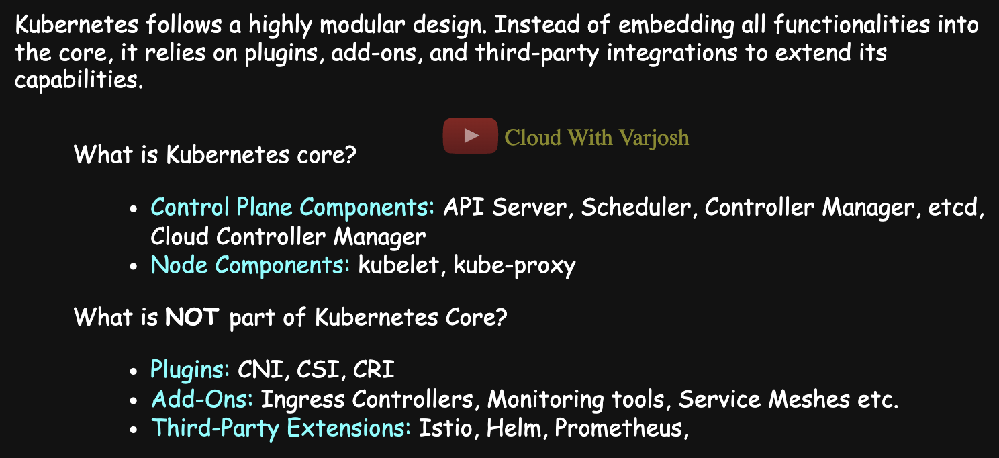
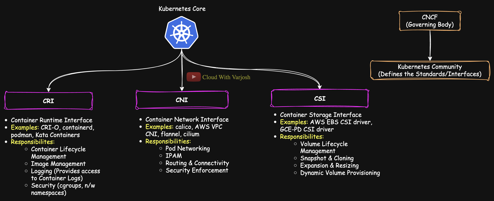

# Day 25: Kubernetes Core & Extensions | CNI, CSI, CRI, Add-Ons & Plugins Explained | CKA Course 2025

## Video reference for Day 25 is the following:

---
## ⭐ Support the Project  
If this **repository** helps you, give it a ⭐ to show your support and help others discover it! 

---

## Table of Contents  

1. [Introduction](#introduction)  
2. [Kubernetes Core and Extended Architecture](#kubernetes-core-and-extended-architecture)  
   - [What is Kubernetes Core?](#what-is-kubernetes-core)  
   - [Control Plane Components](#1️⃣-control-plane-components)  
   - [Node Components](#2️⃣-node-components)  
3. [Kubernetes Extensions: Beyond the Core](#kubernetes-extensions-beyond-the-core)  
   - [Plugins](#1️⃣-plugins)  
   - [Add-Ons](#2️⃣-add-ons)  
   - [Third-Party Extensions](#3️⃣-third-party-extensions)  
4. [Deep Dive into Kubernetes Interfaces](#deep-dive-into-kubernetes-interfaces)  
   - [Overview of Kubernetes Interfaces](#overview-of-kubernetes-interfaces)  
5. [Why Kubernetes Uses a Plugin-Based Architecture?](#why-kubernetes-uses-a-plugin-based-architecture)  
6. [Key Takeaways](#key-takeaways)  
7. [Conclusion](#conclusion)  
8. [References](#references)  

---

# **Introduction**  
Kubernetes is built on a **modular and extensible architecture**, where the **core components** (Control Plane and Node Components) handle fundamental orchestration tasks, while **plugins, add-ons, and third-party extensions** enhance functionality without bloating the system. This lecture explores the **Kubernetes Core**, its **plugin-based architecture**, and key extension mechanisms like **CNI (networking), CSI (storage), and CRI (container runtimes)**. We’ll also discuss how this design ensures **scalability, flexibility, and vendor neutrality**, enabling seamless integration with diverse cloud-native tools.  

---

# **Kubernetes Core and Extended Architecture**  

Kubernetes is a powerful container orchestration platform built on a **modular design**. This modularity enables **flexibility, scalability, and extensibility**. The **core components** handle essential orchestration tasks, while **plugins, add-ons, and third-party extensions** extend functionality without bloating the core system.  

This section clarifies the distinction between **Kubernetes Core** and **External Extensions**, explaining how various components interact within the overall architecture.  

---

## **Kubernetes Core Architecture**  

### **What is Kubernetes Core?**  
The **Kubernetes Core** consists of essential built-in components responsible for cluster management and orchestration. These components are categorized into **Control Plane Components** and **Node Components**.  

### **1️⃣ Control Plane Components**  
The control plane manages cluster operations, making scheduling decisions and maintaining the desired state.  

- **API Server:** The central control plane component that validates and processes REST API requests, enforcing security policies and forwarding requests to relevant components.  
- **Scheduler:** Assigns Pods to nodes based on resource availability and scheduling policies.  
- **Controller Manager:** Runs control loops to maintain the desired state (e.g., replication, endpoint management).  
- **etcd:** A distributed, consistent key-value store that persistently stores all cluster state and configuration data.  
- **Cloud Controller Manager:** Manages cloud-provider-specific integrations such as external load balancers, persistent storage provisioning, and node lifecycle management.  

### **2️⃣ Node Components**  
Nodes are the worker machines that run containerized workloads.  

- **kubelet:** The primary node agent that ensures containers are running as expected.  
- **kube-proxy:** Maintains network rules on each node, enabling seamless service discovery and communication between Pods.  

---

## **Kubernetes Extensions: Beyond the Core**  
While the **Kubernetes Core** provides essential orchestration functionalities, additional features like networking, storage, monitoring, and security are implemented via **external components**.  

### **1️⃣ Plugins**  

Plugins extend Kubernetes by enabling external integration while adhering to standardized APIs. 

CNI (Container Network Interface), CRI (Container Runtime Interface), and CSI (Container Storage Interface) are standardized interfaces that define how networking, runtime, and storage components interoperate with Kubernetes. These interfaces adhere to specifications that are developed and maintained by the Kubernetes community under the governance of the CNCF. Although the CNCF endorses these standards, it is the community that actively defines and updates the specifications.

Anyone can develop their own plugins for CNI, CRI, and CSI as long as they conform to these specifications, ensuring compatibility and interoperability within Kubernetes environments.

- **Container Network Interface (CNI):** Configures Pod networking and IP allocation.  
- **Container Storage Interface (CSI):** Manages external storage solutions.  
- **Container Runtime Interface (CRI):** Allows Kubernetes to interact with various container runtimes (e.g., containerd, CRI-O).  
 

#### **CRI Plugins (Container Runtimes)**
*(The following list is indicative, not exhaustive.)*
| Plugin        | Description |
|--------------|------------|
| **containerd** | Default for most Kubernetes setups; lightweight, optimized, and follows OCI standards. |
| **CRI-O** | Minimal runtime designed for Kubernetes; integrates tightly with OpenShift. |
| **Kata Containers** | Uses lightweight VMs for security; ideal for isolating untrusted workloads. |
| **gVisor (by Google)** | User-space sandboxing for enhanced security; limits direct host access. |

#### **CNI Plugins (Networking)**
*(The following list is indicative, not exhaustive.)*
| Plugin        | Description |
|--------------|------------|
| **Calico** | Supports network policies and BGP routing; ideal for security-focused environments. |
| **Cilium** | High-performance with eBPF-based networking; excels in observability and security. |
| **Flannel** | Lightweight and simple; lacks network policy support. |
| **Weave Net** | Provides encrypted pod-to-pod communication; supports multi-cluster setups. | 

#### **CSI Plugins (Storage)**
*(The following list is indicative, not exhaustive.)*
| Plugin        | Description |
|--------------|------------|
| **Amazon EBS CSI** | Provides block storage for Kubernetes workloads on AWS; supports dynamic provisioning. |
| **Azure Disk CSI** | Offers high-performance, persistent storage for Kubernetes on Azure. |
| **Google PD CSI** | Integrates with Google Cloud Persistent Disks; supports snapshots and resizing. |
| **Ceph RBD CSI** | Ideal for scalable, distributed storage; supports snapshots and cloning. |
| **Portworx CSI** | Enterprise-grade storage with high availability, backups, and replication. |
| **OpenEBS CSI** | Lightweight and cloud-native storage for Kubernetes; optimized for local PVs. |
| **Longhorn CSI** | Rancher’s distributed block storage for Kubernetes; supports snapshots and disaster recovery. |

#### **Responsibilities of CRI, CNI, and CSI in Kubernetes**  
*(The responsibilities listed below are indicative, not exhaustive.)*  

**CRI (Container Runtime Interface) - Manages Container Lifecycle**  
- Pulls container images from registries.  
- Starts, stops, and deletes containers.  
- Manages container networking via CNI integration.  
- Handles logging and monitoring of containers.  
- Allocates resources like CPU and memory to containers.  
- Ensures compatibility with Kubernetes via standardized gRPC APIs.  

**CNI (Container Network Interface) - Manages Pod Networking**  
- Assigns IP addresses to pods.  
- Enables communication between pods across nodes.  
- Manages network policies for security and isolation.  
- Supports service discovery and DNS resolution.  
- Integrates with cloud and on-prem networking solutions.  
- Provides network metrics and observability features.  

**CSI (Container Storage Interface) - Manages Storage for Pods**  
- Dynamically provisions persistent storage for workloads.  
- Supports mounting and unmounting of storage volumes.  
- Handles volume resizing, snapshots, and backups.  
- Ensures data persistence across pod restarts.  
- Integrates with various cloud and on-prem storage providers.  
- Manages access controls and multi-node storage sharing.  

### **2️⃣ Add-Ons**  
Add-ons enhance Kubernetes with additional functionalities:  

- **Ingress Controllers:** Handle external access, load balancing, and routing.  
- **Monitoring Tools:** Observability tools like Prometheus and Grafana.  
- **Service Meshes:** Solutions like Istio and Linkerd enhance inter-service communication.  

### **3️⃣ Third-Party Extensions**  
Third-party tools and solutions integrate seamlessly into Kubernetes:  

- **Helm:** Kubernetes package manager for simplified deployment.  
- **Prometheus:** Monitoring and alerting system for cloud-native applications.  
- **Istio:** Service mesh for security, traffic management, and observability.  

---

## **Deep Dive into Kubernetes Interfaces**  
Kubernetes uses standardized interfaces for seamless extensibility. The three primary interfaces are **CSI, CNI, and CRI**, each designed to manage storage, networking, and runtime integration.  

### **Overview of Kubernetes Interfaces**  

| **Interface** | **Purpose** | **Key Features** | **Common Implementations** |  
|--------------|------------|------------------|---------------------------|  
| **Container Storage Interface (CSI)** | Enables external storage integration without modifying Kubernetes core. | - Decouples storage drivers from Kubernetes.   - Supports snapshots, volume expansion, and lifecycle management.   - Uses gRPC-based APIs (`CreateVolume`, `DeleteVolume`, etc.). | - AWS EBS CSI Driver   - GCE Persistent Disk CSI Driver   - Ceph RBD CSI Driver |  
| **Container Network Interface (CNI)** | Standardizes how Kubernetes manages networking. | - Configures Pod networking and IP allocation.   - Supports network policies and encryption.   - Enables scalable and secure communication. | - Calico (Network policies)   - Cilium (eBPF-based performance)   - AWS VPC CNI (AWS-native networking)   - Weave Net (Encrypted multi-cluster networking) |  
| **Container Runtime Interface (CRI)** | Defines how Kubernetes interacts with different container runtimes. | - Manages container lifecycle (image pulling, creation, execution, logging).   - Ensures runtime consistency.   - Enables Kubernetes to work with multiple runtimes. | - containerd (Lightweight, Kubernetes-native)   - CRI-O (Minimal runtime for Kubernetes)   - Podman (Daemonless alternative)   - Docker (Previously supported via dockershim; now deprecated) |  

---

## **Why Kubernetes Uses a Plugin-Based Architecture?**  

Kubernetes’ **plugin-based architecture** is fundamental to its flexibility, scalability, and vendor neutrality. Here’s why:  

- **Interoperability:** Kubernetes interacts with various **networking, storage, and runtime solutions** without tight integration into its core.  
- **Flexibility & Vendor Neutrality:** Users can select the **best tools for their workloads** without being locked into a specific vendor.  
- **Encourages Innovation:** Plugin developers can **iterate and improve** their solutions independently, without requiring changes to Kubernetes itself.  
- **Scalability & Maintainability:** Individual components can be **scaled and upgraded independently**, improving reliability and maintainability.  

For example, **Cilium**, a CNI plugin using **eBPF**, enhances network security and observability without requiring modifications to Kubernetes' core networking model. This level of extensibility allows Kubernetes to adapt seamlessly across different infrastructure environments.  

---

## **Key Takeaways**  

- **Kubernetes Core** consists of essential control plane and node components (API Server, Scheduler, Controller Manager, etc.).  
- **Plugins** (CNI, CSI, CRI) and **Add-ons** (Ingress, Monitoring, Service Mesh) extend Kubernetes functionality beyond the core.  
- **CSI** allows for **scalable and flexible storage integrations** while adhering to strict API compliance.  
- **Modular architecture** ensures vendor neutrality, encourages innovation, and simplifies upgrades.  
- Kubernetes’ **plugin ecosystem** plays a crucial role in its extensibility, allowing it to adapt to diverse infrastructure needs.  

---
## **Conclusion**  

Kubernetes' **modular and extensible architecture** ensures that it remains flexible, scalable, and adaptable to various infrastructure needs. The **core components** (Control Plane and Node Components) handle essential orchestration tasks, while **plugins, add-ons, and third-party extensions** provide additional functionality without bloating the system.  

Key extension mechanisms like **CNI (networking), CSI (storage), and CRI (container runtime)** enable Kubernetes to work seamlessly across diverse cloud-native environments. This **plugin-based design** not only enhances **interoperability and vendor neutrality** but also fosters continuous innovation within the Kubernetes ecosystem.  

Understanding these architectural principles is crucial for **designing, deploying, and managing** Kubernetes clusters efficiently. As we progress, we’ll dive deeper into **Kubernetes Volumes**, focusing on **Persistent Volumes (PVs) and Persistent Volume Claims (PVCs)** to better understand storage management within Kubernetes.  

Now that we understand Kubernetes' **core and extended architecture**, our next lesson will cover **Kubernetes Volumes**, focusing on **Persistent Volumes (PVs)** and **Persistent Volume Claims (PVCs).**  

---

## **References**   
- [Container Network Interface (CNI) Specification](https://github.com/containernetworking/cni)
- [Container Storage Interface (CSI) Specification](https://github.com/container-storage-interface/spec)
- [Container Runtime Interface (CRI) Specification](https://kubernetes.io/docs/concepts/containers/runtime-class/) 
- [Kubernetes Add-Ons and Extensions](https://kubernetes.io/docs/concepts/extend-kubernetes/)

---