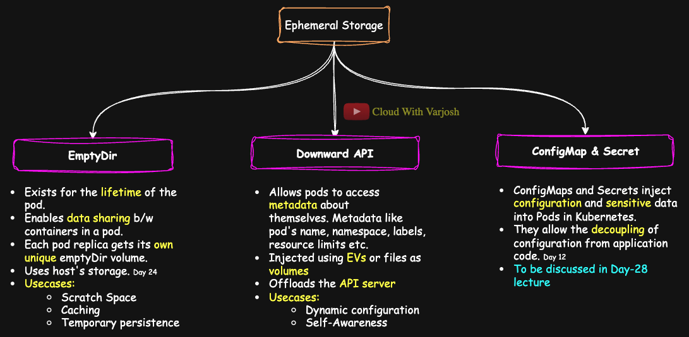

# Day 26: Kubernetes Volumes | Ephemeral Storage | emptyDir & downwardAPI DEMO | CKA Course 2025

## Video reference for Day 26 is the following:

[](https://www.youtube.com/watch?v=Zyublb8bSbU&ab_channel=CloudWithVarJosh)


---
## ⭐ Support the Project  
If this **repository** helps you, give it a ⭐ to show your support and help others discover it! 

---

## Table of Contents

1.  [Introduction](#introduction)
2.  [Ephemeral Storage](#ephemeral-storage)
    -   [EmptyDir](#emptydir)
        - [**Demo:** emptyDir](#demo-emptydir)
    -   [Downward API](#downward-api)
        -   [**Demo:** Environment Variables](#demo-downwardapi---environment-variables)
        -   [**Demo:** Files via Volumes](#demo-downwardapi---files-via-volumes)
11. [Conclusion](#conclusion)
12. [References](#references)

---
## **Introduction**

This guide provides an in-depth understanding of **Ephemeral Storage** in Kubernetes, focusing on the `emptyDir` volume and the **Downward API**. These features enable containers within a Pod to share temporary storage and dynamically access runtime metadata, respectively. This knowledge is essential for anyone preparing for the **CKA certification** or looking to master Kubernetes core concepts for real-world deployments.

You’ll learn:
- How `emptyDir` facilitates shared scratch space within a Pod.
- How the Downward API provides metadata through environment variables and mounted files.
- Real-world demos with `kubectl` commands for hands-on verification.

---

### **Ephemeral Storage**

Ephemeral storage refers to storage that is temporary, meaning that any data written to it only lasts for the duration of the Pod’s lifetime. When the Pod is deleted, the data is also lost.

#### **EmptyDir**



**What is EmptyDir?**  
  - `emptyDir` is an empty directory created when a Pod is assigned to a node. The directory exists for the lifetime of the Pod.
  - If you define an `emptyDir` volume in a Deployment, each Pod created by the Deployment will have its **own unique** `emptyDir` volume. Since `emptyDir` exists **only as long as the Pod is running**, any data stored in it is **lost when the Pod is terminated or deleted**.  
  - Defining an `emptyDir` in a Deployment ensures that **each Pod replica gets its own isolated temporary storage**, independent of other replicas. This is particularly useful for workloads where each Pod requires **scratch storage** that doesn’t need to persist beyond the Pod’s lifecycle.
  
**Why is it Used?**  
  It is ideal for scratch space (Temporary workspace for processing.), caching, or temporary computations where data persistence isn’t required.
  
Sure! Here's a refined and enhanced version of your message that improves clarity, grammar, and flow, while keeping the technical concepts intact:

---

**Writable vs Read-Only Layers in Containers (Day 24 Recap)**

In [Day 24](https://www.youtube.com/watch?v=5t3yHFoqK6g&t=12s&ab_channel=CloudWithVarJosh), we explored how **container images** work under the hood—specifically the concept of **read-only and writable layers**.

Let’s break it down:

If a Pod has **three containers** that all use the **same container image**, they **share the read-only image layer** to save space and optimize resource usage. However, **each container still gets its own writable layer**. So, any file changes or modifications done by one container remain **isolated** and are **not visible to the others**.

But what if you want them to share data?

That’s where **volumes** come into play—specifically, an `emptyDir` volume. If you mount the **same `emptyDir` volume** into all three containers, they now have access to a **shared writable space**. This allows them to **collaborate and share data** during the Pod’s lifetime, effectively **creating a shared writable layer** across containers.


Check out the **Day 24** content below:
**GitHub:** [Day 24 GitHub Notes](https://github.com/CloudWithVarJosh/CKA-Certification-Course-2025/tree/main/Day%2024)    
**YouTube:** [Day 24 YouTube Video](https://www.youtube.com/watch?v=5t3yHFoqK6g&t=12s&ab_channel=CloudWithVarJosh)

---

#### Demo: emptyDir  
  ```yaml
  apiVersion: v1  # Specifies the API version used to create the Pod.
  kind: Pod       # Declares the resource type as a Pod.
  metadata:
    name: emptydir-example  # Name of the Pod.
  spec:
    containers:
    - name: busybox-container  # Name of the container inside the Pod.
      image: busybox           # Using the lightweight BusyBox image.
      command: ["/bin/sh", "-c", "sleep 3600"]  # Overrides the default command. Keeps the container running for 1 hour (3600 seconds).
      volumeMounts:
      - mountPath: /data       # Mount point inside the container where the volume will be accessible.
        name: temp-storage     # Refers to the volume defined in the `volumes` section below.
    - name: busybox-container-2  # Name of the container inside the Pod.
      image: busybox           # Using the lightweight BusyBox image.
      command: ["/bin/sh", "-c", "sleep 3600"]
      volumeMounts:
      - mountPath: /data
        name: temp-storage
    volumes:
    - name: temp-storage       # Name of the volume, must match the name in `volumeMounts`.
      emptyDir: {}             # Creates a temporary directory that lives as long as the Pod exists.
                              # Useful for storing transient data that doesn't need to persist.

  ```
  *Here, `/data` is an emptyDir volume that will be removed along with the Pod.*


---

**Verification**

We will now verify that both containers within the same Pod can access the shared volume mounted using `emptyDir`.

**Step 1: Create a file from `busybox-container`**

```bash
kubectl exec emptydir-example -c busybox-container -- sh -c 'echo "What a file!" > /data/myfile.txt'
```

This command writes the string `"What a file!"` to a file named `myfile.txt` inside the shared `/data` directory.

**Step 2: Read the file from `busybox-container-2`**

```bash
kubectl exec emptydir-example -c busybox-container-2 -- cat /data/myfile.txt
```

**Expected Output:**

```
What a file!
```

---

**Key Takeaway:**

This demonstrates that both containers within the same Pod can access and share the same volume mounted using `emptyDir`.  
This level of sharing is **not possible with the Pod's default ephemeral storage**, as each container has its own isolated writable layer.  
Using `emptyDir` enables inter-container file sharing within a Pod.

---

#### **Downward API**


**What is the Downward API?**  
The Downward API in Kubernetes provides a mechanism for Pods to access metadata about themselves or their environment. This metadata can include information such as the Pod's name, namespace, labels, annotations, or resource limits. It is injected into containers in a Pod either as **environment variables** or through mounted **files via volumes**.

When the Downward API is configured in a Deployment, each Pod created by the Deployment gets its own unique set of metadata based on the Pod's attributes. This allows Pods to retrieve runtime-specific details dynamically, without hardcoding or manual intervention.

#### **Why is it Used?**  
- **Dynamic Configuration**: Enables applications to dynamically retrieve Pod-specific metadata, such as labels or resource limits.  
- **Self-Awareness**: Makes Pods aware of their environment, including their name, namespace, and resource constraints.  
- **Simplifies Configuration Management**: Helps eliminate the need for manual configuration by providing metadata directly to the containers.

---

**💡 Did You Know?**

Back in [Day 21](https://www.youtube.com/watch?v=VEwP_wF67Tw&ab_channel=CloudWithVarJosh), we discussed the **sidecar pattern**—a powerful design pattern in Kubernetes often used for logging, monitoring, and proxy use cases. These **sidecar (helper) containers** frequently rely on the **Downward API** to access real-time metadata such as the Pod name, namespace, labels, and resource limits.

Without the Downward API, these sidecars would need to **continuously poll the Kubernetes API server** to fetch this metadata, increasing API server load and introducing unnecessary network overhead. By using the Downward API, they can access this data **locally within the Pod**, improving performance and **offloading the API server**.

For example, imagine you're running a monitoring agent as a sidecar, and you want to collect metrics or logs for all Pods within a specific namespace like `app1-ns`. If the agent doesn’t know **which Pod it's running in** or **which namespace it belongs to**, it wouldn't be able to label or filter that data correctly. The Downward API solves this problem by **injecting runtime-specific metadata directly into the container**, making it **self-aware**.

👉 Explore **Day 21 (Sidecar Pattern)**:  
**GitHub:** [Day 21 GitHub Notes](https://github.com/CloudWithVarJosh/CKA-Certification-Course-2025/tree/main/Day%2021)
**YouTube:** [Day 21 YouTube Video](https://www.youtube.com/watch?v=VEwP_wF67Tw&ab_channel=CloudWithVarJosh)

---

#### Demo: downwardAPI - Environment variables

```yaml
apiVersion: v1
kind: Pod
metadata:
  name: downwardapi-example
  labels:
    app: demo
spec:
  containers:
  - name: metadata-container
    image: busybox
    command: ["/bin/sh", "-c", "env && sleep 3600"] 
    # The container prints all environment variables and then sleeps for 1 hour.
    env:
    - name: POD_NAME
      valueFrom:
        fieldRef:
          fieldPath: metadata.name
      # Creates an environment variable named POD_NAME.
      # The value of this variable is set dynamically using the Downward API.
      # It pulls the Pod's name (in this case, "downwardapi-example") from its metadata.
    - name: POD_NAMESPACE
      valueFrom:
        fieldRef:
          fieldPath: metadata.namespace
      # Creates an environment variable named POD_NAMESPACE.
      # The value of this variable is set dynamically using the Downward API.
      # It pulls the Pod's namespace (e.g., "default") from its metadata.
```

**Verification**


Run the following `kubectl exec` command to execute `env` inside the container:

```bash
kubectl exec downwardapi-example -- env | grep POD_
```

You should see output like:

```
POD_NAME=downwardapi-example
POD_NAMESPACE=default
```

This confirms that:
- `POD_NAME` is set to the Pod’s name.
- `POD_NAMESPACE` is set to the namespace it's running in (usually `default`, unless specified otherwise).

---

#### Demo: downwardAPI - Files via Volumes

```yaml
apiVersion: v1
kind: Pod
metadata:
  name: downwardapi-volume
  labels:
    app: good_app
    owner: hr
  annotations:
    version: "good_version"
spec:
  containers:
  - name: metadata-container
    image: busybox
    command: ["/bin/sh", "-c", "cat /etc/podinfo/* && sleep 3600"]
    # The container will display the contents of all files under /etc/podinfo (i.e., metadata)
    # and then sleep for an hour, keeping the pod alive for verification.
    volumeMounts:
    - name: downwardapi-volume
      mountPath: /etc/podinfo
      # Mounts the downward API volume at /etc/podinfo inside the container.
  volumes:
  - name: downwardapi-volume
    downwardAPI:
      items:
      - path: "labels"
        fieldRef:
          fieldPath: metadata.labels
        # Writes the Pod's labels to a file named 'labels' under /etc/podinfo.
      - path: "annotations"
        fieldRef:
          fieldPath: metadata.annotations
        # Writes the Pod's annotations to a file named 'annotations' under /etc/podinfo.

```

**Verification**

**Step 1: Exec into the Pod**

```bash
kubectl exec -it downwardapi-volume -- /bin/sh
```

Once inside the container shell, run:

```bash
cd /etc/podinfo
ls -l
```

You should see symbolic links:

```
annotations -> ..data/annotations
labels -> ..data/labels
```

These links are created because Kubernetes uses a [projected volume](https://kubernetes.io/docs/concepts/storage/volumes/#projected) with the Downward API, which manages file updates using symlinks pointing to the `..data/` directory. This allows for atomic updates.

---

**Step 2: View the Contents**

Check the content of each file:

```bash
cat labels
```

Expected output:
```
app="good_app"
owner="hr"
```

```bash
cat annotations
```

Expected output:
```
version="good_version"
```

These values are directly fetched from the pod’s metadata and written to files using the Downward API.

---

**Step 3: Verify Using Pod Logs**

Since the pod's container command was set to:

```yaml
command: ["/bin/sh", "-c", "cat /etc/podinfo/* && sleep 3600"]
```

The contents of `/etc/podinfo/labels` and `/etc/podinfo/annotations` will be printed in the pod's logs when it starts. To view them:

```bash
kubectl logs downwardapi-volume
```

Expected output:
```
app="good_app"
owner="hr"
version="good_version"
```

This further confirms that the Downward API volume successfully mounted the metadata into the container at runtime.


---

#### **ConfigMaps & Secrets (To Be Discussed in Next Lecture)**

- **Overview:**  
  ConfigMaps and Secrets are Kubernetes objects designed to inject configuration data and sensitive information into Pods. While they exist independently of Pods, when mounted as volumes, the data is temporary and only available for the Pod’s lifetime.
  
- **Why are they Used?**  
  They allow the decoupling of configuration from application code and the secure injection of sensitive data, simplifying management across multiple Pods.


---

### **Conclusion**

Understanding ephemeral storage mechanisms like `emptyDir` and tools like the **Downward API** equips Kubernetes practitioners with the ability to build efficient and self-aware containerized applications. These mechanisms promote:
- **Improved inter-container communication** through shared volumes.
- **Dynamic configuration management** without hardcoding values.
- **Decoupling application behavior from infrastructure metadata**, simplifying Pod management at scale.

As you progress to the next topics like **ConfigMaps** and **Secrets**, you will further expand your ability to manage both volatile and persistent data in Kubernetes clusters.

---

### **References**

- [Kubernetes Volumes - emptyDir](https://kubernetes.io/docs/concepts/storage/volumes/#emptydir)
- [Kubernetes - Downward API](https://kubernetes.io/docs/tasks/inject-data-application/downward-api-volume-expose-pod-information/)
- [Kubernetes - Projected Volumes](https://kubernetes.io/docs/concepts/storage/volumes/#projected)
- [Kubernetes Documentation](https://kubernetes.io/docs/home/)
- [CKA Exam Curriculum](https://github.com/cncf/curriculum)

---
