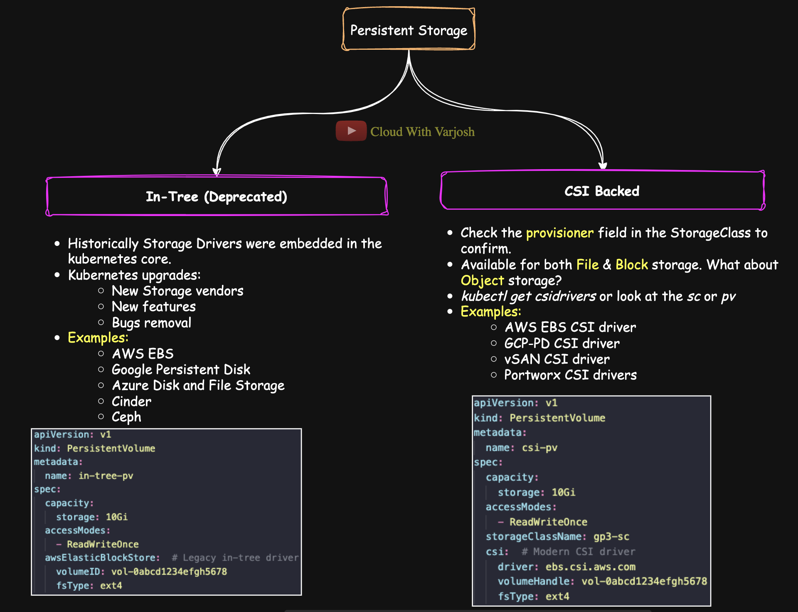
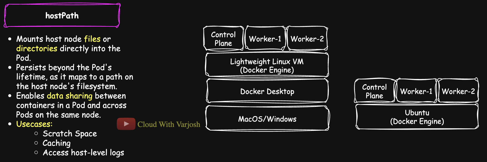
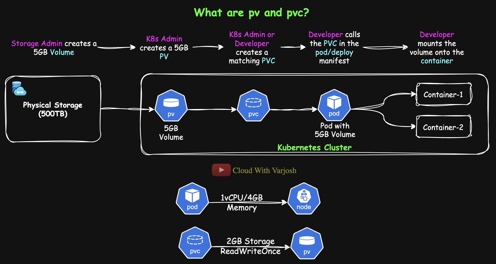
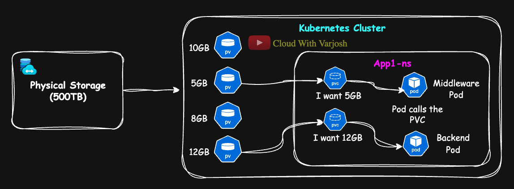
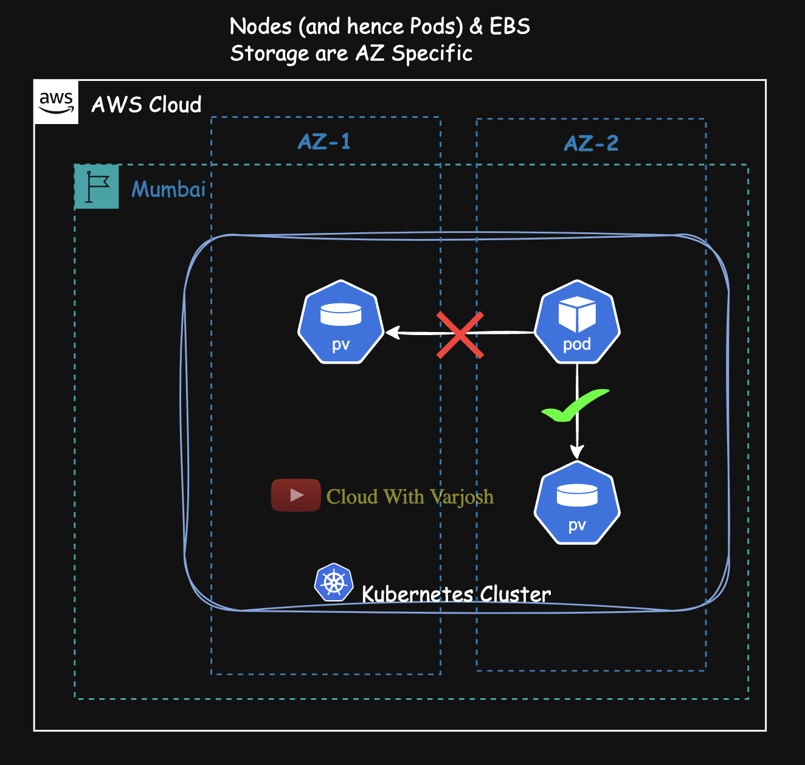

# Day 27: Kubernetes Volumes | Persistent Storage | PV, PVC, StorageClass, hostPath DEMO | CKA 2025

## Video reference for Day 27 is the following:

[](https://www.youtube.com/watch?v=C6fqoSnbrck&ab_channel=CloudWithVarJosh)

---
## ⭐ Support the Project  
If this **repository** helps you, give it a ⭐ to show your support and help others discover it! 

---


# Table of Contents

1.  [Introduction](#introduction)
4.  [Evolution of Kubernetes Storage: From Built-In Drivers to CSI Plugins](#evolution-of-kubernetes-storage-from-built-in-drivers-to-csi-plugins)
3.  [Persistent Storage](#persistent-storage)
    -   [hostPath](#hostpath)
         -   [**Demo:** hostPath](#demo-hostpath)
4.  [Persistent Volumes (PVs) & Persistent Volume Claims (PVCs)](#persistent-volumes-pvs--persistent-volume-claims-pvcs)
    - [Access Modes in Kubernetes Persistent Volumes](#access-modes-in-kubernetes-persistent-volumes)
    - [Reclaim Policies in Kubernetes](#reclaim-policies-in-kubernetes)
    - [PVC and PV Binding Conditions](#pvc-and-pv-binding-conditions)
    - [Critical Note for KIND/Minikube Users](#critical-note-for-kindminikube-users)
    -   [**Demo:** Persistent Volumes and PVCs with Reclaim Policy](#demo-persistent-volumes-and-pvcs-with-reclaim-policy)
5.  [Storage Classes & Dynamic Provisioning](#storage-classes--dynamic-provisioning)
    -   [Dynamic Provisioning in Action](#dynamic-provisioning-in-action)
    - [**Demo:** Storage Class](#demo-storage-class)
11. [Conclusion](#conclusion)
12. [References](#references)

---
## **Introduction**

 In this session, we’ll explore how Kubernetes handles persistent storage. We’ll cover critical aspects such as access modes, PV-PVC binding, Storage Classes, and the important concept of reclaim policies. By the end of this lecture, you’ll be well-equipped to manage storage in Kubernetes environments.

--- 

## Evolution of Storage in Kubernetes: From In-Tree to CSI Drivers



Managing **persistent storage** in Kubernetes has come a long way. Initially, storage drivers were built directly into Kubernetes' core codebase, known as **in-tree volume plugins**. Over time, this tightly coupled model proved limiting, leading to the adoption of the **Container Storage Interface (CSI)**—a modular and extensible solution for storage integration.

This write-up explores the transition from in-tree plugins to CSI drivers and explains where commonly-used storage types fit into Kubernetes today.

---

## 1. In-Tree Volume Plugins: The Legacy Model

In-tree volume plugins were integrated directly into Kubernetes' codebase. Adding or updating these plugins required modifying Kubernetes itself, resulting in several drawbacks:

- Maintenance was cumbersome and tied to Kubernetes release cycles.
- Vendors could not independently develop or release updates.
- Bugs in storage drivers could affect Kubernetes core functionality.

### Examples of In-Tree Plugins:
- `awsElasticBlockStore` (AWS EBS)
- `azureDisk`, `azureFile`
- `gcePersistentDisk` (GCE PD)
- `nfs`, `glusterfs`
- `rbd` (Ceph RADOS Block Device)
- `iscsi`, `fc` (Fibre Channel)

**Note:** Most in-tree plugins are deprecated and replaced with CSI drivers.

---

## 2. Container Storage Interface (CSI): The Modern Standard

To address the limitations of in-tree plugins, Kubernetes adopted the **Container Storage Interface (CSI)**, developed by the **Cloud Native Computing Foundation (CNCF)**. CSI decouples storage driver development from Kubernetes core, allowing vendors to independently create and maintain their drivers.

### Key Benefits of CSI:
- **Independent updates:** Vendors can release drivers without waiting for Kubernetes updates.
- **Faster development:** Features and fixes are delivered more quickly.
- **Flexibility:** CSI supports advanced capabilities like snapshotting, resizing, cloning, and monitoring.
- **Easy integration:** Drivers for custom use cases can be developed with ease.

### Examples of CSI Drivers:
- AWS EBS CSI Driver: `ebs.csi.aws.com`
- GCE PD CSI Driver: `pd.csi.storage.gke.io`
- Azure Disk CSI Driver: `disk.csi.azure.com`
- Ceph CSI Driver
- OpenEBS CSI Drivers (e.g., for cStor, Jiva, etc.)
- Portworx CSI, vSphere CSI

**Note:** Starting with Kubernetes 1.21, most in-tree volume plugins were officially deprecated, and CSI became the default for handling persistent volumes.

---

## Special Cases: `hostPath` and `local` Storage

### `hostPath`
- Mounts a directory from the node directly into the pod.
- Primarily used for testing or simple workloads.
- In-tree only; there is no CSI implementation.
- **Caution:** Unsuitable for production due to security risks and lack of scheduling guarantees.

### `local` Volumes
- Mounts a physical disk attached to a node.
- Can be implemented as either in-tree or CSI-based, depending on the setup.
- Useful for tightly coupled environments like on-premises clusters.
- Works well with **PersistentVolume** and supports **node affinity** for proper pod scheduling.

---

#### **Transitioning from In-Tree Drivers**
While in-tree drivers served their purpose in the early stages of Kubernetes, they are now being deprecated. CSI plugins are the recommended approach for modern storage management. For example:

**In-Tree Driver Example**:
```yaml
apiVersion: v1
kind: PersistentVolume
metadata:
  name: in-tree-pv
  # Name of the PersistentVolume resource.
spec:
  capacity:
    storage: 10Gi
    # Defines the size of the volume. This PV provides 10Gi of storage.
  accessModes:
    - ReadWriteOnce
    # The volume can be mounted as read-write by a single node.
  awsElasticBlockStore:
    # This is the legacy in-tree volume plugin for AWS EBS.
    # It allows mounting an existing AWS EBS volume into a pod.
    volumeID: vol-0abcd1234efgh5678
    # The unique ID of the EBS volume to be mounted.
    fsType: ext4
    # The filesystem type of the volume. This must match the filesystem on the EBS volume.

```

**CSI Driver Example**:
```yaml
apiVersion: v1
kind: PersistentVolume
metadata:
  name: csi-pv
  # The name of the PersistentVolume resource.
spec:
  capacity:
    storage: 10Gi
    # Defines the storage size of the volume. This volume offers 10Gi of space.
  accessModes:
    - ReadWriteOnce
    # The volume can be mounted as read-write by only one node at a time.
  storageClassName: gp3-sc
  # The StorageClass to which this volume belongs.
  # This allows dynamic provisioning and matching with a PVC that requests 'gp3-sc'.
  csi:
    # This specifies the use of a Container Storage Interface (CSI) driver,
    # which is the recommended way to provision external storage in modern Kubernetes clusters.
    driver: ebs.csi.aws.com
    # The name of the CSI driver used for AWS EBS volumes.
    volumeHandle: vol-0abcd1234efgh5678
    # The unique ID of the EBS volume in AWS.
    # This is used by the driver to locate and attach the correct volume.
    fsType: ext4
    # The filesystem type to mount. This must match the actual filesystem on the EBS volume.

```

---

#### **Key Takeaways:**
1. **In-Tree Drivers**: These legacy solutions are tightly coupled with Kubernetes and being phased out.  
2. **CSI Plugins**: The preferred method for storage integration, offering scalability and extensibility.  
3. **Dynamic Provisioning**: CSI supports automated volume creation and lifecycle management via StorageClasses.  
4. **File, Block, and Object Storage**:
   - **File and Block Storage**: Mountable as volumes in Pods using CSI plugins.  
   - **Object Storage**: Not natively mountable; access via application-level SDKs or APIs is recommended.

---

Kubernetes supports **CSI (Container Storage Interface) plugins** for both **file (NFS)** and **block storage** options. These plugins are provided by storage vendors such as **NetApp**, **Dell EMC**, and cloud providers like **AWS**, **Azure**, and **Google Cloud Platform (GCP)**. CSI plugins enable Kubernetes Pods to access file and block storage seamlessly, offering advanced features like dynamic provisioning, snapshots, and volume resizing.

For object storage solutions like **Amazon S3**, **Azure Blob Storage**, or **Google Cloud Storage (GCS)**, Kubernetes does not natively support mounting object storage as volumes because object storage operates differently from file systems. Instead, it is **recommended to use application-specific SDKs** or APIs to interact with object storage. These SDKs allow applications to efficiently access and manage object storage for tasks such as retrieving files, uploading data, and performing operations like versioning or replication.

The distinction lies in the use case:  
- **File and Block Storage**: Designed for direct mounting and integration with Kubernetes workloads using CSI plugins.  
- **Object Storage**: Better suited for application-level access via APIs or SDKs, as it was not designed to be mounted like file systems.  

By leveraging CSI plugins for file and block storage, and SDKs for object storage, you can make the most of modern, scalable storage options tailored to your Kubernetes workloads.

> Earlier, Kubernetes supported a lot of built-in drivers, called in-tree plugins. But today, the ecosystem has fully moved to **CSI drivers**, which are the future-proof way to provision and consume persistent storage. So whatever storage you’re dealing with — AWS EBS, NFS, iSCSI — if you’re doing it the modern way, you’re doing it with a **CSI driver**.

---

### **Persistent Storage**

Before diving into Persistent Volumes (PVs) and Persistent Volume Claims (PVCs), let's first discuss **hostPath**, a persistent storage option in Kubernetes. While Kubernetes does not generally recommend using `hostPath` due to its limitations and security concerns, it can still be useful in specific scenarios.

#### **hostPath**

- **What is hostPath?**  
  A `hostPath` volume mounts files or directories from the host node’s filesystem directly into the Pod.
  `hostPath` volumes are **node-specific**, meaning they are limited to the node where the Pod is scheduled. All Pods running on the same node can access and share data stored in a `hostPath` volume. However, since each node has its own independent storage, **Pods on different nodes cannot share the same `hostPath` volume**, making it unsuitable for distributed workloads requiring cross-node data sharing.
  
- **Why is it Used?**  
  It is used for scenarios such as debugging, accessing host-level files (logs, configuration files), or sharing specific host resources with containers.

**Why Kubernetes Recommends Avoiding `hostPath`**  
- **Security Risks**: Pods can access sensitive host files if `hostPath` is misconfigured.  
- **Limited Portability**: Since `hostPath` is tied to a node, it reduces flexibility in scheduling.  
- **Better Alternatives**: Kubernetes recommends using **PersistentVolumes (PV) with PersistentVolumeClaims (PVC)** or **local PersistentVolumes**, which offer better control and security. We will discuss these later in this lecture.

Learn more: [Kubernetes Documentation on hostPath](https://kubernetes.io/docs/concepts/storage/volumes/#hostpath).

> With `emptyDir`, all containers **within a single pod** can access the shared volume, but it is **not accessible to other pods**.  
> With `hostPath`, **any pod running on the same node** that mounts the same host directory path can access the same volume data, thus enabling **cross-pod sharing on the same node**.

---

### **Understanding `hostPath` in KIND: How Storage Works Under the Hood**



When using KIND (Kubernetes IN Docker), it’s important to understand where your `hostPath` volumes are actually created — especially because Docker behaves differently across operating systems.

#### **1. On Ubuntu/Linux**

- On Linux distributions like **Ubuntu**, **Docker Engine runs natively** on the host OS.
- So when you define a `hostPath` volume, like `/tmp/hostfile`, it points directly to the **host’s actual filesystem** (i.e., your Ubuntu machine).
- The path `/tmp/hostfile` truly exists on the Ubuntu host, and the container will mount that exact path into the Pod.

#### **2. On macOS and Windows**

- Docker Engine **does not run natively** on macOS or Windows, since it requires a Linux kernel.
- Docker Desktop creates a **lightweight Linux VM** internally (via **HyperKit** on macOS or **WSL2** on Windows) to run the Docker Engine.
- KIND then runs each Kubernetes node (`control-plane`, `worker-1`, `worker-2`) as a **Docker container** inside that Linux VM.
- When you define a `hostPath` in a Pod spec (e.g., `/tmp/hostfile`), it **does not point to your macOS or Windows host filesystem**.
- Instead, it points to the **filesystem of the specific Docker container (the Kubernetes node) running that Pod**.
  
  > So, technically, the `hostPath` volume is **inside the container** representing your worker node — **not** on your macOS/Windows host, and **not even directly inside the lightweight Linux VM** used by Docker Desktop.

---

### **Key Takeaway**

| Platform      | Docker Engine Runs On | `hostPath` Points To                            |
|---------------|------------------------|-------------------------------------------------|
| Ubuntu/Linux  | Natively               | Host's actual filesystem (e.g., `/tmp/hostfile`) |
| macOS/Windows | Linux VM via Docker    | Filesystem **inside the Kubernetes node container** |

---

### **Why This Matters**

When testing `hostPath` on macOS/Windows using KIND, any file you write via the volume:
- Exists **only inside the worker node container**.
- Is **not visible** on your macOS/Windows host filesystem.
- Will be lost if the KIND cluster or node container is destroyed.

This is important when you're simulating persistent storage, as `hostPath` is not portable across nodes and shouldn't be used in production — but is often used for demos or local testing.

---

### Demo: hostPath

In this demonstration, we showcase how to use the `hostPath` volume type in Kubernetes to mount a file from the host node into a container.

We begin by creating the following Pod:

```yaml
apiVersion: v1
kind: Pod
metadata:
  name: hostpath-example
spec:
  containers:
  - name: busybox-container
    image: busybox
    command: ["sh", "-c", "cat /data && sleep 3600"]
    # The container reads and prints the content of /data, then sleeps for 1 hour.
    volumeMounts:
    - mountPath: /data
      name: host-volume
      # Mounts the 'host-volume' to the /data path inside the container.
      # This gives the container access to the file on the host.
  volumes:
  - name: host-volume
    hostPath:
      path: /tmp/hostfile
      type: FileOrCreate
      # If /tmp/hostfile doesn't exist on the host, it is created as an empty file before being mounted.
```

> With this configuration, the file `/tmp/hostfile` on the host becomes accessible inside the container at `/data`.

Now, let’s populate the file with content using the command below:

```bash
kubectl exec -it hostpath-example -- sh -c 'echo "Hey you!!" > /data'
```

**Understanding `hostPath` Types**

Kubernetes supports several `hostPath` volume types that define how paths on the host are managed. For detailed information on supported types such as `Directory`, `File`, `Socket`, and `BlockDevice`, refer to the official documentation:

[Kubernetes Documentation - hostPath Volume Types](https://kubernetes.io/docs/concepts/storage/volumes/#hostpath-volume-types)

---

**Verification Across Pods on the Same Node**

Since `hostPath` uses the underlying node’s filesystem, the data can be shared between different pods **only if they are scheduled on the same node**.

To determine where the initial pod was scheduled:

```bash
kubectl get pods -o wide
```

Assuming the pod was created on a node named `my-second-cluster-worker2`, we can now schedule a new pod on the same node to validate data sharing:

```yaml
apiVersion: v1
kind: Pod
metadata:
  name: hostpath-verify
spec:
  nodeName: my-second-cluster-worker2
  containers:
  - name: busybox-container
    image: busybox
    command: ["sh", "-c", "cat /data && sleep 3600"]
    volumeMounts:
    - mountPath: /data
      name: host-volume
  volumes:
  - name: host-volume
    hostPath:
      path: /tmp/hostfile
      type: FileOrCreate
```

To verify that the new pod can access the same file content:

```bash
kubectl exec hostpath-verify -- cat /data
```

You should see the output:
```
Hey you!!
```

This confirms that both pods are using the same file from the host node via `hostPath`.

---

### Persistent Volumes (PVs) & Persistent Volume Claims (PVCs)


#### **Persistent Volumes (PVs)**

- **What is a PV?**  
  A PV is a piece of storage in your cluster that has been provisioned either manually by an administrator or dynamically using Storage Classes.
  
- **Key Characteristics:**  
  PVs exist independently of Pod lifecycles and can be reused or retained even after the Pod is deleted. They have properties such as **capacity, access modes, and reclaim policies**.

#### **Persistent Volume Claims (PVCs)**

- **What is a PVC?**  
  A PVC is a request for storage by a user. It functions similarly to how a Pod requests compute resources. When a PVC is created, Kubernetes searches for a PV that meets the claim's requirements.
  
- **Binding Process:**  
  1. **Administrator:** Provisions PVs (or sets up Storage Classes for dynamic provisioning).  
  2. **Developer:** Creates a PVC in the Pod specification requesting specific storage attributes.  
  3. **Kubernetes:** Binds the PVC to a suitable PV, thereby making the storage available to the Pod.


**Pods rely on Node resources—such as CPU, memory, and network—to run containers.** On the other hand, when a Pod requires **persistent storage**, it uses a **PersistentVolumeClaim (PVC)** to request storage from a **PersistentVolume (PV)**, which serves as the **actual storage backend**. This separation of compute and storage allows Kubernetes to manage them independently, improving flexibility and scalability.

---

### **Understanding Scope & Relationships of PV and PVC in Kubernetes**

In Kubernetes, **PersistentVolumes (PVs)** and **PersistentVolumeClaims (PVCs)** play a central role in persistent storage — but they differ in how they're scoped and used.



#### **PVs are Cluster-Scoped Resources**
- A **PersistentVolume (PV)** is a **cluster-wide resource**, just like Nodes or StorageClasses.
- This means it is **not tied to any specific namespace**, and it can be viewed or managed from anywhere within the cluster.
- You can verify this using:
  ```bash
  kubectl api-resources | grep persistentvolume
  ```
  This shows that the resource `persistentvolumes` has **no namespace**, indicating it's **cluster-scoped**.

#### **PVCs are Namespace-Scoped**
- A **PersistentVolumeClaim (PVC)**, on the other hand, is a **namespaced resource**, just like Pods or Deployments.
- This means it exists **within a specific namespace** and is only accessible by workloads (Pods) within that namespace.
- You can verify this using:
  ```bash
  kubectl api-resources | grep persistentvolumeclaim
  ```
  This shows that `persistentvolumeclaims` are scoped within a namespace.

---

### **Why Is This Important?**

Let’s say you have a namespace called `app1-ns`. If a PVC is created in `app1-ns` and binds to a PV, **only Pods in `app1-ns` can use that PVC**.

If a Pod in `app2-ns` tries to reference the same PVC, it will fail — because the PVC is invisible and inaccessible outside its namespace.

---

### **1-to-1 Binding Relationship Between PVC and PV**

- A **PVC can bind to only one PV**.
- Similarly, **a PV can be bound to only one PVC**.
- This is a **strict one-to-one relationship**, ensuring data integrity and predictable access control.
- Once a PV is bound, its `claimRef` field is populated, and it cannot be claimed by any other PVC unless explicitly released.

> **`claimRef`** is a field in a **PersistentVolume (PV)** that records which **PersistentVolumeClaim (PVC)** has successfully claimed it. It includes details like the PVC’s name and namespace. This field ensures that the PV is not mistakenly claimed by any other PVC, enforcing a **one-to-one binding** between the PV and its assigned PVC.

---

### **Additional Key Points**
- **PVCs request storage**; PVs **fulfill that request** if they match capacity, access mode, and storage class.
- Once a PVC is bound, **it remains bound** until:
  - The PVC is deleted.
  - The PV is manually reclaimed or deleted (depending on the reclaim policy).
- The reclaim policy (`Retain`, `Delete`, or deprecated `Recycle`) determines what happens to the PV after the PVC is deleted.

---

### **Example Scenario**

Let’s say:
- You create a PVC named `data-pvc` in the namespace `app1-ns`.
- It binds to a cluster-scoped PV.
- Only **Pods in `app1-ns`** can now reference this PVC.

If a Pod in `app2-ns` tries to mount this PVC, it will result in an error like:
```
persistentvolumeclaims "data-pvc" not found
```

Because from `app2-ns`'s perspective, that PVC does not exist.

---

### **Kubernetes Persistent Storage Flow (Manual Provisioning)**


| **Step** | **Role**                | **Action**                                                                                          | **Details / Notes**                                                                 |
|----------|-------------------------|------------------------------------------------------------------------------------------------------|--------------------------------------------------------------------------------------|
| 1        | **Developer**           | Requests 5Gi persistent storage for a Pod.                                                           | May request via a PVC or through communication with the Kubernetes Admin.          |
| 2        | **Kubernetes Admin**    | Coordinates with Storage Admin for backend volume.                                                  | Backend storage could be SAN/NAS exposed via iSCSI, NFS, etc.                      |
| 3        | **Storage Admin**       | Allocates a physical volume from a 500Ti storage pool.                                               | May involve LUN creation, NFS export, etc., based on the infrastructure.            |
| 4        | **Kubernetes Admin**    | Creates a **PersistentVolume (PV)** representing the physical volume in Kubernetes.                 | Specifies capacity, `accessModes`, `volumeMode`, `storageClassName`, etc.          |
| 5        | **Developer**           | Creates a **PersistentVolumeClaim (PVC)** requesting 5Gi with specific access and volume modes.     | PVC must match criteria defined in the PV.                                          |
| 6        | **Kubernetes**          | Binds PVC to a suitable PV if all parameters match.                                                 | Matching criteria include: storage class, access mode, volume mode, size, etc.     |
| 7        | **Pod**                 | References the PVC in its volume definition and mounts it in a container.                          | PVC acts as an abstraction; Pod doesn’t interact with the PV directly.             |

---

### **Important Notes**

- **PV** is a **cluster-scoped** resource.
- **PVC** is a **namespaced** resource.
- One **PV can be claimed by only one PVC** (1:1 relationship).
- The Pod must be in the **same namespace** as the PVC it is using.
- Communication with physical storage is handled by either:
  - **In-tree drivers** (legacy; e.g., `awsElasticBlockStore`, `azureDisk`)
  - **CSI drivers** (modern; e.g., `ebs.csi.aws.com`, `azurefile.csi.azure.com`)

> In many cases, developers are well-versed with Kubernetes and can handle the creation of **PersistentVolumeClaims (PVCs)** themselves. With the introduction of **StorageClasses**, the process of provisioning **PersistentVolumes (PVs)** has been **automated**—eliminating the need for Kubernetes administrators to manually coordinate with storage admins and pre-create PVs. When a PVC is created with a **StorageClass**, Kubernetes **dynamically provisions** the corresponding PV. We’ll explore StorageClasses in detail shortly.

---

#### **Access Modes in Kubernetes Persistent Volumes**

Persistent storage in Kubernetes supports various access modes that dictate how a volume can be mounted. Access modes essentially govern how the volume is mounted across **nodes**, which is critical in clustered environments like Kubernetes.
 

| **Access Mode**          | **Description**                                                                                          | **Example Use Case**                                            | **Type of Storage & Examples** |
|--------------------------|----------------------------------------------------------------------------------------------------------|----------------------------------------------------------------|--------------------------------|
| **ReadWriteOnce (RWO)**  | The volume can be mounted as read-write by a **single node**. Multiple Pods can access it **only if** they are on the same node. | Databases that require exclusive access but may run multiple replicas per node.  | **Block Storage** (e.g., Amazon EBS, GCP Persistent Disk, Azure Managed Disks) |
| **ReadOnlyMany (ROX)**   | The volume can be mounted as **read-only** by **multiple nodes** simultaneously.                        | Sharing static data like configuration files or read-only datasets across multiple nodes. | **File Storage** (e.g., NFS, Azure File Storage) |
| **ReadWriteMany (RWX)**  | The volume can be mounted as **read-write** by **multiple nodes** simultaneously.                       | Content management systems, shared data applications, or log aggregation. | **File Storage** (e.g., Amazon EFS, Azure File Storage, On-Prem NFS) |
| **ReadWriteOncePod (RWOP)** (Introduced in v1.29) | The volume can be mounted as read-write by **only one Pod across the entire cluster**.                 | Ensuring exclusive access to a volume for a single Pod, such as in tightly controlled workloads. | **Block Storage** (e.g., Amazon EBS with `ReadWriteOncePod` enforcement) |

---

### **Explanation of Storage Types**

#### **Block Storage**  
Block storage is ideal for databases and applications requiring **low-latency, high-performance storage**. It provides raw storage blocks that applications can format and manage as individual disks.  
- **Examples**: Amazon EBS, GCP Persistent Disk, Dell EMC Block Storage.  
- **Key Characteristic**: Block storage is generally **node-specific** and does not support simultaneous multi-node access.  
- **Access Modes**: Commonly used with `ReadWriteOnce` or `ReadWriteOncePod`, as these modes restrict access to a single node or Pod at a time.

*Analogy*: Block storage is like attaching a USB drive to a single computer—it provides fast, reliable storage but cannot be shared concurrently across multiple systems.

---

#### **File Storage**  
File storage is designed for **shared storage scenarios**, where multiple Pods or applications need simultaneous access to the same data. It is mounted as a shared filesystem, making it ideal for distributed workloads.  
- **Examples**: Amazon EFS, Azure File Storage, On-Prem NFS (Network File System).  
- **Key Characteristic**: File storage is purpose-built for **multi-node concurrent access**.  
- **Access Modes**: File storage often supports modes like `ReadOnlyMany` or `ReadWriteMany`, allowing multiple Pods—across different nodes—to read from and write to the same volume.

*Analogy*: File storage works like a network drive, where multiple systems can access, update, and share files simultaneously.

---

### **Key Differences: Block Storage vs. File Storage**
1. **Multi-Node Access**: Block storage is single-node focused, whereas file storage allows concurrent access across multiple nodes.  
2. **Access Modes**: `ReadWriteOnce` or `ReadWriteOncePod` are typical for block storage, while `ReadWriteMany` is common for file storage due to its multi-node capabilities.  
3. **Use Cases**:  
   - **Block Storage**: Databases, transactional systems, or workloads requiring exclusive and high-performance storage.  
   - **File Storage**: Shared workloads like web servers, content management systems, and applications requiring shared configurations or assets.

When evaluating storage options, it's important to align the access modes and storage type with the needs of the workload. For example, "Many" in an access mode (`ReadOnlyMany` or `ReadWriteMany`) usually signals that the underlying storage is file-based and optimized for shared use.

---


### **Reclaim Policies in Kubernetes**  

Reclaim policies define what happens to a **PersistentVolume (PV)** when its bound **PersistentVolumeClaim (PVC)** is deleted. The available policies are:  


#### **1. Delete (Common for Dynamically Provisioned Storage)**  
- When the PVC is deleted, the corresponding PV and its underlying **storage resource** (e.g., cloud disk, block storage) are **automatically deleted**.  
- This is useful in **cloud environments** where storage resources should be freed when no longer in use.  

**🔹 Example Use Case:**  
- **AWS EBS, GCP Persistent Disk, Azure Disk** – Storage dynamically provisioned via CSI drivers gets deleted along with the PV, preventing orphaned resources.  

---

#### **2. Retain (Manual Intervention Needed for Reuse)**  
- When the PVC is deleted, the PV remains in the cluster but moves to a **"Released"** state.  
- **The data is preserved**, and manual intervention is required to either:  
  - Delete and clean up the volume.  
  - Rebind it to another PVC by manually removing the claim reference (`claimRef`).  

**🔹 Example Use Case:**  
- **Auditing & Compliance:** Ensures data is retained for logs, backups, or forensic analysis.  
- **Manual Data Recovery:** Useful in scenarios where storage should not be automatically deleted after PVC removal.  

---

#### **3. Recycle (Deprecated in Kubernetes v1.20+)**  
- This policy would automatically **wipe the data** (using a basic `rm -rf` command) and make the PV available for new claims.  
- It was removed in favor of **dynamic provisioning** and more secure, customizable cleanup methods.  

**🔹 Why Deprecated?**  
- Lacked customization for **secure erasure** methods.  
- Didn't support advanced cleanup operations (e.g., snapshot-based restoration).  

---

### **Choosing the Right Reclaim Policy**  

| **Reclaim Policy** | **Behavior** | **Best Use Case** | **Common in** |
|-------------------|------------|-----------------|----------------|
| **Delete** | Deletes PV and storage resource when PVC is deleted. | Cloud-based dynamically provisioned storage. | AWS EBS, GCP PD, Azure Disk. |
| **Retain** | Keeps PV and storage, requiring manual cleanup. | Backup, auditing, manual data recovery. | On-prem storage, long-term retention workloads. |
| **Recycle (Deprecated)** | Cleans volume and makes PV available again. | (Not recommended) | Previously used in legacy systems. |


---

### **PVC and PV Binding Conditions**  

For a **PersistentVolumeClaim (PVC)** to bind with a **PersistentVolume (PV)** in Kubernetes, the following conditions must be met:  

- **Matching Storage Class**  
  - The `storageClassName` of the PVC and PV must match.  
  - If the PVC does not specify a storage class, it can bind to a PV **without a storage class**.  

- **Access Mode Compatibility**  
  - The access mode requested by the PVC (`ReadWriteOnce`, `ReadOnlyMany`, `ReadWriteMany`) **must be supported** by the PV.  

- **Sufficient Storage Capacity**  
  - The PV’s storage **must be equal to or greater than** the requested capacity in the PVC.  

- **Volume Binding Mode**  
  - If set to `Immediate`, the PV binds as soon as a matching PVC is found.  
  - If set to `WaitForFirstConsumer`, binding happens **only when a pod** using the PVC is scheduled.  

- **PV Must Be Available**  
  - The PV must be in the `Available` state (i.e., not already bound to another PVC).  
  - If the PV is already bound, it **cannot** be reused unless manually released.  

- **Matching Volume Mode**

    **Volume Modes** define how a Persistent Volume (PV) is presented to a Pod:
    1. **Block**: Provides raw, unformatted storage for the Pod. The application handles formatting and usage.  
    2. **Filesystem**: Presents a formatted volume, ready for file-level operations.  

    **Matching Modes**:  
    - A PVC requesting `volumeMode: Block` must match a PV with `volumeMode: Block`.  
    - A PVC requesting `volumeMode: Filesystem` must match a PV with `volumeMode: Filesystem`.

    **Use Case for `volumeMode: Block`**: This is typically used when an application, such as a database (e.g., PostgreSQL, MySQL), needs direct control over disk formatting, partitioning, or low-level I/O optimizations.

    This ensures compatibility between Pods and their storage. 

- **Claim Reference (Manual Binding Cases)**  
  - If the PV has a `claimRef` field, it can **only bind** to the specific PVC mentioned in that field.  

These conditions ensure a **seamless** and **reliable** binding process, providing persistent storage to Kubernetes workloads.  

---

### **Summary Table: PVC and PV Binding Conditions**  

| **Condition**              | **Requirement for Binding**                                             |
|----------------------------|-------------------------------------------------------------------------|
| **Storage Class Match**     | `storageClassName` of PVC and PV must match (or both can be empty).   |
| **Access Mode Compatibility** | PVC’s requested access mode must be supported by PV.                 |
| **Sufficient Capacity**     | PV’s storage must be **≥** PVC’s requested capacity.                 |
| **Volume Binding Mode**     | Either `Immediate` or `WaitForFirstConsumer`.                         |
| **Volume State**           | PV must be in `Available` state to bind.                             |
| **Matching Volume Mode**    | PVC and PV must have the same `volumeMode` (`Filesystem` or `Block`). |
| **Claim Reference**         | If PV has a `claimRef`, it can only bind to that specific PVC.        |

---

### **Example Table: PVC vs. PV Matching**  

| **Condition**       | **PVC Requirement** | **PV Must Have**        |
|--------------------|---------------------|-------------------------|
| **Storage Capacity** | `size: 10Gi`        | `size ≥ 10Gi`           |
| **Access Mode**      | `ReadWriteMany`     | `ReadWriteMany`         |
| **Storage Class**    | `fast-ssd`          | `fast-ssd`              |
| **Volume State**     | `Unbound`           | `Available`             |
| **Volume Mode**      | `Filesystem`        | `Filesystem`            |

---

### **Critical Note for KIND/Minikube Users**

If you're following along with this course, chances are you’ve installed **KIND (Kubernetes IN Docker)**. KIND comes with a **pre-configured default StorageClass** out of the box.  

If you're using **Minikube** instead, it's a good idea to check whether your cluster also includes a default StorageClass. You can verify this using the following command:

```bash
kubectl get storageclasses
```

Example output:
```
NAME                 PROVISIONER             RECLAIMPOLICY   VOLUMEBINDINGMODE      ALLOWVOLUMEEXPANSION   AGE
standard (default)   rancher.io/local-path   Delete          WaitForFirstConsumer   false                  27d
```

#### **Why Modify the Default Storage Class?**

The default storage class (`standard`) interferes with our demo of Persistent Volumes (PVs) and Persistent Volume Claims (PVCs). For this reason, we will temporarily **delete it**. However, before deleting it, we’ll take a backup of the YAML configuration. This will allow us to recreate the storage class later when moving to the **Storage Classes** section.

---

#### **Steps to Back Up and Delete the Storage Class**

1. **Backup the Default Storage Class Configuration**:
   Use the following command to back up the configuration into a file named `sc.yaml` in your current working directory:
   ```bash
   kubectl get sc standard -o yaml > sc.yaml
   ```
   - This ensures we can recreate the `standard` storage class later as needed.

2. **Delete the Storage Class**:
   Now, delete the `standard` storage class to prevent interference with the PV/PVC demo:
   ```bash
   kubectl delete sc standard
   ```
   Example output:
   ```
   storageclass.storage.k8s.io "standard" deleted
   ```

By following these steps, we ensure that the default configuration doesn’t disrupt our hands-on exercises and we can restore it later when necessary.

---

### **Demo: Persistent Volumes and PVCs with Reclaim Policy**

#### **Step 1: Create a Persistent Volume (PV)**

Create a file (for example, `pv.yaml`) with the following content:

```yaml
apiVersion: v1                       # Kubernetes API version
kind: PersistentVolume              # Defines a PersistentVolume resource
metadata:
  name: example-pv                  # Unique name for the PV
spec:
  capacity:
    storage: 5Gi                    # Total storage provided (5 GiB)
  accessModes:
    - ReadWriteOnce                # Volume can be mounted as read-write by a single node at a time
  persistentVolumeReclaimPolicy: Retain  # Retain the volume and data even when the PVC is deleted
  hostPath:
    path: /mnt/data                # Uses a directory on the node (for demo purposes only)
```

Sure! Here's an improved and clearer version of your note:

> **Note:** When the `ReclaimPolicy` is set to `Retain`, the PersistentVolume (PV) and its data will **not be deleted** even if the associated PersistentVolumeClaim (PVC) is removed. This means the storage is **preserved for manual recovery or reassignment**, and must be manually handled by an administrator before it can be reused.


**Apply the PV:**

```bash
kubectl apply -f pv.yaml
```

**Verify the PV:**

```bash
kubectl get pv
kubectl describe pv example-pv
```

---

#### **Step 2: Create a Persistent Volume Claim (PVC)**

Create a file (for example, `pvc.yaml`) with the following content:

```yaml
apiVersion: v1                       # Kubernetes API version
kind: PersistentVolumeClaim         # Defines a PVC resource
metadata:
  name: example-pvc                 # Unique name for the PVC
spec:
  accessModes:
    - ReadWriteOnce                # Request volume to be mounted as read-write by a single node
  resources:
    requests:
      storage: 2Gi                 # Ask for at least 2Gi of storage (must be ≤ PV capacity)
```

> **Key Point:**  
> Since this PVC doesn’t explicitly specify a StorageClass, it will bind to a compatible PV if available. In this demo, the PV created above offers 5Gi, making it a suitable candidate for a 2Gi claim.

**Apply the PVC:**

```bash
kubectl apply -f pvc.yaml
```

**Verify the PVC status:**

```bash
kubectl get pvc
kubectl describe pvc example-pvc
```

---

#### **Step 3: Create a Pod That Uses the PVC**

Create a file (for example, `pod.yaml`) with the following content:

```yaml
apiVersion: v1                       # Kubernetes API version
kind: Pod                           # Defines a Pod resource
metadata:
  name: example-pod                 # Unique name for the Pod
spec:
  containers:
    - name: nginx-container         # Name of the container
      image: nginx                  # Container image to use
      volumeMounts:
        - mountPath: /usr/share/nginx/html  # Directory inside the container where the volume will be mounted
          name: persistent-storage  # Logical name for the volume mount
  volumes:
    - name: persistent-storage      # Volume's name referenced above
      persistentVolumeClaim:
        claimName: example-pvc      # Bind this volume to the previously created PVC
```

> **Important:**  
> When this Pod is created, Kubernetes will bind the PVC to the appropriate PV (if not already bound) and mount the volume. At this point, the PVC status should change from "Pending" to "Bound".

**Apply the Pod:**

```bash
kubectl apply -f pod.yaml
```

**Verify the Pod and its Volume Attachment:**

```bash
kubectl describe pod example-pod
```

---

#### **Final Verification**

After creating these resources, use the following commands to check that everything is in order:

- **Persistent Volumes:**
  ```bash
  kubectl get pv
  kubectl describe pv example-pv
  ```
- **Persistent Volume Claims:**
  ```bash
  kubectl get pvc
  kubectl describe pvc example-pvc
  ```
- **Pod Details:**
  ```bash
  kubectl describe pod example-pod
  ```

By following these steps, you’ll see that the PVC is bound to the PV and the Pod successfully mounts the storage. This demo illustrates how the `Retain` reclaim policy preserves data on the PV and how the dynamic binding between PVCs and PVs works within Kubernetes.

---

### **Storage Classes & Dynamic Provisioning**
---
#### **What is a Storage Class?**

A **Storage Class** in Kubernetes is a way to define different storage configurations, enabling dynamic provisioning of Persistent Volumes (PVs). It eliminates the need to manually pre-create PVs and provides flexibility for managing storage across diverse workloads. 

- **Purpose**: Storage Classes define storage backends and their parameters, such as disk types, reclaim policies, and binding modes.  
- **Dynamic Provisioning**: When a Persistent Volume Claim (PVC) is created, Kubernetes uses the referenced Storage Class to automatically provision a corresponding PV.  
- **Flexibility**: Multiple Storage Classes can coexist in a Kubernetes cluster, allowing administrators to tailor storage types for varying application needs (e.g., high-performance SSDs, low-cost storage, etc.).

---

#### **Why Is a Storage Class Required?**

1. Simplifies the storage lifecycle by automating PV creation using dynamic provisioning.  
2. Offers flexibility to define and manage multiple storage tiers.  
3. Optimizes storage resource allocation, especially in environments spanning multiple Availability Zones (AZs).

> StorageClass takes over the role of provisioning PVs dynamically, replacing many of the static configurations you used to define in PVs manually. But not everything from PV moves into the StorageClass—some things like **access modes, size, volumeMode** still come from PVC.

---

### **Example Storage Classes**

Below are two examples of AWS EBS Storage Classes, demonstrating how multiple classes can coexist in the same cluster:

---

```yaml
apiVersion: storage.k8s.io/v1
kind: StorageClass
metadata:
  name: ebs-sc-gp3  # Name of the StorageClass for AWS EBS gp3 volumes.
provisioner: ebs.csi.aws.com  # Specifies the CSI driver for AWS EBS.
parameters:
  type: gp3  # Defines the volume type as gp3 (general purpose SSD with configurable performance).
reclaimPolicy: Delete  # Deletes the provisioned volume when the PVC is deleted.
volumeBindingMode: WaitForFirstConsumer  # Delays volume creation until the Pod is scheduled.
```

---

```yaml
apiVersion: storage.k8s.io/v1
kind: StorageClass
metadata:
  name: ebs-sc-io1  # Name of the StorageClass for AWS EBS io1 volumes.
provisioner: ebs.csi.aws.com  # Specifies the CSI driver for AWS EBS.
parameters:
  type: io1  # Defines the volume type as io1 (high-performance SSD).
reclaimPolicy: Delete  # Deletes the provisioned volume when the PVC is deleted.
volumeBindingMode: WaitForFirstConsumer  # Ensures the volume is created in the same AZ as the Pod.
```

---

#### **Key Points**

1. **Reclaim Policy**:
   - The `Delete` reclaim policy ensures that dynamically provisioned volumes are automatically cleaned up when their corresponding PVCs are deleted.  
   - This prevents orphaned resources and is the most common choice for dynamically provisioned storage.

2. **WaitForFirstConsumer**:


   - In a Kubernetes cluster spanning multiple Availability Zones (AZs), **EBS volumes and EC2 instances are AZ-specific resources**.  
   - If a volume is immediately provisioned in one AZ when a PVC is created, and the Pod using the PVC is scheduled in another AZ, the volume cannot be mounted.  
   - The `WaitForFirstConsumer` mode ensures that the volume is created **only after the Pod is scheduled**, ensuring both the Pod and the volume are in the same AZ.  
   - This prevents inefficiencies and reduces unnecessary costs for resources provisioned in the wrong AZ.

---

### **Dynamic Provisioning in Action**

Let’s see how the `ebs-sc-gp3` Storage Class is used with a PVC, a dynamically provisioned PV, and a Pod.

#### Persistent Volume Claim (PVC)
The PVC requests dynamic provisioning by referencing the `ebs-sc-gp3` Storage Class.

```yaml
apiVersion: v1
kind: PersistentVolumeClaim
metadata:
  name: ebs-csi-pvc  # Name of the PVC to be used by Pods.
spec:
  accessModes:
    - ReadWriteOnce  # The volume can be mounted as read-write by a single node.
  resources:
    requests:
      storage: 10Gi  # Minimum storage capacity requested.
  storageClassName: ebs-sc-gp3  # References the gp3 StorageClass for dynamic provisioning.
```

---

#### Persistent Volume (PV)
This is an example of a PV **dynamically** created by the CSI driver when the above PVC is applied.

```yaml
apiVersion: v1
kind: PersistentVolume
metadata:
  name: ebs-csi-pv  # Name of the dynamically provisioned Persistent Volume.
spec:
  capacity:
    storage: 10Gi  # Defines the storage capacity for the volume.
  volumeMode: Filesystem  # Specifies the volume is presented as a filesystem (default mode).
  accessModes:
    - ReadWriteOnce  # Restricts volume to a single node for read-write operations.
  persistentVolumeReclaimPolicy: Delete  # Automatically deletes the volume when the PVC is deleted.
  storageClassName: ebs-sc-gp3  # Matches the StorageClass that provisioned this PV.
  csi:
    driver: ebs.csi.aws.com  # The AWS EBS CSI driver responsible for provisioning this volume.
    volumeHandle: vol-0abcd1234efgh5678  # Identifies the volume in the AWS backend.
    fsType: ext4  # The filesystem type for the volume.
```

---

#### Pod Using PVC
The Pod dynamically mounts the volume provisioned by the PVC.

```yaml
apiVersion: v1
kind: Pod
metadata:
  name: ebs-csi-pod  # Name of the Pod.
spec:
  containers:
    - name: app-container  # Name of the container in the Pod.
      image: nginx  # The container image to run.
      volumeMounts:
        - mountPath: /usr/share/nginx/html  # Mounts the volume at this path inside the container.
          name: ebs-storage  # References the volume defined in the Pod spec.
  volumes:
    - name: ebs-storage  # Volume name referenced in the container's volumeMounts.
      persistentVolumeClaim:
        claimName: ebs-csi-pvc  # Links the volume to the PVC created earlier.
```

---

#### **Key Takeaways**

- Storage Classes simplify storage management in Kubernetes, allowing dynamic provisioning of Persistent Volumes based on application needs.  
- The `reclaimPolicy: Delete` ensures proper cleanup of volumes once they are no longer needed.  
- The `WaitForFirstConsumer` binding mode optimizes placement and ensures resources like EBS volumes and Pods are aligned in multi-AZ environments.  
- By combining Storage Classes, PVCs, and dynamic provisioning, Kubernetes provides a powerful and flexible storage solution for managing workloads efficiently. 

---

### **Demo: Storage Class**

#### **Step 1: Reapply the Storage Class**
Before proceeding with the demo, we need to restore the `StorageClass` configuration that we backed up (`sc.yaml`). Run the following command to reapply it:

```bash
kubectl apply -f sc.yaml
```

This re-establishes the default `standard` StorageClass in your KIND cluster.

---

#### **Step 2: Create the PersistentVolumeClaim (PVC)**

Below is the YAML to create a PVC. It requests storage but does not explicitly reference any StorageClass:

```yaml
apiVersion: v1
kind: PersistentVolumeClaim
metadata:
  name: example-pvc  # Name of the PersistentVolumeClaim
spec:
  accessModes:
    - ReadWriteOnce  # The volume can be mounted as read-write by a single node.
  resources:
    requests:
      storage: 2Gi  # Requests a minimum of 2Gi storage capacity.
```

**Key Explanation**:
- Even though we didn’t specify a StorageClass, Kubernetes defaults to using the `standard` StorageClass (if one is configured as the default).  
- The **status of the PVC** will remain as **"Pending"** initially since no Persistent Volume (PV) is created at this point.

To understand why the PVC is pending, describe the StorageClass with:
```bash
kubectl describe sc standard
```

You’ll see that the `standard` StorageClass is configured as default:
```yaml
metadata:
  annotations:
    storageclass.kubernetes.io/is-default-class: "true"
provisioner: rancher.io/local-path
reclaimPolicy: Delete
volumeBindingMode: WaitForFirstConsumer
```

---

#### **Step 3: Understand VolumeBindingMode**
The `WaitForFirstConsumer` mode plays a critical role:
- It delays PV creation **until a Pod is scheduled**, ensuring cost optimization and proper resource placement.  
- For example, in multi-AZ environments like AWS, if the PVC triggers volume creation in **AZ-1** but the Pod is scheduled in **AZ-2**, the volume won’t be accessible. `WaitForFirstConsumer` avoids this by creating the volume **only after a Pod is scheduled**, ensuring both the Pod and volume are in the same AZ.

---

#### **Step 4: Create a Pod Using the PVC**

Below is the YAML to create a Pod that uses the PVC:

```yaml
apiVersion: v1
kind: Pod
metadata:
  name: example-pod  # Name of the Pod
spec:
  containers:
    - name: nginx-container  # Container name
      image: nginx  # The container image to use
      volumeMounts:
        - mountPath: /usr/share/nginx/html  # Mounts the volume to this path in the container
          name: persistent-storage  # References the volume defined in the Pod
  volumes:
    - name: persistent-storage  # Name of the volume
      persistentVolumeClaim:
        claimName: example-pvc  # Links the PVC to the Pod volume
```

**Key Explanation**:
- Once the Pod is created, Kubernetes finds the PVC (`example-pvc`) and provisions a PV using the default `standard` StorageClass.  
- The PVC status changes to **Bound**, and a new PV is created and attached to the Pod.

---

#### **Step 5: Verify the Status**

Run the following commands to check the status of PVs and PVCs:

1. **Check PVs**:
   ```bash
   kubectl get pv
   ```
   Example output:
   ```
   NAME                                       CAPACITY   ACCESS MODES   RECLAIM POLICY   STATUS   CLAIM                 STORAGECLASS   AGE
   pvc-24d1f4ee-d3f8-40eb-8120-21f232087a19   2Gi        RWO            Delete           Bound    default/example-pvc   standard       6m
   ```

2. **Check PVCs**:
   ```bash
   kubectl get pvc
   ```
   Example output:
   ```
   NAME          STATUS   VOLUME                                     CAPACITY   ACCESS MODES   STORAGECLASS   AGE
   example-pvc   Bound    pvc-24d1f4ee-d3f8-40eb-8120-21f232087a19   2Gi        RWO            standard       6m
   ```

---

### **Key Takeaways**

1. **Default StorageClass**:
   - If no StorageClass is specified in the PVC, Kubernetes uses the default StorageClass (`standard`, in this case).  
   - The `is-default-class` annotation ensures it acts as the default.

2. **VolumeBindingMode (`WaitForFirstConsumer`)**:
   - Prevents PV creation until a Pod is scheduled, optimizing resource placement and cost in multi-AZ environments.

3. **Reclaim Policy (`Delete`)**:
   - Automatically deletes PVs once their associated PVCs are deleted, preventing storage clutter.

By following these steps, you can understand how dynamic provisioning works in Kubernetes with StorageClasses, PVCs, and Pods.

---

### **Conclusion**

This lecture provided a comprehensive overview of storage solutions in Kubernetes, detailing both ephemeral and persistent storage options.

We explored ephemeral storage with `emptyDir` and the Downward API, which are ideal for temporary data that does not need to persist beyond the Pod's lifecycle.

For persistent data, we covered `hostPath` volumes, Persistent Volumes (PVs), Persistent Volume Claims (PVCs), Storage Classes, and reclaim policies.

Key concepts included:

* **PVs and PVCs** for abstracting and requesting persistent storage.
   
* **Access modes** to define how storage can be shared.
   
* **Storage Classes** for dynamic provisioning.
   
* **Reclaim policies** for managing storage lifecycle.

Understanding these storage options and their configurations is essential for effectively deploying and managing stateful applications in Kubernetes.

---

### **References**

- [Kubernetes Volumes Documentation](https://kubernetes.io/docs/concepts/storage/volumes/)  
- [Kubernetes Persistent Volumes](https://kubernetes.io/docs/concepts/storage/persistent-volumes/)  
- [Kubernetes Storage Classes](https://kubernetes.io/docs/concepts/storage/storage-classes/)  
- [CSI Documentation](https://kubernetes-csi.github.io/docs/)

---