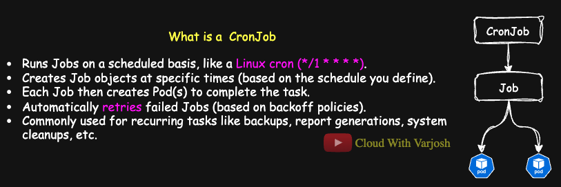

# Day 29: MASTER DaemonSet, Job & CronJob in Kubernetes  with Detailed Demos | CKA Course 2025

## Video reference for Day 29 is the following:

[](https://www.youtube.com/watch?v=gKbIkyE0TTI&ab_channel=CloudWithVarJosh)

---
## ⭐ Support the Project  
If this **repository** helps you, give it a ⭐ to show your support and help others discover it! 

---

## Table of Contents

- [Understanding DaemonSets in Kubernetes](#understanding-daemonsets-in-kubernetes)
  - [Demo: Deploying a Dummy Logging Agent DaemonSet](#demo-daemonset---deploying-a-dummy-logging-agent)
- [Understanding Jobs and CronJobs in Kubernetes](#understanding-jobs-and-cronjobs-in-kubernetes)
  - [What is a Job in Kubernetes?](#what-is-a-job-in-kubernetes)
    - [Job Demo: Running a One-Time Task](#job-demo-running-a-one-time-task)
  - [What is a CronJob in Kubernetes?](#what-is-a-cronjob-in-kubernetes)
    - [Demo: CronJob - Running a Scheduled Task](#demo-cronjob---running-a-scheduled-task)
- [Deployment vs DaemonSet vs Job vs CronJob](#deployment-vs-daemonset-vs-job-vs-cronjob)
- [References](#references)

---

## **Understanding DaemonSets in Kubernetes**


A **DaemonSet** ensures that **exactly one Pod runs on each node** in the cluster.  
As new nodes are added to the cluster, Kubernetes automatically **schedules a Pod** onto the new node.  
Similarly, when nodes are removed, Kubernetes **garbage-collects** (deletes) the DaemonSet Pods on those nodes.  
If you delete a Pod created by a DaemonSet manually, the **DaemonSet controller** will immediately **recreate** the Pod to maintain the desired state.

Deleting a DaemonSet itself will clean up all the Pods it created.

---

### **Use Cases for DaemonSets**

DaemonSets are typically used to deploy **cluster-wide system services**, such as:

- Monitoring agents (e.g., Prometheus Node Exporter, Datadog Agent)
- Logging agents (e.g., Fluentd, Fluent Bit, Filebeat)
- Networking plugins (e.g., CNI plugins like Calico, Flannel)
- Storage plugins (e.g., CSI Node Drivers)
- Security agents (e.g., Falco runtime security monitors)
- Telemetry collectors (e.g., OpenTelemetry Collector DaemonSet)

DaemonSets ensure that these critical agents are **automatically rolled out across all existing and new nodes**, without any manual intervention.

---

### **DaemonSets We Have Already Seen: kube-proxy**

We have actually been working with a DaemonSet since early in this course.

In **Day-7**, we discussed **kube-proxy**, a critical system component responsible for **Service-to-Pod networking** inside the cluster.

- **kube-proxy** is deployed as a **DaemonSet** in Kubernetes to ensure that **every node** has the necessary networking functionality.
- You can verify this in your cluster using:

```bash
kubectl get daemonsets.apps -n kube-system kube-proxy
kubectl get pods -n kube-system -o wide | grep -i kube-proxy
```

If you'd like a deeper understanding of Kubernetes architecture and networking, feel free to refer to the following resources:
- [Day-7 GitHub Notes](https://github.com/CloudWithVarJosh/CKA-Certification-Course-2025/tree/main/Day%2007)
- [Day-7 YouTube Video](https://www.youtube.com/watch?v=-9Cslu8PTjU&ab_channel=CloudWithVarJosh)

---

### **DaemonSets for CNIs and CSIs**

Most cloud-native networking (CNI) and storage (CSI) plugins are deployed using DaemonSets:

- **CNI Plugins:**  
  AWS VPC CNI, Azure CNI, Calico, Flannel, Cilium
- **CSI Node Plugins:**  
  AWS EBS CSI, AWS EFS CSI, GCP PD CSI, and others

By deploying these plugins as DaemonSets, Kubernetes ensures that **every new or existing node** has the necessary networking and storage components running to handle Pod traffic, volume mounts, and attachments properly.

---

### **DaemonSets and Control Plane Nodes**

**Will a DaemonSet run on the control plane node?**  
The answer depends on the cluster setup:

- In **cloud-managed Kubernetes** services (like EKS, GKE, AKS), the **control plane nodes are fully managed** and **isolated**.  
  Therefore, **DaemonSets that you deploy for monitoring, logging, or security will not run on the control plane nodes**.

- In a **self-managed cluster** (like a cluster created with kubeadm or KIND), **DaemonSets can run on control plane nodes** if:
  - The control plane node has a **taint** (typically `node-role.kubernetes.io/control-plane:NoSchedule`), **and**
  - The DaemonSet has a **toleration** allowing it to tolerate that taint.

In our **KIND cluster**, we have three nodes:

```bash
kubectl get nodes
```

Output:

```
NAME                              STATUS   ROLES           AGE   VERSION
my-second-cluster-control-plane   Ready    control-plane   40d   v1.31.4
my-second-cluster-worker          Ready    <none>          40d   v1.31.4
my-second-cluster-worker2         Ready    <none>          40d   v1.31.4
```

The **control plane node** (`my-second-cluster-control-plane`) has the following taint:

```
Taints: node-role.kubernetes.io/control-plane:NoSchedule
```

You can verify it by running:

```bash
kubectl describe node my-second-cluster-control-plane
```

Now, the `kube-proxy` DaemonSet has the following toleration:

```yaml
tolerations:
  - operator: Exists
```

**What does it mean when `operator: Exists` is used without a `key`?**

- **No key specified** means the pod **tolerates *any* taint on the node** — regardless of key, value, or taint source.
- As long as the `effect` matches (or if no effect is specified, it tolerates any effect too), **the pod can be scheduled**.

In kube-proxy's case:

- kube-proxy must run on **all nodes** — control plane nodes, worker nodes, tainted nodes — everywhere.
- Kubernetes can't predict what taints the nodes may have (some clusters are custom).
- Instead of listing specific taint keys, kube-proxy's DaemonSet says:
  > "I don't care what taints the node has. I need to run there anyway."

---

### **Key Takeaways**

- A **DaemonSet** ensures that a specific Pod runs on **every node** in the cluster.
- It automatically handles Pod scheduling on new nodes and cleans up Pods from removed nodes.
- DaemonSets are heavily used for system-level components such as networking, storage, logging, monitoring, and security.
- On **managed cloud clusters**, DaemonSets generally **do not run on control plane nodes**.
- On **self-managed clusters**, DaemonSets **can run on control plane nodes** if appropriate **tolerations** are specified.


---

## **Demo: DaemonSet - Deploying a Dummy Logging Agent**

In this demo, we will deploy a **dummy logging agent** across all nodes in our Kubernetes cluster using a **DaemonSet**.  
The agent will simulate log collection by printing a message every 30 seconds.

As a best practice, **system-level DaemonSets are typically deployed into their own dedicated namespace** for better organization and access control.

---

### **Step 1: Create a New Namespace for Logging**

We will create a new namespace called `logging-ns` to isolate our DaemonSet:

```bash
kubectl create namespace logging-ns
```

---

### **Step 2: Switch the Context to the New Namespace**

To avoid typing `-n logging-ns` with every command, we will temporarily set the default namespace in our current context:

```bash
kubectl config set-context --current --namespace=logging-ns
```

This ensures that all our upcoming commands automatically target the `logging-ns` namespace.

---

### **Step 3: Apply the DaemonSet Manifest**

Here’s the manifest (`ds.yaml`) for our dummy logging agent:

```yaml
apiVersion: apps/v1
kind: DaemonSet
metadata:
  name: log-collector
  namespace: logging-ns  # Best practice: Deploy system-level agents into a dedicated namespace for better management and isolation.
  labels:
    app: log-collector  # Label to identify the DaemonSet and its Pods.
spec:
  selector:
    matchLabels:
      app: log-collector  # Ensures Pods managed by this DaemonSet match this label.
  template:
    metadata:
      labels:
        app: log-collector  # Labels assigned to Pods created by this DaemonSet.
    spec:
      tolerations:
        - key: "node-role.kubernetes.io/control-plane"
          operator: "Exists"
          effect: "NoSchedule"
          # This toleration allows Pods created by this DaemonSet to be scheduled even on control-plane nodes,
          # which are tainted by default with "NoSchedule" to block regular workloads.
      containers:
        - name: log-collector
          image: busybox  # Using a lightweight busybox image to simulate a logging agent.
          command: ["/bin/sh", "-c", "while true; do echo 'Collecting logs...'; sleep 30; done"]
          # The container runs an infinite loop that prints a message every 30 seconds, simulating log collection behavior.
          resources:
            requests:
              cpu: "50m"
              memory: "50Mi"
              # Resource requests ensure the scheduler reserves at least this much CPU and memory for the container.
            limits:
              cpu: "100m"
              memory: "100Mi"
              # Resource limits prevent the container from consuming more than the specified amount of CPU and memory.
          volumeMounts:
            - name: varlog
              mountPath: /var/log
              # Mounts the host's /var/log directory into the container, simulating real-world log collection from the node.
      volumes:
        - name: varlog
          hostPath:
            path: /var/log
            type: Directory
            # A hostPath volume that provides direct access to the host machine’s /var/log directory.
            # In production, instead of just echoing logs inside the container, a real logging agent (like Fluentd, Fluent Bit, or Filebeat)
            # would collect logs from /var/log and ship them to a centralized destination such as:
            # - A file storage server (e.g., NFS, EFS)
            # - An object storage service (e.g., AWS S3, Google Cloud Storage)
            # - A logging service (e.g., ElasticSearch, Loki, Splunk)
            #
            # This ensures logs are persisted, searchable, and available for audits, troubleshooting, and monitoring.

```

Apply the DaemonSet using:

```bash
kubectl apply -f ds.yaml
```

> **Note:**  
> Here we are using a `hostPath` volume to simulate access to the node’s `/var/log` directory.  
> **In production environments**, logs would typically be shipped to a **centralized file storage** (like NFS), an **object storage** (like AWS S3), or **streamed directly** to a logging platform (like ElasticSearch, Loki, or a cloud-native log service).

---

### **Step 4: Verify the DaemonSet**

Check the DaemonSet status:

```bash
kubectl get daemonset
```

Describe the DaemonSet for more details:

```bash
kubectl describe daemonset log-collector
```

You should see that **one Pod is scheduled on every node** in the cluster.

Additionally, you can confirm the Pod placement with:

```bash
kubectl get pods -o wide
```

Example output:

```
NAME                  READY   STATUS    RESTARTS   AGE   IP            NODE                              NOMINATED NODE   READINESS GATES
log-collector-4krdf   1/1     Running   0          11m   10.244.1.26   my-second-cluster-worker          <none>           <none>
log-collector-bzsln   1/1     Running   0          11m   10.244.2.43   my-second-cluster-worker2         <none>           <none>
log-collector-nvvz4   1/1     Running   0          11m   10.244.0.5    my-second-cluster-control-plane   <none>           <none>
```

You can observe that **each node**, including the **control-plane node**, is running an instance of the log-collector Pod.  
This is possible because **we added a toleration** for the `control-plane` taint in the DaemonSet spec.

---

### **Bonus Exercise: Observe DaemonSet Pod Re-Creation**

To understand how the **DaemonSet controller** maintains the Pods:

1. **Manually delete a Pod** created by the DaemonSet:

```bash
kubectl delete pod <pod-name>
```

2. Immediately run:

```bash
kubectl get pods -o wide
```

You will see that **Kubernetes automatically recreates the missing Pod** on the same node.

> This demonstrates that the **DaemonSet controller constantly monitors the cluster** and ensures that **the desired state is maintained** — one Pod on every node.

---

## **Understanding Jobs and CronJobs in Kubernetes**


While Deployments are used for running long-running applications or services, sometimes you need to run **one-off tasks** — tasks that **start, complete, and exit**.  
This is where **Jobs** and **CronJobs** come into the picture.

> **Note:**  
> Jobs and CronJobs are **not part of the CKA exam curriculum**, but knowing about them provides a broader understanding of Kubernetes controllers and prepares you better for real-world production environments.

---

### **What is a Job in Kubernetes?**


A **Job** is a Kubernetes resource that **creates one or more Pods** to **run a specific task to completion**.  
Once the task finishes successfully (Pod status = `Completed`), the Job is considered **finished**.

- **If a Pod fails**, the Job controller **automatically retries** the task (based on backoff policies).
- **If a Pod succeeds**, the Job **completes** and does not restart the Pod.
- Kubernetes keeps track of Job completions to ensure **at least one successful execution**.


---

 **Jobs are useful for:**

- **Running batch jobs:** ensure that large data-processing tasks or file transformations complete reliably, even if interruptions happen.
- **Database migrations:** safely apply schema changes or data updates exactly once without manual intervention.
- **Temporary utilities (e.g., cleanup scripts, backups):** automate one-time tasks like clearing unused files or creating backups reliably.
- **One-time report generation:** generate reports such as sales summaries or system audits in a controlled and trackable way.

---

### **Job Demo: Running a One-Time Task**

We’ll now deploy a simple Job that **prints a message**, **sleeps for a few seconds**, and then **exits**.

---

#### **Step 1: Create a Job Manifest**

Save the following YAML as `job.yaml`:

```yaml
apiVersion: batch/v1
kind: Job
metadata:
  name: hello-job  # Name of the Job resource.
spec:
  ttlSecondsAfterFinished: 60
  # This field tells Kubernetes to automatically delete the Job object 60 seconds after it finishes (either success or failure).
  # Useful for keeping the cluster clean and avoiding accumulation of completed Jobs.
  completions: 2  
  # Total number of successful Pod completions needed for the Job to succeed.
  # - If set to 1: Only one Pod needs to complete successfully for the Job to finish.
  # - If set to 2: Two Pods must each complete successfully (sequentially or in parallel, depending on 'parallelism').
  parallelism: 2  
  # Number of Pods that can run concurrently.
  # - If parallelism is 2 and completions is 2, both Pods can run at the same time.
  # - If parallelism is 1 and completions is 2, Pods will run one after another (sequentially).
  backoffLimit: 4
  # Specifies how many times Kubernetes should retry a failed Pod before considering the Job itself as failed.
  # If the Pod fails 4 times, the Job will be marked as failed.
  template:
    spec:
      containers:
        - name: hello
          image: busybox  # A minimal container image used to run small shell commands.
          command: ["bin/sh", "-c", "echo Hello from the Job! && sleep 10"]
          # Container command that prints a message and then sleeps for 10 seconds before exiting.
      restartPolicy: Never
      # Specifies that if a container inside the Pod fails, the kubelet will not restart the container.
      # The Pod will transition to Failed status once the container exits with a non-zero (error) code.
      # The Job controller, not the kubelet, handles retries by creating a new Pod according to the Job's backoffLimit policy.
      # Pods are immutable objects; restartPolicy only governs container restarts within existing Pods:
      # - restartPolicy: Always allows container restarts within a Pod (common in Deployments).
      # - restartPolicy: Never ensures no container restarts; a new Pod is created by the Job controller if needed (common in Jobs).
```

**Detailed Behavior:**

- **The kubelet** is responsible for **restarting containers within an existing Pod**, but only if the `restartPolicy` is set to `Always` or `OnFailure`.  
  - Example: In a **ReplicaSet**, if a container crashes, the kubelet will **restart the container** within the same Pod on the same node.
  - If the `restartPolicy` is set to `OnFailure`, the kubelet will restart the container **within the same Pod**, but only when the container fails (i.e., exits with a non-zero exit code), not when it completes successfully.

- **The kubelet does NOT recreate Pods**:  
  - Pods are **immutable**—once a Pod fails or completes, the kubelet does not recreate it. Pod recreation is handled by higher-level controllers like **Jobs**, **Deployments**, or **ReplicaSets**.

- **For Jobs**:  
  - If `restartPolicy: Never`, the kubelet will not restart the container. The Pod transitions to the `Failed` phase once the container exits with an error.
  - The **Job controller** (at the Kubernetes API level) detects the failed Pod and decides whether to create a new Pod for retry based on the Job’s `backoffLimit` policy.
  - While the kubelet manages containers within Pods, the **Job controller** is responsible for handling Pod retries and determining whether new Pods need to be created for subsequent attempts.

> **Key Reminder**: The kubelet only restarts containers within a Pod (if `restartPolicy: Always` or `OnFailure`). **Pod recreation** (for retries) is the responsibility of controllers like **Jobs**, or **ReplicaSets**.


---

#### **Step 2: Deploy the Job**

Apply the Job:

```bash
kubectl apply -f job.yaml
```

---

#### **Step 3: Verify the Job**

Check the status of the Job:

```bash
kubectl get jobs
```

Check the Pods created by the Job:

```bash
kubectl get pods -o wide
```

You should see a Pod created by the Job which will eventually move to `Completed` status.

You can also describe the Job for detailed information:

```bash
kubectl describe job hello-job
```
---

## **What is a CronJob in Kubernetes?**



A **CronJob** allows you to **schedule Jobs to run at specific times**, similar to how **Linux crontab** works.

CronJobs are used for:

- Scheduled database backups.
- Generating nightly reports.
- Log rotation or cleanup tasks.
- Sending scheduled notifications.

A CronJob creates a **Job** according to the **cron schedule** you specify.

A **CronJob** in Kubernetes is used to run tasks on a scheduled basis.  
It **does not run Pods directly**. Instead, it acts like a **scheduler** — it defines *when* a **Job** should be created.  
At each scheduled time, the **CronJob controller** automatically creates a new **Job** object, and that **Job** is responsible for running one or more **Pods** to complete the task.

Once created, the Job behaves like any other Kubernetes Job — handling retries, `backoffLimit`, and managing success or failure.

An important field you can configure inside the CronJob’s **Job template** is `ttlSecondsAfterFinished`.  
This field controls the cleanup of Jobs **after** they are completed.  
When a Job (created by the CronJob) finishes — either successfully or after failure — Kubernetes waits for the TTL value (for example, 60 seconds) and then automatically **deletes the Job object**.  
Once the Job is deleted, its associated Pods are garbage collected later.

This helps **keep your cluster clean**, especially if your CronJob is scheduled to run frequently, by preventing a buildup of completed Jobs and their Pods.

---
**Quick Summary:**  
- **CronJob** → Creates a **Job** at the scheduled time.  
- **Job** → Runs the Pods and manages retries/failures.  
- `ttlSecondsAfterFinished` → Deletes the Job after it finishes and cleans up associated Pods later.

---


## **Understanding Cron Expression Fields**

| Position | Field | Allowed Values | Meaning |
|:---------|:------|:---------------|:--------|
| 1 | **Minute** | 0–59 | Minute of the hour the task should run. |
| 2 | **Hour** | 0–23 | Hour of the day the task should run (24-hour format). |
| 3 | **Day of Month** | 1–31 | Specific day of the month the task should run. |
| 4 | **Month** | 1–12 | Month of the year (1 = January, 12 = December). |
| 5 | **Day of Week** | 0–6 | Day of the week (0 = Sunday, 6 = Saturday). |

> - Use `*` to represent **every value** in a field.  
> - Use **lists** like `1,3,5` for multiple specific times.  
> - Use **ranges** like `1-5` for a continuous block.  
> - Use **steps** like `*/5` to repeat every N units (e.g., every 5 minutes).

---

## **Quick Visual Cheat-Sheet**

```text
 ┌───────────── minute (0 - 59)
 │ ┌───────────── hour (0 - 23)
 │ │ ┌───────────── day of month (1 - 31)
 │ │ │ ┌───────────── month (1 - 12)
 │ │ │ │ ┌───────────── day of week (0 - 6) (Sunday=0)
 │ │ │ │ │
 * * * * * <command to run>
```

This format helps you **quickly understand and build cron expressions** without memorizing each field separately.

### **Common Cron Expressions for Kubernetes CronJobs**

| Cron Expression | Meaning | Usage Example |
|:----------------|:--------|:--------------|
| `*/5 * * * *` | Every 5 minutes | Health checks, frequent lightweight jobs. |
| `0 * * * *` | Every hour at minute 0 | Hourly database backups or report generation. |
| `0 2 * * *` | Every day at 2 AM | Nightly full system backups or log archiving. |
| `0 0 * * 0` | Every Sunday at midnight | Weekly cleanup tasks, billing cycle resets. |
| `30 9 * * 1-5` | At 9:30 AM, Monday to Friday | Business-hours notifications, weekday-only reports. |

> **Pro Tip:** Kubernetes CronJobs use **UTC time** internally, not your local timezone — be careful while setting schedules!


> If you would like assistance in writing cron expressions manually, you can use **[Crontab Guru](https://crontab.guru/)** — an excellent online tool where you can **create**, **test**, and **validate** cron schedules easily.

---

### **Demo: CronJob - Running a Scheduled Task**

We’ll now deploy a CronJob that **prints a message every minute**.

---

#### **Step 1: Create a CronJob Manifest**

Save the following YAML as `cronjob.yaml`:

```yaml
apiVersion: batch/v1
kind: CronJob
metadata:
  name: hello-cronjob
spec:
  schedule: "*/1 * * * *"  # Cron expression specifying the job to run every 1 minute
  jobTemplate:
    spec:
      backoffLimit: 4 # Number of retries before marking the Job as failed
      ttlSecondsAfterFinished: 60  # Automatically deletes the Pod 60 seconds after it completes
      completions: 2
        # Specifies that 2 successful Pod completions are required for the CronJob's Job to be considered complete.
        # Each Pod must complete successfully (exit with status 0) for the job to be marked as finished.
        # In this case, CronJob will wait until both Pods have successfully completed.      
      parallelism: 2
        # Specifies that 2 Pods should run concurrently for each execution of the CronJob.
        # This means that when the CronJob is triggered, both Pods will start simultaneously.
        # The Pods will run in parallel to perform the task faster, and the CronJob will wait until both have completed.      
      template:
        spec:
          containers:
            - name: hello
              image: busybox
              command: ["bin/sh", "-c", "echo Hello from CronJob! && sleep 10"]
          restartPolicy: Never  # Ensures Pods don't restart; they must be considered completed or failed based on the task's outcome.
```

> **Note:**  
> The `schedule` field follows standard **cron syntax** (minute, hour, day of month, month, day of week).

---

#### **Step 2: Deploy the CronJob**

Apply the CronJob:

```bash
kubectl apply -f cronjob.yaml
```

---

#### **Step 3: Verify the CronJob**

Check CronJob status:

```bash
kubectl get cronjob
```

Check the Jobs created by the CronJob:

```bash
kubectl get jobs
```

Check the Pods created by the Jobs:

```bash
kubectl get pods -o wide
```

After every minute, a new Job should be created automatically by the CronJob controller, and corresponding Pods will be scheduled.

---


## **Deployment vs DaemonSet vs Job vs CronJob**


| Aspect        | Deployment | DaemonSet | Job | CronJob |
|:--------------|:-----------|:----------|:----|:--------|
| **Purpose**    | Run long-running stateless applications with scalability and rolling updates. | Ensure one Pod runs on every (or selected) node. | Run a task once to successful completion. | Schedule Jobs to run at specific times (like a cron job). |
| **Common Use Cases** | Web servers, APIs, frontend apps. | Node-level monitoring, logging agents, networking/storage plugins. | Database migration, batch jobs, backups, one-time tasks. | Scheduled backups, nightly report generation, log rotation. |
| **Examples**   | Deploying a Node.js API server, Nginx deployment, React app backend. | kube-proxy, Fluentd, Calico CNI, AWS EBS CSI Node plugin. | Backup database, clean temporary files, send a one-time notification. | Backup database every night, rotate logs weekly, send monthly invoices. |

> **Note:**  
> Jobs and CronJobs are **not part of the CKA exam**, but it’s valuable to know that Kubernetes natively supports batch processing and scheduled task management.

---

### References 
   - DaemonSet: [https://kubernetes.io/docs/concepts/workloads/controllers/daemonset/](https://kubernetes.io/docs/concepts/workloads/controllers/daemonset/)  
   - Jobs: [https://kubernetes.io/docs/concepts/workloads/controllers/job/](https://kubernetes.io/docs/concepts/workloads/controllers/job/)  
   - CronJobs: [https://kubernetes.io/docs/concepts/workloads/controllers/cron-jobs/](https://kubernetes.io/docs/concepts/workloads/controllers/cron-jobs/)


