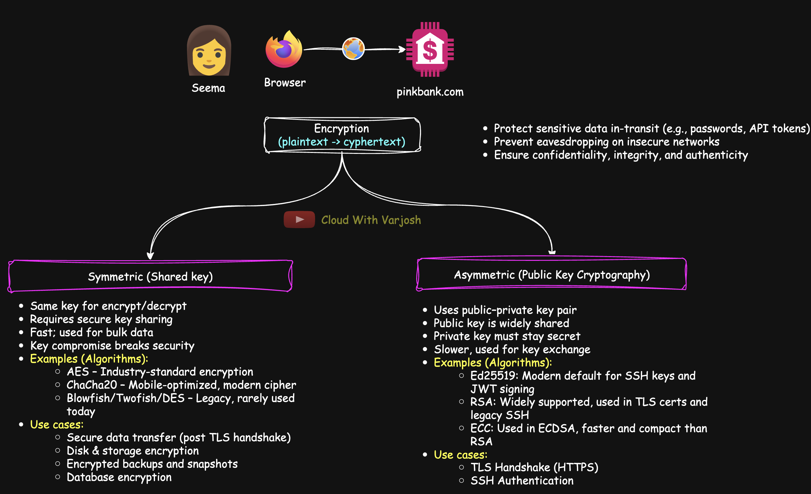
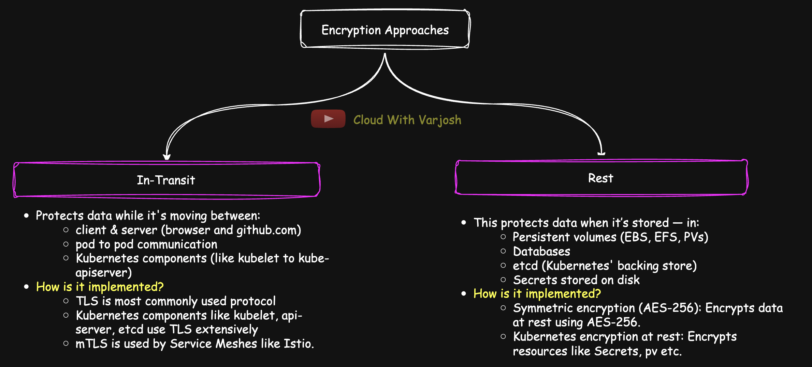
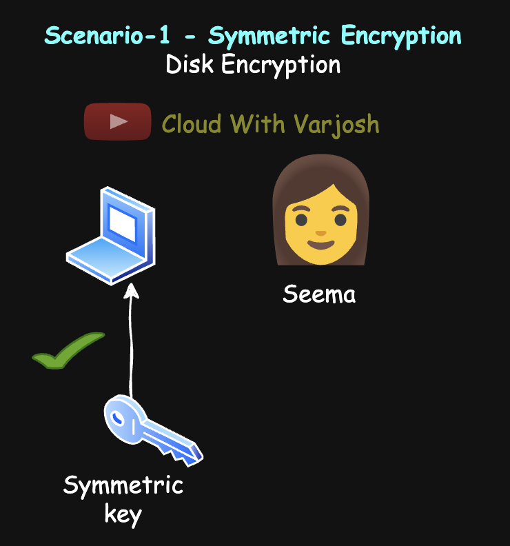
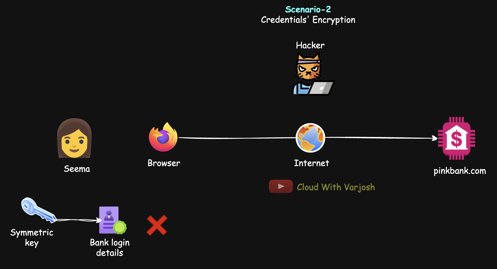
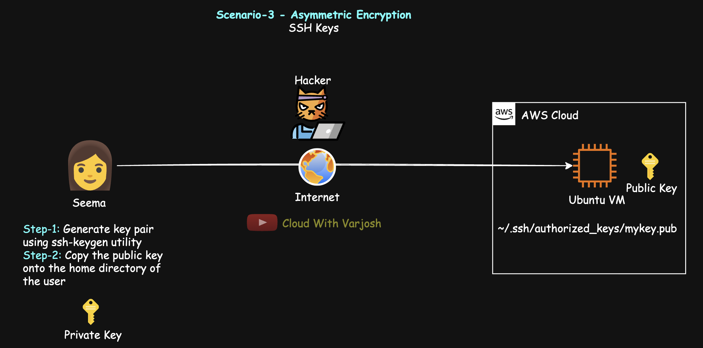
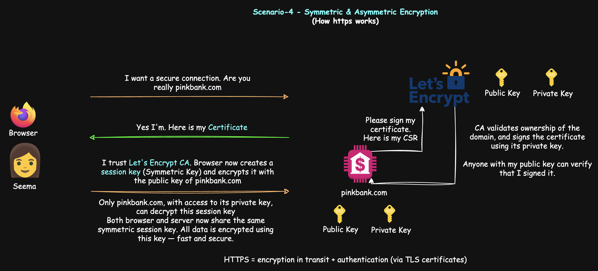

# Day 30: How HTTPS & SSH Work | What is Encryption? | Symmetric & Asymmetric Encryption | CKA 2025

## Video reference for Day 30 is the following:

---
## ⭐ Support the Project  
If this **repository** helps you, give it a ⭐ to show your support and help others discover it! 

---

# Table of Contents

1.  [Introduction to Encryption](#introduction-to-encryption)
2.  [What is Encryption? Why Do We Need It?](#what-is-encryption-why-do-we-need-it)
3.  [Two Main Types of Encryption](#two-main-types-of-encryption)
    * [1. Symmetric Encryption (Shared Key Encryption)](#1-symmetric-encryption-shared-key-encryption)
    * [2. Asymmetric Encryption (Public Key Cryptography)](#2-asymmetric-encryption-public-key-cryptography)
6.  [Encryption Approaches: In-Transit vs At-Rest](#encryption-approaches-in-transit-vs-at-rest)
    * [1. Encryption In-Transit](#1-encryption-in-transit)
    * [2. Encryption At-Rest](#2-encryption-at-rest)
7.  [Quick Comparison:](#quick-comparison)
8.  [Understanding Symmetric and Asymmetric Encryption Through Real-Life Scenarios](#understanding-symmetric-and-asymmetric-encryption-through-real-life-scenarios)
    * [Scenario 1: Symmetric Encryption (Disk Encryption)](#scenario-1-symmetric-encryption-disk-encryption)
    * [Scenario 2: Symmetric Encryption Alone Isn't Enough for Internet Communication](#scenario-2-symmetric-encryption-alone-isnt-enough-for-internet-communication)
    * [Scenario 3: Asymmetric Encryption (SSH into EC2 Instance)](#scenario-3-asymmetric-encryption-ssh-into-ec2-instance)
    * [Scenario 4: Combining Symmetric + Asymmetric (TLS Handshake)](#scenario-4-combining-symmetric--asymmetric-tls-handshake)
9.  [Conclusion](#conclusion)

---

# Introduction to Encryption

Before we start discussing Kubernetes security topics like RBAC, Secrets, and TLS within clusters, it’s important to understand the foundation of secure communication: **encryption**.

---

## What is Encryption? Why Do We Need It?

**Encryption** is the process of converting readable data (plaintext) into unreadable data (ciphertext), ensuring that only authorized parties can read it.

We need encryption to:
- Protect sensitive data in transit (e.g., passwords, API tokens)
- Prevent eavesdropping on insecure networks
- Ensure confidentiality, integrity, and authenticity

---

## Two Main Types of Encryption

### 1. Symmetric Encryption (Shared Key Encryption)

- Uses a **single secret key** for both **encryption** and **decryption**.
- This key must be **securely shared** between the sender and receiver.
- It is **fast, efficient**, and ideal for encrypting **large volumes of data**.
- The downside is: if the key is compromised, both encryption and decryption are at risk.

> In symmetric encryption, the key is commonly referred to as the **symmetric key**, **shared key**, or **secret key** — all indicating the same key is used for both encryption and decryption.

**Examples of Symmetric Encryption Algorithms:**
- **AES (Advanced Encryption Standard)** — the industry standard
- **ChaCha20** — optimized for low-power devices and mobile environments
- **Blowfish**, **Twofish**, and **DES** (older or legacy)

**Common Use Cases:**

- **Secure data transfer (post TLS handshake):**
  - Once the TLS handshake is complete and a session key is securely shared using asymmetric encryption, all communication (e.g., HTTPS) is encrypted using **symmetric encryption**.

- **Disk & storage encryption:**
  - **AWS EBS Volumes**, **Azure Managed Disks**, and **Google Persistent Disks** all use **symmetric encryption** under the hood (e.g., AES-256).
  - These cloud services often integrate with **Key Management Services (KMS)** to manage the encryption keys securely.

- **Encrypted backups and snapshots:**
  - Storing database or file system backups securely by encrypting the files before storing them on disk or in cloud object storage.

- **Database encryption:**
  - Symmetric encryption is commonly used for encrypting data at rest in relational and NoSQL databases (e.g., MySQL TDE, MongoDB encrypted storage engine).

- **Kubernetes Secrets encryption at rest**:
  - When encryption is configured in the kube-apiserver (e.g., using an AES-CBC or AES-GCM provider), Kubernetes encrypts Secrets, ConfigMaps, etc. using symmetric keys stored in a KMS or local file.

**Why Symmetric Encryption Is Preferred for Bulk Data:**

- It's **much faster** than asymmetric encryption, especially for large data sets or high-throughput systems.
- Easier to implement in hardware (e.g., hardware security modules or TPMs).
- When paired with strong key management (like KMS), it provides both performance and security.

---

### 2. Asymmetric Encryption (Public Key Cryptography)

- Uses a **key pair**: a **public key** (shared with everyone) and a **private key** (kept secret).
- Data encrypted with the **public key** can only be decrypted with the **private key**, and vice versa.
- It's commonly used for **secure key exchange**, **authentication**, and **digital signatures**.
- While more **computationally expensive** than symmetric encryption, it's ideal for establishing trust and securely bootstrapping secure channels.

**Examples of Asymmetric Encryption Algorithms:**
- **Ed25519** — modern default for SSH keys and JWT signing in cloud-native systems
- **RSA** — still widely supported; commonly used in TLS certs, Kubernetes components, and legacy SSH
- **Elliptic Curve Cryptography (ECC)** — used in ECDSA; faster and more compact than RSA

**Common Use Cases:**

- **TLS Handshake (HTTPS):**
  - During the TLS handshake (e.g., accessing `https://github.com`), the server presents a **certificate containing its public key**.
  - The client uses this to securely exchange a **session key**, which is then used for symmetric encryption.

- **SSH Authentication:**
  - SSH clients authenticate using **asymmetric key pairs** (public and private SSH keys).
  - The server verifies your identity using the public key and grants access without a password.

- **Kubernetes x.509 Certificates:**
  - Components like `kube-apiserver`, `kubelet`, `etcd`, and `kubectl` use **client and server certificates** for mutual authentication.
  - These certificates are based on **RSA or ECC** public-private key cryptography.

- **Digital Signatures:**
  - Signing Git commits with **GPG/PGP**
  - **JWT tokens** used in OIDC and Kubernetes service account tokens are often signed using private keys and verified using public keys.

- **Secure Secrets Delivery:**
  - Tools like **Vault by HashiCorp** and **Sealed Secrets** use asymmetric encryption to encrypt sensitive data (e.g., a Secret YAML file).
  - Only the controller inside the cluster can decrypt it using the corresponding private key.

**Why Use Asymmetric Encryption?**

- You can **safely distribute** public keys — there's no risk if someone intercepts them.
- Ideal for use cases where two systems **don’t already share a secret**.
- Enables strong **identity verification** and **trust models**, such as PKI (Public Key Infrastructure).

**Key Considerations:**

- Slower than symmetric encryption — that’s why it’s mostly used during **initial connection setup** or for signing.
- Most modern systems use asymmetric encryption to **establish trust and exchange a symmetric key**, and then **switch to symmetric encryption** for speed.

---

## Summary Table

| Feature              | Symmetric Encryption        | Asymmetric Encryption             |
|----------------------|-----------------------------|-----------------------------------|
| Keys Used            | One shared secret key        | Public & private key pair         |
| Speed                | Fast                         | Slower                            |
| Security Risk        | Key sharing is risky         | Secure key exchange possible      |
| Use Case             | Bulk data encryption         | Identity/authentication, key exchange |
| Examples             | AES                          | RSA, TLS handshakes, SSH          |

---

### Symmetric and Asymmetric Encryption: Roles and Functions

**Symmetric encryption** algorithms, such as **AES (Advanced Encryption Standard)**, are highly efficient and fast, making them ideal for encrypting and decrypting large volumes of data. Due to their speed, symmetric encryption is typically used for bulk data encryption, such as protecting files, database records, or disk contents. These algorithms rely on a single shared secret key for both encryption and decryption, which ensures a streamlined and quick process, particularly when dealing with large datasets.

On the other hand, **asymmetric encryption algorithms** like **RSA (Rivest-Shamir-Adleman)** or **ECC (Elliptic Curve Cryptography)** play a crucial role in securing the exchange of keys used in symmetric encryption. While they are slower and computationally more expensive than symmetric encryption, they are essential for securely transmitting the symmetric keys over potentially insecure channels. Asymmetric encryption uses a pair of keys — a **public key** to encrypt the data and a **private key** to decrypt it — ensuring that only the intended recipient with the correct private key can access the symmetric key. This layered approach combines the speed of symmetric encryption with the security of asymmetric encryption, providing both efficiency and robust protection for sensitive data.

---

## Encryption Approaches: In-Transit vs At-Rest

When we talk about encryption in cloud and Kubernetes environments, it typically falls into **two categories**:

### 1. **Encryption In-Transit**

This protects data **while it's moving** — between:
- Client and server (e.g., your browser and GitHub.com)
- Pod to Pod communication
- Kubernetes components (like kubelet <-> kube-apiserver)

**How it's implemented:**
- **TLS** (Transport Layer Security) is the most common protocol used.
- Kubernetes uses TLS extensively — for `kubectl`, Ingress, the API server, etc.
- In service meshes (like Istio), **mTLS (mutual TLS)** is used to encrypt **Pod-to-Pod** traffic automatically.

**Why it matters:**
- Prevents eavesdropping, man-in-the-middle attacks, and session hijacking.
- Critical in multi-tenant clusters or when apps talk over public networks.

---

### 2. **Encryption At-Rest**

This protects data **when it’s stored** — in:
- Persistent volumes (EBS, EFS, PVs)
- Databases
- etcd (Kubernetes' backing store)
- Secrets stored on disk

**How it's implemented:**
- Data is encrypted using **symmetric encryption algorithms** like AES-256.
- Kubernetes supports encryption at rest for resources like **Secrets**, **ConfigMaps**, and **PersistentVolumeClaims** via encryption providers configured on the API server.

**Why it matters:**
- If someone gains access to your storage (EBS snapshot, physical disk), they can't read the raw data.
- Especially important for **compliance** (e.g., GDPR, HIPAA, PCI-DSS).

---

### Quick Comparison:

| Aspect             | Encryption In-Transit         | Encryption At-Rest              |
|--------------------|-------------------------------|---------------------------------|
| Purpose            | Secures data during transfer  | Secures data when stored        |
| Technology Used    | TLS, mTLS, VPN                | AES, KMS, disk encryption       |
| Common Tools       | TLS certs, Istio, NGINX       | KMS (AWS/GCP), Kubernetes providers |
| Example            | kubectl to API server         | etcd encryption, S3 object encryption |
| Who handles it?    | Network-level, sidecars       | Storage layer, cloud provider   |

> A secure system uses **both** encryption in-transit **and** at-rest.  
> Kubernetes and cloud-native tools provide support for both — but as DevOps/cloud engineers, it's your job to configure and validate them properly.

---

## Understanding Symmetric and Asymmetric Encryption Through Real-Life Scenarios

To make encryption concepts clear, let's walk through four practical scenarios involving a user named **Seema**. Each example builds upon the previous to gradually explain how encryption works — starting from her personal laptop to secure cloud communication.

---

### **Scenario 1: Symmetric Encryption (Disk Encryption)**  
**Use Case:** Protecting Seema's Laptop Hard Disk  
**Technology Example:** BitLocker (Windows)

Seema has a Windows laptop with **BitLocker** enabled to encrypt her hard disk. BitLocker uses **symmetric encryption**, typically **AES (Advanced Encryption Standard)**.

- When Seema turns on her laptop, she must enter a **BitLocker PIN**. This unlocks the encryption key and allows access to the disk.
- After that, she logs in using her **Windows username and password**.
- If someone steals her laptop, the data remains protected unless the thief knows the BitLocker PIN.
- Even if the hard disk is removed and connected to another device, the contents will remain **ciphertext** (unreadable) unless the correct symmetric key is used.

**Key Point:**  
Symmetric encryption is **fast** and ideal for **encrypting large amounts of data**, like full disks. One key is used for both encryption and decryption.

---

### **Scenario 2: Symmetric Encryption Alone Isn't Enough for Internet Communication**  

**Use Case:** Seema wants to access `pinkbank.com` securely  
**Challenge:** How to share a symmetric key securely?

Suppose Seema encrypts her online banking credentials using a symmetric key and sends them to `pinkbank.com`. Here's the issue:

- The bank **cannot decrypt the message** unless it has the same symmetric key.
- But Seema **cannot safely share** the key over the internet — an attacker could intercept it.

❌ **Problem:**  
Symmetric encryption **alone** is insecure for sending data over untrusted networks.

We'll revisit this in **Scenario 4**, where we solve this using **asymmetric encryption**.

---

### **Scenario 3: Asymmetric Encryption (SSH into EC2 Instance)**  

**Use Case:** Secure login to Ubuntu EC2 instance on AWS  
**Technology Example:** SSH, Ed25519 keys

Seema wants to securely SSH into her Ubuntu EC2 instance. She uses **asymmetric encryption**, which involves a **public key** and a **private key**.

#### Steps:
1. **Generate key pair** using `ssh-keygen` (e.g., `mykey`, producing `mykey` and `mykey.key`).
2. **Copy the public key** (`mykey`) to the EC2 instance (usually placed in `~/.ssh/authorized_keys`).
3. **Set correct permissions** on the key files (especially for Linux systems).
4. **SSH into the EC2 instance** using the private key (`mykey.key`).

#### Key Concepts:
- If a message is **encrypted with Seema's public key**, **only her private key** can decrypt it.
- If something is **signed with her private key**, **anyone with the public key** can verify that it came from her.

#### How SSH Uses Asymmetric Encryption:
- The server sends a **random challenge**.
- Seema's SSH client **signs it locally** with her private key.
- The signed challenge is sent to the server.
- The server verifies it using her **public key**.
- If valid, she gets access — proving identity **without exposing** her private key.

**Key Point:**  
Asymmetric encryption is used for **identity verification and secure key exchange**. The **private key stays with the user**, and is **never transmitted**.

Here are some common extensions used for **public** and **private keys**:
- **Public Key Files**: `.pub`, `.crt`, `.cer`, `.pem`, `.der`
- **Private Key Files**: `.key`, `.pem`, `.ppk`, `.pfx`, `.der`

The most commonly used extensions for **SSH keys** are `.pub` for public keys and `.key` for private keys. For certificates in the SSL/TLS world, `.crt` and `.pem` are frequently used.

---

### **Scenario 4: Combining Symmetric + Asymmetric (TLS Handshake)** 
**Introducing TLS (Transport Layer Security) — The Foundation of Secure Web Communication**

Before we jump into Scenario 4, let’s understand **what TLS is and why it matters**.

- **TLS is the modern, more secure successor to SSL (Secure Sockets Layer)**. Although people still say "SSL certificates," what’s actually used today is TLS.
- TLS (Transport Layer Security) is the **security protocol** that powers **HTTPS**, ensuring data exchanged between your **browser and a website** is **private and secure**.
- It prevents attackers from **eavesdropping, tampering, or impersonating** the website you’re connecting to.
- TLS uses a combination of **asymmetric encryption** (for secure key exchange) and **symmetric encryption** (for fast and efficient data transfer).
- You’ve likely used TLS today — every time you saw a **lock icon in your browser**, TLS was working behind the scenes.

**TLS** is a **general-purpose protocol** used to secure various application-layer protocols like **HTTPS**, **FTPS**, **SMTPS**, **IMAPS/POP3S**, **LDAPs**, **gRPC**, **Kubernetes**, and **MQTT**. While **HTTPS** is the most common use of TLS, **TLS is not exclusive to HTTPS** and is used for secure communication in many other protocols. So, whenever you see **HTTPS**, you can be sure **TLS is working behind the scenes** to ensure **authentication**, **encryption**, and **integrity** of your communication.

Let’s now see how Seema’s browser establishes a secure TLS session with her bank’s website.

**Use Case:** Seema accesses `pinkbank.com` securely via browser  
**Technology Example:** TLS (HTTPS), Digital Certificates, Certificate Authorities

Here’s what happens when Seema opens `https://pinkbank.com`:

1. **Seema’s browser requests `pinkbank.com`**
   - The browser says: “Hi, I’d like to start a secure conversation. Prove you’re really `pinkbank.com`.”

2. **`pinkbank.com` responds with its TLS certificate**
   This digital certificate contains:
   - The **public key** of `pinkbank.com`
   - The **domain name** it was issued for
   - A **digital signature from a Certificate Authority (CA)** like Let’s Encrypt

   > **Why a CA is needed**  
      A **Certificate Authority (CA)** is a trusted organization responsible for validating the ownership of domains and signing digital certificates.  
      When a domain owner (for example, the owner of `pinkbank.com`) registers their domain, they request a certificate from the CA. The CA performs a series of checks to ensure that the requester indeed controls the domain.  
      Once the verification is complete, the CA uses its **private key** to **sign the certificate**, creating a cryptographic endorsement of the domain's authenticity. This signature assures users that the domain is legitimate and that communication with it is secure.

    > **🔁 Link to Scenario 3**:  
      Remember in Scenario 3 (SSH login), **Seema's system used her private key to sign** a challenge sent by the server, and the **server verified it using the public key**.  
      Similarly here, in TLS:  
          - The **Certificate Authority (CA)** uses its **private key to sign** the TLS certificate.  
          - The **browser uses the CA’s public key** to **verify** the certificate’s authenticity.

3. **Browser verifies the certificate**
   - All browsers come with **a list of trusted CAs** and their **public keys**.
   - The browser checks:
     - Is the certificate signed by a trusted CA?
     - Has it expired?
     - Does the domain match (`pinkbank.com`)?
   - If all checks pass, the browser **trusts** that it's communicating with the real `pinkbank.com`.

4. **Browser generates a session key**
   - A random **symmetric session key** (e.g., for AES-256) is created.
   - This key will be used for encrypting all data sent afterward.

5. **Browser encrypts the session key using `pinkbank.com`’s public key**
   - Only `pinkbank.com`, with access to its **private key**, can decrypt this session key.

6. **`pinkbank.com` decrypts the session key**
   - It uses its private key to retrieve the session key.

7. **Secure communication begins**
   - Both browser and server now share the same symmetric session key.
   - All data is encrypted using this key — fast and secure.

---

### Key Takeaways:

- The **CA’s private key** signs the certificate → the **browser uses CA’s public key** to verify it.  
- The **browser’s session key** is encrypted with the **server’s public key** → the **server’s private key** decrypts it.
- Just like in SSH, **private keys never travel**, and all signing/verification happens securely and locally.
- Once the session key is exchanged, **symmetric encryption takes over** for performance and efficiency.

> 💡 **Why Let's Encrypt?**  
We chose Let’s Encrypt as it's widely used for **personal websites, DevOps automation**, and **startup deployments**.  
For enterprise or production environments, you'd often use **DigiCert**, **Sectigo**, or cloud-native CAs like **AWS Certificate Manager (ACM)**.

---

## Conclusion

Encryption is vital in protecting sensitive information in today’s digital world. The use of **symmetric encryption** and **asymmetric encryption** ensures the security of data both at rest and in transit.

- **Symmetric encryption** is fast and ideal for encrypting large amounts of data, such as storage encryption (e.g., disk encryption). However, it requires both parties to share the same key, which can lead to security concerns if not handled properly.
  
- **Asymmetric encryption**, on the other hand, allows for secure communication even without sharing a common secret. It is key in establishing trust, authentication, and securing key exchange processes. **Public key encryption** is commonly used in protocols like **TLS** for secure web communication and **SSH** for secure remote access, which are essential in today's cloud and DevOps ecosystems.

- **TLS (Transport Layer Security)** encrypts data during transmission, ensuring that communication between a client and a server remains confidential and tamper-proof. This is critical for web applications, APIs, and cloud infrastructure.
  
- **SSH (Secure Shell)** uses asymmetric encryption for secure remote access to servers, like logging into an EC2 instance in AWS. It is vital for maintaining secure DevOps workflows and infrastructure management.

In addition to securing communications, encryption **at-rest** (e.g., encrypting stored data) is just as crucial for protecting sensitive information that might be compromised if an attacker gains unauthorized access to a storage medium or database.

Ultimately, understanding how encryption works in these different contexts—whether it's **symmetric encryption**, **asymmetric encryption**, **TLS**, or **SSH**—empowers individuals and organizations to maintain data security in an increasingly interconnected and digital world.

---