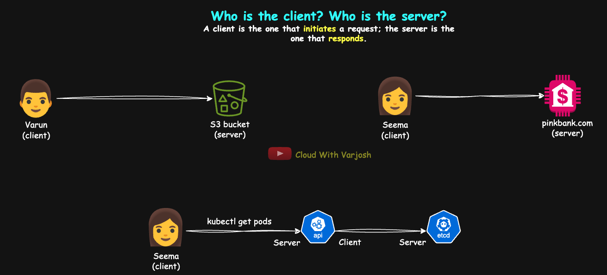
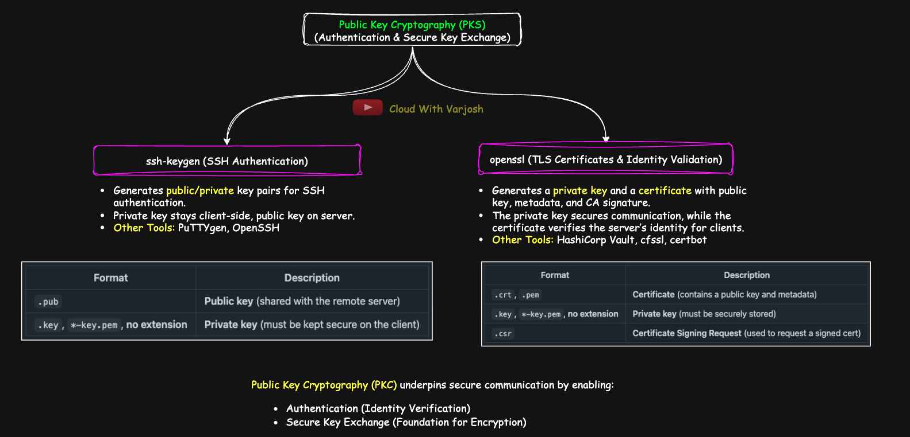
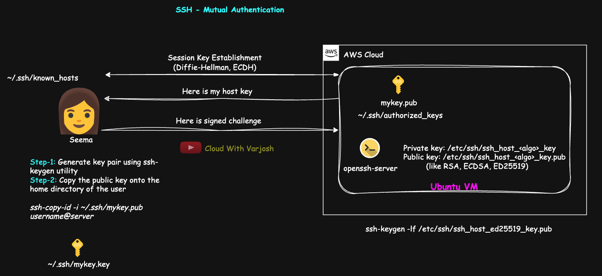
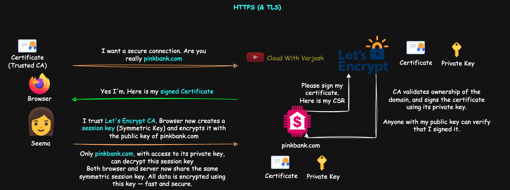
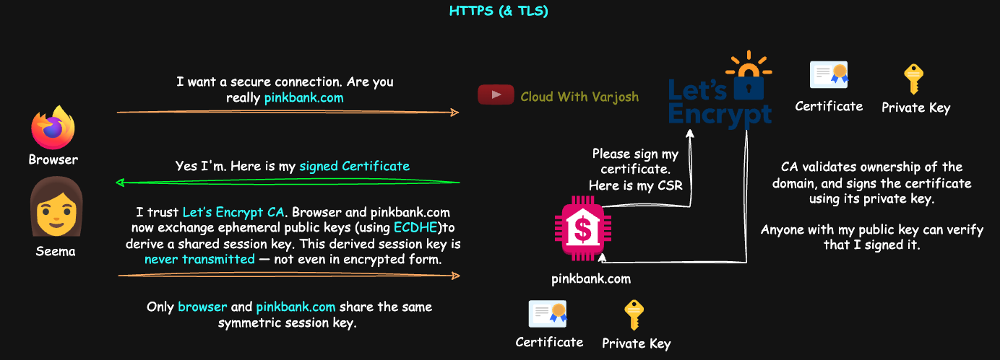
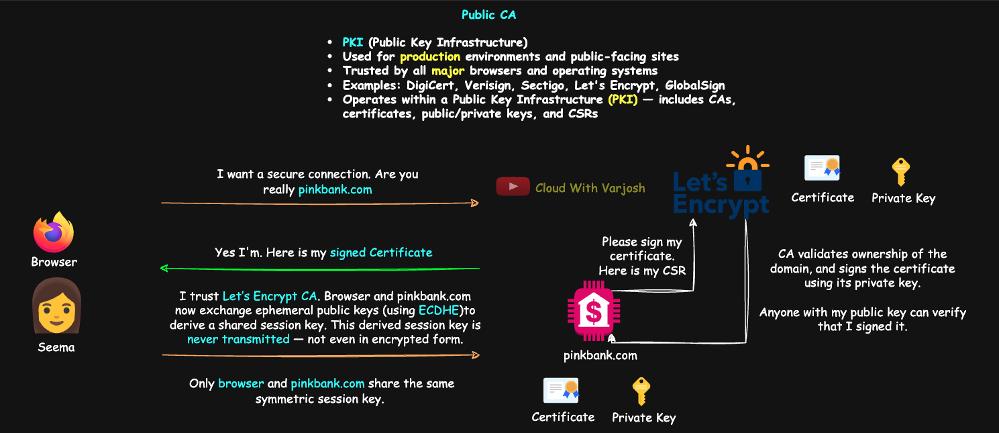
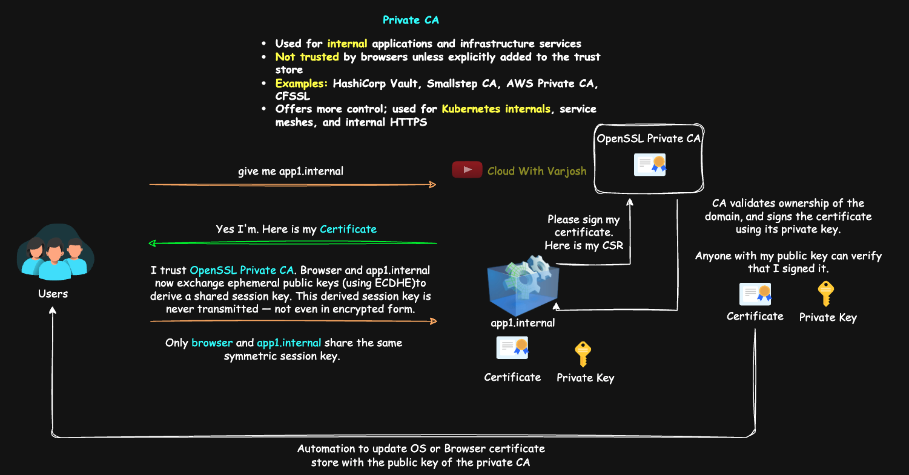
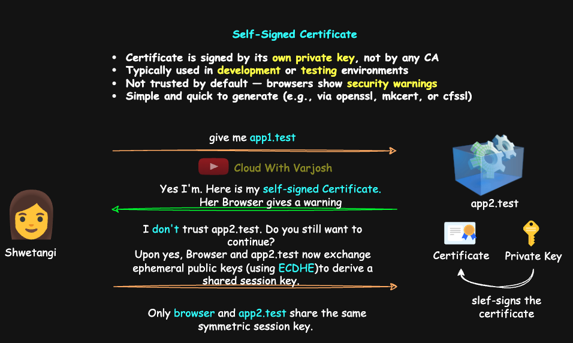

# Day 31: TLS in Kubernetes MASTERCLASS | PART 1 | Mutual Auth (SSH), TLS 1.3, Types of CAs | CKA 2025

## Video reference for Day 31 is the following:
[](https://www.youtube.com/watch?v=afQIvp5a0wM&ab_channel=CloudWithVarJosh)

---
## ⭐ Support the Project  
If this **repository** helps you, give it a ⭐ to show your support and help others discover it! 

---

### Pre-Requisites for Day 31

Before you dive into Day 31, make sure you have gone through the following days to get a better understanding:

1. **Day 30**: How HTTPS & SSH Work, Encryption, and Its Types
   The concepts of encryption, as well as HTTPS and SSH mechanisms, will be essential in understanding security within Kubernetes.

   * **GitHub**: [Day 30 Repo](https://github.com/CloudWithVarJosh/CKA-Certification-Course-2025/tree/main/Day%2030)
   * **YouTube**: [Day 30 Video](https://www.youtube.com/watch?v=MkGPyJqCkB4&ab_channel=CloudWithVarJosh)

---

## Table of Contents

1. [Introduction](#introduction)  
2. [Client and Server – A Refresher](#client-and-server--a-refresher)  
3. [Public Key Cryptography](#public-key-cryptography)  
    3.1. [SSH Authentication (`ssh-keygen`)](#1-secure-remote-access-ssh-keygen-ssh-authentication)  
    3.2. [TLS Certificates (`openssl`)](#2-secure-web-communication-openssl-tls-certificates--identity-validation)  
    3.3. [Key Management Best Practices](#key-management-best-practices)  
    3.4. [Common Key File Formats](#common-key-file-formats)  
    3.5. [What Public Key Cryptography (PKC) Provides](#what-public-key-cryptography-pkc-provides)  
4. [Types of TLS Certificate Authorities (CA)](#types-of-tls-certificate-authorities-ca-public-private-and-self-signed)  
    4.1. [Public CA](#public-ca)  
    4.2. [Private CA](#private-ca)  
    4.3. [Self-Signed Certificates](#self-signed-certificate)  
1. [Conclusion](#conclusion) 


---

### Introduction

In this session, we revisited the **client-server model**, a foundational concept in network communication, to better understand how tools like `kubectl`, SSH, and TLS operate. We then explored **Public Key Cryptography (PKC)**—the backbone of secure authentication and communication in DevOps—focusing on SSH and HTTPS, and how tools like `ssh-keygen` and `openssl` help manage identity, encryption, and trust.

---

### Client and Server – A Refresher



A **client** is the one that initiates a request; the **server** is the one that responds.

**General Examples:**
* When **Seema** accesses `pinkbank.com`, **Seema** is the **client**, and **pinkbank.com** is the **server**.
* When **Varun** downloads something from his **S3 bucket**, **Varun** is the **client**, and the **S3 bucket** is the **server**.

**Kubernetes Examples:**
* When **Seema** use `kubectl get pods`, `kubectl` is the **client** and the **API server** is the **server**.
* When the API server talks to `etcd`, the API server is now the **client**, and `etcd` is the **server**.

This direction of communication is critical when we later talk about **client certificates** and **mTLS**.

---
## **Public Key Cryptography**

### **Public Key Cryptography in DevOps: Focus on SSH & HTTPS**  



Public Key Cryptography (PKC) underpins authentication and secure communication across multiple **application-layer protocols**. While it's used in **email security (PGP, S/MIME), VoIP, database connections, and secure messaging**, a **DevOps engineer primarily interacts with SSH and HTTPS** for managing infrastructure.

Two essential tools for handling public-private key pairs in these domains are **ssh-keygen** (for SSH authentication) and **openssl** (for TLS certificates).

---

#### **1. Secure Remote Access: `ssh-keygen` (SSH Authentication)**  

`ssh-keygen` is the primary tool for generating SSH **public/private key pairs**, which enable **secure remote login** without passwords.  

- Used for **server administration, Git authentication, CI/CD pipelines, and automation**.  
- The **private key** is kept on the **client**, while the **public key** is stored on the **server** (`~/.ssh/authorized_keys`).  
- Authentication works via **public key cryptography**, where the server **verifies the client’s signed request** using its **stored public key**.  

**Alternative SSH Key Tools:**  
- **PuTTYgen** → Windows-based tool for generating SSH keys (used with PuTTY).  
- **OpenSSH** → Built-in on most Unix-based systems, provides SSH utilities including key management.  
- **Mosh (Mobile Shell)** → Used for remote connections and can leverage SSH key authentication.  

---


#### **2. Secure Web Communication: `openssl` (TLS Certificates & Identity Validation)**  

`openssl` is widely used for **private key generation** and **certificate management**, conforming to the **X.509 standard** for TLS encryption.  

- Generates a **private key**, which is securely stored on the server.  
- Creates a **certificate**, which contains a **public key**, metadata (issuer, validity), and a **digital signature from a Certificate Authority (CA)**.  
- The **private key** is used to establish secure communication, while the certificate allows clients to verify the server’s identity.  

> **Note:** TLS is not exclusive to HTTPS. Other application-layer protocols, such as **SMTP** (for email), **FTPS** (for secure file transfer), and **IMAPS** (for secure email retrieval), also use TLS for authentication and secure communication.

**Alternative TLS Certificate Tools:**

* **CFSSL (Cloudflare’s PKI Toolkit)** → Go-based toolkit by Cloudflare for generating and signing certificates.
* **HashiCorp Vault** → 	Can issue, sign, and manage certificates securely.
* **Certbot** → Automates key + cert generation from Let's Encrypt.

**Why TLS Still Uses a Tool Named "OpenSSL"**

At first glance, it may seem ironic that **TLS certificates are still generated using a tool called *OpenSSL***, especially since **SSL is obsolete** and has been replaced by TLS. But there's a historical and practical reason behind it.

**OpenSSL** originated as a toolkit to implement **SSL (Secure Sockets Layer)**, the predecessor to TLS. As SSL was deprecated and TLS became the standard, OpenSSL evolved to support all modern versions of **TLS** (including TLS 1.3), while keeping its original name for compatibility and familiarity.

But **OpenSSL is much more than just a certificate generator**. It’s a comprehensive **cryptographic toolkit** that can:

* Generate public/private key pairs
* Create and sign X.509 certificates
* Perform encryption, decryption, and hashing
* Handle PKI-related formats like PEM, DER, PKCS#12
* Test and debug secure sockets using TLS

So while the name "OpenSSL" may sound outdated, the tool itself is **modern, versatile, and still central** to secure communications today.

---

#### **Key Management Best Practices**  

To protect private keys from unauthorized access, consider these secure storage options:  

- **Hardware Security Modules (HSMs)** → Dedicated devices for key protection.  
- **Secure Enclaves (TPM, Apple Secure Enclave)** → Isolated hardware environments restricting key access.  
- **Cloud-based KMS (AWS KMS, Azure Key Vault)** → Encrypted storage with controlled access.  
- **Encrypted Key Files (`.pem`, `.pfx`)** → Secured with strong passwords.  
- **Smart Cards & USB Tokens (YubiKey, Nitrokey)** → Portable hardware-based security.  
- **Air-Gapped Systems** → Completely offline key storage to prevent network attacks.  

Regular **key rotation** and **audits** are crucial to maintaining security and replacing compromised keys efficiently. 

#### **Common Key File Formats**

#### **For SSH Authentication**

| Format                                | Description                                         |
| ------------------------------------- | --------------------------------------------------- |
| `.pub`                                | **Public key** (shared with the remote server)      |
| `.key`, `*-key.pem`, **no extension** | **Private key** (must be kept secure on the client) |


#### **For TLS Certificates**

| Format              | Description                                                     |
| ------------------- | --------------------------------------------------------------- |
| `.crt`, `.pem`      | **Certificate** (contains a public key and metadata)            |
| `.key`, `*-key.pem`, **no extension**  | **Private key** (must be securely stored)                       |
| `.csr`              | **Certificate Signing Request** (used to request a signed cert) |

By properly managing key storage and implementing best practices, organizations can significantly reduce security risks and prevent unauthorized access.

---

#### **What Public Key Cryptography (PKC) Provides**

Public Key Cryptography (PKC) underpins secure communication by enabling:
- Authentication (Identity Verification)
- Secure Key Exchange (Foundation for Encryption)

We will now discuss both of these in details.

### 1. **Authentication (Identity Verification):**

Public Key Cryptography enables entities—**users, servers, or systems**—to prove their identity using **key pairs** and **digital signatures**. This is fundamental to ensuring that communication is happening with a legitimate party.

#### **In SSH:**



SSH supports **mutual authentication**, where:

* **Server Authentication (Host Key):**

  * When an SSH server (e.g., a Linux machine) is installed, it automatically generates a **host key pair** for each supported algorithm (like RSA, ECDSA, ED25519), stored at:

    * **Private Key:** `/etc/ssh/ssh_host_<algo>_key`
    * **Public Key:** `/etc/ssh/ssh_host_<algo>_key.pub`

  * These keys are used to **prove the identity of the server** to any connecting SSH client.

  * When a client connects:

    * The server sends its **host public key**.

    * The SSH client checks whether this key is already present in its **`~/.ssh/known_hosts`** file.

  * If it's the **first connection**, the key won't exist in `known_hosts`, and the client will show a prompt:

    ```
    The authenticity of host 'server.com (192.168.1.10)' can't be established.
    ED25519 key fingerprint is SHA256:abc123...
    Are you sure you want to continue connecting (yes/no)?
    ```

    You can manually verify the fingerprint by running the following command **on the server** to print the fingerprint of its public host key:

    ```
    ssh-keygen -lf /etc/ssh/ssh_host_ed25519_key.pub
    ```

    * `-l` (lowercase L): shows the fingerprint of the key.
    * `-f`: specifies the path to the public key file.

    Replace `ssh_host_ed25519_key.pub` with the appropriate public key file (e.g., for RSA: `ssh_host_rsa_key.pub`) if using a different algorithm.


    * If the user accepts (`yes`), the server's host key is **saved in `~/.ssh/known_hosts`** and used for verification in all future connections.

    * This approach is called **TOFU (Trust On First Use)**—you trust the server the first time, and ensure its identity doesn't change later.
    * Host Key Verification Methods:

      1. **TOFU (Trust On First Use)**
        Accept the host key manually when prompted during the first connection. Risky on untrusted networks.

      2. **Phone-a-Friend**
        Contact someone who already has access to the server and confirm the server's fingerprint via a secure channel.

      3. **OOB (Out-of-Band) Verification**
        Compare the fingerprint out-of-band (e.g., via Slack, secure email, a trusted documentation portal, etc.).

      4. **Ansible or Configuration Management**
        Use automation tools like Ansible, Puppet, or Chef to push known host fingerprints into `~/.ssh/known_hosts`.

      5. **Pre-loading Known Hosts**
        Populate the `~/.ssh/known_hosts` or `/etc/ssh/ssh_known_hosts` file manually with the correct public key before connecting:

        ```bash
        ssh-keyscan server.example.com >> ~/.ssh/known_hosts
        ```

      6. **Centralized Trust Models**
        In enterprises, SSH certificates (using OpenSSH's CA support) can be used where a trusted internal CA signs host keys and clients trust the CA.

  * On subsequent connections:

    * If the server's host key has changed (possibly due to a reinstallation or a **man-in-the-middle attack**), SSH will warn the user and may block the connection unless the mismatch is explicitly resolved.

    * This warning may also appear in **cloud environments** where the server’s **ephemeral public IP** changes — even if the host key is the same — because SSH uses the IP/hostname to identify the server.

* **Client Authentication:**

  * The **server sends a challenge**, and the **client must sign it using its private key** (e.g., `~/.ssh/mykey`) to prove it possesses the corresponding private key.
  * The **server verifies the signature** using the **client’s public key**, which must be present in the server’s `~/.ssh/authorized_keys` file.

#### **In TLS (e.g., HTTPS):**

* The server presents a **digital certificate** (issued and signed by a **trusted Certificate Authority**) to the client.
* This certificate includes the server’s **public key** and a **CA signature**.
* The client verifies:
  * That the certificate is **issued by a trusted CA** (whose root cert is pre-installed).
  * That the certificate matches the **domain name** (e.g., `example.com`).
* Optionally, in **mutual TLS**, the client also presents a certificate for authentication.

---

### Order of Authentication in Mutual Authentication (SSH or mTLS)

Whether using **SSH** or **mutual TLS (mTLS)**, the **server always authenticates first**, followed by the client.

**Reasons the server authenticates first:**

* The client must verify the server's identity before sending any sensitive data.
* It prevents man-in-the-middle (MITM) attacks by ensuring the connection is to the intended endpoint.
* A secure, encrypted channel is established only after the server is trusted.
* This pattern ensures that secrets (like private keys or credentials) are never exposed to an untrusted server.

This sequence holds true for:

* SSH (server presents host key first, then client authentication occurs)
* mTLS (server presents its certificate first, then requests the client's certificate if required)

---

### 2. **Secure Key Exchange (Foundation for Encryption):**

Rather than encrypting all data directly using asymmetric cryptography, **Public Key Cryptography (PKC)** is used to **securely exchange or derive symmetric session keys**. These **session keys** are then used for efficient **symmetric encryption** of actual data in transit.

* In **SSH**:

  * Both the **client and server participate equally** in a **key exchange algorithm** (e.g., **Diffie-Hellman** or **ECDH (Elliptic Curve Diffie-Hellman)**).
  * Each side contributes a random component and uses the other’s public part to **jointly compute the same session key**.
  * **No single party creates the session key outright**; it is derived **collaboratively**, ensuring that **neither side sends the session key directly** — making it secure even over untrusted networks.
  * >🔐 **Importantly, this session key is established and encryption begins *before* any client authentication takes place.**
    This ensures that even authentication credentials (like passwords or signed challenges) are never sent in plaintext.

* In **TLS**:

  * **Older TLS (e.g., TLS 1.2 with RSA key exchange)**

    * The client generates a session key.
    * It encrypts the session key using the server’s public key (from its certificate).
    * The server decrypts it using its private key.
    * Both sides use this session key for symmetric encryption.
      **Drawback**: If the server’s private key is compromised, past sessions can be decrypted (no forward secrecy).

  * **Modern TLS (e.g., TLS 1.3 or TLS 1.2 with ECDHE)**

    * The client and server perform an ephemeral key exchange (e.g., ECDHE – Elliptic Curve Diffie-Hellman Ephemeral).
    * Both sides derive the session key collaboratively — it is never transmitted directly.
      **Advantage**: Even if the server’s private key is compromised later, past communications remain secure (forward secrecy).

> * **In SSH, encryption begins *before* authentication**, ensuring that even credentials are exchanged over a secure channel.
>* **In HTTPS (TLS), authentication happens *before* encryption**, as the server must first prove its identity via certificate.

---

### Types of TLS Certificate Authorities (CA): Public, Private, and Self-Signed

When enabling HTTPS or TLS for applications, certificates must be signed to be trusted by clients. There are three common ways to achieve this:
1. **Public CA** – Used for production websites accessible over the internet (e.g., Let's Encrypt, DigiCert).
2. **Private CA** – Used within organizations for internal services (e.g., `*.internal` domains).
3. **Self-Signed Certificates** – Quick to create, mainly used for testing, but not trusted by browsers.

**Public CA vs Private CA vs Self-Signed Certificates**

| **Certificate Type**         | **Use Case**                                      | **Trust Level**                 | **Common Examples**                       | **Typical Use**                                                                        |
| ---------------------------- | ------------------------------------------------- | ------------------------------- | ----------------------------------------- | -------------------------------------------------------------------------------------- |
| **Public CA**                | Production websites, accessible over the internet | Trusted by all major browsers   | Let's Encrypt, DigiCert, GlobalSign       | Used for production environments and public-facing sites                               |
| **Private CA**               | Internal services within an organization          | Trusted within the organization | Custom CA (e.g., internal enterprise CAs) | Used for internal applications, such as `*.internal` domains                           |
| **Self-Signed Certificates** | Testing and development                           | Not trusted by browsers         | N/A                                       | Quick certificates for testing or development purposes, not recommended for production |

---

### Public CA



When you visit a website like `pinkbank.com`, your browser needs a way to verify that the server it’s talking to is indeed `pinkbank.com` and not someone pretending to be it. That’s where a **Certificate Authority (CA)** comes into play.

* `pinkbank.com` generates its own digital certificate (often through a **Certificate Signing Request** using tools like OpenSSL) and then gets it signed by a trusted Certificate Authority (CA) such as Let’s Encrypt to prove its authenticity.
* Seema’s browser, like most browsers, already contains the **public keys of well-known CAs**. So, it can verify that the certificate presented by `pinkbank.com` is indeed signed by Let’s Encrypt.
* This trust chain ensures authenticity. Without a CA, there would be no trusted way to confirm the server’s identity.

If a certificate were self-signed or signed by an unknown entity, Seema’s browser would show a warning because it cannot validate the certificate's authenticity.

**Important Note**
In this example, I used Let’s Encrypt because it is a popular choice for DevOps engineers, developers, and cloud engineers, as it provides free, automated SSL/TLS certificates.
> While Let’s Encrypt is widely used even in production environments, especially for public-facing services, enterprise use cases may also involve certificates from commercial Certificate Authorities (CAs) like DigiCert, GlobalSign, Entrust, or Google Trust Services — which offer advanced features like extended validation (EV), organization validation (OV), SLAs, and dedicated support.

---

**Public Key Infrastructure (PKI)**

PKI is a framework that manages digital certificates, keys, and Certificate Signing Requests (CSRs) to enable secure communication over networks. It involves the use of **public and private keys** to encrypt and decrypt data, ensuring confidentiality and authentication.

---

### Private CA



Just like browsers come with a list of trusted CAs, you can manually add a CA’s public key to your trust store (e.g., in a browser or an operating system).

**Summary for Internal HTTPS Access Without Warnings**

To securely expose an internal app as `https://app1.internal` without browser warnings:

* Set up a **private Certificate Authority (CA)** and issue a TLS certificate for `app1.internal`.

* Install the **private CA’s root certificate** on all internal user machines so their browsers trust the certificate:

  * **Windows**: Use **Group Policy (GPO)** to add the CA cert to the **Trusted Root Certification Authorities** store.
  * **macOS**: Use **MDM** or manually import the root cert using **Keychain Access** → System → Certificates → Trust.
  * **Linux**: Place the CA cert in `/usr/local/share/ca-certificates/` and run:

    ```bash
    sudo update-ca-certificates
    ```

* Ensure internal DNS resolves `app1.internal` to the correct internal IP.

---

### Self-Signed Certificate



A **self-signed certificate** is a certificate that is **signed with its own private key**, rather than being issued by a trusted Certificate Authority (CA).

Let’s take an example:
Our developer **Shwetangi** is building an internal application named **app2**, accessible locally at **app2.test**. She wants to enable **HTTPS** to test how her application behaves over a secure connection. Since it's only for development, she generates a self-signed certificate using tools like `openssl` and uses it to enable HTTPS on **app2.test**.

#### **Typical Use Cases of Self-Signed Certificates**

* Local development and testing environments
* Internal tools not exposed publicly
* Quick prototyping or sandbox setups
* Lab or non-production Kubernetes clusters

> ⚠️ Self-signed certificates are **not trusted by browsers or clients** by default and will trigger warnings like:
> Chrome: “Your connection is not private” (NET::ERR\_CERT\_AUTHORITY\_INVALID)
> Firefox: “Warning: Potential Security Risk Ahead”

#### **Common Internal Domain Suffixes for Testing**

* `.test` — Reserved for testing and documentation (RFC 6761)
* `.local` — Often used by mDNS/Bonjour or local network devices
* `.internal` — Used in private networks or cloud-native environments (e.g., GCP)
* `.dev`, `.example` — Reserved for documentation and sometimes local use

Using these reserved domains helps avoid accidental DNS resolution on the public internet and is a best practice for local/dev setups.

---

### **Conclusion**

Public Key Cryptography enables secure remote access, identity verification, and encrypted communication—essentials in modern infrastructure. From SSH keys to TLS certificates, understanding the flow of trust and proper key management is critical for any DevOps engineer. This foundation sets the stage for deeper topics like **mutual TLS**, **client certificates**, and **PKI systems** in production environments.

---