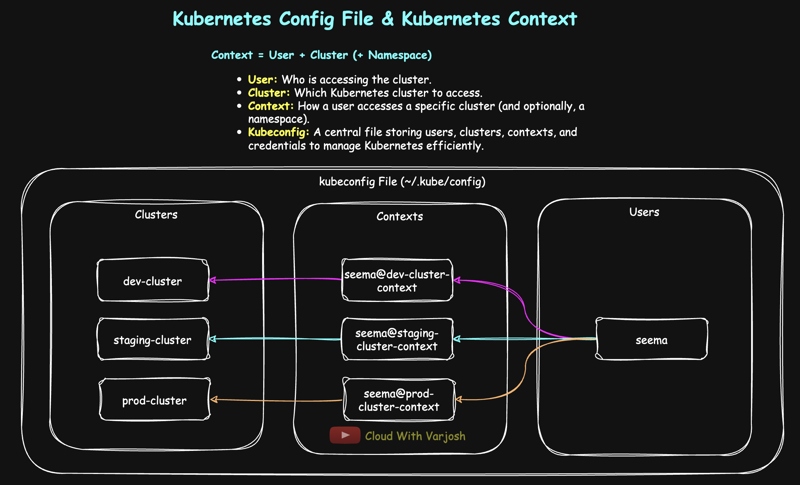
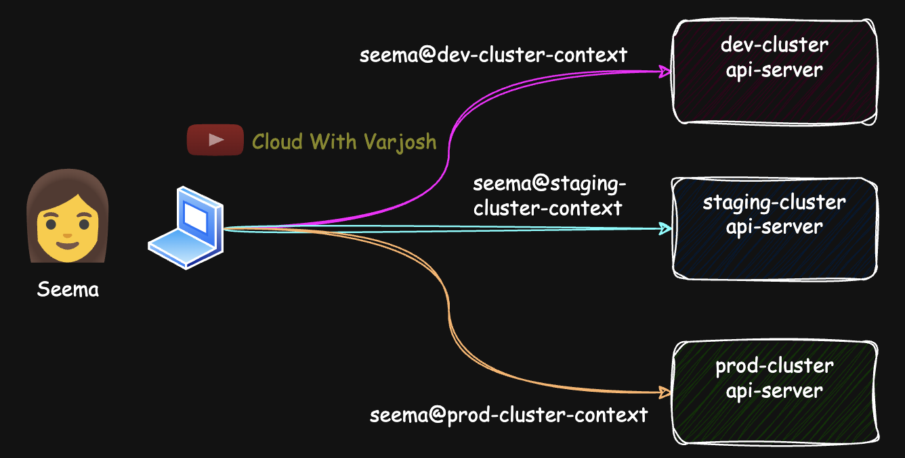
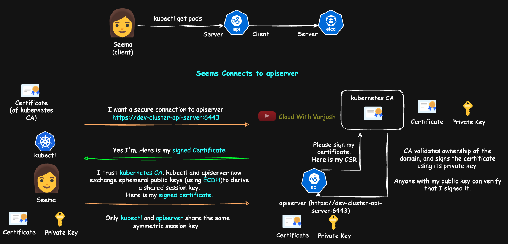

# Day 32: TLS in Kubernetes MASTERCLASS | PART 2 | mTLS , kubeconfig & Kubernetes Context | CKA 2025

## Video reference for Day 32 is the following:

[](https://www.youtube.com/watch?v=VBlI0IG4ReI&ab_channel=CloudWithVarJosh)


---
## ⭐ Support the Project  
If this **repository** helps you, give it a ⭐ to show your support and help others discover it! 


---

### Pre-Requisites for Day 32

Before you dive into Day 32, make sure you have gone through the following days to get a better understanding:

1. **Day 30**: How HTTPS & SSH Work, Encryption, and Its Types
   The concepts of encryption, HTTPS, and SSH mechanisms will be essential for understanding Kubernetes security.

   * **GitHub**: [Day 30 Repo](https://github.com/CloudWithVarJosh/CKA-Certification-Course-2025/tree/main/Day%2030)
   * **YouTube**: [Day 30 Video](https://www.youtube.com/watch?v=MkGPyJqCkB4&ab_channel=CloudWithVarJosh)

2. **Day 31 Part 1**: Mutual Auth (SSH), TLS 1.3, Types of Certificate Authorities (CAs)
   This session introduces key security concepts that lay the groundwork for Part 2.

   * **GitHub**: [Day 31 Part 1 Repo](https://github.com/CloudWithVarJosh/CKA-Certification-Course-2025/tree/main/Day%2031%20Part%201)
   * **YouTube**: [Day 31 Part 1 Video](https://www.youtube.com/watch?v=afQIvp5a0wM&ab_channel=CloudWithVarJosh)

---

## Table of Contents

1. [Introduction](#introduction)  
2. [Kubeconfig and Kubernetes Context](#kubeconfig-and-kubernetes-context)  
   2.1. [What is a Kubeconfig File and Why Do We Need It?](#what-is-a-kubeconfig-file-and-why-do-we-need-it)  
   2.2. [Kubernetes Contexts](#kubernetes-context)  
   2.3. [Example Kubeconfig File](#example-kubeconfig-file)  
   2.4. [Common `kubectl config` Commands](#common-kubectl-config-commands-compact-view)  
   2.5. [Managing Multiple Kubeconfigs](#multiple-kubeconfig-files)  
3. [Mutual TLS (mTLS)](#mutual-tls-mtls)  
   3.1. [Why mTLS in Kubernetes?](#why-mtls-in-kubernetes)  
4. [Conclusion](#conclusion)  
5. [References](#references)  

---


## Introduction

When working with Kubernetes, especially in environments that involve multiple clusters and namespaces, managing access securely and efficiently becomes crucial. This is where the **kubeconfig file** and **Kubernetes contexts** come into play. These mechanisms provide a structured way to authenticate users, connect to clusters, and switch between environments seamlessly—all while ensuring secure and streamlined workflows for developers, DevOps engineers, and administrators.

In this section, we’ll dive into what the kubeconfig file is, why it matters, how Kubernetes contexts help users like Seema manage multiple clusters, and how all of this ties into the broader concept of **mutual TLS (mTLS)** in Kubernetes.

---

## Kubeconfig and Kubernetes Context

### What is a Kubeconfig File and Why Do We Need It?



* The **kubeconfig file** is a configuration file that stores:

  * **Cluster connection information** (e.g., API server URL)
  * **User credentials** (e.g., authentication tokens, certificates)
  * **Context information** (e.g., which cluster and user to use)
* It allows Kubernetes tools (like `kubectl`) to interact with the cluster securely and seamlessly.
* The kubeconfig file simplifies authentication and access control, eliminating the need to manually provide connection details each time we run a command.

### What If the Kubeconfig File Were Not There?

Without the kubeconfig file, you would need to manually specify the cluster connection information for every command. For example:

* With the kubeconfig file:

  ```bash
  kubectl get pods
  ```

* Without the kubeconfig file, you would need to include details like this:

  ```bash
  kubectl get pods \
    --server=https://<API_SERVER_URL> \
    --certificate-authority=<CA_CERT_FILE> \
    --client-key=<CLIENT_KEY_FILE> \
    --client-certificate=<CLIENT_CERT_FILE>
  ```

As you can see, without the kubeconfig file, the command becomes longer and more error-prone. Each command requires explicit details, which can be tedious to manage.

**We will look into how a kubeconfile looks like in a while.**

---

### Kubernetes Context
**Kubernetes contexts** allow users to easily manage multiple clusters and namespaces by storing cluster, user, and namespace information in the `kubeconfig` file. Each context defines a combination of a cluster, a user, and a namespace, making it simple for users like `Seema` to switch between clusters and namespaces seamlessly without manually changing the configuration each time.



## Scenario:

Seema, the user, wants to access three different Kubernetes clusters from her laptop. Let's assume these clusters are:

1. **dev-cluster** (for development)
2. **staging-cluster** (for staging)
3. **prod-cluster** (for production)

Seema will need to interact with these clusters frequently. Using Kubernetes contexts, she can set up and switch between these clusters easily.

## How Kubernetes Contexts Work:

### 1. Configuring Contexts:

In the `kubeconfig` file, each cluster, user, and namespace combination is stored as a context. So, Seema can have three different contexts, one for each cluster. The contexts will contain:

* **Cluster details**: API server URL, certificate authority, etc.
* **User details**: Authentication method (e.g., username/password, token, certificate).
* **Namespace details**: The default namespace to work in for the context (though the namespace can be overridden on a per-command basis).

### 2. Switching Between Contexts:

With Kubernetes contexts configured, Seema can easily switch between them. If she needs to work on **dev-cluster**, she can switch to the `dev-context`. Similarly, for **staging-cluster**, she switches to `staging-context`, and for **prod-cluster**, the `prod-context`.

A **Kubernetes namespace** is a virtual cluster within a physical cluster that provides logical segregation for resources. This allows multiple environments like dev, staging, and prod to coexist on the same cluster without interference.

We now use naming like `app1-dev-ns`, `app1-staging-ns`, and `app1-prod-ns` to logically group and isolate resources of `app1` across environments.

For example, `app1-dev-ns` in dev-cluster keeps all resources related to `app1`'s development isolated from production resources in `app1-prod-ns` on prod-cluster.

## Example `kubeconfig` File:

> 🗂️ **Note:** The `kubeconfig` file is usually located at `~/.kube/config` in the home directory of the user who installed `kubectl`. This file allows users to connect to one or more clusters by managing credentials, clusters, and contexts. While the file is commonly named `config`, it's often referred to as the *kubeconfig* file, and its location can vary depending on the cluster setup.



Here's a simplified example of what the `kubeconfig` file might look like:

```yaml
apiVersion: v1
# Define the clusters
clusters:
  - name: dev-cluster  # Logical name for the development cluster
    cluster:
      server: https://dev-cluster-api-server:6443  # API server endpoint (usually port 6443)
      certificate-authority-data: <certificate-data>  # Base64-encoded CA certificate
  - name: staging-cluster
    cluster:
      server: https://staging-cluster-api-server:6443
      certificate-authority-data: <certificate-data>
  - name: prod-cluster
    cluster:
      server: https://prod-cluster-api-server:6443
      certificate-authority-data: <certificate-data>

# Define users (credentials for authentication)
users:
  - name: seema  # Logical user name
    user:
      client-certificate-data: <client-cert-data>  # Base64-encoded client certificate
      client-key-data: <client-key-data>  # Base64-encoded private key

# Define contexts (combination of cluster + user + optional namespace)
contexts:
  - name: seema@dev-cluster-context
    context:
      cluster: dev-cluster
      user: seema
      namespace: app1-dev-ns  # Default namespace for this context; kubectl commands will run in this namespace when this context is active
  - name: seema@staging-cluster-context
    context:
      cluster: staging-cluster
      user: seema
      namespace: app1-staging-ns  # When this context is active, kubectl will run commands in this namespace
  - name: seema@prod-cluster-context
    context:
      cluster: prod-cluster
      user: seema
      namespace: app1-prod-ns

# Set the default context to use
current-context: seema@dev-cluster-context

# -------------------------------------------------------------------
# Explanation of Certificate Fields:

# certificate-authority-data:
#   - This is the base64-encoded public certificate of the cluster’s Certificate Authority (CA).
#   - Used by the client (kubectl) to verify the identity of the API server (ensures it is trusted).

# client-certificate-data:
#   - This is the base64-encoded public certificate issued to the user (client).
#   - Sent to the API server to authenticate the user's identity.

# client-key-data:
#   - This is the base64-encoded private key that pairs with the client certificate.
#   - Used to prove the user's identity securely to the API server.
#   - Must be kept safe, as it can be used to impersonate the user.

# Together, these enable secure mutual TLS authentication between kubectl and the Kubernetes API server.

```
---

### Viewing & Managing Your `kubeconfig`

Your `kubeconfig` file (typically at `~/.kube/config`) holds info about **clusters, users, contexts, and namespaces**. Avoid editing it manually—use `kubectl config` for safe, consistent changes.

> **Pro Tip:** Use `kubectl config -h` to explore powerful subcommands like `use-context`, `set-context`, `rename-context`, etc.

---

### Common `kubectl config` Commands (Compact View)

| Task                                      | Command & Example                                                                                                                                                                        |
| ----------------------------------------- | ---------------------------------------------------------------------------------------------------------------------------------------------------------------------------------------- |
| View current context                      | `kubectl config current-context`<br>Example: `seema@dev-cluster-context`                                                                                                                 |
| List all contexts                         | `kubectl config get-contexts`<br>Shows: `seema@dev-cluster-context`, etc.                                                                                                                |
| Switch to a different context             | `kubectl config use-context seema@prod-cluster-context`<br>Switches to prod                                                                                                              |
| View entire config (pretty format)        | `kubectl config view`<br>Readable view of clusters, users, contexts                                                                                                                      |
| View raw config (YAML for scripting)      | `kubectl config view --raw`<br>Useful for parsing/exporting                                                                                                                              |
| Show active config file path              | `echo $KUBECONFIG`<br>Defaults to `~/.kube/config` if not explicitly set                                                                                                                 |
| Set default namespace for current context | `kubectl config set-context --current --namespace=app1-staging-ns`<br>Updates Seema's current context                                                                                    |
| Override namespace just for one command   | `kubectl get pods --namespace=app1-prod-ns`<br>Runs the command in prod namespace                                                                                                        |
| Inspect kubeconfig at custom path         | `kubectl config view --kubeconfig=~/kubeconfigs/custom-kubeconfig.yaml`                                                                                                                  |
| Add a new user                            | `kubectl config set-credentials varun --client-certificate=varun-cert.pem --client-key=varun-key.pem --kubeconfig=~/kubeconfigs/seema-kubeconfig.yaml`                                   |
| Add a new cluster                         | `kubectl config set-cluster dev-cluster --server=https://dev-cluster-api-server:6443 --certificate-authority=ca.crt --embed-certs=true --kubeconfig=~/kubeconfigs/seema-kubeconfig.yaml` |
| Add a new context                         | `kubectl config set-context seema@dev-cluster-context --cluster=dev-cluster --user=seema --namespace=app1-dev-ns --kubeconfig=~/kubeconfigs/seema-kubeconfig.yaml`                       |
| Rename a context                          | `kubectl config rename-context seema@dev-cluster-context seema@dev-env`                                                                                                                  |
| Delete a context                          | `kubectl config delete-context seema@staging-cluster-context`                                                                                                                            |
| Delete a user                             | `kubectl config unset users.seema`                                                                                                                                                       |
| Delete a cluster                          | `kubectl config unset clusters.staging-cluster`                                                                                                                                          |
---

### Multiple Kubeconfig Files

Kubernetes supports multiple config files. Use `--kubeconfig` with any `kubectl` command to specify which one to use:

```bash
kubectl get pods --kubeconfig=~/.kube/dev-kubeconfig
kubectl config use-context dev-cluster --kubeconfig=~/.kube/dev-kubeconfig
```

Ideal for managing multiple clusters (e.g., dev/staging/prod) cleanly.

---

### Using a Custom Kubeconfig as Default via `KUBECONFIG`

By default, `kubectl` uses the kubeconfig file at `~/.kube/config`. You won't see anything with `echo $KUBECONFIG` unless you've set it yourself.

To avoid specifying `--kubeconfig` with every command, you can set the `KUBECONFIG` environment variable:

**Step-by-step:**

1. Open your shell profile:

   ```bash
   vi ~/.bashrc   # Or ~/.zshrc, depending on your shell
   ```

2. Add the line:

   ```bash
   export KUBECONFIG=$HOME/.kube/my-2nd-kubeconfig-file
   ```

3. Apply the change:

   ```bash
   source ~/.bashrc
   ```

Now, `kubectl` will automatically use that file for all commands.

---

### Adding Entries to a Kubeconfig File

Avoid manually editing the kubeconfig. Instead, use `kubectl config` to manage users, clusters, and contexts.

**Add a new user:**

```bash
kubectl config set-credentials varun \
  --client-certificate=~/kubeconfigs/varun-cert.pem \
  --client-key=~/kubeconfigs/varun-key.pem \
  --kubeconfig=~/kubeconfigs/my-2nd-kubeconfig-file
```

**Add a new cluster:**

```bash
kubectl config set-cluster aws-cluster \
  --server=https://aws-api-server:6443 \
  --certificate-authority=~/kubeconfigs/aws-ca.crt \
  --embed-certs=true \
  --kubeconfig=~/kubeconfigs/my-2nd-kubeconfig-file
```

**Add a new context:**

```bash
kubectl config set-context varun@aws-cluster-context \
  --cluster=aws-cluster \
  --user=varun \
  --namespace=default \
  --kubeconfig=~/kubeconfigs/my-2nd-kubeconfig-file
```

**Switch to the new context:**

```bash
kubectl config use-context varun@aws-cluster-context \
  --kubeconfig=~/kubeconfigs/my-2nd-kubeconfig-file
```
**Verify:**


```bash
kubectl config view --kubeconfig=~/kubeconfigs/my-2nd-kubeconfig-file --minify
```
 * `--kubeconfig=...`: Points to your custom kubeconfig file.
 * `--minify`: Shows only the active context and related cluster/user info.
 
```bash
kubectl config view --kubeconfig=~/kubeconfigs/my-2nd-kubeconfig-file
```


---

## Mutual TLS (mTLS)

**Mutual TLS (mTLS)** is an extension of standard TLS where **both the client and server authenticate each other** using digital certificates. This ensures that **each party is who they claim to be**, providing strong identity verification and preventing unauthorized access. mTLS is especially important in environments where **machines, services, or workloads** need to communicate securely without human involvement — such as in microservices, Kubernetes clusters, and service meshes.

We often observe that **public-facing websites**, typically accessed by **humans via browsers**, use **one-way TLS**, where **only the server is authenticated**. For example, when Seema visits `pinkbank.com`, the server proves its identity by presenting a **signed certificate** issued by a **trusted Certificate Authority (CA)**.

However, in **machine-to-machine communication** — such as in **Kubernetes** or other distributed systems — it's common to see **mutual TLS (mTLS)**. In this model, **both parties present certificates**, enabling **bi-directional trust** and stronger security.

All major **managed Kubernetes services**, including **Amazon EKS**, **Google GKE**, and **Azure AKS**, **enforce mTLS by default** for internal control plane communication (e.g., between the API server, kubelet, controller manager, and etcd), as part of their secure-by-default approach.

> Whether it's **SSH** or **TLS/mTLS**, the **server always proves its identity first**. This is by design — the client must be sure it is talking to the correct, trusted server **before** sending any sensitive data or credentials.

---

**Why mTLS in Kubernetes?**

* Prevents unauthorized components from communicating within the cluster.
* Ensures that only trusted services (e.g., a valid API server or kubelet) can connect to each other.
* Strengthens the overall security posture of the cluster, especially in production environments.

Although some components can work with just server-side TLS, enabling mTLS is **strongly recommended** wherever possible — particularly in communication with sensitive components like `etcd`, `kubelet`, and `kube-apiserver`.

| Feature               | TLS (1-Way)             | mTLS (2-Way)                               |
| --------------------- | ----------------------- | ------------------------------------------ |
| Authentication        | Server only             | **Both client and server**                 |
| Use Case              | Public websites, APIs   | Microservices, Kubernetes, APIs w/ clients |
| Identity Verification | Server proves identity  | **Mutual identity verification**           |
| Certificate Required  | Only server certificate | **Both server and client certificates**    |
| Security Level        | Strong                  | **Stronger (mutual trust)**                |


---

## Conclusion

Understanding and properly configuring the `kubeconfig` file is foundational for working with Kubernetes efficiently and securely. Whether you're managing a single cluster or navigating between multiple dev, staging, and production environments, **contexts** in kubeconfig make the transition smooth and maintainable.

By leveraging tools like `kubectl config`, managing users, clusters, and namespaces becomes safer and more automated—avoiding manual errors. Combined with **mutual TLS (mTLS)**, Kubernetes ensures that all communications within the control plane are authenticated and encrypted, offering a robust security model that protects sensitive workloads and APIs.

Mastering these elements not only boosts your day-to-day productivity but also helps you build secure, enterprise-grade Kubernetes setups.

---

## References

1. Kubernetes Official Documentation - [Configure Access to Multiple Clusters](https://kubernetes.io/docs/concepts/configuration/organize-cluster-access-kubeconfig/)
4. kubectl config Command Reference - [kubectl config](https://kubernetes.io/docs/reference/generated/kubectl/kubectl-commands#config)

---