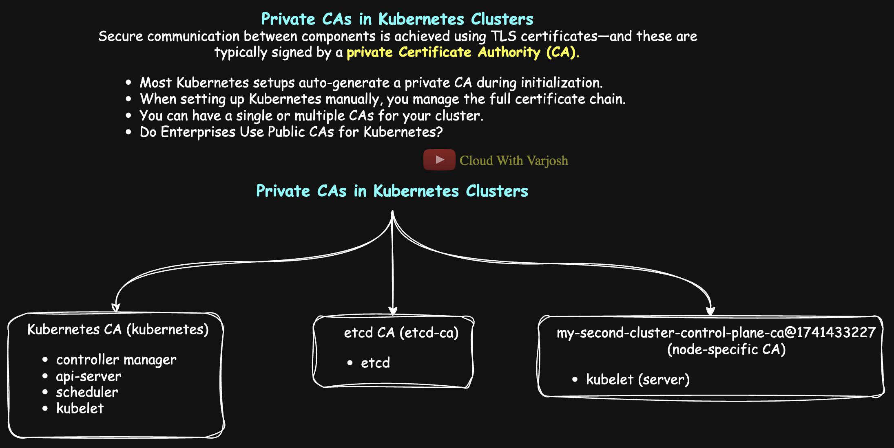
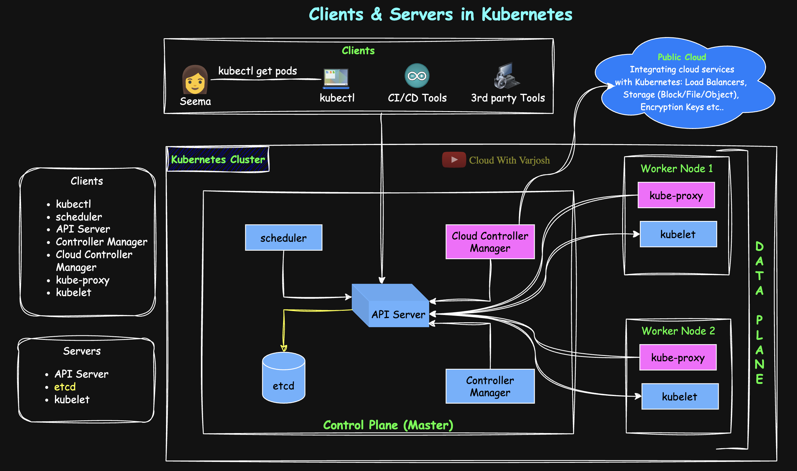
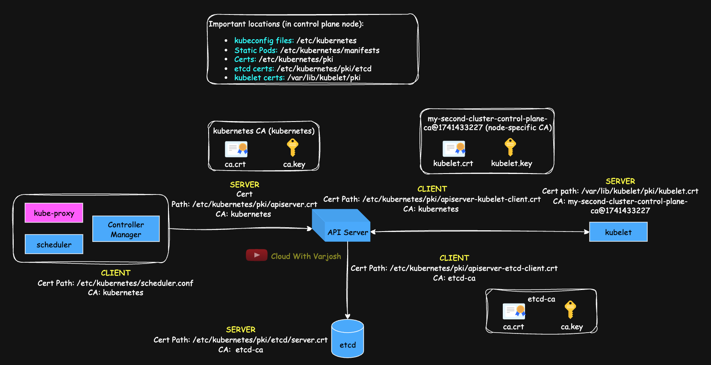

# Day 33: TLS in Kubernetes MASTERCLASS | PART 3 | Private CAs, TLS Auth Flow, mTLS in Kubernetes Cluster | CKA 2025

## Video reference for Day 33 is the following:
[](https://www.youtube.com/watch?v=rVFlVIs2gDU&ab_channel=CloudWithVarJosh)

---
## ⭐ Support the Project  
If this **repository** helps you, give it a ⭐ to show your support and help others discover it! 

---

### Pre-Requisites for Day 33

Before you dive into Day 33, make sure you have gone through the following days to get a better understanding:


1. **Day 7**: Kubernetes Architecture
   Understanding Kubernetes components and their roles will help you grasp when each component acts as a client or server.

   * **GitHub**: [Day 7 Repo](https://github.com/CloudWithVarJosh/CKA-Certification-Course-2025/tree/main/Day%2007)
   * **YouTube**: [Day 7 Video](https://www.youtube.com/watch?v=-9Cslu8PTjU&ab_channel=CloudWithVarJosh)

2. **Day 30**: How HTTPS & SSH Work, Encryption, and Its Types
   The concepts of encryption, as well as HTTPS and SSH mechanisms, will be essential in understanding security within Kubernetes.

   * **GitHub**: [Day 30 Repo](https://github.com/CloudWithVarJosh/CKA-Certification-Course-2025/tree/main/Day%2030)
   * **YouTube**: [Day 30 Video](https://www.youtube.com/watch?v=MkGPyJqCkB4&ab_channel=CloudWithVarJosh)

3. **Day 31**: TLS in Kubernetes MASTERCLASS | PART 1 | Mutual Auth (SSH), TLS 1.3, Types of CAs
   Start your journey into TLS by understanding client-server trust models, SSH mutual auth, 1-way TLS with TLS 1.3, and different types of Certificate Authorities.

   * **GitHub**: [Day 31 Repo](https://github.com/CloudWithVarJosh/CKA-Certification-Course-2025/tree/main/Day%2031)
   * **YouTube**: [Day 31 Video](https://www.youtube.com/watch?v=afQIvp5a0wM&ab_channel=CloudWithVarJosh)

4. **Day 32**: TLS in Kubernetes MASTERCLASS | PART 2 | mTLS, kubeconfig & Kubernetes Context
   Deep dive into mutual TLS (mTLS), the kubeconfig file structure, and how Kubernetes context enables managing multiple clusters and namespaces efficiently.

   * **GitHub**: [Day 32 Repo](https://github.com/CloudWithVarJosh/CKA-Certification-Course-2025/tree/main/Day%2032)
   * **YouTube**: [Day 32 Video](https://www.youtube.com/watch?v=VBlI0IG4ReI&ab_channel=CloudWithVarJosh)

---

## Table of Contents

1. [Introduction](#introduction)
2. [Private CAs in Kubernetes Clusters](#private-cas-in-kubernetes-clusters)
3. [Kubernetes Components as Clients and Servers](#kubernetes-components-as-clients-and-servers)
4. [Understanding TLS in Kubernetes: No More Memorizing File Paths](#understanding-tls-in-kubernetes-no-more-memorizing-file-paths)
    - [Example 1: mTLS Between Scheduler (Client) and API Server (Server)](#example-1-mtls-between-scheduler-client-and-api-server-server)
        - [Server-Side: API Server Presents Its Certificate](#server-side-how-the-api-server-presents-its-certificate)
        - [Client-Side: Scheduler Verifies and Authenticates](#client-side-how-the-scheduler-authenticates-to-the-api-server)
    - [Example 2: mTLS Between API Server (Client) and etcd (Server)](#example-2-mtls-between-api-server-client-and-etcd-server)
        - [Server-Side: etcd Presents Its Certificate](#server-side-etcd-presents-its-certificate-to-api-server)
        - [Client-Side: API Server Verifies and Authenticates](#client-side-api-server-authenticates-to-etcd)
    - [Example 3: mTLS Between API Server (Client) and Kubelet (Server)](#example-3-mtls-between-api-server-client-and-kubelet-server)
        - [Server-Side: Kubelet Presents Its Certificate](#server-side-how-the-kubelet-presents-its-certificate)
        - [Client-Side: API Server Verifies and Presents Certificate](#client-side-how-the-api-server-verifies-the-kubelet)
5. [Tasks](#tasks-for-you)
5. [Conclusion](#conclusion)
5. [References](#references)

---

## Introduction

In this session, we’ll demystify how **Kubernetes components authenticate and trust each other using TLS**. You’ll learn:

* How **Private CAs** work inside Kubernetes clusters
* Which components act as **clients vs. servers**
* And how to decode **real-world mTLS setups** without memorizing paths

We'll walk through examples like the **Scheduler ↔ API Server**, **API Server ↔ etcd**, and **API Server ↔ Kubelet**, inspecting actual certs and config files to see how TLS and authentication work in practice.

---

### **Private CAs in Kubernetes Clusters**



In Kubernetes, **TLS certificates secure communication** between core components. These certificates are signed by a **private Certificate Authority (CA)**, ensuring authentication and encryption. Depending on security requirements, a cluster can be configured to use:

* A **single CA** for the entire cluster (simpler, easier to manage), or
* **Multiple CAs** (e.g., a separate CA for etcd) for added security and isolation.

**Why Use Multiple CAs?**

Using **multiple private CAs** strengthens security by **isolating trust boundaries**. This approach is particularly useful for sensitive components like **etcd**, which stores the **entire cluster state**.

Security Considerations:
- If **etcd is compromised**, an attacker could gain full control over the cluster.
- To **limit the blast radius** in case of a CA or key compromise, it's common to **assign a separate CA exclusively for etcd**.
- Other control plane components (e.g., API server, scheduler, controller-manager) can share a **different CA**, ensuring **compartmentalized trust**.

By segmenting certificate authorities, Kubernetes operators can **reduce risk** and **enhance security posture**.

You can configure Kubernetes components to **trust a private CA** by distributing the CA’s public certificate to each component’s trust store. For example:

* `kubectl` trusts the API server because it has the **private CA** certificate that signed the API server's certificate.
* Similarly, components like the `controller-manager`, `scheduler`, and `kubelet` trust the API server and each other using certificates signed by this **shared private CA**.

Most Kubernetes clusters—whether provisioned via tools like `kubeadm`, `k3s`, or through managed services like **EKS**, **GKE**, or **AKS**—automatically generate and manage a **private CA** during cluster initialization. This CA is used to issue certificates for key components, enabling **TLS encryption and mutual authentication** out of the box.

When using **managed Kubernetes services**, this private CA is maintained by the cloud provider. It remains **hidden from users**, but all internal components are configured to trust it, ensuring secure communication without manual intervention.

However, when setting up a cluster **“the hard way”** (e.g., via [Kelsey Hightower’s guide](https://github.com/kelseyhightower/kubernetes-the-hard-way)), **you are responsible for creating and managing the entire certificate chain**. This means:

* Generating a root CA certificate and key,
* Signing individual component certificates,
* And distributing them appropriately.

While this approach offers **maximum transparency and control**, it also demands a solid understanding of **PKI, TLS, and Kubernetes internals**.

---

**Do Enterprises Use Public CAs for Kubernetes?**

Enterprises do **not** use public Certificate Authorities (CAs) for **core Kubernetes internals**. Instead, they rely on **private CAs**—either auto-generated (using tools like `kubeadm`) or centrally managed—to sign certificates used by Kubernetes components like the API server, kubelet, controller-manager, and scheduler. These certificates facilitate secure **TLS encryption and mutual authentication** within the cluster.

For **public-facing services**, however, it's common to use **public CAs**. Components such as:

* Ingress controllers
* Load balancers
* Gateway API implementations

...require certificates trusted by browsers. In these cases, enterprises use public CAs (e.g., Let’s Encrypt, DigiCert, GlobalSign) to issue TLS certificates, ensuring a secure **HTTPS** experience for users and avoiding browser trust warnings.

In short:

* **Private CAs** → Used for internal Kubernetes communication
* **Public CAs** → Used for securing external-facing applications
* ⚠️ Public CAs are **not** used for control plane or internal Kubernetes components
---

### Kubernetes Components as Clients and Servers

In the diagram below, arrows represent the direction of client-server communication:



* The **arrow tail** indicates the **client**, and the **arrowhead** points to the **server**.
* Some arrows have **only arrowheads** (e.g., between **kubelet** and **API server**) to indicate that **the server initiates the connection** in specific cases:

  * When a user runs commands like `kubectl logs` or `kubectl exec`, the **API server acts as the client**, reaching out to the **kubelet**.
  * Conversely, when the **kubelet pushes node or pod health data**, it becomes the **client**, and the **API server** is the **server**.
* The **etcd arrow is colored yellow** to indicate that **etcd always acts as a server**, receiving requests from the API server.

---

### **Client (Initiates a Request)**

1. **kubectl**: **Interacts with the API server**, used by admins and DevOps engineers for cluster management, deployment, viewing logs.
2. **Scheduler**: **Requests the API server** for pod scheduling, checks for unscheduled pods, manages resource placement.
3. **API Server**: **Communicates with etcd**, **interacts with kubelet** for logs, exec commands, etc.
4. **Controller Manager**: **Requests the API server** to verify desired vs. current state, manages controllers, ensures cluster state matches desired configuration.
5. **Kube-Proxy**: **Communicates with the API server** for service discovery and endpoints, acts as a network router for traffic.
6. **Kubelet**: **Reports to the API server** about node health and pod status, fetches ConfigMaps & Secrets, ensures desired containers are running.

---
### **Server (Responds to the Request)**

1. **API Server**: **Responds to kubectl**, admins, DevOps, and third-party clients, manages resources and cluster state.
2. **etcd**: **Responds to API server**, stores cluster configuration, state, and secrets (only the API server interacts with etcd).
3. **Kubelet**: **Responds to API server** for pod status, logs, and exec commands.

> The roles mentioned above for clients and servers are **indicative**, not exhaustive. Kubernetes components may interact in multiple ways, and their responsibilities can evolve as the system grows and new features are added.

**Client or Server? It Depends on the Context**

In Kubernetes, whether a component acts as a **client** or **server** depends entirely on the direction of the request.

A single component can play both roles depending on the scenario. For example, when a user or a tool like `kubectl` accesses the **API server**, the API server acts as the **server**. However, when the **API server** communicates with another component like the **kubelet**—for fetching logs (`kubectl logs`), executing (`kubectl exec`) into containers, or retrieving node and pod status—the API server becomes the **client**, and the kubelet acts as the **server**.

Components such as the **scheduler**, **controller manager**, and **kube-proxy** are always **clients** because they initiate communication with the **API server** to get the desired cluster state, pod placements, or service endpoints.

On the other hand, **etcd** is **always a server** in the Kubernetes architecture. It **only** communicates with the **API server**, which acts as its **client** — no other component talks to etcd directly. This design keeps etcd isolated and secure, as it holds the cluster’s source of truth.

> **Note:** In **HA etcd setups**, each etcd node also acts as a **client** when talking to its **peer members** for cluster replication and consensus.
> However, this internal etcd-to-etcd communication is **independent of the Kubernetes control plane**.

---

## Understanding TLS in Kubernetes: No More Memorizing File Paths

TLS and certificates are core to how Kubernetes secures communication between its components — but let’s be honest, most explanations out there reduce it to a bunch of file paths and flags you’re expected to memorize.

We’re going to take a different approach.

Instead of rote learning, you'll learn how to **investigate and reason through** TLS communications in Kubernetes by **reading and interpreting configuration files**. This way, no matter the cluster setup — whether it’s a managed cloud offering or a custom on-prem deployment — you’ll know exactly where to look and how to figure things out.

**What You’ll Learn from the Next 3 Examples**

We’ll walk through **three real-world scenarios** of **mutual TLS (mTLS)** between core Kubernetes components. In each one, you’ll learn how to:

* **Identify who is the client and who is the server**
* **Determine which certificate is presented by each party**
* **Understand which CA signs those certificates and how trust is established**
* **Trace certificate locations and verify them using OpenSSL**
* **Inspect kubeconfig files to understand client behavior**

> **Key Idea:** You do **not** need to memorize certificate paths.
> You just need to know **where to look** — and that’s always the component’s configuration file.


**Why These Examples?**

These are not hand-picked just for simplicity. The interactions between:

1. **Scheduler and API Server**
2. **API Server and etcd**
3. **API Server and Kubelet**

…cover the **most critical and foundational TLS flows** in Kubernetes. If you understand these, you can apply the same logic to almost any other TLS interaction in the cluster — including kubelet as a client, webhooks, and even ingress traffic.

---

## Example 1: mTLS Between Scheduler (Client) and API Server (Server)



Let’s walk through an end-to-end explanation of how **mutual TLS (mTLS)** works in Kubernetes — specifically, the communication between the **kube-scheduler** (client) and the **kube-apiserver** (server).

This example will show you **how to figure out certificate paths and their roles** by inspecting configuration files — **not by memorizing paths**.

---

### Key Principle: All Clients Use a Kubeconfig File to Connect to the API Server

> **IMPORTANT:** Anything that connects to the API server — whether it's `kubectl`, a control plane component like the scheduler or controller-manager, or an automation tool — uses a **kubeconfig file** to do so.

We already saw this in action in a previous lecture when **Seema**, using `kubectl`, connected to the API server using her personal `~/.kube/config` file. The same logic applies here: the **scheduler is also a client**, and its communication with the API server is facilitated by a kubeconfig file — in this case, `/etc/kubernetes/scheduler.conf`.

> 🔍 For `kube-proxy`, since it runs as a **DaemonSet**, its kubeconfig file is mounted into each pod. You can `kubectl exec` into a `kube-proxy` pod and find the kubeconfig typically at:
> `/var/lib/kube-proxy/kubeconfig`

This principle not only helps you understand **how TLS authentication is wired** in Kubernetes, but also gives you a **consistent mental model** for troubleshooting and inspecting certificates.

---

## Key TLS and Configuration File Locations (Control Plane & Nodes)

| Purpose                                  | Typical Path                                            | Notes                                                                  |
| ---------------------------------------- | ------------------------------------------------------- | ---------------------------------------------------------------------- |
| Kubeconfig files                         | `/etc/kubernetes/*.conf`                                | Used by core components (e.g., controller-manager, scheduler, kubelet) |
| Static Pod manifests                     | `/etc/kubernetes/manifests`                             | Includes API server, controller-manager, etcd,  scheduler                     |
| API server & control plane certs         | `/etc/kubernetes/pki`                                   | Certificates and keys for API server                                   |
| etcd certificates                        | `/etc/kubernetes/pki/etcd`                              | Only present if etcd is running locally                                |
| Kubelet certificates (on **all nodes**)  | `/var/lib/kubelet/pki`                                  | Includes kubelet server & client certs                                 |
| kube-proxy configuration (DaemonSet pod) | Inside `/var/lib/kube-proxy/` or mounted into container | Use `kubectl exec` into the kube-proxy pod to inspect                  |

---

## SERVER-SIDE: How the API Server Presents Its Certificate

**Goal:** Understand what certificate the API server presents and how the scheduler verifies it.

---

### Step 1: Who’s the Server?

In this interaction:

* **Scheduler** → acts as the **client**
* **API Server** → acts as the **server**

---

### Step 2: How Does the Server Present a Certificate?

Since API server is a static pod, inspect its manifest:

```bash
cat /etc/kubernetes/manifests/kube-apiserver.yaml
```

Look for this flag:

```yaml
--tls-cert-file=/etc/kubernetes/pki/apiserver.crt
```

This tells us the API server presents this certificate:

```bash
/etc/kubernetes/pki/apiserver.crt
```

To view its contents:

```bash
openssl x509 -in /etc/kubernetes/pki/apiserver.crt -text -noout
```

You’ll see output like:

```
Subject: CN=kube-apiserver
Issuer: CN=kubernetes
```

This confirms:

* The API server identifies itself as `kube-apiserver`
* The certificate is signed by the **Kubernetes cluster CA**

---

### Step 3: How Does the Scheduler Trust the API Server’s Certificate?

To verify the server's certificate, the **scheduler must trust the CA** that signed it.

Here's how that works:

#### a. Locate the Kubeconfig File

The scheduler uses a kubeconfig to connect to the API server. Find it by checking:

```bash
cat /etc/kubernetes/manifests/kube-scheduler.yaml
```

Look for:

```yaml
--kubeconfig=/etc/kubernetes/scheduler.conf
```

#### b. Inspect the CA Data

Open the kubeconfig file:

```bash
cat /etc/kubernetes/scheduler.conf
```

Look for:

```yaml
certificate-authority-data: <base64 encoded cert>
```

This is the **CA certificate** (in base64) used to validate the API server’s cert.

You can decode and inspect it:

```bash
echo -n "<base64 data>" | base64 --decode > ca.crt
openssl x509 -in ca.crt -text -noout
```

This certificate will show:

```
Subject: CN=kubernetes
Issuer: CN=kubernetes
```

That means:

* It’s a **self-signed cluster root CA**
* The **scheduler trusts this CA**
* So it can **verify the identity of the API server**

---

**Why Do Popular Certificate Authorities Also Have a Root CA?**
  Many well-known Certificate Authorities (CAs), like **Sectigo**, **Let's Encrypt**, or **DigiCert**, operate their own **Root Certificate Authority (Root CA)** in addition to one or more **Intermediate CAs**.

  **What Is a Root CA and Why Does It Exist?**
  * A **Root CA** sits at the **top of the trust hierarchy** — it is the anchor of the entire Public Key Infrastructure (PKI).
  * A **root certificate is always self-signed** because there is no higher authority to sign it. That’s why you might sometimes see warnings like “this certificate is self-signed.”
  * However, **self-signed is acceptable** when the certificate belongs to a **trusted root**, which is explicitly trusted by operating systems, browsers, and other clients.

  **Why Have a Separate Root and Intermediate CA?**
  * **Security:** The root CA’s private key is kept **offline or in secure environments**. Intermediate CAs handle day-to-day certificate issuance, minimizing exposure.
  * **Resilience:** If an **intermediate CA is compromised**, it can be revoked without affecting the root. This limits the blast radius.
  * **Best Practice:** This layered structure follows industry standards for security and trust management.

---

  **TLS Certificate Chain Flow (Using pinkbank.com as Example)**

  **Scenario:**

  Seema visits `pinkbank.com`, which uses a TLS certificate from Let’s Encrypt.

  **What Happens:**

  1. **pinkbank.com** presents:

      * Its **own certificate** (called the **leaf certificate**)
        e.g., `CN=pinkbank.com`
      * Its intermediate certificate, issued by Let’s Encrypt Root CA (e.g., ISRG Root X2) to Let’s Encrypt Intermediate CA (e.g., CN=R3 or CN=E1, depending on the chain used).

  2. The browser then:

      * **Verifies the signature on the leaf cert** using the **public key of the intermediate CA**.
      * **Verifies the intermediate CA’s certificate** using the **public key of the root CA**, which is already **preinstalled and trusted** in the browser’s trust store.

  3. The **Root CA** (e.g., `ISRG Root X2`) is:

      * **Not sent** by the server.
      * **Already trusted** by Seema's browser (this is why root CAs are preloaded in browser/OS trust stores).

  **The flow is:**

  ```
  pinkbank.com (leaf cert) 
    ⬅ signed by 
  Let's Encrypt Intermediate CA (R3/E1)
    ⬅ signed by 
  ISRG Root X2 (Root CA, already in browser)
  ```

  > When Seema's browser sees this chain, it uses the **root CA it already trusts** to verify the chain of trust. That’s why even though `pinkbank.com` doesn’t send the root cert, the validation still succeeds.

---


## CLIENT-SIDE: How the Scheduler Authenticates to the API Server

In mutual TLS, the **client also needs to present its identity** — in this case, the scheduler must prove who it is to the API server.

---

### Step 1: How Does the Scheduler Authenticate Itself?

Open the same kubeconfig file used by the scheduler:

```bash
cat /etc/kubernetes/scheduler.conf
```

Look for:

```yaml
users:
- name: system:kube-scheduler
  user:
    client-certificate-data: <base64 encoded cert>
    client-key-data: <base64 encoded key>
```

These fields hold:

* `client-certificate-data` → the scheduler’s **public certificate**
* `client-key-data` → the corresponding **private key**

To decode and inspect the certificate:

```bash
echo -n "<client-certificate-data>" | base64 --decode > scheduler.crt
openssl x509 -in scheduler.crt -text -noout
```

You should see something like:

```
Subject: CN=system:kube-scheduler
Issuer: CN=kubernetes
```

This confirms:

* The scheduler is identifying as `system:kube-scheduler`
* The certificate is signed by the **cluster CA**

---

### Step 2: How Does the API Server Verify the Scheduler?

To authenticate the client, the **API server must trust the CA** that signed the scheduler's certificate.

Check the API server manifest:

```bash
cat /etc/kubernetes/manifests/kube-apiserver.yaml
```

Look for:

```yaml
--client-ca-file=/etc/kubernetes/pki/ca.crt
```

This tells us:

* The API server uses `/etc/kubernetes/pki/ca.crt` to **validate client certificates**
* Since the scheduler’s certificate is signed by this CA, the API server **accepts and trusts** it

---

## Conclusion: Focus on Config Files, Not Hardcoded Paths

Here’s what you should take away:

* You **don’t need to memorize** certificate file paths
* Instead, focus on the **config files**:

  * Static pod manifests (`/etc/kubernetes/manifests/`) for server-side config
  * Kubeconfig files (e.g. `scheduler.conf`) for client-side authentication

Everything flows from there.

---

### Summary Table

| Component  | What It Does                          | Where to Look                                   | What to Look For                                                           |
| ---------- | ------------------------------------- | ----------------------------------------------- | -------------------------------------------------------------------------- |
| API Server | Presents TLS cert to clients          | `/etc/kubernetes/manifests/kube-apiserver.yaml` | `--tls-cert-file`, `--client-ca-file`                                      |
| Scheduler  | Verifies server, presents client cert | `/etc/kubernetes/scheduler.conf`                | `certificate-authority-data`, `client-certificate-data`, `client-key-data` |

---

## Example 2: mTLS Between API Server (Client) and etcd (Server)


In this example, we’ll examine how **mutual TLS (mTLS)** works between the **kube-apiserver** (client) and **etcd** (server). We'll again use the principle of inspecting **configuration files** rather than memorizing certificate paths.

This reinforces the idea that once you know **where to look**, you can figure out **how any TLS-secured communication** works inside Kubernetes.

---

## SERVER-SIDE: etcd Presents Its Certificate to API Server

### Step 1: Know Who’s the Server

In this scenario:

* **etcd** is the **server**
* **kube-apiserver** is the **client**

The server (etcd) must present a valid TLS certificate to the API server, and the API server must verify it.

---

### Step 2: Where Is etcd's Certificate Defined?

We know from [Day 15](https://github.com/CloudWithVarJosh/CKA-Certification-Course-2025/tree/main/Day%2015) that etcd runs as a **static pod**. So, inspect the etcd manifest:

```bash
cat /etc/kubernetes/manifests/etcd.yaml
```

Look for the following flags:

```yaml
--cert-file=/etc/kubernetes/pki/etcd/server.crt
--key-file=/etc/kubernetes/pki/etcd/server.key
--client-cert-auth=true
--trusted-ca-file=/etc/kubernetes/pki/etcd/ca.crt
```

This tells us:

* etcd uses `/etc/kubernetes/pki/etcd/server.crt` as its TLS certificate.
* It trusts only client certificates signed by `/etc/kubernetes/pki/etcd/ca.crt`.

Inspect the certificate:

```bash
openssl x509 -in /etc/kubernetes/pki/etcd/server.crt -text -noout
```

You should see:

* **Subject:** `CN=my-second-cluster-control-plane` (matching the control plane hostname)
* **Issuer:** `CN=etcd-ca` (or possibly `CN=kubernetes`, depending on your setup)

This confirms:

* etcd is identifying itself as `my-second-cluster-control-plane`
* It’s using a certificate signed by a trusted Certificate Authority (CA)

---

### Step 3: How Does the API Server Verify etcd's Certificate?

Since the **API server is the client**, it needs to verify the certificate presented by etcd. To do this, it must trust the **CA that signed etcd’s server certificate**.

Check the API server’s static pod manifest:

```bash
cat /etc/kubernetes/manifests/kube-apiserver.yaml
```

Look for these flags:

```yaml
--etcd-cafile=/etc/kubernetes/pki/etcd/ca.crt
--etcd-certfile=/etc/kubernetes/pki/apiserver-etcd-client.crt
--etcd-keyfile=/etc/kubernetes/pki/apiserver-etcd-client.key
```

The `--etcd-cafile` flag tells us:

* The API server uses `/etc/kubernetes/pki/etcd/ca.crt` to verify etcd’s server certificate.
* This CA file must match the **issuer** of the certificate that etcd presents (i.e., `CN=etcd-ca`).

Inspect it with:

```bash
openssl x509 -in /etc/kubernetes/pki/etcd/ca.crt -text -noout
```

You should see:

* **Subject:** `CN=etcd-ca`
* **Issuer:** `CN=etcd-ca` (self-signed)

This confirms:

* The API server **trusts the etcd-ca**, and that’s how it verifies the authenticity of etcd’s certificate during the TLS handshake.

---


## CLIENT-SIDE: API Server Authenticates to etcd

### Step 1: Where Does API Server Specify TLS Credentials?

Let’s inspect how the API server connects securely to etcd.

Check the static pod manifest:

```bash
cat /etc/kubernetes/manifests/kube-apiserver.yaml
```

Look for the etcd-related TLS flags:

```yaml
--etcd-cafile=/etc/kubernetes/pki/etcd/ca.crt
--etcd-certfile=/etc/kubernetes/pki/apiserver-etcd-client.crt
--etcd-keyfile=/etc/kubernetes/pki/apiserver-etcd-client.key
```

Let’s break this down:

* `--etcd-cafile`: The **CA certificate** used by the API server to verify etcd’s identity.
* `--etcd-certfile`: The **client certificate** the API server presents to etcd.
* `--etcd-keyfile`: The **private key** associated with the above certificate.

Inspect the client certificate:

```bash
openssl x509 -in /etc/kubernetes/pki/apiserver-etcd-client.crt -text -noout
```

You should see:

* **Subject:** `CN=kube-apiserver-etcd-client`
* **Issuer:** `CN=etcd-ca`

This confirms:

* The API server authenticates to etcd using the identity `kube-apiserver-etcd-client`
* The certificate is signed by the **etcd-ca**, which etcd is configured to trust

---

### Step 2: How Does etcd Verify the API Server's Certificate?

Since **etcd is the server**, it must validate the client certificate presented by the API server.

Look at etcd’s static pod manifest:

```bash
cat /etc/kubernetes/manifests/etcd.yaml
```

Look for this flag:

```yaml
--trusted-ca-file=/etc/kubernetes/pki/etcd/ca.crt
```

This tells us:

* etcd will **only accept client certificates** that are signed by the **CA in `etcd/ca.crt`** — which is the same CA that issued the API server’s `kube-apiserver-etcd-client` certificate.

So:

* etcd uses `--trusted-ca-file` to verify the API server’s certificate.
* The certificate is trusted because it’s signed by the `etcd-ca`.

---

### How Mutual TLS (mTLS) Works Here

* **etcd (server)** presents `server.crt`, and **API server (client)** verifies it using `--etcd-cafile`
* **API server (client)** presents `apiserver-etcd-client.crt`, and **etcd (server)** verifies it using `--trusted-ca-file`

This is **mutual TLS** — both components **authenticate each other** using certificates.

---

### Takeaway: Focus on Flags, Not File Paths

You don’t need to memorize paths. What matters is:

* Who is the **client**, who is the **server**
* Which component is **presenting** a certificate
* Which component is **validating** that certificate via a **trusted CA**

The static pod manifests show you everything you need.

---

### Summary Table

| Component      | Role   | Where to Look                                   | What to Look For                                     |
| -------------- | ------ | ----------------------------------------------- | ---------------------------------------------------- |
| etcd           | Server | `/etc/kubernetes/manifests/etcd.yaml`           | `--cert-file`, `--key-file`, `--trusted-ca-file`     |
| kube-apiserver | Client | `/etc/kubernetes/manifests/kube-apiserver.yaml` | `--etcd-cafile`, `--etcd-certfile`, `--etcd-keyfile` |

---


## Example 3: mTLS Between API Server (Client) and Kubelet (Server)


In this example, we will explore **how mutual TLS (mTLS)** works between the **API server** (client) and the **kubelet** (server).

This is a vital communication channel, especially for actions like executing commands in a pod (`kubectl exec`), fetching logs (`kubectl logs`), and metrics collection — all of which require the API server to securely interact with the kubelet running on each node.

Like before, we'll **discover certificate paths and roles by reading configuration files**, rather than relying on memorization.

---

## Who is the Client and Who is the Server?

* **API Server** → acts as the **client**
* **Kubelet** → acts as the **server**

---

## SERVER-SIDE: How the Kubelet Presents Its Certificate

Before diving in, it's important to understand:

> Unlike the API server, controller manager, etcd, or scheduler — **the kubelet does not run as a Pod**.
> It runs as a **systemd-managed process** on the node and is typically located at `/usr/bin/kubelet`.
> That means there’s no Pod manifest to inspect — instead, we must look at the **process arguments** to understand where kubelet stores its certificates and config.

---

### Step 1: Locate the Kubelet Process

Start by checking how kubelet is launched:

```bash
ps -ef | grep kubelet
```

In the output, you’ll typically find a flag like:

```bash
--config=/var/lib/kubelet/config.yaml
```

This tells us that kubelet is using the config file at:

```bash
/var/lib/kubelet/config.yaml
```

From this, we learn an important principle:

> The presence of the config file at `/var/lib/kubelet/config.yaml` strongly suggests that **kubelet-related files (certs, kubeconfigs, etc.) are stored under `/var/lib/kubelet/`**.

Even if the `config.yaml` doesn’t explicitly list `certDirectory`, you can navigate to:

```bash
/var/lib/kubelet/pki/
```

Inside this directory, you’ll typically find:

| File                             | Purpose                                             |
| -------------------------------- | --------------------------------------------------- |
| `kubelet.crt`                    | Server certificate (when kubelet acts as a server)  |
| `kubelet.key`                    | Private key for `kubelet.crt`                       |
| `kubelet-client-current.pem`     | Client cert (used when kubelet talks to API server) |
| `kubelet-client-<timestamp>.pem` | Rotated historical client certs                     |

For **server-side TLS**, the file of interest is:

```bash
/var/lib/kubelet/pki/kubelet.crt
```

This is the certificate the **kubelet presents when the API server connects to it** — such as during `kubectl exec`, `logs`, etc.

---

### Step 2: Inspect the Server Certificate

We're interested in how kubelet identifies itself as a **server**, so inspect:

```bash
openssl x509 -in /var/lib/kubelet/pki/kubelet.crt -text -noout
```

You may find something like:

```
Subject: CN=system:node:<node-name>, O=system:nodes
Issuer: CN=my-second-cluster-control-plane-ca@1741433227
```

This confirms:

* The **Common Name (CN)** is `system:node:<node-name>`, showing it's a kubelet identity.
* It’s signed by a **cluster CA** named `my-second-cluster-control-plane-ca@1741433227`.

This is the **CA Kubernetes used to sign the kubelet’s server certificate** — ensuring trust.

---

###  How Did the Kubelet Get This Certificate?

Initially, the kubelet doesn’t have a certificate. Instead, it uses a **bootstrap token** to authenticate and request a signed certificate from the API server.

This mechanism is enabled in the API server by this flag:

```yaml
--enable-bootstrap-token-auth=true
```

So, kubelet starts by using a bootstrap token, gets authenticated by the API server, and then receives a **signed TLS certificate** — which becomes the `kubelet.crt`.

---

### Step 3: How the API Server Verifies the Kubelet (or Doesn’t)

In this connection, the **API server acts as the client**, initiating HTTPS requests to the kubelet. Normally, TLS clients verify the server’s certificate — but here’s what happens in Kubernetes:

Inspect the kubelet’s server certificate again:

```bash
openssl x509 -in /var/lib/kubelet/pki/kubelet.crt -text -noout
```

You’ll see:

```
Issuer: CN=my-second-cluster-control-plane-ca@1741433227
```

So the kubelet’s certificate is signed by a valid internal CA. But here’s the catch:

> The API server is **not configured to trust this CA**.

**API Server Trusts Kubelet: Asymmetric TLS**

Since the **API server already authenticated the kubelet during the bootstrap process using a bootstrap token**, and later **issued or approved its client certificate** (refer Note 2), it inherently trusts the kubelet’s identity.

As a result, **strict mutual TLS (mTLS) is not enforced** during API server to kubelet communication. Instead, what occurs is **asymmetric TLS**:  
- The **kubelet verifies the API server’s certificate**,  
- But the **API server does not strictly verify the kubelet’s certificate**.

> **Note:** Kubernetes can be hardened to enforce full mTLS with mutual certificate validation, but this is *not the default behavior* in most distributions like **kubeadm**, **GKE**, or **EKS**.

So while the **kubelet validates the API server**, the reverse is **not strictly true**.

> This isn’t full mutual TLS — and this asymmetry is a known behavior in kubeadm-based clusters.

After authenticating the kubelet, the API server enforces strict **authorization controls** using mechanisms like **RBAC, the Node authorizer, and NodeRestriction** to ensure secure and granular access. This layered approach reduces reliance on validating the kubelet’s TLS server certificate for trust, focusing instead on robust authorization policies.

---

**Note 2**
After the kubelet authenticates using a bootstrap token, it submits a **Certificate Signing Request (CSR)** to obtain a long-term **client certificate**.  
This certificate is **approved by the API server** (automatically or manually) and **signed by the cluster CA**.  
The kubelet then uses this certificate to **authenticate as a client** when communicating with the API server.
We will understand more about CSR in Part 4 (Day 34).

---

## CLIENT-SIDE: How the API Server Presents Its Own Certificate to the Kubelet

This is **mutual TLS**, so the API server must also **authenticate itself** to the kubelet.

In the `kube-apiserver` manifest, you’ll find:

```yaml
--kubelet-client-certificate=/etc/kubernetes/pki/apiserver-kubelet-client.crt
--kubelet-client-key=/etc/kubernetes/pki/apiserver-kubelet-client.key
```

Inspect the client certificate:

```bash
openssl x509 -in /etc/kubernetes/pki/apiserver-kubelet-client.crt -text -noout
```

You’ll likely see something like:

```
Subject: CN=kube-apiserver-kubelet-client
Issuer: CN=kubernetes
```

This means:

* The API server presents itself as `kube-apiserver-kubelet-client`
* The certificate is issued by the **Kubernetes cluster CA**

---

### How the Kubelet Verifies the API Server's Certificate

To enforce authentication, the **kubelet must verify that the client (API server) is trusted**.

Open the kubelet config file:

```bash
cat /var/lib/kubelet/config.yaml
```

You’ll find:

```yaml
clientCAFile: /etc/kubernetes/pki/ca.crt
```

This tells us:

* The kubelet uses `/etc/kubernetes/pki/ca.crt` as its **client certificate authority**
* Any client (like the API server) presenting a certificate must be **signed by this CA**

So when the API server connects and presents its certificate:

* Subject: `CN=kube-apiserver-kubelet-client`
* Issuer: The CA in `/etc/kubernetes/pki/ca.crt`

The kubelet validates the certificate using this CA file and accepts the connection.

> This is how **certificate-based client authentication** is enforced on the kubelet side.

---

## Summary: mTLS Between API Server and Kubelet

| Role       | Component  | Certificate File                                   | Notes                                                     |
| ---------- | ---------- | -------------------------------------------------- | --------------------------------------------------------- |
| Server     | Kubelet    | `/var/lib/kubelet/pki/kubelet.crt`                 | Signed by `my-second-cluster-control-plane-ca@1741433227` |
| Client     | API Server | `/etc/kubernetes/pki/apiserver-kubelet-client.crt` | Presented to kubelet to authenticate                      |
| Trust Root | Kubelet    | `/etc/kubernetes/pki/ca.crt`                       | Used to verify API server’s client certificate            |
| (Optional) | API Server | *Not enforced*                                     | Does not strictly verify the kubelet’s certificate        |

---

##  Recap: How mTLS Happens Here

1. The **kubelet** starts with a **bootstrap token**, then obtains a **server certificate** signed by the cluster CA.
2. The **API server connects** to the kubelet, and although no strict verification is enforced, the kubelet's certificate may be validated **implicitly** if the TLS library uses `/etc/kubernetes/pki/ca.crt`.
3. The **API server presents its client certificate** (`apiserver-kubelet-client.crt`) to the kubelet.
4. The **kubelet verifies** this certificate against its configured CA (`clientCAFile: /etc/kubernetes/pki/ca.crt`).
5. **mTLS is established** — although only the kubelet strictly verifies the peer’s certificate.

---

##  Tasks for You

Now that you’ve seen how mTLS works between core Kubernetes components, here are **3 hands-on tasks** to apply what you’ve learned:

#### Task 1: Controller Manager (Client) → API Server (Server)

This is similar to Example 1 (Scheduler → API Server).
Your goal:

* Identify the certificate the **Controller Manager** uses as a client.
* Verify the **API Server’s certificate and CA** used on the server side.
* Confirm how trust is established.

Hint: Start by checking the `kube-controller-manager` manifest file.

---

####  Task 2: Kubelet (Client) → API Server (Server)

You already saw kubelet acting as a server — now reverse the flow.

* How does the **kubelet authenticate to the API Server**?
* Where is the client cert stored?
* How does the API server validate it?

Look for flags like `--kubeconfig` in the kubelet's launch config.

---

####  Task 3: Kube-Proxy (Client) → API Server (Server)

This one’s a bit more involved — kube-proxy runs as a **DaemonSet**.

* SSH into a node or use `kubectl exec`  to explore a **kube-proxy pod**.
* Find its **kubeconfig file**.
* Inspect the client certificate it uses.
* Confirm how the **API server authenticates** this client.

 **Challenge**: For this task, you'll need to **research on your own**. Use official Kubernetes docs, GitHub, or community threads. This is an essential skill when dealing with real-world clusters.

---

## Conclusion

In this lecture, you learned how **Kubernetes uses TLS and private CAs** to secure internal communication:

* You saw how each component acts as a **client or server** in different scenarios.
* You explored how **certificates are issued, validated, and trusted** — often asymmetrically.
* And you saw how **TLS bootstrapping and client auth** work without needing to memorize paths.

This understanding sets the stage for the final part of the series — where we’ll complete the picture with **TLS at the etcd layer**, and how to fully secure your Kubernetes control plane.

---

## References

* **Kubernetes TLS Overview** – TLS and certificates in Kubernetes
  [https://kubernetes.io/docs/concepts/cluster-administration/certificates/](https://kubernetes.io/docs/concepts/cluster-administration/certificates/)

* **Kubeconfig Explained** – Structure and usage of kubeconfig files
  [https://kubernetes.io/docs/concepts/configuration/organize-cluster-access-kubeconfig/](https://kubernetes.io/docs/concepts/configuration/organize-cluster-access-kubeconfig/)

* **TLS Bootstrapping** – How kubelet requests client certificates
  [https://kubernetes.io/docs/reference/command-line-tools-reference/kubelet-tls-bootstrapping/](https://kubernetes.io/docs/reference/command-line-tools-reference/kubelet-tls-bootstrapping/)

---


