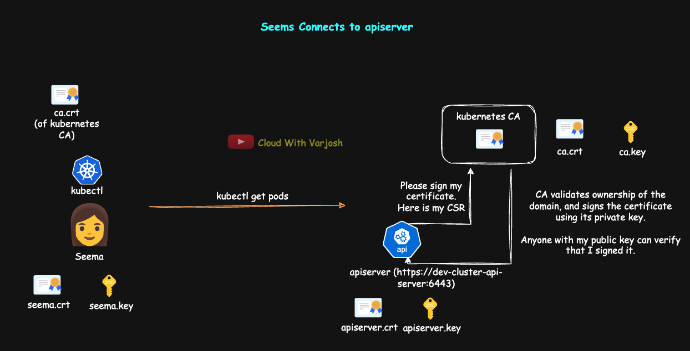

# Day 34: TLS in Kubernetes MASTERCLASS | PART 4 | CSR, External User Access to K8S Cluster | CKA 2025

## Video reference for Day 34 is the following:

[](https://www.youtube.com/watch?v=RZ9O5JJeq9k&ab_channel=CloudWithVarJosh)

---
## ⭐ Support the Project  
If this **repository** helps you, give it a ⭐ to show your support and help others discover it! 

---

### Pre-Requisites for Day 34

Before you dive into Day 34, make sure you have gone through the following days to get a better understanding:

1. **Day 7**: Kubernetes Architecture
   Understanding Kubernetes components and their roles will help you grasp when each component acts as a client or server.

   * **GitHub**: [Day 7 Repo](https://github.com/CloudWithVarJosh/CKA-Certification-Course-2025/tree/main/Day%2007)
   * **YouTube**: [Day 7 Video](https://www.youtube.com/watch?v=-9Cslu8PTjU&ab_channel=CloudWithVarJosh)

2. **Day 30**: How HTTPS & SSH Work, Encryption, and Its Types
   The concepts of encryption, as well as HTTPS and SSH mechanisms, will be essential in understanding security within Kubernetes.

   * **GitHub**: [Day 30 Repo](https://github.com/CloudWithVarJosh/CKA-Certification-Course-2025/tree/main/Day%2030)
   * **YouTube**: [Day 30 Video](https://www.youtube.com/watch?v=MkGPyJqCkB4&ab_channel=CloudWithVarJosh)

3. **Day 31**: TLS in Kubernetes MASTERCLASS | PART 1 | Mutual Auth (SSH), TLS 1.3, Types of CAs
   Start your journey into TLS by understanding client-server trust models, SSH mutual auth, 1-way TLS with TLS 1.3, and different types of Certificate Authorities.

   * **GitHub**: [Day 31 Repo](https://github.com/CloudWithVarJosh/CKA-Certification-Course-2025/tree/main/Day%2031)
   * **YouTube**: [Day 31 Video](https://www.youtube.com/watch?v=afQIvp5a0wM&ab_channel=CloudWithVarJosh)

4. **Day 32**: TLS in Kubernetes MASTERCLASS | PART 2 | mTLS, kubeconfig & Kubernetes Context
   Deep dive into mutual TLS (mTLS), the kubeconfig file structure, and how Kubernetes context enables managing multiple clusters and namespaces efficiently.

   * **GitHub**: [Day 32 Repo](https://github.com/CloudWithVarJosh/CKA-Certification-Course-2025/tree/main/Day%2032)
   * **YouTube**: [Day 32 Video](https://www.youtube.com/watch?v=VBlI0IG4ReI&ab_channel=CloudWithVarJosh)

5. **Day 33**: TLS in Kubernetes MASTERCLASS | PART 3 | Root CAs, TLS Auth Flow, mTLS in K8s Cluster
   Explore how Kubernetes components trust each other using certificates and how mTLS is implemented across control plane communication.

   * **GitHub**: [Day 33 Repo](https://github.com/CloudWithVarJosh/CKA-Certification-Course-2025/tree/main/Day%2033)
   * **YouTube**: [Day 33 Video](https://www.youtube.com/watch?v=rVFlVIs2gDU&ab_channel=CloudWithVarJosh)

---

## Introduction

In this lesson, we’ll walk through how to **grant access to a new user**—Seema—on a Kubernetes cluster.
You’ll learn how to use **certificates for authentication** and **RBAC for authorization**, giving users fine-grained and secure access to cluster resources. This is a hands-on example of real-world access provisioning in Kubernetes.

---

### **Granting Cluster Access to a New User (Seema) using Certificates and RBAC**



---

**Granting Cluster Access to a New User (Seema) using Certificates and RBAC**
To securely grant a new user like **Seema** access to a Kubernetes cluster, we follow a series of steps involving certificate-based authentication and Role-Based Access Control (RBAC). This ensures Seema can connect and interact with the cluster within a defined scope.

---

**Step 1: Seema Generates a Private Key**

```bash
openssl genrsa -out seema.key 2048
```

This generates a 2048-bit RSA **private key**, saved to `seema.key`. This key will be used to generate a certificate signing request (CSR) and later to authenticate to the Kubernetes cluster. It must remain **private and secure**.

---

**Step 2: Seema Generates a Certificate Signing Request (CSR)**

```bash
openssl req -new -key seema.key -out seema.csr -subj "/CN=seema"
```

Seema uses her private key to create a **CSR**. The `-subj "/CN=seema"` sets the **Common Name (CN)** to `seema`, which becomes her Kubernetes username. The generated CSR contains her public key and identity, and will be signed by a Kubernetes cluster admin.

---

**Step 3: Seema Shares the CSR with the Kubernetes Admin**

```bash
cat seema.csr | base64 | tr -d "\n"
```

The CSR must be **base64-encoded** to embed it into a Kubernetes object. This command converts the CSR into a single-line base64 string, stripping newlines with `tr -d "\n"`—a necessary step for YAML formatting.

---

**Step 4: Kubernetes Admin Creates the CSR Object in Kubernetes**

```yaml
apiVersion: certificates.k8s.io/v1
kind: CertificateSigningRequest
metadata:
  name: seema
spec:
  request: <BASE64_ENCODED_CSR>
  signerName: kubernetes.io/kube-apiserver-client
  expirationSeconds: 7776000
  usages:
  - client auth
```

The admin creates a Kubernetes `CertificateSigningRequest` object.

* `request` is the base64-encoded CSR.
* `signerName: kubernetes.io/kube-apiserver-client` instructs Kubernetes to treat this as a **client authentication** request.
* `usages` defines that this certificate will be used for **client authentication**, not server TLS or other use cases.
* `expirationSeconds` sets the certificate’s validity to **90 days** (7776000 seconds).

---

**Step 5: Kubernetes Admin Approves the CSR**

```bash
kubectl certificate approve seema
```

This command **approves and signs** the certificate request. Kubernetes issues a certificate for Seema, valid per the defined usage and expiration settings.

---

**Step 6: Admin Retrieves and Shares the Signed Certificate**

```bash
kubectl get csr seema -o jsonpath='{.status.certificate}' | base64 -d > seema.crt
```

The admin retrieves the **signed certificate** from the CSR’s status, decodes it from base64, and saves it as `seema.crt`. This certificate, along with `seema.key`, is sent back to Seema for kubeconfig configuration.

---

**Step 7: Seema Configures Her `kubeconfig` with Credentials and Cluster Info**

```bash
kubectl config set-credentials seema \
  --client-certificate=seema.crt \
  --client-key=seema.key \
  --certificate-authority=ca.crt \
  --embed-certs=true

kubectl config set-cluster kind-my-second-cluster \
  --server=https://127.0.0.1:59599 \
  --certificate-authority=ca.crt \
  --embed-certs=true \
  --kubeconfig=~/.kube/config

kubectl config set-context seema@kind-my-second-cluster-context \
  --cluster=kind-my-second-cluster \
  --user=seema \
  --namespace=default
```

These commands configure the **user credentials**, **cluster endpoint**, and **context** in Seema’s `kubeconfig`:

* The first command tells kubectl how to authenticate Seema using her certificate/key.
* The second registers the cluster endpoint using the correct CA.
* The third defines a context associating the user, cluster, and default namespace.

---

**Step 8: Admin Creates a Role and RoleBinding for Seema**

```yaml
kind: Role
apiVersion: rbac.authorization.k8s.io/v1
metadata:
  namespace: default
  name: seema-role
rules:
- apiGroups: [""]
  resources: ["pods"]
  verbs: ["get", "list", "delete"]
```

```bash
kubectl create rolebinding seema-binding \
  --role=seema-role \
  --user=seema \
  --namespace=default
```

The **Role** allows Seema to **get**, **list**, and **delete** pods in the `default` namespace.
The **RoleBinding** assigns this Role to Seema's username (`CN=seema`), authorizing her actions.

---

**Step 9: Admin Verifies Authorization with `can-i`**

```bash
kubectl auth can-i delete pods --namespace=default --as=seema
```

This command is run by the **admin** to simulate whether Seema is allowed to **delete pods** in the `default` namespace.

* `--as=seema` impersonates Seema’s user identity.
* This confirms that the **RBAC permissions** are set correctly before Seema starts using the cluster.

---

**Step 10: Seema Switches to Her Configured Context**

```bash
kubectl config use-context seema@kind-my-second-cluster-context
```

This sets Seema's **active context** to the one defined earlier, allowing `kubectl` to use her certificate and connect to the right cluster/namespace.

---

**Optional: Use REST API or Alternate `kubeconfig` Files**

```bash
curl https://<API-SERVER-IP>:<PORT>/api/v1/namespaces/default/pods \
  --cacert ca.crt --cert seema.crt --key seema.key
```

*Seema can authenticate with the cluster directly via API using her certificate.*

```bash
kubectl get pods --kubeconfig=myconfig.yaml
```

*She can manage multiple clusters by specifying alternate kubeconfig files.*

---

**Step 11: Check Certificate Expiry**

```bash
openssl x509 -noout -dates -in seema.crt
```

This displays the `notBefore` and `notAfter` dates for the certificate, helping Seema monitor its expiration.

---

### **Conclusion**

We’ve just completed a full, practical flow to securely grant a user access to a Kubernetes cluster:
from generating keys and certificates, to configuring kubeconfig, and finally applying RBAC permissions.
This knowledge is foundational for any admin responsible for managing access in production clusters.

---

### References

* [Kubernetes: Authenticating](https://kubernetes.io/docs/reference/access-authn-authz/authentication/)
* [Kubernetes: Using RBAC Authorization](https://kubernetes.io/docs/reference/access-authn-authz/rbac/)
* [CertificateSigningRequest API](https://kubernetes.io/docs/reference/kubernetes-api/authentication-resources/certificate-signing-request-v1/)

---
