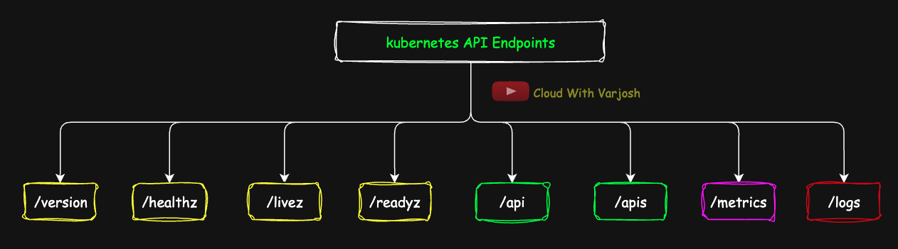
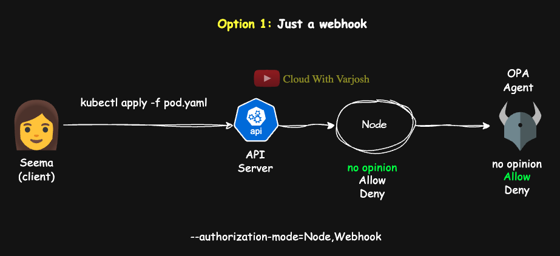
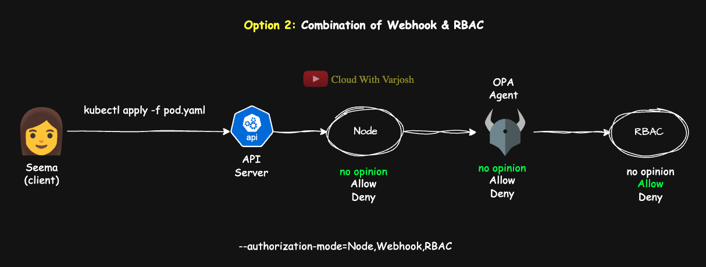

# Day 35: MASTER Kubernetes Authorization Modes and Kubernetes API | CKA Course 2025

## Video reference for Day 35 is the following:

[](https://www.youtube.com/watch?v=DkKc3RCW2BE&ab_channel=CloudWithVarJosh)


---
## ⭐ Support the Project  
If this **repository** helps you, give it a ⭐ to show your support and help others discover it! 

---

## Table of Contents
* [Introduction](#introduction)
* [Kubernetes API: The Engine Behind Everything](#kubernetes-api-the-engine-behind-everything)
* [API Groups: Organizing the Kubernetes API](#api-groups-organizing-the-kubernetes-api)
* [Authorization in Kubernetes](#authorization-in-kubernetes)
* [Types of Authorization Modes in Kubernetes](#types-of-authorization-modes-in-kubernetes)
    * [1. RBAC (Role-Based Access Control)](#1-rbac-role-based-access-control)
    * [2. ABAC (Attribute-Based Access Control)](#2-abac-attribute-based-access-control)
    * [3. Webhook Authorization](#3-webhook-authorization)
    * [4. Node Authorization](#4-node-authorization)
    * [5. AlwaysAllow / AlwaysDeny Authorization Modes](#5-alwaysallow--alwaysdeny-authorization-modes)
* [How to Check and Change the Authorization Mode in Kubernetes](#how-to-check-and-change-the-authorization-mode-in-kubernetes)
* [Combining RBAC and Webhook Authorization](#combining-rbac-and-webhook-authorization)
* [Authorization Flow: Node, RBAC & Webhook Combined](#authorization-flow-when-node-webhook-and-rbac-are-used-together)
    * [Scenario 1: Using Node + Webhook](#scenario-1-using-node--webhook)
    * [Scenario 2: Using Node + Webhook + RBAC](#scenario-2-using-node--webhook--rbac)
* [Conclusion](#conclusion)
* [References](#references)

---

## **Introduction**

Welcome to Day 35 of our CKA Course 2025! Today, we’ll take a close look at how you interact with a Kubernetes cluster through the **Kubernetes API** and how the cluster decides **who can do what** using its **authorization system**. The API server is the core component that processes all requests — from creating Pods to managing Deployments — so understanding how it works is key to managing your cluster effectively.

We’ll focus on the different **authorization modes** Kubernetes uses to control access, including the common **RBAC**, the more flexible **Webhook authorization**, and the specialized **Node authorization**. You’ll learn how these modes work individually, how they are set up, and how Kubernetes evaluates them step-by-step to make access decisions. By the end, you’ll have a clear picture of how the API server and authorization fit together, helping you secure and manage your clusters with confidence.

---

## **Kubernetes API: The Engine Behind Everything**

### **What Is the Kubernetes API?**

The **Kubernetes API** is the *primary interface* to your cluster. Whether you're creating a Pod, scaling a Deployment, or checking the status of a resource, you're interacting with this API.

It’s a **RESTful**, **resource-based interface** that exposes core Kubernetes objects like Pods, Services, Deployments, ConfigMaps, and more. These objects are accessible through structured URLs like `/api/v1` and `/apis/apps/v1`, and they respond to standard HTTP verbs like:

* **GET** – retrieve a resource
* **POST** – create a resource
* **PUT/PATCH** – update a resource
* **DELETE** – remove a resource

Anytime you use a tool like `kubectl`, it’s acting as a REST client that translates your CLI command into an API call.

Example:

```bash
kubectl get pods
```

translates to:

```http
GET /api/v1/namespaces/default/pods
```

This request is sent over **HTTPS**, authenticated using your **kubeconfig**, and authorized using cluster policies like **RBAC** or **Webhook authorization**.

---

**Kubernetes API vs. API Server**

Since the beginning of the course, we've said that the **API server is the central hub** of all Kubernetes communication — and that’s true. But it’s worth clarifying that the **Kubernetes API** is just **one part** of what the API server does.

The **Kubernetes API** refers specifically to the set of RESTful endpoints (like `/api`, `/apis`, `/healthz`, etc.) that expose cluster resources. It’s the interface used by internal components and external clients to read or modify the state of the cluster.

But the **API server itself** does much more than just serve API endpoints. It’s responsible for:

* **Authentication** (verifying who is making the request)
* **Authorization** (checking if the action is allowed)
* **Schema validation** (ensuring requests match expected formats)
* **Admission control** (enforcing cluster policies, which we’ll cover later)
* and much more..

So, in short:

> The **Kubernetes API is a logical interface** — the set of endpoints that represent your cluster's state.
> The **API server is the physical component** that hosts that API and applies all the control mechanisms around it.

This distinction helps frame the API server not just as a gateway to the cluster, but also as a **gatekeeper**, enforcing critical checks before anything gets stored in etcd.

---

### **Key Pointers**

To recap:

* The **Kubernetes API** is the **interface**, exposing your cluster's resources.
* The **API server** is the **component** that hosts this API and applies all access controls around it.
* Every request goes through a well-defined pipeline: **authentication → authorization → validation → execution**.
* Tools like `kubectl`, controllers, and even kubelets all communicate with your cluster through this same pathway.

Understanding this architecture gives you a clear mental model of how Kubernetes operates, enabling you to diagnose issues, secure your cluster, and build confidently atop its powerful API.

---

## **1. Kubernetes API Endpoints Overview**



At a high level, the API server serves multiple paths. Each path corresponds to a different kind of functionality:

| **Endpoint**                    | **Description**                                                                                                                                                             |
| ------------------------------- | --------------------------------------------------------------------------------------------------------------------------------------------------------------------------- |
| `/version`                      | Returns the version of the Kubernetes API server. **Unauthenticated and publicly accessible.**                                                                              |
| `/healthz`, `/livez`, `/readyz` | Health check endpoints for the **API server itself**, used by monitoring tools. `/livez` and `/readyz` are preferred in newer Kubernetes versions. **Unauthenticated and publicly accessible.** |
| `/api`                          | Root path for the **core API group** (`""` group), which includes legacy and foundational resources like Pods, Services, ConfigMaps, etc.                                   |
| `/apis`                         | Root path for all **named API groups** (e.g., `apps`, `rbac.authorization.k8s.io`, `networking.k8s.io`). Most modern resources live here.                                   |
| `/metrics`                      | Exposes **Prometheus-format** metrics that can be scraped by Prometheus or any monitoring system that supports the Prometheus exposition format. Prometheus.                                      |
| `/logs`                         | ❌ **Not a standalone API endpoint.** Accessing logs via `kubectl logs` invokes the `kubelet`’s `/containerLogs/` endpoint, not `/logs`. **`/logs`** is used by the API server to expose its own logs only when certain flags are enabled (e.g. --logtostderr=false, --log-dir)                                     |


### API Endpoints: Resource vs Non-Resource

The Kubernetes API is split across multiple **HTTPS endpoints**, each serving a different purpose:

* **Resource endpoints**
  These expose Kubernetes objects (Pods, Services, Deployments, etc.) and allow CRUD operations using standard HTTP verbs (GET, POST, PUT, DELETE).

  * `/api` → for **core group** resources (e.g., Pods, ConfigMaps, Services).
  * `/apis` → for **named group** resources (e.g., Deployments, Ingresses, Roles).

* **Non-resource endpoints**
  These do **not** expose Kubernetes objects but provide metadata or cluster-level utilities:

  * `/version` – Returns API server version.
  * `/healthz`, `/livez`, `/readyz` – Health check endpoints for the API server itself.
  * `/metrics` – Exposes API server metrics in **Prometheus format**.
  * `/logs` – Not a true API endpoint; `kubectl logs` reaches the kubelet, not the API server.


---

## API Groups: Organizing the Kubernetes API

Kubernetes organizes its API using **API groups**, enabling modular feature development and independent versioning. These are split into the **core group** and various **named groups**.

---

#### 1. **Core Group (`/api`)**

The **core group**—also called the legacy group—has no explicit group name and is served at `/api/v1`. It includes foundational objects essential to nearly every workload:

**Pods, Services, ConfigMaps, Secrets, Namespaces, PersistentVolumes (PVs), PersistentVolumeClaims (PVCs), ReplicationControllers**

When you use `apiVersion: v1` in a manifest, you're referencing this group.
Example: Pods can be listed via `/api/v1/pods`.

---

#### 2. **Named Groups (`/apis`)**

To prevent the core from becoming bloated, Kubernetes introduced **named API groups**, each representing a specific domain or extension. These are served at `/apis/GROUP/VERSION`.

Examples of named groups and associated resources:

* `apps/v1` → Deployments, StatefulSets, ReplicaSets
* `batch/v1` → Jobs, CronJobs
* `rbac.authorization.k8s.io/v1` → Roles, ClusterRoles, RoleBindings
* `autoscaling/v2` → HorizontalPodAutoscalers (HPA) with scaling policies
* `networking.k8s.io/v1` → Ingress, NetworkPolicies
* `policy/v1` → PodDisruptionBudgets, PodSecurityPolicies (deprecated)
* `certificates.k8s.io/v1` → CertificateSigningRequests (CSRs)
* `admissionregistration.k8s.io/v1` → ValidatingWebhookConfiguration, MutatingWebhookConfiguration
* `apiextensions.k8s.io/v1` → CustomResourceDefinitions (CRDs)
* `storage.k8s.io/v1` → StorageClasses, VolumeAttachments, CSI drivers

Each group version (like `apps/v1`) defines a versioned API surface. This ensures backward compatibility while allowing future versions to introduce breaking changes safely.


> You can find out which API group a resource belongs to by running:
>
> ```bash
> kubectl api-resources
> ```
>
> This command lists all resource types along with their associated **API group**, **namespaced scope**, and **short names**, helping you understand how Kubernetes organizes its resources.

---


### Why the Core Group Name Isn’t Shown in Manifests

When Kubernetes was first introduced, it had only one group of resources—what we now call the **core group**. These resources (like Pods, Services, and ConfigMaps) were served at the path `/api/v1`. Because there was only one group, manifests used a simple format:

```yaml
apiVersion: v1
```

As Kubernetes evolved, **named API groups** were introduced to support new features and better organize resources. These use a different URL pattern (`/apis/GROUP/VERSION`) and must include both the group and version in manifests, such as:

```yaml
apiVersion: apps/v1
```

To maintain **backward compatibility**, Kubernetes did **not modify the syntax** for the original core resources. That’s why:

* Resources in the **core group** still use `apiVersion: v1`, without a group name.
* Resources in **named groups** always specify both group and version, like `rbac.authorization.k8s.io/v1`.

> Technically, the core group **does have a name**—it’s an **empty string (`""`)**—but it's **not shown** in YAML files or API paths.

This historical decision keeps older manifests valid while supporting Kubernetes' growing ecosystem.

#### Why don’t we write `apiVersion: /api/v1` or `apiVersion: apis/networking.k8s.io/v1`?

Because the `apiVersion` field in YAML **does not mirror the full HTTP URL**. Instead, it just identifies the **group and version**:

* For **core group** resources, the group is an empty string `""`, so we write:

  ```yaml
  apiVersion: v1
  ```
* For **named group** resources like NetworkPolicy, we include both group and version:

  ```yaml
  apiVersion: networking.k8s.io/v1
  ```

This design separates manifest readability from URL structure while maintaining backward compatibility. The API server internally maps the `apiVersion` to the correct endpoint (`/api/v1` or `/apis/<group>/<version>`).

---

### Accessing Unauthenticated and Authenticated Kubernetes API Endpoints via `curl`

Kubernetes exposes some **unauthenticated endpoints** that can be accessed without authentication—mostly used for health checks and cluster metadata.

#### Unauthenticated Endpoints

These endpoints are useful for introspection and liveness/readiness probes:

* `/version` – Returns the API server version
* `/readyz` – Reports API server readiness
* `/livez` – Reports API server liveness
* `/healthz` – Legacy endpoint for health status

##### Steps to Access:

1. **Get your API server address**:

   ```bash
   kubectl config view --minify
   ```

2. **Try accessing the version endpoint directly**:

   ```bash
   curl https://127.0.0.1:53856/version
   ```

   This may fail with a TLS error because the API server presents a certificate signed by a cluster-specific CA your system does not trust.

3. **Skip certificate verification** (not recommended in production):

   ```bash
   curl -k https://127.0.0.1:53856/version
   ```

   You can use the same `-k` flag for:

   ```bash
   curl -k https://127.0.0.1:53856/readyz
   curl -k https://127.0.0.1:53856/livez
   curl -k https://127.0.0.1:53856/healthz
   ```

   If the API server is healthy, these endpoints return:

   ```
   ok
   ```

---

#### Authenticated API Access Using curl

To access secure endpoints like `/api` or `/apis`, you must authenticate using the certificates provided in your kubeconfig. Here's how you can do it using `curl`:

```bash
curl https://127.0.0.1:53856/api \                   # API server endpoint
  --cert client.crt \                                # Your client certificate
  --key client.key \                                 # Your client private key
  --cacert ca.crt                                    # The CA that signed the API server’s certificate
```

> ⚠️ Make sure these certificate files are properly extracted from your kubeconfig and **base64 decoded** before use.

Do the same for:

* `client.key` (if embedded in kubeconfig, decode and dump)
* `ca.crt` (you can also extract it from the `certificate-authority-data` field)

---


#### Note on Bearer Tokens

Instead of using certificates, you can also authenticate using **bearer tokens**—these are commonly issued to service accounts or users. We’ll cover bearer token authentication later in this course.


---

## **Using `kubectl proxy` to Simplify API Access**

If managing TLS and tokens feels tedious (it is), Kubernetes provides a more convenient method: the `kubectl proxy` command.

### What `kubectl proxy` Does

* It starts a **local HTTP proxy server** on your machine.
* You can then make **HTTP requests** to `http://127.0.0.1:8001/...`, and `kubectl proxy` will:

  * Automatically authenticate you using your kubeconfig
  * Forward the request securely to the actual Kubernetes API server over HTTPS

So you don’t need to deal with tokens or certificates manually.

> Even though you access the local proxy via plain HTTP (`localhost:8001`), the proxy itself communicates with the API server over **secure HTTPS**, as it’s sending potentially sensitive information and managing cluster resources.

---

### Example: Accessing the API via the Proxy

Start the proxy (in a dedicated terminal):

```bash
kubectl proxy
# Outputs: Starting to serve on 127.0.0.1:8001
```

In another terminal, send a request:

```bash
curl http://127.0.0.1:8001/api/v1/namespaces/default/pods
```

This will list the Pods in the `default` namespace—**no manual authentication required**.

---

## **Bonus: Understanding API Paths**

The Kubernetes API is **RESTful and resource-based**. It uses standard HTTP verbs like `GET`, `POST`, `PUT`, `DELETE`, etc.

The general structure is:

```
/<root>/<group>/<version>/namespaces/<namespace>/<resourceType>/<name>
```

Examples:

* `GET /api/v1/namespaces/default/pods` – List Pods (core group)
* `POST /apis/apps/v1/namespaces/prod/deployments` – Create a Deployment (apps group)
* `GET /apis/rbac.authorization.k8s.io/v1/clusterroles/admin` – Get a ClusterRole (non-namespaced)

---

### **Key Points:**

* The Kubernetes API is RESTful, structured by resource type, and serves both human and machine clients.
* `/api` is for core group resources (pods, services), `/apis` is for named group resources (deployments, jobs).
* API groups help manage evolution and ownership of functionality.
* `apiVersion` in YAML manifests maps directly to these groups and versions.
* Use `kubectl`, `curl`, or client libraries to interact with the API.
* The API is extensible using CRDs or aggregated services. CRDs & extensibility to be discussed later in this course.

---

## **Authorization in Kubernetes**

* **Authentication** verifies *who* you are.
* **Authorization** determines *what* you are allowed to do.

Once a user, group or service account (SA) is **authenticated**, Kubernetes must determine **whether** that identity is **allowed to perform the requested action**. This process is called **authorization**.

Authorization answers questions like:

* Can this user **read** pods in the `default` namespace?
* Is this service account allowed to **delete** a deployment in `production`?
* Can this user create **roles** at the cluster level?

Authorization decisions consider not only the **user** but also the **groups** they belong to. In Kubernetes, a user or service account can be a member of one or more **groups**, and permissions may be granted based on either the individual identity or their group membership.

> You’ll learn more about **Service Accounts** and how they interact with authorization in an upcoming lecture of this course.

---

## **High-Level Flow of Authorization**

When a request reaches the API server:

1. **Authentication**: Who are you?
2. **Authorization**: Are you allowed to do what you're asking?
3. **Admission Control**: Should this request be allowed under current policies and configurations? This will be covered in upcoming lectures.

If **authorization** fails, the request is rejected with a `403 Forbidden`.

---

## **Authorization is Context-Aware**

A typical Kubernetes authorization decision considers:

* **User identity** (from authentication)
* **Requested verb** (`get`, `create`, `delete`, `patch`, etc.)
* **Resource type** (`pods`, `deployments`, `services`, etc.)
* **Resource name** (optional)
* **Namespace** (if namespaced)
* **API group**
* **Non-resource URLs** (for endpoints like `/metrics`, `/healthz`)

---

## **Types of Authorization Modes in Kubernetes**

Kubernetes supports **multiple pluggable authorizers**, which are evaluated in order. The first one to make a definitive decision (allow/deny) halts the chain.

Here are the most common ones:

---

### 1. **RBAC (Role-Based Access Control)**

RBAC is the **most widely used** authorization mode in Kubernetes, especially in production environments.

It works by defining **who** (user, group, or service account) can perform **what actions** on **which resources**.

You're absolutely right — that's an important and often overlooked nuance in RBAC.


#### **Key Concepts**

* **Roles**: Define a set of permissions within a **namespace**.
* **RoleBindings**: Associate a **Role *or* ClusterRole** with specific **users**, **groups**, or **service accounts** **within that namespace**.
* **ClusterRoles**: Like roles, but define permissions that can apply **cluster-wide** or be reused across **multiple namespaces**.
* **ClusterRoleBindings**: Bind a **ClusterRole** to **users**, **groups**, or **service accounts** at the **cluster level**, granting access across the entire cluster.

> **Note:** A `RoleBinding` can reference a `ClusterRole`, allowing you to **reuse cluster-defined permissions** in a **specific namespace**. The `ClusterRole`'s rules will only apply **within the namespace** where the `RoleBinding` exists.

---

#### **Example: Give Seema read-only access to Pods in the `default` namespace**

```yaml
# Role: Grants read-only access to Pods in the 'default' namespace
apiVersion: rbac.authorization.k8s.io/v1  # API group for RBAC resources (a named group served under /apis)
kind: Role                                # Namespaced RBAC object that defines permissions
metadata:
  name: pod-reader                        # Name of the Role
  namespace: default                      # Scope: only applies to this namespace
rules:
- apiGroups: [""]                         # Core API group (pods live at /api/v1, so the group is "")
  resources: ["pods"]                     # Type of resource this rule applies to
  verbs: ["get", "watch", "list"]         # Allowed HTTP verbs → maps to API actions like:
                                          # GET /api/v1/namespaces/default/pods
```

```yaml
# Bind the Role to user Seema
# RoleBinding: Assigns the 'pod-reader' Role to user Seema
apiVersion: rbac.authorization.k8s.io/v1  # Same RBAC API group
kind: RoleBinding                         # Binds a Role to a subject (user/group/SA) within the namespace
metadata:
  name: read-pods-binding
  namespace: default                      # RoleBinding is also namespaced; must match the Role's namespace
subjects:
- kind: User                              # Type of subject: User (could also be Group or ServiceAccount)
  name: seema                             # Username (must match what's presented at authentication)
  apiGroup: rbac.authorization.k8s.io     # Required field for all subjects except ServiceAccounts
roleRef:
  kind: Role                              # We're binding a Role (not a ClusterRole)
  name: pod-reader                        # Name of the Role to bind
  apiGroup: rbac.authorization.k8s.io     # The group where the Role is defined
```

> This setup ensures that **Seema** can only **view pods** in the **default** namespace — she cannot delete or modify them.


---


### 2. **ABAC (Attribute-Based Access Control)**

ABAC authorizes requests based on a set of **attribute-based rules** defined in a **JSON policy file**. It evaluates access based on attributes such as the user, verb, resource type, and namespace.

**Key Concepts:**

* Policies are defined in a static **JSON file**.
* Each rule explicitly describes **who** can do **what** on **which resource**, similar in concept to RBAC but with no roles or bindings.
* Rules are flat—there’s no hierarchy or grouping.
* **Any change** (addition, modification, or deletion) in the JSON file **requires the API server to be restarted** for the changes to take effect.
* Considered **deprecated** and **not suitable** for production environments.

**Example ABAC Policy File (`abac-policy.json`):**

```json
[
  {
    "apiVersion": "abac.authorization.kubernetes.io/v1beta1",
    "kind": "Policy",
    "spec": {
      "user": "seema",
      "namespace": "default",
      "resource": "pods",
      "verb": "get"
    }
  },
  {
    "apiVersion": "abac.authorization.kubernetes.io/v1beta1",
    "kind": "Policy",
    "spec": {
      "user": "seema",
      "namespace": "default",
      "resource": "pods",
      "verb": "list"
    }
  }
]
```

This allows user `seema` to `get` and `list` Pods in the `default` namespace.

**To enable ABAC:**

Start the API server with:

```bash
kube-apiserver \
  --authorization-mode=ABAC \
  --authorization-policy-file=/etc/kubernetes/abac-policy.json
```

> 🔴 **Note:** Any change to the JSON file requires an API server restart for the updated rules to take effect.


**Note:** ABAC is mainly useful for historical context or academic purposes. **RBAC is the recommended and actively supported authorization mode in Kubernetes today.**


---

### 3. **Webhook Authorization**

With **webhooks**, you essentially **outsource the authorization decision** from the Kubernetes API server to an **external service**. This external service receives each request’s details and decides whether to **allow or deny** it.

The API server sends a **JSON payload** describing the request (user, action, resource, namespace, etc.) to the external endpoint. The endpoint evaluates the request and responds with a decision.

**Common tools used with Webhook authorization:**

* **OPA (Open Policy Agent)** – General-purpose policy engine
* **Gatekeeper** – Kubernetes-native policy enforcement using OPA + CRDs
* **Kyverno** – Policy engine built specifically for Kubernetes
* **Custom in-house authorization services** – For organizations with unique compliance or audit needs

---

#### **Why Use Webhooks?**

Webhook authorization is valuable when:

* You need **fine-grained control** over access decisions that go beyond what RBAC allows
* Policies depend on **dynamic attributes**, such as labels, annotations, request time, or even external systems
* You want to enforce **business-specific rules**, such as:

  * “Only the security team can delete Pods in `production`”
  * “Developers can only scale Deployments within 2–5 replicas”
  * “CI/CD pipelines can only deploy images signed by our internal registry”

> **Note:** You must configure the API server with the `--authorization-mode=Webhook` flag and provide a `--authorization-webhook-config-file` that defines the endpoint and connection details.

> Webhook authorization offers **maximum flexibility** but adds **external dependencies** and potential latency. It's typically used in **large, security-conscious environments** with strict compliance requirements.

> *Note:* Kubernetes also supports **validating** and **mutating** admission webhooks, which are different mechanisms used during object creation or update for enforcing policies or making changes. These will be covered later in the course when discussing **admission controllers**.
---

### 4. **Node Authorization**

**Purpose:**
Node Authorization is a specialized authorization mode built into the Kubernetes API server to **restrict what kubelets (the node agents) can do**. It ensures that each kubelet can only access or modify resources that are specifically related to the node it runs on.

**How It Works:**
In our TLS lecture (Part 3), we saw that each kubelet authenticates itself to the API server using a **bootstrap token** or client certificates. However, authentication only verifies identity — it doesn’t define permissions. That’s where Node Authorization applies.

Node Authorization enforces that the kubelet on, for example, **node1** can only:

* Read pod specs, Secrets, ConfigMaps, volume mounts, and other resources related to the pods **scheduled on node1**.
* Update status or metadata of these same node-specific resources.

It **cannot** access resources assigned to any other node, such as pods running on **node2**.

The API server uses the kubelet’s node identity (via its client certificate) to enforce these scoped permissions automatically.

**Why It Matters:**
This mode confines the kubelet’s privileges strictly to its own node’s workload, improving cluster security by:

* Preventing accidental or malicious access to other nodes’ pods or secrets.
* Minimizing the potential impact if a node or kubelet is compromised.

**Activation and Usage:**
Node Authorization is **enabled automatically by the API server** for kubelet requests and does not require any manual configuration of Roles or RoleBindings.

---

### Key Points:

| Step                   | Explanation                                            |
| ---------------------- | ------------------------------------------------------ |
| **Bootstrap token**    | Kubelet authenticates to the API server                |
| **Node Authorization** | Kubelet can only read or modify resources for its node |

This built-in authorization method ensures secure, node-scoped access control, keeping each node’s workload isolated in terms of API permissions.

---


### 5. **AlwaysAllow / AlwaysDeny Authorization Modes**

These two modes represent the simplest forms of authorization in Kubernetes:

#### **AlwaysAllow**

* **What it does:**
  This mode permits **every request** to the Kubernetes API server, regardless of the user’s identity or the action being requested. Essentially, it **bypasses all authorization checks** and allows all actions.

* **Use-case:**

  * Primarily used for **development, testing, or troubleshooting** purposes where you want to eliminate authorization as a variable.
  * Helpful in initial cluster setup or quick demos when security is not a concern.
  * Not suitable for any environment where access control is required.

* **Limitations:**

  * Offers **no security** whatsoever.
  * Anyone with access to the API can perform any action, including destructive ones.

#### **AlwaysDeny**

* **What it does:**
  This mode **denies every request** to the API server, regardless of user or action. No request will succeed.

* **Use-case:**

  * Mostly useful for **testing failure scenarios** or verifying behavior when authorization fails.
  * Can be used temporarily to **lock down the API** during certain critical maintenance windows.
  * Rarely used in practice because it completely blocks all API access.

* **Limitations:**

  * Effectively **locks out all users and processes**, including administrators.
  * Requires direct intervention (e.g., API server restart with different flags) to revert.

**Summary and Practical Advice**

* Both **AlwaysAllow** and **AlwaysDeny** are **extreme, binary modes** intended only for special cases like testing, demos, or emergency lockdown.
* In **real production clusters**, you should use more granular authorization modes like **RBAC** or **Webhook Authorization**.
* These modes can be enabled or disabled by setting the `--authorization-mode` flag on the Kubernetes API server (e.g., `--authorization-mode=AlwaysAllow`).

---

## **How to Check and Change the Authorization Mode in Kubernetes**

### 1. Authorization Happens in the API Server

As we know, **the Kubernetes API server is responsible for both authentication and authorization**. While authentication confirms the identity of the user or service, authorization decides whether that identity is allowed to perform a requested action.

* When **webhook authorization** is used, the API server outsources part of the authorization decision to an external service.
* Regardless, the **authorization mode(s) are defined and configured in the API server itself**.

---

### 2. Where to Find the API Server Configuration

* On **most Kubernetes clusters created with kubeadm, KIND (which uses kubeadm under the hood), or minikube**, the control plane components (including the API server) run as **static pods** managed by the kubelet. This ensures consistent and resilient management. While **kops** can also run components as static pods, it may use alternatives like systemd units depending on the setup.


* The static pod manifests are typically located in:

  ```
  /etc/kubernetes/manifests/kube-apiserver.yaml
  ```

* You can **inspect this file to check the API server command line flags**, including `--authorization-mode`.

> **Note:**
> Managed Kubernetes services like **EKS, AKS, and GKE** **abstract away the control plane from users**. You don’t have access to the control plane nodes or the configuration of components like the API server. This means you cannot directly view or modify the authorization modes—they are fully managed by the provider.

---

### 3. Multiple Authorization Modes Can Be Used Together

* The API server supports specifying **multiple authorization modes at once**, separated by commas.
* The modes are **evaluated sequentially** in the order they are listed.
* As soon as one mode **allows or denies** the request, the evaluation stops — later modes are **not evaluated**.

---

#### How Authorization Modes Work Together

When Kubernetes is configured with multiple authorization modes, such as:

```yaml
--authorization-mode=Node,RBAC,Webhook
```

the API server evaluates them **in the order specified**.

---

#### Core Decision Logic

Each authorization mode can respond in **one of three ways**:

| Decision       | Meaning                                                            |
| -------------- | ------------------------------------------------------------------ |
| **Allow**      | The request is **authorized** — no further checks are performed    |
| **Deny**       | The request is **denied** — no further checks are performed        |
| **No Opinion** | The mode doesn't apply — evaluation continues to the **next mode** |

> 🚨 The **first definitive answer** (either "allow" or "deny") stops the evaluation process.

---

#### Example Flow: User Seema Sends a Request

Suppose a user named **Seema** tries to perform an action and Kubernetes is running:

```yaml
--authorization-mode=Node,RBAC,Webhook
```

Here's how her request is processed:

1. **Node Authorization**

   * Designed for kubelet requests.
   * Likely returns **“no opinion”** for Seema.
     → Evaluation moves to RBAC.

2. **RBAC Authorization**

   * If Seema has the necessary permissions: returns **"allow"** → request is authorized.
   * If explicitly blocked: returns **"deny"** → request is denied.
   * If irrelevant: returns **"no opinion"** → evaluation moves to Webhook.

3. **Webhook Authorization**

   * Called **only if both Node and RBAC returned "no opinion"**.
   * Delegates the final decision to an external system.

---

### 4. How to Change Authorization Modes

* To **change the authorization mode**, you edit the API server manifest (`/etc/kubernetes/manifests/kube-apiserver.yaml`) and modify the `--authorization-mode` flag.
* After saving changes, because this is a static pod, **the kubelet automatically restarts the API server with the new configuration**.
* Remember, **changing authorization modes affects cluster security**, so only modify this if you understand the implications.

---

### 5. **Special Authorization Modes: AlwaysAllow and AlwaysDeny**

* Kubernetes also supports **`AlwaysAllow`** and **`AlwaysDeny`** as simple authorization modes.
* These are **primarily used for testing, development, or troubleshooting**.
* **`AlwaysAllow`** grants all requests without any checks.
* **`AlwaysDeny`** rejects all requests outright.
* **Not recommended for production environments** due to obvious security risks.
* You might occasionally see these modes listed in `--authorization-mode` during local test clusters or demos.
* Like other modes, they can be combined in a list of modes, but be cautious as `AlwaysAllow` will effectively bypass other checks.

---

### Key Points:

| Step                   | What to do                                                                                   |
| ---------------------- | -------------------------------------------------------------------------------------------- |
| Find API server config | Check `/etc/kubernetes/manifests/kube-apiserver.yaml` on control plane nodes (if accessible) |
| Identify auth modes    | Look for `--authorization-mode` flag in the API server manifest                              |
| Understand mode order  | Modes evaluated in sequence, first decisive allow/deny stops further checks                  |
| Modify modes           | Edit manifest file, save, and let kubelet restart the API server                             |
| Managed services note  | Authorization mode config hidden in managed services like EKS, AKS, GKE                      |

---

### **Combining RBAC and Webhook Authorization**

**RBAC** is great for defining **what actions** a user, group or service account can perform—such as allowing Seema to create Pods. However, it cannot enforce **how** those actions are performed.

For example:
Seema is allowed to create Pods (**RBAC**), but **only if** the container image comes from `registry.pinkcompany.com`.
RBAC can’t enforce this kind of condition because it doesn't inspect the request content, like the Pod spec.

This is where **Webhook authorization** becomes essential. A **Webhook authorizer** lets the API server **delegate fine-grained, context-aware decisions** to an external service. It can inspect the **full request**, including the object spec, and enforce **custom policies**—like verifying image sources, naming patterns, or requiring external approvals.

Technically, this scenario **can be handled using just a Webhook**:
When Seema attempts to create a Pod, the API server sends the request to the Webhook. The Webhook inspects the request and either returns `allow` or `deny`. In this setup, the Webhook performs **both authorization and policy enforcement**.

However, in production environments, it’s **common to combine RBAC and Webhook**:

* **RBAC acts as the first gate**, granting access based on roles and permissions.
* **Webhook provides a second layer**, enforcing rules RBAC can’t express—like conditional logic or external validations.

This layered approach keeps **RBAC rules simple and maintainable**, while offloading complex or evolving policies to the Webhook.

> 🔹 **Order matters**
> When multiple authorization modes are configured, the API server evaluates them **in order**. The first mode to return `allow` or `deny` **ends the evaluation**.
>
> To ensure the Webhook always gets a chance to evaluate the request first, configure the API server like this:

```bash
--authorization-mode=Webhook,RBAC
```

This guarantees:

* **Webhook evaluates every request first**.
* If it returns `"no opinion"`, the request **falls through to RBAC** for standard permission checks.

---

## Authorization Flow When Node, Webhook Authorizer, and RBAC Are Used Together

**Requirements:**

* Seema must have **permission** to create Pods.
* The Pod's image must come from **`registry.pinkcompany.com`**.

---

### Clarification: OPA Can Be Used in Two Ways

**OPA** (Open Policy Agent) can integrate with Kubernetes in two different roles:

1. **Webhook Authorizer** – Participates in the **authorization phase**. It can allow or deny requests based on **request metadata only** like user, verb, namespace — **just like RBAC**, but with more flexibility:

   * **Time-aware access**: Deny deletes during business hours
   * **Network-aware access**: Allow requests only from specific CIDRs
   * **Custom identity checks**: Integrate with external systems (HR, LDAP)

   > It cannot see the Pod spec or image field.

2. **Admission Controller (Validating Webhook)** – Participates in the **admission phase**, where it can inspect and validate the **full object** like container images, labels, security settings, etc.

✅ The image registry validation (e.g., checking for `registry.pinkcompany.com`) is performed by OPA acting as a **Validating Admission Controller**, not as a Webhook Authorizer.

We’ll cover custom admission controllers in **Day 38** in more depth.

---

### Scenario 1: Using Node + Webhook Authorizer Only



API server configuration:

```bash
--authorization-mode=Node,Webhook
```

#### 🔁 Flow (Seema creates a Pod):

1. Seema sends a request to create a Pod.

2. **Node Authorizer** is checked first.

   * Since it's not a kubelet-originated request, Node returns **"no opinion"**.

3. The **Webhook Authorizer** (OPA) is evaluated.

   * It checks Seema’s identity and request metadata.

   * It may enforce policies like:

     * "Only allow requests during off-hours"
     * "Allow only users in the `devs` group"

   * **It cannot** inspect the Pod spec to check image source.

4. If Webhook returns:

   * ✅ `allow` → request proceeds to **admission phase**
   * ❌ `deny` → request is rejected

5. If allowed, **OPA (as Admission Controller)** then validates:

   * Is the Pod image from `registry.pinkcompany.com`?
   * If yes → ✅ request proceeds
   * If not → ❌ request is rejected

> 🔄 OPA is used in **both phases**, but for different purposes:
>
> * **Authorization**: Checks user-level access (via webhook authorizer)
> * **Admission**: Enforces deep policy (via admission controller)

---

### Scenario 2: Node + Webhook + RBAC (Layered)



API server configuration:

```bash
--authorization-mode=Node,Webhook,RBAC
```

#### 🧭 Roles of Each Mode

| Mode    | Role                                                 |
| ------- | ---------------------------------------------------- |
| Node    | Handles kubelet-only requests                        |
| Webhook | Custom logic based on request metadata               |
| RBAC    | Standard user/group/serviceaccount permission checks |

OPA runs as:

* **Webhook Authorizer** → for request-based policies (time, group, network)
* **Admission Controller** → for object-based policies (image, labels, etc.)

#### 🔁 Flow:

1. Seema sends a request to create a Pod.
2. **Node Authorizer** returns `"no opinion"` (not a kubelet request).
3. **Webhook Authorizer** (OPA):

   * Checks time-based or identity policies.
   * If all good → returns `"no opinion"` → continue.
   * If policy violated → returns `"deny"` → request blocked.
4. **RBAC Authorizer**:

   * Checks if Seema has permission to create Pods.
   * If not → ❌ rejected.
   * If yes → ✅ passed to **admission phase**.
5. **OPA Admission Controller** now inspects the Pod:

   * It checks: is the image from `registry.pinkcompany.com`?
   * If yes → Pod is admitted.
   * If not → request is denied.

---

### ✅ Summary Table

| Phase         | Who Handles It                | What Is Checked                                          |
| ------------- | ----------------------------- | -------------------------------------------------------- |
| Authorization | Node / Webhook / RBAC         | Request metadata (user, verb, resource, group, etc.)     |
| Admission     | OPA (as admission controller) | Full object spec (e.g., Pod images, labels, annotations) |

> 💡 In production, this layered approach allows Kubernetes to:
>
> * Use **RBAC** for basic permissions.
> * Use **OPA webhook authorizer** for request-level logic.
> * Use **OPA admission controller** for deep object inspection (like image validation).

---

## **Conclusion**

Today, we explored the **Kubernetes API** as the core RESTful engine driving every action in your cluster. We covered its key **endpoints**, the difference between **core and named API groups**, and how `kubectl` translates your commands into secure API calls. You also learned how the `apiVersion` in manifests ties directly to these API groups, and that some endpoints remain open for essential health checks even without authentication.

Most importantly, we clarified **Kubernetes authorization**: after authentication confirms *who you are*, authorization decides *what you’re allowed to do*—taking into account the user, action, and resources involved. We examined the main **authorization modes**—from the widely used **RBAC**, to **ABAC**, **Webhook**, **Node authorization**, and the basic **AlwaysAllow/AlwaysDeny** modes. A crucial insight is how Kubernetes evaluates these modes **in order**, stopping at the first definitive “allow” or “deny” decision, which makes the order set in `--authorization-mode` critical for your cluster’s security.

With this foundational understanding of the API and layered authorization, you’re now well-prepared to troubleshoot access issues, design effective policies, and confidently manage secure Kubernetes environments—essential skills for any Kubernetes administrator.


---

## **References**

* **Kubernetes Documentation:** [https://kubernetes.io/docs/](https://kubernetes.io/docs/)
    * [Kubernetes API Concepts](https://kubernetes.io/docs/concepts/overview/kubernetes-api/)
    * [Authorization Overview](https://kubernetes.io/docs/reference/access-authn-authz/authorization/)
    * [Using RBAC Authorization](https://kubernetes.io/docs/reference/access-authn-authz/rbac/)
    * [Node Authorization](https://kubernetes.io/docs/reference/access-authn-authz/node/)
    * [Webhook Mode](https://kubernetes.io/docs/reference/access-authn-authz/webhook/)
    * [ABAC Mode](https://kubernetes.io/docs/reference/access-authn-authz/abac/)