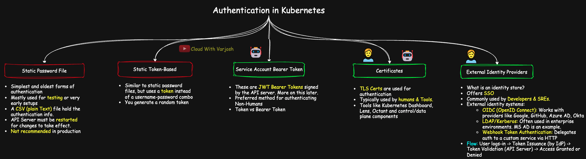
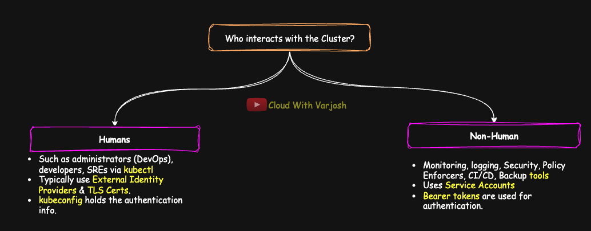
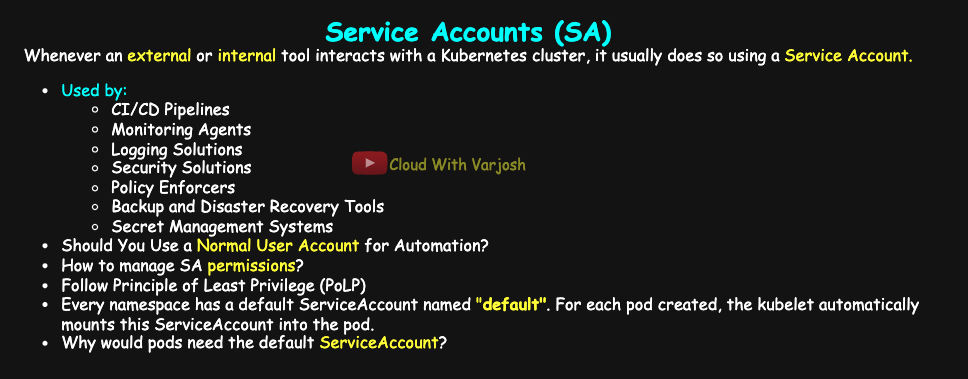
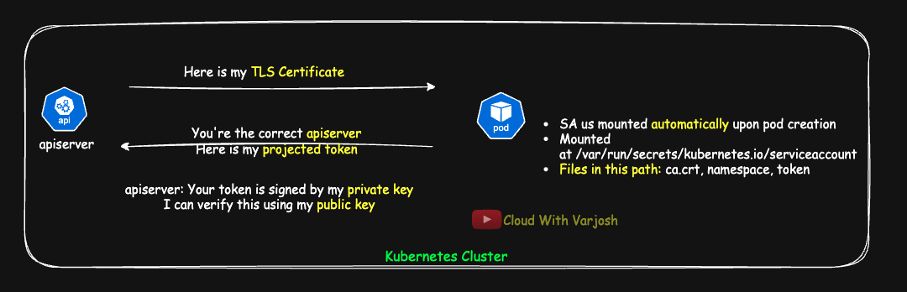
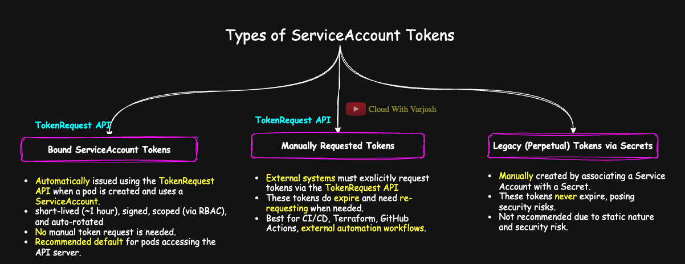
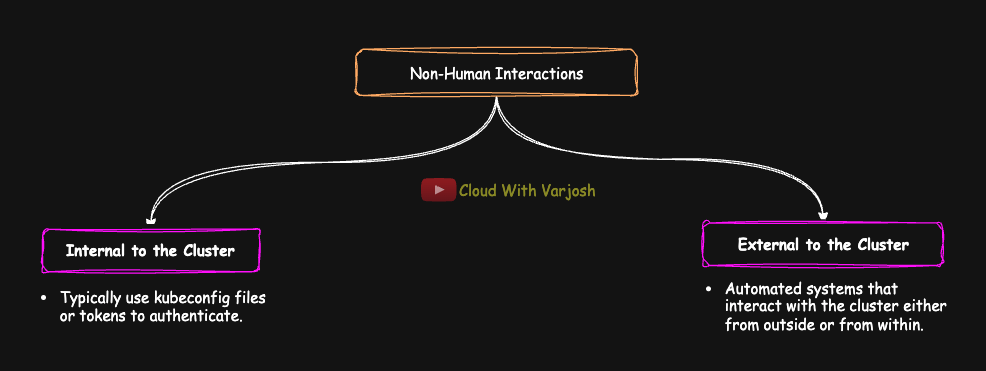
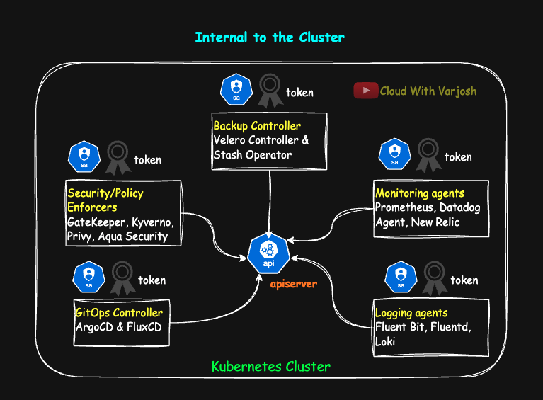
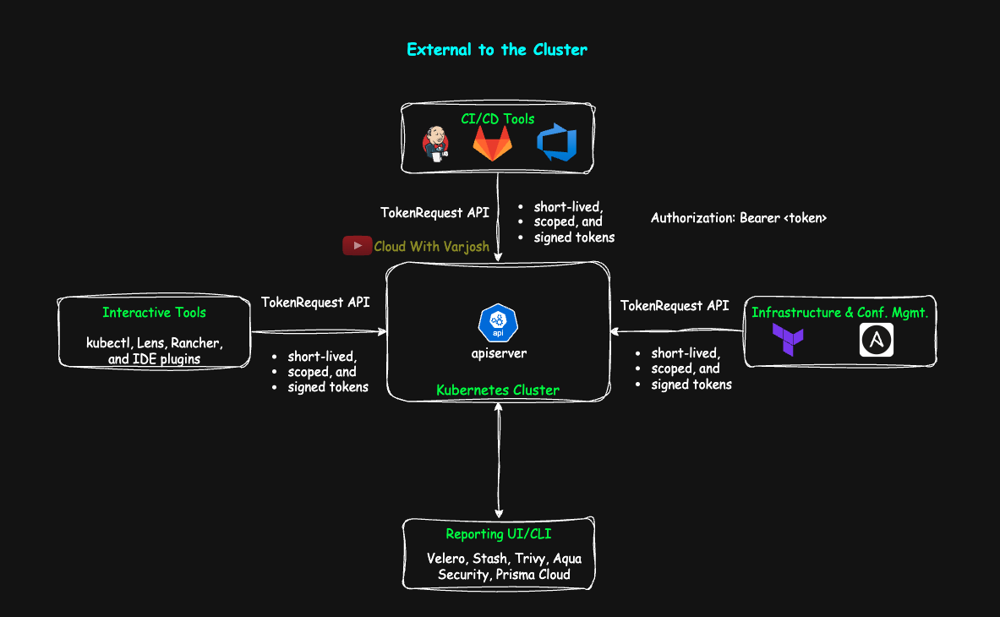

# Day 37: MASTER Kubernetes Service Accounts & Authentication | CKA Course 2025

## Video reference for Day 37 is the following:

[](https://www.youtube.com/watch?v=WsQT7y5C-qU&ab_channel=CloudWithVarJosh)


---
## ⭐ Support the Project  
If this **repository** helps you, give it a ⭐ to show your support and help others discover it! 

---

## **Table of Contents**  

- [Introduction](#introduction)  
- [Authentication in Kubernetes](#authentication-in-kubernetes)  
  - [1. Static Password File (Basic Auth)](#1-static-password-file-basic-auth)  
  - [2. Token-Based Authentication](#2-token-based-authentication)  
    - [a) Static Token File](#a-static-token-file)  
    - [b) Service Account Tokens](#b-service-account-tokens)  
  - [3. Certificates (Client TLS)](#3-certificates-client-tls)  
  - [4. External Identity Providers](#4-external-identity-providers)  
- [Understanding Who Interacts with a Kubernetes Cluster](#understanding-who-interacts-with-a-kubernetes-cluster)  
- [Service Accounts in Kubernetes](#service-accounts-in-kubernetes)  
  - [Why Are Service Accounts Necessary?](#why-are-service-accounts-necessary)  
  - [How Do ServiceAccounts Authenticate with the Cluster?](#how-do-serviceaccounts-authenticate-with-the-cluster)  
  - [How a Pod Authenticates with the API Server Using a ServiceAccount](#how-a-pod-authenticates-with-the-api-server-using-a-serviceaccount)  
- [Types of ServiceAccount Tokens in Kubernetes](#types-of-serviceaccount-tokens-in-kubernetes)  
  - [1. Bound ServiceAccount Tokens (Projected Tokens via TokenRequest API)](#1-bound-serviceaccount-tokens-projected-tokens-via-tokenrequest-api)  
  - [2. Manually Requested Tokens (TokenRequest API for external tools)](#2-manually-requested-tokens-tokenrequest-api-for-external-tools)  
  - [3. Legacy (Perpetual) Tokens via Secrets](#3-legacy-perpetual-tokens-via-secrets)   
- [Non-Human Access to Kubernetes: A Detailed Breakdown](#non-human-access-to-kubernetes-a-detailed-breakdown)  
  - [Internal to the Cluster](#internal-to-the-cluster)  
  - [External to the Cluster](#external-to-the-cluster)    
- [Demo Steps: ServiceAccount Creation](#demo-creating-and-using-a-serviceaccount-for-jenkins)  
  - [Step 1: Create a Service Account for Jenkins](#step-1-create-a-service-account-for-jenkins)  
  - [Step 2: Generate a Manual Long-Lived Token (Deprecated Approach)](#step-2-generate-a-manual-long-lived-token-deprecated-approach)  
  - [Step 3: Jenkins Requests a Token Using the TokenRequest API (Recommended Approach)](#step-3-jenkins-requests-a-token-using-the-tokenrequest-api-recommended-approach)  
  - [Step 4: Jenkins Uses the Token to Authenticate](#step-4-jenkins-uses-the-token-to-authenticate)  
- [Conclusion](#conclusion)  
- [References](#references)  

---

## Introduction

Day 37 delves into the **critical security aspects of Kubernetes**, specifically focusing on how entities, both human and non-human, authenticate with the cluster. **Authentication is the fundamental first step in the security flow of a Kubernetes cluster**, ensuring that every request to the API server proves its identity before any action is authorized. We will explore various authentication methods supported by Kubernetes, ranging from simple static files to more advanced external identity providers, highlighting their real-world implications, usage, and security considerations. A significant portion of this document is dedicated to **understanding Service Accounts, which are the primary mechanism for non-human interaction within a Kubernetes cluster**, covering their necessity, management, and the evolution of their associated tokens.

---

## Authentication in Kubernetes

Authentication is the **first step** in the security flow of a Kubernetes cluster. Every request to the API server must prove its identity before being authorized to do anything.

Kubernetes does **not maintain an internal user database**, so you cannot manually create user accounts like you would on a Linux system. Instead, **human users are managed externally** — commonly using TLS certificates, identity provider tokens (OIDC), or authentication proxies.

In contrast, Kubernetes **does support creation of Service Accounts**, specifically designed for non-human access **from inside and outside the cluster**. We’ll explore Service Accounts in detail in the second section of this lecture.

Kubernetes supports multiple authentication methods. Below are the most common ones, along with their real-world implications and usage.



---

### 1. Static Password File (Basic Auth)

This is one of the simplest and oldest forms of authentication, mostly used for testing or very early setups.

* It is a **CSV file** that contains entries like:

  ```
  password,username,uid,"group1,group2"
  ```

  Example:

  ```
  mypass,varun,uid123,"devs,admins"
  ```

* This file is supplied to the API server using the flag:

  ```
  --basic-auth-file=/etc/kubernetes/auth.csv
  ```

* The API server must be **restarted** for changes to take effect.
  If you’re using **kubeadm**, editing the static pod manifest at `/etc/kubernetes/manifests/kube-apiserver.yaml` will trigger an automatic restart.

* You can use these credentials with tools like `curl`:

  ```bash
  curl -u varun:mypass https://<cluster-endpoint>/api
  ```

* ❌ **Not recommended** in production because:

  * The file is in **plain text**
  * No token rotation
  * No auditability

---

### 2. Token-Based Authentication

#### a) Static Token File

* Similar to static password files, but uses a token instead of a username-password combo.

* Format (CSV):

  ```
  token,username,uid,"group1,group2"
  ```

  Example:

  ```
  abcd1234token,varun,uid123,"devs"
  ```

* Supplied to the API server using:

  ```
  --token-auth-file=/etc/kubernetes/tokens.csv
  ```

* Again, restart the API server for it to take effect.

* Example `curl` request:

  ```bash
  curl -H "Authorization: Bearer abcd1234token" https://<cluster-endpoint>/api
  ```

* ❌ Also not recommended for production — static, plain text, no rotation mechanism.

---

#### **b) Service Account Tokens**

* These are the **most commonly used tokens** for authenticating to the Kubernetes API server — both by **internal** and **external systems**.

* For **internal workloads**, the token is **automatically mounted** into Pods at:

  ```
  /var/run/secrets/kubernetes.io/serviceaccount/token
  ```

* For **external systems**, you can use the **TokenRequest API** to fetch a short-lived token tied to a specific ServiceAccount.

* These tokens are **JWTs** signed by the API server’s private key and **verified** using its public certificate authority (CA).

* They are **presented as bearer tokens** using the `Authorization` header:

  ```bash
  TOKEN=$(cat /var/run/secrets/kubernetes.io/serviceaccount/token)
  curl -H "Authorization: Bearer $TOKEN" https://<cluster-endpoint>/api
  ```

* ✅ This is the **preferred method** for authenticating both internal controllers and trusted external automation tools.

---

> **Note:**
> A **token** is a general term for any credential used to authenticate a user or system.
> A **bearer token** is a specific type of token used in HTTP authorization, where simply possessing the token is enough to gain access — no additional identity proof is required. In Kubernetes, ServiceAccount tokens are bearer tokens presented in API requests via the `Authorization: Bearer <token>` header.

>All ServiceAccount tokens are technically bearer tokens, but we’ll refer to them simply as “tokens” throughout this course for simplicity.

---

### 3. Certificates (Client TLS)

* We’ve already covered this in depth during our **mTLS examples**.
* A user or component can authenticate by presenting a **client certificate**.
* The API server checks if:

  * The cert is signed by a trusted CA (via `--client-ca-file`)
  * The cert is still valid
* This is commonly used by:

  * `kubelet`, `kube-controller-manager`, `kubectl` (via `kubeconfig`)
  * Humans using client certificates generated by `openssl`
* ✅ **Strongly recommended** for production due to its security and extensibility.

---

### 4. External Identity Providers

Kubernetes can delegate authentication to external identity systems:

* **OIDC (OpenID Connect)** — Works with providers like Google, GitHub, Azure AD, Okta
* **LDAP/Kerberos** — Often used in enterprise environments. MS AD is an example.
* **Webhook Token Authentication** — Delegates auth to a custom service via HTTP

> LDAP/Kerberos are not built into Kubernetes natively. Instead, they are typically integrated via custom authentication plugins or webhooks.

✅ These methods offer **centralized identity management**, **SSO**, and **better compliance**.

---

**The API server uses appropriate flags like:**

**OIDC (OpenID Connect) Flags:**

```bash
--oidc-issuer-url=<issuer-url>
--oidc-client-id=<client-id>
--oidc-username-claim=<claim>          # Optional, defaults to "sub"
--oidc-groups-claim=<claim>            # Optional, to extract user groups
--oidc-ca-file=<ca-file>                # Optional, custom CA bundle for the issuer
```

---

**Webhook Token Authentication Flag:**

```bash
--authentication-token-webhook-config-file=/path/to/webhook-config.yaml
```

* This points to the webhook configuration YAML file that defines the external HTTP webhook endpoint and client configuration.
* The webhook handles token validation and user identity resolution.

---

**LDAP/Kerberos:**

* Kubernetes API server **does not have native flags for LDAP or Kerberos**.
* LDAP/Kerberos authentication is usually implemented by integrating the API server with an **external proxy or authentication gateway** that performs LDAP/Kerberos authentication before forwarding requests.
* Alternatively, LDAP/Kerberos can be combined with **Webhook Token Authentication** if you implement a custom webhook service that validates tokens based on LDAP/Kerberos.

---

**Authentication via External Identity Providers**
Regardless of the identity provider being used—whether it's Google, Microsoft, Ping, Okta, or any other service—it is ultimately the **Kubernetes API server** that performs authentication. The external identity provider simply acts as the **identity store** or authentication mechanism, issuing credentials or tokens that Kubernetes validates.

When Kubernetes integrates with an external identity provider (such as an OpenID Connect (OIDC) or LDAP-based service), it delegates authentication to that system. The flow typically works like this:
1. **User Logs In**: The user authenticates against the external identity provider.
2. **Token Issuance**: The identity provider issues a token (such as a JWT for OIDC).
3. **Token Validation by API Server**: Kubernetes receives the token in an API request and verifies it using the configured authentication method.
4. **User Access Granted or Denied**: Based on the authentication result, Kubernetes either grants or denies access.

This approach enhances **security and scalability**, as organizations can centralize authentication across multiple applications while Kubernetes simply acts as the verifier. It also enables features like **single sign-on (SSO)** and **multi-factor authentication (MFA)**, which wouldn't be possible with Kubernetes' built-in authentication methods.

---

> **Note:** No matter which authentication method is used — static files, tokens, certificates, or external identity — it is **always the Kubernetes API server that performs authentication**. Every request passes through it, and it is responsible for verifying identity.

---

### Understanding Who Interacts with a Kubernetes Cluster



There are broadly two types of entities that interact with a Kubernetes cluster:

1. **Humans** – such as administrators, developers, and SREs, typically using `kubectl`, the Kubernetes Dashboard, or client tools.
2. **Non-human agents** – Automated systems that interact with the cluster either from **outside** or from **within**.

---


### **Service Accounts in Kubernetes**  
While human users authenticate to a Kubernetes cluster using mechanisms such as **External Identity Providers & TLS certificates**, any **non-human interaction** with the cluster is typically done through **Service Accounts**.



### **Why Are Service Accounts Necessary?**  
Service Accounts serve as identities for workloads and automation tools interacting with Kubernetes. Instead of using a normal user account, Service Accounts allow these systems to securely authenticate and perform operations within the cluster.

They are commonly used by:
- **CI/CD Pipelines** (e.g., Jenkins, GitLab CI/CD) to deploy applications.
- **Monitoring Agents** (e.g., Prometheus, Datadog, New Relic, Sysdig) to collect metrics.
- **Logging Solutions** (e.g., Fluentd, ELK Stack, Loki) to process and store logs.
- **Security Solutions** (e.g., Aqua Security, Falco, Sysdig Secure) to enforce security policies.
- **Policy Enforcers** (e.g., Open Policy Agent (OPA), Gatekeeper, Kyverno) to apply governance rules.
- **Backup and Disaster Recovery Tools** (e.g., Velero, Stash) to automate backup processes.
- **Secret Management Systems** (e.g., HashiCorp Vault, Sealed Secrets) to securely store and manage secrets.

Whenever an **external tool or service** interacts with a Kubernetes cluster, it usually does so using a **Service Account**, ensuring that operations are clearly distinguishable from human user actions.

---

### **Should You Use a Normal User Account for Automation?**  
Technically, **yes**, but **it is strongly discouraged**.  
Using a normal user account for automated tasks can lead to serious security and auditing issues:
- **Log Ambiguity**: When investigating logs, you won’t easily differentiate between human and automated actions.
- **Security Risks**: If the user account gets compromised, automation workflows may be affected, or vice versa.
- **Poor Access Management**: Service Accounts allow fine-grained control over permissions, whereas regular user accounts may have broader privileges.

Administrators often refer to **Service Accounts with specific names** such as:
- `automation-account`
- `cicd-account`
- `monitoring-agent`
- `policy-enforcer`

These naming conventions help distinguish **system-driven** actions from **human-driven** operations.

Imagine seeing this in your audit logs:

```
User 'admin' created a pod in prod
```
**vs**
```
ServiceAccount 'jenkins-deployer' created a pod in prod
```

Only one of those tells you **who or what** really performed the action.

---

### **Managing Service Account Permissions**
Like human users, **Service Accounts require proper access control**. You can assign:
- **Roles (`Role` and `ClusterRole`)** to define permissions.
- **RoleBindings (`RoleBinding` and `ClusterRoleBinding`)** to grant access.


**Note:** We have covered **RBAC (Role-Based Access Control)** extensively in our **Day 36** lecture. For a detailed discussion, refer to the resources below:  
**Day 36 Notes:** [GitHub Repository](https://github.com/CloudWithVarJosh/CKA-Certification-Course-2025/tree/main/Day%2036)  
**Day 36 Video:** [YouTube Lecture](https://www.youtube.com/watch?v=bP9oqYF_xlE&ab_channel=CloudWithVarJosh)

---


### **Following the Principle of Least Privilege**
When configuring **Service Account permissions**, it’s critical to **only grant necessary privileges**.  
For example:
- A **monitoring agent** typically requires only `get`, `list`, and `watch` permissions—nothing more.
- A **CI/CD pipeline** may need `patch`, `apply`, and `create` permissions, but **should not** have unrestricted cluster-wide access.
- A **policy enforcer** like OPA or Kyverno should only have permissions to review policies and enforce governance rules.

Ensuring **minimal privileges** improves security and prevents potential misconfigurations.

---

### How Do ServiceAccounts Authenticate with the Cluster?

When you create a new **namespace**, Kubernetes automatically provisions a **default ServiceAccount (SA)** for it. Any **Pod** launched in that namespace will, by default, be associated with this SA unless explicitly overridden.

---

### Associating a ServiceAccount with a Pod

To use a custom ServiceAccount with a Pod or Deployment, specify the `serviceAccountName` field in the **Pod spec** — at the same level as `containers`. If you want to prevent Kubernetes from mounting any ServiceAccount token (including the default), you can disable it by setting `automountServiceAccountToken: false`.

#### Example:

```yaml
apiVersion: apps/v1
kind: Deployment
metadata:
  name: my-app
spec:
  replicas: 1
  selector:
    matchLabels:
      app: my-app
  template:
    metadata:
      labels:
        app: my-app
    spec:
      serviceAccountName: jenkins-sa
      automountServiceAccountToken: true  # Set to false to disable automatic token mounting
      containers:
        - name: my-app-container
          image: my-app-image:v1
```

---

### Why Does This Matter?

Pods often need to **communicate with the Kubernetes API server** — for example, to read ConfigMaps, fetch Secrets, or list Services.
This interaction must be **authenticated**, and the **ServiceAccount token** provides that identity.

---

### Evolution of ServiceAccount Tokens

| Feature               | Before Kubernetes v1.24                   | Kubernetes v1.24 and Later              |
| --------------------- | ----------------------------------------- | --------------------------------------- |
| Token creation        | Auto-generated and stored in a **Secret** | Not created by default                  |
| Token type            | Long-lived, **no expiration**             | Short-lived, **projected tokens**       |
| Storage               | Stored in etcd as **Secrets**             | Dynamically projected, **not stored**   |
| Token mounting        | Yes, via volume                           | Yes, but with **short-lived tokens**    |
| Security implications | Risk of indefinite reuse if leaked        | Safer; time-bound and optionally scoped |

#### Why the Change?

Older tokens had no expiration and were stored as Secrets — if compromised, they could be used forever.
**Projected tokens** introduced in v1.24 address this:

* **Time-bound**: Expire automatically (default is 1 hour)
* **Signed and scoped**: Tied to specific audiences and permissions
* **Refreshable**: Through the **TokenRequest API**

---

### Where Is the ServiceAccount Token Mounted?

Kubernetes automatically mounts the token and related metadata inside the Pod as a volume.

#### You can inspect the mount using:

```bash
kubectl describe pod <pod-name>
```

Look for:

```
Mounts:
/var/run/secrets/kubernetes.io/serviceaccount from kube-api-access-xxxxx (ro)
```

#### Or view the contents:

```bash
kubectl exec -it <pod-name> -- bash
cd /var/run/secrets/kubernetes.io/serviceaccount
ls
```

This will show:

* `ca.crt`: The CA cert used to verify the API server’s TLS certificate
* `namespace`: The namespace the Pod is running in
* `token`: A **JWT token** used for authenticating with the API server

You can decode the token on [jwt.io](https://jwt.io) to inspect its claims (like `iss`, `sub`, `aud`, etc.).

---

### How a Pod Authenticates with the API Server Using a ServiceAccount

> ⚠️ **Note:**
> This section primarily describes the behavior of the **default ServiceAccount** that is automatically associated with every pod. This default SA allows basic access (like reading ConfigMaps and Secrets) within the namespace.
> However, for specialized workloads — such as monitoring, logging, or security tools that run as **DaemonSets** — custom **ServiceAccounts** with tailored permissions are typically used. These pods follow the same authentication mechanism, but their authorization (via RBAC) is scoped to the needs of the tool.
>These tools are typically deployed using **Helm**, which simplifies the setup by provisioning all necessary Kubernetes resources — such as DaemonSets, ServiceAccounts, Services, and even Custom Resource Definitions (CRDs). We’ll explore CRDs later in this course.



1. **ServiceAccount Automatically Mounted**
   Whenever a Pod is created — whether by a Deployment, StatefulSet, ReplicaSet, Job, cronjob, DaemonSet, or directly — a ServiceAccount (SA) is automatically associated with it.
   By default, Kubernetes mounts this SA’s token and certificate into the Pod. The Pod then uses this token to authenticate with the API server when performing operations like fetching ConfigMaps, Secrets, or talking to the Kubernetes API.

2. **What Gets Mounted**
   The SA credentials are mounted under:

   ```
   /var/run/secrets/kubernetes.io/serviceaccount
   ```

   Inside this path, you will typically find:

   * `ca.crt` – The public certificate of the Kubernetes cluster’s certificate authority (CA)
   * `namespace` – The namespace in which the Pod is running
   * `token` – A signed JWT used to authenticate as the Pod’s SA

3. **Authentication via mTLS-Like Flow**
   This communication works on a principle similar to mutual TLS (mTLS), though technically only the server (API server) presents a certificate:

   * The **Pod is the client** — it initiates the request to the API server.
   * The **API server is the server** — it presents its certificate.
   * The Pod verifies the API server’s certificate using the `ca.crt` file (the CA that signed the API server’s certificate).
   * The Pod then presents its **JWT token** (from the `token` file) in the `Authorization` header.
     > The token mounted into the Pod is a **projected ServiceAccount token**, which is **scoped, time-bound, and cryptographically signed** by the API server, ensuring secure and limited access.

     > These are called projected tokens because they are "projected" into the Pod’s filesystem by Kubernetes when a Service Account is assigned to it.

     >You can paste this token into [jwt.io](https://jwt.io/) to decode and inspect its claims.
   * Since the token was **signed by the API server’s private key**, the API server can verify its authenticity using its public key.
      > The `kid` value, that you see while you decode the token, identifies the public key that corresponds to the private key used to sign the token.


4. **Authentication Succeeds**
   Once the token is validated, the API server identifies the request as coming from the associated ServiceAccount (and any groups linked to it, such as `system:serviceaccounts`, `system:serviceaccounts:<namespace>`).

5. **Then Comes Authorization**
   After successful authentication, the request flows through the **authorization phase** (typically RBAC), where the API server checks whether this ServiceAccount is allowed to perform the requested action on the specified resource.

---

#### Why This Matters

* This is how Kubernetes **authenticates workloads**, not just human users.
* Without this token, in-cluster apps cannot securely talk to the API server.
* It also highlights why the **principle of least privilege** is essential — every ServiceAccount (default or custom) should have only the permissions it needs.

---

## Types of ServiceAccount Tokens in Kubernetes

We can categorize ServiceAccount tokens into **three types based on usage and lifecycle** — but it’s important to know that **projected tokens are actually obtained via the TokenRequest API**, so they’re not separate in terms of mechanism.


---

### 1. **Bound ServiceAccount Tokens (aka Projected Tokens via TokenRequest API)**

**Use case**: Internal systems (pods)

* These tokens are **automatically issued using the TokenRequest API** when a pod is created and uses a ServiceAccount.
* They are **short-lived (\~1 hour)**, **signed**, **scoped** (via RBAC), and **auto-rotated** by the kubelet.
* Mounted at: `/var/run/secrets/kubernetes.io/serviceaccount/token`
* This is the **recommended default for pods** accessing the API server.

---

### 2. **Manually Requested Tokens (TokenRequest API for external tools)**

**Use case**: External systems (like Jenkins, GitHub Actions, CI/CD tools)

* You (or the tool) call the TokenRequest API manually to obtain a **short-lived, signed, scoped JWT** for a ServiceAccount.
* This token can then be passed in API calls to authenticate.
* **Rotation must be handled manually** or by the external tool itself.
* Also recommended over static secrets.

---

### 3. **Legacy (Perpetual) Tokens via Secrets**

**Use case**: Legacy internal or external use

* You create a SA → Then associate a Secret with the SA → You extract the token.
* This token is **long-lived**, **doesn’t expire by default**, and **not rotated**.
* **Not recommended** due to static nature and security risk.

---

### ✅ Summary Table:

| Type                      | Who Uses It    | Issued How                | Lifespan     | Rotation | Recommended |
| ------------------------- | -------------- | ------------------------- | ------------ | -------- | ----------- |
| Projected Token (Bound)   | Pods           | Auto via TokenRequest API | \~1 hour     | Yes      | ✅ Yes       |
| Manual TokenRequest API   | External tools | Manually call API         | Customizable | Manual   | ✅ Yes       |
| Legacy Secret-based Token | Legacy systems | Auto-created Secret       | Infinite     | No       | ❌ No        |

---


## **Non-Human Access to Kubernetes: A Detailed Breakdown**

In Kubernetes, many systems interact with the API server in automated ways — without human users. These **non-human access patterns** fall into two broad categories: **external tools** and **internal workloads**.




---

### **Internal to the Cluster**

These are **Kubernetes-native agents and controllers** that run as Pods within the cluster. They communicate with the Kubernetes API server to **read, watch, or mutate** cluster resources as part of their function.




#### **Examples**:

* **Monitoring agents** – Prometheus, Datadog Agent, New Relic
* **Logging agents** – Fluent Bit, Fluentd, Loki
* **Security scanners and defenders** – Trivy Operator, Aqua Security agents, Prisma Cloud defenders (in-cluster agents that scan images or monitor runtime behavior)
* **Policy enforcers** – Kyverno, Gatekeeper (OPA), Falco (runtime security and anomaly detection)
* **Metrics exporters** – Node Exporter, kube-state-metrics
* **GitOps controllers** – Argo CD, FluxCD. Argo CD has a built-in UI, commonly exposed via Ingress/LoadBalancer.

  > These tools run entirely **within the cluster**, poll Git repositories for changes, and apply the desired state to the cluster.
* **Backup controllers** – Velero controller, Stash operator

  > Manage and schedule backup/restore operations by interacting with Kubernetes resources and underlying storage systems.

---

> Many of these tools follow an **agent-controller model**:
>
> * **Agents inside the cluster** collect data, apply manifests, or enforce policies.
> * Data is often **pushed to an external system**, such as a dashboard, portal, or security console.
> * These external UIs typically **do not call the Kubernetes API themselves** — they rely on the data pushed by the agent.

---

### **Authentication Methods Used by Internal Workloads**

✅ **Projected ServiceAccount Tokens** (default method)

* Every Pod in Kubernetes is assigned a **ServiceAccount** (either default or explicitly set).

* A token for this ServiceAccount is **automatically projected** into the Pod at:

  ```
  /var/run/secrets/kubernetes.io/serviceaccount/token
  ```

* Starting from Kubernetes **v1.24**, these projected tokens are:

  * **Short-lived**
  * **Audience-bound** (i.e., meant for the Kubernetes API server)
  * **Signed by the control plane**

✅ **RBAC Controls Access**

* The ServiceAccount’s access to Kubernetes resources is defined via **RBAC roles and bindings**.
* Examples:

  * Prometheus may require `get`, `list`, `watch` on `endpoints`, `pods`, `services`.
  * Argo CD may need full control over Deployments, ConfigMaps, and Secrets.

> **Best Practice**: Use **custom ServiceAccounts with the minimum required RBAC permissions** per tool. Avoid giving broad access to the default ServiceAccount.

---

### **External to the Cluster**

These tools run **outside the Kubernetes cluster** but interact with the API server to deploy, configure, or query workloads.



#### **Examples**:

* **CI/CD platforms** – Jenkins, GitLab CI/CD, GitHub Actions
* **Infrastructure automation** – Terraform, Pulumi, Ansible
* **Configuration management** – Chef, Puppet
* **Backup tooling (CLI components)** – Velero CLI, Stash CLI
* **Security scanners** – Trivy CLI, Prisma Cloud Console, Aqua CLI

> Note: Many of these tools **also deploy in-cluster agents** that perform actions and send telemetry or status to the external control plane.

---

### **Authentication Methods Used by External Tools**

✅ **Short-Lived ServiceAccount Tokens** (**Recommended for automation**)

* Kubernetes since 1.12 supports the **TokenRequest API** to issue **short-lived, scoped, and signed tokens** for a specific ServiceAccount.
* The token is passed using the `Authorization: Bearer <token>` header.
* Typically used by **CI/CD pipelines** or **automation frameworks** that trigger deployments or apply manifests.

✅ **Static Tokens or Client Certificates** (legacy or less secure)

* Some older workflows still use **long-lived tokens** or **TLS client certs** stored in `kubeconfig` files.
* These methods are less secure and harder to rotate.
* Should be phased out in favor of dynamic token requests.

---

### **TokenRequest API: Authentication Flow**

1. **External tool (e.g., Jenkins) requests a token** using the `TokenRequest` API for a specific ServiceAccount.
2. **Admin pre-creates the ServiceAccount** with required RBAC permissions and allows `create` on `serviceaccounts/token`.
3. **API server issues a signed JWT token**, which is short-lived, scoped to the ServiceAccount’s permissions, and bound to an audience.
4. **Tool uses the token** in the `Authorization: Bearer <token>` header to authenticate to the API server.
5. **When the token expires**, the tool must request a new one — tokens are not auto-renewed.

---

> **Best Practice**: Always prefer **short-lived tokens via TokenRequest API** for automated external tools. Avoid embedding long-lived secrets in scripts or pipelines.

---

### **Clarifying the Agent-Controller Model**

For tools that have both in-cluster and external components (such as Velero, Prisma Cloud, Argo CD):

* **In-cluster agents** handle all communication with the API server using projected ServiceAccount tokens.
* **External systems** (dashboards, consoles, CLIs) **do not call the API server directly**.
* Instead, the external UI consumes **data pushed by the agent** (e.g., via REST, gRPC, or webhook).
* This model eliminates the need for the external system to authenticate with the Kubernetes cluster directly.

---

## **Access Patterns Summary Table**

| Category                                 | Runs In  | Accesses API Server | Authentication Method                       | Example Tools                      |
| ---------------------------------------- | -------- | ------------------- | ------------------------------------------- | ---------------------------------- |
| **CI/CD pipelines**                      | External | Yes                 | Short-lived SA token via TokenRequest API   | GitLab CI, GitHub Actions, Jenkins |
| **Infrastructure automation**            | External | Yes                 | Short-lived SA token via TokenRequest API                        | Terraform, Pulumi, Ansible         |
| **Monitoring, Logging, Security Agents** | Internal | Yes                 | Projected ServiceAccount token              | Prometheus, Fluent Bit, Falco      |
| **Backup Controllers**                   | Internal | Yes                 | Projected ServiceAccount token              | Velero controller, Stash operator  |
| **GitOps Controllers**                   | Internal | Yes                 | Projected ServiceAccount token              | Argo CD, FluxCD                    |
| **Hybrid tools with external UI**        | Both     | Internal only       | Agents use SA; UI consumes pushed data only | Prisma Cloud, Velero, Argo CD      |

---

> **Note:** It doesn’t matter **who** is making the request (human or non-human) or **how** they’re making it — whether it’s through `kubectl`, `curl`, automation tools, or client libraries — **authentication is always performed by the Kubernetes API server**.
> Regardless of the method used (TLS certificates, bearer tokens, OIDC, webhook, or an authentication proxy), **every request hits the API server first**, and it is the one responsible for validating the identity behind that request.

---

## Demo: Creating and Using a ServiceAccount for Jenkins

### **Step 1: Create a Service Account for Jenkins**

First, define a **Service Account** for Jenkins in the `jenkins` namespace.

```bash
kubectl create ns jenkins
kubectl create sa jenkins-sa -n jenkins
```

---

### **Step 2: Create ClusterRole and ClusterRoleBinding for Jenkins SA**

Next, grant the ServiceAccount permissions by binding it to a ClusterRole:

```yaml
apiVersion: rbac.authorization.k8s.io/v1
kind: ClusterRole
metadata:
  name: jenkins-cluster-role
rules:
  - apiGroups: [""]
    resources: ["pods", "services", "endpoints"]
    verbs: ["get", "list", "watch", "create", "delete", "patch", "update"]
  - apiGroups: ["apps"]
    resources: ["deployments", "replicasets"]
    verbs: ["get", "list", "watch", "create", "delete", "patch", "update"]

---

apiVersion: rbac.authorization.k8s.io/v1
kind: ClusterRoleBinding
metadata:
  name: jenkins-cluster-rolebinding
subjects:
  - kind: ServiceAccount
    name: jenkins-sa
    namespace: jenkins
    apiGroup: ""
roleRef:
  kind: ClusterRole
  name: jenkins-cluster-role
  apiGroup: rbac.authorization.k8s.io
```

Apply it:

```bash
kubectl apply -f jenkins-rbac.yaml
```

---

### **Step 3: Generate a Manual Long-Lived Token (Deprecated Approach)**

This step demonstrates **how Jenkins can initially use a manually created Service Account token**, though this method is **not recommended for production**.

1️⃣ **Create a Secret explicitly bound to the Service Account:**

```yaml
apiVersion: v1
kind: Secret
metadata:
  name: jenkins-sa-secret
  namespace: jenkins
  annotations:
    kubernetes.io/service-account.name: jenkins-sa
type: kubernetes.io/service-account-token
```

Apply it:

```bash
kubectl apply -f jenkins-sa-secret.yaml
```

2️⃣ **Retrieve the token from the Secret:**

```bash
kubectl describe -n jenkins secrets jenkins-sa-secret
```

This provides a **long-lived token** that Jenkins can **initially use** to authenticate.

⚠️ **Important:** Kubernetes **deprecated automatic long-lived token creation** in version **1.24+**. Instead, new service accounts now use **projected tokens**, which are **short-lived** and designed for improved security.

You can verify this token using [jwt.io](https://jwt.io) — it lacks an expiration claim.

---

### **Step 4: Jenkins Requests a Token Using the TokenRequest API (Recommended Approach)**

Instead of using a long-lived token, Jenkins can request a **short-lived token dynamically** via the TokenRequest API.

1️⃣ **Manually request a token for `jenkins-sa`:**

```bash
kubectl create token jenkins-sa --namespace=jenkins
```

This returns an **ephemeral, audience-bound token** that Jenkins can use.

2️⃣ **Alternatively, send a direct API request for token generation:**

```bash
TOKEN=$(kubectl get secret jenkins-sa-secret -n jenkins -o jsonpath="{.data.token}" | base64 --decode)

curl -X POST "https://<api-server-url>/api/v1/namespaces/jenkins/serviceaccounts/jenkins-sa/token" \
    -H "Authorization: Bearer $TOKEN" \
    -H "Content-Type: application/json" \
    -d '{
          "kind": "TokenRequest",
          "apiVersion": "authentication.k8s.io/v1",
          "spec": {
            "audiences": ["kubernetes"],
            "expirationSeconds": 3600
          }
        }'
```

This provides a **short-lived token** with a **1-hour expiration**.

---

### **Step 5: Jenkins Uses the Token to Authenticate**

Jenkins can use the generated token in API calls:

```bash
curl -H "Authorization: Bearer <TOKEN>" https://<api-server-url>/api/v1/pods -k
```

---

### **Key Takeaways**
✔️ **Manual token creation using Secrets is deprecated**—use **TokenRequest API instead**.  
✔️ **Projected tokens rotate automatically**, but external tools should request new tokens **dynamically**.  
✔️ **Best practice:** Jenkins should **request tokens when needed** instead of storing long-lived credentials.  

---

## Conclusion

**Mastering Kubernetes Service Accounts and authentication is paramount for building secure and robust cloud-native applications.** This document has illustrated that **all authentication, regardless of the requester or method, is centrally handled by the Kubernetes API server**. While various methods exist, from static files to sophisticated external identity providers, the shift towards **short-lived, projected Service Account tokens obtained via the TokenRequest API represents a significant security enhancement**. By adhering to the **principle of least privilege** and leveraging these modern authentication practices, especially for non-human interactions, administrators can significantly reduce security risks and improve the auditability of their Kubernetes environments.

--- 

## References
  * **Authenticating:** https://kubernetes.io/docs/reference/access-authn-authz/authentication/
  * **Service Accounts**: https://kubernetes.io/docs/concepts/security/service-accounts/


  


