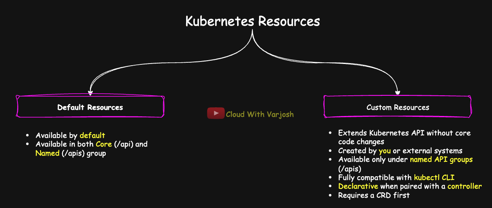
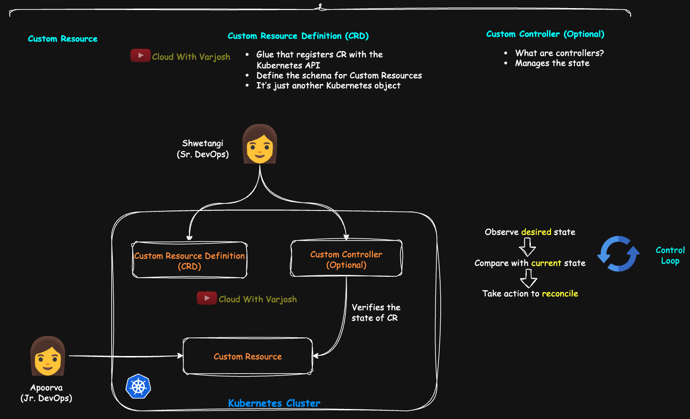

# Day 39: Custom Resources (CR) and Custom Resource Definitions (CRD) Explained with Demo | CKA Course 2025

## Video reference for Day 39 is the following:

[](https://www.youtube.com/watch?v=y4e7nQzu_8E)

---
## ⭐ Support the Project  
If this **repository** helps you, give it a ⭐ to show your support and help others discover it! 

---

### Prerequisites:

To fully understand this concept, it’s highly recommended to revisit the **Kubernetes API section from Day 35**:

* [Day 35 GitHub Notes](https://github.com/CloudWithVarJosh/CKA-Certification-Course-2025/tree/main/Day%2035)
* [Day 35 YouTube Lecture](https://www.youtube.com/watch?v=DkKc3RCW2BE&ab_channel=CloudWithVarJosh)

Watching the API deep dive alone is sufficient to understand how resources are surfaced through endpoints.

---

### Introduction

In Kubernetes, not all resources are built-in — sometimes we need to define our own. Custom Resources (CRs) and Custom Resource Definitions (CRDs) allow us to **extend the Kubernetes API** to manage new types of objects. In this lecture, we’ll explore what CRDs are, how they act as the schema for CRs, and how **controllers** (and eventually Operators) tie it all together to build powerful platform automation. A hands-on demo will walk you through the full lifecycle of defining and using a CRD.

---

## What is a Kubernetes Resource?

Anything you create or manage inside a Kubernetes cluster is considered a **resource**. Throughout this course, you’ve already worked extensively with them — from pods and deployments to services and persistent volume claims.

Each of these resources is an object exposed by the Kubernetes API. These resources are organized under API **groups**, and each group contains multiple **versions** and **kinds** of resources.

To explore the complete list of built-in resources in your cluster, you can use one of the most informative commands in your toolbox:

```bash
kubectl api-resources
```

If you've been following this course from the beginning, you already know how much insight this command provides. It shows not just resource names and short names, but also their associated API group, namespaced scope, and supported verbs.

---

## What is a Custom Resource?



A **custom resource** is any resource that does not exist in Kubernetes by default but is introduced by the user or an external system to extend the Kubernetes API.

Kubernetes exposes resources via its API endpoints. These include:

* `/api` — for the core group (e.g., Pods, Services, ConfigMaps)
* `/apis/<group>` — for all named groups (e.g., `apps/v1` for Deployments)

A custom resource becomes part of the `/apis` path under a new or existing API group. It lets you define your own object kind, schema, and expected behavior.

To fully understand this concept, it’s highly recommended to revisit the **Kubernetes API section from Day 35**:

* [Day 35 GitHub Notes](https://github.com/CloudWithVarJosh/CKA-Certification-Course-2025/tree/main/Day%2035)
* [Day 35 YouTube Lecture](https://www.youtube.com/watch?v=DkKc3RCW2BE&ab_channel=CloudWithVarJosh)

Watching the API deep dive alone is sufficient to understand how resources are surfaced through endpoints.

---

## Key Properties of Custom Resources

* **Created by you or an external system:**
  Custom Resources are user-defined objects created by cluster users or external systems/applications, not built-in Kubernetes components.

* **Exist only under named API groups (`/apis`):**
  CRs live under custom API groups accessed via `/apis/{group}`; they cannot be part of the core API group (`/api`).

* **Extend the Kubernetes API without modifying Kubernetes code:**
  CRDs allow you to add new resource types to Kubernetes dynamically, without changing or rebuilding the Kubernetes API server.

* **Fully compatible with `kubectl`:**
  Once a CRD is created, you can manage your custom resources using standard `kubectl` commands (get, describe, create, delete, etc.), similar to built-in resources.

* **Declarative when used with controllers:**
  Custom Resources typically represent desired state; when paired with a controller, the controller ensures the actual cluster state matches this desired state, following Kubernetes’ declarative model.

---

## What is a CustomResourceDefinition (CRD)?

A **CustomResourceDefinition (CRD)** is how you tell Kubernetes about the existence of your new resource type. It is itself a Kubernetes resource — a manifest that defines:

* The API group and version
* The singular and plural names of the resource
* The resource kind
* Optional OpenAPI validation schema

Once applied, it registers a new resource type in your Kubernetes API server.

You can now define and create objects of this new custom kind — these are your **Custom Resources (CRs)**.

> Kubernetes has an extensible API, which means you can expand its capabilities by introducing new types of resources and controllers beyond the built-in ones like Pods, Deployments, and Services. A **Custom Resource (CR)** is one such extension — a user-defined object added to the cluster. The **CustomResourceDefinition (CRD)** acts as the glue that registers this new resource type with the Kubernetes API, enabling full `kubectl` compatibility.


---

## Do Built-in Resources Have Definitions Like CRDs?

While **Custom Resources** require us to explicitly create a `CustomResourceDefinition` (CRD), **built-in resources** like `Deployment`, `Pod`, `Service`, etc., also have something *similar* — but it is **already defined by Kubernetes itself** in the **core or built-in APIs**.

---

### Equivalent of CRD for Built-in Resources

For built-in resources:

* There **is no separate YAML file** that defines their structure like a CRD.
* Instead, their "definitions" are **built into the Kubernetes API server** and published via the API machinery.

These definitions include:

* Group/Version (like `apps/v1` for Deployment)
* Kind (`Deployment`)
* OpenAPI schemas (what fields are allowed in `spec`, `metadata`, etc.)

---

### Where Is This Resource Definition Stored?

You can inspect the schema and structure of built-in resources in several ways:

#### 1. **Kubernetes OpenAPI Schema**

Kubernetes exposes its OpenAPI definitions (just like CRDs):

```bash
kubectl get --raw /openapi/v2 | jq .
```

This contains the full schema for every resource, including fields, types, descriptions.

#### 2. **kubectl explain**

This is the most user-friendly way to explore built-in resource structure:

```bash
kubectl explain deployment.spec
kubectl explain pod.spec.containers
```

This is essentially your built-in “resource definition” viewer — same in spirit as a CRD.

#### 3. **Kubernetes API Reference Docs**

Online docs like [Kubernetes API Reference](https://kubernetes.io/docs/reference/kubernetes-api/) show the official schema and fields for all built-in kinds.

---

## Understanding Controllers and Custom Controllers in Kubernetes



When we discussed the **Kubernetes architecture** earlier in the course, we talked about the **`kube-controller-manager`** — which acts as an **umbrella for multiple built-in controllers** running in the cluster.

Kubernetes has many default resource types (like Deployments, ReplicaSets, Jobs, and so on), and most of these resources have an associated **controller**. These controllers constantly **observe the current state** of the cluster and compare it against the **desired state** defined by users through YAML manifests. If there's a difference, the controller takes corrective action to bring the current state in line with the desired state.

> For example, the **Deployment controller** ensures the specified number of pod replicas are running at all times.

---


## Custom Controllers and the Control Loop Pattern

When you define a **Custom Resource Definition (CRD)**, it allows you to extend the Kubernetes API with new object types. You can create, retrieve, and delete these custom resources using `kubectl`, just like built-in ones. However, these resources are **passive by default** — Kubernetes will store them, but it won’t take any action on them unless explicitly told to.

To **act on a CRD** (e.g., spin up Pods based on a custom spec), you need to implement a **Custom Controller** — a background process that watches for changes in your custom resource and reconciles the cluster state accordingly.

---

### What Is a Controller's Job?

Every controller in Kubernetes — built-in or custom — follows the **control loop pattern**:

> **"Observe desired state → Compare with current state → Take action to reconcile"**

This logic forms the heartbeat of Kubernetes automation and declarative management.

---

### What Is a Control Loop?

A **control loop** is a continuous cycle where a controller:

1. **Watches** the current state of the cluster (usually via a shared informer and cache)
2. **Compares** it with the desired state (defined in a resource’s `.spec`)
3. **Takes corrective action** to bring the actual state in line with what is desired

This loop is triggered by events (e.g., changes to a resource) and often backed by periodic rechecks to ensure eventual consistency.

---

### Real-World Analogy: Thermostat

Think of a thermostat in your house:

* You set the desired temperature: **22°C**
* The thermostat reads the current temperature: **18°C**
* It turns on the heater to bring it up to 22°C

This is exactly how Kubernetes controllers function — observing, comparing, and correcting.

---

### Example: Deployment Controller

If you create a deployment like this:

```yaml
spec:
  replicas: 3
```

... and one pod crashes, the **Deployment controller** notices that only 2 pods are running (current state), compares it to the desired state (3 replicas), and immediately creates another pod.

---

### Custom Controllers: Bringing Logic to CRDs

If you define a CRD (e.g., `Widget`, `AppConfig`, or `BackupPolicy`), you might want logic that enforces a spec — say, starting a Pod or taking a snapshot.

In that case, a **custom controller**:

* Watches your CR objects (using informers)
* Compares `.spec` with actual system state (often `.status`)
* Applies changes (e.g., creating Jobs, ConfigMaps, Deployments, etc.)

Even at a high level, most custom controllers resemble this loop:

```go
for {
    // 1. Fetch the latest state of the custom resource
    // 2. Compare desired and current states
    // 3. Take action if needed
}
```

---

### Tools for Writing Controllers

Most controllers are written in **Go**, using one of the following frameworks:

* [**Kubebuilder**](https://github.com/kubernetes-sigs/kubebuilder) – scaffolds full controller projects with CRD support
* [**controller-runtime**](https://github.com/kubernetes-sigs/controller-runtime) – lower-level library that Kubebuilder uses internally
* [Operator SDK](https://sdk.operatorframework.io/) – often used in conjunction with OLM (Operator Lifecycle Manager)

---

### CKA Relevance

> While writing controllers isn't required for the CKA exam, understanding the **control loop pattern** helps demystify how Kubernetes automates everything — and gives you the vocabulary to explain what controllers actually do.

---


### Not All Resources Have Controllers

Some resources are just metadata or configuration blobs — and don’t require active management.

Examples:

* `ConfigMap`, `Secret`, `Pod` (standalone), **do not** have controllers.
* `Deployment`, `StatefulSet`, `DaemonSet`, `HPA`, `Job`, `CronJob`, `ReplicaSet` **do**.

---

## Rule of Thumb

> **If a resource defines a desired state and can drift from it, Kubernetes usually assigns a controller to reconcile it.**
> **If a resource is static, metadata-driven, or only evaluated at creation time, no controller is needed.**

---

## Demo: Creating a Realistic Custom Resource — `BackupPolicy`

This example is more aligned with **real production needs**. We'll define a `BackupPolicy` CRD that enables teams to declare backup behavior for their apps — such as schedules, retention, and volume to back up — without needing to write scripting or manage jobs manually.

---

### Why Not Just Use a CronJob?

You *can* use Kubernetes `CronJob`, but it has limitations:

| Feature                         | CronJob                  | BackupPolicy CRD (with Controller)    |
| ------------------------------- | ------------------------ | ------------------------------------- |
| Schedule execution              | ✅ Built-in               | ✅ Handled by custom controller        |
| PVC awareness                   | ❌ Manual volumeMounts    | ✅ Field in CR, resolved by controller |
| Retention policies              | ❌ Not supported          | ✅ Declarative (`retentionDays`)       |
| Backup validation               | ❌ Needs external scripts | ✅ Logic in controller                 |
| Application-specific hooks      | ❌ Needs customization    | ✅ Encapsulated in Go logic            |
| Declarative backup config store | ❌ Procedural job YAMLs   | ✅ CR acts as single config unit       |

So, a `BackupPolicy` CRD abstracts this complexity and lets app teams describe what they want — and a custom controller enforces it.

---

## Step 1: Define the CRD — `backup-policy-crd.yaml`

```yaml
# Defines a new custom resource type in the Kubernetes API
apiVersion: apiextensions.k8s.io/v1        # Required API version for CRD definitions since Kubernetes v1.16+
kind: CustomResourceDefinition             # Specifies that we're defining a custom resource type

metadata:
  name: backuppolicies.ops.cloudwithvarjosh  # Must be <plural>.<group>; uniquely identifies the CRD cluster-wide

spec:
  group: ops.cloudwithvarjosh             # Defines the API group used in the resource's apiVersion (e.g., ops.cloudwithvarjosh/v1)

  names:
    plural: backuppolicies                # Plural form used in CLI and API endpoints (e.g., /apis/ops.cloudwithvarjosh/v1/backuppolicies)
    singular: backuppolicy                # Optional: Singular name used in output and CLI messages
    kind: BackupPolicy                    # Required: PascalCase identifier used as the `kind` field in manifests
    shortNames:
      - bp                                # Optional: Short alias for CLI (e.g., `kubectl get bp`)

  scope: Namespaced                       # Determines resource scope: 'Namespaced' means one per namespace (vs. 'Cluster')

  versions:
    - name: v1                            # Version name (used in apiVersion of custom resource instances)
      served: true                        # Exposes this version via Kubernetes API
      storage: true                       # Persists data in etcd using this version's schema

      schema:
        openAPIV3Schema:                  # Defines schema validation rules for the resource
          type: object                    # The top-level object must be a JSON object (map)

          properties:
            spec:                         # The `.spec` field defines user intent (like in Deployments)
              type: object
              properties:

                schedule:
                  type: string
                  description: >          # Cron-formatted string for triggering backups
                    Defines when the backup should run using standard cron syntax.
                    Example: "0 1 * * *" runs every day at 1:00 AM.

                retentionDays:
                  type: integer
                  description: >          # Retention policy for old backups
                    Number of days to keep completed backups before automatic deletion.
                    Helps manage storage usage and retention compliance.

                targetPVC:
                  type: string
                  description: >          # Name of the PersistentVolumeClaim (PVC) to back up
                    Points to the storage volume to snapshot or archive.
                    Commonly used for application or database data.


```

---

## Step 2: Apply the CRD

```bash
kubectl apply -f backup-policy-crd.yaml
```

Verify creation:

```bash
kubectl get crd backuppolicies.ops.cloudwithvarjosh
```

Check API resources:

```bash
kubectl api-resources | grep backup
```

Expected output:

```
backuppolicies   bp   ops.cloudwithvarjosh/v1   true   BackupPolicy
```

---

## Step 3: Create a Custom Resource — `mysql-backup.yaml`

Now, create a CR for your specific workload. In this case, it defines a backup policy for a MySQL PVC.

```yaml
apiVersion: ops.cloudwithvarjosh/v1   # Must match the group and version defined in the CRD
kind: BackupPolicy                    # Must match the 'kind' field in the CRD

metadata:
  name: mysql-backup                  # Name of this BackupPolicy object
  namespace: default                  # Since scope is Namespaced, this object will exist in the 'default' namespace

spec:
  schedule: "0 1 * * *"               # Backup should run daily at 1:00 AM (Cron format: min hour dom mon dow)
  retentionDays: 7                    # Retain backups for 7 days; older ones can be deleted
  targetPVC: mysql-data-pvc           # The name of the PersistentVolumeClaim (PVC) to back up
```

**What this represents:**

You’re declaring:

> “At 1:00 AM every day, take a backup of the PVC named `mysql-data-pvc`, and keep those backups for 7 days.”

But remember — this declaration **won’t cause any backups to happen** *unless* there’s a **controller** that watches `BackupPolicy` resources and initiates actions accordingly.

Apply it:

```bash
kubectl apply -f mysql-backup.yaml
```

---

## Step 4: Interact With the BackupPolicy Resource

```bash
kubectl get backuppolicies
```

Output:

```
NAME            AGE
mysql-backup    10s
```

Get details:

```bash
kubectl describe backuppolicy mysql-backup
```

Fetch YAML:

```bash
kubectl get backuppolicy mysql-backup -o yaml
```

---

## Step 5: Clean Up

```bash
kubectl delete -f mysql-backup.yaml
kubectl delete -f backup-policy-crd.yaml
```

---

## Recap: What’s Happening and Why It’s Useful

This CRD doesn’t **do** anything by itself — just like a `Widget`, it only stores config.

But in production:

* A **custom controller** would **watch `BackupPolicy` CRs**
* It would dynamically **create CronJobs or one-time Jobs**
* It could:

  * Mount the correct PVC
  * Use annotations or labels to tag backups
  * Upload them to S3
  * Enforce retention and cleanup
  * Alert on failures

By defining a CRD + CR:

✔ Teams write **only the intent** (schedule, retention, PVC)
✔ Platform engineers encode all the logic in a controller
✔ Makes backups **repeatable, policy-driven, and declarative**

---

## Role of a Controller in Managing Custom Resources like BackupPolicy

If a **controller** were defined for our `BackupPolicy` CR, it would continuously **watch for new or updated policies**, and based on the configured schedule, **automatically trigger backup jobs** for the specified PVC. Beyond just scheduling, the controller could also **enforce retention policies** by deleting outdated backups and **update the CR’s `.status` field** with runtime details.

The `.status` field is used by controllers to **reflect the current state of the resource** — for example, the **last backup time**, whether the most recent backup **succeeded or failed**, or whether **old backups were purged**. While `.spec` declares *what should happen*, `.status` reveals *what actually happened*.

To view the `.status` field of any resource (including custom resources), use:

```bash
kubectl get backuppolicy <name> -o yaml
```

Check under the `status:` section in the output — this is especially useful for debugging, auditing, or verifying that your controller logic is working as expected.

---

## Real Production Scenario

This kind of approach is used in:

* **Internal platform teams** creating Kubernetes abstractions
* **Backup-as-a-Service operators** like [Velero](https://velero.io/)
* **GitOps pipelines** to automate disaster recovery workflows
* **Policy engines** that verify every workload has a backup plan

--- 

### Conclusion

By now, you understand the difference between Custom Resources and CRDs, how to define your own resource types, and how they plug into the Kubernetes control plane. You’ve also seen how a controller can bring a CR to life by observing and acting on the desired state. This sets a strong foundation for our next topic — Kubernetes Operators — which build upon these concepts to automate complex application lifecycles.

---

### References

* [Custom Resources Overview](https://kubernetes.io/docs/concepts/extend-kubernetes/api-extension/custom-resources/)
* [Extend the Kubernetes API with CustomResourceDefinitions](https://kubernetes.io/docs/tasks/extend-kubernetes/custom-resources/custom-resource-definitions/)
* [Writing a Controller](https://kubernetes.io/docs/concepts/architecture/controller/)