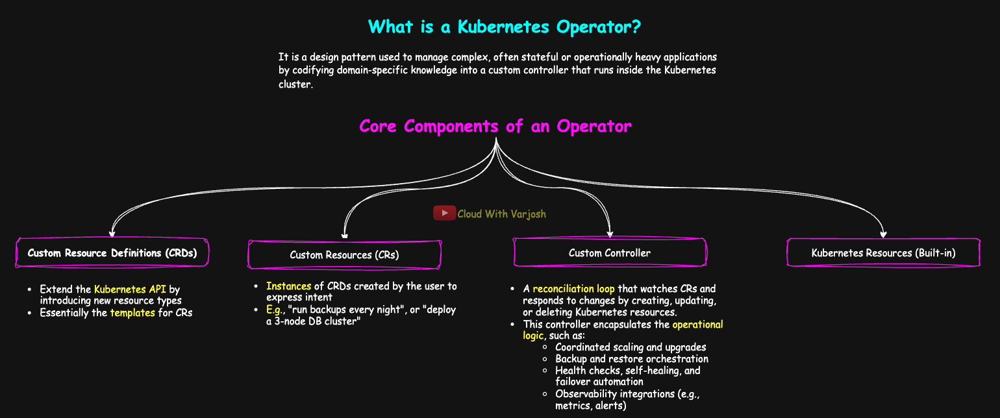

# Day 40: Kubernetes Operators Deep Dive with Hands-On Demo | CKA Course 2025

## Video reference for Day 40 is the following:

[](https://www.youtube.com/watch?v=hxgmG1qYU2M&ab_channel=CloudWithVarJosh)


---
## ⭐ Support the Project  
If this **repository** helps you, give it a ⭐ to show your support and help others discover it! 

---

## Table of Contents

- [Introduction](#introduction)
- [Understanding Application State](#understanding-application-state)
  - [What Is a Stateless Application?](#what-is-a-stateless-application)
  - [What Is a Stateful Application?](#what-is-a-stateful-application)
  - [Without Native Automation: Manual Responsibilities](#without-native-automation-manual-responsibilities)
- [What Is a Kubernetes Operator?](#what-is-a-kubernetes-operator)
  - [Core Components of a Kubernetes Operator](#core-components-of-a-kubernetes-operator)
  - [Understanding the Logical Hierarchy of a Kubernetes Operator](#understanding-the-logical-hierarchy-of-a-kubernetes-operator)
- [Don't Limit Your Imagination with Operators](#dont-limit-your-imagination-with-operators)
- [Helm and Kustomize Are Still Very Relevant](#helm-and-kustomize-are-still-very-relevant)
- [Revisited: Our Custom BackupPolicy Operator](#revisited-our-custom-backuppolicy-operator)
- [How Can We Create Kubernetes Operators?](#how-can-we-create-kubernetes-operators)
  - [Popular Operator Development Frameworks](#popular-operator-development-frameworks)
  - [How Do You Choose?](#how-do-you-choose)
- [Demo: Kube-Green Operator](#demo-kube-green-operator)
  - [Step 1: Install the Operator Lifecycle Manager (OLM)](#step-1-install-the-operator-lifecycle-manager-olm)
  - [Step 2: Install the Kube-Green Operator](#step-2-install-the-kube-green-operator)
  - [Step 3: Verify the Operator Installation](#step-3-verify-the-operator-installation)
  - [Step 4: Deploy a Sample Application](#step-4-deploy-a-sample-application)
  - [Step 5: Create a SleepInfo Custom Resource](#step-5-create-a-sleepinfo-custom-resource)
  - [Step 6: Observe the Operator in Action](#step-6-observe-the-operator-in-action)
- [Conclusion](#conclusion)
- [References](#references)

---

### Prerequisites:

By now, you should have a solid understanding of **Custom Resources (CRs)**, **Custom Resource Definitions (CRDs)**, and **Custom Controllers** from our previous lesson. This foundational knowledge is critical for grasping the concept of **Kubernetes Operators** — what they are, how they work, and why they are essential for managing complex workloads.

For a quick recap or hands-on review, refer to the resources below:

* [Day 39 GitHub Notes](https://github.com/CloudWithVarJosh/CKA-Certification-Course-2025/tree/main/Day%2039)
* [Day 39 YouTube Lecture](https://www.youtube.com/watch?v=y4e7nQzu_8E)

---

### Quick Recap

* **Custom Resource (CR):** A user-defined object to extend Kubernetes functionality — like a BackupPolicy.
* **CRD (Custom Resource Definition):** Blueprint/schema that defines the structure of the CR.
* **Controller:** A loop that continuously watches CRs and reconciles their actual state with the desired state.

In practice, tools like **Prometheus**, **Istio**, **Kyverno**, or **ArgoCD** define their own CRDs and ship with custom controllers (usually run as Kubernetes Deployments). These controllers actively manage the CRs created by the user and ensure they behave as expected.

---

## **Introduction**

Kubernetes has emerged as the de facto standard for orchestrating containerized applications, but as workloads grow in complexity—especially with **stateful applications**—manual operations become fragile and error-prone. This is where **Kubernetes Operators** step in: they empower us to encode human operational knowledge into automated, Kubernetes-native controllers. By leveraging Custom Resource Definitions (CRDs) and purpose-built controllers, Operators provide the intelligence to manage an application's full lifecycle—from installation to upgrades, backups, and failure recovery.

This document explores **stateless vs. stateful applications**, the operational overhead without automation, and the rationale behind adopting the Operator pattern. We also delve into a hands-on demo using the **kube-green Operator**, illustrating real-world automation for workload scaling based on custom policies.

---

## Why Do We Need Kubernetes Operators?

## Understanding Stateless vs Stateful Applications in Kubernetes

In Kubernetes, the way an application manages its **state** has major implications on how easily it can scale, recover, and operate in production.

---

### What Is a Stateless Application?


A **stateless application** does not store user-specific data or session information inside its own container or pod. Instead, it relies on **external systems** (like a database or distributed cache) to store that state.

**Example:**
Imagine a web application deployed in Kubernetes as a `Deployment` with multiple replicas:

* A user logs in and is routed to **Pod-1**.
* Instead of storing session data locally, **Pod-1 writes the session to Amazon ElastiCache** (e.g., Redis).
* If **Pod-1 crashes**, the next request goes to **Pod-2**, which reads the session from ElastiCache and serves the user seamlessly.

Because state is externalized:

* Any pod can handle any request.
* Kubernetes can freely reschedule, restart, or scale pods.
* The application supports **true horizontal scaling** and **resilience by design**.

---

### What Is a Stateful Application?


A **stateful application** stores critical data internally — often tied to its filesystem, memory, or a specific volume — and may require persistent identity or ordered startup.

**Examples:** Databases like PostgreSQL, MySQL, MongoDB.

Stateful apps are harder to scale horizontally because:

* Replicas must coordinate for **data consistency**.
* Failover requires **promotion logic** and **replication awareness**.
* Kubernetes must preserve identity, volume bindings, and startup order — handled via `StatefulSets`, `PersistentVolumeClaims`, and `headless Services`.

---

## Without Native Automation: Manual Responsibilities

When deploying a **stateful database** on Kubernetes without automation, both **DevOps** and **DBA** teams need to coordinate closely to ensure high availability and resilience.

---

### DevOps Team Responsibilities

* Provision persistent volumes with `PVCs` and `StorageClasses`
* Define and manage `StatefulSets` for identity and ordered scaling
* Configure headless `Services` and DNS for inter-pod communication
* Script replication bootstrapping (init containers or entrypoint logic)
* Set up readiness/liveness probes for health checks
* Manage Secrets, ServiceAccounts, and RBAC for DB access
* Schedule backups using CronJobs or batch jobs
* Monitor database health and replication lag using Prometheus/Grafana
* Handle failover logic through custom scripts or tooling

---

### DBA Team Responsibilities

* Design the replication topology (e.g., Master → Replica1 → Replica2)
* Configure replication settings (e.g., WALs, slots, credentials)
* Handle promotion workflows during failover
* Define and validate backup/restore processes
* Tune DB performance parameters (I/O, caching, queries)
* Apply schema migrations with minimal downtime
* Ensure replication consistency and detect split-brain or drift

---

## What Is a Kubernetes Operator?



A **Kubernetes Operator** is a design pattern used to manage complex, often stateful or operationally heavy applications by codifying domain-specific knowledge into a **custom controller** that runs inside the Kubernetes cluster.

At its core, an Operator:

* Continuously monitors application resources
* Understands and responds to changes in real-time
* Automates lifecycle tasks like upgrades, backups, failovers, reconfiguration, and scaling
* Maintains system health by reconciling desired vs. actual state

> Think of it as a **specialist controller** that knows exactly how to install, run, and maintain a particular application — with zero manual intervention.

### Why It Matters

> Operators are designed to **bundle, manage, and operate an application end-to-end**, taking into account all the moving parts — including built-in Kubernetes resources, custom resources, configurations, secrets, monitoring, failover logic, and more.

This means Operators don’t just deploy an app — they **understand the app's entire lifecycle** and actively manage it to stay healthy, up-to-date, and consistent.

---

## Core Components of a Kubernetes Operator

A Kubernetes Operator is composed of the following core elements:

1. **Custom Resource Definitions (CRDs)**
   Extend the Kubernetes API by introducing new resource types, such as `KafkaCluster`, `BackupPolicy`, or `MySQLReplicaSet`.

2. **Custom Resources (CRs)**
   Instances of CRDs created by the user to express intent (e.g., "run backups every night", or "deploy a 3-node DB cluster").

3. **Custom Controller**
   A reconciliation loop that watches CRs and responds to changes by creating, updating, or deleting Kubernetes resources.
   This controller encapsulates the **operational logic**, such as:

   * Coordinated scaling and upgrades
   * Backup and restore orchestration
   * Health checks, self-healing, and failover automation
   * Observability integrations (e.g., metrics, alerts)

4. **Kubernetes Resources (Built-in)**
   The controller often creates built-in resources such as:

   * `StatefulSets`, `Deployments`, `Jobs`
   * `Services`, `Ingress`, `PVCs`
   * `Secrets`, `ConfigMaps`, `ServiceAccounts`
     These are orchestrated in response to the CR’s desired state.


> When you install an operator, it brings its own CRDs and controllers.
> You only interact with it by creating **Custom Resources** based on those CRDs.
> Some CRs may be auto-generated by the operator, but most you’ll write yourself to declare intent.

---

**Understanding the Logical Hierarchy of a Kubernetes Operator**

A **Kubernetes Operator** is a **logical construct** — it’s not a Kubernetes object itself, but a pattern that bundles **domain-specific automation logic**.

While people often refer to the whole system as an “Operator,” it’s important to understand the **real control flow and structure** behind it.

---

### 📐 Operator Hierarchy

```
Operator
  └── Custom Controller
         ├── Watches: Custom Resources (CRs)
         ├── Reads: Custom Resource Definitions (CRDs)
         └── May create: Default Kubernetes Resources
                          ├── StatefulSets / Deployments
                          ├── Services / Ingress
                          ├── ConfigMaps / Secrets
                          ├── PVCs, CronJobs, Jobs, etc.
```

---

### Component Breakdown

| Component                            | Description                                                                                                                               |
| ------------------------------------ | ----------------------------------------------------------------------------------------------------------------------------------------- |
| **Operator**                         | Logical pattern that bundles the controller + CRDs + automation logic                                                                     |
| **Custom Controller**                | Core logic that runs in the cluster, watches CRs, and performs reconciliation                                                             |
| **CRD (Custom Resource Definition)** | Extends the Kubernetes API with new types like `BackupPolicy`, `Prometheus`                                                               |
| **CR (Custom Resource)**             | A user-defined object describing the *desired state* of a domain-specific app                                                             |
| **Default Kubernetes Resources**     | Resources created/updated by the controller to make the desired state real: `StatefulSets`, `Deployments`, `Services`, `ConfigMaps`, etc. |


---

## Don't Limit Your Imagination with Operators

When most people first hear about Kubernetes Operators, they think of them only in the context of **databases** or **stateful apps**. But the reality is:

> **Operators are a general-purpose automation pattern** — they can be built for almost anything.

Whether you're managing:

* **Databases** (e.g., MySQL, PostgreSQL, MongoDB)
* **Monitoring systems** (e.g., Prometheus, Thanos)
* **Security tools** (e.g., cert-manager for TLS, Kyverno for policy enforcement)
* **Backup systems** (e.g., Velero)
* **Networking components** (e.g., Istio, Cilium)
* **CI/CD platforms** (e.g., ArgoCD, Flux)

There’s likely an Operator for it — and it doesn’t stop there. You can build **custom Operators** for **internal applications**, **SaaS integrations**, or **company-specific logic**.

> 🎯 A good rule of thumb: **If something needs to reconcile desired vs actual state continuously, it’s a good fit for an Operator.**

Want to explore what’s already out there? Check out [OperatorHub.io](https://operatorhub.io) — a central registry of community and vendor-supported Operators across domains.

---

## Helm and Kustomize Are Still Very Relevant

It’s important to understand that **Operators don’t replace Helm or Kustomize** — they solve **different problems**.

* **Helm and Kustomize**: Great for templating and installing Kubernetes resources — especially during initial setup or across multiple environments.
* **Operators**: Excellent for **runtime management**, **lifecycle automation**, and **domain-specific reconciliation logic**.

In fact, you’ll often see them **used together**:

* You can **deploy an Operator using Helm or Kustomize**.
* You can use Helm to **template the CRs** (Custom Resources) that the Operator consumes.
* Some Operators even use Helm *under the hood* (via Helm-based Operator SDK).

So rather than thinking in terms of “either/or,” think:

> 🛠️ **Helm/Kustomize for templating + Operators for lifecycle management** = a powerful Kubernetes-native automation combo.

---

## Revisited: Our Custom BackupPolicy Operator


In our previous lecture, we created a CRD named:

```
backuppolicies.ops.cloudwithvarjosh
```

And a CR:

```yaml
apiVersion: ops.cloudwithvarjosh/v1
kind: BackupPolicy
metadata:
  name: mysql-backup
  namespace: default
spec:
  schedule: "0 1 * * *"
  retentionDays: 7
  targetPVC: mysql-data-pvc
```

The CR defined user intent: when to run backups, how long to keep them, and which volume to target.
A basic controller could read this resource and:

* Schedule a backup CronJob
* Clean up expired backups
* Watch for pod restarts or PVC reattachments

At this point, we’re building the **bare bones of an Operator**.

---

### What Makes a Mature Operator?

A production-grade Operator goes well beyond job creation. It should manage:

#### Backup & Restore Automation

* Migrating legacy backups
* Triggering restores safely (with dry-run)
* Compatibility validation before restore

#### Reliability & Resilience

* Retrying failed jobs with backoff
* Cleaning orphaned resources (PVCs, Jobs, CronJobs)
* Handling concurrency & race conditions

#### Observability

* Pushing metrics to Prometheus
* Publishing `.status` fields in CRs
* Triggering alerts on job failures or config drift

#### Dynamic Scaling

* Adjusting backup parallelism based on PVC size or node pressure
* Staggering jobs to reduce I/O burst across nodes


> A well-designed Kubernetes Operator doesn’t just *install* your application — it manages its **entire lifecycle**, continuously and intelligently.

---

## How Can We Create Kubernetes Operators?

Creating Operators may sound intimidating, but several frameworks and tools exist to **simplify and accelerate** the process — whether you're writing in Go, Python, Ansible, or even Helm.

### Popular Operator Development Frameworks

| Tool / SDK                 | Language                          | Description                                                                                             |
| -------------------------- | --------------------------------- | ------------------------------------------------------------------------------------------------------- |
| **Operator SDK (Go)**      | Go                                | Official CNCF-backed SDK for building production-grade Operators using controller-runtime               |
| **Kubebuilder**            | Go                                | A scaffolding tool for writing native Kubernetes APIs/controllers (used by Operator SDK under the hood) |
| **Operator SDK (Ansible)** | Ansible                           | Write Operators using Ansible playbooks instead of code                                                 |
| **Operator SDK (Helm)**    | YAML/Helm                         | Use existing Helm charts to create Operators without writing code                                       |
| **Metacontroller**         | Any language (JSON over webhooks) | Lightweight tool for building custom controllers using webhooks and templates                           |
| **Java Operator SDK**      | Java                              | Build Operators using familiar Java frameworks like Quarkus or Spring Boot                              |

---

### How Do You Choose?

| If you are...                  | Use this...                      |
| ------------------------------ | -------------------------------- |
| A Go developer                 | Operator SDK (Go) or Kubebuilder |
| Comfortable with Helm          | Operator SDK (Helm)              |
| Strong in Ansible automation   | Operator SDK (Ansible)           |
| Exploring webhooks/lightweight | Metacontroller                   |
| Working in a Java ecosystem    | Java Operator SDK                |

> **Go-based Operators** (via Operator SDK or Kubebuilder) are the most powerful and widely adopted in production environments.


---

# Demo: Kube-Green Operator

The **kube-green Operator** automates the process of scaling down non-critical workloads (like Deployments or StatefulSets) during off-hours to save compute resources — especially in dev and staging environments.

This walkthrough will demonstrate:

* Installing the **OLM (Operator Lifecycle Manager)**
* Deploying the **kube-green Operator**
* Creating a **sample Deployment**
* Applying a **custom resource (`SleepInfo`)**
* Watching the Operator’s behavior

---

## Step 1: Install the Operator Lifecycle Manager (OLM)

OLM is a Kubernetes-native tool to help manage the installation, update, and lifecycle of Operators.

Run the following command to install it:

```bash
curl -sL https://github.com/operator-framework/operator-lifecycle-manager/releases/download/v0.32.0/install.sh | bash -s v0.32.0
```

This script installs:

* OLM and Catalog APIs
* CRDs and controllers required for managing operators via Subscriptions

---

## Step 2: Install the Kube-Green Operator

Once OLM is installed, deploy the kube-green Operator using its official OperatorHub install manifest:

```bash
kubectl create -f https://operatorhub.io/install/kube-green.yaml
```

This will:

* Create a **Subscription** for the kube-green Operator
* Install the Operator in the `operators` namespace
* Make it usable across the entire cluster

---

## Step 3: Verify the Operator Installation

Check the ClusterServiceVersion (CSV) status in the `operators` namespace:

```bash
kubectl get csv -n operators
```

You should see the kube-green Operator listed with `STATUS: Succeeded`. This means it's active and the controller is running.

### Verify the CRD is Registered

Run the following to confirm that the custom resource definition has been registered:

```bash
kubectl api-resources | grep sleepinfo
```

Expected output:

```
sleepinfos   kube-green.com/v1alpha1   true   SleepInfo
```

You can also inspect the CRD:

```bash
kubectl get crd | grep sleepinfo
```

Expected:

```
sleepinfos.kube-green.com   <timestamp>
```

At this point, you can start using the `SleepInfo` custom resource to define when and how workloads should be scaled down or resumed.

---

## Step 4: Deploy a Sample Application

Create a simple NGINX Deployment to test kube-green behavior:

```yaml
# nginx.yaml
apiVersion: apps/v1
kind: Deployment
metadata:
  name: nginx
spec:
  replicas: 2
  selector:
    matchLabels:
      app: nginx
  template:
    metadata:
      labels:
        app: nginx
    spec:
      containers:
        - name: nginx
          image: nginx
```

Apply the deployment:

```bash
kubectl apply -f nginx.yaml
```

This will create 2 replicas of an NGINX pod.

---

## Step 5: Create a SleepInfo Custom Resource

This resource defines the off-hours policy.

```yaml
# sleepinfo.yaml
apiVersion: kube-green.com/v1alpha1
kind: SleepInfo
metadata:
  labels:
    app: kube-green
  name: sleepinfo-sample
spec:
  excludeRef:
    - apiVersion: apps/v1
      kind: Deployment
      name: critical-app
  sleepAt: '17:55'
  wakeUpAt: '08:00'
  weekdays: 0-6
  suspendCronJobs: true
  timeZone: Asia/Kolkata
```

### Explanation of Fields

| Field             | Description                                                                 |
| ----------------- | --------------------------------------------------------------------------- |
| `excludeRef`      | Excludes the specified object (here, `critical-app`) from being scaled down |
| `sleepAt`         | Time of day (in `Asia/Kolkata`) when workloads will be scaled down          |
| `wakeUpAt`        | Time of day when workloads will be scaled back up                           |
| `weekdays`        | Specifies which days of the week to apply the policy (0=Sun to 6=Sat)       |
| `suspendCronJobs` | If `true`, CronJobs will be suspended (i.e., `spec.suspend: true`)          |
| `timeZone`        | Time zone used to interpret the `sleepAt` and `wakeUpAt` times              |

> In this example, all Deployments and StatefulSets in the `default` namespace will be scaled to 0 every day at 17:55 IST, and resumed at 08:00 IST — except the one explicitly excluded.

Apply the SleepInfo:

```bash
kubectl apply -f sleepinfo.yaml
```

---

## Step 6: Observe the Operator in Action

To monitor changes to the deployment:

```bash
kubectl get deployment nginx -w
```

You should see the `REPLICAS` count go to 0 shortly after the `sleepAt` time.

To further inspect events and annotations added by kube-green:

```bash
kubectl describe deployment nginx
```

Look under the `Events` section — it should show scaling activity initiated by the kube-green controller.

---

## Conclusion

Kubernetes Operators embody a transformative approach to managing complex applications by embedding operational expertise directly into the Kubernetes ecosystem. Through **declarative intent**, **continuous reconciliation**, and **lifecycle awareness**, Operators provide the automation necessary to scale and stabilize production environments. The kube-green demo underscores their impact—by automating resource optimization, teams can reduce operational overhead and embrace intelligent infrastructure management. As Kubernetes adoption grows, mastering the Operator pattern becomes not just a skill but a strategic advantage.

---

## References

1. [Kubernetes Custom Resources and Controllers](https://kubernetes.io/docs/concepts/extend-kubernetes/api-extension/custom-resources/)
2. [Operator Pattern on Kubernetes Official Docs](https://kubernetes.io/docs/concepts/extend-kubernetes/operator/)
6. [CRDs in Kubernetes](https://kubernetes.io/docs/tasks/extend-kubernetes/custom-resources/custom-resource-definitions/)
7. [Stateful Applications in Kubernetes](https://kubernetes.io/docs/concepts/workloads/controllers/statefulset/)
10. [OperatorHub.io](https://operatorhub.io/)

---

