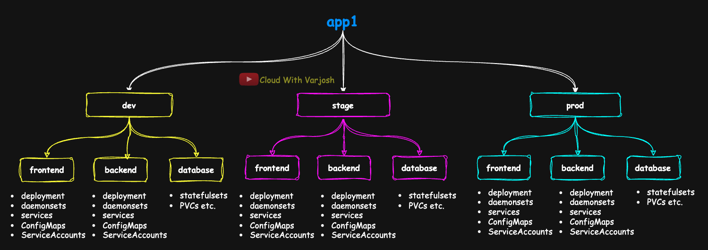

# Day 42: Kubernetes Kustomize Explained with Practical Demos | CKA Course 2025

## Video reference for Day 42 is the following:

[](https://www.youtube.com/watch?v=AKr5tc4nN2w&ab_channel=CloudWithVarJosh)


---
## ⭐ Support the Project  
If this **repository** helps you, give it a ⭐ to show your support and help others discover it! 

---

## Table of Contents

* [Introduction](#introduction)   
* [Why Kustomize?](#why-kustomize)  
* [What is Kustomize?](#what-is-kustomize)  
* [Helm vs Kustomize](#helm-vs-kustomize)  
* [Installing Kustomize](#installing-kustomize)  
* [Understanding `kustomization.yaml`](#understanding-kustomizationyaml)  
* [What Are Transformers in Kustomize?](#what-are-transformers-in-kustomize)  
* [Categories of Patches in Kustomize](#categories-of-patches-in-kustomize)  
* [Patching in Kustomize: From Strategic Merge to Inline Flexibility](#patching-in-kustomize-from-strategic-merge-to-inline-flexibility)  
* [Demo 1: Kustomize Basics with Name Suffix Transformer](#demo-1-kustomize-basics-with-name-suffix-transformer)  
* [Demo 2: Applying Additional Transformers in Kustomize](#demo-2-applying-additional-transformers-in-kustomize)  
* [Demo 3: `patches` (Generic Form)](#demo-3-patches-generic-form)  
* [Demo 4: `patchesJson6902` (Deprecated)](#demo-4-patchesjson6902-deprecated)  
* [Demo 5: `patchesStrategicMerge` (Deprecated)](#demo-5-patchesstrategicmerge-deprecated)  
* [Conclusion](#conclusion)  
* [References](#references)  

---

## Introduction

As Kubernetes adoption grows, so does the complexity of managing applications across multiple environments like **development**, **staging**, and **production**. While the core application structure remains consistent, small but critical differences—such as image versions, replica counts, and labels—make manual YAML duplication unsustainable.

This session introduces **Kustomize**, a native Kubernetes configuration management tool that tackles this challenge with a clean, declarative approach. Through base configurations and environment-specific overlays, Kustomize enables scalable, DRY (Don't Repeat Yourself) manifest management—without relying on templating.

In Day 42, we explore how Kustomize brings order to the chaos of multi-environment deployments, why it’s often the preferred alternative to external tools like Helm for certain use cases, and how to wield it effectively through hands-on demos covering transformers and patching techniques.

---

## Why Kustomize?

In real-world Kubernetes deployments, we often deal with multiple environments like **development**, **staging**, and **production**. While the application itself remains the same, environment-specific values such as image versions, replica counts, labels, and annotations tend to differ.

Let’s take a familiar example — the `nginx` deployment. In many organizations:

* **Dev** might use a newer version like `nginx:1.22` or even the `latest` build for testing purposes.
* **Staging** and **Prod** generally run a more stable and vetted version like `nginx:1.20`, often identical to ensure consistency.

This parallels how infrastructure environments are managed — you might test newer OS or runtime versions in dev before pushing them to prod.

---

### The Problem



Imagine you have an application named **app1** which runs in **three environments**: `dev`, `stage`, and `prod`. Each environment is made up of three logical tiers: **frontend**, **backend**, and **data**. Each tier typically involves several Kubernetes objects — such as:

* Deployments
* StatefulSets
* DaemonSets
* Services
* ConfigMaps
* PersistentVolumeClaims
* ServiceAccounts

That’s approximately **5–6 objects per tier**, and with 3 tiers per environment, we’re easily talking about **15 resources per environment**. Multiply this across 3 environments and you're now managing **\~45 Kubernetes objects** — and that’s just for a single application. A real-world production environment may have more objects, and **cloud-native applications often have multiple microservices per tier**, pushing this number much higher.

---

### What If You Want to:

* Add labels for observability or compliance
* Inject new annotations (e.g., for cost tracking or security posture)
* Change image versions for a patch release or rollback
* Modify naming conventions
* Adjust replica counts or resource limits

Making changes like these **manually across dozens of YAMLs** is time-consuming and error-prone. Even if your team gets it done, **manual edits invite human error** — and that's the last thing you want in production.

---

### What We Want

We want to avoid maintaining environment-specific copies of the same YAML with minor differences. Instead, we need:

* **A shared base** that defines common application structure
* **Environment-specific overlays** that customize only what's necessary

This promotes maintainability, consistency, and safety — and it's what **Kustomize** was designed to do.

---

### Real-World Perspective

> In production-grade Kubernetes environments, your cluster will typically host **multiple applications**, each composed of **multiple tiers** or **microservices**. Every tier — whether it's frontend, backend, database, caching, or messaging — will have its own Kubernetes manifests: **Deployments**, **Services**, **ConfigMaps**, **Secrets**, **PersistentVolumeClaims**, **ServiceAccounts**, and more.
>
> Now imagine you need to make a global change — like **adding a new label** for monitoring or compliance to all workloads, or **updating image versions** across services due to a security vulnerability. Managing this across dozens of YAML files manually is tedious and error-prone.
>
> You need a mechanism that makes such multi-file, multi-resource updates **structured**, **automated**, and **safe** — and this is where **Kustomize** shines.

---


## Enter Kustomize

The **Kubernetes community recognized** the challenges faced by platform engineers and DevOps teams when managing multiple environments, repeated YAMLs, and drift between manifests. Rather than relying on external templating tools, they introduced a **native, purpose-built solution** for Kubernetes manifest customization — and that’s where **Kustomize** enters.

**Kustomize** addresses this challenge by letting you define:

1. **Base Configuration** — shared across environments (what stays the same)
2. **Overlays** — environment-specific patches (what needs to change)

This ensures your YAMLs remain DRY (Don’t Repeat Yourself), manageable, and scalable — even as your applications grow in complexity.

> **Kustomize is not a templating tool.** Unlike Helm, there are no variables, functions, or templating syntax. You continue working with **plain YAML** as before. What changes is the introduction of **overlays** — declarative patches that adjust specific fields for environments like dev, staging, and prod. These overlays allow you to reuse and adapt a common base configuration without duplicating entire files or introducing templating complexity.

---


## What is Kustomize?

**Kustomize** is a declarative configuration management tool for Kubernetes that allows you to customize raw, template-free YAML files for multiple environments. Instead of using variables or a separate templating language (like in Helm), Kustomize applies **overlays** and **patches** to your base configuration — all in pure YAML.

Kustomize works natively with `kubectl` and supports:

* Applying **overrides** like replica count, image tags, labels, etc.
* Managing **variants of Kubernetes objects** without duplicating entire YAML files
* Keeping configurations **clean, modular, and DRY**

With Kustomize, your Kubernetes manifests are:

* Fully declarative
* Structured as **base + overlays**
* Compatible with existing tooling (`kubectl`, GitOps, CI/CD pipelines)

> Kustomize is ideal for teams that want to maintain multiple environment-specific configurations in a scalable, native way — without introducing a templating engine.

---

## Example: NGINX Deployment Across Dev, Staging, and Prod

Let’s say we want to deploy nginx across three environments with the following variations:

| Environment | Image Tag  | Replicas | Label        |
| ----------- | ---------- | -------- | ------------ |
| Dev         | nginx:1.22 | 2        | env: dev     |
| Staging     | nginx:1.20 | 3        | env: staging |
| Production  | nginx:1.20 | 5        | env: prod    |

### What We Do with Kustomize

* The **base** folder contains the generic YAML manifests: Deployment, Service, etc.
* Each **overlay** (dev, staging, prod) contains a small patch to modify specific fields like `replicas`, `image`, or `metadata.labels`.

---

## Recommended Folder Structure (Using `patches:` Inline)

```
kustomize-demo/
├── base/
│   ├── deployment.yaml
│   ├── service.yaml
│   └── kustomization.yaml
└── overlays/
    ├── dev/
    │   └── kustomization.yaml
    ├── staging/
    │   └── kustomization.yaml
    └── prod/
        └── kustomization.yaml
```

* `base/`: Contains core manifests shared across all environments — typically Deployments, Services, ConfigMaps, etc.
* `overlays/dev/`: Uses inline `patches:` to override replicas, labels, and image version for development.
* `overlays/staging/`: Similar structure, with stage-specific values patched inline.
* `overlays/prod/`: Inline patch to scale up and ensure prod-grade config.

> ⚠️ No external `patch-*.yaml` files are required when using `patches:`. Everything lives in the `kustomization.yaml` file of each overlay.

---

## How Kustomize Works (Simplified Flow Diagram)

```
       [ Base Manifests ]
               │
               ▼
       +------------------+
       | kustomization.yaml (base) 
       +------------------+
               │
         ┌─────┼──────┐
         ▼     ▼      ▼
    overlays/dev  overlays/staging  overlays/prod
         │     │      │
         ▼     ▼      ▼
 Final Dev  Final Stage  Final Prod
 Manifests  Manifests    Manifests
```

Each overlay’s `kustomization.yaml` brings together:

* Shared base resources
* Environment-specific **transformers** (e.g., `labels`, `images`, `replicas`)
* Inline **patches** for fine-grained modifications

---


## Helm vs Kustomize

### Kustomize vs Helm

* **Templating vs Patching**: Helm uses Go templating for dynamic values; Kustomize uses declarative patches without templates.
* **Package Manager vs Overlay Tool**: Helm acts like a package manager with versioned charts; Kustomize focuses on customizing existing YAMLs.
* **Release Tracking**: Helm tracks deployments as releases; Kustomize does not manage or track releases.
* **Native Support**: Kustomize is built into `kubectl` (`kubectl apply -k`); Helm is a separate CLI tool.
* **Complexity vs Simplicity**: Helm is more feature-rich (hooks, rollbacks, dependencies); Kustomize is simpler and ideal for environment-specific config management.

---

### Why Introduce Kustomize First?

Kustomize is native to Kubernetes (via `kubectl kustomize`) and relies entirely on YAML — no new syntax or language to learn. It encourages clean separation between **base configuration** and **environment-specific overlays** without introducing logic or templating. It’s a great entry point before tackling the added complexity and features of Helm.

---

## Feature Comparison: Helm vs Kustomize

| Feature                      | Feature Description                                                            | Kustomize                  | Helm                           |
| ---------------------------- | ------------------------------------------------------------------------------ | -------------------------- | ------------------------------ |
| Native to Kubernetes         | Whether the tool is integrated into `kubectl` and part of Kubernetes ecosystem | Yes (built into `kubectl`) | No (requires separate binary)  |
| Template Language            | Supports templating syntax like Go templates                                   | No                         | Yes (Go templating syntax)     |
| Values/Variables Support     | Ability to pass and inject variable values                                     | No                         | Yes (`values.yaml`)            |
| Overlay Support              | Native mechanism for layering and environment-specific customization           | Yes (base and overlays)    | Indirect (via separate values) |
| Complexity                   | Learning curve and operational overhead                                        | Low                        | Medium to High                 |
| Package Management           | Ability to version, install, and upgrade packaged resources                    | No                         | Yes (Helm Charts)              |
| Logic/Conditionals/Loops     | Ability to use control structures inside manifests                             | No                         | Yes                            |
| Extensibility (hooks, tests) | Supports lifecycle hooks, testing, and advanced release workflows              | No                         | Yes                            |
| Reusability                  | Degree to which definitions can be modular and reused                          | Moderate                   | High (charts and subcharts)    |
| Use Case Fit                 | Best suited for what type of applications                                      | Simple to medium apps      | Medium to complex apps         |


---

**Key Point:**
Use **Kustomize** when you want a straightforward way to manage environment-specific differences without introducing new syntax. Use **Helm** when your application requires richer templating, packaging, and reusability — especially if you're distributing or consuming applications via Helm charts.

---

## Installing Kustomize

Kustomize is bundled with `kubectl` (version ≥1.14), so you likely already have it. However, to ensure you're using the latest standalone version, you can upgrade it manually.

**Install the latest version:**

Visit the [official installation page](https://kubectl.docs.kubernetes.io/installation/kustomize/) and navigate to the **"binaries"** section. Or use this one-liner:

```bash
curl -s "https://raw.githubusercontent.com/kubernetes-sigs/kustomize/master/hack/install_kustomize.sh" | bash
```

This script installs the latest stable version into your working directory.

---


## Understanding `kustomization.yaml`

In Kustomize, the `kustomization.yaml` file is the **core driver** of how your final Kubernetes configuration is assembled. It dictates **what gets included** in your manifests and **how it gets transformed**, acting as the blueprint that merges your common base with environment-specific overlays.

Importantly, while every directory in a Kustomize setup will contain a `kustomization.yaml` file, the **contents and intent** of this file differ depending on whether it resides in a **base** or an **overlay**.

 **Note:**
The file **must** be named `kustomization.yaml` (all lowercase).
Kustomize will **only recognize this exact filename**. Files like `Kustomization.yaml`, `kustomization.yml`, or `customization.yaml` will **not work**, and Kustomize will throw an error such as:
```
Error: no kustomization file found in the current directory
```
This strict naming convention is by design — it ensures predictable behavior across tools and CI/CD systems that rely on Kustomize.

---

### In the `base/` Directory

The `base/` directory represents the **common configuration shared across all environments** — essentially, what stays the same. The `kustomization.yaml` here serves as a reference list of the base Kubernetes objects.

* It typically uses the `resources:` field to list raw Kubernetes YAML files like Deployments, Services, ConfigMaps, etc.
* It does **not include any environment-specific customizations** — no replica counts, image versions, or label overrides.
* This keeps your base clean, reusable, and environment-agnostic.

Example:

```yaml
apiVersion: kustomize.config.k8s.io/v1beta1
kind: Kustomization

resources:
  - deploy.yaml
  - svc.yaml
```

This setup ensures that every overlay consuming this base starts from the same consistent foundation.

---

### In the `overlays/` Directory

Each overlay represents a **specific environment** — such as `dev`, `stage`, or `prod`. The `kustomization.yaml` in these directories is used to **override or extend** the base configuration.

* Instead of pointing to raw YAMLs directly, overlays use `resources: ../../base` to reference the base configuration.
* You then apply environment-specific customizations — such as name prefixes/suffixes, namespace assignments, replica overrides, or image tag updates.
* Kustomize also supports different patching strategies here (`patches`, `patchesJson6902`, `patchesStrategicMerge`) to modify parts of the base manifests without copying them.

Example:

```yaml
apiVersion: kustomize.config.k8s.io/v1beta1
kind: Kustomization

resources:
  - ../../base

nameSuffix: -dev

```

This makes overlays highly expressive — letting you inject environment-specific concerns **without duplicating** the base YAMLs.

---

### Why This Separation Matters

This separation between base and overlays ensures a clean, maintainable structure across environments:

* **Reusability**: Your base can be used across dev, staging, QA, and production without modification.
* **Clarity**: Overlays only express what’s different — helping teams reason about changes at a glance.
* **Maintainability**: Reduces duplication and drift between environments, especially when updates are needed across the board (e.g., changing labels, security fixes, etc).

By organizing configuration this way, Kustomize gives you a powerful, native, and declarative way to scale your Kubernetes manifests safely and efficiently.


---

### Is `base/` and `overlays/` Mandatory?

> **No, the directory names `base/` and `overlays/` are purely conventional.**

They are **not enforced** by Kustomize. What Kustomize actually cares about is the presence of a `kustomization.yaml` file in each directory, and how directories are **referenced via relative paths** inside that file.

#### So why do we use `base/` and `overlays/`?

They’re simply **well-adopted conventions** in the community that help structure your project clearly:

* `base/` typically contains the common resources shared across environments.
* `overlays/dev`, `overlays/stage`, `overlays/prod`, etc., contain environment-specific customizations.

You could just as easily use directories like:

```
├── shared-resources/
│   └── kustomization.yaml
└── env-configs/
    ├── dev/
    ├── prod/
    └── test/
```

As long as each directory includes a properly structured `kustomization.yaml` and references its relative resources correctly, Kustomize will work just fine.


---

## Demo 1: Kustomize Basics with Name Suffix Transformer

In this hands-on demonstration, we'll introduce Kustomize by using one of its simplest but most effective features — the **nameSuffix transformer**. This will help you understand the foundational concepts behind base configurations and environment-specific overlays.

### Step 1: Directory Setup

Since this is **Day 42** of the course, we'll organize all relevant files under a directory named `Day42`. Inside that, we’ll create the following structure:

```
Day42/
├── base/
│   ├── deploy.yaml
│   └── kustomization.yaml
└── overlays/
    ├── dev/
    │   └── kustomization.yaml
    ├── stage/
    │   └── kustomization.yaml
    └── prod/
        └── kustomization.yaml
```

This layout separates common resources (base) from environment-specific modifications (overlays), which is the core design pattern of Kustomize.

---


### Step 2: Create the Base Configuration

In the `base/` directory, define the Kubernetes objects that are **common across all environments**. For our example, this includes a **Deployment** and a **Service**.

---

#### `base/deploy.yaml`

```yaml
apiVersion: apps/v1
kind: Deployment
metadata:
  name: nginx-deploy
  labels:
    app: nginx
spec:
  replicas: 2
  selector:
    matchLabels:
      app: nginx
  template:
    metadata:
      labels:
        app: nginx
    spec:
      containers:
        - name: nginx
          image: nginx
          ports:
            - containerPort: 80
```

---

#### `base/svc.yaml`

```yaml
apiVersion: v1
kind: Service
metadata:
  name: nginx-svc
spec:
  type: NodePort
  selector:
    app: nginx
  ports:
    - port: 80
      targetPort: 80
```

---

#### `base/kustomization.yaml`

```yaml
apiVersion: kustomize.config.k8s.io/v1
kind: Kustomization

resources:
  - deploy.yaml
  - svc.yaml
```

---

### Explanation

This base layer defines the shared configuration for the application:

* A **Deployment** named `nginx-deploy` with 2 replicas of the NGINX container.
* A **NodePort Service** named `nginx-svc` to expose the application.
* A `kustomization.yaml` that references both YAMLs under `resources`.

> Note: You can list **any number of resource files** in `resources:`. Kustomize will include them all as part of the base. When an overlay is applied, it will **only patch or transform** resources that are referenced or matched — everything else remains untouched and included as-is.

---

### Step 3: Create Overlays for Environments

Under the `overlays/` directory, create three subdirectories: `dev/`, `stage/`, and `prod/`. Each of these will have its own `kustomization.yaml`.

Each overlay does two key things:

* **References the shared base** directory, which holds the common manifests.
* **Applies a `nameSuffix`** to distinguish environment-specific workloads, avoiding naming collisions when resources are deployed in the same cluster.

#### Example: `overlays/dev/kustomization.yaml`

```yaml
apiVersion: kustomize.config.k8s.io/v1beta1
kind: Kustomization

resources:
  - ../../base

nameSuffix: -dev
```

> **What does `../../base` mean?**
> This is a **relative path** from the location of the overlay. Since the dev overlay lives at `overlays/dev/`, `../../base` tells Kustomize to go up two directory levels and then down into the `base/` directory. This is how the overlay "points to" the shared base configuration to inherit its resources.

Repeat this for `stage` and `prod` as well, changing the suffix appropriately:

* `nameSuffix: -stage`
* `nameSuffix: -prod`

The `nameSuffix` transformer automatically appends the specified suffix to the names of all Kubernetes resources defined in the base (e.g., `nginx-deploy` becomes `nginx-deploy-dev`). This ensures clear differentiation of workloads across environments, especially when deploying to the same cluster or namespace.

---

### Step 4: View Generated Manifests

You can now view the final manifests generated by Kustomize without applying them:

```bash
# View base manifest without overlay
kubectl kustomize base

# View overlay for dev environment
kubectl kustomize overlays/dev

# Similarly, view for stage and prod
kubectl kustomize overlays/stage
kubectl kustomize overlays/prod
```

When you run the dev overlay, you’ll see both the **Deployment** and the **Service** manifests, with names transformed if prefix/suffix were applied.

For example, if you applied a `nameSuffix: -dev`, the deployment metadata will look like:

```yaml
metadata:
  name: nginx-deploy-dev
```

Similarly, the **Service** will appear as:

```yaml
metadata:
  name: nginx-svc-dev
```

Other fields (like `replicas`, `image`, or `nodePort`) will stay the same unless specifically customized in the overlay. This makes it easy to see how your environment-specific changes are layered over the shared base.


---

### Step 5: Namespace Preparation and Applying Overlays

For better isolation and best practice, we’ll create separate namespaces:

```bash
kubectl create namespace dev
kubectl create namespace stage
kubectl create namespace prod
```

Now, apply each overlay using the `-k` flag (short for "kustomize"):

```bash
kubectl apply -k overlays/dev -n dev
kubectl apply -k overlays/stage -n stage
kubectl apply -k overlays/prod -n prod
```

This tells `kubectl` to build the customized manifest from the overlay directory and apply it to the specified namespace.

> Note: `-k` treats the provided path as a Kustomize directory. Do not use `-f` here, since that expects a file or raw YAML content.

---

### Summary of What We Learned

* **Base** holds reusable, environment-agnostic YAMLs.
* **Overlays** introduce environment-specific customizations.
* `nameSuffix` helps differentiate workloads across dev, stage, and prod.
* Kustomize reads `kustomization.yaml` files recursively to build final manifests.

---

### What’s Next?

Now that we’ve seen how the basic structure works, we’ll build on this foundation in **Demo 2** by introducing additional transformers — such as:

* Custom labels per environment
* Patching image versions
* Changing replica counts

These demonstrate how Kustomize allows flexible, maintainable Kubernetes deployments across multiple environments without duplication.


---

## Demo 2: Applying Additional Transformers in Kustomize

In this second demo, we’ll take the foundational structure from Demo 1 and apply **additional Kustomize transformers** to our configuration. This helps us better align our manifests with production-like requirements by customizing resource names, namespaces, annotations, labels, and container image versions — all without modifying the original YAMLs in the base.

---

### Objective

We'll enhance the `kustomization.yaml` file inside `overlays/dev/` to include the following transformers:

* Prefix and suffix for naming consistency
* Custom labels and annotations
* Image tag override
* Namespace assignment

---

### Step 1: Update `kustomization.yaml` in overlays/dev

Here’s the modified content for `Day42/overlays/dev/kustomization.yaml`:

```yaml
apiVersion: kustomize.config.k8s.io/v1beta1
kind: Kustomization

resources:
  - ../../base

namePrefix: app1-
nameSuffix: -dev

namespace: dev

labels:
  - pairs:
      env: dev
    includeSelectors: true

commonAnnotations:
  branch: dev
  support: 800-800-700

images:
  - name: nginx
    newName: nginx
    newTag: "latest"

replicas:
  - name: nginx-deploy
    count: 2
```

---

### Step 2: Field-by-Field Explanation

* `resources: - ../../base`
  This tells Kustomize to load the base configuration from the relative path. The `../../base` path means: go two levels up and then into the `base/` directory. This ensures that any change to base manifests automatically reflects in the overlays.

* `namePrefix: app1-`
  Adds a prefix (`app1-`) to the names of all resources (e.g., `nginx-deploy` becomes `app1-nginx-deploy`).

* `nameSuffix: -dev`
  Adds a suffix (`-dev`) to all resource names to clearly indicate this is for the dev environment.

* `namespace: dev`
  Assigns all resources to the `dev` namespace. You do not need to manually define the namespace inside each manifest or specify `-n dev` while applying.

* `labels:`
  Adds custom labels to both metadata and selectors.

  ```yaml
  labels:
    - pairs:
        env: dev
      includeSelectors: true
  ```

  This adds `env=dev` to metadata **and** to selectors. Including selectors is important to ensure the label change is consistent between the Deployment selector and Pod template labels.

* `commonAnnotations:`
  Adds annotations to all resources (e.g., for tracking Git branch, support contact, etc.).

  ```yaml
  commonAnnotations:
    branch: dev
    support: 800-800-700
  ```

* `images:`
  Overrides the container image for a specific container. In this case, we're pinning `nginx` to the `latest` tag for development testing.

  ```yaml
  images:
    - name: nginx
      newName: nginx
      newTag: "latest"
  ```


* `replicas:`
  Allows you to declaratively set the number of pod replicas for a specific Deployment, using the built-in **`ReplicaCountTransformer`**.

  ```yaml
  replicas:
    - name: nginx-deploy
      count: 2
  ```

  This tells Kustomize to locate the resource named `nginx-deploy` (from the base) and override its `spec.replicas` value to `2`. This is especially useful when you want different environments to scale differently (e.g., dev with 2 replicas, prod with 5), and prefer not to maintain separate patch files for each.

  This feature is native to Kustomize and is processed like any other transformer — clean, declarative, and integrated directly in `kustomization.yaml`.

---

### Step 3: Replicate for Stage and Prod

Make similar changes in the `kustomization.yaml` files inside `overlays/stage/` and `overlays/prod/`. Adjust the `env`, `namespace`, image tag, and name suffix appropriately:

* `env: stage`, `namespace: stage`, `nameSuffix: -stage`, `newTag: "1.20"`
* `env: prod`, `namespace: prod`, `nameSuffix: -prod`, `newTag: "1.20"`

---

### Step 4: Verify the Output

You can verify the rendered manifests using:

```bash
kubectl kustomize overlays/dev
```

Sample output (truncated for readability):

```yaml
apiVersion: apps/v1
kind: Deployment
metadata:
  annotations:
    branch: dev
    support: 800-800
  labels:
    app: nginx
    env: dev
  name: app1-nginx-deploy-dev
  namespace: dev
spec:
  replicas: 2
  selector:
    matchLabels:
      app: nginx
      env: dev
  template:
    metadata:
      annotations:
        branch: dev
        support: 800-800
      labels:
        app: nginx
        env: dev
    spec:
      containers:
      - image: nginx:latest
        name: nginx
        ports:
        - containerPort: 80
```

---

### Step 5: Apply the Kustomized Manifest

Since we've already created the `dev` namespace, we can apply the manifest directly using:

```bash
kubectl apply -k overlays/dev
```

You should see:

```
deployment.apps/app1-nginx-deploy-dev created
```

> No need to specify the namespace on the CLI, as it’s already defined in the Kustomize overlay.

---

### Notes & Best Practices

* The use of `labels` (instead of `commonLabels`) is recommended in recent Kustomize versions, as `commonLabels` is deprecated.
* These transformers allow declarative and centralized control of configuration across environments.
* For deeply nested values (e.g., replicas, resource limits), use **patches**, not transformers. THis is coming up next.

---


## Kustomize Commands Must Run in a Directory with `kustomization.yaml`

Kustomize operates on directories — not individual YAML files. This is because its entire processing model revolves around a file named `kustomization.yaml` which serves as the entry point for defining how resources should be composed or transformed.

### Why This Matters

Every time you use a `kustomize`-related command — whether via the standalone `kustomize` CLI or `kubectl kustomize` — it expects to find a `kustomization.yaml` file in the current directory or in the directory you explicitly reference. This file tells Kustomize what resources to pull in and how to transform them.

---

### Example 1: Running Kustomize from Inside a Directory

```bash
cd overlays/dev
kubectl kustomize .
```

This works **because** the current directory (`.`) contains a valid `kustomization.yaml` file.

---

### Example 2: Referencing Another Directory

```bash
kubectl kustomize overlays/dev
```

This also works. You are pointing Kustomize to a directory that contains `kustomization.yaml`.

---

### What If `kustomization.yaml` Is Missing?

If you run the command in a directory that lacks this file, Kustomize will fail:

```bash
kubectl kustomize .
```

**Error:**

```
Error: no kustomization file found in directory ...
```

---

### Final Note

> `kustomization.yaml` is mandatory in every directory you want to treat as a Kustomize root.
> No transformations or layering can happen without this file, because it defines what resources to read and how to customize them.

This applies to both:

* **Base directories** (where raw manifests are listed)
* **Overlay directories** (where patches and transformations are defined)

---

### Documentation

* [Kustomize Built-in Transformers](https://kubectl.docs.kubernetes.io/references/kustomize/builtins/)
* [Kubernetes Kustomization Concepts](https://kubernetes.io/docs/tasks/manage-kubernetes-objects/kustomization/)

---

## What Are Transformers in Kustomize?

In Kustomize, **transformers** are built-in mechanisms that let you modify Kubernetes resources declaratively — without having to edit the raw YAML files. These are **customization directives** you define in your `kustomization.yaml` that apply consistent changes across all resources.

Transformers work by targeting well-known fields in Kubernetes manifests and updating them based on the configuration you provide.

### Examples of Transformers

Here are some common transformers you’ll encounter:

* `namePrefix` and `nameSuffix`: Add prefixes or suffixes to resource names (e.g., `nginx-deploy` becomes `dev-nginx-deploy`)
* `namespace`: Assigns a namespace to all resources
* `images`: Override container image names and tags
* `replicas`: Change the number of replicas for Deployments or StatefulSets
* `labels` and `annotations`: Add key-value metadata to resources or selectors
* `commonAnnotations` and `commonLabels`: Apply annotations/labels to all resources uniformly
* `resources`: List the base files or directories containing Kubernetes manifests

These are declarative, easy to manage, and highly useful in a CI/CD or GitOps pipeline where you want to manage multiple environments like dev, staging, and prod with minimal duplication.


> You can find the full list of supported transformers in the [official Kustomize documentation](https://kubectl.docs.kubernetes.io/references/kustomize/builtins/).

---

## When Transformers Fall Short

Kustomize provides several built-in **transformers** — like `namePrefix`, `namespace`, `images`, `replicas`, `labels`, `annotations`, and more — to customize Kubernetes resources in a structured way. These are easy to use and declarative, but they have **limitations**.

### What Transformers Cannot Do

Transformers are great for high-level field substitutions, but they **cannot modify arbitrary nested fields** inside your manifests. For example:

* You **cannot add or change the `resources` block** under a container using a transformer
* You **cannot modify `containerPort`** or add ports inside the container spec
* You **cannot remove a field or label** that exists in the base manifest
* You **cannot inject `env` variables** into containers unless using `envs:` with external files (which is limited)
* You **cannot add volume mounts or change probes** (liveness/readiness)
* You **cannot touch nested fields within `spec.template.spec`** beyond what’s exposed by specific transformers

These are deeper, structural changes that require fine-grained control.

---

## Enter Patching

For these kinds of modifications, **patching is the recommended approach**. Patches allow you to surgically modify any field in any resource — including deeply nested ones — using standardized mechanisms like **RFC 6902 JSON Patch** or **Strategic Merge**.

You are **not limited to either-or** — you can (and often do) use **transformers and patches together** in your overlays. For example:

* Use transformers to apply a namespace, label, and image version
* Use patches to inject an environment variable or hardcode a nodePort

This hybrid approach gives you both structure and flexibility — which is essential for large-scale Kubernetes deployments.

---

### What Are Patches?

**Patches** are used to make **precise, field-level modifications** to a Kubernetes object — especially for **deeply nested fields** or configurations not supported by transformers.

Patches are helpful when:

* The field you want to change is inside nested structures (e.g., container specs)
* The modification is highly specific (e.g., change a single port, env var, or resource limit)
* You want fine-grained control over a specific object

---

## Categories of Patches in Kustomize

| Patch Type               | Format     | Merge Strategy      | When to Use                                                   |
| ------------------------ | ---------- | ------------------- | ------------------------------------------------------------- |
| `patchesStrategicMerge`  | YAML       | Strategic Merge     | Best for typical workloads like `Deployment`, `Service`, etc. |
| `patchesJson6902`        | JSON patch | RFC 6902 operations | When strategic merge fails or you need precise edits          |
| `patches` (generic form) | YAML/JSON  | With `target` field | For complex use cases and fine-grained matching               |

Let’s break them down:

---

## Patching in Kustomize: From Strategic Merge to Inline Flexibility

In Kustomize, **patches** allow you to declaratively modify specific parts of Kubernetes manifests without duplicating full YAML files. There are three major patching approaches supported:

1. `patches` (generic form) – modern and inline
2. `patchesJson6902` – file-based with JSON Patch
3. `patchesStrategicMerge` – older, now deprecated

From **Demo 3 onward**, we build on the same consistent layout:

```
├── base
│   ├── deploy.yaml
│   ├── kustomization.yaml
│   └── svc.yaml
└── overlays
    └── dev
        └── kustomization.yaml
```

* We’ll demonstrate patching for the **dev** environment, but the same structure and logic can be applied for `stage` and `prod`.
* In real-world implementations, the folder structure is often more complex, reflecting individual microservices (e.g., `cart/`, `user/`, `payment/`), with each microservice directory containing its own `dev`, `stage`, and `prod` overlays.
* What you see here is a simplified structure for learning. Production usage varies based on team practices and application architecture.

---

## 1. `patches` (Generic Form) — Preferred

This is the most flexible and recommended patching method in modern Kustomize. It allows you to define both the target resource and the patch operations **inline** in `kustomization.yaml`.

### Why Use This Method

* Patch logic is inline — no need for separate patch files
* Works well with GitOps and automation pipelines
* Uses **RFC 6902 (JSON Patch)** format under the hood (same as `patchesJson6902`)

> Tip: Although the field name is just `patches`, it still follows the JSON Patch specification defined by RFC 6902.

---

**IMPORTANT NOTE**
When Kustomize first introduced patching support, the `patches:` field was intended for **inline-only JSON Patch** usage. Documentation often stated:

> “Patch logic is inline — no need for separate files.”

However, with **Kustomize v5+**, both `patchesJson6902` and `patchesStrategicMerge` were **deprecated** in favor of a unified `patches:` field that now supports:

* **Inline JSON Patch**
* **Referencing external patch files**, much like the older fields

So while **Demo 3** demonstrates inline patching with `patches:`, you’ll see in **Demo 4 and Demo 5** that, after running `kustomize edit fix`, the same `patches:` field may reference external YAML or JSON patches.

This evolution means:

* Modern `patches:` is **more flexible** than before.
* Covers both inline edits and reusable file-based patches.
* Retains backward compatibility while moving away from older fields&#x20;

---

### JSON Patch Operations (RFC 6902)

| Operation | Description                                             |
| --------- | ------------------------------------------------------- |
| `add`     | Adds a new field or array entry                         |
| `replace` | Replaces the value at the path (field must exist)       |
| `remove`  | Deletes a field or list element                         |
| `copy`    | Copies a value from one path to another                 |
| `move`    | Moves a value between paths                             |
| `test`    | Validates a field before applying changes (rarely used) |

In practice, `add`, `replace`, and `remove` cover almost all use cases.

---

## Demo 3: `patches` (Generic Form)

In this demo, we will use the preferred `patches` method to perform inline JSON patch operations directly inside `kustomization.yaml`.

We'll build on top of the following base structure:

```text
├── base
│   ├── deploy.yaml
│   ├── svc.yaml
│   └── kustomization.yaml
└── overlays
    └── dev
        └── kustomization.yaml
```

---

### svc.yaml in Base

```yaml
apiVersion: v1
kind: Service
metadata:
  name: nginx-svc
spec:
  type: NodePort
  selector:
    app: nginx
  ports:
    - port: 80
      targetPort: 80
```

This is a basic NodePort service without a fixed `nodePort` value. If deployed as-is, Kubernetes will allocate a random port from the 30000–32767 range.

---

### overlays/dev/kustomization.yaml

```yaml
apiVersion: kustomize.config.k8s.io/v1beta1
kind: Kustomization

# Reference to shared base
resources:
  - ../../base

# Optional: Apply name prefix/suffix
nameSuffix: -dev
namePrefix: app1-

# Add common labels and annotations
labels:
  - pairs:
      env: dev
    includeSelectors: true

commonAnnotations:
  branch: dev
  support: 800-800

# Override container image
images:
  - name: nginx
    newName: nginx
    newTag: "latest"

# Target namespace
namespace: dev

# Scale to 2 replicas
replicas:
  - name: nginx-deploy
    count: 2

# Inline patches using RFC 6902 (JSON Patch)
patches:
  # Patch for Deployment
  - target:
      group: apps
      version: v1
      kind: Deployment
      name: nginx-deploy
    patch: |-
      - op: add
        path: /spec/template/spec/containers/0/env
        value:
          - name: LOG_LEVEL
            value: debug
      - op: replace
        path: /spec/template/spec/containers/0/resources
        value:
          requests:
            cpu: "100m"
            memory: "128Mi"
          limits:
            cpu: "500m"
            memory: "256Mi"
      - op: remove
        path: /metadata/labels/unused

  # Patch for Service
  - target:
      version: v1
      kind: Service
      name: nginx-svc
    patch: |-
      - op: replace
        path: /spec/ports/0/nodePort
        value: 31000
```

---

### What We're Doing

This demo illustrates several real-world patching needs:

* **Environment Variable Addition**: We inject `LOG_LEVEL=debug` into the first container. This is common in development and debugging workflows.
* **Resource Limits Setup**: The `resources` block defines CPU/memory limits and requests. Although we're using `replace`, this field doesn’t exist in the base, so ideally we should use `add`.
* **Metadata Cleanup**: We remove a `metadata.labels.unused` key that might exist in the base.
* **Hardcoding NodePort**: Instead of letting Kubernetes assign a random port, we explicitly set the service’s `nodePort` to `31000`. This is useful when external dependencies (e.g., firewall rules or reverse proxies) rely on stable port numbers.

---

### Note on Replace vs Add

The patch uses `replace` for the `resources` block in the container spec. However, this block **does not exist** in the base configuration. While `replace` still works in this case (because Kustomize permits replacing non-existent paths in some cases), this is **not guaranteed across all resource types**. It is **best practice to use `add`** when you're introducing a new field to ensure safe behavior.

Always double-check whether the path you're targeting exists in the base. If it does not, default to `add` instead of `replace` to avoid unexpected runtime errors or patch application failures.

---

## 2. `patchesJson6902` — File-Based Patching (Deprecated)

This method externalizes patch logic into a separate YAML or JSON file using the **RFC 6902 (JSON Patch)** standard. While it was widely used in the past, the Kubernetes community has **deprecated** this method in favor of the more flexible and consolidated `patches` field.

> ⚠️ **Deprecation Notice**:
> `patchesJson6902` is **deprecated**. Use the unified `patches:` field instead.
> You can automatically migrate your old configurations by running:
>
> ```bash
> kustomize edit fix
> ```

---

### Why You Might Still See This

* Many legacy and production environments still use this format.
* Older documentation and CI/CD pipelines might reference it.
* Teams may prefer separating logic into files for readability or auditability.

However, going forward, prefer the `patches:` field, which supports both inline and file-based patching in a single, modern format.

---

### How It Works (Legacy Understanding)

Despite deprecation, it's important to understand the format since many systems still use it. Here's a working example of what this method looked like.

---

## Demo 4: `patchesJson6902` (Deprecated)

### Project Structure

```text
├── base
│   ├── deploy.yaml
│   ├── svc.yaml
│   └── kustomization.yaml
└── overlays
    └── dev
        ├── patch-container.yaml
        └── kustomization.yaml
```

---

### overlays/dev/kustomization.yaml

```yaml
apiVersion: kustomize.config.k8s.io/v1beta1
kind: Kustomization

resources:
  - ../../base

namePrefix: app1-
nameSuffix: -dev

labels:
  - pairs:
      env: dev
    includeSelectors: true

commonAnnotations:
  branch: dev
  support: 800-800

images:
  - name: nginx
    newName: nginx
    newTag: "latest"

namespace: dev

replicas:
  - name: nginx-deploy
    count: 2

patchesJson6902:
  - target:
      group: apps
      version: v1
      kind: Deployment
      name: nginx-deploy
    path: patch-container.yaml
```

---

### overlays/dev/patch-container.yaml

```yaml
- op: replace
  path: /spec/template/spec/containers/0/image
  value: nginx:1.22
- op: add
  path: /spec/template/spec/containers/0/env
  value:
    - name: LOG_LEVEL
      value: debug
```

---

**Important Note**
In our example, the transformer sets the image tag to `nginx:latest`, while the patch explicitly replaces it with `nginx:1.22`. Since patches are applied after transformers in the Kustomize build sequence, the final rendered manifest will use `nginx:1.22`. This precedence allows patches to override broader transformer defaults when needed.


### What We're Doing

This patch applies two RFC 6902 operations:

1. **Replaces** the container image with `nginx:1.22`.
2. **Adds** a new environment variable `LOG_LEVEL=debug`.

Even though the image was set to `latest` through the `images:` transformer, this patch **overrides** it with `nginx:1.22`, showing that **patches always take precedence** over transformers.

---

### How to Migrate Using `kustomize edit fix`

To convert this deprecated patch to the modern syntax, run the following inside the `overlays/dev/` directory:

```bash
kustomize edit fix
```

**Run `kustomize edit fix` from the directory containing the overlay’s `kustomization.yaml` file.**


This will:

* Convert `patchesJson6902` to `patches`
* Preserve patch intent while using the recommended syntax
* Update `kustomization.yaml` accordingly

Use this command in version-controlled environments to simplify migration and ensure compliance with current Kustomize standards.

---

### Real-World Consideration

> It's a common myth that development environments always use the `latest` tag.
> In practice, teams often pin versions like `1.22` in dev to:
>
> * Reproduce known issues
> * Conduct regression tests
> * Validate specific behavior
> * Ensure backward compatibility

---

### Why It Was Popular (Before Deprecation)

* **Separation of patch logic** from the main `kustomization.yaml`.
* **Better audit trail** in Git for teams working in parallel.
* **Reusability** of patch files across overlays.
* **Clean structure** for larger projects and GitOps workflows.

---

## 3. `patchesStrategicMerge` (Deprecated)

This older patching method uses partial **Kubernetes manifest-style** documents to override specific fields. Instead of JSON Patch, you write a subset of the actual resource definition (like a trimmed-down Deployment). This was the **original patching method** in Kustomize and was widely used before support for JSON patching (RFC 6902) became mainstream.

### Why Learn It

* **Still widely found in production**, especially in older codebases
* **Easy to write** — no need to learn patch syntax, just edit familiar YAML
* You **must know how to migrate** these patches to modern equivalents like `patches` or `patchesJson6902`
* Required to understand how `kustomize edit fix` works when updating old configurations

> Tip: While deprecated, Kustomize will still process `patchesStrategicMerge`, but shows warnings. It's best to migrate away from it, but you’ll often encounter it during maintenance or audits of legacy setups.

---


## Demo 5: `patchesStrategicMerge` (Deprecated)

### Background

`patchesStrategicMerge` was the original patching mechanism in Kustomize. It allows you to define patches using regular Kubernetes manifest structure. While still supported, it has been **officially deprecated**, and users are encouraged to migrate to the `patches` or `patchesJson6902` format.

That said, you’ll still encounter this format in many real-world repositories—especially older or legacy environments. Understanding how it works and how to migrate from it is essential.

---

### Project Structure

```text
├── base
│   ├── deploy.yaml
│   ├── svc.yaml
│   └── kustomization.yaml
└── overlays
    └── dev
        ├── patch-container.yaml
        └── kustomization.yaml
```

---

### overlays/dev/kustomization.yaml

```yaml
apiVersion: kustomize.config.k8s.io/v1beta1
kind: Kustomization

# Reference to shared base
resources:
  - ../../base

# Optional: Apply name prefix/suffix
nameSuffix: -dev
namePrefix: app1-

# Apply environment-based labels
labels:
  - pairs:
      env: dev
    includeSelectors: true

# Override container image globally
images:
  - name: nginx
    newName: nginx
    newTag: "latest"

# Set common annotations
commonAnnotations:
  branch: dev
  support: 800-800

# Target namespace
namespace: dev

# Scale deployment
replicas:
  - name: nginx-deploy
    count: 2

# Apply deprecated patch
patchesStrategicMerge:
  - patch-container.yaml
```

---

### overlays/dev/patch-container.yaml

```yaml
apiVersion: apps/v1
kind: Deployment
metadata:
  name: nginx-deploy
spec:
  template:
    spec:
      containers:
        - name: nginx
          env:
            - name: LOG_LEVEL
              value: debug
          resources:
            requests:
              cpu: "100m"
              memory: "128Mi"
            limits:
              cpu: "500m"
              memory: "256Mi"
```

---

### What We're Doing

This patch:

* **Adds** a new environment variable `LOG_LEVEL=debug` to the `nginx` container.
* **Defines** explicit CPU and memory `requests` and `limits` for the container.

The patch file is written in standard Kubernetes manifest format, using only the fields we want to override or inject. This strategy is intuitive but lacks the flexibility of the more modern patching formats.

---

### Why This Is Deprecated

Strategic merge relies on predefined merge keys and schema awareness, which becomes brittle and limited with custom resources or advanced use cases. As a result, Kustomize has officially deprecated this method in favor of more flexible JSON-based patching via `patches` or `patchesJson6902`.

You will still find `patchesStrategicMerge` in many production environments, so it's important to:

* Know how it works
* Recognize its limitations
* Understand how to migrate away from it

---

### How to Migrate Using `kustomize edit fix`

To convert this deprecated patch to the modern syntax, run the following inside the `overlays/dev/` directory:

```bash
kustomize edit fix
```

**Run `kustomize edit fix` from the directory containing the overlay’s `kustomization.yaml` file.**


This will:

* Convert `patchesStrategicMerge` to `patches`
* Preserve patch intent while using the recommended syntax
* Update `kustomization.yaml` accordingly

Use this command in version-controlled environments to simplify migration and ensure compliance with current Kustomize standards.

---


## Final Comparison

| Scenario or Use Case                     | Recommended Method       | Reference | Status        |
| ---------------------------------------- | ------------------------ | --------- | ------------- |
| Inline patching with maximum flexibility | `patches` (generic form) | Demo 3    | ✅ Preferred   |
| File-based, declarative patching         | `patchesJson6902`        | Demo 4    | ⚠️ Deprecated |
| Legacy-style partial resource overrides  | `patchesStrategicMerge`  | Demo 5    | ⚠️ Deprecated |

---

### Notes:

* **`patches`** is the modern, recommended approach. It supports both inline and file-based patching, follows RFC 6902, and is compatible with GitOps tools and CI/CD pipelines.
* **`patchesJson6902`** is still widely seen in older codebases and tutorials but has been officially deprecated. Use `patches` instead.
* **`patchesStrategicMerge`** is easier to write but lacks flexibility and has also been deprecated. You must know it for legacy repos and should convert it using `kustomize edit fix`.

> ✅ Use `patches` for all new development.
> ⚠️ Migrate away from deprecated forms when modernizing existing codebases.

---

## Conclusion

Kustomize empowers platform engineers to manage Kubernetes configurations with clarity and precision. Its overlay-based model not only eliminates YAML duplication but also promotes consistency, maintainability, and auditability across environments. Whether you're scaling replicas for production, injecting debug environment variables for development, or applying compliance annotations cluster-wide, Kustomize provides a structured and native way to do so—without introducing new syntax or tooling.

By the end of Day 42, you’ve learned how to:

- Structure manifests using **base and overlays**
- Apply environment-specific customizations using **transformers**
- Perform field-level updates with **declarative patches**
- Compare Kustomize with Helm to choose the right tool for your use case

Mastering these patterns is essential for real-world Kubernetes operations, especially in teams practicing GitOps, CI/CD, or compliance-driven workflows. With this foundation, you're now ready to scale your configuration management practices confidently across environments and applications.

---

## References

- [Kubernetes Official Kustomize Docs](https://kubernetes.io/docs/tasks/manage-kubernetes-objects/kustomization/)
- [Kustomize GitHub Repository](https://github.com/kubernetes-sigs/kustomize)
- [Built-in Transformers Reference](https://kubectl.docs.kubernetes.io/references/kustomize/builtins/)
- [RFC 6902 - JSON Patch Standard](https://datatracker.ietf.org/doc/html/rfc6902)
- [Helm vs Kustomize Comparison](https://helm.sh/docs/chart_template_guide/comparison/)

---

