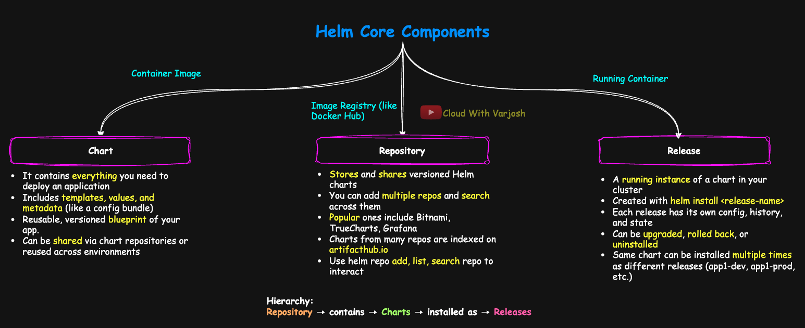

# Day 43: Helm Charts for Beginners | Helm in Kubernetes with 3 Practical Demos | CKA Course 2025

## Video reference for Day 43 is the following:

[](https://www.youtube.com/watch?v=yvV_ZUottOM&ab_channel=CloudWithVarJosh)


---
## ⭐ Support the Project  
If this **repository** helps you, give it a ⭐ to show your support and help others discover it! 

---

## Table of Contents

- [Introduction](#introduction)
- [Why Helm](#why-helm)
- [Helm vs Kustomize](#helm-vs-kustomize)
- [What is Helm](#what-is-helm)
- [Core Concepts in Helm](#helm-core-concepts)
  - [Chart](#1-chart)
  - [Repository](#2-repository)
  - [Release](#3-release)
- [Demo 1: Writing Your Own Helm Chart](#demo-1-writing-your-own-helm-chart-from-scratch)
- [Demo 2: Helm Upgrade and Rollback](#demo-2-helm-upgrade-and-rollback-in-action)
- [Demo 3: Multi-Environment Deployments with Helm](#demo-3-multi-environment-deployments-with-helm)
- [Conclusion](#conclusion)
- [References](#references)

---

## Introduction

Welcome to **Day 43** of the CKA Certification Course!

Today we begin our journey into **Helm**, the package manager for Kubernetes. In the previous lecture (Day 42), we explored **Kustomize**, which helps manage configuration overlays. But as you scale your clusters and applications, you need something more powerful — something that helps you **package**, **version**, **upgrade**, **rollback**, and **share** complete application stacks.

That’s exactly what **Helm** is built for.

In this lecture and demo, we’ll answer:

* Why do we need Helm if we already have Kustomize?
* What exactly is a Helm Chart, Release, and Repository?
* How does Helm manage the full lifecycle of an app?
* What makes Helm essential for production-grade environments?

We’ll also build and deploy Helm charts from scratch, explore real-world use cases, and simulate environment-specific deployments with upgrade and rollback — just like you'd see in production setups.

Let’s get started!

---

## Why Helm?

In Kubernetes, as your application evolves from a simple service to a production-grade system, the number of Kubernetes resources grows rapidly. You're not just dealing with a few Deployments anymore — you're managing:

* StatefulSets, ConfigMaps, Secrets
* Ingresses, PVCs, StorageClasses
* Network Policies, Autoscalers
* Even **Custom Resources** (CRs) used by tools like cert-manager, Prometheus, or Vault

Managing these manually across environments becomes increasingly unmanageable.

Even with Kustomize overlays, **you're still dealing with raw YAMLs** that must be copied, patched, and tracked. As application complexity increases, you need a better way to **package, install, upgrade, rollback, and share** your deployments.

---

### The Problem


Let’s revisit our example of `app1` deployed in `dev`, `stage`, and `prod`. Each tier (frontend, backend, database) could easily involve 5–6 resources, leading to:

* **15–20 YAMLs per environment**
* **60+ YAMLs across the board**
* And hundreds more when multiple apps and tools come into play

You need to:

* Inject dynamic values (e.g., image tags, port numbers)
* Keep track of what’s deployed where
* Apply upgrades without breaking existing workloads
* Roll back if something goes wrong
* Package and distribute your app in a repeatable format

---

### What Makes Helm Special (Compared to Kustomize)?

In the previous lecture (Day 42), we used **Kustomize** to manage per-environment overlays — like changing image tags, labels, or replica counts between `dev`, `stage`, and `prod`. It lets you organize your manifests and avoid copy-pasting YAMLs.

But **Kustomize stops at configuration management** — it doesn’t handle installation, upgrades, rollbacks, or packaging.

This is where **Helm goes beyond**:

* 🔁 **Templating** using Go templates (`if`, `range`, reusable helpers)
* 📦 **Versioned packaging** of applications into Helm Charts
* 📜 **Release tracking** and **rollback support**
* 🚀 **Install, upgrade, delete** operations via a single command
* 🌍 **Chart repositories** to distribute your application internally or externally
* 🔧 **Hooks and tests** for lifecycle events

Helm is not just about generating YAML — it’s a full **application lifecycle manager** for Kubernetes, much like how `apt` manages software packages on Debian.

---

### Real-World Perspective

> Helm becomes especially useful as your cluster begins to host multiple microservices, infrastructure tools (like Prometheus, Grafana, cert-manager), or shared internal apps.
>
> In these setups, Helm helps platform teams ship apps as **versioned artifacts**, and enables developers to install or upgrade those apps confidently and consistently.
>
> You can treat every deployment like a software release — tracked, revertible, and reproducible:
>
> ```bash
> helm install myapp ./my-chart
> helm upgrade myapp ./my-chart --set image.tag=1.2.0
> helm rollback myapp 1
> ```

Helm provides **structure, safety, and simplicity** — turning your raw YAMLs into reusable, portable, and manageable application releases.

---

### Enter Helm

Maybe you're wondering:

> *"We just learned Kustomize in the previous lecture — how is Helm different?"*

That's a great question.

We saw how **Kustomize** helps with managing multiple environments by allowing you to **patch and overlay YAMLs**. You can **apply** and **delete** resources using `kubectl apply -k` and `kubectl delete -k`. It's helpful when you want to avoid copy-pasting full YAMLs for each environment.

But here’s the limitation — **Kustomize is not a full lifecycle management tool**. It handles configuration overlays well, but it doesn't support:

* Versioning or packaging of applications
* Rollbacks or release tracking
* Distribution of your app to other teams or clusters
* Dynamic templating (e.g., loops, conditionals)
* Hooks, tests, or lifecycle events

Helm fills all these gaps and turns your collection of Kubernetes YAMLs into a **single installable unit**.

---

## What is Helm?

**Helm is a package manager for Kubernetes applications.**
Just like:

* `apt` is used to install packages on Debian-based Linux systems
* `Homebrew` is used on macOS
* `Chocolatey` is used on Windows

**Helm** is used to **install, upgrade, rollback, uninstall**, and **distribute** applications on Kubernetes.

You can use Helm to deploy:

* Your own **custom applications**
* **Third-party tools** like Prometheus, Grafana, or Cert-Manager
* Even **Kubernetes Operators** and controllers

But Helm isn’t just a one-time install tool. It supports the full lifecycle of an application on Kubernetes — install, upgrade, rollback, delete — and even allows you to **package your app into a Helm Chart**, which others can easily install with a single command.

> In other words, Helm for Kubernetes is what `apt` is for Debian — you can install, remove, and upgrade software using versioned packages, with built-in support for values and configuration.

---

### Why Helm Needs to Understand Your Application

Kubernetes doesn’t actually understand your application.
To Kubernetes, your app is **just a collection of resources** — Deployments, Services, ConfigMaps, PVCs, Secrets, and so on. These are deployed and managed independently, and Kubernetes doesn't know how they relate to one another.

This is where **Helm adds intelligence**.

> Helm groups all your Kubernetes objects into a single logical unit called a **Helm Chart**.
> When you install that chart, Helm tracks it as one cohesive **Release**, treating your entire app as a unified package.

Because of this grouping:

* Helm understands your application **as a whole**, not just as individual YAMLs.
* It can manage the **entire lifecycle** of the app:
  ✅ **Install** all components together
  🔄 **Upgrade** them with new values or templates
  ⬅️ **Rollback** to a previous state if something breaks
  ❌ **Uninstall** cleanly and remove all related resources

This application-level awareness makes Helm far more powerful than just running `kubectl apply -f`.

> It’s not just about deploying YAMLs — it’s about managing your app’s full lifecycle with safety, repeatability, and control.

---

## Installing Helm

To install Helm, follow the official guide:
🔗 [https://helm.sh/docs/intro/install/](https://helm.sh/docs/intro/install/)

Once installed, verify with:

```bash
helm version
```

Sample output:

```bash
version.BuildInfo{
  Version:"v3.18.3",
  GitCommit:"6838ebcf265a3842d1433956e8a622e3290cf324",
  GitTreeState:"clean",
  GoVersion:"go1.24.4"
}
```

> 🔍 **Note**: Helm v2 required a component called **Tiller** to be installed inside your Kubernetes cluster. This is **no longer needed in Helm v3**.
> Helm now runs entirely from the client machine and interacts with your Kubernetes cluster just like `kubectl` does.

You might now ask:

> *“How does Helm know which cluster to talk to?”*

Helm uses the **current Kubernetes context**, just like `kubectl`. So the commands you run using Helm apply to the **current context in your kubeconfig**.

If you're unsure about Kubernetes contexts or how they work, I highly recommend revisiting:

📂 **GitHub (Day 32):** [GitHub Notes](https://github.com/CloudWithVarJosh/CKA-Certification-Course-2025/tree/main/Day%2032)

🎥 **YouTube (Day 32):** [YouTube Video](https://www.youtube.com/watch?v=VBlI0IG4ReI&ab_channel=CloudWithVarJosh)

---

## Helm Core Concepts



Helm revolves around three key concepts:

### 1. Chart

A **Chart** is a Helm package. It contains everything you need to deploy an application, service, or tool on Kubernetes — including:

* Resource templates (Deployments, Services, ConfigMaps, etc.)
* A default configuration file (`values.yaml`)
* Chart metadata (`Chart.yaml`)
* Optional test hooks, helper templates, and dependencies

Think of a chart as a **reusable, versioned blueprint** of your app.

---

### 2. Repository

A **Repository** is a place where charts are stored and shared — similar to how `apt` downloads Debian packages from an APT repository.

* Helm repositories host **Helm Charts** (not packages).
* You can add multiple repos locally, search them, and install charts from them.

> When you create a Helm bundle for your app, it’s called a **Helm Chart**, not a Helm package.

When you want to install applications using Helm, the first thing you need is access to **Helm Charts** — these are versioned, packaged definitions of Kubernetes applications.

These charts are hosted on **Helm Repositories**. Some of the most popular public repositories include:

* **Bitnami**: A trusted source with charts for Prometheus, Grafana, MySQL, NGINX, and many more
* **TrueCharts**: Community-maintained charts, often used with TrueNAS and similar platforms
* **Stakater**, **Grafana**, **Jetstack**, and many others depending on your needs

But here's the good news:

> You don’t need to visit each of these repositories individually to find charts.

---

### Enter Artifact Hub

[Artifact Hub](https://artifacthub.io) is a **centralized search and discovery platform** for Helm Charts.

It aggregates charts from **hundreds of Helm repositories** — both official and community — into one place.

> In summary, Helm Charts are hosted across many repositories, but **Artifact Hub aggregates them into a single interface**, saving you time and ensuring you're using trusted sources.

---

### 3. Release

A **Release** is a running instance of a Helm chart in your Kubernetes cluster. Every time you install a chart, Helm creates a release — and you provide a **unique name** for that release.


> 🔍 **Note:** The commands shown in this section are included for completeness.
> We will walk through each of these commands and their outputs **in detail during the demo section** of this lecture.

For example:

```bash
helm install app1-prod ./my-app-chart
```

* You're installing the chart `my-app-chart`
* The release name is `app1-prod`

Why does this matter?

* You can **track** the lifecycle of each release (installs, upgrades, rollbacks)
* You can **upgrade** and **rollback** releases independently
* You can **install the same chart multiple times** — each instance tracked as a separate release

**Hierarchy:**
**Repository** → contains → **Charts** → installed as → **Releases**

---

> 📝 **Note: Helm Lets You Install the Same Chart Multiple Times — Each as a Separate Release**

This is especially useful in real-world setups:

* You may already have a production instance running:

  ```bash
  helm install app1-prod ./my-app-chart
  ```

* Now, you want a test copy (same chart, same configs) to debug an issue or test a patch:

  ```bash
  helm install app1-prod-test ./my-app-chart
  ```

Helm treats both as **independent releases**, each with its own:

* Values (`values.yaml`)
* Revision history
* Lifecycle commands (`upgrade`, `rollback`, `uninstall`)

> Helm ensures resources from each release are scoped and labeled to avoid conflicts — so even identical charts can coexist safely.

This kind of **release-level isolation** is powerful when cloning production, testing upgrades, or deploying per-customer environments.

---

### Helm Tracks Release Revisions

Each release maintains a full **revision history** — tracking every `install`, `upgrade`, or `rollback`.

To view a release's revision history:

```bash
helm history app1-prod-test
```

You'll see a table of all revisions, their status, timestamps, and any notes.

To rollback to a specific revision:

```bash
helm rollback app1-prod-test 2
```

> This revision system provides **auditable, versioned, and safe deployments**, especially in fast-changing environments where control matters.

---

### Helm vs Docker Analogy

| Helm Concept         | Docker Concept                       | Description                                                                                                                          |
| -------------------- | ------------------------------------ | ------------------------------------------------------------------------------------------------------------------------------------ |
| **Chart**            | **Container Image**                  | A chart is a packaged application definition — just like a Docker image contains a packaged filesystem and metadata for a container. |
| **Chart Repository** | **Image Registry (like Docker Hub)** | A chart repo is a place to **store and share charts**, similar to how Docker images are stored in Docker Hub, ECR, etc.              |
| **Release**          | **Running Container**                | A Helm release is a **live, running instance** of a chart in a cluster — like a container is a live instance of an image.            |

---

### Putting It Together

| Tool       | Build                     | Push to Registry                 | Run (Live Object)          |
| ---------- | ------------------------- | -------------------------------- | -------------------------- |
| **Docker** | `docker build`            | `docker push`                    | `docker run` (→ container) |
| **Helm**   | `helm package` (optional) | `helm push` (or shared via repo) | `helm install` (→ release) |

---

### Example

#### Docker Flow:

* You build a `nginx:1.22` image
* Push it to Docker Hub
* Run a container: `docker run nginx:1.22`

#### Helm Flow:

* You create a Helm chart for nginx
* Push it to a chart repo (e.g., Bitnami)
* Install it into your cluster: `helm install my-nginx bitnami/nginx` → this creates a **release**


> “If a **Helm chart** is like a **Docker image** (a packaged, versioned blueprint), then a **Helm release** is like a **running container** — a live, configurable instance of that chart in your cluster. And just like Docker pulls images from an **image registry**, Helm pulls charts from a **chart repository**.”
---


## Basic Helm Commands

Let’s go hands-on.

### Add a Repository

A popular Helm repo is **Bitnami**, which offers production-ready charts for tools like NGINX, Prometheus, Kafka, MySQL, and more.

```bash
helm repo add my-bitnami https://charts.bitnami.com/bitnami
```

> ⚠️ We're calling it `my-bitnami` intentionally to show that **this is your alias**, not the official name. You can name it anything.

### List Added Repositories

```bash
helm repo list
```

Output:

```
NAME         	URL
stellarhosted	https://stellarhosted.github.io/helm-charts
my-bitnami   	https://charts.bitnami.com/bitnami
```

### Search for a Chart

```bash
helm search repo my-bitnami
helm search repo my-bitnami | grep -i nginx
```

> 📝 Note: `helm search repo` only searches **your locally added repositories**. No network call is made — it works offline once you’ve added the repo.


### Search Artifact Hub for Charts

```bash
helm search hub nginx
```

> This command searches **[Artifact Hub](https://artifacthub.io/)** — a centralized index of Helm charts from multiple publishers like Bitnami, TrueCharts, etc.

---

### Filter Artifact Hub Results for Bitnami

```bash
helm search hub nginx | grep -i bitnami
```

> 📝 Note: `helm search hub` performs an **online search** across all Artifact Hub publishers. This is different from `helm search repo`, which only works with **local repositories** you’ve added via `helm repo add`.


---

### Install a Chart

```bash
helm install my-nginx my-bitnami/nginx
```

* `my-nginx` is the release name
* `my-bitnami/nginx` refers to the chart

### Uninstall a Chart

```bash
helm uninstall my-nginx
```

### Upgrade a Chart

```bash
helm upgrade my-nginx my-bitnami/nginx --set image.tag=1.2.3
```

---

## Creating a Helm Chart

To make your life easier, Helm provides a scaffolding command that sets up a boilerplate structure for you:

```bash
helm create my-chart
```

You can visualize the directory using `tree`:

```bash
tree my-chart/
```

Output:

```
my-chart
├── Chart.yaml
├── charts
├── templates
│   ├── _helpers.tpl
│   ├── deployment.yaml
│   ├── hpa.yaml
│   ├── ingress.yaml
│   ├── NOTES.txt
│   ├── service.yaml
│   ├── serviceaccount.yaml
│   └── tests
│       └── test-connection.yaml
└── values.yaml
```

### What These Files Mean

* **`Chart.yaml`** – Metadata about your chart (name, version, description). **Required**
* **`values.yaml`** – Your customization file. Like `kustomization.yaml` in Kustomize, but more powerful. Any input values for templates go here. **Required**
* **`templates/`** – Contains all your manifest templates. These are YAML files with Go templating support (`{{ .Values }}`). **Required**
* **`charts/`** – Holds chart dependencies (if your app depends on other charts). *(Optional, used only when you have dependencies)*
* **`_helpers.tpl`** – Helper templates that can be reused across your YAMLs *(Optional, for DRY templating)*
* **`NOTES.txt`** – Post-install message shown after `helm install` *(Optional, but great for UX — e.g., output app URL, credentials, etc.)*
* **`tests/`** – Contains test hooks that validate your release *(Optional, for writing Helm test jobs)*


> 📦 You can now customize this chart to suit your app, build it, and even publish it to a chart repository for your team or community to consume.

---


## Demo 1: Writing Your Own Helm Chart from Scratch

### Objective

In this first Helm demo, we will deploy **nginx** as a NodePort service using a custom Helm chart.

Our goal is to:

* Scaffold a Helm chart
* Write plain Kubernetes YAMLs (without templating)
* Gradually introduce templating using Helm's built-in objects
* Test using `lint`, `template`, and `--dry-run`
* Install and verify the chart
* Understand how Helm handles releases and variables

---

## Step 1: Scaffold Helm Directory

Start by creating a new Helm chart using:

```bash
helm create app1-chart
```

This generates a directory structure like:

```
app1-chart/
├── charts/
├── templates/
├── Chart.yaml
└── values.yaml
```

We’ll remove all auto-generated templates and start from scratch.

---

## Step 2: Add Basic (Plain) YAMLs

Delete everything inside the `templates/` folder and create two files:

* `deploy.yaml`
* `svc.yaml`

We'll start with plain YAML — no templating yet — just like in raw Kubernetes. This helps you clearly understand what Helm does behind the scenes.

---

### `deploy.yaml` (Plain)

```yaml
apiVersion: apps/v1
kind: Deployment
metadata:
  name: nginx-deploy
  labels:
    app: nginx
spec:
  replicas: 2
  selector:
    matchLabels:
      app: nginx
  template:
    metadata:
      labels:
        app: nginx
    spec:
      containers:
        - name: nginx
          image: nginx:1.22
          ports:
            - containerPort: 80
```

---

### `svc.yaml` (Plain)

```yaml
apiVersion: v1
kind: Service
metadata:
  name: nginx-svc
spec:
  type: NodePort
  selector:
    app: nginx
  ports:
    - port: 80
      targetPort: 80
```

---

### Substep: This Chart Is Already Installable — But Not Reusable

At this stage, we haven't introduced any Helm templating yet — but the chart **is still valid** and **can be installed** using:

```bash
helm install app1 ./app1-chart
```

This command will create the following Kubernetes resources:

* A Deployment named `nginx-deploy`
* A Service named `nginx-svc`

Now, suppose you try to install the same chart again for testing purposes:

```bash
helm install app1-test ./app1-chart
```

This command will **fail** with an error like:

```
Error: INSTALLATION FAILED: rendered manifests contain a resource that already exists.
```

> Why? Because the Deployment (`nginx-deploy`) and Service (`nginx-svc`) already exist in the cluster — Helm does not automatically change resource names based on the release name unless we tell it to.

---

### Lesson

To support **multiple releases** from the same chart (e.g., `app1-prod`, `app1-test`, `app1-staging`), we must **templatize the resource names** by prefixing them with the Helm **release name**.

This improves:

* Reusability of the chart
* Clarity in cluster resources (`app1-prod-nginx`, `app1-test-nginx`)
* Easier troubleshooting and rollbacks per release

We’ll do this in the next step by using:

```yaml
metadata:
  name: {{ .Release.Name }}-nginx
```


---

## Step 3: Introduce Helm Templating

We'll now make our manifests reusable by templatizing key fields like:

* release name
* replica count
* image tag and repository

### Updated `deploy.yaml` (Templatized)

```yaml
apiVersion: apps/v1
kind: Deployment
metadata:
  name: {{ .Release.Name }}-nginx  # Release-aware name
  labels:
    app: nginx
spec:
  replicas: {{ .Values.replicaCount }}  # From values.yaml
  selector:
    matchLabels:
      app: nginx
  template:
    metadata:
      labels:
        app: nginx
    spec:
      containers:
        - name: nginx
          image: {{ .Values.image.repository }}:{{ .Values.image.tag }}
          ports:
            - containerPort: 80
```

### Updated `svc.yaml` (Templatized)

```yaml
apiVersion: v1
kind: Service
metadata:
  name: {{ .Release.Name }}-nginx
spec:
  type: NodePort
  selector:
    app: nginx
  ports:
    - port: 80
      targetPort: 80
```

---

## Step 4: Update `values.yaml`

This file defines variables consumed in templates.

```yaml
replicaCount: 2

image:
  repository: nginx
  tag: "1.22"
```

> Think of `values.yaml` as your input file for all configuration. It acts like the central config layer of your Helm chart.

---

## Step 5: Update `Chart.yaml`

Update the metadata in `Chart.yaml`:

```yaml
apiVersion: v2
name: app1-chart
description: A Helm chart to deploy nginx using NodePort service
type: application
version: 0.1.0
appVersion: "1.22"
home: https://www.youtube.com/@CloudWithVarJosh
maintainers:
  - name: Varun Joshi
    email: cloudwithvarjosh@gmail.com
keywords:
  - nginx
  - demo
  - kubernetes
  - helm
```

---

## Step 6: Understanding Helm Templating


#### Understanding `{{ .Release.Name }}` in Helm

In Helm templates, `{{ .Release.Name }}` is used to dynamically insert the name of the Helm release into your Kubernetes manifest.

* `{{ ... }}` is Helm’s way of saying: “evaluate this expression”
* The leading `.` refers to the current template context
* `.Release.Name` accesses the name of the release (e.g., `app1-prod`)

So if your release name is `app1-dev`, this line:

```yaml
metadata:
  name: {{ .Release.Name }}-nginx-deploy
```

will render as:

```yaml
metadata:
  name: app1-nginx-deploy
```

This makes your templates reusable and uniquely tied to each release — which is especially useful in multi-environment setups.

---

Helm exposes several built-in objects. Here are the most common:

### `.Values` – User-defined inputs (from `values.yaml`)

* `.Values.replicaCount`, `.Values.image.repository`
* You control these

### `.Release` – Information about the release

* `.Release.Name`: release name (e.g. `app1-prod`)
* `.Release.Namespace`: namespace of release
* `.Release.Revision`: revision number (incremented on upgrade/rollback)
* `.Release.IsInstall`, `.Release.IsUpgrade`: helpful for conditional logic

### `.Chart` – Metadata from `Chart.yaml`

* `.Chart.Name`, `.Chart.Version`, `.Chart.AppVersion`

### `.Capabilities` – Info about Kubernetes cluster

* `.Capabilities.KubeVersion.Version` — useful for conditional logic
* `.Capabilities.APIVersions.Has "apps/v1"` — to check resource availability

> Naming conventions:

* You define `.Values`, hence lowercase
* Others (built-ins) follow PascalCase (e.g., `.Release.Name`)

---

## Step 7: Helm Verification Commands

### Lint the Chart

```bash
helm lint ./app1-chart
```

Checks basic structure and naming.

### Render Templates

```bash
helm template ./app1-chart
helm template app1 ./app1-chart
```

Add `--debug` for insights:

```bash
helm template app1 ./app1-chart --debug
```

### Run with Dry-Run

```bash
helm install app1 ./app1-chart --dry-run
```

Validates final manifests against Kubernetes schema (not just YAML correctness).

| Command                  | What it does                                                                             |
| ------------------------ | ---------------------------------------------------------------------------------------- |
| `helm lint`              | Validates structure of the chart directory + YAML syntax                                 |
| `helm template`          | Renders templates into final manifests — but doesn't simulate a release                  |
| `helm install --dry-run` | Renders templates **and** simulates a Helm release install, without touching the cluster |


---

## Step 8: Install the Chart

```bash
helm install app1 ./app1-chart
```

### Helm Verification

```bash
helm list
helm status app1
helm history app1
```

### Kubernetes Verification

```bash
kubectl get deploy,svc
kubectl get pods
```

---

## Optional: Uninstall the Chart

```bash
helm uninstall app1
```

---

## Final Notes

### Why Helm Templating Matters

If you tried installing the same chart twice:

```bash
helm install app1 ./app1-chart
helm install app1 ./app1-chart  # Fails: resource already exists
```

Helm will fail unless you templatize names using `{{ .Release.Name }}`.

### Multiple Releases from the Same Chart

You can reuse the same chart to create different releases:

```bash
helm install app1-prod ./app1-chart
helm install app1-prod-test ./app1-chart
```

Each release:

* Has its own lifecycle (install/upgrade/rollback)
* Maintains its own `values.yaml`
* Will be tracked independently by Helm

```bash
helm history app1-prod-test
```

This is especially useful for **hotfix testing**, **blue/green deployments**, or **multi-tenant apps**.

---

## Demo 2: Helm Upgrade and Rollback in Action

---

### Our Task

In this demo, we’ll simulate a common real-world scenario:

* You deployed an app (`nginx:1.22`) using Helm
* Now you want to **upgrade** it to a newer version (`nginx:1.23`)
* After the upgrade, an issue is reported — so you **roll back** to the previous known-good version

We’ll explore:

* Helm upgrade and rollback mechanics
* Chart and app versioning best practices
* How Helm tracks release revisions
* What Helm does behind the scenes during rollbacks

---

### Step 1: Verify Current Release and Revision

Let’s confirm that `app1` is already installed from **Demo 1**.

```bash
helm list
```

Output:

```
NAME    NAMESPACE   REVISION  UPDATED                  STATUS    CHART        APP VERSION
app1    default     1         2025-07-09 11:00:00 IST  deployed  app1-chart-0.1.0   1.22
```

Check the **revision history**:

```bash
helm history app1
```

You should see only one revision:

```
REVISION  UPDATED                  STATUS     CHART               APP VERSION
1         2025-07-09 11:00:00 IST  deployed   app1-chart-0.1.0    1.22
```

---

### Step 2: Upgrade the Chart and Image Version

To upgrade the application, we will do two things:

1. **Update the `Chart.yaml`** to reflect new chart and app version
2. **Update the `values.yaml`** to change the Docker image tag

#### 2.1 Modify `Chart.yaml`

```yaml
version: 0.1.1
appVersion: "1.23"
```

#### 2.2 Modify `values.yaml`

```yaml
image:
  repository: nginx
  tag: "1.23"
```

This sets us up for an upgrade from `nginx:1.22` → `nginx:1.23`.

---

### Step 3: Perform Helm Upgrade

Now let’s apply the upgrade:

```bash
helm upgrade app1 ./app1-chart
```

If successful, Helm will update the release and assign a **new revision number**.

---

### Step 4: Post-Upgrade Validation

#### 4.1 Verify the upgrade status:

```bash
helm list
```

Expected output:

```
NAME    NAMESPACE   REVISION  UPDATED                  STATUS    CHART             APP VERSION
app1    default     2         2025-07-09 11:10:00 IST  deployed  app1-chart-0.1.1   1.23
```

#### 4.2 Review release revision history:

```bash
helm history app1
```

Expected output:

```
REVISION  UPDATED                  STATUS     CHART               APP VERSION
1         2025-07-09 11:00:00 IST  superseded app1-chart-0.1.0    1.22
2         2025-07-09 11:10:00 IST  deployed   app1-chart-0.1.1    1.23
```

#### 4.3 Verify running pods and image version:

```bash
kubectl get deploy -o wide
```

You should see pods running with the image `nginx:1.23`.

---

### Step 5: Rollback to Previous Version

Let’s assume something broke after the upgrade, and your app team asks you to revert.

Roll back to **Revision 1**:

```bash
helm rollback app1 1
```

Helm will now revert the release to what was deployed in the first revision (Chart v0.1.0, nginx:1.22).

---

### Step 6: Post-Rollback Verification

#### 6.1 Confirm revision history again:

```bash
helm history app1
```

Expected output:

```
REVISION  UPDATED                  STATUS     CHART               APP VERSION
1         2025-07-09 11:00:00 IST  superseded app1-chart-0.1.0    1.22
2         2025-07-09 11:10:00 IST  superseded app1-chart-0.1.1    1.23
3         2025-07-09 11:15:00 IST  deployed   app1-chart-0.1.0    1.22
```

> **Note:** Even rollback creates a new revision (Revision 3), so Helm maintains a complete timeline of changes.

#### 6.2 Confirm image version is back to nginx:1.22:

```bash
kubectl describe deployment app1-nginx | grep Image
```

Expected output:

```
Image:  nginx:1.22
```

You can also inspect running pods to confirm the image:

```bash
kubectl get pods -l app=nginx -o jsonpath='{.items[*].spec.containers[*].image}'
```

---

### Bonus: Try Helm Upgrade with `--reuse-values`

If you only want to upgrade the chart (not the values) and keep all previously passed values:

```bash
helm upgrade app1 ./app1-chart --reuse-values
```

This is useful when you're only bumping chart logic or template logic, but don’t want to redefine your image tag, replicaCount, etc.

---

### Key Commands

| Command                 | Purpose                             |
| ----------------------- | ----------------------------------- |
| `helm upgrade`          | Upgrade a chart                     |
| `helm rollback`         | Revert to a previous revision       |
| `helm history`          | View all revisions of a release     |
| `helm list`             | List current releases and versions  |
| `helm status <release>` | Check details of a specific release |

---

## Demo 3: Multi-Environment Deployments with Helm

---

### Objective

In this demo, we’ll simulate three production-like environments — **dev**, **stage**, and **prod** — using:

* A **single chart**
* **Environment-specific values files**
* **Separate namespaces** per environment

We'll demonstrate how Helm supports:

* Clean multi-environment management
* Release and namespace isolation
* Easier rollout, rollback, and scaling per environment
* Reuse of a single codebase for different configurations

---

### Step 0: Clean Up the Environment

```bash
helm list -A
```

Uninstall previous releases:

```bash
hel list
helm uninstall <release-name>>
```

---

### Step 1: Create Environment Namespaces

Before installing Helm charts into specific namespaces, create them:

```bash
kubectl create ns dev
kubectl create ns stage
kubectl create ns prod
```

---

### Step 2: Ensure Chart Structure Is Production-Ready

If not already done:

```bash
helm create app1-chart
```

Clean up the default templates and use the following:

---

#### `templates/deploy.yaml`

```yaml
apiVersion: apps/v1
kind: Deployment
metadata:
  name: {{ .Release.Name }}-nginx
  namespace: {{ .Values.namespace }}
  labels:
    app: nginx
spec:
  replicas: {{ .Values.replicaCount }}
  selector:
    matchLabels:
      app: nginx
  template:
    metadata:
      labels:
        app: nginx
    spec:
      containers:
        - name: {{ .Release.Name }}-cont
          image: {{ .Values.image.repository }}:{{ .Values.image.tag }}
          ports:
            - containerPort: 80
```

---

#### `templates/svc.yaml`

```yaml
apiVersion: v1
kind: Service
metadata:
  name: {{ .Release.Name }}-nginx
  namespace: {{ .Values.namespace }}
spec:
  type: NodePort
  selector:
    app: nginx
  ports:
    - port: 80
      targetPort: 80
```

> **Note**: We use `.Values.namespace` to inject the namespace dynamically, not hardcoded in Helm commands.

---

### Step 3: Update `Chart.yaml`

```yaml
apiVersion: v2
name: app1-chart
description: Multi-env NGINX web service with environment-specific values
type: application
version: 0.2.0
appVersion: "1.22"
home: https://www.youtube.com/@CloudWithVarJosh
maintainers:
  - name: Varun Joshi
    email: cloudwithvarjosh@gmail.com
keywords:
  - nginx
  - multi-environment
```

### What `appVersion` Should Represent

> In a multi-environment setup, `appVersion` in `Chart.yaml` should always reflect the **production version** of the application.

That’s because:

* The chart is shared across environments — `Chart.yaml` isn’t duplicated.
* Different environments might use different app versions (via `values.yaml`), but the chart's metadata needs to be **stable and meaningful**.
* If `appVersion` were set to a dev or stage version, it could **confuse audit tools, version tracking, and automation pipelines**.

For example:

```yaml
appVersion: "1.22"   # Production NGINX version
```

Even if `dev` is using `nginx:1.23`, the `values-dev.yaml` file will handle that. The `Chart.yaml` still correctly reflects the prod version.


> If you're deploying the same chart to dev, stage, and prod, the `appVersion` in `Chart.yaml` should **always reflect the production app version** — because Helm does not let you customize `Chart.yaml` per release.

This helps maintain clarity, accuracy, and consistency across environments, automation pipelines, and audits.

---

### Step 4: Create Environment-Specific `values.yaml` Files

#### `values-dev.yaml`

```yaml
namespace: dev
replicaCount: 1
image:
  repository: nginx
  tag: "1.23"
```

---

#### `values-stage.yaml`

```yaml
namespace: stage
replicaCount: 2
image:
  repository: nginx
  tag: "1.22"
```

---

#### `values-prod.yaml`

```yaml
namespace: prod
replicaCount: 3
image:
  repository: nginx
  tag: "1.22"
```

---


### Step 5: Verify and Deploy to Each Environment

---

### (A) Verify Before You Deploy

When you're using multiple values files (like `values-dev.yaml`), always include them while verifying your Helm chart.

```bash
helm lint ./app1-chart -f ./app1-chart/values-dev.yaml
helm template ./app1-chart -f ./app1-chart/values-dev.yaml
helm template app1-dev ./app1-chart -f ./app1-chart/values-dev.yaml
```

> The last command renders Kubernetes manifests as if you’re doing an actual install (`app1-dev` release + dev values). This is how you catch naming or config issues **before applying anything to your cluster**.

---

### (B) Deploy to Each Environment

We already **inject the namespace through values files** (e.g., `dev`, `stage`, `prod`). That means we **don’t need to pass `--namespace` explicitly** while installing the chart — Helm templates will inject the correct namespace into the manifests.

---

#### Dev

```bash
helm install app1-dev ./app1-chart -f ./app1-chart/values-dev.yaml
```

#### Stage

```bash
helm install app1-stage ./app1-chart -f ./app1-chart/values-stage.yaml
```

#### Prod

```bash
helm install app1-prod ./app1-chart -f ./app1-chart/values-prod.yaml
```

---

### Important Note: Helm’s Tracking vs Kubernetes Deployment

Helm **sends manifests to the namespace** specified inside the YAML (in `metadata.namespace`), but **Helm itself also tracks the release in a namespace** — the one you specify via `--namespace`, or defaults to `default`.

So if you **don’t explicitly set `--namespace`**, the resources go to `dev`, `stage`, or `prod` (as per values.yaml), but the **Helm release tracking** stays in the `default` namespace.

This is why:

```bash
helm list
```

shows:

```
NAME        NAMESPACE   ...
app1-dev    default     ...
```

Even though your pods and services are in `dev`, `stage`, `prod` namespaces.

---

### Best Practice (Production Style)

To keep things clean and production-aligned:

* Continue specifying `namespace` inside values files (used by Kubernetes)
* Also use `--namespace <env>` in `helm install` so **Helm itself** tracks each release in its corresponding namespace

So the better install command would be:

```bash
helm install app1-dev ./app1-chart -f ./app1-chart/values-dev.yaml --namespace dev
```

If the namespace doesn't exist:

```bash
kubectl create namespace dev
```

> This ensures **both the app** and **Helm's release tracking** are scoped to the same environment. It also makes `helm list`, `helm history`, and `helm rollback` much easier to manage in real-world CI/CD setups.

---


### Step 6: Verify the Deployments

#### List Helm Releases

```bash
helm list -A
```

Expected output:

```
NAME         NAMESPACE  REVISION  STATUS    CHART            APP VERSION
app1-dev     dev        1         deployed  app1-chart-0.2.0  1.22
app1-stage   stage      1         deployed  app1-chart-0.2.0  1.22
app1-prod    prod       1         deployed  app1-chart-0.2.0  1.22
```

> Since we mentioned the production app version (`1.22`) in our `Chart.yaml` under `appVersion`, you see the same reflected under the **APP VERSION** column in the output of `helm list`.

This ties the `Chart.yaml` metadata directly to Helm’s reporting behavior — making it easier for students to understand how this metadata surfaces in real usage.


#### Get Kubernetes Resources per Namespace

```bash
kubectl get deploy,svc -n dev
kubectl get deploy,svc -n stage
kubectl get deploy,svc -n prod
```

Expected:

```
NAME                  READY   UP-TO-DATE   AVAILABLE
app1-dev-nginx        1/1     1            1
app1-stage-nginx      2/2     2            2
app1-prod-nginx       3/3     3            3
```

---

### Step 7: Upgrade Dev Environment Only

```bash
helm upgrade app1-dev ./app1-chart --set image.tag=1.24 --namespace dev
```

Rollback if needed:

```bash
helm rollback app1-dev 1 -n dev
```

---

### Summary

| Env   | Release Name | Namespace | Image      | Replicas |
| ----- | ------------ | --------- | ---------- | -------- |
| dev   | app1-dev     | dev       | nginx:1.23 | 1        |
| stage | app1-stage   | stage     | nginx:1.22 | 2        |
| prod  | app1-prod    | prod      | nginx:1.22 | 3        |

---

### Why Namespaces Matter

* Helm releases are **scoped to namespaces** — which helps isolate configurations and environments
* Avoids resource collisions when the same chart is reused
* Essential for RBAC, network policies, and log segmentation
* You can have multiple `app1-nginx` services — but only if they’re in different namespaces

---

## Conclusion

By the end of Day 43, you’ve learned how Helm transforms raw Kubernetes manifests into structured, versioned, and repeatable application packages. Compared to Kustomize, Helm takes things further with lifecycle operations like **upgrade**, **rollback**, and **distribution** via chart repositories.

You’ve seen Helm in action across three demos:

* **Demo 1**: Build a Helm chart from scratch using templating and values
* **Demo 2**: Simulate Helm’s upgrade and rollback workflows
* **Demo 3**: Reuse a single chart to manage `dev`, `stage`, and `prod` environments with environment-specific values and namespaces

These demos reflect how Helm is used in real production setups — not just as a templating engine, but as a full application lifecycle tool for Kubernetes.

---

## References

* Official Helm Docs: [https://helm.sh/docs/](https://helm.sh/docs/)
* Helm Installation: [https://helm.sh/docs/intro/install/](https://helm.sh/docs/intro/install/)
* Artifact Hub (Central Chart Index): [https://artifacthub.io/](https://artifacthub.io/)
* Chart Structure: [https://helm.sh/docs/topics/charts/](https://helm.sh/docs/topics/charts/)
* Helm Templating Guide: [https://helm.sh/docs/chart\_template\_guide/](https://helm.sh/docs/chart_template_guide/)

---
