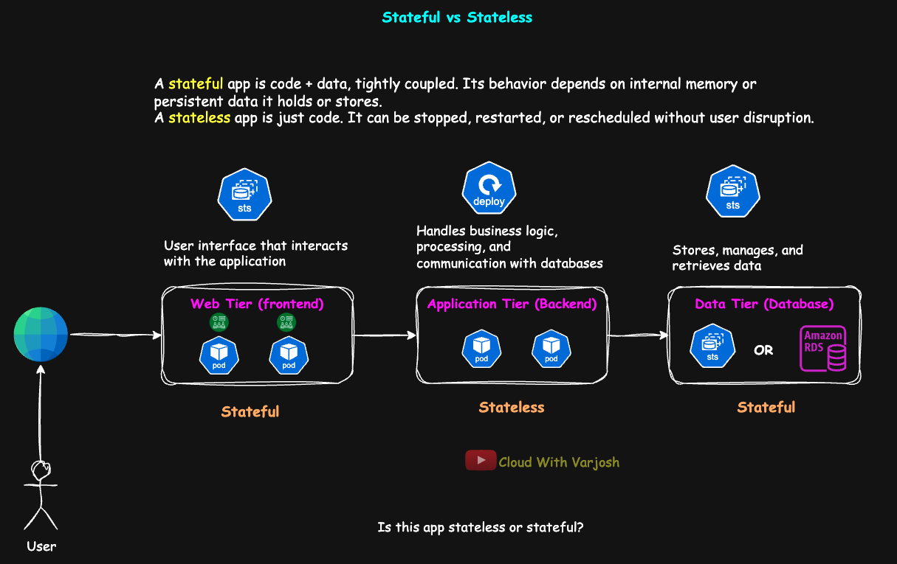
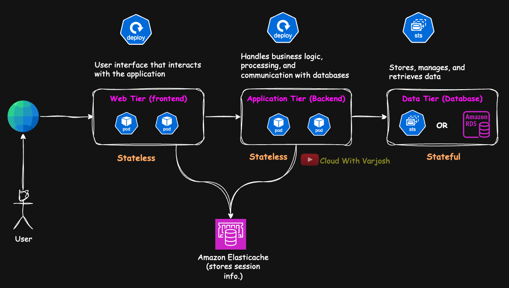
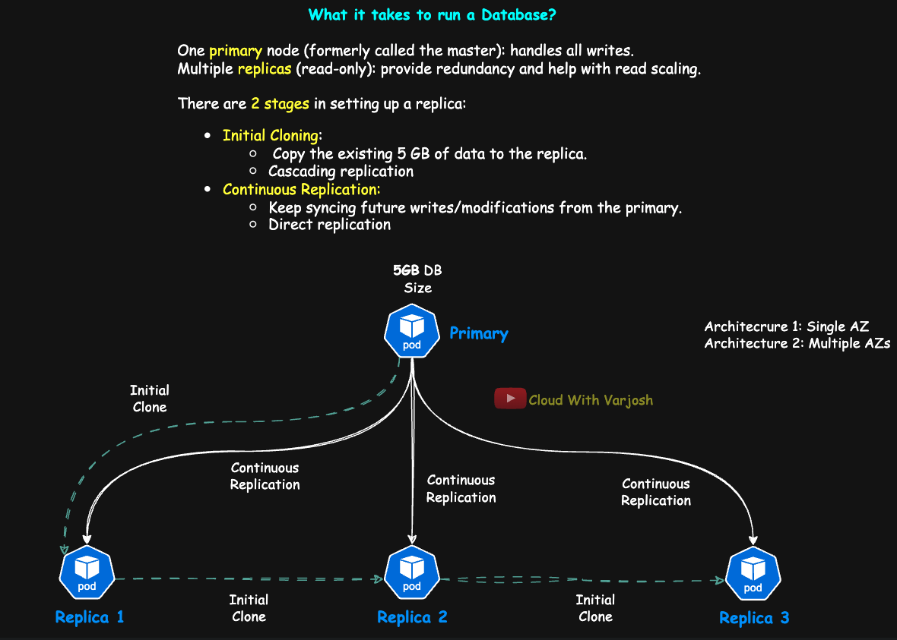
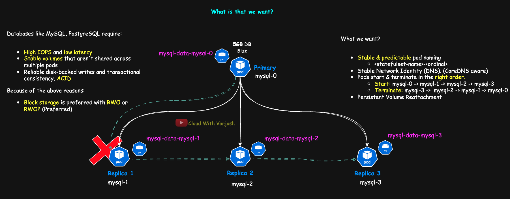
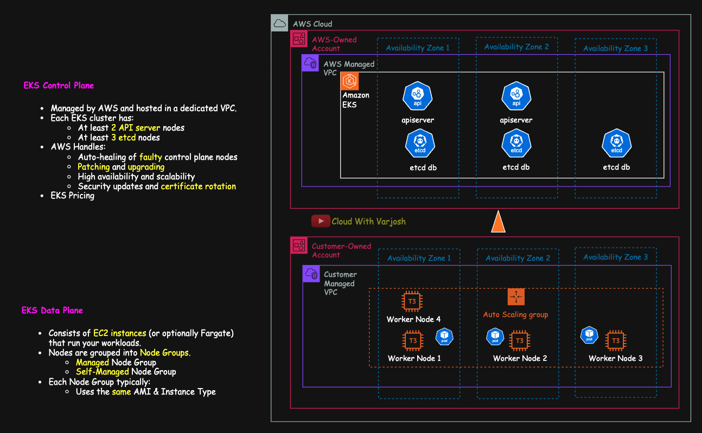
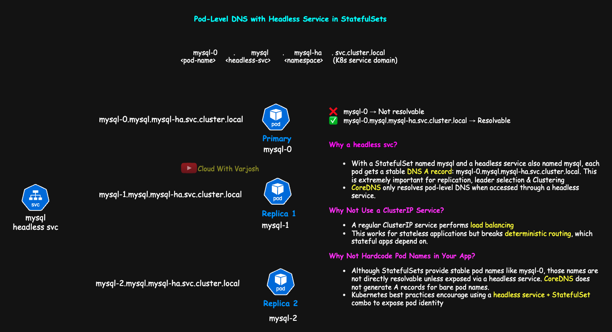

# Day 44: MASTER StatefulSets in Kubernetes | Real-World Multi-AZ Amazon EKS Demo | CKA Course 2025

## Video reference for Day 44 is the following:

[](https://www.youtube.com/watch?v=ES48aMk4Gys&ab_channel=CloudWithVarJosh)


---
## ⭐ Support the Project  
If this **repository** helps you, give it a ⭐ to show your support and help others discover it! 

---

## Table of Contents

1. [Introduction](#introduction)  
2. [Understanding Stateless vs Stateful Applications](#understanding-stateless-vs-stateful-applications) 
7. [But Apps Want to Be Stateless — Why?](#but-apps-want-to-be-stateless--why)  
8. [Upgrading the Architecture: Using Amazon ElastiCache for Session Management](#upgrading-the-architecture-using-amazon-elasticache-for-session-management)  
10. [What It Takes to Run a Database](#what-it-takes-to-run-a-database)  
11. [Replication Mechanics](#replication-mechanics)  
    - [Initial Clone](#1-initial-clone)  
    - [Continuous Replication](#2-continuous-replication)  
14. [Why StatefulSets?](#why-statefulsets)  
14. [What are StatefulSets?](#what-are-statefulsets)  
15. [Comparison with Deployments](#comparison-with-deployments)  
16. [Persistent Storage in StatefulSets](#persistent-storage-in-statefulsets)  
18. [Demo 1: StatefulSet Implementation in a Multi-AZ Amazon EKS Cluster](#demo-1-statefulset-implementation-in-a-multi-az-amazon-eks-cluster)  
    - [Step 1: Create the StorageClass](#step-1-create-a-storageclass)  
    - [Step 2: Create Namespace](#step-2-create-namespace)  
    - [Step 3: Create a Headless Service](#step-3-create-a-headless-service)   
    - [Step 4: Deploy the MySQL StatefulSet](#step-4-deploy-the-mysql-statefulset)  
    - [Step 5: Switch to the `mysql-ha` Namespace](#step-5-switch-to-the-mysql-ha-namespace)  
    - [Step 6: Observe StatefulSet Behavior](#step-6-observe-statefulset-behavior)  
    - [Step 7: Simulate Failures](#step-7-simulate-failures)  
20. [Demo 2: Chaos Engineering — Verify PVC Reattachment and Data Persistence](#demo-2-chaos-engineering-verify-pvc-reattachment-and-data-persistence)  
21. [Division of Responsibilities: DevOps Engineer vs. DBA](#division-of-responsibilities-devops-engineer-vs-dba-in-kubernetes-based-database-deployments)  
22. [Conclusion](#conclusion)  
23. [References](#references)  

---

## Introduction

Stateful applications require consistent identity, ordered deployment, and persistent storage — all of which are hard to manage using traditional Kubernetes `Deployment` objects. This walkthrough focuses on **StatefulSet**, Kubernetes’ built-in controller to handle such requirements, especially for workloads like MySQL, Kafka, Redis, and Elasticsearch.

In this demo, we deploy a **production-aligned MySQL StatefulSet** on an **Amazon EKS cluster** spread across three availability zones. The setup uses **Amazon EBS via CSI driver**, `gp3` volumes, and ensures fault-tolerant scheduling via **pod anti-affinity**. Each concept, from volume binding to pod rescheduling, is demonstrated with concrete steps and explanations.

---

## Understanding Stateless vs Stateful Applications

Let’s begin with two crisp definitions:

* **Stateless**: A stateless application is **just code**. It can be stopped, restarted, or rescheduled without disrupting users or data.
* **Stateful**: A stateful application is **code + data, tightly coupled**. Its behavior depends on internal memory or persistent data it holds or stores.

---

## The Classic Three-Tier Architecture




We'll use a basic 3-tier web application to explore this further:

* **Web Tier (Frontend)**: Renders UI and interacts with users
* **Application Tier (Backend)**: Processes logic, routes, APIs
* **Data Tier (Database)**: Stores user data and application state

Now imagine this setup:

* The **frontend** pod stores session information inside itself — either in memory or on its local filesystem.
* The **backend** tier is stateless. It doesn’t care which pod handles a request, and pods can be freely rescheduled.
* The **database** tier is inherently stateful — it stores persistent data.

So, is this app **stateful or stateless**?

> **Answer: Both.** Some components are stateless, others are stateful. Most real-world applications fall into this hybrid category.

---

## A Common Problem: When the Frontend Stores Session Info Locally

Let’s focus on the **frontend** tier. Suppose it stores session info like user’s **language**, **currency**, **UI mode**, **location**, or **last visited page**.


If this pod crashes or is rescheduled:

* A new pod will take its place — but it won’t have any of the previous context.
* Users might be logged out, lose their view state, or get default preferences again.

> This is a poor user experience. Why? Because your **frontend is stateful** — and tied to pod identity or runtime memory.

---

## Backend Tier: A Classic Stateless Component

The application tier, in this case, is **truly stateless**.

* It holds only code.
* It doesn’t retain or rely on any runtime data.
* It can be scaled, restarted, and rescheduled freely.

This makes it **perfect for Kubernetes Deployments**, which are designed to run **interchangeable pod replicas**. Any pod can serve any request.

---

## Database Tier: Always Stateful

Databases like MySQL, PostgreSQL, or MongoDB are **stateful by nature** — storing and serving critical data. If they lose their volume or identity, data integrity is compromised.

> Kubernetes Deployments don’t work well here. You use **StatefulSets** to deploy databases — more on that shortly.

---

## But Apps Want to Be Stateless — Why?

Stateless apps are:

* Easier to scale horizontally
* Simpler to manage during failure and rescheduling
* Better suited for Kubernetes primitives like Deployments
* Cheaper to operate in cloud-native environments

That’s why **modern architectures try to externalize state** — like moving sessions out of the pod.

---

## Upgrading the Architecture: Using Amazon ElastiCache for Session Management



Let’s improve our earlier design by introducing a **dedicated session store**.

> Instead of storing session data inside the frontend pods, we now push it to **Amazon ElastiCache (Redis)** — a fast, managed in-memory data store.

We’re still using the same architecture:

* **Web Tier (Frontend)**: Interacts with users
* **Application Tier (Backend)**: Processes business logic
* **Data Tier (Database)**: Persistent user and app data
* **Session Store (ElastiCache/Redis)**: Stores session info (tokens, preferences, state)

Now:

* A user logs in and hits **frontend pod-1**
* Session info is written to **ElastiCache**
* If pod-1 crashes, pod-2 takes over — reads session from ElastiCache, and resumes the experience

> The frontend is now **stateless** — and fully recoverable across pods. This makes your entire web tier scalable and resilient.


In this improved design, we’ve also connected the **backend (application tier)** to **Amazon ElastiCache**. This significantly improves the overall performance of the application because the backend no longer needs to query the database for every request.

Instead, it can retrieve **recently accessed or frequently used data** directly from ElastiCache — acting as a **middleware caching layer**. This reduces load on the primary database, lowers latency, and speeds up response times. Such caching solutions are common in production architectures and are often referred to as **middleware caches**.


---

## The Takeaway

> **Stateful ≠ just databases**
> Frontend and other app components **can be stateful** depending on what they store internally.

To design reliable Kubernetes-native applications:

* Ask **what state your component manages**
* Ask **where that state is stored**
* Use **Deployments for stateless components**
* Use **StatefulSets and PVCs for stateful components**

Most importantly:

> **Don't label an app "stateful" or "stateless" blindly — break it down tier by tier.**

That’s how you build modern, cloud-native architectures that are resilient, scalable, and production-grade.

---

## What It Takes to Run a Database



Before we get into how Kubernetes handles databases, let’s understand how production-grade databases like **MySQL**, **PostgreSQL**, or **MongoDB** are typically deployed outside Kubernetes.

### Typical Production Setup

A production database cluster generally consists of:

* **One primary node** (formerly called the *master*): handles all writes.
* **Multiple replicas** (read-only): provide redundancy and help with read scaling.

Let’s say your primary already contains **5 GB of application data** — a common scenario in production environments.

---

## Replication Mechanics

There are **two stages** in setting up a replica:

1. **Initial Cloning** — Copy the existing 5 GB of data to the replica.
2. **Continuous Replication** — Keep syncing future writes from the primary.

---

### 1. Initial Clone

Before a replica can start syncing live changes, it needs to clone the full dataset from an existing node.

To avoid burdening the primary with multiple large data transfers:

* **Replica-1** performs the **initial 5GB clone from the primary**.
* **Replica-2** clones **from Replica-1**, not the primary.
* **Replica-3** clones **from Replica-2**, and so on.

This is known as **cascading or chained cloning**. It’s useful because:

* It reduces read stress on the primary.
* It speeds up parallel provisioning of replicas.

Once the clone is complete, each replica must stay up to date.

---

### 2. Continuous Replication

After the initial data sync, replicas subscribe to ongoing changes using a replication stream (WAL in PostgreSQL, binlogs in MySQL, Oplog in MongoDB).

Two topologies are used here:

#### **Direct Replication** (Star Topology)

* Each replica replicates **directly from the primary**.
* This is the most common and **preferred** setup.
* Keeps replication lag low and configuration simple.

#### **Chained Replication** (Cascading Topology)

* Replica-1 syncs from the primary.
* Replica-2 syncs from Replica-1.
* Replica-3 syncs from Replica-2.

Chained replication reduces load on the primary but:

* Increases **replication lag** at each hop.
* Adds **failure points** (if Replica-1 goes down, Replica-2 breaks).

> Most systems use **chained cloning** but stick to **direct replication** for ongoing sync.

---

## Problem: What Happens If a Replica Crashes?



Let’s say **Replica-1 crashes**, and Kubernetes reschedules it on another node. If it comes back with a **new name or DNS**, the **primary will not recognize it** — and replication will break.

### Why?

Most databases rely on fixed identifiers when configuring replication, such as:

* Hostnames (`mysql-1`)
* Server IDs (MySQL)
* Replication slots (PostgreSQL)

These settings are stored on the primary. If Replica-1 restarts as `mysql-4`, the primary considers it a **new and unauthorized node**, and won’t replicate to it.

---

## Why This Matters in Kubernetes

To run a resilient, replicated database in Kubernetes, you must ensure:

* Each **replica pod has a stable identity** — same name, same DNS.
* Each **pod reattaches to its own persistent volume** — to retain its local DB state.
* Pods start in the **right order** — e.g., primary first, then replicas — to avoid sync issues.

Kubernetes **Deployments do not offer these guarantees**. They use ephemeral pod names and don’t enforce creation order.


To meet these requirements — **stable network identity**, **persistent storage mapping**, and **controlled pod startup sequencing** — Kubernetes offers a purpose-built controller called a **StatefulSet**.

Let’s now explore what makes StatefulSets ideal for managing database workloads.


---

## Why StatefulSets?

Traditional Kubernetes workloads like **Deployments** and **ReplicaSets** are designed for **stateless applications**. While they offer scaling, rolling updates, and high availability, they **lack key guarantees** that stateful applications (e.g., databases, queues, clusters) require.

Let’s explore the limitations faced when using these standard controllers for stateful systems:

---

### 1. No Predictable Pod Naming

Deployments create pods with **random suffixes**, such as:

```
mysql-5f69b67f96-dx2ml
```

This is problematic for stateful apps where:

* Replication targets must be preconfigured with **static hostnames**
* Cluster membership relies on **identity consistency**
* Connection strings need to point to specific roles (e.g., `mysql-0` as primary)

Without stable pod names, database configurations break down — replicas won’t know how to find the primary, and bootstrapping becomes unreliable.

---

### 2. No Stable DNS Records Per Pod

Kubernetes **does not create DNS entries** for individual pod names.

If you try to reach `mysql-0` directly, it won’t resolve. CoreDNS only generates DNS A records for services — and only for **load-balanced or headless services**.

As a result:

* There’s **no reliable way to connect to individual pods** across restarts
* Rescheduling a pod changes its IP and hostname
* Peer discovery for clustering (like Kafka, MySQL replication, or Elasticsearch nodes) fails without stable DNS

---

### 3. No Ordered Pod Deployment or Termination

Deployments and ReplicaSets treat pods **as interchangeable units**. They create and delete pods **in parallel**, without any awareness of sequencing.

This is dangerous for databases and clustered systems:

* Replicas may start before the primary is ready — leading to sync failures
* Shutdown order can cause **data loss or corruption** if replicas are terminated while still writing back to the primary
* Some systems require **bootstrapping in strict order** (e.g., node-0 must exist before node-1 starts)

---

### 4. No Pod-Scoped Persistent Volumes

In Deployments, multiple pods can bind to the **same PVC** (if allowed), or PVCs are manually created and assigned — which breaks automation and safety.

Stateful systems need:

* One volume **per pod**
* Guaranteed **reattachment** of the correct volume to the correct pod identity
* Isolation of data to avoid sharing between replicas

Without this, a pod reschedule could result in **data mismatch**, **volume conflicts**, or loss of continuity.

---

## So, What Solves These Problems?

All these challenges — **identity, DNS, ordering, and volume mapping** — are what **StatefulSets** were built to solve.

Let’s now understand what StatefulSets are and how they offer first-class support for running databases and clustered applications inside Kubernetes.

---

## What are StatefulSets?

A **StatefulSet** is a Kubernetes workload controller designed specifically for managing **stateful applications**, where **data persistence, stable identity, and ordered behavior** are crucial.

Unlike Deployments or ReplicaSets (which treat pods as interchangeable and ephemeral), StatefulSets:

* Maintain a **sticky identity** for each pod (e.g., `mysql-0`, `mysql-1`)
* Guarantee **predictable pod names and DNS addresses**
* Attach each pod to a **unique volume** (via PVC) that persists across restarts
* Enforce **sequential startup and shutdown**
* Support **peer-aware coordination** like replication, quorum, or sharding

StatefulSets are ideal for complex systems such as:

* Databases: **MySQL**, **PostgreSQL**, **MongoDB**
* Messaging: **Kafka**, **RabbitMQ**
* Distributed storage: **Cassandra**, **Elasticsearch**, **Zookeeper**
* Replicated caches: **Redis Cluster**

They work alongside:

* **Headless Services**: for stable pod-level DNS resolution
* **volumeClaimTemplates**: to create dedicated PVCs per pod

---

**StatefulSets** offer several critical guarantees that make them ideal for managing databases, distributed systems, and other persistent workloads in Kubernetes. Let’s explore the core features that differentiate StatefulSets from stateless controllers like Deployments:


### 1. Stable and Predictable Pod Naming

Pods in a StatefulSet follow a **deterministic naming pattern**:

```
<statefulset-name>-<ordinal>
```

For example, with a StatefulSet named `mysql` and 3 replicas:

* `mysql-0` (often the primary)
* `mysql-1` (replica 1)
* `mysql-2` (replica 2)

This **predictable naming** is critical for replication, peer discovery, and static configuration in distributed systems.

> In contrast, Deployments create pods with random suffixes like `mysql-5f69b67f96-dx2ml`, making coordination between pods unreliable.

---

### 2. Stable Network Identity (DNS)

Each pod also receives a **stable DNS A record**, enabled by pairing the StatefulSet with a **headless service** (`clusterIP: None`):

```
<pod-name>.<headless-service-name>.<namespace>.svc.cluster.local
```

Example:

```
mysql-0.mysql.mysql-ha.svc.cluster.local
```

This DNS entry remains consistent across pod restarts, allowing other services or pods to **connect directly and reliably** to a given pod.

> 🔎 **Important:** CoreDNS does not generate A records for raw pod names. You **must define a headless service** to expose pod-level DNS.

---

### 🔁 How They're Different but Complementary

| Feature                        | Provided By          | Purpose                                              |
| ------------------------------ | -------------------- | ---------------------------------------------------- |
| `mysql-0`, `mysql-1`, etc.     | **StatefulSet**      | Guarantees pod identity and ordinal ordering         |
| `mysql-0.mysql.svc.cluster...` | **Headless Service** | Provides stable DNS for discovery across the cluster |

Both features are required for **reliable communication and coordination** in stateful environments.

---

### 3. Ordered Deployment and Termination

StatefulSets enforce **strict sequencing** using the `OrderedReady` policy by default:

* **Pod creation is ordered** — `mysql-1` starts only after `mysql-0` is fully ready.
* **Pod deletion is reversed** — highest ordinal (`mysql-2`, etc.) is terminated first.

This guarantees that **primaries initialize before replicas**, a common requirement in databases and cluster-based systems.

It also ensures **graceful shutdown**, preventing data corruption during rolling restarts or upgrades.

---

### 4. Persistent Volume Reattachment

Each pod in a StatefulSet uses a **dedicated PVC**, created through `volumeClaimTemplates`:

* Volumes are named like `mysql-data-mysql-0`, `mysql-data-mysql-1`, etc.
* On pod restart or rescheduling (on another node in the **same AZ**), Kubernetes automatically **reattaches the same volume** to the same pod name.
* These volumes **persist even after pod or StatefulSet deletion** — unless you manually delete the PVCs.

This mechanism ensures **data durability** and **one-to-one identity mapping**, making StatefulSets essential for **production-grade database workloads**.

---

### StatefulSet Key Characteristics

|  # | Characteristic                         | Description                                                                                                                                    |
| -: | -------------------------------------- | ---------------------------------------------------------------------------------------------------------------------------------------------- |
|  1 | **Stable and Predictable Pod Naming**  | Pods follow a consistent naming pattern: `<statefulset-name>-<ordinal>`, e.g., `mysql-0`, `mysql-1`. Useful for replication and peer configs.  |
|  2 | **Stable Network Identity (DNS)**      | Each pod receives a DNS A record via a **headless service**, allowing stable access: `mysql-0.mysql.mysql-ha.svc.cluster.local`.               |
|  3 | **Ordered Deployment and Termination** | Pods are **started in sequence** (`mysql-0` → `mysql-1`) and **terminated in reverse**. Ensures primary/replica ordering and safe shutdown.    |
|  4 | **Persistent Volume Reattachment**     | Each pod gets its own PVC. If a pod is rescheduled (on the same AZ), it will **reattach to its original volume** automatically.                |
|  5 | **volumeClaimTemplates**               | Define the PVC blueprint once. Kubernetes creates one PVC **per pod**, named like `mysql-data-mysql-2`, and manages its lifecycle accordingly. |

---


## Comparison with Deployments

| Feature                    | Deployment           | StatefulSet                       |
| -------------------------- | -------------------- | --------------------------------- |
| Stable pod names           | ❌ No                 | ✅ Yes (`-0`, `-1`, etc.)          |
| Ordered startup/shutdown   | ❌ No                 | ✅ Yes                             |
| Persistent storage per pod | Limited (if managed) | ✅ Native via VolumeClaimTemplates |
| Stable DNS identity        | ❌ No                 | ✅ Yes                             |
| Suitable for databases     | ❌ Not recommended    | ✅ Designed for it                 |

---

## Persistent Storage in StatefulSets

Databases are **not stateless** — they persist data to disk, and that data must survive pod restarts, rescheduling, and even node failures.

### **Why Block Storage?**

Databases like MySQL, PostgreSQL, MongoDB, and Redis require:

* **High IOPS and low latency** to handle intensive read/write operations with minimal delay, especially under transactional workloads.

* **Reliable disk-backed writes and transactional consistency** to ensure data is written safely to persistent storage, supporting ACID properties like durability and atomicity.

* **Stable volumes that aren't shared across multiple pods** to avoid file system conflicts and maintain data integrity in stateful workloads.

---

> **Note on ACID:**
> ACID stands for **Atomicity**, **Consistency**, **Isolation**, and **Durability** — a set of properties that ensure reliable transactions in a database:
>
> * **Atomicity**: Each transaction is all-or-nothing — it either fully completes or has no effect.
> * **Consistency**: Transactions move the database from one valid state to another, enforcing all defined rules (e.g., constraints, triggers).
> * **Isolation**: Concurrent transactions do not interfere with each other, preserving data correctness.
> * **Durability**: Once a transaction is committed, the changes are permanent, even in the case of a crash.
>
> These properties are critical for applications that require strong guarantees on data integrity, such as banking, inventory, and order processing systems.

> **ACID vs CAP — Don’t Confuse the Two:**
> ACID is about **how a single database transaction behaves**, mostly in relational databases.
> CAP is about **what is achievable in a distributed system**, where you must trade off between:
>
> * **Consistency**: All nodes see the same data at the same time
> * **Availability**: Every request receives a (non-error) response
> * **Partition Tolerance**: The system works even when network failures split the cluster
>
> In cloud-native or distributed databases, systems often **sacrifice strict ACID compliance** to favor availability or partition tolerance, depending on the use case. Understanding this helps in choosing between SQL (ACID-heavy) and NoSQL (often CAP-driven) systems.

---

Because of these requirements, they rely on **block storage**, not file storage.

> Block storage (like Amazon EBS) is accessed at the disk level by a **single node at a time**, and offers better performance for read/write-intensive workloads like databases.

By contrast, **file storage** (like NFS or SMB) supports multiple clients but trades off IOPS and latency — making it less ideal for high-performance database workloads.

---

### Real-World Example: Block Storage with RWOP

If you're deploying Redis, MySQL, or PostgreSQL to an **Amazon EKS cluster**, you would typically use **Amazon EBS volumes** for persistent storage. These are:

* Dynamically provisioned using **StorageClasses**
* **Attached to only one node at a time**
* Ideal for **read/write-intensive transactional workloads**

EBS volumes — like most block storage systems — support the **ReadWriteOncePod (RWOP)** or **ReadWriteOnce (RWO)** access modes:

> RWOP means **only one pod on one node** can mount and write to the volume at any given time. This restriction is intentional, as it avoids data corruption and ensures consistency.

This model works well for **StatefulSets**, because each pod has **its own dedicated volume**, and no two pods ever share a disk.

---

### Why You Must Understand Access Modes

| Access Mode | Meaning                                 | Use Case                      |
| ----------- | --------------------------------------- | ----------------------------- |
| RWO / RWOP  | Mounted by **one pod at a time**        | Databases, Kafka, Redis       |
| ROX         | Mounted **read-only** by many pods      | Shared config, read-only data |
| RWX         | Mounted **read/write by multiple pods** | Web servers, shared logs      |

> Amazon EBS does **not** support RWX — so don’t expect multiple replicas of a DB to share the same volume.

If you ever need RWX (e.g., for logs or shared config), use **Amazon EFS**, NFS-backed PVs, or something like **CephFS** — but **never for transactional DB workloads**.

---

### Storage Behavior in StatefulSets

* Each pod in a StatefulSet gets its **own PersistentVolumeClaim (PVC)**
* PVCs are created automatically using a `volumeClaimTemplate`
* The pod–PVC binding is **sticky** — even if the pod moves to a different node, it reuses the same volume

This ensures data safety, identity, and replication continuity.

---

### Why Shared Storage Backend Matters

Because pods in Kubernetes can be rescheduled to **any available node**, the storage backend must support **re-attaching a volume to different nodes**.

> You **must not use** `hostPath`, `emptyDir`, or other **node-local storage** in production for stateful apps — if the node goes away, your data is gone.

Instead, use:

* **Amazon EBS** (AWS)
* **Google Persistent Disks (PD)**
* **Azure Disks**
* CSI drivers for SAN or iSCSI systems
* Advanced setups like **Ceph**, **Portworx**, or **Longhorn** (if using your own storage layer)

---

## Recap: Why StatefulSets Are Critical for Databases

| Requirement                            | Solution Provided by StatefulSet         |
| -------------------------------------- | ---------------------------------------- |
| High IOPS and reliable storage         | Block storage like EBS/PD with PVCs      |
| Consistent pod identity                | Stable pod names (ordinal-based)         |
| Startup order (primary before replica) | Ordered pod creation                     |
| Persistent storage per replica         | PVCs via volumeClaimTemplates            |
| Reuse same volume after rescheduling   | PVC binding is retained                  |
| Stable DNS for replication configs     | Pod DNS: `<pod-name>.<service>.<ns>.svc` |
| Prevent loss of replication links      | No identity change during crash/restart  |

---

## Demo 1: StatefulSet Implementation in a Multi-AZ Amazon EKS Cluster


This demo will walk you through deploying a production-aligned **MySQL StatefulSet** on an **Amazon EKS cluster** with nodes spread across multiple AZs. The setup uses `gp3` EBS volumes, pod anti-affinity rules, CSI provisioning, and StatefulSet guarantees to demonstrate how Kubernetes handles stateful workloads correctly.

---

## Cluster Details



This demo is built on an **Amazon EKS cluster** deployed in the `us-east-2` (Ohio) region, spanning **three availability zones**: `us-east-2a`, `us-east-2b`, and `us-east-2c`. The cluster consists of **four worker nodes** based on `t3.small` instances.

> `t3.small` is a cost-effective instance type eligible under **AWS’s \$100 free credits tier** — ideal for learning and experimentation. When provisioning EC2 instances via the AWS Console, unsupported types will appear greyed out, making it easy to identify what fits within the credits limit.


---

## What This Demo Proves

| Capability                      | What It Ensures                                                                       |
| ------------------------------- | ------------------------------------------------------------------------------------- |
| VolumeClaimTemplates            | Each pod receives its own persistent volume                                           |
| Pod Anti-Affinity               | Pods are distributed across different AZs for high availability                       |
| WaitForFirstConsumer            | Volumes are provisioned in the same AZ as the pod to prevent affinity conflicts       |
| Stable DNS via Headless Service | Each pod gets a predictable DNS entry like `mysql-0.mysql.mysql-ha.svc.cluster.local` |
| StatefulSet Identity            | Pods retain their volume, name, and identity even after restarts                      |

You will learn new concepts like `volumeClaimTemplates`, `headless services`, and `pod anti-affinity` as part of this walk-through.

---

## Prerequisites

Before running this demo, make sure the following conditions are met:

---

### 1. Understand Storage Concepts

You should be familiar with:

* `WaitForFirstConsumer` volume binding
* Access modes like `ReadWriteOnce`, `ReadWriteOncePod`
* How StorageClasses and PVCs work in Kubernetes

We covered these in **Day 27**:

**YouTube:** [Kubernetes Volumes | Persistent Storage | PV, PVC, StorageClass, hostPath DEMO](https://www.youtube.com/watch?v=C6fqoSnbrck&ab_channel=CloudWithVarJosh)  
**GitHub:** [Kubernetes Volumes | Persistent Storage | PV, PVC, StorageClass, hostPath DEMO](https://github.com/CloudWithVarJosh/CKA-Certification-Course-2025/tree/main/Day%2027)

---

### 2. Install AWS CLI and `eksctl`

Ensure these are installed on your local machine or jump-host:

* [AWS CLI Installation Guide](https://docs.aws.amazon.com/cli/latest/userguide/getting-started-install.html)
* [`eksctl` Installation Guide](https://eksctl.io/installation/)

---

### 3. Provision the EKS Cluster

Use the following configuration to create your cluster:

```yaml
apiVersion: eksctl.io/v1alpha5
kind: ClusterConfig
metadata:
  name: cwvj-eks-cluster
  region: us-east-2
  tags:
    owner: varun-joshi
    bu: cwvj
    environment: prod
    project: statefulsets-training
availabilityZones:
  - us-east-2a
  - us-east-2b
  - us-east-2c
iam:
  withOIDC: true
managedNodeGroups:
  - name: cwvj-eks-priv-ng
    instanceType: t3.small
    minSize: 4
    maxSize: 5
    privateNetworking: true
    volumeSize: 20
    iam:
      withAddonPolicies:
        autoScaler: true
        externalDNS: false
        certManager: false
        ebs: true
        fsx: false
        efs: false
        albIngress: true
        xRay: false
        cloudWatch: false
    labels:
      lifecycle: ec2-autoscaler
```

Launch the cluster:

```bash
eksctl create cluster -f eks-config.yaml
```

> Although we specify **3 AZs**, we request **4 worker nodes**. EKS ensures each AZ gets at least one node, with one AZ receiving a second node.

Check node distribution:

```bash
kubectl get nodes --show-labels | grep topology.kubernetes.io/zone
```

---

### 4. Install the Amazon EBS CSI Driver

#### Why Is the CSI Plugin Required?

Kubernetes uses the **Container Storage Interface (CSI)** standard to interact with external storage providers. Without the **Amazon EBS CSI driver**:

* EBS volumes **cannot be provisioned or attached** dynamically
* Stateful workloads like MySQL or Redis will remain **in `Pending` state**
* Volume expansion, lifecycle control, and recovery features won't work

We covered this in **Day 25**:

**YouTube:** [Kubernetes Core & Extensions | CNI, CSI, CRI, Add-Ons & Plugins Explained](https://www.youtube.com/watch?v=AVovCH0dvyM&ab_channel=CloudWithVarJosh)  
**GitHub:** [Kubernetes Core & Extensions | CNI, CSI, CRI, Add-Ons & Plugins Explained](https://github.com/CloudWithVarJosh/CKA-Certification-Course-2025/tree/main/Day%2025)

Install the CSI plugin:

```bash
kubectl apply -k "github.com/kubernetes-sigs/aws-ebs-csi-driver/deploy/kubernetes/overlays/stable/?ref=release-1.44"
```

Verify successful deployment:

```bash
kubectl get daemonset ebs-csi-node -n kube-system
kubectl get deploy ebs-csi-controller -n kube-system
```

#### Plugin Components

* **`ebs-csi-node`**
  A **DaemonSet** that runs on every worker node. It handles **attaching and mounting** EBS volumes so pods can access data locally.

* **`ebs-csi-controller`**
  A **central Deployment** that manages volume **provisioning and lifecycle**, coordinating with the AWS API.

> The plugin is installed using **Kustomize overlays**. Learn more in **Day 42**:

**YouTube:** [Kubernetes Kustomize Explained with Practical Demos](https://www.youtube.com/watch?v=AKr5tc4nN2w&ab_channel=CloudWithVarJosh)  
**GitHub:** [Kubernetes Kustomize Explained with Practical Demos](https://github.com/CloudWithVarJosh/CKA-Certification-Course-2025/tree/main/Day%2042)

---

With the concepts and architecture clearly understood, let’s now move on to implementing the demo. We’ll deploy a production-aligned MySQL StatefulSet across three Availability Zones in our Amazon EKS cluster. Each step is carefully designed to highlight key features of StatefulSets, EBS-backed persistent storage, pod scheduling behavior, and high availability principles in Kubernetes. Follow along in sequence to see how each piece contributes to a resilient and stateful application deployment.

---

## Step 1: Create a StorageClass

We use a custom EBS-backed StorageClass that provisions **gp3 volumes** and waits for the pod to be scheduled before selecting the AZ.

```yaml
# 01-sc.yaml
apiVersion: storage.k8s.io/v1
kind: StorageClass
metadata:
  name: ebs-sc-gp3
  annotations:
    storageclass.kubernetes.io/is-default-class: "true"  # Sets this as the default storage class
provisioner: ebs.csi.aws.com                               # CSI driver for provisioning EBS volumes
parameters:
  type: gp3                                                # Type of EBS volume
volumeBindingMode: WaitForFirstConsumer                    # Wait until pod is scheduled before volume is provisioned
reclaimPolicy: Delete                                      # Delete the volume when PVC is deleted
allowVolumeExpansion: true                                 # Allows resizing the volume later
```

Apply it:

```bash
kubectl apply -f 01-sc.yaml
```

---

## Step 2: Create Namespace

```bash
kubectl create namespace mysql-ha
```

**Why a separate namespace?**

* It allows isolation of the database tier from other parts of the application.
* Network policies or RBAC rules can be enforced per namespace to **block frontend tiers from talking to DB directly** unless explicitly allowed.
* Often in production, a single DB instance (e.g., Amazon RDS or a MySQL pod) may host **multiple databases** for different applications across environments. Namespaces help segment access cleanly.

**Setting Default Namespace for Easier Commands**

To simplify further commands, let’s set `mysql-ha` as the **default namespace** for our current Kubernetes context:

```bash
kubectl config set-context --current --namespace=mysql-ha
```

You should see an output like:

```
Context "your-user@your-cluster-name" modified.
```

From this point onward, all `kubectl` commands will implicitly use the `mysql-ha` namespace — so you no longer need to pass `-n mysql-ha` repeatedly.

> If you ever want to switch back to the default (`default`) namespace, run:
>
> ```bash
> kubectl config set-context --current --namespace=default
> ```

Refer to Day 32 to learn more:

**YouTube:** [Understanding Kubernetes Contexts](https://www.youtube.com/watch?v=VBlI0IG4ReI&ab_channel=CloudWithVarJosh)  
**GitHub:** [Understanding Kubernetes Contexts](https://github.com/CloudWithVarJosh/CKA-Certification-Course-2025/tree/main/Day%2032)

---

## Step 3: Create a Headless Service

```yaml
# 02-mysql-hs.yaml
apiVersion: v1
kind: Service
metadata:
  name: mysql
  namespace: mysql-ha
spec:
  clusterIP: None                 # Key: This makes it a headless service
  selector:
    app: mysql
  ports:
    - port: 3306                  # MySQL default port
```

Apply it:

```bash
kubectl apply -f 02-mysql-hs.yaml
```

---

### Why a Headless Service?



* A **headless service** (`clusterIP: None`) doesn’t perform load balancing like a normal service. Instead, it **exposes individual pod DNS records**, allowing clients to directly reach each pod in the StatefulSet.

* With a StatefulSet named `mysql` and a headless service also named `mysql`, each pod gets a **stable DNS A record**:

  ```
  mysql-0.mysql.mysql-ha.svc.cluster.local
  ```

* This enables components such as **replica sets, leader election, and clustering mechanisms** to target and connect to specific peers — critical for distributed systems like **MySQL, Kafka, Elasticsearch, and Zookeeper**.

* Additionally, **CoreDNS only resolves pod-level DNS when accessed through a headless service**. Pod names alone (e.g., `mysql-0`) don’t generate standalone A records.

---

### Why Not Use a ClusterIP Service?

* A regular `ClusterIP` service performs **load balancing** and always returns a **virtual IP** that proxies traffic across all matching pods.

* This works for stateless applications but **breaks deterministic routing**, which stateful apps depend on. For example, a read replica trying to sync from a specific master cannot depend on randomized routing.

* ClusterIP services also do not provide unique DNS records for each pod — all traffic is routed through the service endpoint, not directly to individual pods.

---

### Why Not Hardcode Pod Names in Your App?

* Although StatefulSets provide stable pod names like `mysql-0`, **those names are not directly resolvable unless exposed via a headless service**. CoreDNS does not generate A records for bare pod names.

* **Hardcoding pod names tightly couples your application logic to the cluster topology**. If the underlying infrastructure changes — such as node failures, rolling updates, or pod recreations — your application logic becomes brittle and harder to maintain.

* Kubernetes encourages **decoupled architectures** where service discovery is handled dynamically. Using a **headless service in combination with StatefulSets** allows pods to be **discoverable, addressable, and resilient** — without any baked-in assumptions.

* This pattern supports **idiomatic, cloud-native service resolution**, letting your application query specific peers (`mysql-0.mysql.mysql-ha.svc.cluster.local`) without caring about underlying IPs, nodes, or restarts.

---

## Step 4: Deploy the MySQL StatefulSet

```yaml
# 03-mysql-sts.yaml
apiVersion: apps/v1
kind: StatefulSet
metadata:
  name: mysql
  namespace: mysql-ha
spec:
  serviceName: mysql                  # Must match the headless service
  replicas: 3                         # We'll spin up 3 MySQL pods
  podManagementPolicy: OrderedReady  # Start pods one after another (recommended for DBs)
  # Other valid options:
  # - OrderedReady: (default) ensures each pod starts only after the previous one is Running and Ready.
  # - Parallel: allows all pods to start or terminate at the same time (faster but not suitable for DBs requiring startup order).
  selector:
    matchLabels:
      app: mysql
  template:
    metadata:
      labels:
        app: mysql
    spec:
      terminationGracePeriodSeconds: 10  # Give time for clean shutdown
      # This value defines how long Kubernetes waits before forcefully killing the container.
      # Default: 30 seconds
      # Set this based on how long your DB (e.g., MySQL, PostgreSQL) takes to flush buffers, close connections, or run shutdown hooks.
      # Too low a value may lead to unclean shutdown and potential data corruption in write-heavy databases.
      affinity:
        podAntiAffinity:  # Instructs the scheduler to avoid placing similar pods together based on topology
          requiredDuringSchedulingIgnoredDuringExecution:  # Hard rule: do not schedule unless anti-affinity condition is met
            - labelSelector:
                matchLabels:
                  app: mysql  # Target pods with the label 'app=mysql' — i.e., other pods in this StatefulSet
              topologyKey: topology.kubernetes.io/zone  # Define the failure domain — here, avoid scheduling in the same AZ
      containers:
        - name: mysql
          image: mysql:8.0
          ports:
            - containerPort: 3306
          env:
            - name: MYSQL_ROOT_PASSWORD
              value: "password123"
          volumeMounts:
            - name: mysql-data
              mountPath: /var/lib/mysql  # MySQL data directory
  volumeClaimTemplates:                 # This section tells the StatefulSet to dynamically create a unique PVC for each pod.
                                        # These PVCs follow a naming convention: <template-name>-<pod-name>.
                                        # For example, pod mysql-0 will get a PVC named mysql-data-mysql-0.
    - metadata:
        name: mysql-data                # Base name of the PVC template.
                                        # Each pod gets its own PVC prefixed with this name and suffixed with its ordinal index.
      spec:
        accessModes: ["ReadWriteOncePod"]   # Ensures the volume is mounted by only **one pod** at a time — and only while that pod is running.
                                            # Prevents concurrent access across pods, which is critical for databases.
        storageClassName: ebs-sc-gp3        # Refers to the EBS-backed StorageClass we defined earlier.
                                            # This SC uses gp3 volume type and supports features like dynamic provisioning and expansion.
        resources:
          requests:
            storage: 5Gi                    # Requests 5Gi of persistent storage for each pod.
                                            # Each volume is independently provisioned and isolated per pod.

```

Apply the StatefulSet:

```bash
kubectl apply -f 03-mysql-sts.yaml
```

---

## Step 5: Switch to the `mysql-ha` Namespace

```bash
kubectl config set-context --current --namespace=mysql-ha
```

This sets the default namespace for all subsequent `kubectl` commands.
Refer to Day 32 to learn more:

**YouTube:** [Understanding Kubernetes Contexts](https://www.youtube.com/watch?v=VBlI0IG4ReI&ab_channel=CloudWithVarJosh)  
**GitHub:** [Understanding Kubernetes Contexts](https://github.com/CloudWithVarJosh/CKA-Certification-Course-2025/tree/main/Day%2032)

---

## Step 6: Observe StatefulSet Behavior

```bash
kubectl get pods -o wide
kubectl get pvc
kubectl get pv
```

Key observations:

* Pods start **in sequence**: `mysql-0` → `mysql-1` → `mysql-2`. A pod won’t move to `ContainerCreating` until the previous is `Running`.
* Three separate **EBS volumes** are created — one per pod. You can confirm this in the AWS Console under **EC2 > Volumes**.
* Each PVC is automatically bound to a specific **AZ** — because we use:

  * `WaitForFirstConsumer` (from the StorageClass)
  * `topology.kubernetes.io/zone` (from podAntiAffinity)
* Anti-affinity ensures pods are split **across AZs**. If you increase replica count to 4, and you're only using 3 AZs, the 4th pod will remain in `Pending`.

    **If You Want the 4th Pod to Be Scheduled (Soft Anti-Affinity Rule)**

    By default, using `requiredDuringSchedulingIgnoredDuringExecution` (a **hard rule**) ensures pods are strictly distributed — one per AZ. If your StatefulSet has **more pods than AZs**, the extras will remain **pending** due to this constraint.

    To allow scheduling of the extra pod(s) even if anti-affinity **cannot** be perfectly satisfied, use a **soft rule** instead:

    ```yaml
    affinity:
      podAntiAffinity:
        preferredDuringSchedulingIgnoredDuringExecution:
          - weight: 100  # Preference weight (1–100). Higher means stronger preference.
            podAffinityTerm:
              labelSelector:
                matchLabels:
                  app: mysql
              topologyKey: topology.kubernetes.io/zone
    ```

    ---

    **What This Means**

    * Kubernetes will **try** to avoid placing `mysql` pods in the same AZ.
    * But if there are more pods than AZs (e.g., 4 pods and only 3 AZs), it will **still schedule** the 4th pod in the most optimal way available.
    * This provides **flexibility**, especially in **lower-cost** or **limited-AZ** scenarios, without compromising high availability for the initial set of pods.

### Single AZ Scenario:

If you're in a **single AZ** environment, replace:

```yaml
topologyKey: topology.kubernetes.io/zone
```

with:

```yaml
topologyKey: kubernetes.io/hostname
```

This spreads pods **across nodes**, not AZs — useful when protecting from **node failures** in single-AZ setups.

---

## Step 7: Simulate Failures

Delete a pod:

```bash
kubectl delete pod mysql-1
```

Watch its behavior:

```bash
kubectl get pods -w
```

What happens:

* Kubernetes tries to reschedule the pod on the **same node** first.
* If that node is unavailable, it chooses another node **within the same AZ**.
* The same **PersistentVolumeClaim (PVC)** is reattached — maintaining data and identity.

This is possible because:

* EBS volumes **cannot move across AZs**
* `WaitForFirstConsumer` + AZ-scoped provisioning makes scheduling and reattachment predictable

---

### Important Notes on StatefulSet PVC Lifecycle

1. **PVCs are retained** even if the StatefulSet is deleted. This is by design — StatefulSets are built to preserve identity and data across restarts or controller recreation.

2. When you **recreate the StatefulSet** (same name, same volumeClaimTemplate), the new pods will **automatically reattach** to the existing PVCs:

   * `mysql-0` will rebind to `mysql-data-mysql-0`
   * `mysql-1` will rebind to `mysql-data-mysql-1`, and so on
   * This ensures **no data loss** and no need to reload base data.

3. This design is powerful for recovery scenarios:

   * If a pod is stuck or behaving abnormally, you can safely **delete that specific pod**.
   * The StatefulSet controller will recreate it and **reattach the same PVC**, so the database identity and data are preserved.
   * **No re-seeding or fresh init** is required.

---

### If You Truly Want to Clean Everything

To fully remove the StatefulSet **and** its data volumes:

1. First delete the **StatefulSet**.
2. Then delete the corresponding **PVCs** manually or via script.

> This cleanup order ensures you do not accidentally orphan volumes or leave dangling EBS disks.

For detailed explanation and cleanup best practices, refer to:
**YouTube:** [Kubernetes Persistent Volumes Deep Dive – Day 27](https://www.youtube.com/watch?v=C6fqoSnbrck&ab_channel=CloudWithVarJosh)  
**GitHub:** [Day 27 – Volumes, PVs, PVCs and Stateful Workloads](https://github.com/CloudWithVarJosh/CKA-Certification-Course-2025/tree/main/Day%2027)

---

### Key Pointers

This is as close to production as it gets for stateful workloads in EKS:

| Component                | Role                                      |
| ------------------------ | ----------------------------------------- |
| `StatefulSet`            | Ensures stable identity and startup order |
| `Headless Service`       | Provides per-pod DNS                      |
| `VolumeClaimTemplates`   | Dynamically creates per-pod PVCs          |
| `WaitForFirstConsumer`   | Provisions volume in pod's AZ             |
| `Pod Anti-Affinity`      | Spreads pods across AZs                   |
| `gp3` StorageClass + EBS | High IOPS storage for MySQL               |

---


## Demo 2: Chaos Engineering: Verify PVC Reattachment and Data Persistence

This test validates that even if a node hosting a StatefulSet pod is terminated, the pod will:

* Be re-created on another node (in the **same AZ**)
* Automatically **re-attach the same PVC**
* Retain previously written data on the mounted EBS volume

---

### Step 1: Identify the AZ with 2 Nodes

We deliberately want to kill a node in an AZ with multiple nodes so Kubernetes can re-schedule the pod to a different node **in the same AZ**.

Check AZ distribution:

```bash
kubectl get nodes --show-labels | grep topology.kubernetes.io/zone
```

Or verify via the **AWS EC2 Console** under the **Placement** tab for each node.

---

### Step 2: Find the Pod Running in That AZ

```bash
kubectl get pods -o wide
```

Identify the pod (e.g., `mysql-1`) that is currently scheduled on one of the nodes in the zone with 2 nodes.

---

### Step 3: Write a File to the PVC

```bash
kubectl exec -it mysql-1 -- bash
cd /var/lib/mysql
echo "This is CloudWithVarJosh" >> myfile
cat myfile
exit
```

We’ve written data to the EBS volume mounted by this pod.

---

### Step 4: Terminate the Node Hosting the Pod

From the **AWS EC2 Console**, identify and **terminate the node** that currently runs `mysql-1`.

Kubernetes will detect the failure and reschedule the pod automatically.

Note:

* It will try to reschedule it **within the same AZ**, due to EBS AZ binding.
* You can monitor rescheduling progress:

```bash
kubectl get pods -w
```

Initially, the new pod may show `ContainerCreating` due to EBS volume detachment/reattachment latency (especially for `gp3`).

---

### Step 5: Confirm PVC Reattachment and Data Recovery

After the new pod (`mysql-1`) becomes `Running`:

```bash
kubectl exec -it mysql-1 -- bash
cd /var/lib/mysql
cat myfile
```

You should see:

```bash
This is CloudWithVarJosh
```

Also confirm the PVC is still the same:

```bash
kubectl get pvc mysql-data-mysql-1
```

Check the **AGE** and **VOLUME** fields — they should match the previous ones, confirming that the **same EBS volume** was reused.

---

### Outcome

This validates that:

* **PVC identity is sticky** across pod restarts
* **Data persists** even when the underlying node is lost
* **Kubernetes + StatefulSet + EBS + WaitForFirstConsumer** work together to ensure fault tolerance

---

## Division of Responsibilities: DevOps Engineer vs. DBA in Kubernetes-Based Database Deployments

When deploying a **stateful database** on Kubernetes using **StatefulSets**, responsibilities are typically **shared** between DevOps Engineers and Database Administrators (DBAs). While the DevOps team handles the Kubernetes infrastructure and orchestration layer, **DB-specific configurations and tuning** fall under the DBA's domain.

That said, roles often overlap depending on the **maturity of the DevOps culture**, the **criticality of the application**, and **organizational boundaries**.

Below is a **generalized responsibility matrix**, which can vary across teams or projects:

---

### DevOps Engineer Responsibilities

These responsibilities focus on Kubernetes constructs and infrastructure-level operations:

* **Provision volumes** using `PersistentVolumeClaims` (PVCs)
* **Configure StatefulSets** for pod identity, volume binding, and ordering
* **Set up headless Services** for stable network identity (DNS-based pod discovery)
* **Define liveness/readiness probes** for health monitoring and graceful failover
* **Manage Kubernetes primitives** like Secrets, ConfigMaps, ServiceAccounts, and RBAC
* **Schedule automated backups** via CronJobs or external backup tools
* **Verify connectivity** between application pods and the database service

---

### DBA Responsibilities

These tasks are centered around the operational integrity and tuning of the database layer:

* **Design and implement replication topology** (e.g., Primary → Replica1 → Replica2)
* **Configure replication variables and parameters** at the DB level
* **Manage failover and promotion** workflows between replicas
* **Define and test backup and restore strategies**
* **Tune performance parameters** like buffer sizes, query cache, and transaction logs
* **Ensure consistency and replication integrity**
* **Implement application-aware failover logic**, often via scripts or tools

---

### Optional but Recommended: Use Kubernetes Operators

We covered **Kubernetes Operators** in **Day 40**, which are purpose-built controllers that **automate the life cycle** of stateful applications like databases.

Operators can simplify:

* StatefulSet and PVC provisioning
* Auto-configuration of replication
* Backup/restore and version upgrades
* Health checks and self-healing
* Failover automation

If you're deploying production-grade databases on Kubernetes, **Operators are highly recommended** to reduce manual intervention.

**YouTube:** [Kubernetes Operators Deep Dive with Hands-On Demo](https://www.youtube.com/watch?v=hxgmG1qYU2M&ab_channel=CloudWithVarJosh)  
**GitHub:** [Kubernetes Operators Deep Dive with Hands-On Demo](https://github.com/CloudWithVarJosh/CKA-Certification-Course-2025/tree/main/Day%2040)

---

## Conclusion

StatefulSets are the go-to Kubernetes controller when your workloads demand **stable identity**, **persistent storage**, and **predictable ordering**—needs that are critical for databases, clustered applications, and legacy workloads.

Unlike Deployments, which treat pods as replaceable stateless units, StatefulSets maintain a **1:1 relationship between pods and persistent volumes**, assign **predictable DNS names**, and enforce **ordered creation and termination**. These characteristics make them ideal for managing **replication**, **failover**, and **storage reattachment** in stateful architectures.

In this lecture, we covered:

* Why stateless patterns fall short for databases.
* How StatefulSets work under the hood—volumeClaimTemplates, sticky identity, ordered rollout, and headless services.
* Real-world deployment on a multi-AZ EKS cluster with fault tolerance built in via pod anti-affinity and CSI-based storage.
* Resilience patterns like PVC reattachment and chaos testing via node termination.
* DevOps vs DBA responsibility split, and how Kubernetes Operators can bridge this gap for production-grade automation.

Whether you’re deploying MySQL, Kafka, Elasticsearch, or any clustered service—**StatefulSet is your foundational tool for building reliable, persistent applications on Kubernetes**.

This is not just about YAML manifests—it's about understanding the operational contracts your platform must honor. That’s what makes this one of the most important concepts in Day 1 to Day N Kubernetes operations.

---

## References

Here are authoritative and recommended reading links to reinforce your understanding:

1. **StatefulSet Concepts – Kubernetes Docs**
   [https://kubernetes.io/docs/concepts/workloads/controllers/statefulset/](https://kubernetes.io/docs/concepts/workloads/controllers/statefulset/)  
2. **Affinity and Anti-Affinity – Kubernetes Scheduling**
   [https://kubernetes.io/docs/concepts/scheduling-eviction/assign-pod-node/#inter-pod-affinity-and-anti-affinity](https://kubernetes.io/docs/concepts/scheduling-eviction/assign-pod-node/#inter-pod-affinity-and-anti-affinity)  
3. **Amazon EBS CSI Driver GitHub**
   [https://github.com/kubernetes-sigs/aws-ebs-csi-driver](https://github.com/kubernetes-sigs/aws-ebs-csi-driver)  
4. **Kubernetes DNS for Services and Pods**
   [https://kubernetes.io/docs/concepts/services-networking/dns-pod-service/](https://kubernetes.io/docs/concepts/services-networking/dns-pod-service/)  

---


