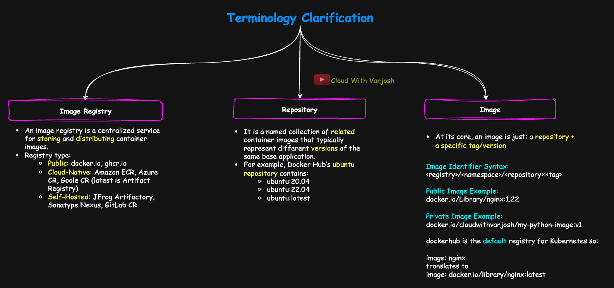
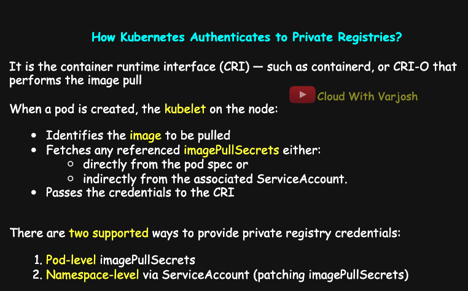

# Day 45: Pull Private Images in Kubernetes with imagePullSecrets & ServiceAccount | CKA Course 2025

## Video reference for Day 45 is the following:

[](https://www.youtube.com/watch?v=5p-Qw1zxoWE&ab_channel=CloudWithVarJosh)


---
## ⭐ Support the Project  
If this **repository** helps you, give it a ⭐ to show your support and help others discover it! 

---

## Table of Contents
- [Introduction](#introduction)  
- [1. Nomenclature: Image Registries, Repositories, and Images](#1-nomenclature-image-registries-repositories-and-images)  
- [2. Public vs Private Registries](#2-public-vs-private-registries)  
- [3. The Problem: ImagePullBackOff](#3-the-problem-imagepullbackoff)  
- [4. How Kubernetes Authenticates to Private Image Registries](#4-how-kubernetes-authenticates-to-private-image-registries)  
  - [Configuring Registry Access](#configuring-registry-access)  
- [5. Step-by-Step Demos](#5-step-by-step-demos)  
  - [Demo 0: Build and Push a Private Image](#demo-0-build-and-push-a-private-image-to-docker-hub)  
  - [Demo 1: Authenticate Using imagePullSecrets](#demo-1-authenticate-to-a-private-registry-using-imagepullsecrets)  
  - [Demo 2: Patch Default ServiceAccount](#demo-2-configure-default-serviceaccount-with-pull-secret-namespace-wide)  
  - [Demo 3: Use Custom ServiceAccount](#demo-3-use-a-custom-serviceaccount-with-pull-secrets)  
- [Conclusion](#conclusion)  
- [References](#references)  

---

## Introduction

In real-world Kubernetes deployments, not all images live in public registries. Organizations often rely on **private container registries** to securely store production-ready images, internal tools, and microservices.

This lecture focuses on **how Kubernetes interacts with private registries**, how to configure authentication using **imagePullSecrets**, and the role of **ServiceAccounts** in making this process seamless and secure.

You’ll learn:

* How image registries, repositories, and tags work together
* Why private registries are commonly used in production
* What causes `ImagePullBackOff` and how to resolve it
* How Kubernetes uses ServiceAccounts and pull secrets to authenticate
* Multiple methods to configure pull credentials: pod-level, namespace-level, and using custom SAs
* How to build and push private images and test registry authentication

By the end, you'll have hands-on experience with the correct, production-grade way to authenticate Kubernetes workloads to private registries — a must-know skill for any certified Kubernetes administrator.

---

## 1. Nomenclature: Image Registries, Repositories, and Images

Before we begin, let’s establish some common terminology that you’ll see throughout this lecture.



---

### **Image Registry**

An **image registry** is a centralized service that stores, distributes, and manages container images. Kubernetes nodes (via the container runtime) pull images from these registries when launching containers.

| **Registry Type** | **Examples**                                                                                                                |
| ----------------- | --------------------------------------------------------------------------------------------------------------------------- |
| **Public**        | `docker.io` (Docker Hub), `ghcr.io` (GitHub Container Registry), `quay.io`                                                  |
| **Cloud-native**  | `*.amazonaws.com` (Amazon ECR), `*.gcr.io` / `*.pkg.dev` (GCP Artifact Registry), `*.azurecr.io` (Azure Container Registry) |
| **Self-hosted**   | Harbor, Sonatype Nexus, JFrog Artifactory, GitLab Container Registry                                                        |


These registries support **private and public access**, image versioning with tags, and can be integrated with Kubernetes using `imagePullSecrets`, workload identity mechanisms, or access tokens depending on the platform and use case.

---

### **Repository**

A **repository** is a named collection of related container images that typically represent different **versions** or **variants** of the same base application or component.

Each image in a repository is distinguished by a **tag**, allowing you to version, track, and deploy specific builds.


#### **Example: Ubuntu Repository on Docker Hub**

The following images all belong to the `ubuntu` repository:

* `ubuntu:20.04`
* `ubuntu:22.04`
* `ubuntu:latest`

Here:

* The **repository** is `ubuntu`
* Each **tag** represents a specific version or release
* You can think of this similarly to how Git repositories have tagged releases


#### **Key Notes**

* Repositories are **scoped under a namespace** (such as a DockerHub username or an organization)
* A **repository without a tag** defaults to `:latest`, but relying on this is discouraged in production environments
* Tags are **mutable** — they can be reassigned to point to different images over time, so using specific, immutable tags (`v1.2.3`) is best practice

---

### **Repository Identifier Format**

```text
<registry>/<namespace>/<repository>
```

**Example:**

```text
docker.io/cloudwithvarjosh/my-python-image
```

You can then use tags to specify versions:

```text
docker.io/cloudwithvarjosh/my-python-image:v1
docker.io/cloudwithvarjosh/my-python-image:v2
```

---

In summary, a repository acts as the version-controlled container for your application’s image history. Tags help you manage releases, rollbacks, and environment-specific deployments — all within a consistent naming boundary.


---

### **Image**

An **image** is a **versioned snapshot** of a containerized application or environment. It packages everything needed to run your application: the OS base layer, libraries, binaries, configuration files, and entrypoint.

At its core, an image is just:

> **a repository + a specific tag/version**

Every time you pull, build, or deploy an image, you're referring to a particular version (tag) of a repository.

---

### **Image Identifier Syntax**

```text
<registry>/<namespace>/<repository>:<tag>
```

**Example:**

```text
docker.io/cloudwithvarjosh/my-python-image:v1
```

| Component  | Value              | Description                                         |
| ---------- | ------------------ | --------------------------------------------------- |
| Registry   | `docker.io`        | The image registry to pull from                     |
| Namespace  | `cloudwithvarjosh` | Usually your DockerHub username or org name         |
| Repository | `my-python-image`  | The logical group or name of your application image |
| Tag        | `v1`               | Specific version of the repository                  |

---

### **Defaulting Behavior in Kubernetes**

Kubernetes (and Docker) provide default fallbacks:

* If the **registry** is omitted: it defaults to `docker.io`
* If the **namespace** is omitted: it defaults to `library/` for official images
* If the **tag** is omitted: it defaults to `latest`

So, this:

```yaml
image: nginx
```

Is interpreted as:

```text
docker.io/library/nginx:latest
```

---

### **Explicit Examples**

For public images under a user or organization:

```yaml
image: docker.io/cloudwithvarjosh/my-python-image:v1
```

For cloud registries or GitHub:

```yaml
image: ghcr.io/my-org/app:v2
image: gcr.io/my-project/my-api:latest
image: myregistry.azurecr.io/team/app:v3
image: <aws_account>.dkr.ecr.us-west-2.amazonaws.com/my-image:stable
```

This layered structure makes image identification unambiguous and allows Kubernetes to precisely locate and pull the required version of a container. It also simplifies promoting the same image across dev, test, and prod — just by changing the tag.


>**Critical Note**  
Not all vendors follow the standard **`<registry>/<namespace>/<repository>:<tag>`** image format. For example, Amazon ECR embeds account ID and region into the registry path like **`123456789012.dkr.ecr.us-east-1.amazonaws.com/myapp:latest`**.
Harbor may use nested project paths such as **`harbor.mycompany.com/dev/backend/app:v1`**, which breaks flat namespace assumptions. Always consult vendor-specific conventions before scripting or integrating with registries.

---


## 2. Public vs Private Registries

So far in this course, you’ve only used public images — which require **no authentication**. That’s why your YAMLs worked without needing credentials.

But in real-world deployments, your organization’s container images are often hosted on **private repositories** — for security, IP protection, and tighter governance.

Common use cases:

* Microservice images stored in **private Docker Hub** repositories
* Production builds uploaded to **Amazon ECR**
* CI/CD artifacts published to **GHCR, GCR, or Harbor**

Kubernetes does not pull private images unless **credentials are explicitly provided**.

---

## 3. The Problem: `ImagePullBackOff`

Let’s simulate this scenario by trying to use a private image from Docker Hub without providing any credentials.

Here’s a simple pod manifest:

```yaml
# pod.yaml
apiVersion: v1
kind: Pod
metadata:
  name: mypod
spec:
  containers:
  - name: python-cont
    image: docker.io/cloudwithvarjosh/my-python-image:v1
```

Apply it:

```bash
kubectl apply -f pod.yaml
kubectl get pods
```

You’ll see:

```
mypod   0/1   ErrImagePull   0   4s
```

Check further using:

```bash
kubectl describe pod mypod
```

Look for the event logs:

```
Failed to pull image "docker.io/cloudwithvarjosh/my-python-image:v1":
pull access denied, repository does not exist or may require authorization:
server message: insufficient_scope: authorization failed
```

This error occurs because Docker Hub **requires authentication** for private repositories, and Kubernetes was not given any credentials to authenticate.

---

### 4. How Kubernetes Authenticates to Private Image Registries

Kubernetes itself **does not pull container images**. This responsibility is delegated to the **Container Runtime Interface (CRI)** — such as **containerd**, or **CRI-O** — running on each node.



To authenticate to private registries, Kubernetes uses **image pull secrets**, which store credentials in a format compatible with Docker (`kubernetes.io/dockerconfigjson`). These credentials typically include:

* Registry URL
* Username and password
* Base64-encoded auth token

When a pod is created, the **kubelet** on the node:

1. Receives the pod spec and identifies the image to be pulled.
2. Fetches any referenced `imagePullSecrets` — either directly from the pod spec or indirectly from the associated **ServiceAccount**.
3. Passes the credentials to the CRI (e.g., containerd), which uses them to authenticate with the image registry and pull the image.

#### Default Behavior: ServiceAccount and Secret Mounting

By default, **every namespace** in Kubernetes comes with a **ServiceAccount named `default`**, and any pod created without explicitly specifying a `serviceAccountName` will be automatically associated with this default account.

This default ServiceAccount is also automatically **mounted into the pod** at runtime via a projected volume under:

```text
/var/run/secrets/kubernetes.io/serviceaccount/
```

This token is used for in-cluster API authentication (not image pulls), but more importantly, the ServiceAccount can also be used to **provide imagePullSecrets**, which the kubelet reads from and passes to the CRI.

> If you **do not want the default ServiceAccount to be mounted**, you can disable it using the pod spec field:

```yaml
automountServiceAccountToken: false
```

This prevents the pod from getting the default projected token — useful in tightly secured environments.

Here’s a polished version you can use in your notes or slides:

---
**ServiceAccounts are a foundational concept in Kubernetes** — they represent identities for pods to interact with the cluster. Both **internal components (like controllers, kubelets)** and **external tools (like Argo CD, Vault, CI/CD runners)** rely on ServiceAccounts to authenticate and authorize their actions.

Before proceeding, make sure you have a **solid grasp of ServiceAccounts** — how they're created, mounted, and used.

🔗 **Deep Dive**: Day 37 — Kubernetes Service Accounts

* **GitHub Notes**: [CKA Course - Day 37](https://github.com/CloudWithVarJosh/CKA-Certification-Course-2025/tree/main/Day%2037)
* **YouTube Walkthrough**: [Watch Day 37](https://www.youtube.com/watch?v=WsQT7y5C-qU&ab_channel=CloudWithVarJosh)

---

#### Configuring Registry Access

There are two supported ways to provide private registry credentials:

* **Pod-level imagePullSecrets**
  Add the secret explicitly in the pod spec. This gives the most control per workload.

* **Namespace-level via ServiceAccount**
  Attach the secret to a ServiceAccount (e.g., `default`) so that all pods using that SA automatically inherit registry credentials.

This approach is cleaner for multi-pod setups in a namespace where the same registry credentials apply.

---

> Whether using the default or a custom ServiceAccount, Kubernetes ensures that the credentials are used **only at image pull time**, and they are **never mounted into the container or available as environment variables** inside the pod.


---

## 5. Step-by-Step Demos

---
## Demo 0: Build and Push a Private Image to Docker Hub

**Before You Pull Private Images, Let’s First Push One**

Before we dive into how to **pull private images** using Kubernetes, let’s quickly recap how to **build and push an image to Docker Hub**. Although we covered this in Day 03 during our Docker introduction, I want to revisit it here for completeness — and so you can **practice along with me**. Don’t just watch — follow every step on your own terminal.

---

### **Step 1: Application Code – `app.py`**

Let’s start with a simple Python Flask application:

```python
from flask import Flask

app = Flask(__name__)

@app.route("/")
def home():
    return "Hello, Docker!"

if __name__ == "__main__":
    app.run(host="0.0.0.0", port=5000)
```

This app simply returns **“Hello, Docker!”** when you hit the root endpoint.

---

### **Step 2: Create a Dockerfile**

Save the following as `Dockerfile` in the same directory as `app.py`:

```Dockerfile
# Use a lightweight base Python image
FROM python:3.9-slim

# Set working directory
WORKDIR /app

# Copy the application file into the container
ADD app.py app.py

# Install required dependency
RUN pip install flask

# Expose the Flask default port
EXPOSE 5000

# Start the application
CMD ["python", "app.py"]
```

---

### **Step 3: Build and Push the Docker Image**

Now, assuming you're in the right folder (e.g., inside `Day 44/app1/`), build and tag your image:

```bash
docker build -t cloudwithvarjosh/app1:1.0.0 .
```
> Using `1.0.0` follows the industry-standard **semantic versioning** format (`major.minor.patch`), making image versions easier to track, manage, and promote across environments. Avoid using `latest` in production.


Then push it to your Docker Hub account:

```bash
docker push cloudwithvarjosh/app1:1.0.0
```

> Replace `cloudwithvarjosh` with your own Docker Hub username if you’re following this demo with your own account.


---

#### **Authentication Tips:**

* If you're using **Docker Desktop**, make sure you’re **signed in** through the GUI. The push will work automatically if you're authenticated.
* If you’re using Docker on a **Linux system**, log in manually:

```bash
docker login
```

Enter your Docker Hub credentials when prompted.

---

### **Step 4: Make the Repository Private**

Once the image is successfully pushed, head over to [https://hub.docker.com/](https://hub.docker.com/):

1. Click **"My Hub"** from the top navigation.
2. Locate the **repository** you just pushed (e.g., `app1`).
3. Go to **Settings**.
4. Under **"Visibility Settings"**, change the repository to **Private**.

This step ensures your image can’t be pulled publicly — which is necessary for our next demo involving authentication in Kubernetes.

---

## Demo 1: Authenticate to a Private Registry Using `imagePullSecrets`

In this demo, we'll:

* Create a Docker registry secret with private credentials
* Use that secret in a pod
* Decode and inspect the secret
* Understand why this must be handled carefully

---

### Step 1: Create a Docker Registry Secret

Use the following command to create a Kubernetes secret for authenticating with Docker Hub:

```bash
kubectl create secret docker-registry dockerhub-secret \
  --docker-server=https://index.docker.io/v1/ \
  --docker-username=cloudwithvarjosh \
  --docker-password=YOUR_PASSWORD \
  --docker-email=cloudwithvarjosh@gmail.com
```

Verify the secret:

```bash
kubectl get secret dockerhub-secret -o yaml
```

This secret is of type `kubernetes.io/dockerconfigjson` and stores a base64-encoded `.dockerconfigjson`.

---

> **Note:**
> I’ve named my secret `dockerhub-secret` just to make it clear that this particular secret is meant for authenticating to Docker Hub.
>
> If I were creating a similar secret for Amazon ECR, I might name it `ecr-secret`, and for GitHub Container Registry, something like `ghcr-secret`. This naming is purely for readability and organization — the `docker-registry` type is just Kubernetes syntax and **does not limit the secret to Docker Hub**.
>
> As long as the credentials match the target registry (`--docker-server`), the secret can authenticate against **any container registry** that uses basic auth or token-based login under the Docker v1 API.

---

### Step 2: Use the Secret in a Pod Manifest

Reference the secret explicitly in your pod spec:

```yaml
apiVersion: v1
kind: Pod
metadata:
  name: mypod
spec:
  containers:
  - name: python-cont
    image: docker.io/cloudwithvarjosh/app1:1.0.0
  imagePullSecrets:
  - name: dockerhub-secret
```

Apply it:

```bash
kubectl apply -f pod.yaml
```

Kubernetes will now use the credentials stored in the secret to authenticate and pull the image. If the credentials are valid, the pod transitions to `Running`.

---

### Step 3: Decode the Secret (Handle with Caution)

To inspect the raw credentials inside your secret:

```bash
kubectl get secret dockerhub-secret -o yaml
```

You'll see `.dockerconfigjson` with a base64 value. Decode it:

```bash
echo -n <base64-value> | base64 --decode
```

**Example decoded output:**

```json
{
  "auths": {
    "https://index.docker.io/v1/": {
      "username": "cloudwithvarjosh",
      "password": "password11",
      "email": "cloudwithvarjoshi@gmail.com",
      "auth": "Y2x..."
    }
  }
}
```

> This includes real credentials — anyone with access to this secret can pull from your private repositories. Avoid exposing this in logs or automation.

---

To reduce the risk of credentials leakage, follow these best practices:

1. **RBAC Restrictions:**
   Use Role-Based Access Control (RBAC) to restrict which users or service accounts can read secrets. Avoid granting `get` or `list` permissions on secrets unnecessarily.

2. **Separate Namespaces:**
   Store sensitive secrets in isolated namespaces and avoid keeping all app workloads and secrets in `default`.

3. **Avoid Logging Secrets:**
   Never print or log secret values in pipelines, automation scripts, or audit logs. Mask them in output streams.

4. **Use IRSA for ECR (or workload identity for GCP/Azure):**
   Instead of static credentials, use cloud-native mechanisms (like IAM Roles for Service Accounts in EKS) to fetch registry tokens dynamically — eliminating the need for manually created secrets.

5. **Regular Rotation:**
   Periodically rotate registry credentials and update secrets accordingly to minimize the blast radius in case of a leak.

6. **Use External Secret Managers:**
   Integrate with systems like AWS Secrets Manager, HashiCorp Vault, or Sealed Secrets to manage sensitive credentials outside of etcd.

---

## Demo 2: Configure Default ServiceAccount with Pull Secret (Namespace-Wide)

In this demo, we eliminate the need to add `imagePullSecrets` to every pod manifest by configuring the **default ServiceAccount** in a namespace to use the pull secret automatically.

---

### Step 1: Create Namespace and Confirm Default ServiceAccount

Every new namespace in Kubernetes automatically includes a default ServiceAccount named `default`.

```bash
kubectl create ns app1-ns
kubectl get sa -n app1-ns
```

Expected output:

```
NAME      SECRETS   AGE
default   0         5s
```

---

### Step 2: Create the Pull Secret in the New Namespace

Secrets are **scoped to namespaces**, so even if you've already created `dockerhub-secret` in `default`, you must **recreate it in `app1-ns`**:

```bash
kubectl create secret docker-registry dockerhub-secret \
  --docker-server=https://index.docker.io/v1/ \
  --docker-username=cloudwithvarjosh \
  --docker-password=YOUR_PASSWORD \
  --docker-email=cloudwithvarjosh@gmail.com \
  -n app1-ns
```

Verify:

```bash
kubectl get secret -n app1-ns
```

---

### Step 3: Patch the Default ServiceAccount (Option 1: CLI)

Attach the `dockerhub-secret` to the default SA in the new namespace:

```bash
kubectl patch serviceaccount default \
  -n app1-ns \
  -p '{"imagePullSecrets": [{"name": "dockerhub-secret"}]}'
```

---

### Step 4: (Alternative) Manual Edit of ServiceAccount

You can also edit the default service account manually:

```bash
kubectl edit serviceaccount default -n app1-ns
```

Add under `spec`:

```yaml
imagePullSecrets:
- name: dockerhub-secret
```

---

### Step 5: Verify the Patch

Ensure the image pull secret is now attached:

```bash
kubectl get serviceaccount default -n app1-ns -o yaml
```

Look for:

```yaml
imagePullSecrets:
- name: dockerhub-secret
```

---

### Step 6: Deploy a Pod Without Explicit imagePullSecrets

Because the `default` ServiceAccount in the namespace has been patched, **you do not need to specify `imagePullSecrets`** in the pod manifest.

Create `pod.yaml`:

```yaml
apiVersion: v1
kind: Pod
metadata:
  name: mypod
  namespace: app1-ns
spec:
  containers:
  - name: python-cont
    image: docker.io/cloudwithvarjosh/app1:1.0.0
```

Apply it:

```bash
kubectl apply -f pod.yaml
```

---

### Step 7: Confirm Pod Is Running

```bash
kubectl get pod -n app1-ns
```

You should see the pod in the `Running` state, having pulled the private image without any credential defined in the pod spec.

---

> **Note:** If the pod fails with an `ImagePullBackOff` or `Unauthorized` error, double-check that:
>
> * The secret exists in the `app1-ns` namespace.
> * It is correctly attached to the default ServiceAccount.
> * The credentials in the secret are correct and the image exists and is private.

---

## Demo 3: Use a Custom ServiceAccount with Pull Secrets

In this demo, you’ll learn how to configure a **custom ServiceAccount** to pull private container images. Unlike the default SA, custom accounts **do not inherit pull secrets** and must be explicitly configured.

This is a common pattern in production environments for fine-grained access control, workload separation, and service isolation.

---

### Step 1: Ensure the Secret Exists in the Namespace

If you're continuing from Demo 2, this step may already be complete. Otherwise, you need to create the secret in the correct namespace (`app1-ns`), as Kubernetes secrets are **namespace-scoped**.

```bash
kubectl create secret docker-registry dockerhub-secret \
  --docker-server=https://index.docker.io/v1/ \
  --docker-username=cloudwithvarjosh \
  --docker-password=YOUR_PASSWORD \
  --docker-email=cloudwithvarjosh@gmail.com \
  -n app1-ns
```

Verify:

```bash
kubectl get secret -n app1-ns
```

---

### Step 2: Create a Custom ServiceAccount

Create a new ServiceAccount in the same namespace:

```bash
kubectl create serviceaccount app1-sa -n app1-ns
```

Verify:

```bash
kubectl get sa -n app1-ns
```

Expected output:

```
NAME       SECRETS   AGE
app1-sa    0         2s
default    1         2m
```

---

### Step 3: Attach the Image Pull Secret to the Custom SA

This step is necessary because custom service accounts do not automatically inherit any pull secrets.

#### Option 1: Patch via CLI

```bash
kubectl patch serviceaccount app1-sa \
  -n app1-ns \
  -p '{"imagePullSecrets": [{"name": "dockerhub-secret"}]}'
```

#### Option 2: Edit Manually

```bash
kubectl edit serviceaccount app1-sa -n app1-ns
```

Add:

```yaml
imagePullSecrets:
- name: dockerhub-secret
```

---

### Step 4: Verify the Patch

Confirm that the `imagePullSecrets` section has been added:

```bash
kubectl get sa app1-sa -n app1-ns -o yaml
```

You should see:

```yaml
imagePullSecrets:
- name: dockerhub-secret
```

---

### Step 5: Create a Pod That Uses the Custom ServiceAccount

Define a pod that explicitly uses the custom ServiceAccount:

```yaml
apiVersion: v1
kind: Pod
metadata:
  name: app1-pod
  namespace: app1-ns
spec:
  serviceAccountName: app1-sa
  containers:
  - name: python-cont
    image: docker.io/cloudwithvarjosh/app1:1.0.0
```

Apply it:

```bash
kubectl apply -f pod.yaml
```

---

### Step 6: Confirm Pod Status

Check that the pod successfully pulls the private image and transitions to the Running state:

```bash
kubectl get pod app1-pod -n app1-ns
```

If the pull secret and SA are correctly configured, the image will be pulled without error.

---

### Key Takeaways

* Custom ServiceAccounts **do not inherit pull secrets** — they must be patched or edited explicitly.
* Always reference the custom ServiceAccount using the `serviceAccountName` field in the pod spec.
* Secrets are **scoped to namespaces**. The secret must exist in the same namespace as the pod and the SA.
* This approach is widely used in production environments to enforce security boundaries and limit access to private registries.

---

## Conclusion

Accessing private container registries is a foundational skill for running production-grade applications in Kubernetes. In this lecture, you explored:

* The building blocks of container image infrastructure — registries, repositories, images, and tags
* Why public images work out of the box, but private registries need authentication
* How Kubernetes delegates image pulls to the container runtime (e.g., containerd)
* The use of `imagePullSecrets` for supplying credentials securely
* How to scope credentials using default and custom ServiceAccounts
* Namespace isolation, secret scoping, and demo-driven implementation for Docker Hub

These practices apply across **Docker Hub, GitHub Container Registry, Amazon ECR, Google Artifact Registry, Azure Container Registry**, and **self-hosted solutions** like Harbor and Nexus.

Whether you're setting up a production CI/CD pipeline, onboarding internal teams, or running isolated workloads with different credentials, understanding registry access in Kubernetes is critical to security and reliability.

---

## References

Here are key official references that complement this lecture:

* 🔗 Kubernetes Docs — [Pull an Image from a Private Registry](https://kubernetes.io/docs/concepts/containers/images/#using-a-private-registry)
* 🔗 Kubernetes Docs — [Service Accounts](https://kubernetes.io/docs/tasks/configure-pod-container/configure-service-account/)
* 🔗 Kubernetes Docs — [Configure Pods to Use ImagePullSecrets](https://kubernetes.io/docs/tasks/configure-pod-container/pull-image-private-registry/)
* 🔗 Docker Docs — [docker-registry secret type](https://docs.docker.com/engine/reference/commandline/login/)
* 🔗 AWS Docs — [ECR Authentication with IRSA](https://docs.aws.amazon.com/eks/latest/userguide/iam-roles-for-service-accounts.html)
* 🔗 GitHub Docs — [Using GitHub Container Registry](https://docs.github.com/en/packages/working-with-a-github-packages-registry/working-with-the-container-registry)
* 🔗 Google Docs — [Authenticating to Google Artifact Registry](https://cloud.google.com/artifact-registry/docs/docker/authentication)
* 🔗 Azure Docs — [Azure Container Registry Authentication](https://learn.microsoft.com/en-us/azure/container-registry/container-registry-authentication)

---