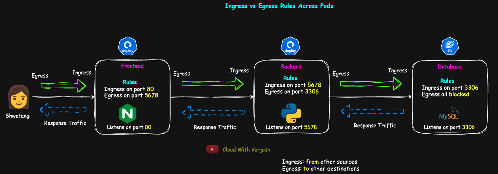

# Day 47: Kubernetes Network Policies Explained with Real-World Demo | CKA Course 2025

## Video reference for Day 47 is the following:

[](https://www.youtube.com/watch?v=5TKKG-uKU4o&ab_channel=CloudWithVarJosh)

---
## ⭐ Support the Project  
If this **repository** helps you, give it a ⭐ to show your support and help others discover it! 

---

## Table of Contents

* [Introduction](#introduction)  
* [Understanding the Context: Our 3-Tier Application](#understanding-the-context-our-3-tier-application)  
* [How This Application Works](#how-this-application-works)  
* [Why Network Policies?](#why-network-policies)  
* [What are Network Policies](#what-are-network-policies)  
  * [Who Enforces Network Policies?](#who-enforces-network-policies)  
  * [Ingress vs Egress – What’s the Difference?](#ingress-vs-egress--whats-the-difference)  
  * [How Network Policies Work in Kubernetes](#how-network-policies-work-in-kubernetes)  
  * [Types of NetworkPolicies](#types-of-networkpolicies)  
    * [1. Pod-Based (`podSelector`)](#1-pod-based-podselector)  
    * [2. Namespace-Based (`namespaceSelector`)](#2-namespace-based-namespaceselector)  
    * [3. IP-Based (`ipBlock`)](#3-ip-based-ipblock)  
* [Demo: Enforcing Least Privilege Using NetworkPolicies](#demo-enforcing-least-privilege-using-networkpolicies). 
  * [Step 1: Preparing the Cluster (KIND + Calico)](#step-1-preparing-the-cluster-kind--calico). 
  * [Step 2: Creating Namespace and Deploying Frontend, Backend, and DB](#step-2-creating-namespace-and-deploying-frontend-backend-and-db)  
  * [Step 3: Verify the Current State — Everyone Can Talk to Everyone](#step-3-verify-the-current-state--everyone-can-talk-to-everyone)  
  * [Step 4: Creation of NetworkPolicies for All 3 Tiers](#step-4-creation-of-networkpolicies-for-all-3-tiers)
  * [Step 5 – Verification of Connectivity](#step-5--verification-of-connectivity)  
* [Task for You](#task-for-you)
* [AND vs OR: How from Rules Are Evaluated](#and-vs-or-how-from-rules-are-evaluated)  
* [Conclusion](#conclusion)  
* [References](#references)  

---


## Introduction

In modern Kubernetes environments, securing pod-to-pod communication is as essential as securing access to the API server. By default, all pods can talk to each other freely, making the cluster vulnerable to lateral movement and internal threats. In this session, we explore **Kubernetes NetworkPolicies**, a native mechanism to enforce **Layer 3/4 network segmentation** within the cluster. Using a realistic 3-tier application setup — comprising frontend, backend, and database tiers — we demonstrate how to apply the **principle of least privilege** by crafting precise ingress and egress rules. We also examine how NetworkPolicies are enforced by CNI plugins, clarify the subtle behavior of selector logic, and simulate traffic flows before and after policies are applied. This session equips you with practical skills and architectural patterns to secure Kubernetes workloads effectively.

---

## **Understanding the Context: Our 3-Tier Application**

Let’s revisit the same 3-tier app we’ve been working with throughout this course:

* **Frontend (Web Tier)**:
  Uses the `nginx` image, listens on port `80`.
  Deployment: `frontend-deploy` with a single replica for simplicity.
  In production, this typically listens on `443` with TLS 1.3.

* **Backend (App Tier)**:
  A lightweight Python HTTP server using the `python:3.11-slim` image. It listens on port `5678` and is started with the command:
  `python3 -m http.server 5678`
  Deployment: `backend-deploy`.

* **Database (DB Tier)**:
  Uses `mysql`, listening on default port `3306`.
  Deployed as a StatefulSet: `mysql-sts`.

Throughout this lecture, we’ll refer to the **frontend as web tier**, **backend as app tier**, and use these terms interchangeably to reinforce architectural understanding.

---

## **How This Application Works**


When a user (e.g., Shwetangi) accesses the application:

1. The request reaches the **frontend (web tier)**.
2. The frontend sends the request to the **backend (app tier)** to process business logic.
3. The backend communicates with the **database** to fetch or store data.
4. The frontend returns the result to the user.

This is a typical 3-tier interaction.

---

## **Why Network Policies?**

By default, **all pods in Kubernetes can talk to each other freely**. There is **no isolation** or access restriction unless explicitly configured. This is **not desirable in production** environments.

You want to enforce the **principle of least privilege**:

* Only allow communication that is required.
* For example, the **web tier should not talk to the database tier directly**.
* Only the **app tier** should talk to the **database**, and that too only on port `3306`.

This is exactly why we need **Network Policies**.

---

## **What are Network Policies**

In Kubernetes, **NetworkPolicies** are powerful resources used to control the traffic flow to and from pods at the **IP address and port level**, which corresponds to **Layer 3 and Layer 4** of the OSI model. They enable you to define **ingress** rules (for incoming traffic) and **egress** rules (for outgoing traffic), thus determining which pods or external sources can communicate with a given pod and over which ports and protocols. This makes NetworkPolicies a key mechanism for enforcing fine-grained network segmentation and reducing the attack surface within your Kubernetes cluster.

By default, Kubernetes allows unrestricted communication between all pods. This flat network model is insecure for most production environments. With NetworkPolicies in place, you can isolate workloads — for example, ensuring that frontend pods can talk to backend pods, but not directly to the database, or preventing a compromised pod from initiating outbound connections to the internet.

NetworkPolicies can control **traffic within the cluster** (pod-to-pod) as well as **traffic between pods and external entities** (like external databases or services). However, it’s important to understand that these policies are purely declarative — Kubernetes itself does not enforce them. The actual enforcement is delegated to the **CNI (Container Network Interface) plugin** used by the cluster.

---

## **Who Enforces Network Policies?**

NetworkPolicies are not enforced by Kubernetes itself — they require a **CNI plugin that implements them**. While all CNIs provide basic networking, only a subset supports policy enforcement.

Some well-known CNIs **that support NetworkPolicies** include **Calico**, **Cilium**, **Kube-router**, **Antrea**, **AWS VPC CNI**, and **OVN-Kubernetes**. CNIs like **Flannel**, **Weave Net**, and **kindnet** (used by default in KIND clusters) **do not support** them.


> Always verify the features of your CNI by consulting the **official documentation**. Not all CNIs implement the full spec, and some require extra components or configuration.

You can check your CNI by running:

```bash
kubectl get ds -n kube-system
```

For example, seeing `calico-node` or `cilium-agent` in the output confirms you're using a policy-capable CNI.

---

## **Ingress vs Egress – What’s the Difference?**


* **Ingress**: Refers to traffic **entering a pod**. This could be from another pod, a service, or even an external client depending on your setup. NetworkPolicies that define ingress rules specify what sources are allowed to initiate connections **to** the pod on specific ports.

* **Egress**: Refers to traffic **leaving a pod**. This could be going to another pod, a cluster service, or an external IP. Egress rules define which destinations a pod can connect to, including specific IP blocks or namespaces.

### Example Flow

* A user request to the `frontend` pod is considered **Ingress** to the web tier.
* When `frontend` talks to `backend`, it's **Egress** from `frontend` and **Ingress** to `backend`.
* When `backend` queries the database, it’s **Egress** from `backend` and **Ingress** to the `db` pod.

Note: **Reply traffic is not filtered** separately because **Kubernetes NetworkPolicies are stateful**—if a request is allowed, the corresponding response is automatically permitted. We will shortly zoom-in into this concept.

---

## **Applying the Principle of Least Privilege**



In a secure Kubernetes setup, NetworkPolicies should strictly define **only what traffic is allowed**—everything else is implicitly denied. Here's how the **least privilege model** applies to a typical 3-tier application:

### **Frontend (Web Tier)**

* **Ingress allowed** on port `80` from external clients (e.g., a load balancer or browser).
* **Egress allowed** to the backend tier on port `5678` for internal API calls.

### **Backend (App Tier)**

* **Ingress allowed** on port `5678` from the frontend tier.
* **Egress allowed** to the database tier on port `3306` for querying or updates.

### **Database (DB Tier)**

* **Ingress allowed** on port `3306` only from the backend tier.
* No egress required unless the DB needs to talk to external services (usually not needed in well-isolated apps).

All other ingress and egress traffic is **denied by default**, once any NetworkPolicy is applied to the pod.

> These network principles aren’t limited to Kubernetes—this pattern applies just as well to virtual machines and bare metal environments where host-based firewalls or security groups are used.

---

## **How Network Policies Work in Kubernetes**

### **Default Behavior**

* If **no NetworkPolicy is applied**, all traffic is **allowed by default**.
* As soon as a pod is **selected by a NetworkPolicy**, all traffic **not explicitly allowed is denied**.

This means:

* Traffic to and from unselected pods remains unrestricted.
* Once selected, a pod is isolated unless explicitly permitted.

### **Stateful Nature of Network Policies**

NetworkPolicies are **stateful**, meaning:

* If you allow a pod to **send** traffic, the **response traffic is automatically allowed**.
* Example: Backend is allowed to connect to DB on port `3306`. DB's **response is automatically permitted**.

This is similar to **AWS Security Groups**, which are also stateful.

In contrast, **AWS NACLs** are **stateless**, so you must allow both directions explicitly.

---

## **Types of NetworkPolicies**

Kubernetes NetworkPolicies restrict traffic based on three types of selectors: **pod labels**, **namespace labels**, and **external IPs**. Each serves a different use case in controlling network communication.

---

### 1. **Pod-Based (`podSelector`)**

* Matches **pods within the same namespace** using labels.
* Ideal for controlling traffic **within a namespace**, such as between tiers like `frontend`, `backend`, or `db`.
* Example:

  ```yaml
  podSelector:
    matchLabels:
      role: backend
  ```

  This selects all pods in the current namespace that are labeled `role=backend`.

---

### 2. **Namespace-Based (`namespaceSelector`)**

* Matches **namespaces** based on their **labels** (not names).
* Useful for controlling traffic between **applications or microservices**, especially when each runs in a separate namespace.
* Example:

  ```yaml
  namespaceSelector:
    matchLabels:
      app: app1
  ```

  This allows traffic **to/from** any namespace labeled `app=app1`.
  For instance, if `app1` spans across `app1-dev`, `app1-staging`, and `app1-prod`, and all of them are labeled `app=app1`, the policy can target all these environments.

---

### 3. **IP-Based (`ipBlock`)**

* Matches traffic from/to **external IP ranges**, outside the Kubernetes cluster.
* Typical use case: An **external backup node** or logging service needs access to your pods.
* Example:

  ```yaml
  ipBlock:
    cidr: 10.0.0.0/24
    except:
      - 10.0.0.5/32
  ```

  This allows traffic from the `10.0.0.0/24` range except the specific IP `10.0.0.5`.
  For example, a backup service on `10.0.0.10` outside your cluster could connect to your database pod.

---

> The `policyTypes` field defines whether the policy governs **Ingress**, **Egress**, or **both**. Always set this explicitly to avoid unintended defaults.

---


## Demo: Enforcing Least Privilege Using NetworkPolicies

In this demo, we’ll simulate a **realistic 3-tier setup** where traffic is explicitly allowed only between trusted components. Everything else is denied — demonstrating the **Principle of Least Privilege** using Kubernetes `NetworkPolicy`.

---

### **Demo Tasks**

* Set up a KIND cluster with a CNI that supports NetworkPolicies
* Deploy the following workloads in the `app1-ns` namespace:

  * Frontend (Deployment + Service)
  * Backend (Deployment + Service)
  * Database (StatefulSet + Headless Service)
* Apply a NetworkPolicy that allows **only the required communications**

---

### Step 1: Preparing the Cluster (KIND + Calico)

For this demo, we’ll use **KIND (Kubernetes in Docker)** to create a lightweight cluster. This works on any developer machine and mimics real-world behavior when paired with a CNI plugin that supports `NetworkPolicy`.

> This setup works the same on Minikube or even on managed Kubernetes services — as long as your **CNI plugin supports NetworkPolicies**.

By default, KIND uses the **Kindnet** CNI, which does **not support NetworkPolicies**. So we’ll disable the default CNI and install **Calico**, a widely used CNI that supports advanced network policy features.

---

### Delete Existing Cluster (Optional)

To keep things clean and resource-efficient, delete your previous KIND cluster:

```bash
kind get clusters
kind delete cluster --name=<cluster-name>
```

---

### Create KIND Config with Default CNI Disabled

Save the following as `kind-cluster.yaml`:

```yaml
# kind-cluster.yaml
kind: Cluster
apiVersion: kind.x-k8s.io/v1alpha4
networking:
  disableDefaultCNI: true  # This disables Kindnet, allowing us to install Calico

nodes:
  - role: control-plane
    image: kindest/node:v1.33.1@sha256:050072256b9a903bd914c0b2866828150cb229cea0efe5892e2b644d5dd3b34f
    extraPortMappings:
      - containerPort: 31000
        hostPort: 31000

  - role: worker
    image: kindest/node:v1.33.1@sha256:050072256b9a903bd914c0b2866828150cb229cea0efe5892e2b644d5dd3b34f

  - role: worker
    image: kindest/node:v1.33.1@sha256:050072256b9a903bd914c0b2866828150cb229cea0efe5892e2b644d5dd3b34f
```

Then create the cluster:

```bash
kind create cluster --config kind-cluster.yaml --name=cka-2025
```

---

To know more about our KIND setup and how services work in this environment, refer to the sessions below:

* **Day 8: Setting Up KIND Cluster Locally**
  This session walks through creating a KIND cluster from scratch, including networking internals and Docker interactions.
  GitHub: [Day 08 Resources](https://github.com/CloudWithVarJosh/CKA-Certification-Course-2025/tree/main/Day%2008)
  YouTube: [Watch the lecture](https://youtu.be/wBF3YCMgZ7U)

* **Day 12: Kubernetes Services – IN-DEPTH**
  This session explains service types in Kubernetes and why we explicitly set the NodePort (e.g., `31000`) in KIND, especially for local access from the host.
  GitHub: [Day 12 Resources](https://github.com/CloudWithVarJosh/CKA-Certification-Course-2025/tree/main/Day%2012)
  YouTube: [Watch the lecture](https://www.youtube.com/watch?v=92NB8oQBtnc&ab_channel=CloudWithVarJosh)

---


### Check Node Status

Immediately after cluster creation, your nodes will be in `NotReady` state:

```bash
kubectl get nodes
```

Sample output:

```
NAME                     STATUS     ROLES           AGE   VERSION
cka-2025-control-plane   NotReady   control-plane   1m    v1.33.1
cka-2025-worker          NotReady   <none>          1m    v1.33.1
cka-2025-worker2         NotReady   <none>          1m    v1.33.1
```

Reason:

```text
KubeletNotReady: container runtime network not ready: NetworkReady=false reason:NetworkPluginNotReady message: CNI plugin not initialized
```

This is expected since no CNI is installed yet.

---

### Install Calico (CNI with NetworkPolicy Support)

To bring the nodes to `Ready` status and enable NetworkPolicy support, install Calico:

```bash
kubectl apply -f https://raw.githubusercontent.com/projectcalico/calico/v3.30.2/manifests/calico.yaml
```

Reference:
[https://docs.tigera.io/calico/latest/getting-started/kubernetes/kind](https://docs.tigera.io/calico/latest/getting-started/kubernetes/kind)

---

### Verify Calico Installation

```bash
kubectl get daemonset -n kube-system
```

You should see:

```
NAME          DESIRED   CURRENT   READY   UP-TO-DATE   AVAILABLE   NODE SELECTOR            AGE
calico-node   3         3         3       3            3           kubernetes.io/os=linux   1m
```

Once Calico is running, your nodes should transition to `Ready`:

```bash
kubectl get nodes
```

---

## **Step 2: Creating Namespace and Deploying Frontend, Backend, and DB**

In this step, we'll prepare our application components for a 3-tier architecture: **frontend**, **backend**, and **database**. We'll use a dedicated namespace `app1-ns` to logically isolate the application's resources, which is a common practice in production environments.

---

### **Creating the Namespace**

We'll create a namespace called `app1-ns`, labeled with `app=app1`. Labeling helps with grouping and selecting namespaces programmatically, especially when applying network policies.

**00-namespace.yaml**

```yaml
apiVersion: v1
kind: Namespace
metadata:
  name: app1-ns
  labels:
    app: app1
```

After creating the namespace, switch your current context to point to `app1-ns`. This avoids the need to append `-n app1-ns` to every `kubectl` command.

```bash
kubectl config set-context --current --namespace=app1-ns
```

---

### **Deploying Frontend Resources**

The frontend tier is a simple **nginx-based Deployment** exposed via a **NodePort** service on port `31000` for external access.

> In production, you'd likely use an Ingress controller with TLS termination instead of NodePort, and horizontal scaling would be managed by an HPA (Horizontal Pod Autoscaler).

**01-frontend.yaml**

```yaml
apiVersion: apps/v1
kind: Deployment
metadata:
  name: frontend-deploy
  namespace: app1-ns
spec:
  replicas: 1
  selector:
    matchLabels:
      app: app1
      role: frontend
  template:
    metadata:
      labels:
        app: app1
        role: frontend
    spec:
      containers:
        - name: frontend-container
          image: nginx
          ports:
            - containerPort: 80
---
apiVersion: v1
kind: Service
metadata:
  name: frontend-svc
  namespace: app1-ns
spec:
  type: NodePort
  selector:
    app: app1
    role: frontend  # Ensures precise targeting of frontend pods
  ports:
    - protocol: TCP
      port: 80           # Service port
      targetPort: 80     # Container port
      nodePort: 31000    # Host port mapped by KIND cluster
```

---

### **Deploying Backend Resources**

The backend tier is a lightweight **Python-based HTTP server** that listens on port `5678`. We're simulating a microservice here — a placeholder that accepts HTTP traffic, useful for testing communication with the frontend.

> This container uses the built-in `http.server` module from Python. It's not meant for production but serves well for simulating app-to-app communication.

**02-backend.yaml**

```yaml
apiVersion: apps/v1
kind: Deployment
metadata:
  name: backend-deploy
  namespace: app1-ns
spec:
  replicas: 1
  selector:
    matchLabels:
      app: app1
      role: backend
  template:
    metadata:
      labels:
        app: app1
        role: backend
    spec:
      containers:
        - name: backend
          image: python:3.11-slim
          command: ["python3", "-m", "http.server", "5678"]  # Launches HTTP server on port 5678
          ports:
            - containerPort: 5678
---
apiVersion: v1
kind: Service
metadata:
  name: backend-svc
  namespace: app1-ns
spec:
  type: ClusterIP
  selector:
    app: app1
    role: backend
  ports:
    - protocol: TCP
      port: 5678
      targetPort: 5678
```

---

### **Deploying Database Resources**

We'll use a **StatefulSet** to represent the database tier (MySQL). StatefulSets maintain a persistent identity for each pod and are the preferred choice when stable network identities and volumes are required — as is common with databases.

> In production, databases are deployed with replication, storage classes, and often across multiple zones. Here, we keep it simple with just one replica.

Before deploying the StatefulSet, we must create the **Headless Service** (`clusterIP: None`) that will be referenced by the StatefulSet.

Refer to Day 44 for an in-depth StatefulSet and multi-AZ demo on EKS:
GitHub: [Day 44 - StatefulSet](https://github.com/CloudWithVarJosh/CKA-Certification-Course-2025/tree/main/Day%2044)
YouTube: [Watch here](https://www.youtube.com/watch?v=ES48aMk4Gys&ab_channel=CloudWithVarJosh)

**03-db.yaml**

```yaml
apiVersion: v1
kind: Service
metadata:
  name: db-svc
  namespace: app1-ns
spec:
  clusterIP: None  # Headless service for stable network identity
  selector:
    app: app1
    role: db
  ports:
    - protocol: TCP
      port: 3306
      targetPort: 3306
---
apiVersion: apps/v1
kind: StatefulSet
metadata:
  name: db-sts
  namespace: app1-ns
spec:
  serviceName: db-svc  # Must match the headless service name
  replicas: 1
  selector:
    matchLabels:
      app: app1
      role: db
  template:
    metadata:
      labels:
        app: app1
        role: db
    spec:
      containers:
        - name: mysql
          image: mysql:8.0
          ports:
            - containerPort: 3306
          env:
            - name: MYSQL_ROOT_PASSWORD
              value: "password123"
```

---


### Step 3: Verify the Current State — Everyone Can Talk to Everyone

Before applying any restrictions, we need to observe the *default open communication* state where **all pods can talk to each other**.

#### Set namespace context

Set `app1-ns` as the default namespace for your current `kubectl` context:

```bash
kubectl config set-context --current --namespace=app1-ns
```

---

#### Verify All Pods Are Running

```bash
kubectl get pods
```

Expected Output:

```
NAME                                   READY   STATUS    RESTARTS   AGE
backend-deploy-8857b74db-tr8h8         1/1     Running   0          12m
db-sts-0                               1/1     Running   0          12m
frontend-deploy-6bc8df5bb8-wfjpt       1/1     Running   0          12m
```

#### Verify Services Are Active

```bash
kubectl get svc
```

Expected Output:

```
NAME                   TYPE        CLUSTER-IP      EXTERNAL-IP   PORT(S)        AGE
backend-svc            ClusterIP   10.96.102.224   <none>        5678/TCP       12m
db-svc                 ClusterIP   None            <none>        3306/TCP       12m
frontend-svc           NodePort    10.96.94.172    <none>        80:31000/TCP   12m
```

---


### Validate Communication from Frontend Pod

1. **Exec into the frontend pod**:

```bash
kubectl exec -it frontend-deploy-6bc8df5bb8-wfjpt -- bash
```

2. **Install telnet inside the pod** (if not already available):

```bash
apt update && apt install -y telnet
```

3. **Test connectivity to backend and database services**:

```bash
telnet backend-svc 5678
telnet db-svc 3306
```

**Expected output:**

```
Connected to backend-svc.
Connected to db-svc.
```

> In the first case, we are reaching the **ClusterIP** of the backend service, which routes traffic to one of the matching backend pods.
> In the second case, `db-svc` is a **Headless Service** (`clusterIP: None`), so the DNS resolution returns the pod IPs directly, allowing you to connect to one of the database pods without going through a virtual IP.

4. **(Preferred)** Test connectivity to the specific StatefulSet pod using its stable DNS name:

```bash
telnet db-sts-0.db-svc.app1-ns.svc.cluster.local 3306
```

**Expected output:**

```
Connected to db-sts-0.db-svc.app1-ns.svc.cluster.local.
```

> This DNS format resolves directly to a specific pod (in this case, `db-sts-0`) within the StatefulSet. It is useful in scenarios where pod identity matters — such as leader-based systems, ordered startup, or applications requiring persistent identity.

> **Why preferred?** Using stable DNS names like `podname.servicename.namespace.svc.cluster.local` ensures predictability when dealing with StatefulSets. This DNS pattern resolves directly to the intended pod and supports ordered identity — useful when a client (like backend) must always reach a specific instance of a DB or cache.

**Observation**: Frontend can connect to both backend and database.
**But we want to follow the principle of least privilege** — frontend should talk only to backend, not directly to the database.

---

### Validate Communication from Backend Pod

1. **Exec into the backend pod**:

```bash
kubectl exec -it backend-deploy-8857b74db-tr8h8 -- bash
```

2. **Install telnet and curl**:

```bash
apt update && apt install -y telnet curl
```

3. **Test communication**:

```bash
telnet frontend-svc 80
telnet db-sts-0.db-svc.app1-ns.svc.cluster.local 3306
```

Expected output:

```
Connected to frontend-svc.
Connected to db-sts-0.db-svc.app1-ns.svc.cluster.local.
```

**Observation**: Backend can reach both frontend and db, but in most production architectures:

* Backend should connect to DB.
* Backend **should not initiate** connections to frontend. It should only *respond* to frontend-originated requests.

---

### Optional: Validate from DB Pod (StatefulSet)

```bash
kubectl exec -it db-sts-0 -- bash
microdnf install -y telnet
```

> **Note**: We use `microdnf` because the base image used in the DB pod is based on a minimal RHEL/CentOS-compatible distribution, where package management is done via `microdnf` instead of `apt` or `yum`.

Check connectivity to frontend or backend:

```bash
telnet backend-svc 5678
telnet frontend-svc 80
```

**Observation**: DB pod can reach both backend and frontend. However, in most secure architectures, **database tiers should not initiate outbound connections**, especially not to the frontend layer.

---

## Step 4: Creation of NetworkPolicies for All 3 Tiers

We'll now define and apply `NetworkPolicy` manifests for the **db**, **backend**, and **frontend** tiers of our application in the `app1-ns` namespace. These policies enforce the **principle of least privilege**, only allowing communication that is explicitly permitted.

---

### 04-db-netpol.yaml – Allow Only Backend Pods to Reach DB on Port 3306

---

```yaml
apiVersion: networking.k8s.io/v1
kind: NetworkPolicy
metadata:
  name: db-policy                 # Logical name for the policy
  namespace: app1-ns              # Namespace where the policy is enforced
spec:
  policyTypes:
    - Ingress                    # Control incoming traffic
    - Egress                     # Explicitly declare intent to control egress
  podSelector:
    matchLabels:
      app: app1
      role: db                  # Target only pods labeled as the DB tier
  ingress:
    - from:
        - podSelector:
            matchLabels:
              app: app1
              role: backend     # Allow traffic only from backend pods
      ports:
        - protocol: TCP
          port: 3306            # Allow MySQL traffic on port 3306
```

> **Note**: In Kubernetes, if `policyTypes` includes `Egress` but no `egress` rules are defined, **all egress traffic is denied** for the targeted pods.
>
> This behavior is intentional and aligns with the "default deny" model once a policy explicitly governs egress. In this case, we have **not** specified any `egress` rules to ensure the **DB pod cannot initiate any outbound connections**, such as to the frontend or external services — a common best practice for security.


> This policy **denies all ingress traffic** to DB pods **except** TCP traffic from backend pods on port 3306 and deny all Egress.

Apply and verify:

```bash
kubectl apply -f 04-db-netpol.yaml
kubectl get netpol -n app1-ns
kubectl describe netpol db-policy -n app1-ns
```

---

### 05-revised-backend-netpol.yaml – Allow Ingress from Frontend and Egress to DB & DNS

```yaml
apiVersion: networking.k8s.io/v1
kind: NetworkPolicy
metadata:
  name: backend-policy
  namespace: app1-ns
spec:
  podSelector:
    matchLabels:
      app: app1
      role: backend    # This policy applies to backend pods only
  policyTypes:
    - Ingress
    - Egress           # Explicitly declaring both directions

  ingress:
    - from:
        - podSelector:
            matchLabels:
              app: app1
              role: web    # Allow traffic from frontend pods
      ports:
        - protocol: TCP
          port: 5678       # Backend listens on port 5678 (HTTP server)

  egress:
    - to:
        - podSelector:
            matchLabels:
              app: app1
              role: db     # Allow backend to access database pods
      ports:
        - protocol: TCP
          port: 3306       # MySQL default port

    - to:
        # Allow DNS queries to CoreDNS pods only
        - namespaceSelector:
            matchLabels:
              kubernetes.io/metadata.name: kube-system
          podSelector:
            matchLabels:
              k8s-app: kube-dns  # Targets only CoreDNS pods
      ports:
        - protocol: UDP
          port: 53
        - protocol: TCP
          port: 53
```

---

### Explanation

* `policyTypes`: Specifies this policy will govern both **incoming (ingress)** and **outgoing (egress)** traffic.
* `podSelector`: Targets only backend pods (`role: backend`) in `app1-ns`.
* **Ingress Rule**:

  * Allows only **frontend pods (`role: web`)** in the same namespace to initiate traffic.
  * Restricts to port `5678`, which is where the backend listens.
* **Egress Rules**:

  1. Allows backend to connect to **DB pods** (`role: db`) on **port 3306**.
  2. Allows backend pods to perform **DNS resolution**, but only to **CoreDNS pods** (labelled `k8s-app=kube-dns`) in the **kube-system namespace**.

     * Uses both `namespaceSelector` and `podSelector` for **AND logic**, avoiding overly broad DNS permissions.

---


### Why Do We Need to Allow DNS in Egress?

When a pod tries to reach another service using its name (e.g., `db-svc`, `backend-svc`), it first performs a **DNS lookup** to resolve the service name to a cluster IP. These DNS queries are handled by **CoreDNS**, which runs in the `kube-system` namespace.

If your NetworkPolicy restricts **egress traffic** and does **not explicitly allow access to CoreDNS**, the pod will fail to resolve service names, breaking all service-to-service communication that relies on DNS.

To avoid this, we must **allow egress on port 53 (UDP and TCP)** to the **CoreDNS pods** in the `kube-system` namespace. This ensures pods can continue to perform DNS resolution even under strict egress policies.

---


### Notes

* Kubernetes NetworkPolicies are **stateful** — response traffic is automatically allowed if the request is permitted.
* `ingress` and `egress` are both **lists**, and each entry is **evaluated independently**.
* Combining `namespaceSelector` and `podSelector` narrows down traffic precisely — an example of **AND logic**.

---

### Apply and Verify the Policy

```bash
kubectl apply -f 05-revised-backend-netpol.yaml

kubectl get netpol -n app1-ns
kubectl describe netpol backend-policy -n app1-ns
```

---

When defining `ingress` or `egress` rules in a NetworkPolicy, it’s important to understand how **multiple selectors** (`namespaceSelector`, `podSelector`, `ipBlock`) interact. Kubernetes interprets **multiple entries in the `from:` or `to:` list as OR conditions**, while combining selectors **within a single entry** enforces an AND condition. This subtle distinction can significantly impact your policy’s effectiveness and security posture. Let’s look at both scenarios using DNS traffic as an example.


### Example 1: Combined in a **single `to:` block** (AND logic)

```yaml
egress:
  - to:
      - namespaceSelector:
          matchLabels:
            kubernetes.io/metadata.name: kube-system
        podSelector:
          matchLabels:
            k8s-app: kube-dns
```

**What it means**:
Allow egress **only to pods that satisfy BOTH conditions**:

* Pod must be in the **`kube-system` namespace**
* Pod must have label **`k8s-app=kube-dns`**

🟢 **Effect**: Only CoreDNS pods in the `kube-system` namespace are allowed.

---

### Example 2: Written as **two separate `to:` entries** (OR logic)

```yaml
egress:
  - to:
      - namespaceSelector:
          matchLabels:
            kubernetes.io/metadata.name: kube-system
      - podSelector:
          matchLabels:
            k8s-app: kube-dns
```

**What it means**:
Allow egress to:

* **Any pod in any namespace** with the label `k8s-app=kube-dns`, **OR**
* **Any pod** in the `kube-system` namespace (regardless of its labels)

🔴 **Effect**:
This is **too permissive**. For example:

* A pod **outside `kube-system`** can simply label itself with `k8s-app=kube-dns` and receive DNS traffic.
* A pod **inside `kube-system`** can receive traffic even if it's **not** CoreDNS.

👉 This defeats the intention of scoping DNS egress **only** to CoreDNS pods in the `kube-system` namespace.

---

### Table

| Structure                                    | Logic Applied | Traffic Allowed To                                              |
| -------------------------------------------- | ------------- | --------------------------------------------------------------- |
| Combined `namespaceSelector` + `podSelector` | AND           | Only `kube-dns` pods in `kube-system`                           |
| Two separate `to:` entries                   | OR            | Any pod in `kube-system` **OR** any pod with `k8s-app=kube-dns` label |

---

### 06-frontend-netpol.yaml – Allow Ingress from External Clients & Egress to Backend and DNS

```yaml
apiVersion: networking.k8s.io/v1
kind: NetworkPolicy
metadata:
  name: frontend-policy
  namespace: app1-ns
spec:
  podSelector:
    matchLabels:
      app: app1
      role: frontend                  # Targets frontend pods only
  policyTypes:
    - Ingress
    - Egress
  ingress:
    - from:
        - ipBlock:
            cidr: 0.0.0.0/0          # Allow from any IP (external client, e.g., localhost in KIND)
      ports:
        - protocol: TCP
          port: 80                   # Allow HTTP traffic on port 80
  egress:
    - to:
        - podSelector:
            matchLabels:
              app: app1
              role: backend          # Allow access to backend pods
      ports:
        - protocol: TCP
          port: 5678
    - to:
        - namespaceSelector:
            matchLabels:
              kubernetes.io/metadata.name: kube-system
          podSelector:
            matchLabels:
              k8s-app: kube-dns      # Allow DNS queries to CoreDNS pods in kube-system
      ports:
        - protocol: UDP
          port: 53
        - protocol: TCP
          port: 53
```

---

### Explanation

* **Ingress** is allowed from *any IP address* on port `80`, which suits a local KIND setup (e.g., `localhost:31000`).
  In production, this would typically be limited to a Load Balancer or Ingress Controller over port `443`.

* **Egress** is allowed:

  * To **backend pods** on port `5678`.
  * To **CoreDNS** for name resolution, by combining:

    * A `namespaceSelector` that matches `kube-system`
    * A `podSelector` that matches `k8s-app: kube-dns`

  This ensures traffic is only allowed to DNS pods, not to all resources in the kube-system namespace.


---

### Apply and Verify

```bash
kubectl apply -f 06-frontend-netpol.yaml
kubectl get netpol -n app1-ns
kubectl describe netpol frontend-policy -n app1-ns
```

---

### Key Pointers

* NetworkPolicies evaluate **lists of ingress/egress rules**; each rule is additive.
* Default behavior: when a pod is selected by a NetworkPolicy, **only allowed traffic is permitted** — all else is denied.
* For **DNS resolution**, both UDP and TCP port 53 must be allowed.
* Using combined `namespaceSelector` and `podSelector` ensures **fine-grained control**.

---

### Step 5 – Verification of Connectivity

This step validates whether the applied **NetworkPolicy** is enforcing the expected traffic restrictions between the pods.

#### Expected Behavior:

* **DB pod** should not be able to initiate traffic to **frontend** or **backend**.
* **Backend pod** should be able to talk to **DB**, but **not** initiate connections to **frontend**.
* **Frontend pod** should be able to talk to **backend**, but **not** to **DB**.

---

#### From DB Pod:

The DB pod must not initiate connections to any other service.

```bash
kubectl exec -it db-sts-0 -- bash
```

```bash
telnet frontend-svc 80         # Should hang or fail
telnet backend-svc 5678        # Should hang or fail
```

This confirms that ingress to both frontend and backend is restricted from DB. 

---

#### From Backend Pod:

Backend should be allowed to talk to the DB, but not to frontend.

```bash
kubectl exec -it backend-deploy-xxxxx -- bash
```

```bash
telnet db-sts-0.db-svc.app1-ns.svc.cluster.local 3306
# Should connect successfully
```

```bash
telnet frontend-svc 80
# Should hang or fail
```

This confirms that backend has access to DB only. 

---

#### From Frontend Pod:

Frontend should reach backend, but not DB.

```bash
kubectl exec -it frontend-deploy-xxxxx -- bash
```

```bash
telnet backend-svc 5678
# Should connect successfully
```

```bash
telnet db-sts-0.db-svc.app1-ns.svc.cluster.local 3306
# Should hang or fail
```

 Confirms that frontend can access backend only.

---

## **Task for You**

Recreate the same connectivity rules, but this time introduce a namespace boundary:

* Keep `frontend` and `backend` in the existing namespace `app1-ns`.
* Move the `db` StatefulSet and its service to a new namespace called `db-ns`.

**Goal**
Re-establish the same communication pattern as in the earlier demo:

* `frontend` should be able to talk to `backend`
* `backend` should be able to talk to `db`
* `frontend` should **not** be able to talk to `db`
* `backend` should **not** initiate traffic to `frontend`
* `db` should **not** initiate any traffic to either `frontend` or `backend`

This models a realistic production setup, where database workloads are often isolated into a separate namespace to enforce strict access boundaries.

---

## AND vs OR: How `from:` Rules Are Evaluated

Consider this example NetworkPolicy rule:

```yaml
ingress:
  - from:
    - namespaceSelector:
        matchLabels:
          team: analytics
    - podSelector:
        matchLabels:
          access: true
```

### What This Actually Means

This rule allows ingress to the selected pods from **either** of the following:

* Any pod in **namespaces** labeled `team: analytics`
* Any pod (in any namespace) with the **label** `access: true`

**This is evaluated as an OR condition**, not AND.
In simpler terms:

* A pod from a namespace labeled `team: analytics` will be allowed — even if it doesn’t have the `access: true` label.
* A pod with label `access: true` will be allowed — even if it belongs to a namespace that doesn’t have the `team: analytics` label.

These conditions are **not combined**; Kubernetes checks each `from:` entry independently.

---

### Want Both Conditions to Apply (AND)?

If your intent is to **allow ingress only from pods that match both a specific namespace and specific pod label**, you must **combine selectors under a single `from` block**:

```yaml
ingress:
  - from:
    - namespaceSelector:
        matchLabels:
          team: analytics
      podSelector:
        matchLabels:
          access: true
```

This version enforces:

* Ingress is allowed only from pods that:

  * Have the label `access: true`
  * Are in namespaces labeled `team: analytics`

This achieves **AND logic** — **both conditions must be true** for the traffic to be allowed.

---

### Realistic Example Scenario

Let’s say:

* You have a backend service that should only be accessed by jobs running in the `team: analytics` namespace.
* But you also want to ensure that only explicitly authorized pods within that namespace get access.

Then you'd use the **combined** selector form.

If, however, you want to allow:

* All pods from the `analytics` namespace (regardless of label)
* And any specific pods across the cluster (e.g., from CI/CD pipelines) with the label `access: true`

Then the **OR** form — with separate entries in the `from:` list — is the correct approach.

---

## Conclusion

NetworkPolicies are foundational to Kubernetes network security — enabling fine-grained control over which pods or external sources can communicate with each other. Through this session, we saw how applying minimal yet well-targeted ingress and egress rules enhances cluster security while preserving necessary communication paths. By isolating each application tier and explicitly allowing only trusted interactions (e.g., frontend → backend, backend → DB), we demonstrated how to shift Kubernetes networking from an open trust model to a zero-trust posture. Understanding the **stateful nature** of NetworkPolicies, the role of **CNI plugins**, and the nuanced behavior of **selectors** ensures that your policies behave as expected. As clusters grow and teams scale, mastering these patterns becomes not just beneficial — but essential.

---

## References

All concepts and commands used in this session are aligned with the official Kubernetes and CNI documentation:

* Kubernetes Network Policies
  [https://kubernetes.io/docs/concepts/services-networking/network-policies/](https://kubernetes.io/docs/concepts/services-networking/network-policies/)

* NetworkPolicy API Specification
  [https://kubernetes.io/docs/reference/generated/kubernetes-api/v1.30/#networkpolicy-v1-networking-k8s-io](https://kubernetes.io/docs/reference/generated/kubernetes-api/v1.30/#networkpolicy-v1-networking-k8s-io)

* Understanding Calico NetworkPolicy Enforcement
  [https://docs.tigera.io/calico/latest/network-policy/kubernetes-policy](https://docs.tigera.io/calico/latest/network-policy/kubernetes-policy)

* KIND + Calico Setup
  [https://docs.tigera.io/calico/latest/getting-started/kubernetes/kind](https://docs.tigera.io/calico/latest/getting-started/kubernetes/kind)

* Kubernetes CNI Plugins Overview
  [https://kubernetes.io/docs/concepts/extend-kubernetes/compute-storage-net/network-plugins/](https://kubernetes.io/docs/concepts/extend-kubernetes/compute-storage-net/network-plugins/)

---


