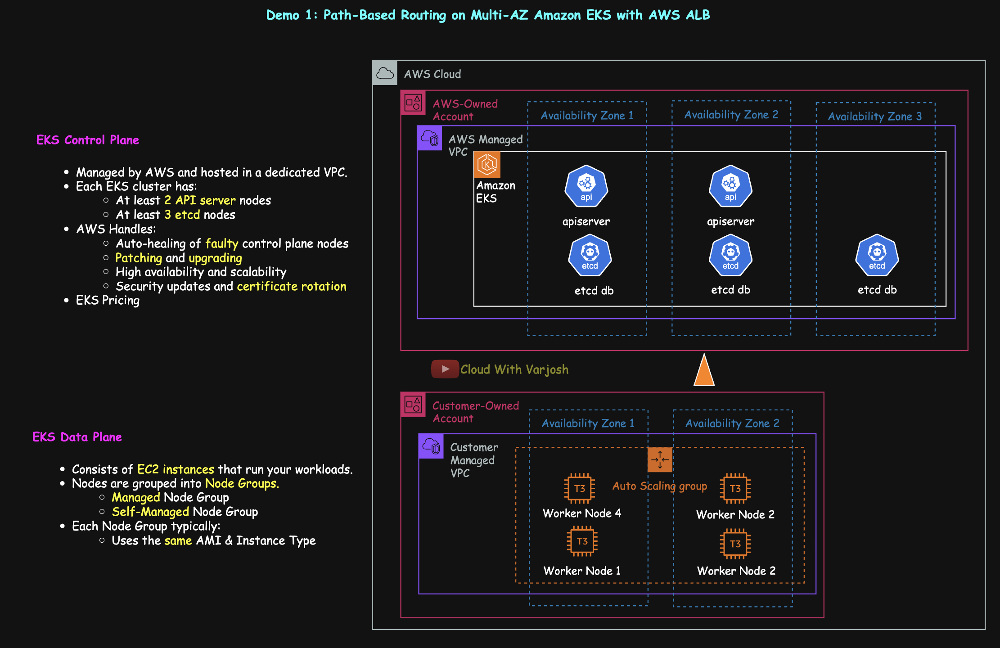

# Day 50: MASTER Kubernetes Ingress | PART 2 | Path-Based Routing on Amazon EKS with AWS ALB | CKA 2025

## Video reference for Day 50 is the following:

[](https://www.youtube.com/watch?v=4d0dkj6Vc70&ab_channel=CloudWithVarJosh)

---
## ⭐ Support the Project  
If this **repository** helps you, give it a ⭐ to show your support and help others discover it! 

---

## Table of Contents

* [Introduction](#introduction)
* [Demo 1: Path-Based Routing Using Ingress on Amazon EKS](#demo-1-path-based-routing-using-ingress-on-amazon-eks)
  * [What Are We Going to Deploy?](#what-are-we-going-to-deploy)
  * [Cluster Configuration](#cluster-configuration)
  * [Prerequisites](#prerequisites)
  * [Step 1: Provision EKS Cluster](#step-1-provision-eks-cluster)
  * [Step 2: Install AWS Load Balancer Controller](#step-2-install-aws-load-balancer-controller)
    * [Create IAM Policy](#create-iam-policy)
    * [Create an IAM-Backed Kubernetes Service Account](#create-an-iam-backed-kubernetes-service-account)
    * [Install the AWS Load Balancer Controller Using Helm](#install-the-aws-load-balancer-controller-using-helm)
  * [Step 3: Create Deployments and Services](#step-3-create-deployments-and-services)
  * [Step 4: Creating the Ingress Resource](#step-4-creating-the-ingress-resource)
    * [Understanding ALB Target Types in Amazon EKS](#understanding-alb-target-types-in-amazon-eks)
    * [Understanding `IngressClass`](#understanding-ingressclass)
  * [Step 5: End-to-End Verification](#step-5-end-to-end-verification)
  * [Step 6: Cleanup](#step-6-cleanup)
* [Conclusion](#conclusion)
* [References](#references)

---


## Introduction

Welcome to **Day 50** of the CKA 2025 course, and **Part 2** of our deep dive into **Kubernetes Ingress**. In this session, we bring theory to life by walking through a **real-world, production-ready demo** that showcases **path-based routing** on a **Multi-AZ Amazon EKS cluster**, powered by the **AWS Application Load Balancer (ALB)** Ingress Controller.

We’ll simulate a multi-service microfrontend application tailored for iPhone, Android, and Desktop users. By the end of this demo, you'll understand exactly how Kubernetes Ingress resources translate into a fully managed AWS ALB, how routing decisions are made based on URL paths, and how to deploy, test, and observe everything using native Kubernetes and AWS tooling.

This is a **foundational pattern** used in real-world applications to expose multiple backends via a single ALB, reduce infrastructure overhead, and simplify operations. Let’s build it step-by-step and understand the flow from external request to Pod-level routing.

---

## Demo 1: Path-Based Routing Using Ingress on Amazon EKS

In this demo, we’ll deploy a lightweight multi-service application named `app1` in the namespace `app1-ns` on a **Multi-AZ Amazon EKS cluster**. This application simulates three **frontend microservices** — one for iPhone users, one for Android, and a default desktop fallback — and exposes them externally using **Kubernetes Ingress** backed by an **AWS Application Load Balancer (ALB)**.

This demo focuses on **path-based routing**, where requests are routed to different services based on the URL path. It's a production-ready pattern that enables simplified routing and centralized traffic management using native Kubernetes constructs and AWS integration.

---

### What Are We Going to Deploy?


Based on the architecture diagram, here’s what the deployment involves:

1. **Three frontend microservices** under the `app1` namespace:

   * `iphone-svc` → serves requests to `/iphone`
   * `android-svc` → serves requests to `/android`
   * `desktop-svc` → serves as the default catch-all for `/` and unmatched paths

2. An **Ingress Resource** defines the routing logic, mapping URL paths to the corresponding Kubernetes Services.

3. The **AWS Load Balancer Controller (ALB Ingress Controller)** continuously watches for changes in Ingress resources and:

   * Provisions an **external HTTP(S) Load Balancer** in your AWS account
   * Creates routing rules and target groups based on the Ingress definition

4. **Traffic flow:**

   * User (e.g., Shwetangi) accesses `<lb-dnsname>/iphone` via the Internet.
   * The ALB receives the request and applies the listener rules based on path.
   * Traffic is routed directly to the corresponding Pods (on port `5678`), bypassing the NodePort layer using **target-type: ip** (enabled by the VPC CNI plugin).

5. All Kubernetes components — Services, Pods, and Ingress Controller — are deployed across **two Availability Zones**, offering fault tolerance and high availability.

> **Note:** The Ingress resource is declarative and doesn’t process traffic itself. It simply informs the Ingress Controller how the Load Balancer should be configured.

---


### Real-World Ingress Routing: `/iphone`, `/android`, and the Desktop Default

In this demo, we route traffic to different Kubernetes services based on the URL path:

* `myapp.com/iphone` routes to `iphone-svc`
* `myapp.com/android` routes to `android-svc`
* `myapp.com` (or any unmatched path) routes to `desktop-svc`

In production, end users don’t manually type these paths. Instead:

* The **Android app**, once installed from the Play Store, is hardcoded to call `myapp.com/android`, which routes to the Android service.
* The **iPhone app**, downloaded via the App Store, internally accesses `myapp.com/iphone`.
* **Desktop or browser users** who visit `myapp.com` directly are handled by a **catch-all path** in the Ingress, routing them to the `desktop-svc`.

This approach allows clean separation of traffic based on platform while keeping everything under a single domain (`myapp.com`) — handled efficiently via Ingress rules in Kubernetes.

---

### **Cluster Configuration**


This demo is built on an **Amazon EKS cluster** deployed in the `us-east-2 (Ohio)` region. The cluster spans two Availability Zones: `us-east-2a` and `us-east-2b`. It includes **four worker nodes** based on `t3.small` EC2 instances.

* **Why 4 nodes?** This demo uses 4 worker nodes to showcase features like `topologySpreadConstraints`, which rely on sufficient node distribution across AZs. However, you can reduce this to 2 for basic Ingress setups.
* **Why t3.small?** This instance type is eligible under AWS’s `$100 free tier credits`, making it ideal for learning environments. When provisioning via the AWS Console, non-eligible instance types appear greyed out, simplifying selection.

---

### **Prerequisites**

#### 1. Understanding of Kubernetes Services

Before beginning, ensure you’re comfortable with Kubernetes Services. These concepts were covered in Day 12 of the course:

* [YouTube Lecture (Day 12)](https://www.youtube.com/watch?v=92NB8oQBtnc&ab_channel=CloudWithVarJosh)
* [GitHub Resources (Day 12)](https://github.com/CloudWithVarJosh/CKA-Certification-Course-2025/tree/main/Day%2012)

#### 2. Install Required Tools

Ensure the following tools are installed on your local machine or cloud jump-host:

* [AWS CLI](https://docs.aws.amazon.com/cli/latest/userguide/getting-started-install.html)
* [eksctl](https://eksctl.io/installation/)
* [helm](https://helm.sh/docs/intro/install/)

---

## **Step 1: Provision EKS Cluster**

Create a file named `eks-config.yaml` with the following contents:

```yaml
apiVersion: eksctl.io/v1alpha5       # Defines the API version used by eksctl for parsing this config
kind: ClusterConfig                  # Declares the type of resource (an EKS cluster configuration)

metadata:
  name: cwvj-ingress-demo            # Name of the EKS cluster to be created
  region: us-east-2                 # AWS region where the cluster will be deployed (Ohio)
  tags:                             # Custom tags for AWS resources created as part of this cluster
    owner: varun-joshi              # Tag indicating the owner of the cluster
    bu: cwvj                        # Tag indicating business unit or project group
    project: ingress-demo           # Tag for grouping resources under the ingress demo project

availabilityZones:
  - us-east-2a                      # First availability zone for high availability
  - us-east-2b                      # Second availability zone to span the cluster

iam:
  withOIDC: true                    # Enables IAM OIDC provider, required for IAM roles for service accounts (IRSA)

managedNodeGroups:
  - name: cwvj-eks-priv-ng          # Name of the managed node group
    instanceType: t3.small          # EC2 instance type for worker nodes
    minSize: 4                      # Minimum number of nodes in the group
    maxSize: 4                      # Maximum number of nodes (fixed at 4 here; no autoscaling)
    privateNetworking: true         # Launch nodes in **private subnets only** (no public IPs)
    volumeSize: 20                  # Size (in GB) of EBS volume attached to each node
    iam:
      withAddonPolicies:           # Enables AWS-managed IAM policies for certain addons
        autoScaler: true           # Allows Cluster Autoscaler to manage this node group
        externalDNS: false         # Disables permissions for ExternalDNS (not used in this demo)
        certManager: yes           # Grants cert-manager access to manage certificates using IAM
        ebs: false                 # Disables EBS volume policy (not required here)
        fsx: false                 # Disables FSx access
        efs: false                 # Disables EFS access
        albIngress: true           # Grants permissions needed by AWS Load Balancer Controller (ALB)
        xRay: false                # Disables AWS X-Ray (tracing not needed)
        cloudWatch: false          # Disables CloudWatch logging from nodes (optional in minimal setups)
    labels:
      lifecycle: ec2-autoscaler     # Custom label applied to all nodes in this group (useful for targeting in node selectors or autoscaler configs)

```

Create the cluster using:

```bash
eksctl create cluster -f eks-config.yaml
```

Verify the node distribution across AZs:

```bash
kubectl get nodes --show-labels | grep topology.kubernetes.io/zone
```

This ensures that the nodes are evenly distributed across the specified availability zones, which is critical for demonstrating topology-aware workloads.

---

## **Step 2: Install AWS Load Balancer Controller**

The AWS Load Balancer Controller is required for managing ALBs (Application Load Balancers) in Kubernetes using the native `Ingress` API. It watches for `Ingress` resources and creates ALBs accordingly, enabling advanced HTTP features such as path-based and host-based routing. It also supports integration with target groups, health checks, SSL termination, and more.

This step involves two sub-phases:

* Setting up the IAM permissions that allow the controller to interact with AWS APIs
* Installing the controller itself using Helm

---

### **2.1 Create IAM Policy**

The AWS Load Balancer Controller requires specific IAM permissions to provision and manage ALB resources on your behalf (such as creating Target Groups, Listeners, and Rules).

Download the required IAM policy:

```bash
curl -O https://raw.githubusercontent.com/kubernetes-sigs/aws-load-balancer-controller/v2.13.3/docs/install/iam_policy.json
```

Create the policy in your AWS account:

```bash
aws iam create-policy \
  --policy-name AWSLoadBalancerControllerIAMPolicy \
  --policy-document file://iam_policy.json
```

> The created policy will be used to grant your controller the ability to call ELB, EC2, and IAM APIs. You can inspect the JSON file for exact permissions.

---

### **2.2 Create an IAM-Backed Kubernetes Service Account**

We now create a Kubernetes `ServiceAccount` that is linked to the IAM policy created above. This is achieved using `eksctl`, which automatically sets up the necessary IAM Role and CloudFormation resources under the hood.

```bash
eksctl create iamserviceaccount \
  --cluster=cwvj-ingress-demo \
  --namespace=kube-system \
  --name=aws-load-balancer-controller \
  --attach-policy-arn=arn:aws:iam::261358761470:policy/AWSLoadBalancerControllerIAMPolicy \
  --override-existing-serviceaccounts \
  --region us-east-2 \
  --approve
```

This command does the following:

* Creates an **IAM Role** with the required policy attached (visible in AWS CloudFormation).
* Annotates a Kubernetes **ServiceAccount** with this role.
* Binds the ServiceAccount to the controller pods that we will deploy in the next step.

To verify:

```bash
kubectl get sa -n kube-system aws-load-balancer-controller -o yaml
```

Example output:

```yaml
apiVersion: v1
kind: ServiceAccount
metadata:
  name: aws-load-balancer-controller
  namespace: kube-system
  annotations:
    eks.amazonaws.com/role-arn: arn:aws:iam::261358761470:role/eksctl-cwvj-ingress-demo-addon-iamserviceacco-Role1-Llblca1iSsNh
```

This annotation allows the controller pod to **assume the IAM role** and make API calls securely from within the cluster.

---

### **2.3 Install the AWS Load Balancer Controller Using Helm**

> Note: The **AWS Load Balancer Controller** was previously known as the **ALB Ingress Controller**. While the functionality has expanded beyond ALBs, many community articles and annotations still use the older term. The official and recommended name is now AWS Load Balancer Controller.

Add the AWS-maintained Helm chart repository:

```bash
helm repo add eks https://aws.github.io/eks-charts
helm repo update eks
```

Install the controller:

```bash
helm install aws-load-balancer-controller eks/aws-load-balancer-controller \
  -n kube-system \
  --set clusterName=cwvj-ingress-demo \
  --set serviceAccount.create=false \
  --set serviceAccount.name=aws-load-balancer-controller \
  --version 1.13.0
```

> The `--set serviceAccount.create=false` flag ensures that Helm does not attempt to create a new service account. We are using the one we created and annotated earlier using `eksctl`.

> `helm list` alone won’t show the AWS Load Balancer Controller, as it’s installed in the `kube-system` namespace. Use `helm list -n kube-system` or `helm list -A` to view it.


Optional: List available versions of the chart

```bash
helm search repo eks/aws-load-balancer-controller --versions
```

Verify that the controller is installed:

```bash
kubectl get deployment -n kube-system aws-load-balancer-controller
```

Expected output:

```
NAME                           READY   UP-TO-DATE   AVAILABLE   AGE
aws-load-balancer-controller   2/2     2            2           84s
```

Inspect the pods to verify the correct service account is mounted:

```bash
kubectl describe pods -n kube-system -l app.kubernetes.io/name=aws-load-balancer-controller
```

Look for this line under the pod description:

```
Service Account: aws-load-balancer-controller
```

This confirms the pods are using the IAM-bound service account, enabling them to create ALBs, target groups, and associated rules when `Ingress` resources are created.

---
**Reference Links**

* **AWS Documentation**: [Installing AWS Load Balancer Controller](https://docs.aws.amazon.com/eks/latest/userguide/lbc-helm.html)
* **GitHub Repository**: [AWS Load Balancer Controller GitHub](https://github.com/kubernetes-sigs/aws-load-balancer-controller)


---

## Step 3: Create Deployments and Services for iPhone, Android, and Desktop Users

This step creates three separate deployments and corresponding services, each exposing a static HTML page to simulate platform-specific landing pages. These applications will be accessed via context path routing using an Ingress resource in the later steps.

---

### **3.1 Create a Dedicated Namespace**

**01-ns.yaml**

```yaml
apiVersion: v1
kind: Namespace
metadata:
  name: app1-ns
```

> We create a dedicated namespace `app1-ns` to logically isolate all resources related to this application. Namespaces help with resource scoping, management, and RBAC.

Apply the namespace:

```bash
kubectl apply -f 01-ns.yaml
```

Set it as the default for the current context to avoid specifying `-n app1-ns` repeatedly:

```bash
kubectl config set-context --current --namespace=app1-ns
```

---

### **3.2 iPhone Deployment and Service**

**02-iphone.yaml**

```yaml
apiVersion: apps/v1
kind: Deployment
metadata:
  name: iphone-deploy
  namespace: app1-ns
spec:
  replicas: 2
  selector:
    matchLabels:
      app: iphone-page
  template:
    metadata:
      labels:
        app: iphone-page
    spec:
      topologySpreadConstraints:
      - maxSkew: 1
        topologyKey: topology.kubernetes.io/zone
        whenUnsatisfiable: ScheduleAnyway
        labelSelector:
          matchLabels:
            app: iphone-page
      containers:
      - name: python-http
        image: python:alpine
        command: ["/bin/sh", "-c"]
        args:
          - |
            mkdir -p /iphone && echo '<html>
              <head><title>iPhone Users</title></head>
              <body>
                <h1>iPhone Users</h1>
                <p>Welcome to Cloud With VarJosh</p>
              </body>
            </html>' > /iphone/index.html && cd / && python3 -m http.server 5678
        ports:
        - containerPort: 5678
---
apiVersion: v1
kind: Service
metadata:
  name: iphone-svc
  namespace: app1-ns
  annotations:
    alb.ingress.kubernetes.io/healthcheck-path: /iphone/index.html
spec:
  selector:
    app: iphone-page
  ports:
  - protocol: TCP
    port: 80
    targetPort: 5678
```

**Explanation:**

* `python:alpine` image runs a minimal HTTP server on port `5678` to serve `/iphone/index.html`.
* `topologySpreadConstraints` ensure pods are distributed across availability zones (`topology.kubernetes.io/zone`) with `maxSkew: 1`, minimizing zonal skew.
* The Service listens on port 80 (ClusterIP), forwarding to container port 5678.
* ALB health check is scoped to `/iphone/index.html` via annotation on the service.

Apply the resources:

```bash
kubectl apply -f 02-iphone.yaml
```

---

### **3.3 Android Deployment and Service**

**03-android.yaml**

```yaml
apiVersion: apps/v1
kind: Deployment
metadata:
  name: android-deploy
  namespace: app1-ns
spec:
  replicas: 2
  selector:
    matchLabels:
      app: android-page
  template:
    metadata:
      labels:
        app: android-page
    spec:
      topologySpreadConstraints:
      - maxSkew: 1
        topologyKey: topology.kubernetes.io/zone
        whenUnsatisfiable: ScheduleAnyway
        labelSelector:
          matchLabels:
            app: android-page
      containers:
      - name: python-http
        image: python:alpine
        command: ["/bin/sh", "-c"]
        args:
          - |
            mkdir -p /android && echo '<html>
              <head><title>Android Users</title></head>
              <body>
                <h1>Android Users</h1>
                <p>Welcome to Cloud With VarJosh</p>
              </body>
            </html>' > /android/index.html && cd / && python3 -m http.server 5678
        ports:
        - containerPort: 5678
---
apiVersion: v1
kind: Service
metadata:
  name: android-svc
  namespace: app1-ns
  annotations:
    alb.ingress.kubernetes.io/healthcheck-path: /android/index.html
spec:
  selector:
    app: android-page
  ports:
  - protocol: TCP
    port: 80
    targetPort: 5678
```

**Explanation:**

* Follows the same pattern as iPhone, except the route is `/android/index.html`.
* Health checks are isolated per app context, which is crucial when a single ALB serves multiple routes.
* Distribution of pods across zones is maintained.

Apply the resources:

```bash
kubectl apply -f 03-android.yaml
```

---

### **3.4 Desktop Deployment and Service**

**04-desktop.yaml**

```yaml
apiVersion: apps/v1
kind: Deployment
metadata:
  name: desktop-deploy
  namespace: app1-ns
spec:
  replicas: 2
  selector:
    matchLabels:
      app: desktop-page
  template:
    metadata:
      labels:
        app: desktop-page
    spec:
      topologySpreadConstraints:
      - maxSkew: 1
        topologyKey: topology.kubernetes.io/zone
        whenUnsatisfiable: ScheduleAnyway
        labelSelector:
          matchLabels:
            app: desktop-page
      containers:
      - name: python-http
        image: python:alpine
        command: ["/bin/sh", "-c"]
        args:
          - |
            echo '<html>
              <head><title>Desktop Users</title></head>
              <body>
                <h1>Desktop Users</h1>
                <p>Welcome to Cloud With VarJosh</p>
              </body>
            </html>' > /index.html && python3 -m http.server 5678
        ports:
        - containerPort: 5678
---
apiVersion: v1
kind: Service
metadata:
  name: desktop-svc
  namespace: app1-ns
  annotations:
    alb.ingress.kubernetes.io/healthcheck-path: /index.html
spec:
  selector:
    app: desktop-page
  ports:
  - protocol: TCP
    port: 80
    targetPort: 5678
```

**Explanation:**

* Desktop variant serves content at `/index.html` from the root path, suitable for default catch-all routing.
* The rest of the configuration follows the same pattern.
* Health check path aligns with this root content.

Apply the resources:

```bash
kubectl apply -f 04-desktop.yaml
```

---

### **Verification Commands**

To verify deployments and services:

```bash
kubectl get deployments
kubectl get services
```

To verify pod distribution across AZs:

```bash
kubectl get pods -o wide --sort-by='.spec.nodeName'
```

You’ll observe that pods from each deployment are spread across both AZs, thanks to the `topologySpreadConstraints`.

---

## **Step 4: Creating the Ingress Resource**

When you apply an Ingress resource in a Kubernetes cluster configured with the **AWS Load Balancer Controller**, it acts as a blueprint. The controller watches for Ingress objects and, upon detecting this configuration, **provisions an actual AWS Application Load Balancer (ALB)** using the specifications defined in the manifest.

> Think of the Ingress resource not as a traffic hop but as a **declarative configuration** for the external ALB that will be created in AWS. The traffic still flows directly through the ALB to your service pods.

Since the AWS Load Balancer Controller is installed and mapped to a service account with the necessary IAM permissions, it can interact with AWS APIs to automatically create:

* An ALB with listeners
* Target groups for your services
* Health check settings
* Routing rules

### **Manifest: 05-ingress.yaml**

```yaml
apiVersion: networking.k8s.io/v1           # API version for Ingress resource; stable since Kubernetes v1.19
kind: Ingress                              # Declares that this manifest defines an Ingress resource
metadata:
  name: ingress-demo1                      # Name of the Ingress resource
  namespace: app1-ns                       # Namespace in which this Ingress is deployed
  annotations:
    alb.ingress.kubernetes.io/scheme: internet-facing
    # Makes the ALB internet-facing (publicly accessible); other option is 'internal' for private use

    alb.ingress.kubernetes.io/load-balancer-name: cwvj-ingress-demo1
    # Assigns a custom name to the ALB; helpful for identification in the AWS Console

    alb.ingress.kubernetes.io/target-type: ip
    # Registers individual Pod IPs (via VPC CNI) in ALB target groups, skipping NodePort/host networking

    alb.ingress.kubernetes.io/listen-ports: '[{"HTTP": 80}]'
    # Configures the ALB to listen on HTTP port 80; JSON array allows multiple listeners if needed (e.g., HTTPS)

    alb.ingress.kubernetes.io/healthcheck-protocol: HTTP
    # Defines protocol used for ALB health checks (can be HTTP or HTTPS)

    alb.ingress.kubernetes.io/healthcheck-port: traffic-port
    # Uses the same port as the listener for health checks ('traffic-port' is a special keyword)

    alb.ingress.kubernetes.io/healthcheck-interval-seconds: '15'
    # Frequency (in seconds) with which ALB sends health check requests

    alb.ingress.kubernetes.io/healthcheck-timeout-seconds: '5'
    # Max time (in seconds) to wait for a health check response

    alb.ingress.kubernetes.io/healthy-threshold-count: '2'
    # Number of successful health checks before a target is marked healthy

    alb.ingress.kubernetes.io/unhealthy-threshold-count: '2'
    # Number of failed health checks before a target is marked unhealthy

    alb.ingress.kubernetes.io/success-codes: '200'
    # ALB considers HTTP 200 as a successful health check response

spec:
  ingressClassName: alb                    # Instructs Kubernetes to use the AWS ALB Ingress Controller for this resource

  rules:                                   # List of rules that define how traffic is routed
    - http:                                # All rules here apply to HTTP traffic
        paths:                             # Each entry defines a routing path
          - path: /iphone
            pathType: Prefix               # Match all paths that start with '/iphone'
            backend:
              service:
                name: iphone-svc           # Traffic matching '/iphone' goes to this Kubernetes Service
                port:
                  number: 80               # Service port (which maps to containerPort 5678 inside pods)

          - path: /android
            pathType: Prefix               # Match all paths starting with '/android'
            backend:
              service:
                name: android-svc          # Routes traffic to android-svc
                port:
                  number: 80               # Matches the port exposed by the android-svc

          - path: /
            pathType: Prefix               # Catch-all path for requests that don't match the above
            backend:
              service:
                name: desktop-svc          # Default backend service for unmatched paths (e.g., desktop)
                port:
                  number: 80               # Service port for desktop-svc

```

Apply the resource:

```bash
kubectl apply -f 05-ingress.yaml
```

---


## Understanding ALB Target Types in Amazon EKS

When you use the **AWS Load Balancer Controller** with Kubernetes `Ingress`, the annotation `alb.ingress.kubernetes.io/target-type` controls how backend targets are registered in the ALB Target Group. It defines how traffic flows from the ALB to your Pods.

In **Demo 1**, you're performing **path-based routing** using an ALB with `/iphone`, `/android`, and `/` as prefixes. DNS, Route 53, and TLS via ACM are not introduced yet — those come in later demos.

---

### `target-type: ip` — Direct-to-Pod Routing via VPC CNI

When you set `target-type: ip`, the ALB registers **Pod IPs** directly in its Target Groups. This is possible because the **AWS VPC CNI plugin** assigns each Pod a routable secondary IP from the VPC subnet range. The Kubernetes `Service` is still needed, but only for discovering the backend Pods — it does not participate in traffic forwarding.

> Reduces network hops and supports Pod-level health checks.

**Flow (Left to Right):**

```
Shwetangi → <lb-dnsname>/iphone → Internet → AWS ALB → iphone target group (type = ip) → Pod IP (via Node’s VPC ENI) → iphone container (port 5678)
```

#### Key Pointers (as per diagram):

* **Kubernetes Service** is used **only** to identify backend Pods.
* **ALB forwards traffic directly** to Pod IPs (fewer hops).
* **Requires correct Security Group rules on Node ENIs**, which are **automatically handled by the AWS Load Balancer Controller** during ALB provisioning.

Suitable for clusters using **AWS VPC CNI** (default on EKS).

---

### `target-type: instance` — NodePort-Based Routing via kube-proxy

When using `target-type: instance`, the ALB registers **EC2 worker nodes** (not Pod IPs) in the Target Group. For this to work, the backing Kubernetes Service must be of type **NodePort**, which exposes a high-range port on each node. The ALB sends traffic to these NodePorts. Then, the traffic flows through **`kube-proxy`** to reach a matching Pod using internal routing.

> ⚠️ Adds more hops and only supports node-level health checks.

**Flow (Left to Right):**

```
Shwetangi → <lb-dnsname>/iphone → Internet → AWS ALB → iphone target group (type = instance) → EC2 Node (NodePort) → kube-proxy → ClusterIP Service → Pod IP → iphone container (port 5678)
```

#### Key Pointers (as per diagram):

* **ALB routes to EC2 NodePort**; traffic flows through **kube-proxy**.
* Adds **extra network hops** and indirect routing.
* **Works without VPC CNI**, making it ideal for alternate CNIs like **Calico**, **Weave**, etc.

This mode is more flexible in terms of CNI support, but slightly less efficient.

---


### **Understanding `IngressClass`**

Just like Kubernetes uses `StorageClass` to dynamically provision different types of volumes (e.g., gp3, io1), `IngressClass` enables the selection of a specific ingress controller. This is important when:

* Your cluster uses multiple ingress controllers (e.g., AWS ALB, NGINX, Istio)
* You want to default routing to a particular controller when none is explicitly mentioned

---

### When and Why You Might Run Multiple Ingress Controllers in a Cluster

##### Scenario 1: Protocol-Specific Routing

Some workloads need advanced TCP/UDP support not handled by standard ingress controllers. For instance, HAProxy may be used for Layer 4 traffic, while AWS ALB continues to serve HTTP/HTTPS apps. This allows protocol-specific handling without disrupting existing ingress flows.

##### Scenario 2: Multi-Tenant Isolation

In multi-tenant clusters, teams may need independent ingress control. One team might prefer NGINX for flexibility, while another opts for ALB due to AWS integration. Running both enables team-level autonomy without conflict.

##### Scenario 3: Environment or Regional Segmentation

Clusters shared across environments or regions often need separate ingress behavior. You might run NGINX for staging with lenient rules, and ALB for production with strict compliance. Multiple controllers help enforce such environment-specific policies cleanly.


---


Check available ingress classes:

```bash
kubectl get ingressclass
```

Sample output:

```
NAME   CONTROLLER            PARAMETERS   AGE
alb    ingress.k8s.aws/alb   <none>       3h38m
```

In our case, `alb` was auto-created during AWS LBC installation.


---
Check the deployed ingress:

```bash
kubectl get ingress
```

Sample output:

```
NAME            CLASS   HOSTS   ADDRESS                                                    PORTS   AGE
ingress-demo1   alb     *       cwvj-ingress-demo1-351634829.us-east-2.elb.amazonaws.com   80      33s
```

> **Allow up to  ~3 minutes** for the external ALB to be provisioned after applying the Ingress manifest. You can monitor its creation in the AWS Console under EC2 → Load Balancers.

---


### **Step 5: End-to-End Verification**

Before testing, let’s connect the dots by walking through the end-to-end routing flow for each path: `/iphone`, `/android`, and `/`. This will help solidify how Ingress, Services, Deployments, and AWS Load Balancer Controller work together to route external traffic to internal workloads.

---

### **Test the Routing**

Once the ALB is fully provisioned and all services report healthy targets, test routing via the ALB's DNS name.

#### **iPhone Users Route**

```
http://cwvj-ingress-demo1-351634829.us-east-2.elb.amazonaws.com/iphone
```

Expected Output:

```
iPhone Users
Welcome to Cloud With VarJosh
```

This is served by the `iphone-deploy` pods, with static HTML under `/iphone/index.html`.

---

#### **Android Users Route**

```
http://cwvj-ingress-demo1-351634829.us-east-2.elb.amazonaws.com/android
```

Expected Output:

```
Android Users
Welcome to Cloud With VarJosh
```

This is served by the `android-deploy` pods from `/android/index.html`.

---

#### **Desktop Users Route (Default/Catch-All)**

```
http://cwvj-ingress-demo1-351634829.us-east-2.elb.amazonaws.com/
```

Expected Output:

```
Desktop Users
Welcome to Cloud With VarJosh
```

This route is matched last and acts as the catch-all fallback. If the request path doesn't match `/iphone` or `/android`, it routes to `desktop-svc`, which serves from the root (`/index.html`).

---

### **Verify the Ingress Configuration**

You can use the following command to inspect your Ingress setup and ensure everything is registered as expected:

```bash
kubectl describe ingress ingress-demo1
```

Look for:

* Ingress class (`alb`)
* Load balancer hostname (ALB DNS name)
* Path rules and associated backends
* Events showing successful sync with the AWS Load Balancer Controller

---

### **Verify from the AWS Console**

To cross-check that your Ingress configuration has been reflected properly:

Navigate to **EC2 → Load Balancers** and locate the ALB with the name defined in:

```yaml
alb.ingress.kubernetes.io/load-balancer-name: cwvj-ingress-demo1
```

Then verify:

* **Scheme** is set to `internet-facing`
* **Listener** is configured on port `80`
* **Target Groups** are created for `iphone-svc`, `android-svc`, and `desktop-svc` with target type `ip`
* **Health Check** settings for each target group match the annotations set on the respective Service
* **Routing Rules** map `/iphone`, `/android`, and `/` paths to the correct target groups


By completing this verification, you confirm that your AWS ALB was dynamically provisioned and fully configured based on the Kubernetes-native Ingress resource—bridging the gap between Kubernetes and AWS networking seamlessly.

---


### **Step 6: Cleanup**

#### **Cleanup**

To remove the Kubernetes resources created during this demo, you can run:

```bash
kubectl delete -f .
```

> This command assumes all manifest files (`Namespace`, `Deployments`, `Services`, `Ingress`) are present in the current directory and were originally applied from here.

If you prefer to delete resources manually, use:

```bash
kubectl delete ingress ingress-demo1
kubectl delete svc iphone-svc android-svc desktop-svc
kubectl delete deploy iphone-deploy android-deploy desktop-deploy
kubectl delete ns app1-ns
```

This will:

* Remove the **Ingress** and associated **AWS Application Load Balancer**
* Delete **target groups**, **listeners**, and **security groups** that were provisioned dynamically

> **Note**: If you're done with all demos and want to completely clean up your EKS environment, you can delete the entire cluster using:

```bash
eksctl delete cluster --name cwvj-ingress-demo
```

> However, since we will build upon the same cluster in **Demo 2**, do **not delete the cluster** yet.

---

## Conclusion

In this hands-on walkthrough, we built a realistic and highly available **path-based routing** setup on **Amazon EKS** using Kubernetes-native constructs. By deploying separate deployments and services for iPhone, Android, and Desktop users and binding them to an **Ingress resource**, we let the **AWS Load Balancer Controller** provision and configure an external **ALB** that handles traffic routing with minimal manual effort.

We explored how `target-type: ip` enables **direct-to-pod routing**, bypassing unnecessary layers like NodePorts and kube-proxy — a more efficient and scalable solution for EKS environments using **VPC CNI**.

With this demo, you now have a working model of a **multi-path Ingress setup**, an understanding of how Kubernetes and AWS work together, and clarity on how to structure Ingress resources for multiple services behind a single ALB.

In **Part 3**, we’ll extend this to include **TLS termination** using **AWS Certificate Manager (ACM)** and **subdomain-based routing** via **Route 53**, completing the full picture for a secure, multi-service public application on EKS.

---

## References

Here are some links and resources that were either used or mentioned during the demo:

* **AWS Official Docs – Load Balancer Controller:**
  [https://docs.aws.amazon.com/eks/latest/userguide/aws-load-balancer-controller.html](https://docs.aws.amazon.com/eks/latest/userguide/aws-load-balancer-controller.html)

* **AWS Load Balancer Controller GitHub (Source + Examples):**
  [https://github.com/kubernetes-sigs/aws-load-balancer-controller](https://github.com/kubernetes-sigs/aws-load-balancer-controller)

* **Ingress Concepts (Kubernetes Docs):**
  [https://kubernetes.io/docs/concepts/services-networking/ingress/](https://kubernetes.io/docs/concepts/services-networking/ingress/)

* **Topological Constraints in Kubernetes:**
  [https://kubernetes.io/docs/concepts/scheduling-eviction/topology-spread-constraints/](https://kubernetes.io/docs/concepts/scheduling-eviction/topology-spread-constraints/)

* **Annotation Options:**
https://kubernetes-sigs.github.io/aws-load-balancer-controller/latest/guide/ingress/annotations/

---
