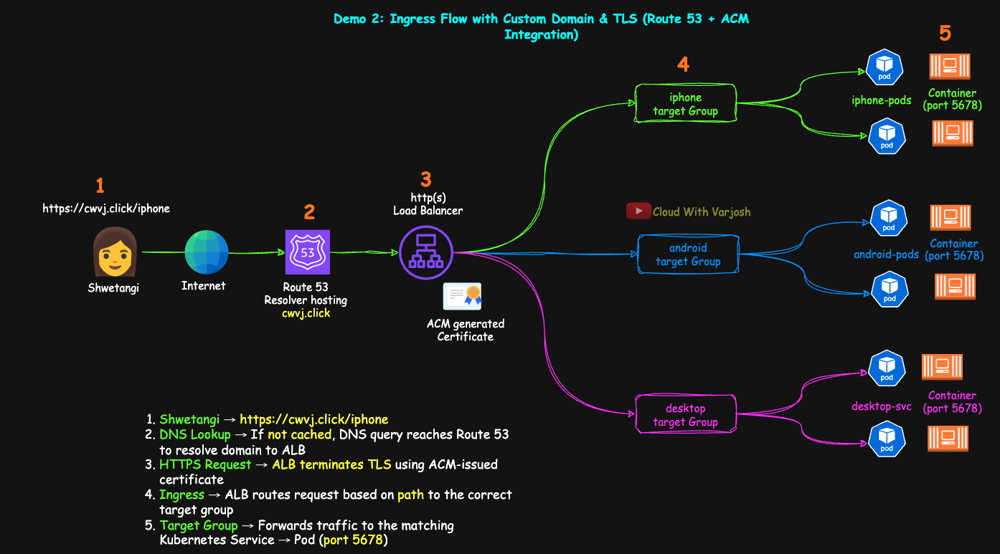
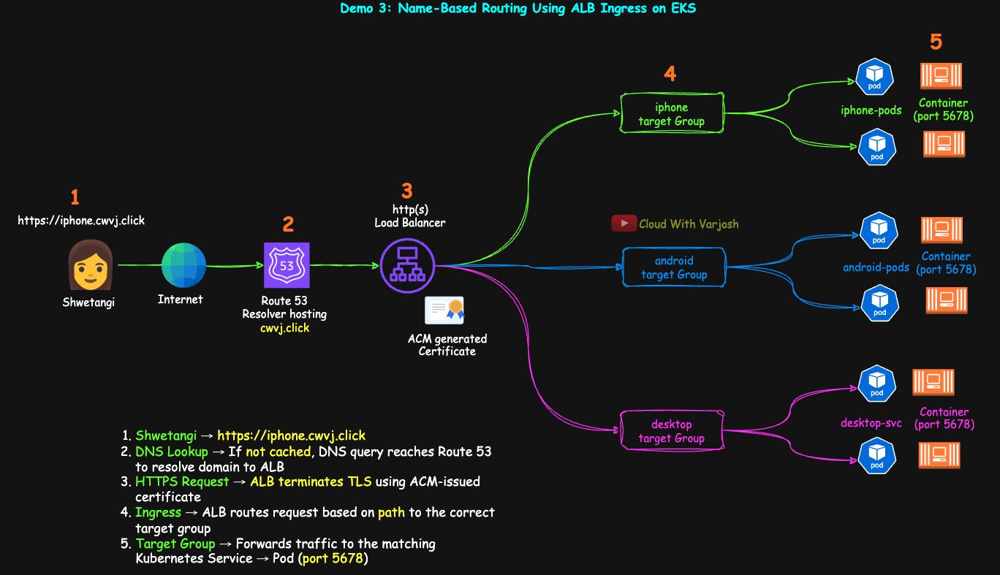

# Day 51: MASTER Kubernetes Ingress | PART 3 | TLS & Subdomain Routing on EKS with AWS ALB | CKA 2025

## Video reference for Day 51 is the following:

[](https://www.youtube.com/watch?v=ABqaWXSIFXc&ab_channel=CloudWithVarJosh)


---
## ⭐ Support the Project  
If this **repository** helps you, give it a ⭐ to show your support and help others discover it! 

---

## Table of Contents

* [Pre-requisites](#pre-requisites)

  * [1. Understand DNS Resolution](#1-understand-dns-resolution)
  * [2. Watch Ingress Part 1 – Real-World Flow of Ingress](#2-watch-ingress-part-1--real-world-flow-of-ingress)
  * [3. Watch Ingress Part 2 – Path-Based Routing on EKS](#3-watch-ingress-part-2--path-based-routing-on-eks)
* [Demo 2: Ingress with TLS and Custom Domain Integration on Amazon EKS](#demo-2-ingress-with-tls-and-custom-domain-integration-on-amazon-eks)

  * [Step 1: Register Domain and Request TLS Certificate](#step-1-register-domain-and-request-tls-certificate)
  * [Step 2: Update Ingress Resource to Enable HTTPS](#step-2-update-ingress-resource-to-enable-https)
  * [Step 3: Create a Route 53 Record](#step-3-create-a-route-53-record)
  * [Step 4: Verification](#step-4-verification)
  * [Step 5: Cleanup](#step-5-cleanup)
* [Demo 3: Name-Based Routing Using ALB Ingress on EKS](#demo-3-name-based-routing-using-alb-ingress-on-eks)

  * [Step 1: Request Certificates in ACM](#step-1-request-certificates-in-acm)
  * [Step 2: Update Deployments and Services](#step-2-update-deployments-and-services)
  * [Step 3: Create Ingress for Name-Based Routing](#step-3-create-ingress-for-name-based-routing)
  * [Step 4: Route 53 Alias Records](#step-4-route-53-alias-records)
  * [Step 5: Verification](#step-5-verification-1)
  * [Step 6: Cleanup](#step-6-cleanup)
* [Conclusion](#conclusion)
* [References](#references)

---

## Introduction

Welcome to **Day 51** of the CKA 2025 series, and **Part 3** of our in-depth walkthrough on Kubernetes Ingress. In this final segment, we move beyond simple path-based routing and elevate our setup to support **TLS termination** and **subdomain-based routing** using **Amazon Route 53** and **AWS Certificate Manager (ACM)** on **Amazon EKS**.

You’ll learn how to:

* Secure your workloads with valid TLS certificates
* Register and configure custom domains in Route 53
* Route traffic to different apps based on subdomains (like `iphone.cwvj.click`)

This lesson closes the loop on everything you need to build a **production-ready ingress gateway** using Kubernetes-native manifests and AWS-native services.

---

## **Pre-requisites**

To fully benefit from **Part 3**, ensure you're familiar with the following concepts and prior demos:

### **1. Understand DNS Resolution**

This demo uses custom domains and TLS via ACM and Route 53. A clear understanding of DNS resolution and hosted zones is essential.

* **YouTube:** [DNS Explained](https://www.youtube.com/watch?v=hXFciOpUuOY&ab_channel=CloudWithVarJosh)
* **GitHub Notes:** [DNS Lecture Resources](https://github.com/CloudWithVarJosh/YouTube-Standalone-Lectures/tree/main/Lectures/01-DNS)

---

### **2. Watch Ingress Part 1 – Real-World Flow of Ingress**

We explored **what Ingress is**, why it's important, how it works behind the scenes.

* **YouTube:** [MASTER Kubernetes Ingress | PART 1](https://www.youtube.com/watch?v=yj-ZlKTYDUI&ab_channel=CloudWithVarJosh)
* **GitHub Code:** [Day 49 Resources](https://github.com/CloudWithVarJosh/CKA-Certification-Course-2025/tree/main/Day%2049)

---

### **3. Watch Ingress Part 2 – Path-Based Routing on EKS**

We built on Part 1 with a complete hands-on demo for **path-based routing**, deploying multiple apps under a shared ALB, and understanding how routing rules are defined in Ingress manifests.

* **YouTube:** [MASTER Kubernetes Ingress | PART 2](https://www.youtube.com/watch?v=4d0dkj6Vc70&ab_channel=CloudWithVarJosh)
* **GitHub Code:** [Day 50 Resources](https://github.com/CloudWithVarJosh/CKA-Certification-Course-2025/tree/main/Day%2050)

---


## **Demo 2: Ingress with TLS and Custom Domain Integration on Amazon EKS**

In this demo, we will elevate our basic ingress setup into a more **production-ready configuration** by integrating:

* A custom domain purchased via **Route 53**
* A **TLS certificate** issued using **AWS Certificate Manager (ACM)**
* ALB configuration to accept **only HTTPS (port 443)** traffic
* **Host-based routing** support (in follow-up steps)



> Note: If you're using AWS Free Tier or credits, be aware that Route 53 domain registration is a **paid** service. As an example, `.click` TLD domains typically cost around **\$3/year**, which is reasonable for your personal learning lab.

---


## **Step 1: Register Domain and Request TLS Certificate**

1. Go to the **Route 53 Console** → **Domains** → Register your domain (e.g., `cwvj.click`).
2. Once registered, Route 53 will automatically create a hosted zone with **4 name servers**.
3. Now navigate to **AWS Certificate Manager (ACM)** → **Request a certificate**.
4. Choose **"Request a public certificate"**, and enter your domain name (`cwvj.click`).
5. Choose **DNS validation**, and when prompted, allow ACM to **create the validation records** in Route 53.
6. ACM will verify the DNS ownership via CNAME records, and issue the certificate once the validation succeeds.

---

## **Step 2: Update Ingress Resource to Enable HTTPS**

Update your Ingress manifest to:

* Attach the **issued ACM certificate**
* Enable **port 443**
* Add **SSL redirection**

```yaml
# 05-ingress.yaml
apiVersion: networking.k8s.io/v1
kind: Ingress
metadata:
  name: ingress-demo2
  namespace: app1-ns
  annotations:
    # Basic ALB configuration
    alb.ingress.kubernetes.io/scheme: internet-facing
    alb.ingress.kubernetes.io/load-balancer-name: cwvj-ingress-demo2
    alb.ingress.kubernetes.io/target-type: ip

    # ALB Listener configuration (enable both HTTP and HTTPS)
    alb.ingress.kubernetes.io/listen-ports: '[{"HTTPS":443}, {"HTTP":80}]'

    # SSL settings
    alb.ingress.kubernetes.io/certificate-arn: arn:aws:acm:us-east-2:261358761470:certificate/6ab64476-8f23-4030-a291-4e8d6a3dcb35
    alb.ingress.kubernetes.io/ssl-redirect: '443'

    # Health check parameters (inherited by each target group from service annotations)
    alb.ingress.kubernetes.io/healthcheck-protocol: HTTP
    alb.ingress.kubernetes.io/healthcheck-port: traffic-port
    alb.ingress.kubernetes.io/healthcheck-interval-seconds: '15'
    alb.ingress.kubernetes.io/healthcheck-timeout-seconds: '5'
    alb.ingress.kubernetes.io/healthy-threshold-count: '2'
    alb.ingress.kubernetes.io/unhealthy-threshold-count: '2'
    alb.ingress.kubernetes.io/success-codes: '200'

spec:
  ingressClassName: alb
  rules:
    - http:
        paths:
          - path: /iphone
            pathType: Prefix
            backend:
              service:
                name: iphone-svc
                port:
                  number: 80
          - path: /android
            pathType: Prefix
            backend:
              service:
                name: android-svc
                port:
                  number: 80
          - path: /
            pathType: Prefix
            backend:
              service:
                name: desktop-svc
                port:
                  number: 80
```

> You can now apply the manifests (assuming you’re in the `demo2/` directory):

```bash
kubectl apply -f .
```

---

### **Step 3: Create a Route 53 Record**

Once the ALB is provisioned and you have the **DNS name** from `kubectl get ingress ingress-demo2` or the **AWS Console**, you’ll need to associate your domain with this ALB.

**Instructions:**

1. Navigate to **Route 53 → Hosted Zones → cwvj.click**.
2. Click **Create Record**.
3. Since we are setting this up for the **apex domain** (`cwvj.click`), leave the **Record name** blank.
4. Select **Alias**.
5. Under “Route traffic to”, choose:

   * **Alias to: Application and Classic Load Balancer**
   * **Region: us-east-2** (or your cluster’s region)
   * **Choose Load Balancer:** Select the ALB provisioned by your Ingress (it should contain `cwvj-ingress-demo2` in the name).
6. Click **Create records**.

This will ensure that `https://cwvj.click` (and its subpaths) resolve to your newly provisioned AWS ALB.

---


## **Step 4: Verification**

Try accessing the following URLs:

```bash
https://cwvj.click/
→ Desktop Users
→ Welcome to Cloud With VarJosh

https://cwvj.click/iphone/
→ iPhone Users
→ Welcome to Cloud With VarJosh

https://cwvj.click/android/
→ Android Users
→ Welcome to Cloud With VarJosh
```

The following behaviors should be observed:

* All HTTP requests should **automatically redirect** to HTTPS (`port 443`) as per the `ssl-redirect` annotation.
* The correct TLS certificate is served (verify in browser’s padlock → certificate → subject).
* The ALB Listener for **HTTPS (443)** should have your ACM cert attached and have routing rules derived from your Ingress paths.

You can inspect rules under:
**AWS Console → EC2 → Load Balancers → Listeners → HTTPS:443 → View/edit rules**

---

**Note on Wildcard Certificates**

If your certificate only covers `*.cwvj.click`, then the apex domain `cwvj.click` **will not be trusted** by browsers. To avoid browser warnings:

* **Reissue the cert** with both:

  * `*.cwvj.click`
  * `cwvj.click`

This ensures full coverage.

---

### **Step 5: Cleanup**

Demo 2 introduced secure access to your application using a custom domain and TLS. If you're not continuing immediately to Demo 3, here’s how to clean up what was created during this step:

#### **1. Delete Kubernetes Resources**

Run the following from the `demo2` directory:

```bash
kubectl delete -f .
```

This will delete the Ingress resource with TLS and any deployments or services defined within the same directory.

#### **2. Delete the ACM Certificate**

Navigate to **AWS Certificate Manager (ACM)** in the AWS Console and delete the **public certificate** you requested for your domain (`cwvj.click` or similar). This prevents unused certificates from lingering in your account.

#### **3. Delete the Route 53 Alias Record**

Go to **Route 53 → Hosted Zones → cwvj.click** and delete the **alias A record** that was created to point your apex domain (`cwvj.click`) to the ALB.

> ⚠️ Do **not** delete the hosted zone or domain registration if you plan to use them in **Demo 3** for host-based routing.

#### **4. Wait for ALB Auto-Cleanup (Optional)**

Once the Ingress is deleted, the **AWS Load Balancer Controller** will automatically remove the ALB provisioned for this configuration. You can monitor progress from **EC2 → Load Balancers**.

#### **5. Retain the Cluster**

The same EKS cluster (`cwvj-ingress-demo`) will be reused in **Demo 3**, where we’ll configure **name-based routing** with subdomains like `iphone.cwvj.click` and `android.cwvj.click`.

If you do not plan to proceed right away and wish to reclaim all resources, you can delete the cluster later using:

```bash
eksctl delete cluster --name cwvj-ingress-demo
```

---

## **Demo 3: Name-Based Routing Using ALB Ingress on EKS**

In this demo, we will extend our TLS-secured Ingress setup from Demo 2 and implement **host-based (name-based) routing**. This allows requests to different subdomains (e.g., `iphone.cwvj.click`, `android.cwvj.click`, `cwvj.click`) to be routed to separate services inside the Kubernetes cluster. This is a common pattern in production-grade ingress configurations where applications are hosted under different subdomains.



---

## **Step 1: Request Certificates in ACM**

To enable HTTPS for multiple subdomains, we need valid TLS certificates:

1. Go to **AWS Certificate Manager (ACM)** → Request 2 public certificates:

   * One for the **apex domain**: `cwvj.click`
   * One for **wildcard subdomains**: `*.cwvj.click`

2. Choose **DNS validation** and let ACM **automatically create validation records** in Route 53.

3. Wait for ACM to validate ownership and issue the certificates. These will be used by the ALB to serve HTTPS traffic for all routes.

---

## **Step 2: Update Deployments and Services**

We modify the application deployment so that requests sent to the root (`/`) path return the desired page content directly, rather than nested under `/iphone` or `/android`.

### **Key Changes**

* The `echo` command now creates `index.html` at the root instead of under `/iphone` or `/android`.
* We update the ALB health check path to `/index.html` instead of `/android/index.html` or similar.

### **Sample Manifest for iPhone Service**

```yaml
apiVersion: apps/v1
kind: Deployment
metadata:
  name: iphone-deploy
  namespace: app1-ns
spec:
  replicas: 2
  selector:
    matchLabels:
      app: iphone-page
  template:
    metadata:
      labels:
        app: iphone-page
    spec:
      containers:
      - name: python-http
        image: python:alpine
        command: ["/bin/sh", "-c"]
        args:
          - |
            echo '<html>
              <head><title>iPhone Users</title></head>
              <body>
                <h1>iPhone Users</h1>
                <p>Welcome to Cloud With VarJosh</p>
              </body>
            </html>' > /index.html && python3 -m http.server 5678
        ports:
        - containerPort: 5678
```

```yaml
apiVersion: v1
kind: Service
metadata:
  name: iphone-svc
  namespace: app1-ns
  annotations:
    alb.ingress.kubernetes.io/healthcheck-path: /index.html
spec:
  selector:
    app: iphone-page
  ports:
  - protocol: TCP
    port: 80
    targetPort: 5678
```

Repeat similar changes for Android and Desktop services.

---

## **Step 3: Create Ingress for Name-Based Routing**

This ingress defines host-based routing and attaches both ACM certificates to the ALB.

```yaml
apiVersion: networking.k8s.io/v1
kind: Ingress
metadata:
  name: ingress-demo3
  namespace: app1-ns
  annotations:
    # ALB Scheme
    alb.ingress.kubernetes.io/scheme: internet-facing
    alb.ingress.kubernetes.io/load-balancer-name: cwvj-ingress-demo3

    # Target Mode
    alb.ingress.kubernetes.io/target-type: ip
    alb.ingress.kubernetes.io/listen-ports: '[{"HTTPS":443}, {"HTTP":80}]'

    # Health Checks
    alb.ingress.kubernetes.io/healthcheck-protocol: HTTP
    alb.ingress.kubernetes.io/healthcheck-port: traffic-port
    alb.ingress.kubernetes.io/healthcheck-interval-seconds: '15'
    alb.ingress.kubernetes.io/healthcheck-timeout-seconds: '5'
    alb.ingress.kubernetes.io/healthy-threshold-count: '2'
    alb.ingress.kubernetes.io/unhealthy-threshold-count: '2'
    alb.ingress.kubernetes.io/success-codes: '200'

    # SSL
    alb.ingress.kubernetes.io/certificate-arn: arn:aws:acm:us-east-2:261358761470:certificate/6ab64476-8f23-4030-a291-4e8d6a3dcb35,arn:aws:acm:us-east-2:261358761470:certificate/c54d724c-0971-48f8-a901-ebc0e4e408af
    alb.ingress.kubernetes.io/ssl-redirect: '443'
spec:
  ingressClassName: alb
  rules:
    - host: iphone.cwvj.click
      http:
        paths:
          - path: /
            pathType: Prefix
            backend:
              service:
                name: iphone-svc
                port:
                  number: 80
    - host: android.cwvj.click
      http:
        paths:
          - path: /
            pathType: Prefix
            backend:
              service:
                name: android-svc
                port:
                  number: 80
    - host: cwvj.click
      http:
        paths:
          - path: /
            pathType: Prefix
            backend:
              service:
                name: desktop-svc
                port:
                  number: 80
```

### **Explanation**

* We add both ACM certificates: one for apex (`cwvj.click`) and one for wildcard (`*.cwvj.click`) domains.
* Each rule uses the `host` field to match subdomain requests.
* The path `/` under each host now maps to the corresponding service, thanks to our updated `index.html`.

Apply all manifests from the `demo3` directory:

```bash
kubectl apply -f .
```

---

## **Step 4: Route 53 Alias Records**

To resolve DNS:

* Create alias record: `iphone.cwvj.click` → points to ALB
* Create alias record: `android.cwvj.click` → points to ALB
* Create alias record: `cwvj.click` → points to ALB

All three subdomains should now be resolved via Route 53 and routed correctly through ALB.

> **Note:** You can **automate this entire DNS record creation** process using **[ExternalDNS](https://github.com/kubernetes-sigs/external-dns)** — a Kubernetes-native controller that dynamically manages DNS records based on your Ingress and Service resources. This demo focuses on manual setup to better understand the underlying pieces, but ExternalDNS is worth exploring for production-grade workflows.

---

## **Step 5: Verification**

Verify each of the below:

* `https://iphone.cwvj.click` → should return iPhone page
* `https://android.cwvj.click` → should return Android page
* `https://cwvj.click` → should return Desktop (catch-all) page

You can inspect listener rules in ALB to confirm host and path conditions are matching correctly.

---

## **Step 6: Cleanup**

To clean up:

1. From the `demo3` directory:

   ```bash
   kubectl delete -f .
   ```

2. In **ACM**, delete both certificates.

3. In **Route 53**, remove alias records for:

   * `iphone.cwvj.click`
   * `android.cwvj.click`
   * `cwvj.click`

4. If you’re done with the cluster:

   ```bash
   eksctl delete cluster --name cwvj-ingress-demo --region us-east-2
   ```

---

## Conclusion

By the end of Part 3, you've mastered how to expose your Kubernetes applications securely and intelligently using **host-based (name-based) routing**, **HTTPS enforcement**, and **custom domains** on **Amazon EKS**.

You now have a working understanding of:

* TLS setup with ACM
* Domain management via Route 53
* Subdomain routing with Ingress rules
* ALB configuration using Kubernetes annotations

Combined with Parts 1 and 2, this demo series gives you a **real-world, multi-stage ingress implementation** that mirrors what’s used in modern production clusters.

---

## References

### Kubernetes Official Documentation

* [Kubernetes Ingress](https://kubernetes.io/docs/concepts/services-networking/ingress/)
* [Ingress API Reference](https://kubernetes.io/docs/reference/generated/kubernetes-api/v1.27/#ingress-v1-networking-k8s-io)
* [IngressClass](https://kubernetes.io/docs/concepts/services-networking/ingress/#ingress-class)

### AWS Official Documentation

* [AWS Load Balancer Controller](https://docs.aws.amazon.com/eks/latest/userguide/aws-load-balancer-controller.html)
* [AWS ALB Annotations](https://kubernetes-sigs.github.io/aws-load-balancer-controller/v2.6/guide/ingress/annotations/)
* [AWS Certificate Manager (ACM)](https://docs.aws.amazon.com/acm/latest/userguide/acm-overview.html)
* [Amazon Route 53](https://docs.aws.amazon.com/Route53/latest/DeveloperGuide/Welcome.html)
* [Target Type in ALB](https://docs.aws.amazon.com/elasticloadbalancing/latest/application/load-balancer-targets.html#target-type)

---


