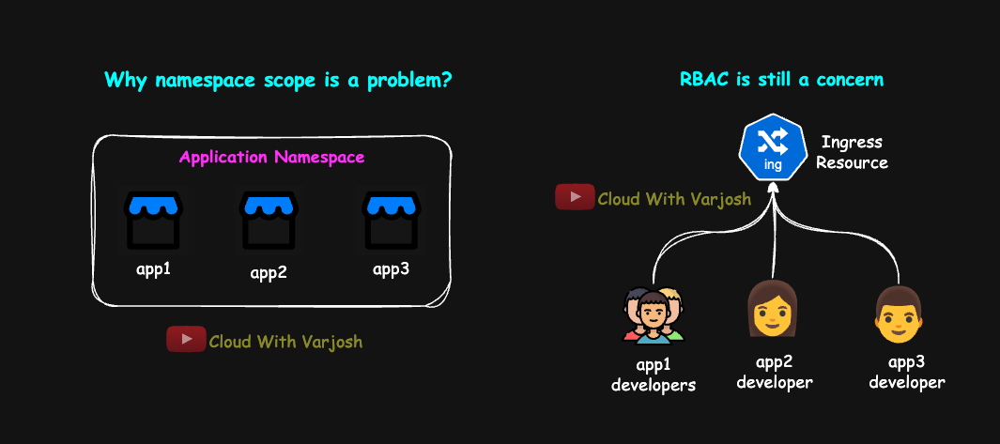
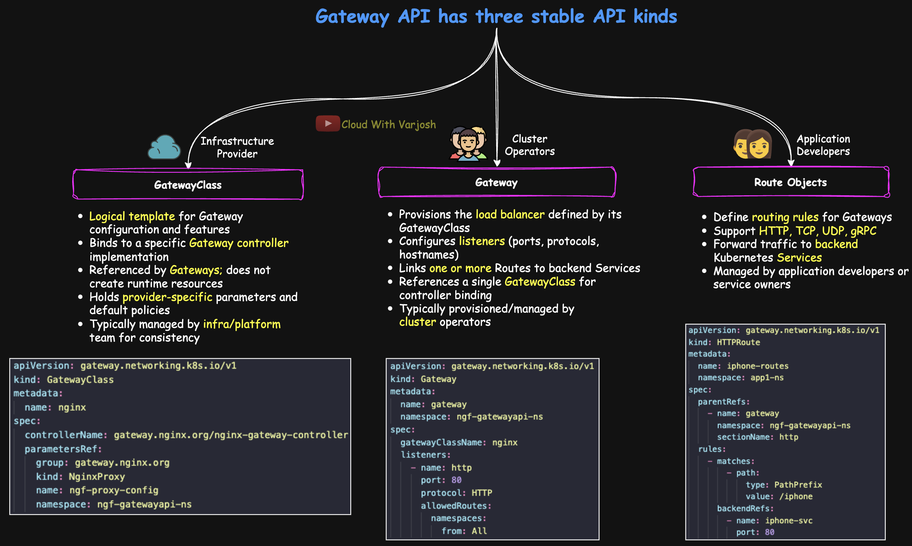
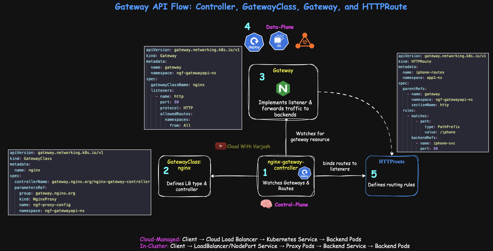

# Day 52: Kubernetes Gateway API Deep Dive | Part 1 | GatewayClass, Gateway & Routes | CKA Course 2025

## Video reference for Day 52 is the following:

[](https://www.youtube.com/watch?v=mkohNT5PCe8&ab_channel=CloudWithVarJosh)


---
## ⭐ Support the Project  
If this **repository** helps you, give it a ⭐ to show your support and help others discover it! 

---

## Table of Contents

- [Introduction](#introduction)
- [Pre-Requisites for Gateway API Lectures](#pre-requisites-for-gateway-api-lectures)
  - [Ingress Series](#ingress-series)
  - [Custom Resources](#custom-resources)
- [What We Already Know About Ingress](#what-we-already-know-about-ingress)
  - [Ingress is Native but Minimal](#1-ingress-is-native-but-minimal)
  - [Advanced Features Come from the Controller](#2-advanced-features-come-from-the-controller)
  - [Controller-Specific Annotations Are Common Practice](#3-controller-specific-annotations-are-common-practice)
- [What’s Missing in Ingress](#whats-missing-in-ingress)
  - [Cross-Namespace, Multi-Tenancy & RBAC](#1-cross-namespace-multi-tenancy--rbac)
  - [Protocol & Feature Scope](#2-protocol--feature-scope)
  - [Controller-Specific Annotations and Lack of Validation](#3-controller-specific-annotations-and-lack-of-validation)
- [What is Gateway API](#what-is-gateway-api)
- [Gateway API Resource Model and Role Alignment](#gateway-api-resource-model-and-role-alignment)
  - [GatewayClass](#1-gatewayclass)
  - [Gateway](#2-gateway)
  - [Route Objects](#3-route-objects)
- [Protocol Flexibility and Advanced Traffic Management](#protocol-flexibility-and-advanced-traffic-management)
- [Gateway API Flow: Controller, GatewayClass, Gateway, and HTTPRoute](#gateway-api-flow-controller-gatewayclass-gateway-and-httproute)
- [Gateway API Setup: Cloud-Managed vs In-Cluster Data Planes](#gateway-api-setup-cloud-managed-vs-in-cluster-data-planes)
- [Conclusion](#conclusion)
- [References](#references)


## **Introduction**

The Kubernetes Gateway API is a modern, community-driven evolution of the Ingress API, designed to address the limitations of traditional ingress-based routing. Developed by the Kubernetes SIG-Network group, it introduces a resource model that cleanly separates infrastructure management from application routing, supports multiple protocols, and embeds advanced traffic management features directly into the specification.
**In this part, we focus on the theory** — exploring the shortcomings of the Ingress API in real-world scenarios, the architectural principles of the Gateway API, and how its resource model maps to common organizational roles. **In Part 2, we will follow up with a hands-on demo**, showing its practical implementation and usage. This two-part approach ensures a solid understanding before jumping into applied configurations.

---

## Pre-Requisites for Gateway API Lectures

Before starting the Gateway API lectures (Day 52 & Day 53), it is highly recommended to watch the following sessions to build the necessary foundation.

### **Ingress Series**

1. **Day 49:** MASTER Kubernetes Ingress | PART 1 | What, Why & Real-World Flow of Ingress  
   GitHub: [Day 49 Notes](https://github.com/CloudWithVarJosh/CKA-Certification-Course-2025/tree/main/Day%2049)  
   YouTube: [Watch Video](https://www.youtube.com/watch?v=yj-ZlKTYDUI&ab_channel=CloudWithVarJosh)  

2. **Day 50:** MASTER Kubernetes Ingress | PART 2 | Path-Based Routing on Amazon EKS with AWS ALB   
   GitHub: [Day 50 Notes](https://github.com/CloudWithVarJosh/CKA-Certification-Course-2025/tree/main/Day%2050)  
   YouTube: [Watch Video](https://www.youtube.com/watch?v=4d0dkj6Vc70&ab_channel=CloudWithVarJosh)  

3. **Day 51:** MASTER Kubernetes Ingress | PART 3 | TLS & Subdomain Routing on EKS with AWS ALB  
   GitHub: [Day 51 Notes](https://github.com/CloudWithVarJosh/CKA-Certification-Course-2025/tree/main/Day%2051)  
   YouTube: [Watch Video](https://www.youtube.com/watch?v=ABqaWXSIFXc&ab_channel=CloudWithVarJosh)  

> **Short on time?** At the very least, watch **Day 49 – Part 1** for the theory.

---

### **Custom Resources & Operators**

* **Day 39:** Custom Resources (CR) and Custom Resource Definitions (CRD) Explained with Demo  
  GitHub: [Day 39 Notes](https://github.com/CloudWithVarJosh/CKA-Certification-Course-2025/tree/main/Day%2039)  
  YouTube: [Watch Video](https://www.youtube.com/watch?v=y4e7nQzu_8E)  

* **Day 40:** Kubernetes Operators Deep Dive with Hands-On Demo  
  GitHub: [Day 40 Notes](https://github.com/CloudWithVarJosh/CKA-Certification-Course-2025/tree/main/Day%2040)  
  YouTube: [Watch Video](https://www.youtube.com/watch?v=hxgmG1qYU2M&ab_channel=CloudWithVarJosh)  

---


## What We Already Know About Ingress


### 1. Ingress is Native but Minimal

Ingress is a **built-in Kubernetes resource** designed to handle **HTTP(S) host-based and path-based routing**. Out of the box, that is all it does. The specification does not natively include advanced routing logic, traffic splitting, or multi-protocol support. Its purpose is to provide a **generic interface** that different ingress controllers can implement.

Annotations are often used to extend the Ingress behavior with controller-specific features, but **Kubernetes itself does not validate these annotations**. They are treated as metadata for informational purposes or for consumption by external tools. It is the responsibility of the **Ingress controller** (for example, AWS Load Balancer Controller) to read these annotations and take action based on them. In our demos, AWS LBC interpreted the annotations we defined to configure ALB-specific features such as SSL redirects, and target group health checks.

---


### 2. Advanced Features Come from the Controller

Everything beyond simple host and path routing — such as **SSL redirects**, **custom health checks**, **rate limiting**, **canary or weighted traffic splitting**, and even **TCP/UDP routing** — comes from the **ingress controller**, not the Ingress API itself. These capabilities are exposed by the controller through **annotations** or CRD extensions, which vary by vendor.

---

### 3. Controller-Specific Annotations Are Common Practice

In our Ingress demos, we used the **AWS Load Balancer Controller (an Ingress Controller)**, which provides a large set of annotations to control ALB behavior. For example:

* SSL policy selection
* Target group health check settings
* Redirect and rewrite rules
* Weighted target group forwarding for canary deployments

We leveraged some of these annotations in our demos. The full AWS LBC annotation list is available here:
[https://kubernetes-sigs.github.io/aws-load-balancer-controller/v2.2/guide/ingress/annotations/#ingress-annotations](https://kubernetes-sigs.github.io/aws-load-balancer-controller/v2.2/guide/ingress/annotations/#ingress-annotations)

---

## What’s Missing in Ingress


### 1. Cross-Namespace, Multi-Tenancy & RBAC



**a) Namespace Scope Limitation**
Ingress is a **namespace-scoped** resource, meaning it can only reference Services **within the same namespace**.
If you have multiple applications (`app1`, `app2`, … `app10`) that you want to expose through the same Ingress, all of them would need to live in the **same namespace**. This conflicts with the common best practice of **namespace-level segregation**, where each application or team operates in its own namespace for isolation, lifecycle independence, and access control.


**b) RBAC and Resource-Level Isolation**
When multiple applications share the same Ingress resource, **all teams must have write access to that shared resource** to manage their own routes. This creates a situation where any team could unintentionally change or break another team’s configuration.
Ingress has **no built-in API-level mechanism** to delegate control over specific hosts or paths within a single Ingress. The only way to achieve isolation is to use separate Ingress resources per team or namespace — but this is implementation-dependent and not enforced by Kubernetes itself.

---

**Note:** Some Ingress controllers, such as the **AWS Load Balancer Controller** with its **IngressGroup** feature, address *both* of these problems by allowing:

* Multiple Ingress resources from **different namespaces** to share a single ALB.
* Teams to manage their own Ingress manifests while still pointing to the same load balancer.

However, this functionality is **controller-specific** and **not part of the native Kubernetes Ingress specification**, meaning it is not portable to controllers that do not support it.

---


### 2. Protocol & Feature Scope

Ingress natively supports only **HTTP(S) host-based and path-based routing**. It does not provide native capabilities for other protocols such as **TCP**, **UDP**, or **gRPC**. In addition, it lacks first-class support for advanced routing and traffic management features such as:

* SSL redirect
* Custom health checks
* Rate limiting
* Weighted/canary traffic splitting
* Header-, query-, or method-based routing

While these capabilities can be achieved with certain Ingress controllers through annotations, this again creates **controller lock-in** and reduces portability. If you move to another controller, you must verify whether it supports the same features — and if it does, you’ll likely need to change the annotation format to match.

> **What is gRPC?**
**gRPC** is a high-performance, open-source protocol for remote procedure calls (RPC).
It enables services to communicate directly, even across different languages and platforms.
It uses HTTP/2 under the hood for faster, more efficient data exchange.

---

### 3. Controller-Specific Annotations and Lack of Validation

Almost every advanced Ingress feature outside the spec is implemented using **annotations**, and these annotations are **controller-specific**. An annotation that configures a weighted forward action for AWS Load Balancer Controller will not work on NGINX or Traefik, because each vendor has its own annotation set.

Kubernetes does not validate these annotations. The API server only checks for YAML syntax correctness, not whether the annotation is valid or meaningful for the controller. This means a typo or unsupported value in an annotation might silently be ignored by the controller, creating a **hidden misconfiguration** risk.

As a result, annotations create a **tight coupling** between your manifests and the specific controller in use. Changing controllers later often requires significant manifest rewrites.

---

## What is Gateway API

Gateway API is a **Kubernetes-standard API** (developed by the Kubernetes SIG-Network community) for managing service networking in a way that is more expressive, extensible, and role-oriented than the older Ingress API.
It is not a built-in resource in Kubernetes by default — instead, it is provided through **Custom Resource Definitions (CRDs)**, which you must install along with a compatible controller to use it.

Gateway API introduces a **new resource model** that:

* Separates **infrastructure** (Gateways) from **application routing** (Routes)
* Enables **multi-tenancy** with API-level isolation
* Supports **multiple protocols** (HTTP, HTTPS, gRPC, TCP, UDP)
* Moves advanced traffic management features into the **core API** (removing the heavy reliance on controller-specific annotations)

---

> **Note on SIG:**
A **Special Interest Group (SIG)** is a working group within the Kubernetes open-source project that focuses on a specific area of the system.
**SIG-Network** is responsible for Kubernetes networking APIs (like Services, Ingress, and Gateway API), ensuring that these APIs evolve in a standardized, portable, and vendor-neutral way across the ecosystem.

> **Note:** Gateway API resources are not available in a fresh Kubernetes cluster by default. You must install the Gateway API CRDs and a compatible controller before you can use them.

---

## Gateway API Resource Model and Role Alignment



Gateway API introduces a resource model that separates **infrastructure** from **application routing**, making it easier to manage multi-tenant environments and delegate responsibilities across teams. These resources are intentionally modeled after the roles that typically exist in organizations running Kubernetes.

### Core Resource Types

Gateway API has three stable API kinds:

#### 1. **GatewayClass**

*Blueprint for Gateway implementation and capabilities*

* **Purpose:** Defines a class of Gateways with common configuration and behavior, managed by a specific controller.
* **Analogy:** Similar to a **StorageClass** in Kubernetes — it specifies *what type* of load balancer or data plane you want (e.g., external LB, internal LB, specific vendor).
* **Behavior:** Associated with a specific controller; creates nothing by itself.
* **Parameters:** Can define vendor-specific settings and default behavior for all Gateways referencing it.
* **Ownership:** Usually created and maintained by the **Infrastructure Provider** or platform engineering team.

#### 2. **Gateway**

*Provisions actual traffic-handling infrastructure*

* **Purpose:** Represents an instance of traffic-handling infrastructure, such as a cloud load balancer, with associated listeners (ports, protocols, hostnames).
* **Lifecycle:** **Creating a Gateway typically provisions the actual load balancer**.
* **Configuration:** Configures listeners and references a specific `GatewayClass`.
* **Function:** Connects attached Routes to backend services.
* **Ownership:** Managed by the **Cluster Operator** or platform team.
* **Requirement:** Needs a controller to implement its behavior.

#### 3. **Route Objects**

*Define how traffic is routed to backends*

* **Purpose:** Define routing rules that attach to a Gateway listener and forward traffic to backend endpoints (commonly Kubernetes Services).
* **Protocol Types:** Support **HTTPRoute**, **TCPRoute**, **UDPRoute**, and **GRPCRoute** for multi-protocol flexibility.
* **Routing Logic:** Can match requests based on protocol-specific criteria (e.g., paths, headers, methods).
* **Scope:** Forward traffic to backend services across namespaces (when allowed via `ReferenceGrant`).
* **Ownership:** Managed by **Application Developers** or service owners.

---

## Protocol Flexibility and Advanced Traffic Management

Gateway API goes beyond the HTTP/S-only limitation of Ingress by supporting **multiple protocols** and **spec-defined advanced traffic features**, all within a single, consistent API. This allows both web and non-web traffic to be managed through the same resource model.

* **Multi-Protocol Support** – Gateway API supports:

  * **HTTP and HTTPS** (`HTTPRoute`)
  * **gRPC** (`GRPCRoute`)
  * **TCP** (`TCPRoute`)
  * **UDP** (`UDPRoute`)
    This enables a unified approach to routing for diverse application protocols in one cluster.

* **First-Class Traffic Management Features** – Capabilities that previously required controller-specific annotations are now part of the API specification, making them **portable** across conformant implementations and **validated** by the Kubernetes API server:

  * Weighted/canary traffic splitting (weighted routing)
  * Path and header rewrites
  * Timeouts and retries
  * Request/response filters
  * Header-, query-, and method-based routing

* **Safe Cross-Namespace Routing** – With `ReferenceGrant` and `allowedRoutes`, Gateway API provides explicit, controlled permissions for cross-namespace routing. Teams can securely reference backends in other namespaces without relying on non-standard workarounds.

* **Reduced Annotation Dependency** – Because these features are now part of the spec, reliance on vendor-specific annotations is significantly reduced. While controllers may still offer additional extensions, the portable core remains consistent across vendors.

---

## Gateway API Flow: Controller, GatewayClass, Gateway, and HTTPRoute

This diagram illustrates how the **Gateway API** components interact in a Kubernetes environment using the **NGINX Gateway Fabric** as an example. It follows the sequence from the controller detecting configuration changes to routing traffic to the correct backend.



---

### 1. **Controller Watches Gateways and Routes**

The **nginx-gateway-fabric controller** is a pod (part of a deployment) running in the cluster that continuously watches for changes to `Gateway` and `HTTPRoute` resources.
When a new `Gateway` or `HTTPRoute` object is created or modified, the controller reacts and reconciles the configuration to ensure the routing and load balancing behavior matches the desired state.

---

### 2. **GatewayClass Defines LB Type and Controller**

A `GatewayClass` is a cluster-scoped resource that defines:

* **Load Balancer (LB) implementation type** — e.g., NGINX, HAProxy, or a cloud provider LB.
* **Associated controller** — the controller responsible for managing any `Gateway` objects referencing this `GatewayClass`.

This is purely a logical configuration and doesn’t run code itself.
In our example, the `GatewayClass` named `nginx` points to the NGINX Gateway Fabric controller.

---

### 3. **Gateway Implements Listener and Traffic Forwarding**

When the controller detects a `Gateway` resource that uses its `GatewayClass`, it:

* Configures listeners (e.g., HTTP on port 80, HTTPS on port 443).
* Prepares to forward traffic to backend services.

At this stage, depending on the controller implementation, the **data plane** is provisioned:
– **Cloud-managed**: a provider-managed LB is created.
– **In-cluster**: proxy pods (e.g., NGINX, Envoy) are deployed or configured.

---

### 4. **Data Plane**

This is where the **actual traffic forwarding** happens. Proxy pods (in-cluster) or external cloud load balancers (managed by providers) receive requests and forward them to Kubernetes Services and Pods.

#### Control Plane vs Data Plane

* **Control Plane** → Decides & reconciles the desired state. The controller (`nginx-gateway-controller`) watches resources like `GatewayClass`, `Gateway`, and `HTTPRoute` and configures the data plane.
  *Example:* The NGINX Gateway controller deployment updates proxy pods when you apply a new route.

* **Data Plane** → Forwards & processes traffic as per the rules programmed by the control plane.
  *Example:* AWS ALB in cloud setups or NGINX/Envoy proxy pods in on-prem clusters.

---

### 5. **HTTPRoute Defines Routing Rules**

An `HTTPRoute` specifies the routing rules for incoming traffic.
It references the `Gateway` (via `parentRefs`) and defines:

* **Match conditions** (e.g., `PathPrefix: /iphone`).
* **Backend references** (Kubernetes Services and ports).

When created, the controller binds these routes to the corresponding `Gateway` listeners so that traffic flows to the correct backend.

---

> The exact mechanics **depend on the controller implementation** — some lightweight/demo setups may skip a dedicated proxy tier, while production-grade controllers always program a defined data plane.

---

### **One-Line Flows for Quick Recall**

```
Cloud-Managed: Client → Cloud Load Balancer → Kubernetes Service → Backend Pods
In-Cluster: Client → LoadBalancer/NodePort Service → Proxy Pods → Backend Service → Backend Pods
```

---

## **Gateway API Setup: Cloud-Managed vs In-Cluster Data Planes**

**Cloud-Managed (AWS / GCP / Azure Gateway Controllers)**
The controller runs **inside the cluster** but **only programs** an **external, cloud-managed data plane** based on your `Gateway` and `Route` manifests.
It configures listeners, routing rules, TLS settings, and backend service mappings on the cloud load balancer. The cloud load balancer itself handles all client traffic and sends it directly to your Kubernetes Services — the controller is never in the traffic path.

* **AWS** – AWS Gateway API Controller provisions **VPC Lattice services** (or ALB/NLB in other controller variants) as the data plane.
* **GCP** – GKE Gateway Controller provisions **Google Cloud Load Balancers** (external or internal).
* **Azure** – Azure Gateway Controller (for Containers) provisions **Azure Application Gateway** as the data plane.

---

**In-Cluster (NGINX Gateway Fabric, Istio, Envoy Gateway, HAProxy)**
The controller reconciles `GatewayClass`, `Gateway`, and `Route` objects and writes configuration for an **in-cluster proxy** (e.g., NGINX, Envoy) running as pods or DaemonSets.
These proxy pods form the data plane and handle the actual L4/L7 load balancing, TLS termination, and routing. They’re exposed via a Kubernetes `Service` — typically `LoadBalancer` in cloud environments or `NodePort` for on-prem/KIND clusters.
⚠ In some lightweight/demo implementations (like certain KIND setups), the controller may bundle a minimal proxy or bypass a dedicated proxy tier, relying on kube-proxy/L4 forwarding. This is fine for demos, but not production-grade.

---

### **Key Differences**

| Scenario          | Controller Location | Data Plane Location     | Example on AWS / GCP / Azure                  | Other In-Cluster / Cloud-Managed Examples                                                  |
| ----------------- | ------------------- | ----------------------- | --------------------------------------------- | ------------------------------------------------------------------------------------------ |
| **Cloud-Managed** | In-cluster          | External cloud LB       | AWS VPC Lattice / ALB, GCP GCLB, Azure App GW | AWS Load Balancer Controller (ALB/NLB), GCP Multi-Cluster Gateway, Azure Front Door        |
| **In-Cluster**    | In-cluster          | In-cluster proxy (pods) | —                                             | NGINX Gateway Fabric, Envoy Gateway, Istio Ingress Gateway, HAProxy Ingress, Traefik Proxy |


---

**Mental Model**

* **Controller** = Control plane (watches Gateway API resources, writes config, signals reloads).
* **Data plane** = Where packets actually flow (cloud LB or in-cluster proxy pods).
* In **cloud-managed setups**, the cloud provider’s LB is the data plane.
* In **in-cluster setups**, the proxy pods are the data plane — the controller never sits on the hot path for traffic.
* **Implementation detail matters**: some demos collapse control and data plane for simplicity.

---


## **Conclusion**

The Gateway API represents a significant step forward in Kubernetes service networking, offering a standardized, role-oriented, and multi-protocol approach to traffic management. By moving advanced capabilities into the specification and reducing dependency on controller-specific annotations, it delivers greater portability and operational consistency across environments.
With its ability to delegate responsibilities, support secure cross-namespace routing, and handle diverse traffic protocols, the Gateway API equips platform teams and developers with the flexibility and control needed for modern, multi-tenant architectures.
Armed with the concepts and setup guidance in this document, you are well-prepared to implement Gateway API in your Kubernetes clusters—whether using cloud-managed load balancers or in-cluster data planes—and apply these patterns confidently across vendors and environments.
**In Part 2, we will put these concepts into action through a live demo**, walking step-by-step through the setup and configuration process to see the Gateway API in action.

---

## **References**

**Official Documentation**

* Gateway API: [https://gateway-api.sigs.k8s.io](https://gateway-api.sigs.k8s.io)
* Ingress API: [https://kubernetes.io/docs/concepts/services-networking/ingress](https://kubernetes.io/docs/concepts/services-networking/ingress)

**Implementations & Controller Docs**

* NGINX Gateway Fabric Overview: [https://docs.nginx.com/nginx-gateway-fabric](https://docs.nginx.com/nginx-gateway-fabric)
* AWS Load Balancer Controller – Ingress Annotations: [https://kubernetes-sigs.github.io/aws-load-balancer-controller/v2.2/guide/ingress/annotations](https://kubernetes-sigs.github.io/aws-load-balancer-controller/v2.2/guide/ingress/annotations)

**Additional Resources**

* Kubernetes SIG-Network: [https://github.com/kubernetes/community/tree/master/sig-network](https://github.com/kubernetes/community/tree/master/sig-network)
* CNCF Gateway API Project: [https://www.cncf.io/projects/gateway-api](https://www.cncf.io/projects/gateway-api)

---