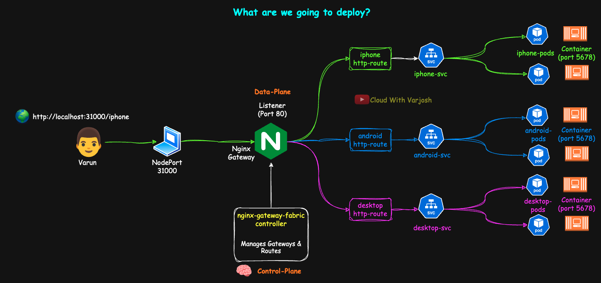

# Day 53: Kubernetes Gateway API Demo | Part 2 | NGINX Gateway Fabric | CKA Course 2025

## Video reference for Day 53 is the following:

[](https://www.youtube.com/watch?v=ojjeXUKRRjM&ab_channel=CloudWithVarJosh)
---
## ⭐ Support the Project  
If this **repository** helps you, give it a ⭐ to show your support and help others discover it! 

---

# Table of Contents

* [Introduction](#introduction)  
* [Pre-requisite](#pre-requisite) 
* [Demo: Gateway API with NGINX Gateway Fabric](#demo-gateway-api-with-nginx-gateway-fabric)  
  * [Demo Introduction](#demo-introduction)  
  * [What We’re Going to Do in This Demo](#what-were-going-to-do-in-this-demo)  
  * [Pre-requisites](#pre-requisites)  
  * [Step 1: Configure KIND Cluster](#step-1-configure-kind-cluster)  
    * [1.1 Delete any existing cluster](#11-delete-any-existing-cluster)  
    * [1.2 KIND cluster config (00-kind-clusteryaml)](#12-kind-cluster-config-00-kind-clusteryaml)  
    * [1.3 Create the cluster](#13-create-the-cluster). 
  * [Step 2: Install Gateway API CRDs](#step-2-install-gateway-api-crds). 
  * [Step 3: Install the NGINX Gateway Fabric Controller](#step-3-install-the-nginx-gateway-fabric-controller). 
  * [Step 4: Deploy Application Manifests](#step-4-deploy-application-manifests)  
    * [4.1 iPhone App (02-iphoneyaml)](#41-iphone-app-02-iphoneyaml)  
    * [4.2 Android App (03-androidyaml)](#42-android-app-03-androidyaml)  
    * [4.3 Desktop App (04-desktopyaml)](#43-desktop-app-04-desktopyaml)  
  * [Step 5: Create the Gateway](#step-5-create-the-gateway)  
  * [Step 6 – Create HTTPRoutes](#step-6--create-httproutes)  
  * [Step 7 – Check Connectivity](#step-7--check-connectivity)  
* [Conclusion](#conclusion)  
* [References](#references)  

---


## **Introduction**

In this session, we’ll put theory into action by deploying the **NGINX Gateway Fabric (NGF)** with the Kubernetes **Gateway API** inside a local **KIND** cluster. Unlike traditional Ingress, the Gateway API offers a modern, role-oriented model for routing traffic in Kubernetes, and NGF is one of the early, production-ready implementations of it.

We’ll walk through installing NGF using Helm, exposing it via **NodePort** for direct access from our host machine, and then configuring **Gateways, Listeners, and HTTPRoutes** to route traffic across multiple backend applications. By the end of this demo, you’ll see how NGF acts as the data plane for Gateway API resources and how cleanly it handles multiple routes without relying on custom annotations or ingress-specific hacks.

This demo is designed to be easy to replicate on your own system, giving you a strong foundation for experimenting with Gateway API in both local and cloud environments.

---

## **Pre-Requisite**
Before watching this lecture, I highly recommend checking out **Day 52**, where we cover the theory and architecture behind the Gateway API:

* YouTube Lecture: [Day 52 – Kubernetes Gateway API Deep Dive (Part 1)](https://www.youtube.com/watch?v=mkohNT5PCe8&t=2132s&ab_channel=CloudWithVarJosh)
* GitHub Repository: [Day 52 – Kubernetes Gateway API Theory](https://github.com/CloudWithVarJosh/CKA-Certification-Course-2025/tree/main/Day%2052)

This ensures you’ll have the right background before diving into the demo.

---

# **Demo: Gateway API with NGINX Gateway Fabric**


## **Demo Introduction**

In this demo, we’ll deploy **NGINX Gateway Fabric (NGF)** with the Kubernetes **Gateway API** to route HTTP traffic to multiple backend applications running in a local **KIND** (Kubernetes in Docker) cluster.

We’ll configure a **NodePort** so requests from our host machine can reach the gateway directly — without needing a cloud LoadBalancer.
The NGINX installation is based on the official documentation:
[NGINX Gateway Fabric - Helm Install Guide](https://docs.nginx.com/nginx-gateway-fabric/install/helm/)
I’ve streamlined the steps to make the setup easier to understand and replicate.

---

## **What We’re Going to Do in This Demo**



1. Deploy NGF in a KIND cluster using Helm.
2. Expose the NGF Gateway via NodePort for local access.
3. Create a Gateway, Listeners, and HTTPRoutes for different applications.
4. Route traffic to multiple backends (`/iphone`, `/android`, `/`) using Gateway API.

---

## **Flow**

```
User Browser (http://localhost:31000/iphone) → NodePort (31000) → Gateway Listener (80) → HTTPRoute (iphone-routes) → Backend Service (iphone-svc) → Target Pods → HTML Response
```

---


## **Pre-requisites**

Before we start, ensure you have the following installed:

* **KIND** – [Install guide](https://kind.sigs.k8s.io/docs/user/quick-start/#installation)
* **Helm** – [Install guide](https://helm.sh/docs/intro/install/)
* **kubectl** (includes Kustomize support, which we’ll use to install CRDs)

---

## **Step 1: Configure KIND Cluster**

### 1.1 Delete any existing cluster

```bash
kind get clusters
kind delete cluster --name=<cluster-name>
```

### 1.2 KIND cluster config (`00-kind-cluster.yaml`)

```yaml
kind: Cluster
apiVersion: kind.x-k8s.io/v1alpha4
nodes:
  - role: control-plane
    image: kindest/node:v1.33.1@sha256:050072256b9a903bd914c0b2866828150cb229cea0efe5892e2b644d5dd3b34f
    extraPortMappings:
      - containerPort: 31000  # Port inside the KIND container
        hostPort: 31000       # Port on your local machine
```

> **Why this matters:**
> This mapping allows your local machine (`localhost:31000`) to directly hit the Kubernetes NodePort service running inside the KIND control-plane container.

### 1.3 Create the cluster

```bash
kind create cluster --name=gateway-api --config=00-kind-cluster.yaml
```

---

## **Step 2: Install Gateway API CRDs**

The Gateway API introduces several new resource types that NGF uses. Install them with:

```bash
kubectl kustomize "https://github.com/nginx/nginx-gateway-fabric/config/crd/gateway-api/standard?ref=v2.1.0" | kubectl apply -f -
```

**What gets installed (1-liners):**

* **GatewayClass** – Defines a class of gateways (cluster-wide template for data planes)
* **Gateway** – An instance of a GatewayClass (control plane + network listener config)
* **HTTPRoute** – Rules mapping incoming HTTP requests to backend services
* **GRPCRoute** – Same as HTTPRoute but for gRPC traffic
* **ReferenceGrant** – Allows cross-namespace resource referencing

Verify:

```bash
kubectl api-resources | grep gateway
```

> NGF currently supports `HTTPRoute` and `GRPCRoute` from the Gateway API’s standard channel.
`TLSRoute`, `TCPRoute`, and `UDPRoute` are not supported yet, but may be introduced in future releases as the Gateway API evolves and NGF adds more protocol capabilities.


---

## **Step 3: Install the NGINX Gateway Fabric Controller**

We’ll run NGF in its own namespace and expose it via NodePort **31000**.

```bash
helm install ngf oci://ghcr.io/nginx/charts/nginx-gateway-fabric \
  --create-namespace -n ngf-gatewayapi-ns \
  --set nginx.service.type=NodePort \
  --set-json 'nginx.service.nodePorts=[{"port":31000,"listenerPort":80}]'
```

> **Note:**
> This `helm install` command deploys the **NGINX Gateway Fabric** controller into the `ngf-gatewayapi-ns` namespace and configures it to run as a **Gateway API controller**.
>
> * The `--create-namespace` flag ensures the namespace is created if it doesn’t already exist.
> * `nginx.service.type=NodePort` exposes the NGINX service externally via a fixed node port.
> * The `--set-json 'nginx.service.nodePorts=[{"port":31000,"listenerPort":80}]'` option maps:
>
>   * **ListenerPort 80** (from the Gateway’s HTTP listener)
>   * to **NodePort 31000** on the cluster nodes, allowing you to reach the Gateway from outside the cluster by hitting `<NodeIP>:31000`.


Verify:

```bash
kubectl get deploy -n ngf-gatewayapi-ns
```

You should see:

```
deployment.apps/ngf-nginx-gateway-fabric
```

**GatewayClass auto-created:**

```bash
kubectl get gatewayclasses.gateway.networking.k8s.io -o wide
```

```
NAME    CONTROLLER                                   ACCEPTED   AGE   DESCRIPTION
nginx   gateway.nginx.org/nginx-gateway-controller   True       12m
```

> **Note:** GatewayClasses are cluster-scoped. Any namespace can reference them.

---

## **Step 4: Deploy Application Manifests**

We’ll deploy three simple Python-based HTTP servers to represent different device-specific frontends (iPhone, Android, and Desktop).
Each app will live in the **`app1-ns`** namespace and expose a single web page.

---

### **4.1 iPhone App (`02-iphone.yaml`)**

```yaml
apiVersion: apps/v1
kind: Deployment
metadata:
  name: iphone-deploy
  namespace: app1-ns
spec:
  replicas: 2
  selector:
    matchLabels:
      app: iphone-page
  template:
    metadata:
      labels:
        app: iphone-page
    spec:
      containers:
      - name: python-http
        image: python:alpine
        command: ["/bin/sh", "-c"]
        args:
          - |
            mkdir -p /iphone && echo '<html>
              <head><title>iPhone Users</title></head>
              <body>
                <h1>iPhone Users</h1>
                <p>Welcome to Cloud With VarJosh</p>
              </body>
            </html>' > /iphone/index.html && cd / && python3 -m http.server 5678
        ports:
        - containerPort: 5678
---
apiVersion: v1
kind: Service
metadata:
  name: iphone-svc
  namespace: app1-ns
spec:
  selector:
    app: iphone-page
  ports:
  - protocol: TCP
    port: 80
    targetPort: 5678
```

> **Notes:**
> * The Python container serves an HTML page from `/iphone/index.html` on port `5678`.

---

### **4.2 Android App (`03-android.yaml`)**

```yaml
apiVersion: apps/v1
kind: Deployment
metadata:
  name: android-deploy
  namespace: app1-ns
spec:
  replicas: 2
  selector:
    matchLabels:
      app: android-page
  template:
    metadata:
      labels:
        app: android-page
    spec:
      containers:
      - name: python-http
        image: python:alpine
        command: ["/bin/sh", "-c"]
        args:
          - |
            mkdir -p /android && echo '<html>
              <head><title>Android Users</title></head>
              <body>
                <h1>Android Users</h1>
                <p>Welcome to Cloud With VarJosh</p>
              </body>
            </html>' > /android/index.html && cd / && python3 -m http.server 5678
        ports:
        - containerPort: 5678
---
apiVersion: v1
kind: Service
metadata:
  name: android-svc
  namespace: app1-ns
spec:
  selector:
    app: android-page
  ports:
  - protocol: TCP
    port: 80
    targetPort: 5678
```

---

### **4.3 Desktop App (`04-desktop.yaml`)**

```yaml
apiVersion: apps/v1
kind: Deployment
metadata:
  name: desktop-deploy
  namespace: app1-ns
spec:
  replicas: 2
  selector:
    matchLabels:
      app: desktop-page
  template:
    metadata:
      labels:
        app: desktop-page
    spec:
      containers:
      - name: python-http
        image: python:alpine
        command: ["/bin/sh", "-c"]
        args:
          - |
            echo '<html>
              <head><title>Desktop Users</title></head>
              <body>
                <h1>Desktop Users</h1>
                <p>Welcome to Cloud With VarJosh</p>
              </body>
            </html>' > /index.html && python3 -m http.server 5678
        ports:
        - containerPort: 5678
---
apiVersion: v1
kind: Service
metadata:
  name: desktop-svc
  namespace: app1-ns
spec:
  selector:
    app: desktop-page
  ports:
  - protocol: TCP
    port: 80
    targetPort: 5678
```

---

**Apply all manifests:**

```bash
kubectl apply -f 02-iphone.yaml
kubectl apply -f 03-android.yaml
kubectl apply -f 04-desktop.yaml
```

**Verify:**

```bash
kubectl get all -n app1-ns
```

---

## **Step 5: Create the Gateway**

`05-gateway.yaml`

```yaml
apiVersion: gateway.networking.k8s.io/v1  # API group and version for Gateway API
kind: Gateway                             # Resource type: Gateway
metadata:
  name: gateway                           # Name of the Gateway resource
  namespace: ngf-gatewayapi-ns            # Namespace where this Gateway resides
spec:
  gatewayClassName: nginx                 # References the GatewayClass to determine LB type/implementation
  listeners:                              # Listeners define how the Gateway accepts traffic
    - name: http                          # Listener name (unique within this Gateway)
      port: 80                            # Port on which the listener will accept traffic
      protocol: HTTP                      # Protocol for this listener (HTTP, HTTPS, TCP, etc.)
      allowedRoutes:                      # Rules for which Routes can bind to this listener
        namespaces:
          from: All                       # Allows Routes from any namespace to attach
```

### Apply

```bash
kubectl apply -f 05-gateway.yaml
```

### Verify (controller picked it up, data plane exposed)

1. **Gateway object exists & is Ready**

```bash
kubectl get gateway -n ngf-gatewayapi-ns
kubectl describe gateway gateway -n ngf-gatewayapi-ns
```

You should see:

* **Listeners:** `http` on port **80**
* **Addresses:** (may be empty on KIND until the Service is ready)
* **Conditions:** `Programmed=True`, `Ready=True` (names may vary by controller; any “all green” is fine)

2. **GatewayClass is Accepted (controller is responsible)**

```bash
kubectl get gatewayclasses.gateway.networking.k8s.io -o wide
```

Look for the class you referenced (here **nginx**) with **ACCEPTED True** and the controller name
`gateway.nginx.org/nginx-gateway-controller`.

3. **NGF Service created and listening on NodePort 31000**

> This is driven by your Helm install flags from Step 3.

```bash
kubectl get svc -n ngf-gatewayapi-ns
```

Expect a Service for the gateway (name varies by chart, e.g. `gateway-nginx` or similar) showing:

```
TYPE      CLUSTER-IP      EXTERNAL-IP   PORT(S)
NodePort  10.x.x.x        <none>        80:31000/TCP
```

4. **Controller and (if applicable) data-plane pods are healthy**

```bash
kubectl get pods -n ngf-gatewayapi-ns -o wide
```

You should see the **controller** Deployment running. Depending on implementation/version, NGF may also create data-plane pods when the Gateway is reconciled.

5. **Events (optional)**

```bash
kubectl get events -n ngf-gatewayapi-ns --sort-by=.lastTimestamp | tail -n 20
```

Helpful if something didn’t wire up.

---

### What happens next

* NGF **sees** the `Gateway` resource and **programs the data plane** for the HTTP listener on **port 80**.
* Because you installed NGF with **NodePort 31000**, the Service in `ngf-gatewayapi-ns` exposes the listener externally on **`<NodeIP>:31000`** (KIND mapping sends this to `localhost:31000` on your machine).
* **Note:** At this point, without any `HTTPRoute` objects, requests will typically return a default response (e.g., 404). Routing will work after you create the routes in the next step.

**Example Service output**

```
ngf-gatewayapi-ns   service/gateway-nginx   NodePort   10.96.188.186   <none>   80:31000/TCP   42s
```

---

## **Step 6 – Create HTTPRoutes**

`06-routes.yaml`

```yaml
# iPhone route: matches /iphone prefix and sends traffic to iphone-svc
apiVersion: gateway.networking.k8s.io/v1
kind: HTTPRoute
metadata:
  name: iphone-routes
  namespace: app1-ns
spec:
  parentRefs:                 # Which Gateway and listener to attach to
    - name: gateway           # Gateway name
      namespace: ngf-gatewayapi-ns
      sectionName: http       # Listener name from Gateway spec
  rules:                      # Routing rules
    - matches:
        - path:
            type: PathPrefix  # Match any path starting with /iphone
            value: /iphone
      backendRefs:
        - name: iphone-svc    # Service to send traffic to
          port: 80

---

# Android route: matches /android prefix and sends traffic to android-svc
apiVersion: gateway.networking.k8s.io/v1
kind: HTTPRoute
metadata:
  name: android-routes
  namespace: app1-ns
spec:
  parentRefs:
    - name: gateway
      namespace: ngf-gatewayapi-ns
      sectionName: http
  rules:
    - matches:
        - path:
            type: PathPrefix
            value: /android
      backendRefs:
        - name: android-svc
          port: 80

---

# Desktop route: matches "/" (default) and sends traffic to desktop-svc
apiVersion: gateway.networking.k8s.io/v1
kind: HTTPRoute
metadata:
  name: desktop-routes
  namespace: app1-ns
spec:
  parentRefs:
    - name: gateway
      namespace: ngf-gatewayapi-ns
      sectionName: http
  rules:
    - matches:
        - path:
            type: PathPrefix
            value: /             # Default route; matches anything not caught earlier
      backendRefs:
        - name: desktop-svc
          port: 80
```

---

### **Apply**

```bash
kubectl apply -f 06-routes.yaml
```

---

### **Verify**

Check that the `HTTPRoute` resources exist:

```bash
kubectl get httproutes -n app1-ns
```

Example output:

```
NAME             HOSTNAMES   AGE
android-routes               4m8s
desktop-routes               4m8s
iphone-routes                4m8s
```

Inspect a route in detail (example: `iphone-routes`):

```bash
kubectl describe -n app1-ns httproutes.gateway.networking.k8s.io iphone-routes
```

Look for these key indicators:

* **Route is accepted** → configuration is valid and bound.
* **All references resolved** → Gateway + listeners + backend Services are all present.

---

### **Notes on Route Types**

We used `kind: HTTPRoute` here since it’s the most common for HTTP(S) traffic.
Other options you can use depending on protocol:

* **`GRPCRoute`** — L7 routing for gRPC calls.
* **`TLSRoute`** — passthrough based on SNI (Gateway doesn’t decrypt).
* **`TCPRoute`** — generic L4 TCP routing.
* **`UDPRoute`** — generic L4 UDP routing (e.g., DNS, syslog).

---

## **Step 7 – Check Connectivity**

Now that your `Gateway` and `HTTPRoute` objects are applied, it’s time to validate that traffic is correctly routed through the Gateway and its proxy pods.

---

### **Test Locally via NodePort**

Since we exposed the Gateway on **NodePort `31000`**, send requests directly from your local machine:

```bash
curl http://localhost:31000/android
curl http://localhost:31000/iphone
curl http://localhost:31000/
```

---

### **Expected Output**

* `http://localhost:31000/iphone` → returns **iPhone Users HTML page**
* `http://localhost:31000/android` → returns **Android Users HTML page**
* `http://localhost:31000/` (or `/desktop`) → returns **Desktop Users HTML page**

---

### **Validate Routing via Gateway Proxy Pod**

For deeper debugging, tail logs from the **Gateway proxy pod** to confirm traffic is hitting it:

```bash
kubectl logs -f -n ngf-gatewayapi-ns gateway-nginx-6bb659b9cf-hclbp
```

You should see incoming requests being processed by the proxy.

---

## **Conclusion**

With this demo, we successfully deployed **NGINX Gateway Fabric** as a Gateway API controller inside a KIND cluster, exposed it via NodePort, and verified routing to three different backend applications using **HTTPRoutes**.

This exercise highlights three key takeaways:

1. **Separation of concerns** — Gateway API resources like `GatewayClass`, `Gateway`, and `HTTPRoute` clearly define roles and responsibilities, making the configuration modular and portable.
2. **Simplicity of routing** — Instead of patching Ingress controllers with annotations, NGF natively interprets Gateway API resources to provide clean, declarative routing.
3. **Future-ready foundation** — NGF already supports HTTP and gRPC routes, and as the Gateway API evolves, more protocols like TCP and UDP will be supported, making it a strong choice for modern Kubernetes networking.

You can now extend this demo by experimenting with custom filters, header-based routing, or even integrating TLS once you move beyond the KIND setup. This hands-on experience bridges the gap between theory and practice, and prepares you to use the Gateway API effectively in production-grade environments.

---

## **References**

**Official Documentation**

* Gateway API: [https://gateway-api.sigs.k8s.io](https://gateway-api.sigs.k8s.io)
* Ingress API: [https://kubernetes.io/docs/concepts/services-networking/ingress](https://kubernetes.io/docs/concepts/services-networking/ingress)

**Implementations & Controller Docs**

* NGINX Gateway Fabric Overview: [https://docs.nginx.com/nginx-gateway-fabric](https://docs.nginx.com/nginx-gateway-fabric)
* AWS Load Balancer Controller – Ingress Annotations: [https://kubernetes-sigs.github.io/aws-load-balancer-controller/v2.2/guide/ingress/annotations](https://kubernetes-sigs.github.io/aws-load-balancer-controller/v2.2/guide/ingress/annotations)

**Additional Resources**

* Kubernetes SIG-Network: [https://github.com/kubernetes/community/tree/master/sig-network](https://github.com/kubernetes/community/tree/master/sig-network)
* CNCF Gateway API Project: [https://www.cncf.io/projects/gateway-api](https://www.cncf.io/projects/gateway-api)

---