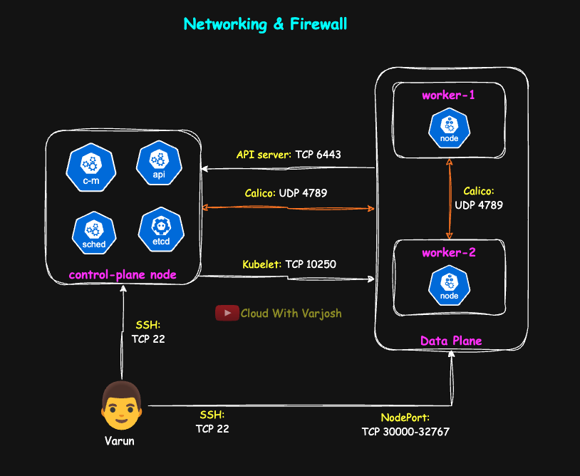

# Day 54: Build a Multi-Node Kubernetes Cluster with kubeadm + Calico Operator | CKA Course 2025

## Video reference for Day 54 is the following:

[](https://www.youtube.com/watch?v=Dmx36Hx-suk&ab_channel=CloudWithVarJosh)

---
## ⭐ Support the Project  
If this **repository** helps you, give it a ⭐ to show your support and help others discover it! 

---

## Table of Contents

* [Lecture Prerequisites](#lecture-prerequisites)  
  * [What to focus on (5-minute checklist)](#what-to-focus-on-5-minute-checklist)  
* [Demo: Build a Multi-Node Kubernetes Cluster with kubeadm (v1.32)](#demo-build-a-multi-node-kubernetes-cluster-with-kubeadm-v132)
  * [Demo Pre-requisites](#demo-pre-requisites)  
    * [1) Networking & Security Groups](#1-networking--security-groups)  
      * [control-plane-sg (inbound)](#control-plane-sg-inbound)  
      * [data-plane-sg (inbound)](#data-plane-sg-inbound)  
    * [2) SSH key pair](#2-ssh-key-pair)  
    * [3) Instances](#3-instances)  
    * [4) Hostnames (clarity only)](#4-hostnames-clarity-only)  
    * [5) How to follow the steps (read this first)](#5-how-to-follow-the-steps-read-this-first)  
  * [Step 1: Disable swap & set kernel networking $ALL NODES$](#step-1-disable-swap--set-kernel-networking-all-nodes)  
  * [Step 2: Install and configure containerd $ALL NODES$](#step-2-install-and-configure-containerd-all-nodes)  
  * [Step 3: Install kubeadm, kubelet, kubectl (v1.32) $ALL NODES$](#step-3-install-kubeadm-kubelet-kubectl-v132-all-nodes)  
  * [Step 4: Initialize the control plane $CONTROL PLANE ONLY$](#step-4-initialize-the-control-plane-control-plane-only)  
  * [Step 5: Install Calico CNI via Operator (defaults) $CONTROL PLANE ONLY$](#step-5-install-calico-cni-via-operator-defaults-control-plane-only)  
  * [Step 6: Join the workers $WORKER ONLY$](#step-6-join-the-workers-worker-only)  
  * [Step 7: Verify & quick demo $any node with kubeconfig$](#step-7-verify--quick-demo-any-node-with-kubeconfig) 
* [Calico Troubleshooting **IMPORTANT**](#calico-troubleshooting)   
* [Post-install reboots & stabilization (strongly recommended)](#post-install-reboots--stabilization-strongly-recommended)   
* [Conclusion](#conclusion)  
* [References](#references)  

---

## Lecture Prerequisites

**Day 7 — Kubernetes Architecture & Deployment Workflow**
* [Day 7 Video](https://www.youtube.com/watch?v=-9Cslu8PTjU&ab_channel=CloudWithVarJosh)
* [Day 7 Notes](https://github.com/CloudWithVarJosh/CKA-Certification-Course-2025/tree/main/Day%2007)

**Day 25 — Core & Extensions: CNI, CSI, CRI, Add-Ons & Plugins**
* [Day 25 Video](https://www.youtube.com/watch?v=AVovCH0dvyM&ab_channel=CloudWithVarJosh)
* [Day 25 Notes](https://github.com/CloudWithVarJosh/CKA-Certification-Course-2025/tree/main/Day%2025)

#### 5-Minute Checklist

* Control plane: **API server, etcd, controller manager, scheduler**
* Nodes: **kubelet, kube-proxy, container runtime**
* Networking: **Pods, Services**, and why a **CNI** (Calico) is needed

If those ring a bell, you’re ready for **Day 54**.

---

# Demo: Build a Multi-Node Kubernetes Cluster with kubeadm (v1.32)

In this demo we’ll stand up a small, real cluster on VMs: one control-plane node and two worker nodes, all on Ubuntu with containerd and Calico for networking. I’ll show it on **cloud** VMs, but **any VMs work** (on-prem, home lab, or a laptop hypervisor) as long as they can reach each other and you can SSH in. We’ll set up the control plane first, make sure it’s good, then add the workers and deploy a tiny test app end-to-end. Every command block says exactly where to run it — **\[ALL NODES]**, **\[CONTROL PLANE ONLY]**, or **\[WORKER ONLY]**. If you’re not on AWS, treat “security groups” as your firewall rules/NSGs with the same ports.


---

## Demo Pre-requisites

### 1) Networking & Security Groups (updated for Calico **Typha**)

> **Why this change?** In the Day 54 video we didn’t open **TCP 5473**. With operator-based Calico, the **Typha** component is commonly enabled and (by default) runs with **hostNetwork**, so each `calico-node` (Felix) connects to Typha on **5473/TCP**. Without this, `calico-node` can sit in **Running (0/1)** with Typha connection timeouts.

**Note:** For full context and step-by-step fixes, see **[Calico Troubleshooting](#calico-troubleshooting)** at the end of this guide.




Create two SGs: **control-plane-sg** and **data-plane-sg** (same VPC). Allow **all egress** on both.

#### control-plane-sg (inbound)

| Purpose          | Protocol / Port | Source            | When                                        |
| ---------------- | --------------- | ----------------- | ------------------------------------------- |
| SSH              | TCP 22          | Your IP           | Always                                      |
| Kubernetes API   | TCP 6443        | **data-plane-sg** | Always                                      |
| **Calico Typha** | **TCP 5473**    | **data-plane-sg** | If Typha Pods can land on CP nodes          |
| VXLAN overlay    | **UDP 4789**    | **data-plane-sg** | Recommended (Calico defaults run on CP too) |


> **Note (self-managed clusters):** By default the `calico-node` **DaemonSet tolerates the control-plane taint and runs on control-plane nodes**. Therefore, keep **UDP 4789 (VXLAN)** and **TCP 5473 (Typha)** open on the control-plane SG.
> You can omit these **only if you explicitly keep Calico off control-plane nodes** (e.g., label workers and set a `nodeSelector`/remove CP tolerations on `calico-node`) **and** ensure Typha runs only on workers.


---

#### data-plane-sg (inbound)

| Purpose          | Protocol / Port | Source               | When                                            |
| ---------------- | --------------- | -------------------- | ----------------------------------------------- |
| SSH              | TCP 22          | Your IP              | Always                                          |
| Kubelet API      | TCP 10250       | **control-plane-sg** | Always                                          |
| VXLAN overlay    | **UDP 4789**    | **data-plane-sg**    | Always (worker ↔ worker)                        |
| VXLAN overlay    | **UDP 4789**    | **control-plane-sg** | Always (CP ↔ worker)                            |
| **Calico Typha** | **TCP 5473**    | **data-plane-sg**    | If Typha Pods can land on workers (node ↔ node) |
| **Calico Typha** | **TCP 5473**    | **control-plane-sg** | If CP nodes must reach Typha on workers         |
| NodePort (demo)  | TCP 30000–32767 | Your IP              | Optional (only for testing NodePort externally) |

---

**Azure/GCP:** use NSGs / VPC firewall rules with the **same ports/protocols**.
**Also ensure** instances have outbound internet (NAT GW or public EIP) so images can pull.
**HA note (optional):** multi-CP clusters also need: **TCP 2379–2380** (etcd), **TCP 10257** (controller-manager), **TCP 10259** (scheduler) between control-plane nodes.


---

### 2) SSH key pair

**Recommended:** **create the key pair in your cloud provider’s console.**
This is the easiest path because the provider injects your **public key** at boot—no manual copy to `~/.ssh/authorized_keys`.

* **AWS (easy path):** EC2 → **Key Pairs** → **Create key pair** → Type: **ED25519** → download `.pem`

  ```bash
  chmod 400 ~/Downloads/kubeadm-demo.pem
  ssh -i ~/Downloads/kubeadm-demo.pem ubuntu@<PUBLIC_IP_OR_DNS>
  ```
* **Azure/GCP:** Create an SSH key in the VM create flow (Azure “SSH public key”, GCP “SSH Keys/OS Login”). The platform injects it automatically.

**Alternative (local key you generate):**
If you generate a key locally, you must **import the public key** to your cloud account **or** copy it into each VM’s `authorized_keys`.

```bash
# generate locally
ssh-keygen -t ed25519 -C "kubeadm-demo" -f ~/.ssh/kubeadm-demo
chmod 400 ~/.ssh/kubeadm-demo


# copy to a running VM using ssh-copy-id (requires you can already SSH to it)
ssh-copy-id -i ~/.ssh/kubeadm-demo.pub ubuntu@<PUBLIC_IP_OR_DNS>

# then connect using your private key
ssh -i ~/.ssh/kubeadm-demo ubuntu@<PUBLIC_IP_OR_DNS>
```

> **TL;DR:** **Use the provider-generated key pair if possible**—it skips the whole “copy the public key into `authorized_keys`” step.


When connecting:

```bash
ssh -i ~/.ssh/kubeadm-demo ubuntu@<PUBLIC_IP_OR_DNS>
```

---

### 3) Instances

* **OS:** Ubuntu **22.04 or 24.04** LTS (amd64)
* **Sizing:**

  * Control plane: **2 vCPU, 4–8 GB RAM**, 20 GB disk (8 GB works for quick demos)
  * Workers: **1–2 vCPU, 2–4 GB RAM**, 8–20 GB disk
* Place all nodes in the **same VPC** and **routable subnets**.

> kubeadm requires **≥2 vCPU** on the control plane (you *can* bypass with `--ignore-preflight-errors=NumCPU`, but keep 2 vCPU for a clean demo).

---

### 4) Hostnames (clarity only)

On each node (adjust name):

```bash
sudo hostnamectl set-hostname control-plane   # or worker-1 / worker-2
exec bash    # reload the current shell so hostname/prompt and new env settings take effect (use 'sudo reboot' if it still doesn’t reflect)
```

*(Optional)* Add friendly entries to `/etc/hosts` if you want to `ping` by name; Kubernetes doesn’t require it.

---

### 5) How to follow the steps (read this first)

* **Only run commands where the heading says.** Each block is labeled **\[ALL NODES]**, **\[CONTROL PLANE ONLY]**, or **\[WORKER ONLY]**. Stick to that label.
* **Recommended order:** finish the **control plane** first, then do the **workers**.

  * In the control-plane section there’s a short “check” at the end. **Run that check.** If it looks good (no errors), move on to the worker section.
* **Stay organized:** keep one terminal tab per node, copy/paste exactly, and replace placeholders (like `<CP_PRIVATE_IP>`) with your values.
* **Use `sudo` when shown** and don’t skip steps—even if something “looks done.”

---


## Step 1: Disable swap & set kernel networking \[ALL NODES]

```bash
# Disable swap (required by kubelet)
sudo swapoff -a
sudo sed -i '/ swap / s/^/#/' /etc/fstab

# Kernel modules & sysctls for container networking
echo -e "overlay\nbr_netfilter" | sudo tee /etc/modules-load.d/k8s.conf
sudo modprobe overlay && sudo modprobe br_netfilter

cat <<'EOF' | sudo tee /etc/sysctl.d/99-kubernetes-cri.conf
net.bridge.bridge-nf-call-iptables=1
net.bridge.bridge-nf-call-ip6tables=1
net.ipv4.ip_forward=1
EOF
sudo sysctl --system
```

**Why:**

* **Swap off** → kubelet’s resource management assumes no swap.
* **`overlay`** → enables overlay filesystem used by container images.
* **`br_netfilter` + bridge sysctls** → let iptables see bridged traffic (pods/Services).
* **`ip_forward=1`** → allow the node to route pod traffic.

---

## Step 2: Install and configure containerd \[ALL NODES]

```bash
# Install containerd
sudo apt-get update && sudo apt-get install -y containerd
sudo mkdir -p /etc/containerd
containerd config default | sudo tee /etc/containerd/config.toml >/dev/null

# Align containerd with kubelet expectations
sudo sed -i 's/SystemdCgroup = false/SystemdCgroup = true/' /etc/containerd/config.toml
sudo sed -i 's#sandbox_image = ".*"#sandbox_image = "registry.k8s.io/pause:3.9"#' /etc/containerd/config.toml

sudo systemctl daemon-reload
sudo systemctl enable --now containerd
sudo systemctl status containerd
```

**Why:**

* **containerd** is the container runtime kubelet talks to.
* **`SystemdCgroup=true`** matches kubelet’s cgroup driver, avoiding cgroup errors.
* **Pause image (`pause:3.9`)** consistency prevents needless pod sandbox churn.

---

## Step 3: Install kubeadm, kubelet, kubectl (v1.32) \[ALL NODES]

```bash
sudo mkdir -p /etc/apt/keyrings
curl -fsSL https://pkgs.k8s.io/core:/stable:/v1.32/deb/Release.key \
 | sudo gpg --dearmor -o /etc/apt/keyrings/kubernetes-apt-keyring.gpg
echo 'deb [signed-by=/etc/apt/keyrings/kubernetes-apt-keyring.gpg] https://pkgs.k8s.io/core:/stable:/v1.32/deb/ /' \
 | sudo tee /etc/apt/sources.list.d/kubernetes.list

sudo apt-get update && sudo apt-get install -y kubelet kubeadm kubectl
sudo apt-mark hold kubelet kubeadm kubectl
sudo systemctl enable kubelet

# Verify
kubeadm version
kubelet --version
kubectl version
```

**Why:**

* **kubeadm** bootstraps the cluster; **kubelet** runs pods; **kubectl** is the CLI.
* Holding versions keeps your demo stable.


### Bash completion (optional, helpful)

```bash
sudo apt-get update && sudo apt-get install -y bash-completion
echo 'source /usr/share/bash-completion/bash_completion' >> ~/.bashrc
echo 'source <(kubectl completion bash)' >> ~/.bashrc
echo 'alias k=kubectl' >> ~/.bashrc
echo 'complete -F __start_kubectl k' >> ~/.bashrc
source ~/.bashrc
```

> **kubectl on workers (kubeconfig):** We didn’t configure a kubeconfig on worker nodes. If you want to run `kubectl` from a worker, create `~/.kube/config` there.
>
> **Quick (lab) method — copy admin kubeconfig**
>
> ```bash
> # On control-plane
> sudo cp /etc/kubernetes/admin.conf /tmp/kubeconfig
> sudo chown $USER:$USER /tmp/kubeconfig
> scp /tmp/kubeconfig ubuntu@worker-1:~/.kube/config
>
> # On worker-1
> mkdir -p ~/.kube
> chmod 600 ~/.kube/config
> kubectl get nodes   # should work now
> ```
>
> *(This grants cluster-admin on that worker; fine for demos, not for prod.)*

---

## Step 4: Initialize the control plane \[CONTROL PLANE ONLY]

```bash
# Replace with your control plane node's private IP
sudo kubeadm init \
  --control-plane-endpoint=<CP_PRIVATE_IP>:6443 \
  --apiserver-advertise-address=<CP_PRIVATE_IP> \
  --pod-network-cidr=192.168.0.0/16
```

```bash
# Kubeconfig for the current user
mkdir -p $HOME/.kube
sudo cp /etc/kubernetes/admin.conf $HOME/.kube/config
sudo chown $(id -u):$(id -g) $HOME/.kube/config
```

**Why:**

* **`--control-plane-endpoint`** is the address other nodes/clients use.
* **`--apiserver-advertise-address`** is the local IP the API server binds to.
* **Pod CIDR** must match your CNI (we’ll use 192.168.0.0/16 with Calico).

> **Note (for 1 vCPU control-plane VMs):**
> kubeadm expects **≥ 2 vCPU** for the control plane. For demos on tiny VMs, you can bypass the preflight check:
>
> ```bash
> sudo kubeadm init \
>   --control-plane-endpoint=<CP_PRIVATE_IP>:6443 \
>   --apiserver-advertise-address=<CP_PRIVATE_IP> \
>   --pod-network-cidr=192.168.0.0/16 \
>   --ignore-preflight-errors=NumCPU
> ```
>
> *This only skips the check, startup may be slower and less stable. Use **2 vCPU** for the control plane when possible. Workers can be 1–2 vCPU.*

---

## Step 5: Install Calico CNI via **Operator** (defaults) \[CONTROL PLANE ONLY]

```bash
# 1) Install the operator and CRDs
kubectl create -f https://raw.githubusercontent.com/projectcalico/calico/v3.30.2/manifests/operator-crds.yaml
kubectl create -f https://raw.githubusercontent.com/projectcalico/calico/v3.30.2/manifests/tigera-operator.yaml

# 2) Apply a minimal Installation CR (no calico-apiserver)
cat <<'EOF' | kubectl apply -f -
apiVersion: operator.tigera.io/v1        # Calico Operator API group/version
kind: Installation                        # Cluster-wide Calico install spec
metadata:
  name: default                           # Must be named 'default' (singleton)
spec:
  calicoNetwork:                          # Calico networking settings
    bgp: Disabled                         # Added later. Refer "Calico Troubleshooting" section of this lecture
    ipPools:
    - cidr: 192.168.0.0/16                # Pod CIDR (matches kubeadm --pod-network-cidr)
      natOutgoing: Enabled                # SNAT pod→external traffic at node egress
      blockSize: 26                       # Per-node IP block size (/26 = 64 pod IPs)
      encapsulation: VXLANCrossSubnet     # Use VXLAN; skip encapsulation within same L2 subnet
      nodeSelector: all()                 # Apply this pool to all nodes
EOF
```

**Why:**

* This is the **official, operator-managed install**—simple now and easier to upgrade later.
* The provided `custom-resources.yaml` applies **sensible defaults** that work with kubeadm clusters (including the `192.168.0.0/16` pod network used here), so **no customization is required**.
* Once installed, Calico provides **networking for pods and Services**, allowing system pods (like CoreDNS) and your apps to start communicating.

---

## Step 6: Join the workers \[WORKER ONLY]

```bash
# On the control plane, print the fresh join command:
kubeadm token create --print-join-command
```

Run the printed command **exactly** on each worker, for example:

```bash
sudo kubeadm join <CP_PRIVATE_IP>:6443 --token <TOKEN> \
  --discovery-token-ca-cert-hash sha256:<HASH>
```

**Why:**

* This securely bootstraps the worker, registers it, and downloads cluster certs.

---

## Step 7: Verify & quick demo \[any node with kubeconfig]

```bash
# See nodes and system pods
kubectl get nodes -o wide
kubectl -n kube-system get pods -o wide

# Tiny demo app + Service
kubectl create deploy web --image=nginx --replicas=3
kubectl expose deploy/web --port=80 --type=NodePort

# Discover the NodePort
kubectl get svc web -o wide
kubectl get svc web -o jsonpath='{.spec.ports[0].nodePort}'; echo

# Test from your machine (security groups must allow it)
curl -I http://<worker-1-public-or-private-ip>:<nodeport>
curl -I http://<worker-2-public-or-private-ip>:<nodeport>
```

---

## Calico Troubleshooting

**Why these Calico fixes exist?**
While upgrading the cluster in **Day 55**, we noticed some `calico-node` Pods weren’t becoming **Ready**. We applied a few Calico/network tweaks to resolve this. The steps below document those changes. For full context, watch the **Day 55** lecture where we perform the Kubernetes upgrade with **kubeadm**.


**Symptom:** `calico-node` Pods show **Running (0/1)** and readiness fails. You’ll see messages like **“Error querying BIRD”** or **“BGP not established …”** even though the cluster uses **VXLAN** (so BGP isn’t required).

**Root cause:** With the Tigera **operator** install, **BGP defaults to enabled** unless you explicitly set it. In a VXLAN setup, that leads to BIRD/BGP readiness failures. After disabling BGP, some nodes may still report **Felix not ready** if they can’t reach **Typha** (TCP **5473**).

## Fix (VXLAN clusters)

**1) Check whether BGP is enabled**

```bash
# Show the BGP setting on the Installation CR (empty or "Enabled" = on)
kubectl get installation.operator.tigera.io default \
  -o jsonpath='{.spec.calicoNetwork.bgp}{"\n"}'
```

**2) Disable BGP on the Installation CR**

```bash
# Turn off BGP for VXLAN-only networking
kubectl patch installation.operator.tigera.io default --type=merge \
  -p '{"spec":{"calicoNetwork":{"bgp":"Disabled"}}}'
```

**3) Restart calico-node to pick up the change**

```bash
# Rollout restart the DaemonSet and wait for readiness
kubectl -n calico-system rollout restart ds/calico-node
kubectl -n calico-system rollout status ds/calico-node
```

**4) If you still see readiness errors mentioning Felix / Typha**

```bash
# Inspect Typha endpoints (Pods usually run in calico-system)
kubectl -n calico-system get deploy,svc,endpoints -l k8s-app=calico-typha

# Check calico-node logs for Typha connection errors (port 5473/TCP)
kubectl -n calico-system logs ds/calico-node -c calico-node | grep -i typha
```

Open **TCP 5473** **between nodes and the Typha endpoints** (where the `calico-typha` Pods run). In cloud environments, that means updating your **Security Groups/NSGs** to allow node↔Typha traffic on **5473/TCP**.
Also ensure **UDP 4789** is allowed for **VXLAN** (you already did this), and note that you **do not** need **TCP 179** (BGP) when BGP is disabled.

> If you actually intend to use BGP (no overlay / routed fabric), **keep BGP enabled** and open **TCP 179** between peers (and configure node-to-node mesh or route reflectors). For VXLAN-only clusters, keep BGP **Disabled** to avoid BIRD errors.

**Reference:** Tigera docs mention disabling BGP for operator-based VXLAN installs:
[https://docs.tigera.io/calico/latest/getting-started/kubernetes/windows-calico/operator#operator-installation](https://docs.tigera.io/calico/latest/getting-started/kubernetes/windows-calico/operator#operator-installation)

https://docs.tigera.io/calico/latest/getting-started/kubernetes/self-managed-onprem/config-options#use-vxlan

---

## Post-install reboots & stabilization (strongly recommended)

1. **Control plane first**

   * After Step 4 (init + Calico) shows system pods **Running**, reboot the CP:

     ```bash
     sudo reboot
     ```
   * Wait **10–15 minutes** for components to settle, then verify:

     ```bash
     # on the control plane
     sudo systemctl status containerd kubelet --no-pager
     kubectl get nodes
     kubectl -n kube-system get pods
     ```

2. **Then workers**

   * Complete Steps 1–3 on each worker, run the **kubeadm join**, then reboot each worker:

     ```bash
     sudo reboot
     ```
   * Give it **5–10 minutes**, then confirm:

     ```bash
     kubectl get nodes -o wide
     kubectl -n calico-system get pods -o wide
     ```

> **Still seeing flaps?** Do a **clean-slate reset** (workers → control plane) and re-run the install steps in order.
>
> ```bash
> # WORKERS
> sudo kubeadm reset -f
> sudo rm -rf /etc/cni/net.d /var/lib/cni /var/lib/kubelet/pki ~/.kube
> for i in cni0 vxlan.calico tunl0; do sudo ip link del "$i" 2>/dev/null || true; done
> sudo systemctl restart containerd
>
> # CONTROL PLANE
> sudo kubeadm reset -f
> sudo rm -rf /etc/kubernetes /var/lib/etcd /etc/cni/net.d /var/lib/cni /var/lib/kubelet/pki ~/.kube
> for i in cni0 vxlan.calico tunl0; do sudo ip link del "$i" 2>/dev/null || true; done
> sudo systemctl restart containerd
> ```


---

## Conclusion

You just built a clean, repeatable multi-node Kubernetes **v1.32** cluster with **containerd** and **Calico**. We brought up the control plane first, confirmed it was healthy, then joined workers and validated cross-node traffic with a NodePort service. Along the way you aligned containerd’s cgroups with kubelet, set essential kernel networking flags, and applied Calico in the encapsulation mode you prefer (IP-in-IP or VXLAN) with the right firewall/SG openings.

---

## References


* **Installing kubeadm (version-pinned via pkgs.k8s.io)** — [Kubernetes docs: Install kubeadm](https://kubernetes.io/docs/setup/production-environment/tools/kubeadm/install-kubeadm/) *(kubernetes.io)*
* **Container runtimes (kernel modules/sysctls)** — [Kubernetes docs: Container runtimes](https://kubernetes.io/docs/setup/production-environment/container-runtimes/) *(kubernetes.io)*
* **Kubelet ↔ runtime cgroup driver (systemd)** — [Kubernetes docs: Configure cgroup driver](https://kubernetes.io/docs/tasks/administer-cluster/kubeadm/configure-cgroup-driver/) *(kubernetes.io)*
* **Change Kubernetes package repository (pin a minor)** — [Kubernetes docs: Change package repository](https://kubernetes.io/docs/tasks/administer-cluster/kubeadm/change-package-repository/) *(kubernetes.io)*
* **Kubernetes Services & NodePort** — [Kubernetes docs: Service](https://kubernetes.io/docs/concepts/services-networking/service/) *(kubernetes.io)*
* **Kubernetes ports & protocols (APIs, components, CNIs, etc.)** — [Kubernetes docs: Ports and protocols](https://kubernetes.io/docs/reference/networking/ports-and-protocols/) *(kubernetes.io)*
* **`kubeadm reset` (what gets cleaned up)** — [Kubernetes docs: kubeadm reset](https://kubernetes.io/docs/reference/setup-tools/kubeadm/kubeadm-reset/) *(kubernetes.io)*
* **Calico system/network requirements (ports & protocols)** — [Calico docs: Kubernetes requirements](https://docs.tigera.io/calico/latest/getting-started/kubernetes/requirements) *(docs.tigera.io)*
* **Calico install (operator/manifest) on self-managed clusters** — [Calico docs: On-premises install](https://docs.tigera.io/calico/latest/getting-started/kubernetes/self-managed-onprem/onpremises) *(docs.tigera.io)*

---
