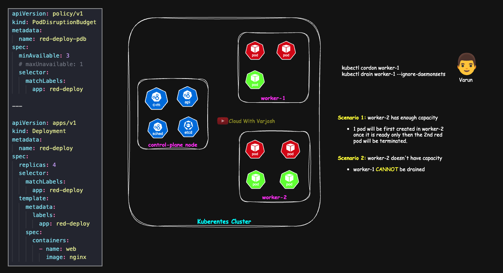

# Day 55: Upgrade a Multi-Node Kubernetes Cluster with kubeadm | CKA Course 2025

## Video reference for Day 55 is the following:

[](https://www.youtube.com/watch?v=y_PHAkH_bLU&ab_channel=CloudWithVarJosh)


---
## ⭐ Support the Project  
If this **repository** helps you, give it a ⭐ to show your support and help others discover it! 

---


## Table of Contents

* [Introduction](#introduction)  
* [Versioning & Release Cadence](#versioning--release-cadence)  
* [Support Window & Real-World Practice](#support-window--real-world-practice)  
* [Skipping Versions & Sequencing](#skipping-versions--sequencing)  
* [Version Skew (Component Compatibility)](#version-skew-component-compatibility)  
* [Why Upgrades Matter](#why-upgrades-matter)  
* [High-Level Upgrade Flow (Production)](#high-level-upgrade-flow-production)  
* [Upgrade Strategies](#upgrade-strategies)  
* [Demo: Upgrade a Multi-Node Kubernetes Cluster with `kubeadm` (1.32.8 → 1.33.4)](#demo-upgrade-a-multi-node-kubernetes-cluster-with-kubeadm-1328--1334)  
  * [Scope & Assumptions](#scope--assumptions)  
  * [Pre-Requisites (Read Once)](#pre-requisites-read-once)  
  * [Control-Plane Upgrade](#control-plane-upgrade)  
    * [Step 1: Point APT to the v1.33 repo](#step-1-point-apt-to-the-v133-repo)  
    * [Step 2: Determine the exact target version](#step-2-determine-the-exact-target-version)  
    * [Step 3: Upgrade `kubeadm` (control plane)](#step-3-upgrade-kubeadm-control-plane)  
    * [Step 4: Plan the upgrade (dry-run)](#step-4-plan-the-upgrade-dry-run)  
    * [Step 5: Apply the control-plane upgrade](#step-5-apply-the-control-plane-upgrade)  
    * [Step 6: Verify server version and node skew](#step-6-verify-server-version-and-node-skew)  
    * [Step 7: Upgrade node-local bits on the control-plane node](#step-7-upgrade-node-local-bits-on-the-control-plane-node)  
  * [Worker Node Upgrades (one at a time)](#worker-node-upgrades-one-at-a-time)  
    * [Step 1: Cordon, then drain](#step-1-cordon-then-drain-from-control-plane-or-any-admin-shell)  
    * [Step 2: Upgrade the worker](#step-2-upgrade-the-worker-on-the-worker-node)  
    * [Step 3: Uncordon and verify](#step-3--uncordon-and-verify-from-admin-shell)  
* [Calico Post-Upgrade Troubleshooting](#calico-post-upgrade-troubleshooting)
* [Draining with a PodDisruptionBudget (What the diagram shows)](#draining-with-a-poddisruptionbudget-what-the-diagram-shows)  
* [Conclusion](#conclusion)  
* [References](#references)  


---


## **Introduction**

Kubernetes upgrades are not optional — they are a critical part of maintaining a secure, stable, and fully supported production environment. Each new release introduces **security patches, feature enhancements, and API lifecycle changes** that directly impact cluster reliability and ecosystem compatibility. Understanding Kubernetes’ **versioning scheme, release cadence, and support timelines** helps platform teams plan upgrades in a **predictable, low-risk manner**. This document provides **practical guidance** on versioning, upgrade strategies, sequencing, and production-ready workflows to ensure smooth transitions between minor versions without downtime.

👉 **If you don’t have a working cluster yet, start with Day 54:**

* [Day 54 – Build a Kubernetes Cluster (GitHub)](https://github.com/CloudWithVarJosh/CKA-Certification-Course-2025/tree/main/Day%2054)  
* [Day 54 – Video Walkthrough (YouTube)](https://www.youtube.com/watch?v=Dmx36Hx-suk&ab_channel=CloudWithVarJosh)  


---

## Versioning & Release Cadence

* **Nomenclature:** `MAJOR.MINOR.PATCH`
  Example: **1.32.8** → **major** = 1, **minor** = 32, **patch** = 8.
* **Minor releases:** typically \~every **4 months** (\~3 per year).
* **Patch releases:** generally **monthly** per supported branch; cadence is often **faster (1–2 weeks)** immediately after a new minor while early issues are addressed.

**Why this matters:** Plan an upgrade window roughly once per minor and expect early patch drops soon after you move to a new minor.

---

## Support Window & Real-World Practice

* **Upstream window:** Only **N / N-1 / N-2** receive patches (≈12 months per minor). Plan upgrades so you don’t fall off support.
  *Example:* when **1.33** is current, only **1.33 / 1.32 / 1.31** get fixes; **1.30** is out.

* **Managed Kubernetes (FYI):**

  * **Amazon EKS:** \~**14 months** standard + **12 months** extended (paid) → up to **\~26 months** per minor.
  * **Azure AKS / Google GKE:** typically keep you within **N-2**; exact timelines/LTS/auto-upgrade vary—check provider docs.

* **Reminder:** Managed offerings are vendor-tuned; **support is via your cloud provider**, not upstream Kubernetes. Open tickets with the provider for managed clusters.

---

## Patch Management Guideline (N / N-1 / N-2)

**Definitions:** **N** = current production minor (e.g., `1.33`); **N-1 / N-2** = previous supported minors (e.g., `1.32`, `1.31`).

**Policy**

* **N-1 & N-2:** run the **latest patch** for that minor (maximize security/bug fixes).
* **N (Prod):** **pin to a known-good patch**; promote newer patches **after staging/canary soak**, so Prod may intentionally **lag** the absolute latest for a short validation window.

**Example**

* **Prod (N = 1.33):** **`1.33.3`** (vetted).
* **N-1 / N-2:** **`1.32.latest`** and **`1.31.latest`**.

> **Production Insight**
>
> * Many teams upgrade **every other minor (\~6–8 months)** with **monthly patches** in between—still within **N / N-1 / N-2**.
> * Prod rarely jumps to a **brand-new N**; even on N, it’s usually **not the day-zero latest patch** (wait for follow-ups).
> * **Exceptions:** urgent CVEs, auto-upgrade channels, greenfield clusters.
> * If you spot **N at the very latest patch** in prod, tell me :-P

---

## Skipping Versions & Sequencing

* **Do not skip minor versions.** Upgrading **1.31 → 1.33** directly is **unsupported**.
  Correct path: **1.31 → 1.32 → 1.33** (one minor at a time).
* **Order matters:** upgrade the **control plane first**, then **workers**. Within each tier, upgrade **one node at a time** for production.

---

## Version Skew (Component Compatibility)

Use these guardrails to avoid compatibility issues during rolling upgrades:

* **kube-apiserver:** defines the cluster version. In HA, keep API servers within **one minor** of each other while rolling.
* **kube-controller-manager / kube-scheduler / cloud-controller-manager:**

  * **Must not be newer** than the API server.
  * Prefer **same minor**; **up to one minor older** is generally tolerated during the upgrade window.
* **kubelet (on nodes):**

  * **Must not be newer** than the API server.
  * Keep it **equal or slightly older** during the roll; **up to two minors older** is tolerated while you upgrade workers.
* **kubectl (client):**

  * Supported within **±1 minor** of the API server.
  * For admin laptops/CI images, staying on N or N+1 is practical; on nodes, match the node’s kubelet to avoid drift.
  > Run multiple `kubectl` versions on one host without pain: keep the client **within ±1 minor** of each cluster (install **N, N-1, N+1** you use most).
**Best:** use **asdf** to auto-switch versions per project.
**Simple:** keep multiple binaries (e.g., `kubectl-1.31`, `kubectl-1.32`) with a symlink/aliases.
**Zero-install:** run pinned images like `bitnami/kubectl:1.xx` via Docker/Podman.
Name contexts with the minor (e.g., `prod-1.32`) and sanity-check with `kubectl version`.


>**Safe rule of thumb:** Never run a component **newer** than the API server; converge all components to the **same minor** promptly.


---

## Why Upgrades Matter

* **Security & compliance:** CVEs and critical bugs are patched only on supported branches.
* **Features & APIs:** New capabilities, GA promotions, and deprecations arrive in minors.
* **Ecosystem compatibility:** CNIs, CSI drivers, ingress/controllers validate against currently supported minors.
  > Sometimes your CNI/CSI/CRI (or other third party addons) ship new features that depend on newer Kubernetes APIs. If your cluster is on an older minor, those features can break, or the addon may fail to start, due to version skew or missing API fields.


---

## High-Level Upgrade Flow (Production)

Here’s a tightened version of your **High-Level Upgrade Flow (Production)**—same content, crisper phrasing.

## High-Level Upgrade Flow (Production)

* **Pre-checks**
  Verify control-plane and etcd health; ensure **capacity headroom** (or temporarily scale up); confirm **PDBs**, **readiness probes**, and **replicas** are in place; take an **etcd snapshot** and back up `/etc/kubernetes` (manifests/PKI).

* **Control plane (one node at a time)**
  Upgrade **kubeadm** → run **`kubeadm upgrade plan`** → **`kubeadm upgrade apply <target>`** on the **first** control plane → on remaining control planes run **`kubeadm upgrade node`** → upgrade **kubelet/kubectl** and **restart kubelet**.

* **Workers (one node at a time)**
  **cordon** + **drain** (respect PDBs) → **`kubeadm upgrade node`** → upgrade **kubelet/kubectl** → **restart kubelet** → **uncordon**.

* **Add-ons & system components**
  Ensure **CoreDNS** and **kube-proxy** roll to their target versions. Confirm **CNI/CSI/CRI** remain compatible with the target minor.

* **Post-validation**
  Check node and server/client **versions**, component **health** and **logs**, run **synthetic traffic probes**, and revert any **temporary scale-outs**.

---

## Upgrade Strategies

* **All at once:** acceptable for **dev/test** clusters without SLOs.
* **Rolling (one node at a time):** **best practice** for **production**. Combine with capacity headroom or temporary scale-out to keep latency stable.
* **Blue/Green:** run current (“blue”) and new (“green”) nodes/cluster in parallel; validate green, then shift traffic (DNS/LB/Gateway) and retire blue.
  * **Use when:** tight SLOs or risky OS/runtime/CNI changes; higher cost/ops, but instant rollback.

---

# Demo: Upgrade a Multi-Node Kubernetes Cluster with `kubeadm` (1.32.8 → 1.33.4)

## Scope & Assumptions

* OS: Ubuntu/Debian family, **containerd 1.7.27**, `SystemdCgroup=true`.
* CNI: **Calico v3.30** (compatible with Kubernetes 1.31–1.33).
* Current cluster: **v1.32.8**, target: **v1.33.4** (`.deb` revision **`1.33.4-1.1`**).
* Multi-node, single or HA control plane (HA callouts included).

> **Prerequisite**
> If you don’t have a working cluster yet, complete **Day 54** first:
> - [Day 54 – Build a Kubernetes Cluster (GitHub)](https://github.com/CloudWithVarJosh/CKA-Certification-Course-2025/tree/main/Day%2054)
> - [Day 54 – Video Walkthrough (YouTube)](https://www.youtube.com/watch?v=Dmx36Hx-suk&ab_channel=CloudWithVarJosh)


---


## Pre-Requisites (Read Once)

* **CNI compatibility:** **Calico v3.30** (OK for K8s 1.31–1.33). See **[Calico Kubernetes requirements]**.
* **CRI compatibility:** **containerd 1.7.27** (OK for K8s 1.33). See **[containerd releases – Kubernetes support]**.
  * containerd --version
* **Capacity headroom:** Ensure spare capacity or temporarily scale replicas up / add a node.
* **PDBs & probes:** Critical workloads have **readiness probes** and **PodDisruptionBudgets (PDBs)** to avoid drops during drains.
* **Backups:**

  * Snapshot **etcd** (stacked etcd: from a CP node; external etcd: snapshot the etcd cluster).
  * Tarball `/etc/kubernetes` (PKI + manifests) on each control-plane node.


* **HA specifics:**

  * Run `kubeadm upgrade apply` on **one** control-plane node only.
  * Other CP nodes use `kubeadm upgrade node`.
  * Ensure the API fronting LB health-checks `/readyz` and removes a CP while its API restarts.
  * For stacked etcd, upgrade **one CP at a time** to preserve quorum.

[Calico Kubernetes requirements]: https://docs.tigera.io/calico/latest/getting-started/kubernetes/requirements#kubernetes-requirements
[containerd releases – Kubernetes support]: https://containerd.io/releases/#kubernetes-support

---
## Control-Plane Upgrade

### Step 1: Point APT to the v1.33 repo

```bash

# View the Kubernetes APT repo file in a read-only pager
pager /etc/apt/sources.list.d/kubernetes.list

sudo vim /etc/apt/sources.list.d/kubernetes.list
# Change 1.32 → 1.33 (per-minor repos)
# Final line should be exactly:
# deb [signed-by=/etc/apt/keyrings/kubernetes-apt-keyring.gpg] https://pkgs.k8s.io/core:/stable:/v1.33/deb/ /
```

> Tip: remove any legacy `apt.kubernetes.io` entries to avoid mixing repos.
> Then refresh indexes: `sudo apt-get update`.

### Step 2: Determine the exact target version

```bash
# Find the latest 1.33 build (note the full string with revision)
sudo apt-get update # Refresh package indexes so APT sees the v1.33 repo you configured
sudo apt-cache madison kubeadm # Show all kubeadm versions available from your configured repos.
# Example output:
# kubeadm | 1.33.4-1.1 | https://pkgs.k8s.io/core:/stable:/v1.33/deb  Packages
# kubeadm | 1.33.3-1.1 | ...
# kubeadm | 1.33.2-1.1 | ...
# kubeadm | 1.33.1-1.1 | ...
# kubeadm | 1.33.0-1.1 | ...

# If you don't see 1.33 here, re-check your repo file:
#   /etc/apt/sources.list.d/kubernetes.list  (should point to .../v1.33/deb/ /)
# then run 'sudo apt-get update' again.
```

### Step 3: Upgrade `kubeadm` (control plane)

```bash
# Allow kubeadm to be upgraded (if it was previously pinned/held).
sudo apt-mark unhold kubeadm

# Refresh package indexes and install the EXACT target version.
sudo apt-get update && sudo apt-get install -y kubeadm=1.33.4-1.1

# Pin kubeadm to this exact version; APT won’t upgrade it again until you unhold it next time.
sudo apt-mark hold kubeadm

# Verify the kubeadm client version now matches the target (should show v1.33.4).
kubeadm version
```

**Why unhold → install exact → hold:** prevents accidental drift during and after the planned change window.

> Optional: pre-pull images to reduce restart lag
> `sudo kubeadm config images pull`

---

### Step 4: Plan the upgrade (dry-run)

```bash
sudo kubeadm upgrade plan   # think "terraform plan" for kubeadm
```

You’ll see a detailed plan, including:

* **Manual component upgrades** after control plane (e.g., kubelet on nodes)
* **Targets** for: API server, controller manager, scheduler, kube-proxy, CoreDNS, etcd

Example (snippets):

```
Components that must be upgraded manually after you have upgraded the control plane with 'kubeadm upgrade apply':
COMPONENT   NODE            CURRENT   TARGET
kubelet     control-plane   v1.32.8   v1.33.4
kubelet     worker-1        v1.32.8   v1.33.4

Upgrade to the latest stable version:

COMPONENT                 NODE            CURRENT    TARGET
kube-apiserver            control-plane   v1.32.8    v1.33.4
kube-controller-manager   control-plane   v1.32.8    v1.33.4
kube-scheduler            control-plane   v1.32.8    v1.33.4
kube-proxy                                1.32.8     v1.33.4
CoreDNS                                   v1.11.3    v1.12.0
etcd                      control-plane   3.5.16-0   3.5.21-0
```

> Optional: see manifest diffs before applying
> `sudo kubeadm upgrade diff v1.33.4`

---

### Step 5: Apply the control-plane upgrade

```bash
sudo kubeadm upgrade apply v1.33.4
```

Expected tail of output:

```
[upgrade] SUCCESS! A control plane node of your cluster was upgraded to "v1.33.4".
[upgrade] Now please proceed with upgrading the rest of the nodes by following the right order.
```

**Notes**

* At a high level, `kubeadm upgrade` updates the **static pod manifests** (image tags/flags) for control-plane components. Kubelet then restarts them with the new images.
* By default, `kubeadm upgrade` automatically **renews certificates** it manages. To opt out: `--certificate-renewal=false`.

---

### Step 6: Verify server version and node skew

```bash
kubectl version
# Client Version: v1.32.8
# Server  Version: v1.33.4  ← control plane upgraded, node kubelets still 1.32.8

# This command shows the kubelet version for each node (VERSION column).
kubectl get nodes
# Example: control-plane shows VERSION v1.32.8 until we upgrade kubelet below.
```

---

### Step 7: Upgrade node-local bits on the control-plane node

```bash
# Allow kubelet/kubectl to be upgraded (if previously pinned/held).
sudo apt-mark unhold kubelet kubectl || true

# Install the EXACT target versions for kubelet and kubectl on this control-plane node.
sudo apt-get install -y kubelet=1.33.4-1.1 kubectl=1.33.4-1.1

# Reload systemd units (in case package updated service files) and restart kubelet to pick up the new binary.
sudo systemctl daemon-reload && sudo systemctl restart kubelet

# Pin kubeadm, kubelet, and kubectl to prevent unintended upgrades until the next planned window.
sudo apt-mark hold kubeadm kubelet kubectl

```

Verify:

```bash
kubectl version
# Client Version: v1.33.4
# Server  Version: v1.33.4

kubectl get nodes
# control-plane   Ready   control-plane   ...   v1.33.4
# worker-1        Ready   <none>          ...   v1.32.8
# worker-2        Ready   <none>          ...   v1.32.8
```


> **Recommendation:** After upgrading, **reboot** the control-plane node to force clean restarts (kubelet, containerd, networking) and surface any gaps early. In this lecture, we reboot after finishing the worker upgrades to keep the flow simple.


**HA clusters (brief differences):**

```bash
# Run on EXACTLY ONE control-plane node: performs the cluster-level control-plane upgrade.
sudo kubeadm upgrade apply v1.33.4
```

```bash
# On EACH REMAINING control-plane node (one at a time):

# Allow kubeadm to be upgraded on this CP node (if it was previously held).
sudo apt-mark unhold kubeadm

# Install the EXACT kubeadm version for this CP node, then pin it to avoid drift.
sudo apt-get install -y kubeadm=1.33.4-1.1
sudo apt-mark hold kubeadm

# HA-specific: align this CP node to the upgraded cluster state (no 'apply' here).
sudo kubeadm upgrade node

# Allow kubelet/kubectl upgrades on this CP node (if they were held).
sudo apt-mark unhold kubelet kubectl

# Install the EXACT kubelet/kubectl versions for this CP node.
sudo apt-get install -y kubelet=1.33.4-1.1 kubectl=1.33.4-1.1

# Reload systemd units (if changed) and restart kubelet to pick up the new binaries.
sudo systemctl daemon-reload && sudo systemctl restart kubelet

# Re-pin all three packages on this CP node to prevent unintended upgrades.
sudo apt-mark hold kubeadm kubelet kubectl
```

**Reminder:** roll **one control-plane at a time**; your API load balancer should take an upgrading CP out of rotation until `/readyz` is healthy again.


---

## Worker Node Upgrades (one at a time)

### Step 1: Cordon, then drain (from control plane or any admin shell)

```bash
# Cordon: stop new pods from scheduling on this node
kubectl cordon worker-1

# Drain: evict existing pods, respecting PodDisruptionBudgets (DaemonSets ignored)
kubectl drain worker-1 --ignore-daemonsets --delete-emptydir-data
```

**Tip:** `kubectl drain` will cordon the node automatically before evicting the pod(s), but it’s safer to **cordon first, then drain**.
Cordon stops new pods from landing while you:

* review what’s still running on the node,
* check/adjust PodDisruptionBudgets (PDBs),
* let jobs/long-lived sessions finish,
* and easily back out (`kubectl uncordon`) if you postpone maintenance.

```bash
kubectl cordon <node>   # stop new pods scheduling here
kubectl get pods -A -o wide | grep <node>  # inspect impact
kubectl drain <node> --ignore-daemonsets --delete-emptydir-data --grace-period=60 --timeout=10m
# ...do maintenance...
kubectl uncordon <node>
```

---

### Step 2: Upgrade the worker (on the worker node)

```bash
# Ensure the repo is already set to v1.33 (same as control-plane)
sudo vim /etc/apt/sources.list.d/kubernetes.list
# deb [signed-by=/etc/apt/keyrings/kubernetes-apt-keyring.gpg] https://pkgs.k8s.io/core:/stable:/v1.33/deb/ /

sudo apt-mark unhold kubeadm kubelet kubectl
sudo apt-get update
sudo apt-get install -y kubeadm=1.33.4-1.1
sudo kubeadm upgrade node
sudo apt-get install -y kubelet=1.33.4-1.1 kubectl=1.33.4-1.1
sudo systemctl daemon-reload && sudo systemctl restart kubelet
sudo apt-mark hold kubeadm kubelet kubectl
```
---

### Step 3 — Uncordon and verify (from admin shell)

```bash
kubectl uncordon worker-1
kubectl get nodes -o wide
```

>**Recommendation:**
After any maintenance such as OS patching, vulnerability fixes, package or runtime updates, or Kubernetes component upgrades, perform a controlled **reboot** before you sign off. A reboot applies kernel and module changes, gives you a clean baseline, and confirms everything restarts together. It also prevents a pending reboot from an earlier task from interfering with your current change, which would make root cause unclear.

**Repeat Steps 1–3 for `worker-2` (and others) one by one.**

---

## Calico Post-Upgrade Troubleshooting

**Symptom:** `calico-node` Pods show **Running (0/1)** and readiness fails. You’ll see messages like **“Error querying BIRD”** or **“BGP not established …”** even though the cluster uses **VXLAN** (so BGP isn’t required).

**Root cause:** With the Tigera **operator** install, **BGP defaults to enabled** unless you explicitly set it. In a VXLAN setup, that leads to BIRD/BGP readiness failures. After disabling BGP, some nodes may still report **Felix not ready** if they can’t reach **Typha** (TCP **5473**).

## Fix (VXLAN clusters)

**1) Check whether BGP is enabled**

```bash
# Show the BGP setting on the Installation CR (empty or "Enabled" = on)
kubectl get installation.operator.tigera.io default \
  -o jsonpath='{.spec.calicoNetwork.bgp}{"\n"}'
```

**2) Disable BGP on the Installation CR**

```bash
# Turn off BGP for VXLAN-only networking
kubectl patch installation.operator.tigera.io default --type=merge \
  -p '{"spec":{"calicoNetwork":{"bgp":"Disabled"}}}'
```

**3) Restart calico-node to pick up the change**

```bash
# Rollout restart the DaemonSet and wait for readiness
kubectl -n calico-system rollout restart ds/calico-node
kubectl -n calico-system rollout status ds/calico-node
```

**4) If you still see readiness errors mentioning Felix / Typha**

```bash
# Inspect Typha endpoints (Pods usually run in calico-system)
kubectl -n calico-system get deploy,svc,endpoints -l k8s-app=calico-typha

# Check calico-node logs for Typha connection errors (port 5473/TCP)
kubectl -n calico-system logs ds/calico-node -c calico-node | grep -i typha
```

Open **TCP 5473** **between nodes and the Typha endpoints** (where the `calico-typha` Pods run). In cloud environments, that means updating your **Security Groups/NSGs** to allow node↔Typha traffic on **5473/TCP**.
Also ensure **UDP 4789** is allowed for **VXLAN** (you already did this), and note that you **do not** need **TCP 179** (BGP) when BGP is disabled.

> If you actually intend to use BGP (no overlay / routed fabric), **keep BGP enabled** and open **TCP 179** between peers (and configure node-to-node mesh or route reflectors). For VXLAN-only clusters, keep BGP **Disabled** to avoid BIRD errors.

**Reference:** Tigera docs mention disabling BGP for operator-based VXLAN installs:
[https://docs.tigera.io/calico/latest/getting-started/kubernetes/windows-calico/operator#operator-installation](https://docs.tigera.io/calico/latest/getting-started/kubernetes/windows-calico/operator#operator-installation)

https://docs.tigera.io/calico/latest/getting-started/kubernetes/self-managed-onprem/config-options#use-vxlan

---

## Draining with a PodDisruptionBudget (What the diagram shows)



We’re draining **worker-1** while a **PDB** protects the *red-deploy* app. The PDB is set to **`minAvailable: 3`** and the Deployment has **4 replicas**, so Kubernetes must keep **≥3 Ready pods** during any *voluntary* disruption (like `kubectl drain`).

* **Cordon → Drain:** `cordon` stops new pods landing on worker-1; `drain --ignore-daemonsets` evicts workload pods using the **Eviction API** (DaemonSets are skipped).
* **Scenario 1: capacity exists (worker-2 has room)**
  The first red pod on worker-1 is evicted (**Ready 4→3**, still ≥3). A replacement schedules on another node and becomes **Ready** (**3→4**). Only then does Kubernetes evict the next pod, repeating until worker-1 is empty.
* **Scenario 2: capacity is tight (worker-2 lacks room)**
  The first eviction may succeed (**4→3**), but the **next is blocked by the PDB** because Ready would fall below 3. The drain **stalls/retries** until capacity frees up, you **scale replicas**, or you **relax the PDB**.

> Heads-up: a PDB counts **Ready** pods (terminating/NotReady don’t count), so simply “scheduling” a replacement isn’t enough—it must become **Ready** to restore allowance.

**Important Note**
**PodPriority** affects **scheduling and preemption** (who gets placed, and who gets preempted under pressure). It does **not** change how **`kubectl drain`** evicts pods.
**Drain** uses the **Eviction API** and **honors PDBs**; priority won’t “protect” a Pod from a voluntary eviction during maintenance.
**Nuance:** Under **node resource pressure** (involuntary evictions by the kubelet), **lower-priority** pods are evicted first—but that’s different from `drain`.

**What to use for maintenance safety:** define **PodDisruptionBudgets** (minAvailable / maxUnavailable) and cordon→drain. If some Pods must never drop below N replicas, enforce that with **PDBs**, not priority.


We’ll dive deeper into **PDBs**—their rules, caveats, and patterns—**sometime later**.


---

## **Conclusion**

Upgrading Kubernetes is **not merely a technical exercise but an operational necessity**. Staying within **supported versions** ensures access to **security fixes, compliance alignment, and compatibility with CNIs, CSIs, and cloud provider integrations**. By following **structured upgrade flows**, respecting **version skew rules**, and leveraging **real-world practices** such as patch adoption and phased rollouts, teams can achieve **zero-downtime upgrades while reducing risk**.

**The key takeaway:** **plan upgrades proactively** — ideally **every minor or every alternate minor** — and **never skip versions**. A disciplined upgrade strategy is **foundational to running Kubernetes reliably at scale**.

---

## **References**

* Kubernetes Documentation — [Version Skew Policy](https://kubernetes.io/docs/setup/release/version-skew-policy/)
* Kubernetes Documentation — [Releases and Support Policy](https://kubernetes.io/releases/)
* Kubernetes Documentation — [Upgrading kubeadm Clusters](https://kubernetes.io/docs/tasks/administer-cluster/kubeadm/kubeadm-upgrade/)
* Kubernetes Documentation — [Change Kubernetes Package Repository](https://kubernetes.io/docs/tasks/administer-cluster/kubeadm/change-package-repository/)
* Tigera Calico — [Kubernetes Compatibility Matrix](https://docs.tigera.io/calico/latest/getting-started/kubernetes/requirements#kubernetes-requirements)
* Tigera Calico - [Calico Troubleshooting](https://docs.tigera.io/calico/latest/getting-started/kubernetes/windows-calico/operator?utm_source=chatgpt.com#operator-installation)
* containerd — [Kubernetes Support Compatibility](https://containerd.io/releases/#kubernetes-support)
* AWS EKS — [EKS Kubernetes Version Support](https://docs.aws.amazon.com/eks/latest/userguide/kubernetes-versions.html)
* Azure AKS — [AKS Kubernetes Version Support](https://learn.microsoft.com/en-us/azure/aks/supported-kubernetes-versions)
* Google GKE — [GKE Release Channels & Versioning](https://cloud.google.com/kubernetes-engine/docs/release-notes)

---
