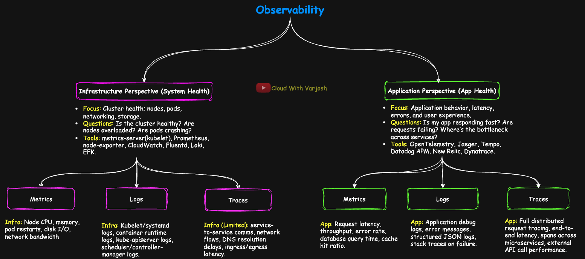
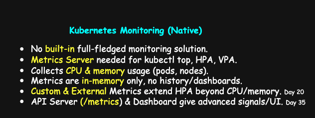
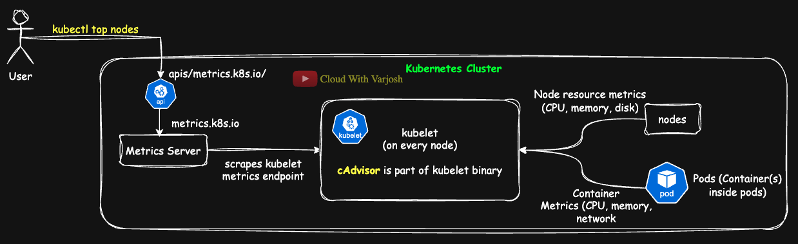
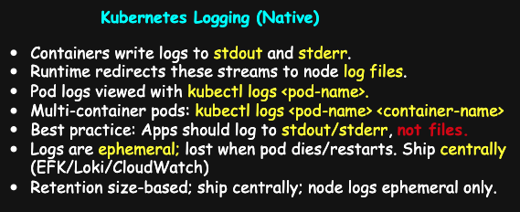

# Day 56: Kubernetes Monitoring & Logging Explained | CKA Course 2025

## Video reference for Day 56 is the following:

[](https://www.youtube.com/watch?v=EASFfeAywNw&ab_channel=CloudWithVarJosh)


---
## ⭐ Support the Project  
If this **repository** helps you, give it a ⭐ to show your support and help others discover it! 

---

## Table of Contents

- [Introduction](#introduction)  
- [1. What is Observability?](#1-what-is-observability)  
- [2. Two Perspectives of Observability (DevOps View)](#2-two-perspectives-of-observability-devops-view)  
  - [1. Infrastructure Observability](#1-infrastructure-observability)  
  - [2. Application Observability (APM – Application Performance Monitoring)](#2-application-observability-apm--application-performance-monitoring)  
- [Observability in AWS with Native Services](#observability-in-aws-with-native-services)  
- [3. The 3 Pillars of Observability](#3-the-3-pillars-of-observability)  
- [Metrics Server — Quick Install (Lab)](#metrics-server--quick-install-lab)  
  - [Step 1 — Install](#step-1--install)  
  - [Step 2 — Edit the Deployment](#step-2--edit-the-deployment)  
  - [Step 3 — Verify](#step-3--verify)  
- [If you used Day 54 (kubeadm + Calico Operator)](#if-you-used-day-54-kubeadm--calico-operator)  
- [Out-of-the-Box Monitoring and Logging in Kubernetes](#out-of-the-box-monitoring-and-logging-in-kubernetes)  
  - [Kubernetes Monitoring](#kubernetes-monitoring)  
    - [What do we want to monitor in a cluster?](#what-do-we-want-to-monitor-in-a-cluster)  
    - [Metrics Server Recap](#metrics-server-recap)  
    - [Types of Metrics in Kubernetes (for Autoscaling)](#types-of-metrics-in-kubernetes-for-autoscaling)  
    - [Beyond Metrics Server (add-ons & native signals)](#beyond-metrics-server-add-ons--native-signals)  
  - [Kubernetes Logging](#kubernetes-logging)  
- [Conclusion](#conclusion)  
- [References](#references)  


---

## Introduction

This module builds a ground-up view of Kubernetes observability: what it is, why it matters for dynamic, ephemeral workloads, and how DevOps/SREs must read a system from two complementary angles—**infrastructure** (nodes, pods, cluster health) and **application/APM** (latency, errors, user experience). You’ll see how the three pillars—**metrics, logs, traces**—map to both perspectives; which native signals Kubernetes exposes (Metrics API, component `/metrics`, logging paths); where add-ons like **metrics-server** and **kube-state-metrics** fit; and how enterprises often unify infra + app telemetry with platforms such as Datadog/Dynatrace or with **AWS-native** services (CloudWatch, **AMP**, **AMG**, X-Ray, RUM, Synthetics). The goal is a practical mental model you can apply in any cluster: know which signals exist, how to collect them, and how to turn them into action.

---

### **1. What is Observability?**

* Observability is the ability to understand the **internal state of a system** from the signals it produces (**metrics, logs, traces**).
* In Kubernetes, workloads are **dynamic and ephemeral**, so you cannot just SSH into nodes/pods — you need observability tools.
* **Analogy:** Think of observability like a doctor diagnosing a patient. A doctor doesn’t open up the body to see what’s wrong — instead, they look at external signals like pulse, blood pressure, and temperature. Similarly, in Kubernetes we rely on metrics, logs, and traces to understand what’s happening inside the cluster and applications.

---

### **2. Two Perspectives of Observability (DevOps View)**



As a DevOps/SRE engineer, you must look at observability from **two complementary angles**:

#### **1. Infrastructure Observability**

* **Focus:** Cluster health — nodes, pods, networking, storage.
* **Questions:** *Is the cluster healthy? Are nodes overloaded? Are pods crashing?*

**Infrastructure Observability Tools**

| Tool                     | What It Does                                                                                  | How It’s Used in Production                                                  |
| ------------------------ | --------------------------------------------------------------------------------------------- | ---------------------------------------------------------------------------- |
| **kubelet**              | Exposes pod/container stats (via cAdvisor) + logs at node level.                              | Base signal source; forms the foundation for metrics/log collection.         |
| **metrics-server**       | Collects CPU/memory usage from kubelets for short-term metrics. Powers `kubectl top` and HPA. | Lightweight monitoring; not used for historical trends.                      |
| **Prometheus**           | Scrapes, stores, and queries metrics (time-series database).                                  | Core monitoring system, often paired with Alertmanager + Grafana dashboards. |
| **node-exporter**        | Collects host-level metrics (disk I/O, network, filesystem).                                  | Runs as DaemonSet; enriches Prometheus monitoring with OS-level data.        |
| **Fluentd / Fluent Bit** | Collects and forwards logs to storage systems (Elasticsearch, Loki, Splunk).                  | Deployed cluster-wide for centralized log shipping.                          |
| **Loki**                 | Log aggregation optimized for cheap storage (indexes labels, not log text).                   | Scales better than ELK; often paired with Grafana + Prometheus.              |
| **EFK Stack**            | Elasticsearch (storage/search), Fluentd (collection), Kibana (visualization).                 | Classic enterprise log pipeline, still widely used for production clusters.  |

---

#### **2. Application Observability (APM – Application Performance Monitoring)**

* **Focus:** Application behavior, latency, errors, and user experience.
* **Questions:** *Is my app responding fast? Are requests failing? Where’s the bottleneck across services?*

**Application Observability (APM) Tools**

| Tool              | What It Does                                                           | How It’s Used in Production                                          |
| ----------------- | ---------------------------------------------------------------------- | -------------------------------------------------------------------- |
| **OpenTelemetry** | Standard framework for app instrumentation across metrics/logs/traces. | SDKs embedded in apps; exports data to backends like Jaeger/Datadog. |
| **Jaeger**        | Open-source distributed tracing system.                                | Visualizes request flows; used to debug latency in microservices.    |
| **Tempo**         | Scalable tracing backend from Grafana.                                 | Stores traces cheaply; integrated with Loki + Prometheus.            |
| **Datadog APM**   | SaaS-based full observability platform.                                | Collects app traces, metrics, and logs automatically; used at scale. |
| **New Relic**     | Cloud-based APM with app-level insights (transactions, errors, UX).    | Popular for hybrid workloads and enterprise apps.                    |
| **Dynatrace**     | Enterprise-grade observability platform with AI-driven RCA.            | Used in regulated industries needing deep insights + compliance.     |

---

**Enterprise Note:** Some platforms like **Datadog** and **Dynatrace** provide a **unified observability solution** that spans both **infrastructure** (nodes, clusters, containers) and **applications** (APM, distributed tracing, user experience). In production, enterprises often adopt these to avoid managing separate stacks for infra vs. apps.

✅ Both perspectives rely on the **same 3 pillars**, but apply them differently — Infra checks **system health**, while APM checks **application & user health**.

---

## **Observability in AWS with Native Services**

I wanted to give you a glimpse of how you can achieve both **infrastructure-level** and **application-level observability** in AWS using the native tools provided by AWS. CloudWatch is the central service here, but AWS also offers managed integrations like **Amazon Managed Service for Prometheus (AMP)** and **Amazon Managed Grafana (AMG)** for teams that prefer Kubernetes-native workflows.

**Infrastructure Observability** can be achieved with:

* **Metrics:** CloudWatch Metrics, Container Insights, AMP
* **Logs:** CloudWatch Logs, Logs Insights, Container Insights, AWS CloudTrail (for audit/security events)
* **Traces:** VPC Flow Logs, network-level telemetry, AWS Distro for OpenTelemetry (ADOT)

**Application Observability (APM)** can be achieved with:

* **Metrics:** CloudWatch Metrics, Application Signals (preview), AMP
* **Logs:** CloudWatch Logs (from Lambda, ECS/EKS, and application runtimes)
* **Traces:** AWS X-Ray, CloudWatch RUM (Real User Monitoring), CloudWatch Synthetics, CloudWatch Application Signals, ADOT

⚡ Together, these services give you the ability to collect **metrics, logs, and traces** across both infrastructure and applications — enabling full observability without leaving the AWS ecosystem.

---

### **3. The 3 Pillars of Observability**


* **Metrics**

  * *Infra:* Node CPU, memory, pod restarts, disk I/O, network bandwidth.
  * *App:* Request latency, throughput, error rate, database query time, cache hit ratio.

* **Logs**

  * *Infra:* Kubelet/systemd logs, container runtime logs, kube-apiserver logs, scheduler/controller-manager logs.
  * *App:* Application debug logs, error messages, structured JSON logs, stack traces on failure.

* **Traces**

  * *Infra:* Limited — service-to-service comms, network flows, DNS resolution delays, ingress/egress latency.
  * *App:* Full distributed request tracing, end-to-end latency, spans across microservices, external API call performance.

---

⚡ **Note:** Just like **DevOps is a culture** and not a single tool, **APM (Application Performance Monitoring)** is not a *fourth pillar*.
Instead, APM is the **practice of applying all 3 pillars — metrics, logs, and traces — to applications**, with the goal of understanding performance, dependencies, and user experience.

---

## Metrics Server — Quick Install (Lab)


### Step 1 — Install

```bash
kubectl apply -f https://github.com/kubernetes-sigs/metrics-server/releases/latest/download/components.yaml
```

### Step 2 — Edit the Deployment

```bash
kubectl edit deployment -n kube-system metrics-server
```

Add the following under the container’s `args:` list (these match your lab setup):

```yaml
spec:
  template:
    spec:
      containers:
      - name: metrics-server
        args:
          - --kubelet-insecure-tls          # disable cert verification (lab only)
          - --cert-dir=/tmp
          - --secure-port=10250
          - --kubelet-preferred-address-types=InternalIP,ExternalIP,Hostname
          - --kubelet-use-node-status-port
          - --metric-resolution=15s
```

> ⚠️ **Note (production):** Do **not** use `--kubelet-insecure-tls` in prod. Enable proper TLS (trusted CA, correct SANs) instead.

### Step 3 — Verify

Give it 1–2 minutes to settle, then:

```bash
kubectl top pods
kubectl top nodes
```

That’s it.

---

## If you used **Day 54 (kubeadm + Calico Operator)**

To make **Metrics Server** work, apply:

```bash
# Force VXLAN encapsulation on the active IPv4 pool
kubectl patch ippool default-ipv4-ippool --type=merge -p \
'{"spec":{"vxlanMode":"Always","ipipMode":"Never"}}'

# Restart Calico to reprogram routes
kubectl -n calico-system rollout restart ds/calico-node
kubectl -n calico-system rollout status ds/calico-node
```

**Previous vs Changed setting**

* **Previous:** `vxlanMode: CrossSubnet` — encapsulates **only across subnets**; on same-subnet paths it **doesn’t encapsulate** and expects L3 routing (BGP).
* **Changed:** `vxlanMode: Always` — **encapsulates all** pod traffic; **no BGP** needed.

**Why needed:**
With **CrossSubnet + BGP disabled** (Day 54 defaults), the **host (kube-apiserver) → ClusterIP/Pod IP** path can’t return on same-subnet traffic, so the Metrics API **times out** (FailedDiscoveryCheck).
Switching to **Always** tunnels that traffic over `vxlan.calico`, restoring host↔Service reachability—so `v1beta1.metrics.k8s.io` becomes **Available** and `kubectl top` works.

---

## **Out-of-the-Box Monitoring and Logging in Kubernetes**

### **Kubernetes Monitoring**



* Kubernetes by itself does **not ship with a full-fledged monitoring solution**.
* In our earlier lectures, we installed **Metrics Server** to collect resource usage metrics. Only after this, commands like `kubectl top` started working.

---

#### 🔎 What do we want to monitor in a cluster?

* Number of **nodes, pods, deployments, volumes**
* Resource utilization: **CPU, memory, storage, network**
* Pod restarts, crashes, and pending pods
* API server request latency and errors (advanced signals)

---

#### **Metrics Server Recap**

* **Purpose:** Collects CPU and memory usage from each kubelet (via embedded cAdvisor).
* **Autoscaling role:** Provides the **resource metrics** that power Kubernetes autoscalers. Without it, HPA and VPA cannot make scaling decisions.
* **Use cases:** Required for **Horizontal Pod Autoscaler (HPA)**, **Vertical Pod Autoscaler (VPA)**, and `kubectl top`.
* **Limitation:** It is **in-memory only** — metrics are **not stored long-term**. Once queried, they are gone.
* **Why important:** Despite limitations, it’s almost always installed because **autoscaling depends on it**.

---

### Metrics Server architecture (what happens on `kubectl top`)



* **You run** `kubectl top nodes/pods`. The client calls the **Aggregated API** on the kube-apiserver at `/apis/metrics.k8s.io/v1beta1/...`.
* The **API Aggregation Layer** **proxies** that request to the **metrics-server** Service.
* **metrics-server** returns the latest **NodeMetrics/PodMetrics** it keeps in memory. It populates these by **scraping each node’s kubelet** over HTTPS (**10250**) using the kubelet **Summary API** (`/stats/summary`).
* On every node, **kubelet** has **cAdvisor built in**, which gathers **container and node stats** (CPU, memory, network, filesystem) that feed the Summary API.

### What you get

* **Scope:** current CPU & memory for **pods** and **nodes** (no historical storage).
* **Consumers:** `kubectl top`, **HPA/VPA** (resource metrics via `metrics.k8s.io`).

### Key notes / gotchas

* **Not a full monitoring stack:** no long-term storage, alerting, or dashboards—pair with Prometheus/Grafana (or a SaaS).
* **Connectivity:** metrics-server must reach kubelet on **10250**; in labs you might use `--kubelet-insecure-tls` (avoid in prod).
* **If `top` fails:** check the `v1beta1.metrics.k8s.io` **APIService** status, metrics-server logs, and node reachability to **10250**.

---

#### **Types of Metrics in Kubernetes (for Autoscaling)**

* **Resource Metrics:** CPU & memory from kubelet/cAdvisor (via Metrics Server). Used directly by HPA and VPA.
* **Custom Metrics:** App-defined metrics (e.g., HTTP QPS, queue length), exposed via **Custom Metrics API** (via adapters like Prometheus Adapter). Enables autoscaling on app-specific KPIs.
* **External Metrics:** Metrics from outside the cluster (e.g., SQS queue size, Kafka lag), exposed via **External Metrics API**. Enables scaling workloads based on external demand.

> Both **Custom** and **External** metrics extend Kubernetes **autoscaling capabilities** beyond just CPU and memory usage.

---

### Beyond Metrics Server (add-ons & native signals)

| Component                           | Type        | What it gives you                                                                                                                                                  | Use it for                                                                                                                                                            | Watch-outs / Why                                                                                                                            |
| ----------------------------------- | ----------- | ------------------------------------------------------------------------------------------------------------------------------------------------------------------ | --------------------------------------------------------------------------------------------------------------------------------------------------------------------- | ------------------------------------------------------------------------------------------------------------------------------------------- |
| **Kube-State-Metrics (KSM)**        | Add-on      | **Kubernetes object state** as Prometheus metrics—e.g., desired vs available replicas, rollout status, pod phases/restarts, node conditions, HPA desired replicas. | Availability/SLO alerts (“Deployment not fully available”), rollout health dashboards, drift detection.                                                               | Not resource usage (CPU/mem); can create **high-cardinality** metrics—export only what you need, label carefully.                           |
| **API server & kubelet `/metrics`** | Native      | **Prometheus-format operational metrics**: API request rate/latency/errors/throttling; kubelet scheduler/eviction events, pod lifecycle, node runtime stats.       | Control-plane & node health SLOs, capacity/saturation alerts. **Prometheus/Grafana, Datadog, New Relic, etc. scrape these to show API server & kubelet utilization.** | Sensitive internals—**scrape in-cluster with RBAC**, don’t expose publicly; can be verbose—tune scrape intervals.                           |
| **Kubernetes Dashboard**            | Add-on (UI) | Web UI for objects, logs, basic Metrics-API data.                                                                                                                  | Quick triage in **dev/test**, demos, teaching.                                                                                                                        | **Security risk if misconfigured**—lock with OIDC/RBAC, avoid public exposure and broad tokens in prod; prefer Grafana for prod dashboards. |

> Mental model: **KSM = object health**, **`/metrics` = control-plane & node internals**, **Dashboard = convenience UI**.


---


### Kubernetes Logging



#### 0) What runs **as services** vs **as pods**

* **Services (systemd units on the node):** `kubelet`, `containerd` (or `cri-o`) — and `kube-proxy` on some older installs.
* **Pods (managed by kubelet):** Control plane (kubeadm static pods: API server, controller-manager, scheduler, etcd), `kube-proxy` (usual), CoreDNS, and **your applications**.

> Even when **journald** is used, you’ll still see text logs under **/var/log/** (e.g., `syslog`, `kern.log`) and Kubernetes container logs under **/var/log/containers** and **/var/log/pods**.

---

#### 1) **Services** (node daemons) → **journald**

Use `journalctl` to read systemd-managed logs.

```bash
# Follow kubelet / container runtime logs live
journalctl -u kubelet -f
journalctl -u containerd -f

# Helpful filters
journalctl -u kubelet --since "1 hour ago"
journalctl -u containerd -p warning   # warnings and above
```

* `-u` = service **unit**, `-f` = **follow** (tail).
* **Retention:** journald is size/time-based. If `/var/log/journal/` exists it’s **persistent**; otherwise logs are **volatile** across reboots. Limits in `/etc/systemd/journald.conf` (e.g., `SystemMaxUse`).
* **Caveat:** If the **node crashes/rebuilds**, local service logs may be **lost** unless shipped off-node.

---

#### 2) **Pods** (workloads + kubeadm control-plane) → **container logs**

Two ways to read:

**A) kubectl (preferred)**

```bash
kubectl logs <pod>                       # current container
kubectl logs <pod> <container>        # multi-container pod
kubectl logs -f <pod> [<container>]   # stream (follow)
kubectl logs <pod> <container> --previous  # prior crashed instance
```

* **What `kubectl logs` shows:** both **stdout (standard output)** and **stderr (standard error)** in one stream.

**B) On the node (files)**

```bash
ls -l /var/log/containers/                       # symlinks to pod logs
ls -l /var/log/pods/<namespace>_<pod>_<uid>/     # real files (CRI JSON)
```

* **Best practice for developers:** write logs to **stdout/stderr** (not app files) so Kubernetes can capture and ship them centrally.
* **Retention:** container logs rotate by **size/file-count** (kubelet/runtime settings). If the node dies, these files are **lost** unless exported.

---

#### 3) Why you still need **centralized logging**

Local (node) logs are **ephemeral** and **scattered**. In production, ship logs off-node for search, alerting, and retention:

* **Enterprise/SaaS:** Datadog, Splunk, New Relic, Dynatrace
* **Cloud-managed:** Amazon CloudWatch, Google Cloud Logging, Azure Monitor
* **Open source:** **EFK/ELK** (Fluent Bit/Fluentd → Elasticsearch → Kibana), **Loki** (Promtail/Fluent Bit → Loki → Grafana)

**Typical pipeline**

* **Workload logs:** tail `/var/log/containers/*.log`
* **Node/service logs:** read **journald** input

---

#### 4) Quick cheat-sheet (slide-ready)

* **Services → journald:** `journalctl -u kubelet -f`, `journalctl -u containerd -f`
* **Pods → kubectl:** `kubectl logs [-f] <pod> [<container>]`
* **On node (pods):** `/var/log/containers` → symlinks to `/var/log/pods`
* **Retention:** journald = size/time-based; containers = size/count rotation; **lost on node failure**
* **Prod:** ship to **central log system** (SaaS, cloud-managed, or OSS)


---

✅ **Key takeaway for developers:** Always write logs to **standard output (stdout)** and **standard error (stderr)**. Kubernetes takes care of collecting them, so your logs remain accessible through `kubectl logs` and can be integrated into centralized logging systems without extra work.

---

## Conclusion

Observability isn’t a tool—it’s a way of running systems. In Kubernetes, start with the **native signals**: container logs (stdout/stderr), Metrics API via **metrics-server**, and component `/metrics` endpoints. Add **kube-state-metrics** for object health, and choose a storage/visualization stack (Prometheus + Grafana, or a managed/SaaS platform). Keep the two lenses in view: **infra health** (capacity, saturation, failures) and **application health** (latency, errors, traces). For production, centralize logs and metrics, enforce RBAC for scraping control-plane endpoints, and integrate tracing (OpenTelemetry) so you can tie symptoms back to causes. With this foundation, you can scale, troubleshoot, and automate confidently.

---

## References

* [Metrics Server official GitHub repository](https://github.com/kubernetes-sigs/metrics-server)
* [Kube-State-Metrics official GitHub repository](https://github.com/kubernetes/kube-state-metrics)
* [Kubernetes logging architecture and guide](https://kubernetes.io/docs/concepts/cluster-administration/logging/)
* [Kubernetes instrumentation and metrics reference](https://kubernetes.io/docs/reference/instrumentation/metrics/)
* [Kubelet metrics endpoints and scraping](https://kubernetes.io/docs/reference/instrumentation/metrics/#kubelet-metrics)
* [AWS CloudWatch Container Insights documentation](https://docs.aws.amazon.com/AmazonCloudWatch/latest/monitoring/ContainerInsights.html)
* [Amazon Managed Service for Prometheus docs](https://docs.aws.amazon.com/prometheus/latest/userguide/what-is-Amazon-Managed-Service-Prometheus.html)
* [Amazon Managed Grafana service documentation](https://docs.aws.amazon.com/grafana/latest/userguide/what-is-Amazon-Managed-Grafana.html)
* [OpenTelemetry official docs for instrumentation](https://opentelemetry.io/docs/)

---


