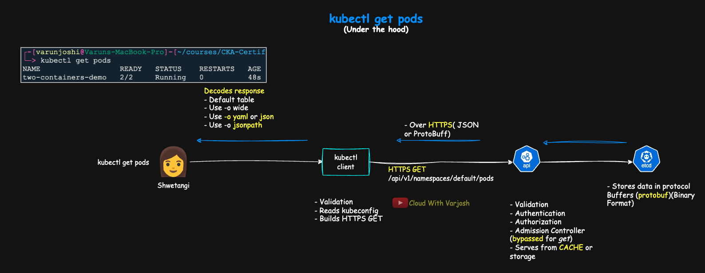

# Day 59: Kubernetes JSONPath with kubectl | CKA 2025

## Video reference for Day 59 is the following:

[](https://www.youtube.com/watch?v=IAZqe4QVt54&ab_channel=CloudWithVarJosh)


---
## ⭐ Support the Project  
If this **repository** helps you, give it a ⭐ to show your support and help others discover it! 

---

## Table of Contents

* [Introduction](#introduction)  
* [Prerequisites](#prerequisites)  
* [Behind the Scenes of kubectl get pods (Why It Matters for JSONPath)](#behind-the-scenes-of-kubectl-get-pods-why-it-matters-for-jsonpath)  
  * [Why this matters before we start JSONPath](#why-this-matters-before-we-start-jsonpath)  
  * [YAML ↔ JSON in Kubernetes](#yaml--json-in-kubernetes)  
* [Why JSONPath?](#why-jsonpath)  
* [What is JSONPath?](#what-is-jsonpath)  
  * [Core operators (you’ll use these 90% of the time)](#core-operators-youll-use-these-90-of-the-time)  
  * [Kubernetes-flavored examples](#kubernetes-flavored-examples)  
* [Practice locally first (single file)](#practice-locally-first-single-file)  
  * [Basics (why start from `$`?)](#basics-why-start-from-)  
  * [Containers (arrays & wildcards)](#containers-arrays--wildcards)  
  * [Indexing & filtering](#indexing--filtering)  
* [Using JSONPath with `kubectl` (tight, practical)](#using-jsonpath-with-kubectl-tight-practical)  
  * [Essentials](#essentials)  
  * [Apply on live objects (with annotated JSONPath)](#apply-on-live-objects-with-annotated-jsonpath)  
* [References](#references)  


---


## Introduction

We’ll demystify how `kubectl` talks to the API server, why the API shape is **JSON** even when you author **YAML**, and how to pull **exact fields** without drowning in full objects. You’ll practice core JSONPath operators, array filters, `kubectl`’s templating extensions, and the underrated `-o jsonpath-as-json` flag for emitting **valid JSON**. By the end, you’ll read cluster state like a laser—fast, precise, automatable.

**What you’ll learn (at a glance):**

* **Think in JSON, author in YAML.**
* **Root `$`, dots `.`, array wildcards `[*]`.**
* **Indexing `[0]` and filters `?(@.field=="val")`.**
* **`{range}{end}` loops for tabular prints.**
* **Quoting tricky keys and adding newlines.**
* **`jsonpath-as-json` for piping into `jq`.**
* **Selectors first, JSONPath second—speed & clarity.**

---

### Prerequisites

To get the most out of this lecture, be comfortable with **YAML**—it’s the format used by **Kubernetes**, **Ansible**, **Docker Compose**, **Prometheus** configs, and more. *(Note: **Terraform** primarily uses **HCL**, not YAML.)*

* **YAML Fundamentals — Notes:**
  [Day 09 GitHub Repo](https://github.com/CloudWithVarJosh/CKA-Certification-Course-2025/tree/main/Day%2009)  

* **YAML Fundamentals — Video:**
  [Day 09 on YouTube](https://www.youtube.com/watch?v=LT3U9fkOVDQ&ab_channel=CloudWithVarJosh)  

---


## Behind the Scenes of kubectl get pods (Why It Matters for JSONPath)



**From the moment **Shwetangi runs `kubectl get pods`** — what happens**

1. **kubectl builds the request**
    * **Reads kubeconfig** (cluster URL, CA, credentials), opens **HTTPS** to the API server.
    * **GET/LIST:** builds an **HTTPS GET** to `/api/v1/namespaces/<ns>/pods` (or `-A`) and sets `Accept` (e.g., `application/json;as=Table…`). **No request body**.
    * **CREATE/UPDATE/PATCH:** **serializes your YAML to JSON** and sends it as the **HTTPS request body** (`Content-Type: application/json`).

    > So: the wire is always **HTTPS**; for reads there’s **no JSON body**, for writes kubectl **sends JSON** in the body. Responses are returned as **JSON or protobuf**, then kubectl renders your chosen output.

    > **Note:** For **CREATE/UPDATE/PATCH**, `kubectl` accepts manifests in **YAML or JSON**. If you provide **YAML**, it’s parsed and **serialized to JSON** before sending; if you provide **JSON**, it’s used **as-is**. The request body is **JSON over HTTPS** with the appropriate `Content-Type` (e.g., `application/json`, or for patches: `application/strategic-merge-patch+json`, `application/merge-patch+json`, `application/json-patch+json`).


2. **API server processes it**

   * Runs **Authentication → Authorization (RBAC) → Admission** *(admission is effectively bypassed for GET)*.
   * Serves the list from its **watch cache** when warm; otherwise reads from **storage** (etcd).
    > The kube-apiserver maintains an in-memory watch cache so most GET/LIST/WATCH reads are served directly, avoiding an etcd access for every request.
   * In **etcd**, objects are stored efficiently in **Protocol Buffers (protobuf)**.

3. **Response comes back over HTTPS**

   * The API server returns data using **content negotiation**: **protobuf** for many built-in resources, **JSON** for others (e.g., “Table” view, discovery, many CRDs).

4. **kubectl decodes and renders for the terminal**

   * **Default table** (human-readable, selected columns).
   * **`-o wide`** → same table with extra columns (still not everything).
   * **`-o yaml` / `-o json`** → the **full object**.
   * **`-o jsonpath=…`** → only the **specific fields** you ask for.

---

### Why this matters before we start JSONPath

* **JSONPath runs on the decoded API object inside `kubectl`.** Even if the API server responds in **protobuf**, `kubectl` **decodes** it first and then applies your JSONPath—so the **wire format doesn’t matter**.
* The default `kubectl get` view is **summarized**; use **`-o json`/`-o yaml`** when you need the **full object**, or **`-o jsonpath=…`** to extract only specific fields.
* What you write in YAML maps 1:1 to JSON fields—e.g., `.spec.containers[*].image`—and that’s exactly the structure JSONPath walks.


---

### YAML ↔ JSON in Kubernetes

#### What they are (and how K8s uses them)

* **JSON — definition:** A **text-based data interchange format** for transmitting structured data as **objects (maps) and arrays (lists)**. It uses `{}` and `[]`, **double-quoted keys/strings**, and has **no comments**.

* **YAML — definition:** A **human-readable data serialization language** designed for configuration. It uses **indentation** and `-` for lists, **supports comments `#`**, and adds conveniences like multi-line strings and anchors.

* **Key relationship:** **All JSON is valid YAML (YAML 1.2 is a superset of JSON)**, but **not all YAML is valid JSON**.

* **kubectl accepts both** YAML and JSON for manifests; we typically **author in YAML** for readability.

* **On the wire:**

  * **Writes** (create/update/patch) → **JSON body over HTTPS**.
  * **Reads** (get/list/watch) → HTTPS request **without a body**; server replies **JSON or protobuf**; **etcd stores protobuf**.

* **For querying/automation, think in JSON** — that’s what **JSONPath**, `jq`, and the Kubernetes API docs use.


#### How they’re similar

* Represent the **same data**: objects/maps, arrays/lists, strings, numbers, booleans, null.
* Any manifest can be **converted losslessly** between YAML and JSON.
* Field paths are conceptually identical (e.g., `.spec.containers[0].image`).

#### How they differ (day-to-day authoring)

| Feature         | YAML                              | JSON                              |
| --------------- | --------------------------------- | --------------------------------- |
| **Readability** | Very human-friendly (indentation) | Machine-friendly, more explicit   |
| **Syntax**      | Indentation + `-` for lists       | `{}` objects, `[]` arrays, commas |
| **Comments**    | Yes (`# ...`)                     | No native comments                |
| **Typical use** | Config files (K8s, Ansible)       | APIs, tooling, web/app payloads   |
| **Extensions**  | `.yml` / `.yaml`                  | `.json`                           |
| **Style**       | Concise                           | Explicit/structured               |

> **Mental model:** YAML’s **indentation** maps to JSON’s **braces/brackets**; YAML list items (`-`) map to JSON array elements (`[ … ]` separated by commas).

#### Side-by-side: the same Pod in YAML and JSON

**YAML**

```yaml
apiVersion: v1
kind: Pod
metadata:
  name: two-containers-demo
  namespace: default
  labels:
    app: two-containers
spec:
  containers:
    - name: web
      image: nginx:1.27
      ports:
        - containerPort: 80
    - name: helper
      image: busybox:1.36
      args:
        - sh
        - -c
        - while true; do echo two-containers running; sleep 10; done
```

**JSON**

```json
{
  "apiVersion": "v1",
  "kind": "Pod",
  "metadata": {
    "name": "two-containers-demo",
    "namespace": "default",
    "labels": { "app": "two-containers" }
  },
  "spec": {
    "containers": [
      { "name": "web", "image": "nginx:1.27", "ports": [ { "containerPort": 80 } ] },
      { "name": "helper", "image": "busybox:1.36",
        "args": ["sh","-c","while true; do echo two-containers running; sleep 10; done"] }
    ]
  }
}
```

**Spot the mapping**

* **Lists:** YAML `-` → JSON `[ … ]`
* **Nesting:** YAML **indentation** → JSON `{}` / `[]`
* **Strings/keys:** YAML may omit quotes; JSON **must** quote keys and strings

**Why the top `{` (and when you’ll see `[` instead)**

* **Manifests:** A Kubernetes manifest defines **one resource**, so the JSON file is a **top-level object** → it **starts with `{`**.
* **API list responses:** Kubernetes still wraps results in a **top-level object** (e.g., `kind: PodList`) with an **`items` array** inside—**not** a raw top-level array.
* **When you’ll see `[`**: only after **you extract an array** yourself (e.g., `kubectl get pods -o json | jq '.items'`) or when calling non-K8s APIs that return arrays directly.

**Why this matters for JSONPath**

JSONPath walks the **JSON object tree** that the API returns (or that `kubectl` decodes, even if the wire used protobuf). Think in JSON paths:

* Kind → `$.kind`
* Name → `$.metadata.name`
* All container names → `$.spec.containers[*].name`
* Image of `web` → `$.spec.containers[?(@.name=="web")].image`
* Web container port → `$.spec.containers[?(@.name=="web")].ports[*].containerPort`


---

## Why JSONPath?

`kubectl` talks to the Kubernetes **API server**, which returns data in **JSON**. By default, `kubectl` renders that JSON into human-readable tables (and `-o wide` just adds a few extra columns). If you need **all** fields, you can always ask for the raw object:

```bash
kubectl get pod mypod -o json
kubectl get pod mypod -o yaml
```

In real clusters you’ll have **thousands** of objects (Pods/Deployments/StatefulSets/Services/ConfigMaps/Secrets, etc.). Scrolling the full JSON every time is slow. **JSONPath** lets you **extract exactly the fields you care about**—fast—so you can script, grep, or make focused decisions.

**In short:** JSONPath = *surgical reads from big JSON*, directly from `kubectl`.

---

## What is JSONPath?

**JSONPath** is a mini query language for **navigating JSON**: start at the **root** and select nested fields, array items, or only those items that match a **filter**. In Kubernetes, `kubectl -o jsonpath=…` applies the query to the **decoded API object** (even if the wire used protobuf).

### Core operators (you’ll use these 90% of the time)

* `$` — **root** of the document
* `.` — child field, e.g. `$.metadata.name`
* `[index]` — array index, e.g. `$.spec.containers[0]`
* `[*]` — array wildcard, e.g. `$.spec.containers[*].image`
* `?()` — **filter** inside arrays, e.g. `$.spec.containers[?(@.name=="web")]`

> Author manifests in YAML if you like; the API shape is **JSON**. JSONPath walks that JSON tree.

### Kubernetes-flavored examples

* Kind → `$.kind`
* Name → `$.metadata.name`
* All container names → `$.spec.containers[*].name`
* Image of `web` → `$.spec.containers[?(@.name=="web")].image`
* Web container port → `$.spec.containers[?(@.name=="web")].ports[*].containerPort`

---

## Practice locally first (single file)

We’ll use a small **pod.json** to get the feel. (You can also install a CLI like `@jsonpath-plus/cli` to run `jsonpath file '$.expr'` locally.)

**pod.json**

```json
{
  "apiVersion": "v1",
  "kind": "Pod",
  "metadata": {
    "name": "two-containers-demo",
    "namespace": "default",
    "labels": { "app": "two-containers" }
  },
  "spec": {
    "containers": [
      {
        "name": "web",
        "image": "nginx:1.27",
        "ports": [{ "containerPort": 80 }]
      },
      {
        "name": "helper",
        "image": "busybox:1.36",
        "args": ["sh", "-c", "while true; do echo two-containers running; sleep 10; done"]
      }
    ]
  }
}
```

### Basics (why start from `$`?)

`$` is the **root** of the JSON document. All paths begin there.

```bash
jsonpath pod.json '$.kind'
jsonpath pod.json '$.metadata.name'
jsonpath pod.json '$.metadata.namespace'
jsonpath pod.json '$.metadata.labels.app'
```

### Containers (arrays & wildcards)

```bash
# Names/images of all containers
jsonpath pod.json '$.spec.containers[*].name'
jsonpath pod.json '$.spec.containers[*].image'

# All declared containerPorts
jsonpath pod.json '$.spec.containers[*].ports[*].containerPort'

# The 'args' array for each container (if present)
jsonpath pod.json '$.spec.containers[*].args'
```

### Indexing & filtering

```bash
# First container's image (index 0)
jsonpath pod.json '$.spec.containers[0].image'

# Filter by a field inside each array element
jsonpath pod.json '$.spec.containers[?(@.name=="web")].image'
jsonpath pod.json '$.spec.containers[?(@.name=="web")].ports[*].containerPort'
```

> If you don’t have `jsonpath` installed locally, you can still copy these patterns into `kubectl -o jsonpath=...` once you query live objects.

---

## Using JSONPath with `kubectl` (tight, practical)

```bash
# General form
kubectl get <kind> [<name>] [-n <ns>] -o jsonpath='{<JSONPath>}'

# Need valid JSON (arrays/objects)? Use:
kubectl get <kind> -o jsonpath-as-json='{<JSONPath>}'
```

### Essentials

* **Quote the template:** `-o jsonpath='{...}'` (single quotes avoid shell expansion).
* **Newlines/tabs:** embed `{"\n"}` / `{"\t"}` inside the template.
* **Keys with dots/slashes:** quote them → `.metadata.annotations."checksum/config"`.
* **kubectl extensions:** supports `{range ...}{end}` for loops; filters on arrays `?(@.field=="val")`.
* **When you need real JSON for piping to `jq`:** prefer `-o jsonpath-as-json`.

---


### Apply on live objects (with annotated JSONPath)

#### Pods

```bash
# NOTE:
# .items      -> list responses (e.g., get pods) are objects with an "items" array
# [*]         -> wildcard over array elements
# {"\n"}      -> print a newline; {"\t"} prints a tab
# {range ...}{end} -> loop over a collection in kubectl's JSONPath

# All pod names (current namespace)
kubectl get pods -o jsonpath='{.items[*].metadata.name}{"\n"}'

# One pod → print "<podIP>\t<nodeName>"
kubectl get pod <pod> -o jsonpath='{.status.podIP}{"\t"}{.spec.nodeName}{"\n"}'

# All images across pods (one per line)
kubectl get pods -o jsonpath='{range .items[*]}{.spec.containers[*].image}{"\n"}{end}'
```

#### Deployments

```bash
# Images used by a Deployment (spec.template is the pod template)
kubectl get deploy <deploy> -o jsonpath='{.spec.template.spec.containers[*].image}{"\n"}'

# Desired / Ready replicas (joins two fields with " / ")
kubectl get deploy <deploy> -o jsonpath='{.spec.replicas}{" / "}{.status.readyReplicas}{"\n"}'
```

#### Services & Endpoints

```bash
# ClusterIP <tab> ports
kubectl get svc <svc> -o jsonpath='{.spec.clusterIP}{"\t"}{.spec.ports[*].port}{"\n"}'

# NodePorts (if any; prints space-separated values, then newline)
kubectl get svc <svc> -o jsonpath='{.spec.ports[*].nodePort}{"\n"}'

# Endpoint IPs for a Service (walk subsets -> addresses -> ip)
kubectl get endpoints <svc> -o jsonpath='{range .subsets[*].addresses[*]}{.ip}{"\n"}{end}'
```

#### Nodes

```bash
# Node names (space-separated, then newline)
kubectl get nodes -o jsonpath='{.items[*].metadata.name}{"\n"}'

# Node → simple Ready view (one line per node)
# Loops nodes; prints name, then loops all conditions as "Type=Status "
kubectl get nodes -o jsonpath='{range .items[*]}{.metadata.name}{"\t"}{range .status.conditions[*]}{.type}{"="}{.status}{" "}{end}{"\n"}{end}'
```

#### ConfigMaps & Secrets

```bash
# ConfigMap key containing dots must be quoted inside JSONPath
kubectl get cm <cm> -o jsonpath='{.data."key.with.dots"}{"\n"}'

# Secret values are base64 in .data; decode to view
kubectl get secret <sec> -o jsonpath='{.data.password}' | base64 -d; echo
```

---

**Quick legend (at a glance):**

* `.items` = array of objects in a list response (e.g., `PodList.items`).
* `[*]` = wildcard over an array.
* `{range X}{...}{end}` = iterate over `X`.
* `{"\n"}` / `{"\t"}` = newline / tab in output.
* Quote tricky keys: `.metadata.annotations."checksum/config"`.

---

### Pro tips

* **Use selectors first, then JSONPath:**
  `kubectl get pods -l app=web -o jsonpath='{.items[*].metadata.name}'`
  `kubectl get pods --field-selector=status.phase=Running -o jsonpath='{.items[*].metadata.name}'`
* **Filters work on arrays:** `?(@.field=="value")` (e.g., `@.status.phase=="Running"`).
* **Emit valid JSON when needed:**
  `kubectl get pods -o jsonpath-as-json='{.items[*].metadata.name}' | jq length`
* **If the template gets complex, switch to JSON + jq:**
  `kubectl get pods -o json | jq -r '.items[] | select(.status.phase=="Running") | .metadata.name'`

That’s the compact toolkit you’ll use in the exam and in real clusters.

---

## References

* [Kubernetes — JSONPath Support](https://kubernetes.io/docs/reference/kubectl/jsonpath/)
* [Kubernetes — Labels and Selectors](https://kubernetes.io/docs/concepts/overview/working-with-objects/labels/)
* [Kubernetes — Field Selectors](https://kubernetes.io/docs/concepts/overview/working-with-objects/field-selectors/)
* [Kubernetes — API Concepts](https://kubernetes.io/docs/reference/using-api/api-concepts/)
* [Goessner — JSONPath](https://goessner.net/articles/JsonPath/)
* [JSONPath Plus (GitHub)](https://github.com/JSONPath-Plus/JSONPath)
* [jq (Official Site)](https://jqlang.org/)

---
